# Introduccion

## C2 - Introducción a las bases de Datos

### ¿Qué es una base de datos?

Bases de datos por aquí, bases de datos por allá, pero ¿qué es una base de datos? Podemos decir que es un conjunto de datos pertenecientes a un mismo contexto organizados para un propósito específico. Una base de datos nos permite:

- Almacenar (agregar, modificar y eliminar) datos.
- Acceder a los datos.
- Manipularlos y combinarlos.
- Analizar datos.
- Entre otras cosas más.

Bases de datos las hay de dos tipos: relacionales y no relacionales. En lo particular, nosotros aprenderemos acerca de una base de datos relacional, ya que la misma nos permite comprender a profundidad cómo funcionan las bases de datos.

A su vez, dentro del mundo de las bases de datos relacionales existen varias opciones por las cuales nos podemos decantar. Puntualmente, nosotros veremos MySQL porque es una de las bases de datos más populares a nivel mundial y también es sencilla en su uso. Vayamos a ver qué puede hacer esta base de datos por nosotros. 

> Ver video: que es una base de datos


### Bases de datos versus Archivos planos

Muchas veces la simplicidad de tener un archivo al alcance de la mano nos lleva a elegirlo para guardar los datos.
Cuando hablamos de archivos hablamos de, por ejemplo, un Excel, un archivo de texto “txt o csv”, Google Sheets, Ms Access, entre otros.
Pero realmente ¿Es la mejor opción para el almacenamiento? Veamos qué características son las que definen esta elección:


### Motores de bases de datos

Vimos que las bases de datos realizan chequeos de:

- Integridad.
- Coherencia de los datos.
- Redundancia.

Además de otras funciones. Pero, ¿cómo realizan estas tareas? ¿Quién es el encargado de realizarlas? Busquemos estas respuestas en el siguiente video: 

> Ver video: Motores de bases de datos.

- Motor de base de datos = sistema de gestion de base de datos


> sql es el lenguaje estandar de las bases de datos


### Modelos de bases de datos

¿Cómo se comienza a desarrollar una base de datos? Normalmente se inicia con un requerimiento o necesidad de una aplicación o sistema.

Lo importante es tener en claro qué es lo que se tiene que almacenar, y es por ello que este requerimiento tiene que estar lo más detallado posible.

Una vez que tenemos el requerimiento, se inicia la etapa de modelado. Este documento nos permite validar que entendimos el requerimiento y empezar a pensar cómo lo vamos a implementar.

Una vez implementada la base de datos, este documento ¡no se elimina! Sino que sirve de documentación para volver a consultar y entender el porqué se implementó la base de datos de una determinada forma.

En la siguiente presentación tenemos el resumen sobre este documento tan importante:

> ver ppt: modelo de bases de datos

#### Modelado de datos

Un modelo es un conjunto de herramientas conceptuales para describir datos, sus relaciones, su significado y sus restricciones de consistencia.El modelado de datos es una manera de estructurar y organizar los datos para que se puedan utilizar fácilmente por las bases de datos.

**Beneficios**
- Registrar los requerimientos de datos de un proceso de negocio.
- Se puede descomponer un proceso complejo en partes.
- Permite observar patrones.
- Sirve de plano para construir la base de datos física.
- El modelo de datos ayuda a las empresas a comunicarse dentro y entre las organizaciones.
- Proporciona soporte ante los cambios de requerimientos del negocio o aplicaciones.

#### **Tipos de modelos**

Existen 3 tipos de modelos que podrían implementarse:


### **Modelo lógico**

Un modelo de datos lógico describe los datos con el mayor detalle posible, independientemente de cómo se implementarán físicamente en la base de datos.Describe los elementos importantes del negocio, qué significa cada objeto, su nivel de detalle, cómo se relacionan entre sí y sus restricciones.

Las características de un modelo de datos lógicos incluyen:

- Se definen cuáles son los conceptos importantes sobre los que hay que almacenar información. Estos elementos se denominan entidades.
- Se especifican todos los atributos para cada una de las entidades.●Se conectan las entidades mediante relaciones.
- Se especifica la clave principal para cada entidad.●Se especifican las claves externas (claves que identifican la relación entre diferentes entidades).
- La normalización ocurre en este nivel.

### **Modelo físico**

El modelo de datos físicos representa cómo se construirá el modelo en la base de datos.Un modelo de base de datos física muestra todas las estructuras de tablas, incluidos el nombre de columna, el tipo de datos de columna, las restricciones de columna, la clave principal, la clave externa y las relaciones entre las tablas.

Las características de un modelo de datos físicos incluyen:

- Especificación de todas las tablas y columnas.
- Las claves externas se usan para identificar relaciones entre tablas.
- La desnormalización puede ocurrir según los requisitos del usuario.

Las consideraciones físicas pueden hacer que el modelo de datos físicos sea bastante diferente del modelo de datos lógicos.

El modelo físico puede diferir de un motor de bases de datos a otro —no es lo mismo implementar en Ms. SQL Server que en MySQL—.

Los pasos para el diseño del modelo de datos físicos son los siguientes:
- Convertir entidades en tablas.
- Convertir relaciones en claves externas.
- Convertir atributos en columnas.
- Modificar el modelo de datos físicos en función de las restricciones / requisitos físicos.


### Cliente/Servidor

Las bases de datos se implementan bajo una arquitectura `Cliente - Servidor`.

Esta arquitectura tiene dos partes claramente diferenciadas, por un lado, la parte del servidor y, por otro, la parte de cliente o grupo de clientes.

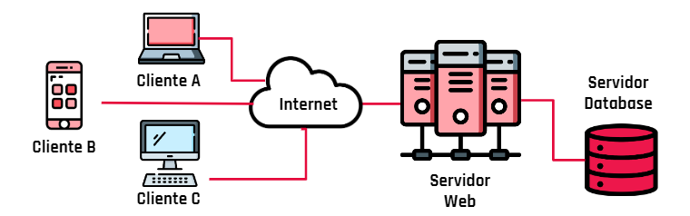

Esto se realiza así porque:

- El **servidor**, normalmente, es una “máquina” bastante potente con un hardware y software específico que actúa de depósito de datos y funciona como un sistema gestor de base de datos o aplicaciones.

- Los **clientes** suelen ser estaciones de trabajo que solicitan varios servicios al servidor. Son los que necesitan los servicios del servidor. Físicamente se pueden ver como distintas computadoras, celulares y dispositivos que se conectan con el servidor.

Es importante entender la arquitectura:

- Porque el servidor, va a ser el motor de bases de datos. En nuestro caso, MySQL Server.
- Nuestro cliente van a ser las aplicaciones que consulten o almacenen los datos. Por ejemplo, MySQL Workbench o, en el futuro, la aplicación que desarrollemos que va a interactuar con la base de datos.

**Quizz**

- ¿Qué es una base de datos?

Es un “almacén” que nos permite guardar grandes cantidades de información de forma organizada.

- ¿Cuál de las siguientes opciones es un ejemplo de base de datos?

La historia clínica de un paciente.

-  Las ventajas de usar una base de datos frente a archivos planos son 

 Integridad de datos, consistencia y redundancia de datos.

- ¿Qué se entiende por integridad de datos?

Se refiere a la corrección y exactitud de los datos en una base de datos.

- ¿Cuál de los siguientes ejemplos explica un problema de redundancia en un formulario de inscripción?

Que permita registrarse más de una vez.

- Cuando modelamos una base de datos, ¿qué modelado se realiza primero?

Modelado lógico

- Un modelo lógico está compuesto por

Entidades, atributos y relaciones.

> hacer actividad: Eventos.

> Practica: modelados.

# Modelado de Bases de datos

## C4 - Modelado de bases de datos

En este módulo vamos a trabajar en el modelado de datos.

Cómo vimos es el primer paso dentro de una implementación de una base de datos. Es importante porque no solo vamos a plasmar los requerimientos de aplicaciones sino que también vamos a traducir las reglas o restricciones que deben cumplir los datos.

¿Cómo lo vamos a realizar?

- Primero vamos a entender que implica un modelo.
- Vamos a trabajar entendiendo que datos tenemos que guardar.
- ¿Con qué nivel de detalle vamos a registrar datos?
- ¿Cómo se relacionan los datos?
- ¿Cómo llevar al motor de bases de datos estos modelos?

Se vienen clases muy interesantes y creativas donde tu participación es clave. 

> Ver ppt: Modelado de datos

 **Objetivos**

El objetivo de cualquier sistema de información es representar mediante abstracciones del mundo real toda la información necesaria para el cumplimiento de los fines. Para describir la estructura de una base de datos es necesario definir el concepto de modelo de datos, una colección de herramientas conceptuales para describir datos, relaciones entre ellos, semántica asociada a los datos y restricciones de consistencia.


**Tipos**

1. **Modelo conceptual basado en objetos**: Fue definido por Peter Chen en 1976. Se utiliza para la representación de la realidad No comprometida con ningún entorno informático: Sería el Modelo Entidad-Relación propiamente dicho.

2. **Modelo lógico basado en objetos**: determinan algunos criterios de almacenamiento y de operaciones de manipulación de los datos dentro de un entorno informático.

### Modelo de datos entidad-relación

El modelo de datos entidad-relación se basa en una percepción del mundo real, que consiste en un conjunto de objetos básicos llamados entidades y de relaciones entre ellos. Se emplea para interpretar, especificar y documentar los requerimientos para los sistemas de bases de datos.

**Modelo entidad-relación**: Por lo tanto un modelo entidad-relación es un método de representación abstracta del mundo real centrado en las restricciones o propiedades lógicas de una bases de datos

### Entidad

Una entidad es un objeto, real o abstracto, acerca del cual se recoge información de interés para la base de datos.

Dentro de nuestro sistema tendremos entidades y para integrarlos en nuestro diagrama los representaremos usando un rectángulo.Estas entidades son todos los objetivos sobre los cuales tenemos un interés de almacenar información.


**Tipos**

- **Entidades fuertes**: Tienen existencia por sí mismas. (alumnos, empleados, departamento.)
- **Entidades débiles**: Dependen de otra entidad para su existencia (hijos de empleados)

Se define como ocurrencia de entidad al conjunto de datos para una entidad en particular. Por ejemplo:125, Juan Pérez, casado, 23 años.Cada entidad tiene propiedades particulares llamadas atributos

### Atributos

Los atributos describen las características de una entidad. 
Por ejemplo: 
Entidad: clientes 
Atributos: legajo, nombre, domicilio, etc.

Son las características que van a definir a cada entidad. Por ejemplo, la entidad Películas podría tener estos atributos.


**Tipos**

1. Atributo con simple valor

Cuando un atributo tiene un simple valor para una identidad particular. Por ejemplo: Una persona que tiene un valor por su fecha de nacimiento y la fecha de nacimiento es un simple valor de la persona.

2. Atributo multivalor

Cuando un atributo tiene una serie de valores para identificarse.Por ejemplo: El atributo teléfonos de un cliente que puede contener uno o más números de teléfono.

3. Atributos derivados

Atributos derivados: Cuando los valores de un atributo son afines y el valor para este tipo de atributo se puede derivar de los valores de otros atributos. Por ejemplo: La edad y fecha de nacimiento de una persona; si conocemos la fecha de nacimiento, podemos calcular su edad, en este caso se dice que la edad es un atributo derivado del atributo fecha de nacimiento.

4. Atributo clave

Las entidades pueden contener un atributo que identifica cada una de las ocurrencias de la entidad. Es decir, usualmente contienen un atributo que diferencia los ítems entre sí.
Por ejemplo: En la entidad clientes el atributo documento puede ser un atributo clave. No necesariamente el atributo clave debe ser un solo atributo, hay casos en que varios atributos forman una llave. Por ejemplo: tipo más número de factura.

5. Atributos nulos: 

Se usa cuando una entidad no tiene valor para un atributo o que el valor es desconocido.

### Claves

1. Clave candidata

Se compone por uno o más atributos cuyos valores identifican unívocamente a cada ocurrencia de la entidad, sin que ningún subconjunto de ellos pueda realizar esta misma función. Una clave candidata es una posible clave primaria. Pueden definirse varias claves candidatas para luego seleccionar la más adecuada

2. Clave primaria

Está compuesta por uno o más atributos cuyos valores identifican unívocamentea cada ocurrencia de la entidad. No pueden contener valores nulos ni repetidos. Esta clave es una de aquellas que anteriormente se seleccionaron como candidata.

Una Clave Primaria o Primary Key es un campo que identifica a cada fila de una tabla de forma única. Es decir que No puede haber dos filas en una tabla que tengan la misma PK

Para identificar la clave primaria en una entidad, podemos escribir el atributo en negrita seguido de las iniciales PK entre paréntesis.


3. Superclave

es el conjunto de uno o más atributos que, tomados colectivamente, permiten identificar de forma unívoca a la ocurrencia de una entidad. Se utiliza generalmente en las tablas de relación, este concepto se desarrollará en las próximas clases.

4. Claves Foraneas

Claves que apuntas a una clave primaria de otra tabla, llamadas FK

## Datos

Los datos son los posibles valores que pueden tener los atributos. Nos permiten entender si son datos numéricos, textos, fechas, si tienen un formato en particular, si son obligatorios u opcionales. No se modelan, pero nos permite entender mejor las entidades.


## Convención de nombres

En  los  nombres  de entidades y atributos  siempre  se  debe  utilizar sustantivos en singular o plural. No se puede utilizar eñes, espacios ni acentos.  Si  el  nombre  se  compone  por  más  de  una  palabra,  se  deben reemplazar los espacios con guiones bajos “_” o eliminar dicho espacio y colocar una mayúscula en la inicial de cada palabra (CamelCase).

Ej. Así podríamos asignar un nombre para la siguiente frase:
- “costos anuales” →costo_anual → CostoAnual
- “costos anuales” →costos_anuales → CostosAnuales

Cabe aclarar que, debido a que MySQL utiliza directorios y archivos para almacenar  bases  de  datos  y  tablas,  los  nombres  se  distinguen  entre mayúsculas y minúsculas solo si el sistema operativo posee un sistema de archivo sensible al tipo.

- Windows: No distingue entre mayúsculas y minúsculas.
- Algunas versiones de Unix y Linux: Si distinguen entre mayúsculas y minúsculas. (Case Sensitive)

> Ver actividad caso UBER y actividad Playground
> ver actividad Playground 2

## C5 - Datos

Los datos o atributos de cada registro de una tabla tienen que ser de un tipode dato concreto.Cuando diseñamos una base de datos tenemos que pensar qué tipo de datosrequerimos para nuestro modelo.Cada  tipo  de  dato  tiene  un  tamaño  determinado  y  cuanta  más  precisiónapliquemos  en  su  definición,  más rápido  y performante  va  a  funcionarMySQL


** Tipos de datos**

### Datos de tipo texto

Almacenan datos alfanuméricos y símbolos.

`CHAR(n)`

n→ 1 a 255 caracteres.

Se recomienda utilizar en cadenas de texto de longitud poco variable.

Ej.: La longitud de la palabra “HOLA” es 4 y se define:Char(4).

`VARCHAR(n`) 

n→ 1 a 21.845 caracteres.

Se recomienda utilizar en cadenas de texto de longitud muy variable.

Ej.: La longitud de la palabra “HASTA LUEGO” es 11 y se define: Varchar(11).

> Nota: La letra n indica la longitud máxima de caracteres a utilizar.

`TINYTEXT`

0 a 255 caracteres.

`MEDIUMTEXT` 

0 a 16.777.215 caracteres.

`TEXT`

0 a 4.294.967.295 caracteres.

`LONGTEXT`

0 a 18.446.744.073.709.551.615 caracteres.
La longitud máxima permitida depende de la configuración del protocolo cliente-servidor y la memoria disponible.

### Datos de tipo numérico entero

`TINYINT`

-128 a 128 (sin signo de 0 a 255 dígitos)

`SMALLINT`

-32.768 a 32.767 (sin signo de 0 a 65.535 dígitos)

`MEDIUMINT`

-8.388.608 a 8.388.607 (sin signo de 0 a 16.777.215 dígitos)

`INT`

-2.147.483.648 a 2.147.483.647 (sin signo de 0 a 4.294.967.295 dígitos)

`BIGINT`

-9.223.372.036.854.775.808 a 9.223.372.036.854.775.807(sin signo de 0 a 18.446.744.073.709.551.615 dígitos)

### Datos de tipo numérico decimal

`FLOAT(n,d)`

Almacenan números de coma flotante pequeño.
Tienen precisión simple para la parte decimal (máx. 7 dígitos).
n→ 1 a 24 dígitos (incluyendo la parte decimal).
d→ 0 a 7 dígitos dependiendo de cuánto se asigne en n.

`DOUBLE(n,d)`

Almacenan números de coma flotante grande.
Tienen precisión doble para la parte decimal (máx. 15 dígitos).
n→ 25 a 53 dígitos (incluyendo la parte decimal).
d→ 0 a 15 dígitos dependiendo de cuánto se asigne en n.

>Nota: Las letras n y d indican la longitud máxima de dígitos a utilizar.


### Datos de tipofecha

A la hora de almacenar fechas, hay que tener en cuenta que MySQL nocomprueba de una manera estricta si una fecha es válida o no.

`DATE`

Almacena solamente la fecha en formato YYYY-MM-DD.
Valores permitidos: '0001-01-01' a '9999-12-31'.
La fecha se debe colocar entre comillas simples o dobles y se separa porguiones. Ejemplo: '2021-05-15'.

`TIME`

Almacena solamente la hora en formato HH:MM:SS.
Valores permitidos: '00:00:00' a '23:59:59'.
La hora se debe colocar entre comillas simples o dobles y se separa por dos puntos. 
Ejemplo: '11:50:55'.

`DATETIME`

Almacena la fecha y hora en formato YYYY-MM-DD HH:MM:SS.
Valores permitidos:  '0001-01-01 00:00:00' a '23:59:59 9999-12-31'.
La fecha se debe colocar entre comillas simples o dobles, un espacio y la hora que se debe separar por dos puntos. 
Ejemplo: '2021-05-15 11:50:55'.

### Datos de tipo boolean

`BOOLEAN`

MySQL guarda los booleanos como un cero o como un uno. Por cuestiones de performance, este tipo de dato viene desactivado y no se recomienda su uso.

En el caso de querer guardar valores "verdaderos" y "falsos", se recomienda utilizar el tipo de dato tinyint(1), donde:
- 0 para representar el false.
- 1 para representar el true.

[Glosario: Tipo de datos](https://view.genial.ly/6050a721efec6a0d15177bbe)

> ver actividad - tipo de datos.

# C7 - Relaciones

Cuando estamos modelando y detectamos las entidades o tablas, es normal que se relacionen entre sí.
Por ejemplo, podríamos tener una tabla que almacene los datos de los Alumnos y otra tabla que almacene las Asistencias a cada una de las clases que cursa.
¿Vamos a repetir TODOS los datos del alumno asistencia por asistencia? ¿O nos conviene simplemente tener el identificador de Alumno por Asistencia a clase?
Si elegiste este último escenario, ¡Estás en lo cierto!
Y podemos notar que estas dos tablas están relacionadas entre sí. Pues si queremos saber el nivel de asistencia de un alumno debemos conectarlas.
A esto lo llamamos RELACIONES y vale aclarar que hay de varios tipos. Vayamos entonces a conocer un poco más acerca de estas.

> ver video relaciones

Las relaciones indican cómo se van a relacionar dos tablas. 
Dentro de una base de datos existen 3 tipos de relaciones:
- Uno a uno.●Uno a muchos.
- Muchos a muchos.¿Cómo podemos saber cómo se relaciona una entidad con otra?Planteando un ejemplo concreto que nos ayude a definir cómo interactúan esas dos entidades entre sí.

**Cardinalidad**

Es la forma en que se relacionan las entidades


> Muchas veces vemos las notaciones como 1 a N o 1 a M. Son iguales, la letra se utiliza para representar “Muchos”.

## Uno a uno (1:1)

Un usuario tiene solo una dirección. Una dirección pertenece solo a un usuario.Para establecer la relación colocamos la clave primaria de la dirección en la tabla de usuarios, indicando que esa dirección está asociada a ese usuario (Clave foránea)


## Uno a muchos (1:N)

Un cliente puede tener muchas tarjetas. Una tarjeta pertenece solo a un cliente.Para establecer la relación colocamos la clave primaria del cliente en la tabla de tarjetas, indicando que esas tarjetas están asociadas a un usuario en particular.

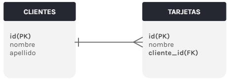

## Muchos a muchos (N:M)

Un cliente puede comprar muchos productos. Un producto puede ser comprado por muchos clientes.En las relaciones N:M, en la base de datos, la relación en sí pasa a ser una tabla. Esta tabla intermedia —también conocida como tabla pivot— puede tener 3 datos: una clave primaria (PK) y dos claves foráneas (FK), cada una haciendo referencia a cada tabla de la relación.

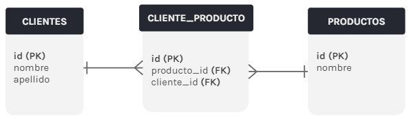

En este ejemplo, cliente_producto sería nuestra tabla intermedia. Cada fila de esta tabla representa un cruce entre cliente y producto. Podría ser, en este caso, una compra:●La fila 1 indica que el cliente 1 (Juan) compró el producto 1 (Pelota).●La fila 2 indica que Juan también compró el producto 2 (Laptop).●La fila 3 indica que una Laptop también fue comprada por el cliente 3 (Marta).


> ver actividad de playground DER
> ver actividad salud DH
> Ver actividad universo lector

# SQL

Bienvenidos a un nuevo módulo de Base de Datos.

En este módulo seguimos adentrándonos en el mundo de las bases de datos relacionales y, en particular, aprenderemos a:

- Crear bases de datos.
- Hacer consultas que nos permitan insertar, actualizar y eliminar registros de una tabla.
- Traer datos de una tabla de manera general o aplicando diversos filtros de búsqueda.
- Limitar la cantidad de resultados generados por una determinada búsqueda.
- Usar algunas funciones nativas de MySQL para que podamos filtrar y organizar los datos obtenidos de una manera mucho más eficiente.
- Relacionar distintas tablas.
- Hacer foco en cómo obtener reportes o informes específicos.

En conclusión, es un módulo en donde vamos a conocer los principales secretos del trabajo con bases de datos. Así que manos a la obra y a poner mucha atención en los conceptos aquí expuestos.

El **DDL** o Lenguaje de Definición de Datos consiste en realidad en los comandos SQL que se pueden utilizar para definir el esquema de la base de datos. Se trata simplemente de descripciones del esquema de la base de datos y se utiliza para crear y modificar la estructura de los objetos de la base de datos.

Las sentencias **DQL** se utilizan para realizar consultas sobre los datos de los objetos del esquema. El propósito del comando DQL es obtener alguna relación del esquema basada en la consulta que se le pasa. 

**DML** (Lenguaje de Manipulación de Datos): Los comandos SQL que se ocupan de la manipulación de los datos presentes en la base de datos pertenecen al DML o Lenguaje de Manipulación de Datos y esto incluye la mayoría de las sentencias SQL. 

**DCL** (Lenguaje de Control de Datos): DCL incluye comandos como GRANT y REVOKE que se ocupan principalmente de los derechos, permisos y otros controles del sistema de base de datos. 

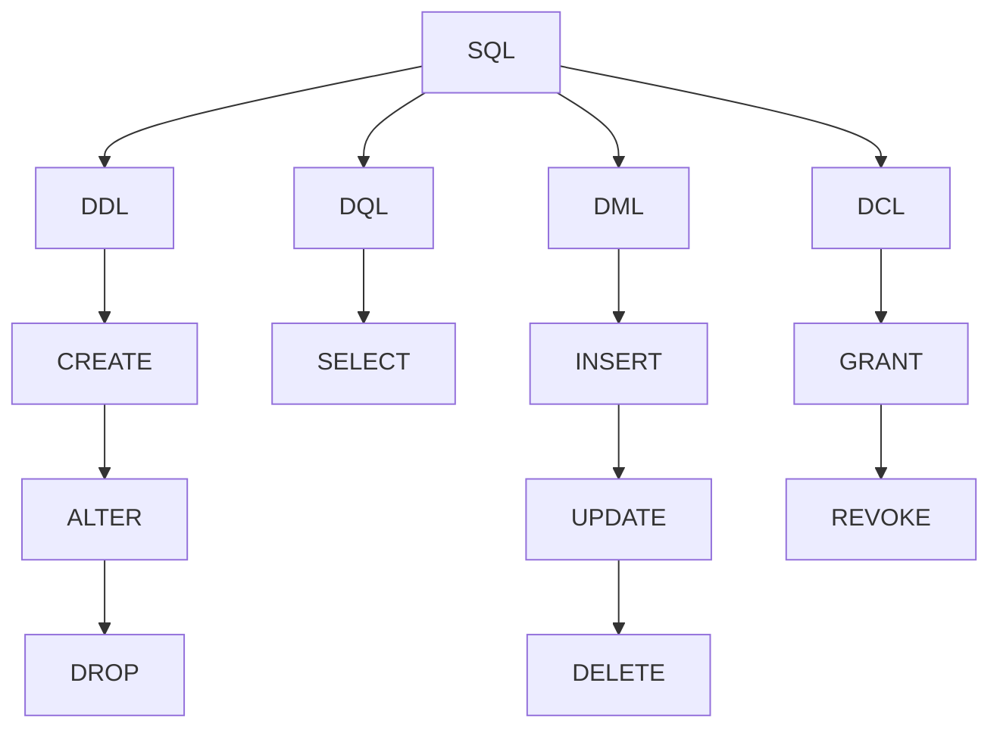

> Las palabras clave se usan en MAYUS

# **Operadores**

```
=   Igual a
>   Mayor que
>=  Mayor o igual que
<   Menor que
<=  Menor o igual que
<>  Diferente a
!=  Diferente a

&gt; > (greater than) mayor que
&lt; < (less than) menor que

IS NULL     Es nulo
BETWEEN     Entre dos valores
IN          Lista de valores
LIKE        Se ajusta a...
```
`ORDEN DE SINTAXIS de una QUERY`

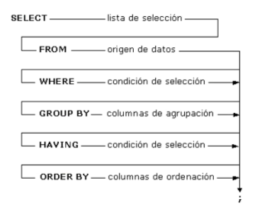
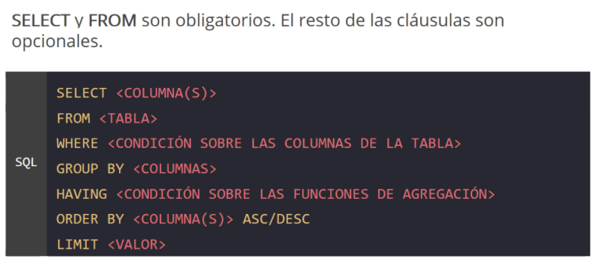

**Ejemplos**

```
SELECT primer_nombre, apellido
FROM clientes
WHERE pais <> ‘Argentina’;
```
```
SELECT primer_nombre, apellido
FROM clientes
WHERE id < 15;
```
```
SELECT primer_nombre, apellido
FROM clientes
WHERE id > 5;
```
```
SELECT *
FROM canciones
WHERE id >= 3
AND id < 8;
```
```
SELECT *
FROM canciones
WHERE id = 2
OR id = 6
```
```
DELETE FROM usuarios
WHERE id = 2;
```
> Si no se pone el WHERE se borra toda la tabla

## CONSTRAINTS

- `NOT NULL` - Ensures that a column cannot have a NULL value
- `UNIQUE` - Ensures that all values in a column are different
- `PRIMARY KEY` - A combination of a NOT NULL and UNIQUE. Uniquely identifies each row in a table
- `FOREIGN KEY` - Prevents actions that would destroy links between tables
- `CHECK` - Ensures that the values in a column satisfies a specific condition
- `DEFAULT` - Sets a default value for a column if no value is specified
- `CREATE INDEX` - Used to create and retrieve data from the database very quickly


# Create, drop, alter

Las directrices create, drop y alter nos van a permitir llevar a cabo cada una de estas acciones que, vale la pena mencionar, son bastante habituales dentro del proceso de trabajo con bases de datos.

Sin más, démosle una vista al siguiente video para que conocer mucho más al respecto.

## **`CREATE DATABASE`**

Podemos crear una base de datos desde cero.

```
CREATE DATABASE miprimerabasededatos;
USE miprimerabasededatos;
```

## **`CREATE TABLE`**

Con CREATE TABLE podemos crear una tabla desde cero, junto con sus columnas, tipos y constraints.

```
CREATE TABLE nombre_de_la_tabla (
    nombre_de_la_columna_1 TIPO_DE_DATO CONSTRAINT,
    nombre_de_la_columna_2 TIPO_DE_DATO CONSTRAINT
)
```
```
CREATE TABLE post (
    id INT PRIMARY KEY AUTO_INCREMENT,
    titulo VARCHAR(200)
)
```
**Ejemplo** 
```
CREATE TABLE peliculas (
    id INT PRIMARY KEY AUTO_INCREMENT,
    title VARCHAR(500) NOT NULL,
    rating DECIMAL(3,1) NOT NULL,
    awards INT DEFAULT 0,
    release_date DATE NOT NULL,
    length INT NOT NULL
);
```

## **`FOREIGN KEY`**

Cuando creemos una columna que contenga una id foránea, será necesario usar la sentencia `FOREIGN KEY` para aclarar a qué tabla y a qué columna hace referencia aquel dato.

Es importante remarcar que la tabla “clientes” deberá existir antes de correr esta sentencia para crear la tabla “ordenes”.

```
CREATE TABLE ordenes (
    orden_id INT NOT NULL,
    orden_numero INT NOT NULL,
    cliente_id INT,
    PRIMARY KEY (orden_id),
    FOREIGN KEY (cliente_id) REFERENCES clientes(id)
);
```

## **`DROP TABLE`**

Borrará la tabla que le especifiquemos en la sentencia.

```
DROP TABLE IF EXIST peliculas;
```

## **`ALTER TABLE`**

Permite alterar una tabla ya existente y va a operar con tres comandos:
- **`ADD`**: para agregar una columna.
- **`MODIFY`**: para modificar una columna.
- **`DROP`**: para borrar una columna.

**Ejemplos**

Agrega la columna rating, aclarando tipo de dato y constraint.
```
ALTER TABLE peliculas
ADD rating DECIMAL(3,1) NOT NULL;
```
Modifica el decimal de la columna rating. Aunque el resto de las configuraciones de la tabla no se modifiquen, es necesario escribirlas en la sentencia.
```
ALTER TABLE peliculas
MODIFY rating DECIMAL(4,1) NOT NULL;
```
Borra la columna rating.
```
ALTER TABLE peliculas
DROP rating;
```

# Insert, update, delete

Insert nos va a permitir agregar datos, con delete podremos borrarlos y con update podremos modificar los registros existentes en una tabla.

## **`INSERT`**

Existen dos formas de agregar datos en una tabla:
- Insertando datos en todas las columnas.
- Insertando datos en las columnas que especifiquemos

### **Todas las columnas**

Si estamos insertando datos en todas las columnas, no hace falta aclarar los nombres de cada columna. Sin embargo, el orden en el que insertemos los valores, deberá ser el mismo orden que tengan asignadas las columnas en la tabla. 
```
INSERT INTO table_name (columna_1, columna_2, columna_3, ...)
VALUES (valor_1, valor_2, valor_3, ...);
```
```
INSERT INTO artistas (id, nombre, rating)
VALUES (DEFAULT, 'Shakira', 1.0);
```
### **Columnas específicas**

Para insertar datos en una columna en específico, aclaramos la tabla y luego escribimos el nombre de la o las columnas entre los paréntesis. 
```
INSERT INTO artistas (nombre)
VALUES ('Calle 13');
```
```
INSERT INTO artistas (nombre, rating) 
VALUES (‘Maluma’, 1.0);
```

## **`UPDATE`**

`UPDATE` modificará los registros existentes de una tabla. Al igual que con `DELETE`, es importante no olvidar el `WHERE` cuando escribimos la sentencia, aclarando la condición.

```
UPDATE nombre_tabla
SET columna_1 = valor_1, columna_2 = valor_2, ...
WHERE condición;
```
```
UPDATE artistas
SET nombre = 'Charly Garcia', rating = 1.0
WHERE id = 1;
```

## **`DELETE`**

Con `DELETE` podemos borrar información de una tabla. Es importante recordar utilizar siempre el `WHERE` en la sentencia para agregar la condición de cuáles son las filas que queremos eliminar. Si no escribimos el `WHERE`, estaríamos borrando toda la tabla y no un registro en particular. 

```
DELETE FROM nombre_tabla WHERE condición;
```
```
DELETE FROM artistas WHERE id = 4;
```

## **`SELECT`**

Toda consulta a la base de datos va a empezar con la palabra `SELECT`. 
Su funcionalidad es la de realizar consultas sobre una  o varias columnas de una tabla.
Para especificar sobre qué tabla queremos realizar esa consulta usamos la palabra FROM seguida del nombre de la tabla.

```
SELECT nombre_columna, nombre_columna, ...
FROM nombre_tabla;
```
**Ejemplo**

Para conocer solamente los títulos y ratings de las 
películas guardadas en la tabla películas, podríamos hacerlo ejecutando la siguiente consulta:
```
SELECT id, titulo, rating
FROM peliculas;
```
Selecciono la tabla albumes

```
SELECT * FROM albumes
```
buscando solo el titulo de la tabla albumes

```
SELECT titulo FROM albumes
```

# WHERE y ORDER BY

## **`WHERE`**

Permite filtrar por campos de las tablas

La funcionalidad del `WHERE` es la de condicionar y filtrar las consultas `SELECT` que se realizan a una base de datos.
```
SELECT attribute-list
   FROM table-name
   WHERE condition
```
```
SELECT nombre_columna_1, nombre_columna_2, ...
FROM nombre_tabla
WHERE condicion;
```
Teniendo una tabla *clientes*, podría consultar primer nombre y apellido, filtrando con un `WHERE` solamente los usuarios que su país es igual a *Argentina* de la siguiente manera:

```
SELECT primer_nombre, apellido
FROM clientes
WHERE pais = ‘Argentina’;
```

## **`ORDER BY`**

Se utiliza para ordenar los resultados de una consulta `según el valor de la columna especificada`. Por defecto, se ordena de forma ascendente `ASC` según los valores de la columna. También se puede ordenar de manera descendente `DESC` aclarándolo en la consulta.
```
SELECT nombre_columna1, nombre_columna2
FROM tabla
WHERE condicion
ORDER BY nombre_columna1;
```
**Ejemplo**

Teniendo una tabla `usuarios`, podría consultar los nombres, filtrar con un `WHERE` solamente los usuarios `mayores de 21 años` y ordenarlos de forma descendente tomando como referencia la columna nombre.

```
SELECT nombre, rating
FROM artistas
WHERE rating > 1.0
ORDER BY nombre DESC;
```
**Mas ejemplos**

```
SELECT * FROM movies
WHERE rating > 5
ORDER BY rating
```
agregar otra condicion, `WHERE` va una sola vez.

```
SELECT * FROM albumes
WHERE id <> 1 AND id > 6
```
el `ORDER` va despues el `WHERE` (no siempre va el WHERE para el ORDER), ordeno por nombre descendiente, y si hay nombres iguales desempato con `,` y el criterio de desempate, rating y DESC si queremos

```
SELECT firts_name, last_name FROM actors
WHERE rating > 2
ORDER BY firts_name DESC, rating DESC
```

# BETWEEN y LIKE

Las consultas a las bases de datos, tradicionalmente, están compuestas de varios filtros.

¿Qué pasaría si queremos traer las facturas emitidas del 2010? Seguramente vamos a necesitar buscar las mismas por fecha en la base de datos.

Y si queremos saber ¿qué películas comienzan con la palabra "Toy"? Seguramente vamos a necesitar consultar textos en la base de datos.

Las directrices Between y Like son fundamentales para poder poder hacer consultas, filtros y más.

## **`BETWEEN`**

Cuando necesitamos obtener valores dentro de un rango, usamos el operador BETWEEN.

-   Incluye los extremos.
-   Funciona con números, textos y fechas.
-   Se usa como un filtro de un WHERE.

**Ejemplo**

Dados los números: 4, 7, 2, 9, 1.
Si hiciéramos un BETWEEN entre 2 y 7 devolvería 4, 7, 2 (excluye el 9 y el 1, e incluye el 2)

```
SELECT * FROM movies
WHERE rating BETWEEN 7 AND 10
```

Con la siguiente consulta estaríamos seleccionando nombre y edad de la
tabla alumnos solo cuando las edades estén entre 6 y 12.

```
SELECT nombre, edad
FROM alumnos
WHERE edad BETWEEN 6 AND 12;
```

## **`LIKE`**

Cuando hacemos un filtro con un WHERE, podemos especificar un patrón de búsqueda que nos permita especificar algo concreto que queremos encontrar en los registros. Eso lo logramos utilizando comodines
(wildcards).

Por ejemplo, podríamos querer buscar:

- Los nombres que tengan la letra 'a' como segundo carácter.
- Las direcciones postales que incluyan la calle 'Monroe'.
- Los clientes que empiecen con 'Los' y terminen con 's’.

## **`COMODÍN %`**

Es un sustituto que representa cero, uno, o varios caracteres.
Permite filtrar textos: que aparezcan nombres, letras usamos el % como comodin parabuscar por ej titulos que comiencen con A.

```
SELECT * FROM movies
WHERE title LIKE 'AVATAR'
```

Con el comodin...

```
SELECT * FROM movies
WHERE title LIKE 'a%'
```

que terminen con s

```
SELECT * FROM movies
WHERE title LIKE '%s'
```

no importa lo que haya antes o despues, la a antes de la t:

```
SELECT * FROM movies
WHERE title LIKE '%a%t%'
```
**Ejemplos:**

Devuelve aquellos nombres que tengan la letra 'a' como segundo carácter.

```
SELECT nombre
FROM usuarios
WHERE edad LIKE '_a%';
```
Devuelve las direcciones de los usuarios que incluyan la calle 'Monroe'.

```
SELECT nombre
FROM usuarios
WHERE direccion LIKE '%Monroe%';
```
Devuelve los clientes que empiecen con 'Los' y terminen con 's’.

```
SELECT nombre
FROM clientes
WHERE nombre LIKE 'Los%s';
```
Segunda letra '_a%'

**QUIZ**:

Ahora que ya tenemos los nombres de los clientes necesitamos que obtengas sólo aquellos que sean de USA.

Insertá el nombre del tercer cliente que obtuviste.

Pista: En este ejercicio tenes que generar el Select en Workbench, ejecutar y del listado de resultados, buscar lo que se solicita en el enunciado.

```
SELECT primer_nombre FROM clientes
WHERE pais = 'USA'
```

## **`IN`**

Que esten los id 3, 6, 9

```
SELECT * FROM pedido WHERE id IN (3,6,9)
```
Que no esten el 3, 6, 9 

```
SELECT * FROM pedido WHERE id NOT IN (3,6,9)
```

# Limit y OFFSET

Imaginemos que nos solicitan hacer el buscador de la aplicación en la que estamos trabajando y, cuando realizamos la respectiva consulta, se muestran los resultados de búsqueda y son cientos y cientos de filas, pero nuestro Cliente nos solicitó que los resultados se mostrarán de 20 en 20.

¿Cómo podemos hacer entonces para que la consulta nos traiga de a 20 filas? Y más importante aún, ¿cómo podemos hacer para pedir las 20 siguientes en cada paginación?

Bien. Las directrices LIMIT y OFFSET son las herramientas necesarias para llevar a cabo tal fin. Así que no perdamos más tiempo y veamos cómo se implementan.

## **`LIMIT`**

Su funcionalidad es la de limitar el número de filas (registros/resultados) devueltas en las consultas `SELECT`. También establece el número máximo de registros a eliminar con `DELETE`.

```
SELECT nombre_columna1, nombre_columna2
FROM nombre_tabla
LIMIT cantidad_de_registros;
```

Nos deja limitar cuantos resultados vemos
de los resultados solo me interesan ej: 2

```
SELECT * FROM movies LIMIT 2
```

Cuando me interesa el top 10:

```
SELECT firts_name, last_name, rating FROM actors
ORDER BY rating DESC
LIMIT 10
```
**Ejemplos**

Teniendo una tabla peliculas, podríamos armar un top 10 con las películas que tengan más de 4 premios usando un `LIMIT` en la siguiente consulta:

```
SELECT *
FROM peliculas
WHERE premios > 4
LIMIT 10;
```

## **`OFFSET`**

En un escenario en donde hacemos una consulta de todas las películas de la base de datos, la misma nos devolvería muchos registros.

Usando un `LIMIT` podríamos aclarar un límite de 20.
- ¿Pero cómo haríamos si quisiéramos recuperar sólo 20 películas pero salteando las primeras 10 de la tabla?
- OFFSET nos permite especificar a partir de qué fila comenzar la recuperación de los datos solicitados.

Nos permite saltear resultados, util para paginados
Quiero ver 5 resultados desde el numero 5,

```
SELECT firts_name, last_name, rating FROM actors
ORDER BY rating DESC
LIMIT 10
OFFSET 5
```

## **`Alias AS`**

Imaginemos que estamos trabajando con una base de datos cuyas columnas de las tablas están en inglés, pero nos solicitan expresamente que los resultados de las consultas deben traer el nombre de las columnas en español.

cambio como se ven los resultados, como queremos que se lea, como asignar una variable para que quede mas comodo

```
SELECT title AS titulo, rating * 10 AS 'rating hasta 100' FROM movies
```

Los alias se usan para darle un nombre temporal y más amigable a las tablas, columnas y funciones. Los alias se definen durante una consulta y persisten solo durante esa consulta. 
Para definir un alias usamos las iniciales `AS` precediendo a la columna que estamos queriendo asignarle ese alias.

```
SELECT nombre_columna1 AS alias_nombre_columna1
FROM nombre_tabla;
```
Alias para una columna

```
SELECT razon_social_cliente AS nombre
FROM cliente
WHERE nombre LIKE 'a%';
```
Alias para una tabla

```
SELECT nombre, apellido, edad
FROM alumnos_comision_inicial AS alumnos;
```

De este modo, podemos darle alias a las columnas y tablas que vamos trayendo y hacer más legible la manipulación de datos, teniendo siempre presente que los alias no modifican los nombres originales en la base de datos.


# Funciones de agregación

MySQL trae consigo una gran cantidad de funcionalidades. Entre ellas, las funciones de agregación son una herramienta que podríamos considerar como un as bajo la manga.

Estas nos van a permitir hacer que el resultado de las consultas muestren información, como la cantidad de registros, el promedio, el total de una determinada información almacenada en una columna, entre otras.

Las funciones de agregación realizan cálculos sobre un conjunto de datos y **devuelven un único resultado**. Excepto `COUNT`, las funciones de agregación **ignorarán los valores NULL**.

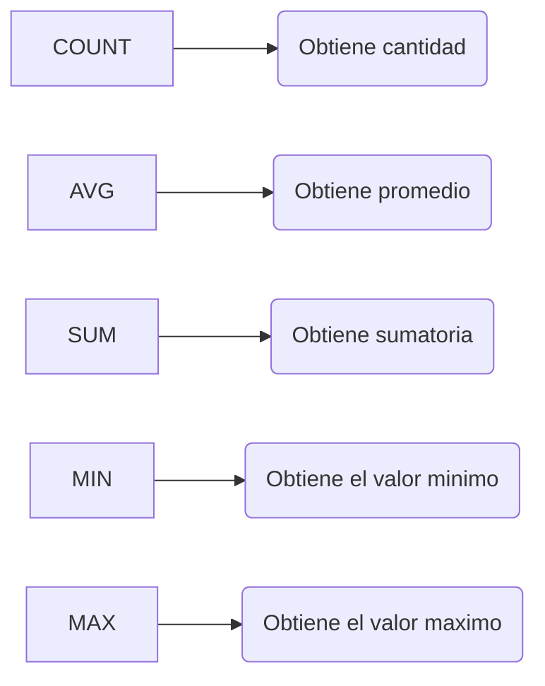
No operan sobre cada una de las filas, si no, que obtienen un dato en conclusion, es decir, obtenemos un solo dato de toda la tabla

## **`COUNT`**

No deja ver otro dato, solo **muestra las cantidades**, podemos usarlo con `WHERE` **para filtrar datos, siguiendo condiciones, si podemos combinarlo con otra funcion de agregacion.

Devuelve un único resultado indicando la cantidad de filas/registros que cumplen con el criterio.

**Ejemplo**

- Devuelve la cantidad de peliculas que hay en la tabla
```
SELECT COUNT(*) FROM movies;
```
- Devuelve la `cantidad de películas` de la tabla movies con el genero_id 3 y lo muestra en una columna denominada total

```
SELECT COUNT(id) AS total FROM movies WHERE genre_id = 3;
```
- Cantidad de peliculas con rating mayor a 5


## **`MAX`**

MAX devuelve un único resultado indicando el valor máximo de una columna cuyo tipo de datos debe ser numérico

Si tenemos que darle una columna para obtener el dato.

**ejemplo** 

- De la busqueda del mejor *rating* de la tabla *movies* donde el titulo comience por *Harry*

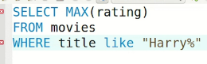

Podemos usar mas de una funcion de agregacion:

- Sacar el `Maximo` rating de peliculas que comienzan con la guerra y `cantidad` de peliculas que comienzan con la guerra

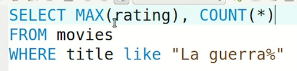

---------------------------------------------------------

## **`MIN`**

MIN devuelve un único resultado indicando el valor mínimo de una columna cuyo tipo de datos debe ser numérico

**ejemplo**

- Para obtener un unico valor
```
SELECT MIN(total) AS 'Total minimo' FROM facturas;
```
- Seleccionamos `id` con el `menor numero` del total, el resultado lo guardamos en una columna llamada 'Total minimo'
```
SELECT id, MIN(total) AS 'Total minimo' FROM facturas;
``` 
- Seleccionamos la cantidad de peliculas y el `minimo` rating


---------------------------------------------------------

## **`SUM`**

SUM (suma) devuelve un único resultado indicando la suma de una columna cuyo tipo de datos debe ser numérico.

**ejemplo**

- Total de toda las facturas:
```
SELECT SUM(total) FROM facturas;
```
- Suma con condicion; suma total de la tabla facturas donde el id es mayor a 25
```
SELECT SUM(total) FROM facturas WHERE id > 25;
```
- La suma total de facturacion por pais, la columna suma total es renombrada como *Total de facturacion* y es agrupado por pais de facturacion:

```
SELECT pais_de_facturacion, SUM(total) AS 'Total de Facturacion' 
FROM facturas
GROUP BY pais_de_facturacion
```
- La suma de la duracion de todas las peliculas:


> Podemos aplicarle el `WHERE` para filtrar la duracion de las peliculas de Harry Potter


---------------------------------------------------------

## **`AVG`**

AVG (average) devuelve un único resultado indicando el promedio de unacolumna cuyo tipo de datos debe ser numérico

Saca promedio, tambien nos da un resultado por toda la tabla

**Ejemplos**

- De la columna total, saca promedio
```
SELECT AVG(total) FROM facturas;
```
- Saca promedio en base a condicion
```
SELECT AVG(total) FROM facturas WHERE total > 2;
```
- Saca promedio de la columna duracion de la tabla peliculas


---------------------------------------------------------

## **`GROUP BY`**

La directriz `GROUP BY` nos va a **permitir agrupar los registros de la tabla** resultante de una consulta **por una o más columnas**, según nos sea necesario.

- Las consultas con `GROUP BY` se llaman consultas agrupadas, devuelven **una sola fila por cada elemento agrupado**.
- Se usa para agrupar filas que contienen los mismos valores
- Suelen venir acompaniadas por `funciones de agregacion` SUM, AVG, COUNT, MIN, MAX, para ofrecer reportes resumidos.
- Suele ir despues del `WHERE`
- Va antes del `ORDER BY` y del `LIMIT`
- Nos va a pedir porque campo queremos agrupar
- Agrupa varias filas en un solo dato.

> Trae restricciones, solo podemos poner 2 cosas en el `SELECT`, podemos poner el o los campos que se encuentren en el `GROUP BY`. Entonces ponemos en el `SELECT` el dato que usamos para agrupar

No puedo poner mas columnas que no sean funciones de agregacion o las columnas que se encuentren en el `GROUP BY`.

`GROUP BY` nos permite agrupar los datos por grupos, en donde contamos con restricciones para decir que columnas vamos a agrupar finalmente

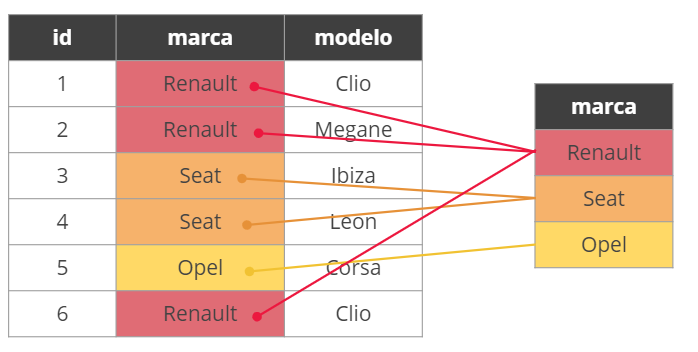

**Ejemplo**

- Agrupar los coches por marca mostrando aquellos que tienen el año de fabricación igual o superior al año 2010.
```
SELECT marca 
FROM coche 
WHERE anio_fabricacion >= 2010
GROUP BY marca
```
- Devuelve la marca y el precio más alto de cada grupo de marcas, renombra maximo precio a precio_maximo
```
SELECT marca, MAX(precio) AS precio_maximo
FROM coche
GROUP BY marca;
```

- Agrupa por *generos*
```
SELECT * 
FROM movies
GROUP BY genre_id;
```
Cambiando el `*` por el campo que se agrupara:
```
SELECT genre_id
FROM movies
GROUP BY genre_id;
```
- Devuelve el género y la duración promedio de cada grupo de géneros y renombra la columna promedio como duracion_promedio.
```
SELECT genero, AVG(duracion) AS duracion_promedio
FROM pelicula
GROUP BY genero;
```
- Podemos pedir la *cantidad de peliculas* por *genero*.

```
SELECT genre_id, COUNT(*)
FROM movies
GROUP BY genre_id;
```
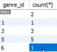

Podemos poner mas de una funcion de agregacion

Por ejemplo, podemos agregar el `promedio de duracion` de las peliculas; entonces tenemos:
- grupo de genero
- cantidad de peliculas por genero 
- promedio de duracion

```
SELECT genre_id, COUNT(*), AVG(length)
FROM movies
GROUP BY genre_id;
```
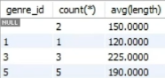

---------------------------------------------------------

## **Ejemplos combinados**

- Trae las facturas con valores maximos y con valores minimos, el total por pais, este lo renombra 'Total de Facturacion' y lo agrupa por pais:
```
SELECT pais_de_facturacion, MIN(total), MAX(total), SUM(total) AS 'Total de Facturacion'
FROM facturas
GROUP BY pais_de_facturacion;
```


- Trae menor facturacion, total de facturacion que la renombra 'Total de Facturacion' y agrupa por pais de facturacion:
```
SELECT pais_de_facturacion, MIN(total), SUM(total) AS 'Total de Facturacion'
FROM facturas
GROUP BY pais_de_facturacion;
```
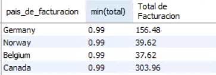

- Ejemplo combinado: De la tabla facturas selecciona el total minimo de facturas y el total maximo de facturas por pais, la suma total que renombra `t` y grupa por pais de facturacion y pone condicion que la suma del total sea mayor o igual a `1.5`.
```
SELECT pais_de_facturacion, MIN(total), MAX(total), SUM(total) AS 'T'
FROM facturas
GROUP BY pais_de_facturacion
HAVING t >= 1.5;
```


## **`Having`**

Muchas veces, cuando estamos implementando las funciones de agregación, vamos a querer filtrar los resultados obtenidos. Seguramente, lo primero que se nos viene a la cabeza es hacer uso de un WHERE. El problema es que **`las funciones de agregación no son muy amigas del WHERE`**.

Es por esta razón que la directriz `HAVING` cumple la misma función, pero —¡ojo!— **`esta solo se va a poder usar en conjunto con las funciones de agregación para filtrar datos agregados`**. Es importante tener en cuenta esto porque para cualquier otro escenario la herramienta que tendremos que utilizar es el `WHERE`.

- Cuando quiero hacer un filtro en los **datos ya agrupados**
- Pone condiciones en los datos agrupados, los campos que agregamos despues del `SELECT`
- Permite tener resultados filtrando, de los resultados ya agrupados, condiciones de las funciones de agregacion
- Para obtener resultados ya filtrados desde la base de datos.
- Permite la implementacion de alias en la seleccion de datos

**Ejemplo**

- Esta consulta devolverá la cantidad de clientes por país (agrupados porpaís). Solamente se incluirán en el resultado aquellos países que tengan al menos 3 clientes.

```
SELECT pais, COUNT(clientesId)
FROM clientes
GROUP BY pais
HAVING COUNT(clienteId) >= 3;
```

- Analiza las peliculas, hizo la cruza con generos, agrupa segun generos.
    Y de cada uno de los generos analiza el nombre, la cantidad de peliculas, el maximo *rating* y el promedio de la duracion.
    El `HAVING` lo usamos para filtrar los generos que solo tengan 3 peliculas.

```
SELECT name, COUNT(*), MAX(rating), AVG(length)
FROM movies
INNER JOIN genres ON genre_id = genres.id
GROUP BY name
HAVING COUNT(*) >= 3;
```
Y da como resultado:

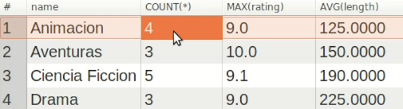

## **`QUIZZ`**

1. El área de estrategia de Musimundos está analizando cómo implementar una acción de marketing, en la cual tiene que destinar un presupuesto acorde a la cantidad de clientes que tenga cada país. Por esto te piden que los ayudemos a identificar la cantidad de clientes que son de Brazil. Seleccioná el número que obtuviste.

```
SELECT pais, COUNT(*)
FROM clientes
GROUP BY pais;
```
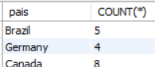

2. En Musimundos estamos muy atentos a que nuestros usuarios encuentren una cantidad apropiada de canciones del estilo que quieran escuchar. Es por eso que en esta oportunidad nos están solicitando una lista de cuantas canciones tenemos por género. Para esto, hacé una consulta a la base de datos que traiga el id del género y la cantidad de canciones que posee. Seleccioná el número que te dio como resultado de la cantidad de canciones del género con id = 6.

```
SELECT id_genero, COUNT(*)
FROM canciones
GROUP BY id_genero
HAVING id_genero = 6;
```


3. Es época de balances, y en Musimundos queremos saber cuánto dinero llevan gastados los clientes en nuestra empresa. Seleccioná el número que obtuviste. 

```
SELECT COUNT(*), SUM(total)
FROM facturas;
```
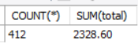

4. En el sitio web de Musimundos, queremos informar la duración promedio en milisegundos de cada álbum. Obtiene una lista de todos los álbumes y su duración (milisegundos) promedio. Inserta el número del promedio que obtuviste para el álbum con id = 4.

```
SELECT id_album, AVG(milisegundos)
FROM canciones
WHERE id_album = 4;
```
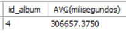

5. En el equipo de desarrollo están mudando de servidor a nuestra aplicación, y quieren saber cuál es el peso (bytes) de cada archivo de canciones para buscar un servidor adecuado con capacidad suficiente. Hace una consulta a la base de datos para saber cuál es el archivo con menor peso en bytes. Seleccioná el número que obtuviste.

```
SELECT MIN(bytes)
FROM canciones;
```


6. En el salón de Musimundos, estamos ofreciendo un descuento para todos aquellos clientes que tengan un total de facturación mayor a 45. Hacé una consulta a la base de datos que nos traiga por id_cliente la suma total de sus facturas. Filtra aquellos que la suma del total sea &gt;45. ¿Cuál es la suma total del cliente con id = 6? Por último, seleccioná el número que obtuviste.

```
SELECT id_cliente, SUM(total), COUNT(*)
FROM facturas
GROUP BY id_cliente
HAVING SUM(total) > 45;
```
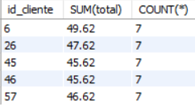


-------------------------------------------------------

# Table reference

Ahora que aprendimos gran parte de la sintaxis de SQL para la extracción de datos, empezamos a tener la necesidad de relacionar más de una tabla.

Ya vimos en el DER que las tablas se relacionan entre sí, pero ¿cómo hacemos para consultar los datos de más de una tabla?

- Traer datos de muchas tablas separadas
- Cruzar 2 tablas o mas
- Va una condicion por cada vinculo. Si es una usamos `WHERE` y si sumamos otra podemos hacerlo con `AND`

> Importante: Tener en mente cual es la estructura de la base de datos. Entonces, hacemos uso de la ingenieria inversa de MyWorkbench con: DATABASE -> reverse engineer

Traemos informacion de ambas tablas: 
tabla movies y tabla genres
Aclaramos de que tabla queremos el id de cada uno. ej:(movies.id)

Esta accion cruza las 2 tablas

```
SELECT *
FROM usuario u, rol r
WHERE u.rol_id = r.id;
```

**Ejemplo: uno a muchos**

```
SELECT movies.id, title, genre_id, genre.id, name
FROM movies, genres
```
Agregando un `WHERE` podemos filtrar las columnas que hablen de lo mismo, o que traigan un dato repetido.
Como el caso del genre_id y id que se refieren a lo mismo.


Al querer traer informacion de 2 tablas hacemos
1. Aclarar ambas tablas en el `FROM`
2. Aclarar la relacion con un `WHERE` la clave foranea con el id de la otra tabla.
3. Podemos verificarlo en el diagrama, pasar el mouse por encima de la relacion y ver con el color de las tablas

```
SELECT movies.id, title, genre_id, genre.id, name
FROM movies, genres
WHERE genre_id = genres_id
```
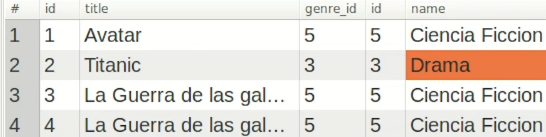
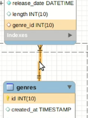

**Ejemplo: muchos a muchos**

Tenemos que pasar por una tabla intermedia
1. Necesitamos pasar el el `FROM`, las 3 tablas relacionadas: peliculas, intermedia y actores.
2. Tendremos 2 `WHERE`; usamos `AND`. en cada condicion aclararemos las condiciones para cada uno de los vinculos, que podemos ver en el diagrama relacional
3. matcheamos la tabla movies con el id_movies de la tabla intermedia
4. matcheamos la tabla actors con el id_actors de la tabla intermedia


```
SELECT title, firts_name, last_name
FROM movies, actor_movie, actors
WHERE movie.id = movies.id
AND actor_id = actors_id
```
[table reference](./clase_14/C10A01CV - Table Reference.pdf)

> ver este ejemplo con JOIN

## **`QUIZZ`**

En el salón de Musimundos tenemos un cliente fanático de Willie Dixon, quiere comprar toda la colección de sus temas, pero NO le interesan los temas que sean de su etapa en el rock.

Hagamos una consulta en la base de datos donde muestre todos los registros que contengan canciones con sus géneros, Y que el compositor sea Willie Dixon, Y que tengan el género Blues.

```
SELECT canciones.nombre, canciones.compositor, generos.nombre
FROM canciones, generos
WHERE generos.id = canciones.id_genero
AND canciones.compositor = 'Willie Dixon'
AND generos.nombre = 'Blues';
```


----------------------------------------------------

# JOINS

Imaginémonos el siguiente escenario: tenemos una tabla que almacena los datos de una persona, pero sabemos que esa tabla —a su vez— está asociada con otra que almacena las imágenes que postea una persona.

Sin embargo, en esta última tabla, el único dato que se tiene para identificar a la persona dueña de esa imagen es el ID de la misma. Es decir, el ID que le corresponde a esa persona en la tabla de personas

Si este es el caso, ¿cómo podríamos, por ejemplo, traer en una sola consulta las imágenes que pertenecen al ID 5? Es decir, ¿cómo podemos traer todas las imágenes que pertenecen a una persona si esa información está presente en otra tabla?

Establece uniones entre distintas tablas que tienen algún tipo de relación entre sí.

- Para traer informacion de mas de una tabla
- Permite tener recaudos
- Su sintaxis es mucho más comprensible.
- Presentan una mejor performance.
- Proveen de ciertas flexibilidades.

## **`INNER JOIN`**

- Es la opción predeterminada 
- Nos devuelve todos los registros donde se cruzan dos o más tablas. 
- Devuelve únicamente los registros que cumplen la condición indicada en la cláusula ON

```
SELECT columna1, columna2
FROM tabla_A
INNER JOIN tabla_B
ON condicion
```

**Por ejemplo**, si tenemos una tabla *cliente* y otra *factura*, al cruzarlas con `INNER JOIN`, nos devuelve aquellos registros o filas donde haya un valor coincidente en ambas tablas.


- En vez de poner las 2 tablas en el `FROM` ponemos 1 y la que queremos cruzar despues de `INNER JOIN` y en vez del `WHERE` ponemos `ON`que es el filtro donde se evaluara y aclarara dónde está ese cruce. Es decir, qué clave primaria (PK) se cruzará con qué clave foránea (FK).

```
SELECT movies.id, title, genre_id, genres_id, name
FROM movies
INNER JOIN genres ON genre_id = genres.id
```
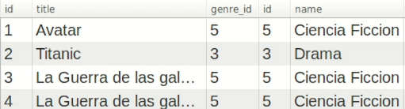

- ej en clase

```
SELECT * FROM usuario u
INNER JOIN rol r ON u.rol_id = r.id
WHERE u.id > 3;
```
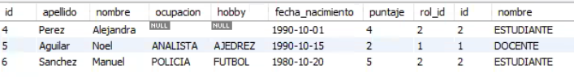

- otro ejemplo


```
SELECT factura.id AS nro_factura, apellido, nombre, fecha
FROM cliente
INNER JOIN factura
ON cliente.id = factura.cliente_id;
```
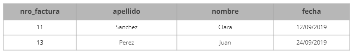

**Ejemplo de muchos a muchos**

El el `FROM` dejamos una sola tabla y porque cada tabla creamos un `INNER JOIN` y cada JOIN debe tener la palabra `ON`, si en el ON esto no funcionaria

```
SELECT title, firts_name, last_name
FROM movies
INNER JOIN actor_movie ON movie.id = movies.id
INNER JOIN actors ON actor_id = actors_id
```
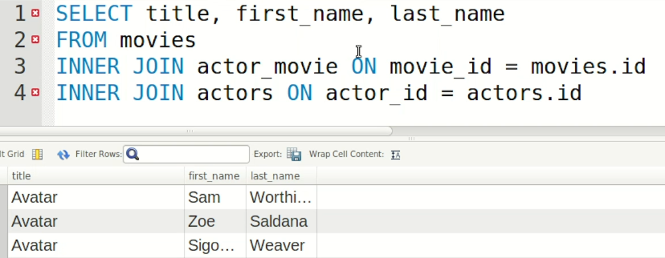

## **`LEFT JOIN`**

Entonces, LEFT JOIN nos devuelve todos los registros donde se cruzan dos o más tablas. Incluso los registros de una primera tabla (A) que no cumplan con la condición indicada en la cláusula ON. 

```
SELECT columna1, columna2
FROM tabla_A
LEFT JOIN tabla_B
ON condicion
```

Tiene la ventaja de que si la tabla del `FROM` no tiene el campo porque el que se va a vincular al de la tabla `JOIN`, se acepte la tabla del `FROM` a pensar de no tener el vinculo usando `LEFT JOIN`, donde esta tabla del `FROM` que estaria a la izquierda va a ser aceptada apensar de no tener vinculo.

**Ejemplo**

```
SELECT movies.id, title, genre_id, genres_id, name
FROM movies
LEFT JOIN genres ON genre_id = genres.id
```
En este caso nos trae a *Alicia en el pais de las maravillas* que no tiene genero.

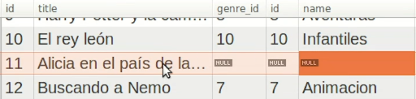

**Otro ejemplo**

Si tenemos una tabla cliente y otra factura, al cruzarlas, nos devuelve aquellos registros donde haya un valor coincidente entre ambas, más los registros de aquellos clientes que no tengan una factura asignada.


```
SELECT factura.id AS nro_factura, apellido, nombre, fecha
FROM cliente
LEFT JOIN factura
ON cliente.id = factura.cliente_id;
```

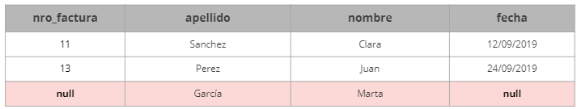

## **`LEFT Excluding JOIN`**

Este tipo de LEFT JOIN nos devuelve únicamente los registros de una primera tabla (A), excluyendo los registros que cumplan con la condición indicada en la cláusula ON. Por ejemplo, si tenemos una tabla cliente y otra factura, al cruzarlas, **nos devuelve solo aquellos registros de clientes que no tengan una factura asignada**

> la cláusula ON sirve para condiciones que especifican cómo unir tablas y la cláusula WHERE restringe qué filas incluir en el conjunto de resultados.


```
SELECT factura.id AS nro_factura, apellido, nombre, fecha
FROM cliente
LEFT JOIN factura
ON cliente.id = factura.cliente_id
WHERE ISNULL(factura.id);
```


## **`RIGHT JOIN`**

Nos devuelve todos los registros donde se cruzan dos o más tablas. Incluso los registros de una segunda tabla (B) que no cumplan con la condición indicada en la cláusula ON. 

```
SELECT columna1, columna2
FROM tabla_A
RIGHT JOIN tabla_B
ON condicion
```

Si es al reves que `LEFT JOIN`, si quiero ver los generos que no tienen peliculas. Es decir prefiero ver los datos de la tabla del lado derecho, usamos `RIGHT JOIN`

```
SELECT movies.id, title, genre_id, genres_id, name
FROM movies
right JOIN genres ON genre_id = genres.id
```
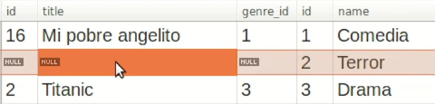

**Otro ejemplo**

Por ejemplo, si tenemos una tabla cliente y otra factura, alcruzarlas, nos devuelve aquellos registros donde haya un valor coincidente entreambas, más los registros de aquellas facturas que no tengan un cliente asignado.

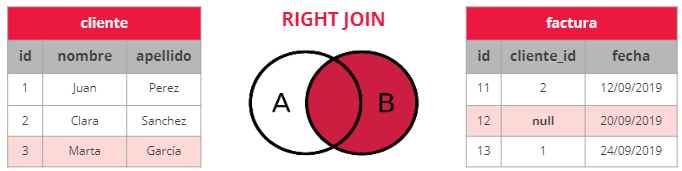

```
SELECT factura.id AS nro_factura, apellido, nombre, fecha
FROM cliente
RIGHT JOIN factura
ON cliente.id = factura.cliente_id;
```

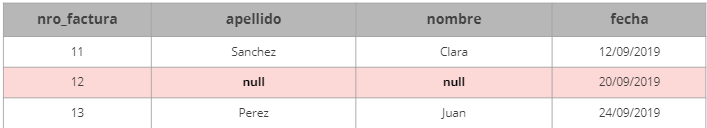

## **`RIGHT Excluding JOIN`**

Este tipo deRIGTH JOIN nos devuelve únicamente los registros de una segunda tabla(B), excluyendolos registros que cumplan con la condición indicada en la cláusula ON.Por ejemplo, si tenemos una tabla cliente y otra factura, al cruzarlas, nos devuelve soloaquellos registros de facturas que no tengan asignado un cliente

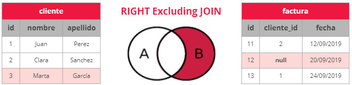

```
SELECT factura.id AS nro_factura, apellido, nombre, fecha
FROM cliente
RIGHT JOIN factura
ON cliente.id = factura.cliente_id
WHERE ISNULL(cliente.id);
```
obtenemos los datos:


-----------------------------------------------------------

## **`DISTINCT`**

Al realizar una consulta en una tabla, puede ocurrir que en los resultados existan dos o más filas idénticas. En algunas situaciones, nos pueden solicitar un listado con  registros no  duplicados,  para  esto,  utilizamos  la cláusula `DISTINCT` que devuelve un listado en donde cada fila es distinta.


**Ejemplo**

Consulta para ver los nombre de los actores que hayan actuado en peliculas cuyo titulo tenga la palagra `Harry`
- Se repiten actores
Cuando hay filas exactamente iguales y salen repetidos usamos `DISTINCT`si hay dos filas exactamente iguales en todas las peliculas, elimina el duplicado.


# Funciones de alteración

En muchas ocasiones vamos a necesitar que nuestra consulta no solamente traiga los datos solicitados, sino que —a su vez— vamos a querer realizar un par de operaciones especiales con los mismos.

Por ejemplo: 
- Unificar los datos de dos columnas en una sola 
- Quizás poner algún valor por defecto a todos aquellos registros que están almacenando un valor nulo.

Las funciones de alteración de MySQL nos van a permitir jugar un poco con el resultado de la consulta. 
Teniendo siempre en cuenta que las mismas **nunca alterarán los datos originalmente almacenados en la base**.

Las funciones de alteración más comunes —y las que vamos a ver— son:

## **`CONCAT`**

Permite unir varias columnas en un solo resultado, tambien permite concatenar strings literales
```
SELECT CONCAT(firts_name, " ", last_name) AS nombre_completo
FROM actors
```
- ej PROBAR 
```
SELECT CONCAT_WS(" ", apellido, nombre, "(", ocupacion, ")" )
FROM usuario;
```

## **`CONCAT_WS`**

Concatena expresiones con un separador 

```
SELECT CONCAT_WS("-", "SQL", "Tutorial", "is", "fun!") AS ConcatenatedString; 
```
```
SELECT CONCAT_WS(" / ", "SQL", "Tutorial", "is", "fun!") AS ConcatenatedString;
```
## **`COALESCE`**

Permite salvar los casos donde aparece `NULL`, como un plan b en caso que la columna no tenga resultados.
- ej 1

```
SELECT title, COALESCE(name, "No tiene genero")
FROM movies
LEFT JOINN genres ON genre_id = genres.id
```


- ej 2, estoy reemplazando por el hobby
```
SELECT apellido, nombre
COALESCE(ocupacion, hobby, 'Sin ocupacion')
FROM usuario;
```


- ej 3
```
SELECT apellido, nombre
COALESCE(ocupacion, 'Sin ocupacion')
FROM usuario;
```


## **`NOW`**

Nos permite tener la fecha y la hora actual, la podemos conjugar con otras funciones como DATEDIFF para saber *hace cuanto* paso el dato que necesitamos

```
SELECT title, rease_date, NOW()
FROM movies
```

## **`DATEDIFF`**

Permite tener la diferencia entre 2 fechas
en este ejemplo tomaremos la diferencia entre la fecha de estreno y la fecha actual para saber hace cuanto fue
Si da negativo es porque primero tenemos que poner la fecha mas reciente y luego la fecha mas vieja y eso nos da la diferencia en cantidad de dias

```
SELECT title, DATEDIFF(NOW(), release_date)
FROM movies
```
- ejemplo en clase
```
SELECT apellido, nombre, fecha_nacimiento, DATEDIFF('2000-01-15', fecha nacimiento)
FROM usuario;
```

## **`TIMEDIFF`**

Permite tener la diferencia entre 2 horarios.

```
SELECT TIMEDIFF('18:45:00', '12:30:00');
```

## **`TIMESTAMPDIFF`**

Saca la diferencia en anios, minutos, dias, de las dos fechas/tiempos le mandemos por argumento

```
SELECT TIMESTAMPDIFF(YEAR, '1990-03-15', NOW());
```

## **`DATE_FORMAT`**

Permite formatear la fecha hacia como queremos verla, podemos moledar y transformarla como querramos
```
SELECT title, DATE_FORMAT(release_date, "%d/%m/%Y")
FROM movies
```

## **`YEAR`**

Permite extraer el anio, pero es mas como usar `EXTRACT`

```
SELECT title, YEAR(release_date)
FROM movies
```

## **`EXTRACT`**

Permite extraer datos, mysql nos da sugerencia de que queremos extraer

```
SELECT title, EXTRACT(day FROM release_date)
FROM movies
```

## **`REPLACE`**

Permite reemplazar texto, lleva 3 datos:
1. Sobre que columna queremos operar
2. Que dato queremos reemplazar
3. porque dato

**Ejemplo** 
- Reemplacemos *Harry* por *Juanito*

```
SELECT REPLACE(title, "Harry", "Juanito")
FROM movies
```
- Reemplacemos Buenas tardes por buenas noches

```
SELECT REPLACE('Buenas tardes', 'tardes', 'Noches');
```

## **`LENGTH`**

Permite ver el largo, del titulo despues del `SELECT` pero es mas interesante en el `WHERE` para hacer filtros o en un `ORDER BY`

```
SELECT title
FROM movies
WHERE LENGTH(title) > 10
```

## **`CASE`**

Sirve para mostrar datos dependiendo de condiciones, al final de los CASE va un `END`

```
SELECT title, rating
CASE
    WHEN rating < 5 THEN "Mala"
    WHEN rating < 7 THEN "Buena"
    ELSE "Muy buena
END
FROM movies
```


Existen muchas más que las podrás encontrar en el manual de referencia de MySQL: 
[Manual SQL](https://dev.mysql.com/doc/refman/8.0/en/)


## **`DATE_ADD`**

DATEADD(interval, number, date)
Agrega anio/mes/dia/week/hour/minute/second/milisecond, la cantidad y devuelve la fecha

```
SELECT DATEADD(year, 1, '2017/08/25')
```
    retorna 2018/08/25

## **`DATE_SUB`**

Substrae un intervalo de tiempo/fecha de una fecha y retorna una fecha.

```
SELECT DATE_SUB("2017-06-15", INTERVAL 10 DAY); 
```
    retorna: 2017-06-05

## **`SUBSTRING()`**

Permite extraer parte de un string, la posicion es desde 1. (string, posicionInicio, cantidadExtraer)`.

```
SELECT name,
SUBSTRING(name, 2, 5)
FROM bbc
```

## **`LEFT()`**

Extrae caracteres desde el inicio; el lado izquierdo del string. (string,cantidadExtraer).

## **`UPPER()`**

Pone el string que lleve dentro en mayuscula

## **`LOWER()`** sinonima a **`LCASE()`**

Pone el string que lleve dentro en minuscula

## **`CAST()`**

Permite convertir de un tipo a otro.
(Expresion AS tipo)

```
SELECT nombre, CAST(milisegundos/600 AS TIME)
FROM canciones
```

## **`ROUND`**

(attr o num, num decimales)`: Redondea y num decimales,s es cuantos decimales quiero mostrar, si pongo -1 redondea al 10 mas cercano, -2 AL 100, -3 al 1000.

```
SELECT name,
ROUND(population/1000000,1)
FROM bbc
```
```
SELECT name,
ROUND(population/1000000)
FROM bbc
```
```
SELECT name,
ROUND(population/1000000,-1)
FROM bbc
```

## **`SEC_TO_TIME`**

Retorna un valor del tiempo, basado en segundos.
```
SELECT SEC_TO_TIME(1);
```
```
SEC_TO_TIME(ROUND(milisegundos/1000))
```

## **`IFFNULL`** igual `NVL`

Toma dos argumentos, y devuelve el primero que no sea `NULL`
```
IFNULL(x,y) = x if x is not NULL
IFNULL(x,y) = y if x is NULL
```

## **`STRCMP()`**

Compara 2 strings.

- If string1 = string2, this function returns 0
- If string1 < string2, this function returns -1
- If string1 > string2, this function returns 1

# Reportes - Left & Right

En la clase de hoy vamos a poner en práctica lo aprendido sobre los distintos tipos de JOIN.

> Ver ppt: Cual es la respuesta adecuada

# Qué son las vistas?

**Situacion**: Imaginemos una situación donde tenemos que proporcionar un informe diariamente. Tenemos diseñada nuestra consulta SQL, entramos todos los días a la base de datos para ejecutar la consulta y descargar el resultado.
Un día faltamos al trabajo, y nuestro compañero quiere extraer el mismo informe. Pero, como no tiene la consulta SQL, no puede obtener ese resultado.

Entonces, ¿Cuál sería una buena práctica?

Este es uno de los casos de aplicación de las Vistas. Este recurso de bases de datos **nos permite “Guardar” dentro de una base de datos una Consulta SQL**.

La “Vista” se ve igual que una tabla de las que conocemos, pero al consultarla (Al hacer un select sobre la vista), recién en ese momento, se ejecuta la consulta.

Entonces...

- Una vista es un elemento de la base de datos que facilita el acceso a los datos de las tablas. Básicamente, **su función es guardar un SELECT**. 
- Nos **permite visualizar los resultados** abstrayéndonos de cómo esté definida una consulta. 
- Las vistas tienen la misma estructura que una tabla (filas y columnas). La diferencia es que solo se almacena la definición de la consulta, no así los datos. 
- Una vista es una tabla virtual basada en el conjunto de resultados de una consulta SQL.

¿Para qué sirven las vistas?

- Para simplificar el acceso a los datos cuando se requiere la implementación de consultas complejas.
- Para impedir la modificación de datos por terceros.
- Para facilitar la consulta de datos a aquellas personas que no conozcan el modelo de datos o que no sean expertos en SQL.

¿Qué hay que saber sobre las vistas?

- Una vista se ejecuta en el momento en que se invoca.
- Los nombres de las vistas deben ser únicos (no se pueden usar nombres de tablas existentes).
- Solamente se pueden incluir sentencias SQL de tipo `SELECT`.
- Los campos de las vistas heredan los tipos de datos de la tabla.
- El conjunto de resultados que devuelve una vista es inmodificable, a diferencia de lo que sucede con el conjunto de resultados de una tabla.

## Creación de vistas

Una vista se crea con la cláusula `CREATE VIEW`

```
CREATE VIEW nombre_de_la_vistaASconsulta SQL;
```

```
CREATE VIEW canciones_de_rock AS 
SELECT canciones.id, canciones.nombre, generos.nombre AS genero
FROM canciones
INNER JOIN generos 
ON canciones.id_genero = generos.id
WHERE generos.nombre IN ('Rock', 'Rock And Roll');
```
## Modificación de vistas

Usamos la cláusula `ALTER VIEW` para modificar o reemplazar una vista.

```
ALTER VIEW nombre_de_la_vista AS consulta SQL;
```
```
ALTER VIEW vista_coche AS SELECT * FROM coche WHERE marca = 'Fiat';
```

## Eliminación de vistas

Utilizamos la cláusula `DROP VIEW` para eliminar una vista.

```
DROP VIEW nombre_de_la_vista;
```
```
DROP VIEW vista_coche;
```

## Invocación de vistas

Si bien las vistas son elementos diferentes a las tablas, la invocación es la mismaque la de una tabla. Es decir, se utiliza la cláusula `SELECT`.

Invocando una tabla:

```
SELECT * FROM coche;
```
Invocando una vista:
```
SELECT * FROM vista_coche;
```
Invocando una vista junto con la cláusula `WHERE`:
```
SELECT * FROM vista_coche WHERE id > 10;
```

# C18 - Buenas prácticas

Buscamos es mejorarla, optimizarla, para que cuando trabajemos con casos reales de bases de datos, los tiempos de respuesta sean aceptables.


> VER PPT BUENAS PRACTICAS

- `VARCHAR` en vez de TEXT
    Buenas prácticas en SQLSi requiere almacenar volúmenes de texto muy grandes, pero son menores a 8000 caracteres, usemos el tipo de dato VARCHAR en lugar de TEXT.

- `CHAR` y `VARCHAR`
    El uso de CHAR y VARCHAR depende de si el campo en el que se va a usar varía mucho o no de tamaño. Esto para sopesar rendimiento de velocidad sobre rendimiento de almacenamiento. El motor de SQL procesa más rápido las columnas de longitud fija. Usemos CHAR para columnas de poca variación en longitud y VARCHAR para aquellas que no tienen una longitud estable o promedio.

- No usemos columnas con tipos de datos `FLOAT`, `REAL` o `DATETIME` como `FOREIGN KEY`.

- Usemos CONSTRAINT para mantener la integridad de los datos.

- Evitemos claves primarias COMPUESTAS.
    Tengamos en cuenta que si esperamos que nuestra tabla con una clave primaria compuesta tenga millones de filas, el rendimiento de la operación CRUD está muy degradado. En ese caso, es mucho mejor usar una clave primaria ID simple que tenga un índice lo suficientemente compacto y establezca las restricciones de motor de bases de datos necesarias para mantener la singularidad

- Evitemos usar `SELECT * FROM tabla`
    Aunque resulte fácil y cómodo usar el comodín (*) para traer todos los campos, este debe omitirse y en su lugar especificarse los campos que sean necesario traerse. El uso del comodín impide, además, un uso efectivo de forma eficiente de los índices.

- Anteponer el `ALIAS` de la tabla a cada columna.
    Especificar el alias de la tabla delante de cada campo definido en el SELECT ahorra tiempo al motor de tener que buscar a qué tabla pertenece el campo especificado

- Evitemos en la medida de lo posible el uso de GROUP BY, DISTINCT y ORDER BY.
    Evadamos, siempre que sea posible, el uso de GROUP BY, DISTINCT y ORDER BY, dado que consume una elevada cantidad de recursos. Consideremos si es realmente necesario usarlo o si, por otro lado, se puede dejar el ordenamiento de los resultados a la aplicación que recibirá los datos

- Evitemos usar de Wilcards en LIKE como “%valor%”.
    En el caso de que se use la instrucción LIKE, no usemos el comodín “%” al inicio de la cadena a buscar. Esto debido a que si se aplica, la búsqueda tendría que leer todos los datos de la tabla o tablas involucradas para responder a la consulta. **Se recomienda que existan al menos tres caracteres antes del comodín**.

- Evitar usar IN en subconsultas, es mejor EXISTSPromover el uso de EXISTS y NOT EXISTS, en lugar de IN y NOT IN.

- Intente no utilizar funciones dentro de las condiciones del WHERE.
    SQL no puede buscar eficientemente los registros cuando utiliza funciones, por ejemplo, de conversión, dentro de una columna. En las condiciones intente utilizar el formato de la columna original.

- Utilice `UNION ALL` para evitar un distinct implícito
    En caso de usar la instrucción UNION y existiera la seguridad de que en los SELECT involucrados no se obtendrán registros duplicados, entonces, lo recomendable en este escenario es sustituir UNION por UNION ALL para evitar que se haga uso implícito de la instrucción DISTINCT ya que esta aumenta el consumo de recursos.

- Usar `SET NOCOUNT ON` con operaciones CRUD
    Usar SET NOCOUNT ON con operaciones CRUD para no contar el número de filas afectadas y ganar rendimiento sobre todo en tablas con muchos registros


# Orden de procesamiento de una Query

¿Alguna vez te preguntaste qué sucede desde que presionamos el botón ejecutar dentro del script de SQL hasta que nos muestra el resultado?

En este apartado vamos a aprender cuál es el trabajo que realiza el motor de base de datos con las Consultas SQL.

> Ver ppt :Orden de procesamiento de una query


Un motor de base de datos interpreta la consulta en el siguiente orden:

1. `FROM`
2. `ON`
3. `JOIN`
4. `WHERE`
5. `GROUP BY`
6. `HAVING`
7. `SELECT`
8. `DISTINCT`
9. `ORDER BY`
10. `LIMIT`

- `FROM`,`ON`,`JOIN`: Obtienen las tablas de donde sacaremos la informacion
- `WHERE`: Donde se aplican los filtros necesarios, no se debe usar el alias del SELECT, ya que ese paso aun no se ejecuta
- `GROUP BY`: Una vez ya filtrados las filas que necesitamos, podemos agrupar los resultados. Se agruparan todas aquellas sentencias que **no** tengan funciones de agregacion como : max, min, avg, count.
- `HAVING`: Es similar a la fase WHERE, pero aquí se filtran los resultados del GROUP BY, es por ello que se ejecuta después.
- `SELECT`: En esta fase es donde las columnas son creadas a partir de las funciones que hemos indicado, por ejemplo, YEAR, COUNT, AVG, entre otras. También podemos utilizar sentencias como CASE WHEN, IF.
- `DISTINCT`: Orden de procesamiento de una queryUna vez que está calculado el resultado, si necesitamos quitar los duplicados, se realiza en esta etapa. Es opcional.
- `ORDER BY`: Es la última fase y es en la única en la que se permiten utilizar los ALIAS que fueron declarados en la fase SELECT dado que esta última se ejecuta previamente.
- `LIMIT`: Orden de procesamiento de una query¿Necesitamos mostrar solo una X cantidad de filas? Bueno, se realiza en el último paso. Es una opción de presentación de la información, no de cálculo.


# índices

Existen otras herramientas que proporcionan performance a la hora de ejecutar una Consulta SQL.

Una de ellas son los ÍNDICES. 

> Ver pp: Índices

Es una estructura de datos que mejora la velocidad de las consultas por medio de un identificador único de cada fila de una tabla.
Es una estructura adicional id, por si tenemos que hacer busquedas frecuentes por otro dato como por ej: el mail.
- Elegimos 1 o mas columnas que formaran parte del indice, esto permite localizar de forma rapida las filas en la tabla en base a su contenido en la/las columnas indexada/s.

**Ventajas**

- La utilización de índices puede mejorar el rendimiento de las consultas ya que los datos necesarios para satisfacer las necesidades de la consulta existen en el propio índice.
- Pueden mejorar de forma significativa el rendimiento si la consulta contiene agregaciones (GROUP BY), combinaciones (JOINS) de tabla o una mezcla de agregaciones y combinaciones.

**Desventajas**

- Las tablas utilizadas para almacenar los índices ocupan espacio.
- Los índices consumen recursos ya que cada vez que se realiza una operación de actualización, inserción o borrado en la tabla indexada, se tienen que actualizar todas las tablas de índice definidas sobre ella —en la actualización solo es necesaria la actualización de los índices definidos sobre las columnas que se actualizan—. Por estos motivos no es buena idea definir índices indiscriminadamente.

**Consideraciones**

- Hay que evitar crear demasiados índices en tablas que se actualizan con mucha frecuencia y procurar definirlos con el menor número de columnas posible.

- Es conveniente utilizar un número mayor de índices para mejorar el rendimiento de consultas en tablas con pocas necesidades de actualización, pero con grandes volúmenes de datos.

- Se recomienda utilizar una longitud corta en la clave de los índices agrupados. Los índices agrupados también mejoran si se crean en columnas únicas o que no admiten valores NULL.

## Tipos de índices

- Simple
- Compuesto
- Agrupado
- No agrupado

## **`Índice simple`**

Esta definido sobre una sola columna

```
CREATE INDEX "I_LIBROS_AUTOR"
ON "LIBROS" (AUTOR);
```

## **`Índice compuesto`**

Esta formado por varias columnas de la misma tabla.

```
CREATE INDEX "I_LIBROS_AUTOREDITORIAL" 
ON "LIBROS" (AUTOR,EDITORIAL);
```

## **`Índice agrupado (CLUSTERED)`**

Almacena los datos de las filas en orden. Solo se puede crear un único índice agrupado en una tabla de base de datos. Esto funciona de manera eficiente únicamente si los datos se ordenan en orden creciente o decreciente.

```
CREATE CLUSTERED INDEX "I_LIBROS_AUTOR"
ON "LIBROS" (AUTOR);
```

## **`Índice no agrupado (NONCLUSTERED)`**

Organiza los datos de forma aleatoria, pero el índice específica internamente un orden lógico. 
El orden del índice no es el mismo que el ordenamiento físico de los datos. 
Los índices no agrupados **funcionan bien con tablas donde los datos se modifican con frecuencia** y el índice se crea en las columnas utilizadas en orden por las declaraciones WHERE y JOIN    

```
CREATE NONCLUSTERED INDEX "I_LIBROS_AUTOR"
ON "LIBROS" (AUTOR);
```

## **Sintaxis**

## **`CREATE INDEX`**

Con `CREATE INDEX` podemos crear un índice indicando las columnas involucradas.

```
CREATE INDEX "NOMBRE_ÍNDICE"
ON "NOMBRE_TABLA" (NOMBRE_COLUMNA);
```
```
CREATE INDEX "I_LIBROS_AUTOREDITORIAL"
ON "LIBROS" (AUTOR,EDITORIAL);
```

## **`DROP INDEX`**

Con `DROP INDEX` podemos eliminar un índice de una determinada tabla:

```
ALTER TABLE "NOMBRE_TABLA"
DROP INDEX "NOMBRE_ÍNDICE";
```

## **`ANALYZE TABLE`**

Con `ANALYZE TABLE` analizamos y almacenamos la distribución de claves para una tabla:

```
ANALYZE TABLE "NOMBRE_TABLA";
```


