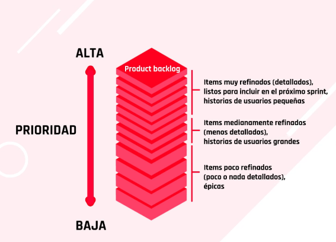
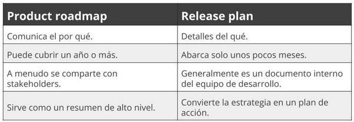
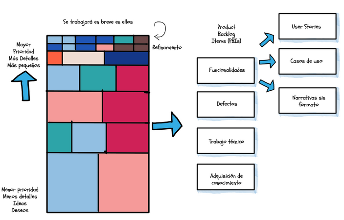
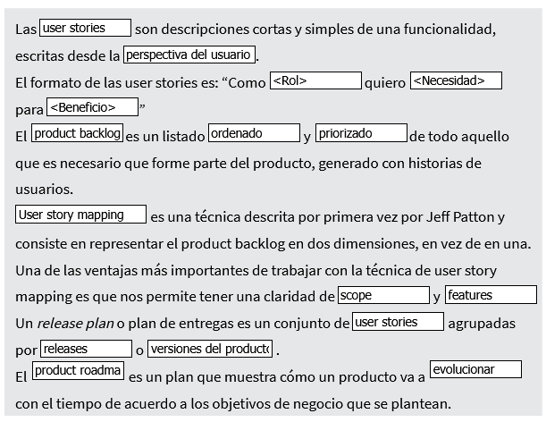
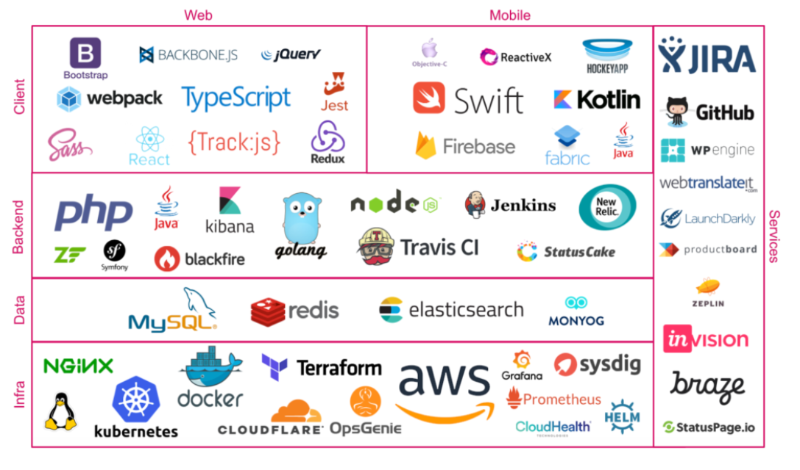

# **Mindset ágil**

- Principios, creencias y forma de pensar para **responder al cambio** de ambientes de incertidumbre
- hace a la capacidad de **adaptarse al cambio** mientras se avanza
- no es tanto un metodo si no **un modo de pensar**
# **Mindset ágil**

- Principios, creencias y forma de pensar para **responder al cambio** de ambientes de incertidumbre
- hace a la capacidad de **adaptarse al cambio** mientras se avanza
- no es tanto un metodo si no **un modo de pensar**

## Minset 

> Nueva psicologia para el éxito. Carol Dweck.

### Mentalidad fija

- Atributos personales fijos
- Inteligencia fija e innata
- Piensan que sus talentos y habilidades son todo lo que van a tener
- No se permiten convertirse
- Miedo a cometer errores
- El deseo de ser perfecto
- Se refiere al resultado final
- Evitan los retos
- Ven el esfuerzo como algo ineficaz
- Ignoral la retroalimentacion
- Se sienten amenazados con el exito de otras personas
> Pueden alcanzar un estado de estabilidad y puede que no desarrollen toda su capacidad. Carol Dweck

### Mentalidad de crecimiento

- Se refiere al viaje
- Talentos y atributos personales se pueden desarrollar por el aprendizaje, la tutoria y experiencia personal.
- La inteligencia se puede desarrollar
- Desean aprender acunque comentan errores
- Persisten ante las dificultades
- Ven el esfuerzo como el camino hacia el aprendizaje
- Aprenden de la retroalimentacion
- Encuentran inspiracion en el exito de otras personas
- Todos pueden crecer
- La vida como experiencia de aprendizaje
- Los resultados son subproductos del aprendizaje y el desarrollo
- Los resultados no definen quien somos, si no, que acompañan el viaje
- Se adaptan de forma mas facil y rapida
> Como resultado, consiguen mejores resultados. Carol Dweck

Los **principios del desarrollo de software agil** son acerca de cultivar mentalidad agil.

La **Organizacion agil** fomenta:

- Cultura de crecimiento
- Crear igualdad de oportunidades para experimentar y aprender del fracaso de forma rapida y barata

  `En un mundo en constante cambio, la capacidad de responder a la incertidumbre de forma creativa y espontánea es primordial.`

## Mentalidad Digital (Mindset Digital)

- capacidad de reinvencion y adaptacion a nuevas reglas tecnicas.
- Explota todo lo que nos brinda esta nueva era tecnologica
- Crear a partir del nuevo paradigma e impulsar el mundo hacia el futuro
- No esta ya solo relacionado al ambito tecnologico

- Busca ideas innovadoras
- Escucha con inquietud
- Se cuestiona sus propias convicciones

para tener un mindset digital es necesario:

- Salir de la zona de confort
- Abrazar lo desconocido
- Ser curiosos
- Aprender constantemente

### Caracteristicas del minset digital

1. **Mentalidad de abundancia**, compartir conocimiento y no regirse por la competencia

    `Un mundo conectado se distingue por la colaboracion y la cooperacion, la apertura de mente y la confianza.`

2. **El aprendizaje es continuo**, disfrutar aprendiendo y aprovechar oportunidades para aprender cosas nuevas. El cambio en entornos digitales es constante y requiere de una rapida adaptacion a nivel practico, mental y emocional.

3. **Enfoque agil**: 
    - Ser capaces de prever y transformarnos antes de que surja la necesidad de cambiar. 
    - Ver el cambio como una oportunidad y aceptar las nuevas formas de trabajar sin sentir amenaza.
    - Fomentar maneras de trabajar mas agiles y flexibles
    - Facilitar que la informacion circule de manera rapida y estrategica
    - Comodidad con la ambiguedad
    - Tomar decisiones contando con informacion incompleta y perfeccionar la practica a medida que uno explora.

4. **La mente del explorador**, aquellos capaces de explorar mas alla del deber, aportando valor a si mismos y las organizaciones que trabajan.

5. **Enfoque colaborativo**, se requiere diversidad de pensamientos, enfoques e ideas para resolver problemas.

    `La innovacion y creacion de valor en un entorno digital requiere la colaboracion de personas que piensan diferente, experiencias, backgrounds y formas de ver la vida`

6. **Abrazar la diversidad**, ante desafios novedosos se requiere gente con diferentes modelos mentales y visiones del mundo, la divergencia hace la efectividad

> Ser agiles no es ir rapido, es adaptarse a los cambios.

## El corazon de la agilidad

### Valores del agilismo

Para desarrollar un mindset agil
**Colabora**
- Espacios comunes, equipos multidisciplinarios
- Foco y motivacion
- Entender vulnerabilidad
- Confianza genuina
- Ofrecer y pedir ayuda
- Liderazgo emergente, entender como puedo aportar.
- proposito comun cocreado

**Entrega**
- [30 elementos de valor hbr](https://www.cristianmonroy.com/wp-content/uploads/2019/05/30-elementos-del-valor.png)
- priorizacion, a que le ponemos atencion?
- user story mapping
- Obtener retroalimentacion
- Frecuente y continua
- Valor para quien?, quien es mi cliente.

**Reflexiona**
- Como lo estoy construyendo?
- Dar tiempo al silencio
- Individualmente y colectivamente
- Que debo cambiar?
- Parar a afilar el hacha
- Que hice bien?
- Que estoy construyendo?

**Mejora**
- Mediciones, como vamos? que sea ayuda, no obstaculo.
- Entorno seguro para equivocarnos, experimentos contenidos.
- Mejorar productos y procesos
- Esperimentar, validar aprendizaje
- Pensar en pasos pequeños
- Salir de la queja


## Para acelerar el mindset agil

1. **Hacer una pausa**, crea un espacio para juicio, pensamiento original y la accion decidida.
2. **Acepta el no saber**, escuchar y pensar desde el desconocimiento es esencial para obtemer ideas originales e inesperadas
3. **Reformular radicalmente las preguntas** para desbloquear el modelo mental existente
4. **Fijar la direccion, no el destino**, explorar distintos caminos y recorridos posibles, en lugar de avanzar a una meta fija.
5. **Prueba soluciones**, experimentos rapidos y baratos pueden evitar grandes y costosos desastres. 

## **Habilidades pospandemia**

|HARD/TECH skills |SOFT/CORE skills |Digital skills| 
|--------------|----------------|-------|
|Ciencia de datos |Comunicacion |Metodolodias agiles|  
|Analisis de datos  |Colaboracion|Pensamiento de disenio |  
|Visualizacion de datos|Coaching    |DevOps |  
|Nube|Adaptables     |UX |  
|Inteligencia artificial|Empatia | |  
|Internet de las cosas|Networking  |  |  
|  |Resolucion de problemas  |  |  

# Organizacion agil

## Organizacion tradicional

- Diseniada para la estabilidad
- Estructura jerarquica, estatica y organizada en silos
- Objetivos y derechos de decisiones trasmitidos desde la cima
- Equitos de altos mandos en la cima
- Planificacion lineal
- Control pata captar valor de las partes interesadas
- Estructura basica solida, rigida y lenta

## Organizacion agil

- Son cliente-centricas, centrados obsesivamente en el cliente
- Diseniada para la estabiliadad y el dinamismo
- red de equipos pequenios y capacitados.
- centrada en las personas, celulas vivas, personas de distintas areas, enciende la pasion; personas, cultura y liderazgo en el centro.
- Funciona en ciclos rapidos de aprendizaje y toma de deciciones facilitados por la tecnologia.
- **Crear valos junto a las partes interesadas**
- Adaptan su estructura y estrategia para crear y preservar valor.
- Aporta velocidad y adaptabilidad.
- crea ventajas competitivas en condiciones VUCA.
> VUCA: Volatiles, inciertas, complejas y ambiguas.
- redisenio de operaciones, pocas exitosas
- se estacan tanto por su estabilidad como por su dinamismo
- tiene una estrella norte, encarnada en la organizacion guiados por esto reimaginan para quien crear valor y como hacerlo


### 5 Rasgos de organizaciones agiles exitosas

1. **Proponen un norte claro**, piensan para quien crean valor y como, enfocados en clientes, procuran satisfacer todas las necesidades el cliente, en la toda la relacion comercial, llamado *el ciclo de vida del cliente*.

2. **Red de equipos empoderados**, se equilibra la libertad individual con la cooperacion colectiva, organizados en tribus o redes para una mision en comun, con roles claros y rendicion de cuentas, estructura de celulas, mayor autonomia, interdisciplinarias, se forman y disuelven con rapidez.

3. **Ciclos rapidos de pensamiento y accion**, funcionan en ciclos rapidos de aprendizaje y toma de deciciones, relacionado con procesos de creacion y logro, constituye la capacidad de la organizacion de innovar y actual con agilidad.

4. **Modelo dinamico de trabajo**, con personas apasionadas por la tarea, pensano en el equipo, los involucran, liderazgo compartido, cambios de puesto, de funciones segun los objetivos. 

5. **Procesos facilitados por la tecnologia** Productos y servicios a la altura de los cambios.

> La clave esta en desaprender viejos paradigmas y reaprender

### Beneficios de una organizacion agil

1. Configuracion de la identidad y los valores de su empresa
2. Atraer mejores talentos y retener ese talento
3. Aumentar la identidad de su amrca

### Dinamicas organizacionales

#### Start-up
- poca estabilidad
- creativas
- ad hoc
- cambian constantemente de enfoque
- son previsibles
- reinventan la rueda
- actuan con rapides pero carecen de disciplina
- ejecucion sistematica
- Liderazgo centralizado

#### Trapped
- Carecen de una columna vertebral estable
- retrasados en procesos, en especial de aprendizaje continuo, iteracion y experimentacion.

#### Agil
- Sistema vivo
- prospera en entorno impredecible y rapidamente cambiante
- estables y dinamicas
- centradas en os clientes
- practicas probadas que se adaptan y se ajustan con fluidez a los cambios del mercado, tecnologia innovadora, opinion de clientes, y nosmativa gubernamental
- liderazgo holistico

#### Burocratico
- poco dinamicas
- formas de rtabajo estandar
- aversion al riesgo, silos y eficiencia
- priman las estructuras piramidales jerarquicas


## 5 Drivers de las organizaciones agiles

1. **Estrategia** vision incorporada en toda la organizacion:
- comparten el proposito y la vision
- Detectan oportunidades
- Flexibles

2. **Estructura** redes y equipos empoderados
- Transparencia y estructura plana
- Roles claros
- Gobernanza practica

3. **Procesos** Deciciones rapidcas y ciclos de aprendizaje
- Cohesion
- Emprendedurismo
- Movilidad

4. **Personas** Personas dinamicas seguidas por su pasion:
- Cohesion
- Emprendedurismo
- Movilidad

5. **Tecnologia** Habilitando nueva tecnologia:
- Habilitando nuevas tecnologias, sistemas y herramientas

# **Lean manufacturing**

Eliminar completamente los procesos no productivos y simplificar operaciones y organizaciones

> Algunos autores definen Lean como:conjunto de herramientas de eficiencia para **ahorrar dinero**, reducir costos, eliminar desperdicios y **entregar servicios satisfactorios** a los clientes reduciendo la inestabilidad y el desperdicio —siendo eficientes y funcionando de forma tranquila y competitiva—.

### Dentro de este sistema existen tres objetivos principales:

1. Eliminar la sobrecarga **(muri)**.
2. Eliminar la inconsistencia **(mura)**.
3. Eliminar el desperdicio **(muda)**.

La filosofia **lean manufacturing** trata de optimizar el sistema de producción y reducir o eliminar las tareas que no añaden valor.

### [7 principios de la filosofia de Lean](https://view.genial.ly/60bce7e3a6d3c70d7df8777e)

1. **Eliminar desperdicios** Quitar todo lo que no añade valor, retrasos, burocracia, funcionalidad innecesaria, entregables que no se consumen y comunicación innecesaria.

2. **Ampliar aprendizaje** Facilitar la comunicación temprana, frecuente y el feedback tanto como se pueda. Aprender constantemente.

3. **Tomar decisiones tardías** No tomar todas las decisiones de entrada o planear todo al inicio, ya que esto no se sostendrá. Retrasar las decisiones tanto como sea posible para evitar retrabajos al tomarlas por adelantado.

4. **Entregar lo antes posible** Maximizar el retorno de inversión (ROI), haciendo entregas rápidas e iterativas que agreguen valor y permitan obtener un aprendizaje.

5. **Potencial el equipo** Evitar el micromanagement, valorar el conocimiento especializado y fomentar la independencia para que tomen sus propias decisiones.

6. **Crear la integridad** Incluir calidad en cada parte del proceso y no solo medir al final con un test. Asegurar esto en forma continua en el proyecto.

7. **Visualizar todo el conjunto** Ver el “todo” como más que la suma de sus partes. Entender cómo se alinea con la organización y mejorar la interrelación entre los equipos.

## **Lean startup**

Toma su nombre de la revolución lean manufacturing que Taiichi Ohno y Shigeo Shingo desarrollaron en Toyota.
Se basaron en lean thinking para alterar los sistemas de la cadena de producción y suministros.


### principios
- La utilización del conocimiento y creatividad de los individuos, 
- la reducción de los lotes, 
- el método justo a tiempo tanto para los sistemas de gestión de producción como el control de inventarios y 
- una aceleración en las iteraciones. 

Enfocados en la creación de valor para los clientes y eliminar el desperdicio de esfuerzo.
Lean startup es una metodología elaborada por Eric Ries
consistente en **acortar los ciclos de desarrollo de productos**.

Para ello:

- Adopta una combinación de experimentación basada en hipótesis, 
- lanzamiento iterativo de productos con el que conseguir retroalimentación de los clientes y 
- aprendizaje validado para medir cuánto se ha aprendido.

**La hipótesis central de Lean startup** es:
Que invertir tiempo en productos o servicios de construcción iterativa para satisfacer las necesidades de los primeros clientes se traduce en una `reducción de los riesgos de mercado`, evitando la necesidad de grandes cantidades de financiación inicial o grandes gastos para lanzar un producto.

> un aprendizaje es validado porque nos permite saber lo que el cliente realmente quiere y está dispuesto a pagar por ello.

Eric ries define una startup como una organizacion dedicada a crear algo bajo condiciones de incertidumbre extrema

**Enfoques**:
- Rendimiento del capital
- Creatividad humana
- Desarrollos agiles
- Aprendizaje validado
- Innovacion continua

- **La vida de una startup se mide en iteraciones** No es sobre costos, se enfoca en la velocidad.
- Invertir poco para aprender mucho.
- Fracasar rapidamente y barato

## Filosofía lean y cultura organizacional

LEAN requiere de una cultura diferente:

- No esconder los problemas porque esto permite la mejora continua.
- Sustituir la cultura de “ordeno y mando” por la de delegación para resolución de problemas en cada nivel de jerarquía.
- Enfoque en el proceso y no solo en los resultados.
- Los problemas se ven y solucionan donde se generan.
- Trabajo en equipo.
- Gestión visual

## Claves de Lean

- **Valor**: Identificar lo que es de valor para el cliente y por ende del negocio.
- **Flujo de valor**: Analizar todo el flujo de de principio a fin para crear valor. Es cualquier serie de actividades o procesos que crean valor en la organización (Value-stream mapping)
- **Pull**: La demanda del producto determina cuánto producir. Se producen ítems en la medida que son requeridos por los procesos sucesores (just in time)
- **Perfeccion**: Dedicacion a la mejora continua. La calidad es una meta móvil.


# Kanban

Kanban es una palabra japonesa que significa “tarjetas visuales”, donde kan significa “visual”, y ban, “tarjeta” y es una metodología de gestión visual.

- Kanban es parte de la Metodología Lean.
- **es un método ágil para gestionar proyectos de forma más eficaz.**
- Asegura un flujo de trabajo constante a través de todos los pasos del proceso de producción.
- Kanban esta dentro de la etsrategia Kaisen (mejora continua)

> David Anderson adaptó los principios de Kanban para el software development en 2007. Hoy en día uno de los métodos de gestión ágil más populares para los proyectos de todas las industrias.

- Aunque desarrollado para la producción en masa, **puede aplicarse a todos los procesos de gestión de proyectos**, ya que se puede entender el proceso de proyecto como una tubería con las solicitudes de los clientes que entran a un lado de la tubería y los resultados que surgen en el otro extremo.
- Se valen de herramientas visuales que facilitan el trabajo en equipo

**KANBAN** Es una herramienta diseniada para organizar los procesos, maximizando la eficiencia de lo que va realizando el equipo
al igual que **SCRUM** que es un marco te trabajo que ayuda a trabajar de forma agil.
Cuando se combinan se llaman **SCRUMBAN**

Es una forma de
- Visualizar
- Entender
- Mostrar el trabajo de todos
y colocar a todos en la misma pagina

La efectividad de KANBAN dependera del entendimiento y la colaboracion de todos en el equipo y sera parte del cambio cultural dentro de la organizacion.

- Promueve el liderazgo y empodera a los miembros de los equipos a optimizar el trabajo que realizan y ver el progreso que tienen

## Principios

- Respetar la estructura de la organizacion, no debo modificar las resposabilidades ni los roles que tengo
- Limitar el numero de tarjetas que se encuentran en la columna de trabajo **Work in progress**, trabajar una tarea a la vez es mas efectivo y sencillo, en el WIP solo debe hacer **una tarjeta por vez**

## Tablero KANBAN

1. Esta dividido en columnas, cada columna representa un estadio, donde deben pasar las tarjetas en un orden progresivo. Esto es conocido como **Workflow** puede tener todos los estadios que necesitemos pero siempre debe comenzar con la asignacion `por hacer` y terminar con la asignacion `terminada`
2. La complejidad del workflow puede ser simple o avanzada, lo ideal es hacerlo lo mas sencillo posible. Las columnas elementales son: **To do, Work in progress (WIP), done** Esto permite que el el quipo este al tanto de en que esta trabajando cada uno.
3. Cada tarjeta es un item de trabajo, deben tener un titulo, una descripcion y un responsable.
4. Una vez identificado el flow del equipo, se puede definir el **Lead time** se refiere al tiempo aprox que lleva pasar un tarjeta desde **to do** hasta **done**

|Ventajas|Desventajas|
|--------|-----------|
|- Organización del flujo de trabajo.|- Es limitado.|
|- Distribución de tareas.|- No es óptimo para todo tipo de
|- Equipo de trabajo organizado |proyectos|
|- Flexibilidad|- El sistema no tiene ninguna
|- Mejorar de manera colaborativa;|anticipación en caso de fluctuaciones
|experimentar y adaptarse.    | muy grandes e imprevisibles.

## Valores Kanban

- **Transparencia** Compartir informacion con lenguaje claro y directo
- **Equilibrio** Efectividad entre demanda y capacidad
- **Colaboracion** Trabajan juntos hacia un objetivo, todos cumplen, si necesitan ayuda, el grupo ayuda
- **Foco en el cliente** Los clientes y el valor que ellos reciben
- **Flujo de valor** PRoceso de trabajo, orden y dependencias, vemos las tarjetas avanzar
- **Liderazgo** Lider inspira a otros a avanzar.
- **Entendimiento** Concoer a uno mismo al proceso y la organizacion, punto de partida y objetivo
- **Acuerdo** Compromiso dinamico para crecer
- **Respeto** Valorar, entender y omstrar consideracion hacias las personas, equipo considerado y respetuoso con todas las situaciones.

## Principios de Kanban

- Empezar con lo que estamos haciendo ahora.
- Generar un cambio evolutivo e incremental.
- Respetar el proceso actual, los roles, las responsabilidades y los títulos.
- Fomentar los actos de liderazgo en todos los niveles de su organización.

## Los valores Kanban agrupados en 2 categorias

#### **Gestion del cambio**
1. Empezar con lo que estamos haciendo ahora:
    - Entender los procesos actuales
    - Respetar los roles actuales, las responsabilidades de cada persona y los puestos de trabajo.
2. Generar un cambio evolutivo:
    - Acordar buscar la mejora a traves de la experimentacion
3. Fomentar el liderazgo en cada nivel de la organizacion
    - Un gran lider guia un gran equipo


#### **Despliege de servicios**
1. Foco en el cliente:
    - Entender las expectativas y necesidades de nuestros clientes y focalizarnos en ellas
    - El sentido es que las tarjetas lleguen al final ya que esto significa entregar valor al cliente.

2. Gestionar el trabajo:
    - Que el equipo de autoorganice alrededor de las tareas, que cada miembro pueda ver las tareas que se deben revisar, su respectivo orden de prioridad
    - y por iniciativa propia asignarse y comenzar a trabajar en aquella que toma a su cargo


## Practicas de Kanban

- Vizualizar en el tablero las tareas de cada miembro
- Limitar las tarjetas del WIP, si hay mas procesos para pasar a este estado los miembros del equipo deben ayudar a liberar la columna de WIP así se libera la columna, ayudando a destrabar el cuello de botella.
- Emplea un sistema PULL, el responsable de la tarea tira de ella de columna en columna.
- Gestionar el flujo, gestiona el tiempo de respuesta, generando cambios positivos midiendolo.

1. Visualizar el flujo de trabajo
2. Elimitar las interrupciones
3. Festionar el flujo
4. Hacer las politicas explicitas
5. Circuitos de feedback
6. Mejorar colaborando

### Como y cuando mover las tarjetas, REGLAS:

**hay que generar politicas explicitas**
- Que la considera cumplida para pasar a la siguiente columna
- A que columna puede pasar una tarea o que columnas pueden recibir
- Quien gestiona cada columna
- Como se selecciona el sgte item a tomar de cada columna

## Ciclos de retroalimentacion

Por cada ciclo de trabajo se debe revisar y ajustar el proceso
y a traves de la **mejora colaborativa**, reconocer las oportunidades de mejora y lograr mayor **eficiencia y efectividad**.

[Challenge 1](../asincronico/challenge.png)
[Challenge 2](../asincronico/challenge_2.png)
[Challenge 3](../asincronico/challenge_3.png)

## 3 claves metodo Kanban

1. Visualizar el trabajo en un tablero
2. Limitar el trabajo en curso (WIP)
3. Medir tiempo en completar la tarea

# Introducción a visión del producto

Entender la visión del producto es el primer paso de todo proyecto o desarrollo.

Una vez que finalicemos los materiales de este átomo podremos:

- Identificar qué es vital saber sobre el proyecto y el software a desarrollar antes de escribir la primera línea de código.
- Identificar cuáles son las variables que influyen en los proyectos exitosos de los que no logran su meta.
- Aplicar técnicas y herramientas que nos faciliten la coordinación y alineamiento de conceptos con nuestro equipo.

Veamos qué es la visión de producto y cómo se construye con el siguiente [gráfico:](./vision_product.png)

Tal como vemos en el gráfico la visión de producto implica la definición de:

- estrategia de producto
- hoja de ruta del producto
- product backlog
- ejecución o delivery de producto

> Como explica Christian Strunk “una gran visión del producto facilitará el proceso de definición y alineación de todos los temas anteriores.”

La  vision del producto nos define:

- La meta
- El proposito
- El cambio positivo

Porque vamos a crear el producto?
que es lo que nos motiva?
cual es el proposito de crear el producto?
que cambio positivo va a generar en las personas?
¿Qué es la visión del producto y por qué es importante?


## ¿Qué es la visión del producto?

La visión del producto nos 
describe el futuro estado 
del producto que una 
compañía desde alcanzar 
(la meta). Define el 
propósito, las intenciones 
y el cambio positivo que el 
producto va a traer. 

- ¿Qué es lo que me motiva a crear el producto?
- ¿Cuál es propósito del producto?
- ¿Qué contribución o beneficios trae a la sociedad?
- ¿Qué cambios positivos va a crear?
- Visión compartida por los stakeholders. 
- Eslogan claro y conciso.
- Misión grande y ambiciosa.

**Qué** 
Toda empresa sabe QUÉ hace. ya sea 
productos que venda o servicios que 
ofrezca.
**Cómo**
Sólo algunas empresas saben CÓMO lo 
hacen. Estas son las cosas que los hacen 
“especiales” o los distinguen de su 
competencia.
**Por qué**
Muy pocas organizaciones saben 
exactamente POR QUÉ hacen lo que 
hacen

¿Cómo debe redactarse la visión?

Es muy importante trabajar en una visión compartida, que los inversionistas del producto, los desarrolladores, el equipo de ventas y todos los stakeholders(partes interesadas) compartan esa visión porque va a ser el norte de todas las acciones que se van a realizar por el producto y a ser la diferencia entre el sí o el no a las diferentes opciones y oportunidades que surjan, a todos los interrogantes que se van a presentar y a las decisiones que va a haber que tomar.

**La visión es la que une a todos los que trabajan en el equipo y hace que todos empujen para el mismo lado** y al mismo tiempo, la que une a la compañía con sus clientes, por lo tanto, **la visión debe ser grande y ambiciosa**. **Tiene que describir el cambio positivo que el producto va a crear de aca a 5 años.**

La visión no debe estar atada a nuestro producto, sino que **debe trascender al producto**. Debe explicar por qué nuestro producto va a ayudar a obtener esa visión. Debe ser concisa y clara, como un eslogan.

¡Veamos algunos ejemplos!

Buenas prácticas en la misión

`Microsoft: Nuestra misión es empoderar a todas las personas y organizaciones del planeta a que logren más. `

`Airbnb Crear experiencias únicas para los anfitriones y viajeros de todo el mundo. `

`LinkedIn Conectar a profesionales de todo el mundo para ayudarles a ser más productivos y a alcanzar todas sus metas laborales. `

`Mercado Libre Democratizar el comercio electrónico y brindar igualdad de condiciones para vender y comprar, sin importar el tamaño del emprendimiento o la empresa. `

`PayPal La declaración de visión de PayPal es que creemos que todas las personas tienen derecho a participar plenamente en la economía global. Tenemos la obligación de empoderar a las personas para que ejerzan este derecho y mejoren la salud financiera `


# Agile Inception: herramientas para tener una visión compartida

Para maximizar las chances de que la visión sea compartida, es una buena idea juntar a todos los stakeholders y representantes del equipo de desarrollo en la misma sala, física o virtual, y hacer un workshop colaborativo.

Para esto se pueden **usamos la técnica de Agile Inception** que describe Jonathan Rasmusson en su libro The agile Samurai (capítulos 3, 4 y 5).

Lo que tenemos que preguntarnos es: ¿qué es lo que mata a la mayoría de los proyectos? ¡Suponer que estamos en la misma página cuando quizás no lo estamos!

### Se necesita

- Alinear las metas, la visión y el contexto del proyecto al equipo para que las personas puedan tomar decisiones inteligentes mientras ejecutan.

- Dar a los stakeholders la información que necesitan para que puedan tomar las decisiones de seguir/ no seguir con el proyecto.

## ¿Cuándo y cómo se realiza una agile inception?

Para empezar, **el formato más recomendable es el de una reunión colaborativa**, y el foco es **que estén presentes** (y en un mismo lugar físico) todas las personas fuertemente involucradas en el problema a discutir (ya que tal vez no esté claro si se convertirá en un proyecto, varios o nada).

## Agile inception

Es un conjunto de técnicas orientadas a alinear a todas las personas involucradas en un proyecto. Esto permite reducir considerablemente la falta de consenso, problemas de comunicación y la ambigüedad en ciertas partes del proyecto

[ver]('./agile_incep.png')

1. **Propósito**

    ¿Por qué estamos aquí?
    - ¿Qué queremos lograr con el 
    proyecto?
    - ¿Qué problema queremos resolver?
    - ¿Cómo puedo aportar yo al 
    proyecto?
    Ejemplo: Para construir un producto que 
    permita a las personas mejorar la salud 
    a través de una alimentación saludable.

2. **Elevator Pitch**

    Si tenemos 30 segundos y 2 oraciones para 
    describir nuestro proyecto, ¿qué diríamos?

    Para [ cliente | público ] que tiene [ necesidad | 
    oportunidad ], [ nombre producto ] es un [ tipo de 
    producto ] que [ beneficio | razón de compra]. 
    A diferencia de [ principal competidor | alternativa ]
    nuestro producto [ diferencial competitivo ]

    ¿Qué es la visión del producto y por qué es importante?
    Ejemplo: "Si eres un techie, que siempre está 
    atento tanto a las nuevas tecnologías como a las 
    nuevas oportunidades, Sngular puede ayudarte a 
    implementar en tu negocio tecnologías 
    especializadas como VR,RX,Desarrollo Ágil, Cloud, 
    Data&Analytics... Lo que nos diferencia de las 
    demás empresas es nuestro ambiente laboral, uno 
    de los valores más resaltados y el ambiente 
    colaborativo por el que se apuesta, haciendo de las 
    personas su principal valor."

3. **Product Box**
    - Ayuda a entender lo que prioriza el cliente
    - Potencia la creatividad

    ¿Qué se vería en una publicidad de nuestro producto o 
    servicio? ¿Qué sería lo más importante que diría? ¿Por 
    qué lo compraríamos?

    Pasos:
    1. Brainstorming de los beneficios del producto.
    2. No mostrar las características del producto, sí los  beneficios que le trae a la persona,
    3. Crear un slogan. Decí lo máximo posible en la menor cantidad de palabras.
    4. Diseñar la caja: Nombre, imagen, eslogan, beneficio.

4. **Delimitando el alcance**
    Se realizan 3 listados: 
    - Lo que vamos a resolver con este producto.
    - Lo que no vamos a resolver con este producto.
    - Las cosas que no podemos decidir (al menos, por ahora).

5. **Identificar a los vecinos**
    - Identificar a todos los posibles actores con poder de influencia o decisión. 
    - Evitar que aparezcan tareas sorpresivas 
    que impacten en los tiempos del proyecto.

    **Técnica: Stakeholders Mapping**
    Ubicar en el centro las personas esenciales para 
    el éxito del proyecto, la que participan de forma 
    directa, y las que influencian de forma indirecta. 

6. **La solución**
    ¿Cómo funcionará la solución?
    - Describir la ingeniería de la solución en alto nivel,
    - Se apoya de diagramas de procesos, casos de uso, wireframes y diagramas de estructura,

7. **Los riesgos**
    Que mieos nos mantienen despiertos de noche?

    Técnica de Bloomberg 
    1. Escribir todo lo que posiblemente pueda salir mal.
    2. Pensar cómo pueden prevenir esas cosas que sucedan.
    3. Romper la hoja. Nunca se va podrá prevenir todo.
    ¿Qué miedos nos mantienen despiertos por la noche?
    
    **Técnica matriz de riesgo:** 
    **Probabilidad vs Impacto**
    Con la lista anterior responder por cada uno y 
    ubicarlo en la matriz
    1. ¿Cuán probable es que suceda?
    2. Si sucede, ¿se frena el proyecto? 
    ¿Cuánto lo afecta?

8. **Tamaño**

    Estimación de tiempo de alto nivel

    - ¿Cuánto tiempo aproximado llevará todo el backlog o      hasta el mvp en producción?
    - Hacer una estimación aproximada de todo el proyecto teniendo en cuenta los test de usuario y capacitacion de uso. 
    - Mantener el scope flexible para mantener la fecha de entrega estipulada.
    - Idealmente, un proyecto no debería estimarse a mas de 6 meses ya que cuando más largo, más riesgos existen.

9. **Los trade-off**

    - Costo de operación del producto final.
    - Mantenibilidad.
    - Time-to-market (cuanto antes tengamos algo, mejor).
    - Equipo propio (o local).
    - Seguridad o confidencialidad.
    - Tiempo de respuesta.
    - Cumplimiento de regulaciones.
    - Cobertura desde múltiples dispositivos.

10. **Estimación de costo**

    ¿Cuánto cuesta? ¿Cuánto tiempo nos va a llevar? 
    ¿Cuántas personas necesitamos?

    - Realizar una cuenta rápida del equipo necesario por el tiempo estimado.

    ```
    75 días x 3 personas x 7 horas promedio/día = 1575 horas
    Si el costo es u$s 60/hora, el presupuesto para el 
    proyecto será:
    1575 x 60 = u$s 94500
    ```


# Introducción a producto mínimo viable

Ya conocemos cómo vamos a trabajar y tenemos la visión de nuestro proyecto. Ahora, ¿qué vamos a construir?
 Entender el concepto de producto mínimo viable —también llamado MVP por sus siglas en inglés— y sus características es sumamente importante en el desarrollo de un software. Al finalizar este átomo, podremos

- Definir el MVP de nuestro proyecto o producto para que cumpla de manera óptima con su objetivo.
- Diferenciar entre un MVP bien enfocado de uno que no lo está.

**¿Qué es un MVP?**
Producto mínimo viable (MVP, del inglés Minimum Viable Product)

¿Para qué sirve?
Para validar mi idea de negocio con usuarios reales (para 
aprender).

¿Cómo se construye?
Lo más rápido, simple y barato posible que permita detectar si 
conviene seguir invirtiendo y en qué. 

```
El MÍNIMO TRABAJO
requerido para poder
APRENDER el MÁXIMO de algo
Minimum viable product
REDUCIR RIESGOS
MAXIMIZAR FEEDBACK (sugerencias, respuestas)
```

>'El producto mínimo viable es aquella versión de un nuevo producto que permite al equipo juntar la máxima cantidad de aprendizaje validado sobre los clientes con el menor esfuerzo posible,' Eric Ries.

>“El mayor riesgo está en crear productos que nadie quiera.”Ash Maury - Running Lean

## Preguntas para responder con el MVP

• ¿Es un problema lo suficientemente grande?
• ¿Van a usarlo/comprarlo?
• ¿Pueden usarlo?
• ¿Podemos construirlo?
• ¿Pueden nuestros Stakeholders apoyarlo?

### Como debe ser el MVP

- simple: 
    con pocas funcionalidades, incluir solo lo esencial
- Especifico
    enfocado y resolutivo
- Excelente
    Cumplir muy bien las funciones y cumplir con la propuesta de valor

El MVP debe ofrecerle al usuario 
resolverle un problema  
específico, acotado y concreto, 
lo suficientemente importante, 
de manera óptima y eficiente.

## Tipos MVP

[ver](./tipos_mvp.png)


# Producto mínimo viable

El producto mínimo viable (MVP por sus siglas en inglés) es un desarrollo con las características o funcionalidades elementales que se consideran necesarias para realizar una serie de pruebas con personas usuarias. ¡El MVP es lo que construimos para testear, aprender e iterar con agilidad!

- **Producto**: cuando hablamos del producto, no necesariamente tiene que ser un producto funcional. Un MVP nos ayudará a diseñar y construir un producto por el cual transmitiremos todo el conocimiento y valor que queremos ofrecer a nuestros usuarios.

- **Mínimo**: hacemos uso de la palabra mínimo para referirnos a la menor cantidad de funcionalidades posibles, incluyendo solo aquellas características esenciales, infaltables que debe tener el producto. Sin embargo, debemos saber clasificarlas bien, puede que sea una característica aparentemente esencial, pero que no es viable, o que si es viable, pero puede esperar a la siguiente evolución del producto

- **Viable**: buscamos viabilidad en todos los sentidos; viable en nuestro modelo de negocio, en funcionalidad, en presupuesto, en impacto, en desarrollo/ejecución y para nuestra propia idea. En pocas palabras; viable para ser realidad y salir a la luz desde el día cero.

>El mínimo trabajo requerido para poder aprender al máximo de algo para reducir riesgos y maximizar feedback. 

l objetivo del MVP es validar y asegurar la viabilidad de negocio del producto que estamos por construir. Nos permite obtener pruebas cuantitativas y cualitativas de que la persona usuaria efectivamente va a usar el producto que estamos a punto de construir y que la inversión será redituable.

A medida que vayamos validando con el usuario el valor del producto, podemos ir incrementando sus funcionalidades hasta llegar a nuestra visión del producto.

Supongamos que somos excelentes guitarristas y queremos lanzar un curso de guitarra especializada en folklore andino. ¿Cómo podríamos saber si habría gente interesada en comprarlo, antes de preparar el curso? Un MVP podría consistir en un video con una breve introducción contando sobre el curso y lanzamos una landing page ofreciendo el curso al precio que saldría.

Queremos saber:

¿Alguien llegó a nuestra landing page?

¿Los usuarios hicieron el camino completo hasta llegar a pagar el curso y activarlo?

¿Dónde concentró el usuario su vista y mouse durante la landing page?

¿Nuestro MVP dejó claro cuáles son tus puntos fuertes y la entrega de valor?

El MVP debe ser:

- Simple: con pocas funcionalidades, lo más chico posible, solo incluir lo esencialmente necesario para obtener el objetivo.

- Específico: debe estar enfocado en resolver un problema particular.

- Excelente: aun así, debe asegurarse de cumplir muy bien su función, además de enfocarse en las características que se promete en la propuesta de valor (simple, veloz, moderno, vanguardista, estético, entre otros) y garantizar una experiencia buena e incluso que supere las expectativas del usuario.

un mvp nos ayudara a diseniar y construir un producto y valor que queremos agregar a nuestros usuarios.

el objetivo de crear un MVP es
- experimentar
- equivocarse
- fallar (rapido y al minimo costo)

un **MVP no funcional**, no es necesariamente un producto funcional, puede validar nuestro negocio, sin tener que fabricar un producto.

# ¿Qué es Scrum y cuáles son sus pilares y valores?

Scrum es uno de los marcos de trabajo ágil más populares en las empresas de software. Complementa ciclos cortos y procesos incrementales para el desarrollo de productos, lo que permite ver progreso desde el inicio del proyecto. Esta metodología usualmente es ejecutada por un equipo interdisciplinario enfocado en realizar entregas con el máximo valor en el menor tiempo posible.

¿Por qué Scrum?

Scrum es una de las metodologías más versátiles para el desarrollo de software gracias a su flexibilidad y a que permite generar valor muy rápido, desde las primeras etapas del proyecto.

Específicamente, Scrum aporta ventajas como:

- Entregables de valor en intervalos más cortos que las metodologías tradicionales.
- Recibir feedback desde la primera etapa, lo que permite realizar ajustes lo más pronto posible.
- Promover el trabajo colaborativo.
- Facilitar la comunicación constante entre todas las partes.
- Es especialmente útil para proyectos con requerimientos cambiantes y mucha incertidumbre.

Desde [Scrum.org](https://www.scrum.org/) sostienen que este marco de trabajo se apoya en un proceso empírico. El empirismo se basa en tomar decisiones fundamentadas a partir de: la información concreta obtenida de la observación, los cambios en el mercado y los comentarios de los clientes. Además, se basa en la experimentación para validar las hipótesis. Lo contrario al empirismo es usar planes predictivos largos, información ambigua, suposiciones y hechos no concretos.

Los tres pilares de Scrum que permiten gestionar un proceso empírico son la inspección, adaptación y transparencia.


Los 5 valores de equipos Scrum altamente efectivos

La Guía Scrum describe los valores por los que debería guiarse todo equipo Scrum.

Cuando los valores de compromiso, coraje, foco, franqueza y respeto son encarnados y vividos por el equipo Scrum, los pilares de Scrum de transparencia, inspección y adaptación cobran vida y construyen confianza para todos.

Veamos de qué se tratan los 5 valores de Scrum: 


**`Compromiso`**

Comprometernos personalmente para lograr el objetivo del sprint. El compromiso no se entiende como una suerte de contrato por el cual los desarrolladores garantizan la entrega de todos los elementos del product backlog que hayan seleccionado para el sprint, sino con dar lo mejor de nosotros mismos para alcanzar las metas del equipo. La Guía Scrum 2020 enfatiza el significado de este compromiso, hasta el punto de asociar un compromiso a cada uno de los artefactos. No hay compromiso cuando falta voluntad de aprender y mejorar, o de ayudar al equipo para que entreguemos incrementos de software terminado.

**`Foco`**

El equipo debe enfocarse en lo que es más importante ahora, sin preocuparse en exceso por el futuro, que puede ser muy incierto y cambiante. No debe dedicar tiempo a tareas que puede que no sean necesarias en el futuro. Foco es centrarse en cumplir el sprint goal y, por extensión, en los ítems del product backlog que forman parte del sprint.

**`Respeto`**

Comprometernos personalmente para lograr el objetivo del sprint. 

Los miembros de un equipo Scrum respetan el conocimiento, las habilidades y la experiencia profesional no solo del resto de miembros del equipo, sino también de aquellas personas con las que se relacionan, sean de su propia organización o de otra.

Además, se respetan entre sí, comparten la información, fomentan un espíritu colaborador, aprenden y toman decisiones en conjunto

**`Franqueza`**

El equipo Scrum y los stakeholders tienen que ser transparentes en cuanto al trabajo y las vicisitudes que surjan. No hay apertura si ocultamos información sobre los artefactos, o cuando manipulamos o engañamos al equipo o stakeholders.

**`Coraje`**

Los miembros del equipo Scrum tienen la valentía para hacer lo correcto y trabajar en los problemas complejos. Sabemos que crear productos que nuestros clientes utilicen y paguen no es nada fácil, como tampoco lo es hacerlo con un proceso de trabajo ágil. Ante los traspiés, que son oportunidades de mejora, nos levantamos. No hay coraje cuando hacemos directamente lo que algún cliente o jefe pide, sin tener en cuenta su valor real, o cuando degradamos los valores Scrum o los elementos del framework.


# Introducción a Scrum

En resumen: Scrum es un framework o marco de trabajo ligero que ayuda a las personas, equipos y organizaciones a generar valor a través de soluciones adaptables para problemas complejos.

En este framework encontraremos roles (responsabilidades), eventos y artefactos.

A lo largo de esta clase vamos a estar recorriéndolo paso a paso.


# Roles y responsabilidades de Scrum

Uno de los pasos más importantes en este proceso Scrum es asignar los roles. En este paso se define lo que cada integrante del equipo debe y no debe hacer. Los involucrados tienen que comprender claramente el alcance de su rol, ya que hay responsabilidades específicas que deben cumplir.

El Equipo de Scrum está formado por tres roles:

    Product owner
    Scrum master
    Equipo de desarrollo

> Si bien la teoría de Scrum solo define estos tres grupos, consideramos a los stakeholders como parte de la ecuación para administrar el proyecto o producto adecuadamente. 

¿Te acordás del gráfico que te mostramos al finalizar la introducción a Scrum? Ahora vamos a profundizar en uno de los elementos de este: los roles. 

[Roles Scrum](https://view.genial.ly/60ccc86bd5f3290d211d9c08)

## Product owner

- Su función más importante es asegurar que el producto genere valor para la organización. 
- Administra y prioriza los requerimientos mediante el backlog del producto.
- Identifica quiénes son los stakeholders más importantes, representa sus deseos y administra sus expectativas.

## Scrum master

- Se encarga de que el grupo sea efectivo y eficiente, ayudándoles a entender la teoría, las prácticas, las reglas y los valores de Scrum.
- Su trabajo primario es eliminar los obstáculos que impiden que el equipo alcance el objetivo del sprint. 
- Es un líder-servidor: ayuda al equipo a autoorganizarse y al PO con el manejo del backlog mediante coaching.

## Equipo de desarrollo

- Es el grupo interdisciplinario de expertos de cada área que aporta su conocimiento para completar el trabajo requerido. 
- Son los responsables de entregar un producto “lanzable” o incremento de trabajo terminado al final de cada sprint.
- Tiene normalmente entre 5 y 9 integrantes (los necesarios para avanzar a buen paso) que trabajan en conjunto.
- Es un equipo autosuficiente y autoorganizado.

## Stakeholders

- Son básicamente todas las demás personas que intervienen en el proyecto, pero que no forman parte del equipo de Scrum. 
- Son fuente de información para el equipo de Scrum. 
- Ejemplos de stakeholders son los usuarios finales, gerencias, sponsors, equipos de TI del lado del cliente y cualquier otra persona que vaya a interactuar con el proyecto

**Roles y responsabilidades Scrum**

> ver video: roles y responsabilidades scrum clase 5

# ¿Artefactos?¿De qué se trata esto?

En el marco de trabajo Scrum, denominamos artefacto a aquellos elementos físicos que se producen como resultado de la aplicación de Scrum. Los tres principales son:

- Product backlog.
- Sprint backlog.
- Incremento.

Seguiremos usando el mismo gráfico para ver dónde se ubican dentro de todo el proceso estos artefactos de Scrum.

[Artefactos Scrum: Product backlog, Sprint backlog, Incremento.](https://view.genial.ly/60ccdd623adac80cfe6f55f4)

## Product backlog

- Es el conjunto de todos los requisitos del proyecto, el cual contiene descripciones genéricas de funcionalidades deseables, priorizadas según su retorno sobre la inversión (ROI). 
- Representa lo que va a ser construido en su totalidad. Es abierto y solo puede ser modificado por el product owner. 
- Contiene estimaciones realizadas a grandes rasgos, tanto del valor para el negocio, como del esfuerzo de desarrollo requerido.

## Sprint backlog

- Es el subconjunto de requisitos tomados desde el backlog que serán desarrollados durante el siguiente sprint. 
- El sprint backlog se describe cómo el equipo va a implementar los requisitos durante el sprint. 
- Por lo general los requisitos se subdividen en tareas. Nunca son asignadas, son tomadas por los miembros del equipo del modo que les parezca adecuado.

# Incremento

- Es un avance concreto hacia el objetivo del producto. 
- Cada incremento es aditivo con los incrementos anteriores, asegurándose que todos los incrementos funcionan. 
- El incremento tiene que ser usable para proveer valor..

Un poco más sobre artefactos de Scrum

Aprendimos que los artefactos de Scrum representan trabajo o valor. Están diseñados para maximizar la transparencia de la información clave. Cada artefacto contiene un compromiso para garantizar que proporciona información, que mejora la transparencia y el enfoque con el que se puede medir el progreso.

> ver video: scrum artefactos - clase 5

# ¿Cuáles son los eventos de Scrum?

Scrum define cinco eventos principales e imprescindibles para cumplir con el control de sus procesos:

1. Sprint planning
2. Daily Scrum
3. Sprint review
4. Sprint retrospective
5. Sprint grooming o refinement

Observemos en el siguiente gráfico en dónde se ubican cada uno de los eventos de Scrum. 

[Eventos de Scrum](https://view.genial.ly/60cce3979045a30d26924a5c)

## Sprint planning


- Al comienzo de cada sprint se realiza una reunión de planificación del sprint donde serán generados los acuerdos y compromisos entre el equipo de desarrollo y el product owner sobre el alcance del Sprint.
- Esta reunión de planificación se divide en dos partes: una primera parte estratégica y enfocada en el “qué”, y una segunda parte táctica cuyo hilo conductor principal es el “cómo”.
- ¿Quiénes participan? El product owner y el equipo de desarrollo. El scrum master debe asegurar que cualquier stakeholder del proyecto que sea requerido para profundizar en detalles esté presente o sea contactado.

## Daily Scrum

- Los objetivos de la daily son incrementar la comunicación, explicitar los compromisos y dar visibilidad a los impedimentos.
- Estas reuniones tienen, como su nombre lo indica, una frecuencia diaria y no deberían llevar más de 15 minutos, los cuales son un timebox, es decir, que no se pueden superar.
- ¿Quién participa? Acude el scrum master (opcional) y el equipo de desarrollo.

## Sprint grooming o refinement

- Es la reunión en la que el dueño de producto y el equipo se reúnen para revisar la pila de producto y añadir, retirar o reestimar historias de usuario
- Sirve para que el product owner pueda estimar las historias con el feedback proporcionado por el equipo y evitar que el equipo se quede sin historias en las que trabajar.
- Sirve para incorporar al backlog el feedback proveniente de las demos y del producto en producción.
- ¿Quiénes participan? El equipo Scrum, así como cualquier recurso adicional que considere necesario el PO y que pueda contribuir a aclarar el requerimiento.

## Sprint

- Sprint es un contenedor para el resto de eventos de Scrum. 
- El sprint es continuo, es decir, su duración no debe cambiar mientras está en marcha el desarrollo del producto, y se puede interpretar como una medida de ritmo constante a lo largo del tiempo, permitiéndonos reducir complejidad y comparar resultados a lo largo de diferentes sprints. 
- El sprint permite la transparencia, así como inspeccionar y adaptar los otros eventos de Scrum.
- Scrum prescribe que un sprint debe durar 4 semanas más o menos.

## Sprint review

- En esta reunión se evalúa el incremento funcional potencialmente entregable construido por el equipo de desarrollo (el “qué”). 
- El equipo Scrum y los stakeholders revisan el resultado del sprint. Cuando decimos “resultado”, hablamos de “producto utilizable” y “potencialmente entregable” que los interesados utilizan y evalúan durante esta misma reunión, aceptando o rechazando así las funcionalidades construidas.
- Los stakeholders evalúan el producto construido y proveen feedback. Este feedback puede ser acerca de cambios en la funcionalidad construida o bien nuevas funcionalidades que surjan al ver el producto en acción.
- ¿Quién participa? El equipo Scrum y los stakeholders.

## Sprint retrospective

- La retrospectiva del equipo es el corazón de la mejora continua y las prácticas emergentes. En la retrospectiva el equipo reflexiona sobre la forma en la que realizó su trabajo y los acontecimientos que sucedieron en el Sprint que acaba de concluir para mejorar sus prácticas. 
- Tiene lugar inmediatamente después de la reunión de revisión. 
- La retrospectiva se centra en el proceso (el “cómo”).
- ¿Quiénes participan? El equipo de  desarrollo y el Scrum master. Se recomienda la participación del product owner.

> Ver video: Eventos scrum

# La nueva guía de Scrum

En noviembre de 2020, los cocreadores de Scrum, Ken Schwaber y Jeff Sutherland, publicaron una actualización de la guía de Scrum. Con La guía Scrum 2020, los autores apuntan a hacer que “Scrum vuelva a ser un marco mínimamente suficiente al eliminar o suavizar el lenguaje prescriptivo”. Te invitamos a leerla.

> Ver guia: Scrum 2020 clase 5

# Scrumban

Ya conocimos kanban y Scrum como metodologías de gestión agile. Ahora llegó el momento de conocer su combinación: Scrumban. Este combina las mejores características de ambos métodos. Reúne la naturaleza preceptiva de Scrum y la capacidad de mejora del proceso de kanban, permitiendo a los equipos moverse hacia el desarrollo agile y mejorar constantemente sus procesos.

> Ver video: Scrumban

# C6 - De requerimientos a user stories

Introducción a requerimientos

Dentro de la ingeniería del software, un requisito o requerimiento de un producto o servicio es un documento con una especificación de una condición —o capacidad— de un software, que necesita un usuario para resolver un problema o lograr un objetivo.

Durante la etapa de análisis del ciclo de vida del desarrollo de software se recopilan todos los requerimientos y condiciones que el sistema debe cumplir para satisfacer las necesidades del usuario y evitar crear un producto que no cumpla con sus expectativas. Esta etapa también se identifica en algunos libros como la etapa de ingeniería de requerimientos. 

> Entender y explicitar los requerimientos es necesario para la construcción de un producto o servicio que, en nuestro caso, sería un software. 

Luego de recorrer el contenido de esta sección podrás:

- Reconocer los tipos de requerimientos para el diseño de un producto/servicio.
- Detectar la información necesaria en cada requerimiento para disminuir el riesgo de error de interpretación.
- Escribir los requerimientos en el formato de user story.
- Utilizar las historias de usuario para mejorar el resultado de tu producto.

¿Cómo se clasifican los requerimientos?


De Requerimientos a User Stories

Los requerimientos provienen de las metodologías de análisis de software tradicionales, relacionados con un tipo de desarrollo en cascada —creado en la época industrial— efectivo para proyectos estructurados y predecibles, donde la tarea a cumplir es estandarizada y ejecutada por el responsable según las especificaciones, el resultado esperado es claro y se pueden predecir las variables que la afecta. Pero con la aparición de los productos digitales, este tipo de metodologías y requerimientos traen muchas complicaciones en un contexto constantemente cambiante, donde debemos enfocarnos en ayudar al usuario más que en cumplir la tarea o trabarnos en ella. 

> Mientras que los requerimientos tradicionales están más enfocados desde el lado del sistema, lo que el sistema debe hacer, en las metodologías ágiles se cambia el formato para expresar los requerimientos y se implementan las historias de usuarios para un producto. Estas están enfocadas en lo que el usuario debe lograr, se escriben como si fuera el usuario en primera persona, buscando la empatización. 

Los requerimientos tradicionales estaban detallados y se transmitían de uno a otro a través de documentación complicada y extensiva, generando problemas de entendimiento para el desarrollador. Las historias de usuarios son cortas y transmiten la esencia principal y las características más importantes; pueden contener documentación de respaldo para entendimiento mutuo, pero siempre deben transmitirse a todos los interesados de forma oral con el respaldo visual, para que se aclaren todas las dudas de manera práctica y fluida. En la agilidad, los roles del equipo de desarrollo son multifuncionales, es decir, varias personas pueden rotarse en diferentes funciones y se considera que no hay una única forma de hacer las cosas bien, lo cual, gracias a las historias de usuario, habilita al desarrollador a tomar las decisiones necesarias a la hora de resolver la tarea, salvar las trabas o complicaciones en el camino y cumplir con el verdadero espíritu de la entrega de software funcionando.

**Veamos un ejemplo de cómo se expresan los requerimientos**


## Introducción a user stories

La técnica de expresar los requisitos como historias de usuario es una de las técnicas más ampliamente aplicables introducidas por los procesos ágiles. Las historias de usuario son un enfoque eficaz en todos los proyectos con limitaciones de tiempo y son una excelente manera de comenzar a introducir un poco de agilidad en los proyectos.

> En metodologías ágiles hablamos de la pila de historias de usuario, desde la perspectiva del usuario. 

> ver video: User stories - clase 6



Las historias de usuario son descripciones breves y simples de una característica, contada desde la perspectiva de la persona que desea la nueva capacidad, generalmente un usuario o cliente del sistema. Por lo general, siguen una plantilla simple como la que veremos a continuación:

Como < un rol >

1. Deseo < hacer algo>
2. Para < obtener algún valor>

**Ejemplo**

1. Como cajero
2. Deseo ingresar un producto manualmente
3. Para seguir con la compra en los casos en que el escáner no funcione


## El modelo INVEST 

para crear historias de usuario efectivas
Bill Wake inventó el acrónimo INVEST para describir las características de una buena historia:


Veamos un ejemplo de cómo se expresan las user stories


# User Story Mapping

Al planificar la construcción de nuestro producto, existen diferentes técnicas y herramientas que nos ayudan a organizar las tareas, visibilizar los tiempos y establecer las expectativas adecuadas, compartidas por todos los involucrados en el proyecto.

Esta herramienta nos permite visualizar el producto completo rápidamente, resultando de gran utilidad para facilitar la priorización. Lo usamos durante las sesiones de product discovery, ya que posibilita la comprensión del orden de importancia de las tareas detectadas y también el conjunto mínimo necesario para una versión inicial.

El user story map es una herramienta muy útil también para decidir cuál será el MVP, es decir, el producto que nos permite testear la hipótesis única de valor. Simplemente trazamos una línea por debajo de todas las tareas incluidas en él. Aquellas situadas por sobre esta, representan el MVP. Frecuentemente, vemos una gran cantidad de post-its por sobre la línea, lo que nos permite comprender, instantáneamente, que el MVP seleccionado es demasiado grande. En esos casos, procuramos mover la línea hacia arriba.

Luego de recorrer el contenido podrás:

- Realizar un user story mapping que te permita identificar las funcionalidades de tu producto, las tareas necesarias para construirlo y las diferentes versiones en la que evolucionará el software en el tiempo.
- Comunicar de manera visual, fácil y efectiva a los interesados en el proyecto cómo se planifica la construcción del software para establecer las expectativas de manera acorde.

**¿Qué obtenemos a partir del user story map?**

Al realizar el user story map conseguimos:

- Claridad de scope y features (alcance y funcionalidades): ver de forma global todos los componentes que pretendemos construir.
- Priorizar componentes por valor de negocio: cuanto más arriba la historia significa que es más prioritaria.
- Detectar dependencias entre componentes.
- Identificar entregas o releases: es una buena alternativa para un plan de proyecto o release plan.
- Ayudar a delimitar el alcance, es decir, lo que se va a construir y lo que se deja afuera.

[User story mapping](https://view.genial.ly/60d62765e6ecf90d830573e6)

> Ver video: story map

**Veamos un ejemplo**

La empresa Pies Felices, reconocida en la producción de zapatillas de cuero, quiere lanzar su e-commerce para tener presencia digital y decide contratar a estudiantes del taller de Metodologías de Trabajo de Certified Tech Developer para hacer un MVP.

¿Qué haríamos?

[paso_a_paso](https://view.genial.ly/60d9cc3fe084ee0d1bcfd4da)

# ¿Qué es un product roadmap?

Una hoja de ruta de producto es un documento estratégico que permite establecer la dirección del desarrollo. Permite, a las partes interesadas, saber lo que se está construyendo y la razón detrás de hacerlo. En pocas palabras, es un recurso fundamental.

Idealmente, una hoja de ruta de producto debería:

- Indicar la visión y la dirección del producto.
- Dejar que las partes interesadas internas conozcan el estado.
- Ayudar a comprender cómo podría evolucionar el producto en el futuro.
- Facilitar la comunicación sobre la planificación.
- Asegurarse de que todas las personas que trabajan en él tengan un objetivo común, resumen de su visión hacia el producto.

El product roadmap tiende a ser un documento más conceptual que ilustra los pasos hacia la visión de su producto.


# ¿Qué es un release plan?

Un release plan es un conjunto de historias de usuario (normalmente épicas) agrupadas por versiones del producto —o releases— que se ponen a disposición de los usuarios incrementando el valor para estos respecto de la anterior.

Nos ayuda a obtener respuestas para preguntas cruciales, como "¿Cuánto le costará a la empresa desarrollar esta función?", "¿Cuándo se hará?", y "¿Cuáles son las funciones que estarán disponibles en este sprint?". Combina estrechamente el alcance, el presupuesto y el tiempo.

Establece claramente las expectativas de una función y cuándo se implementará. Los entregables pueden ser impulsados ??por fecha o por funcionalidad.

¿Por qué se necesita un release plan?

Ayudan a planificar los entregables por adelantado. Son objetivos a largo plazo que impulsan el negocio. Crean expectativa y confianza entre los desarrolladores y las partes interesadas.

Actúa como:

- Una fuente de comunicación.
- Herramienta de planificación.
- Valida el valor frente al costo.
- Establece el contexto de lo que se entregará.

Veamos un ejemplo:


## Diferencias entre product roadmap y release plan

Los products roadmaps y los releases son herramientas importantes para un product manager, pero tienen propósitos muy diferentes y no deben confundirse. El product roadmap comunica la descripción general de alto nivel de la estrategia de un producto, mientras que un release plan es un documento táctico diseñado para capturar y rastrear las funciones planificadas para un lanzamiento próximo.



# ¿Qué es el backlog de producto y como lo priorizamos?

El backlog es una lista priorizada y posiblemente estimada de las user stories del proyecto. Lo utilizamos para almacenar, comunicar, compartir y principalmente gestionar todo el conocimiento que adquirimos durante el transcurso del proyecto, a través de las user stories. Es, además, una herramienta de gestión fundamental durante la construcción del sistema que nos permite visualizar qué user stories fueron terminadas, están en desarrollo o quedan por hacer.

> El backlog del producto es básicamente un listado de ítems (PBIs) o características del producto a construir, mantenido y priorizado por el product owner. 



# Principio de Pareto

¿Alguna vez escuchaste hablar del principio de Pareto o la ley 80/20?

Esta ley o principio establece que, de forma general, el 20% del esfuerzo produce el 80% de los resultados. O dicho de otra manera: el 80% de las consecuencias proviene del 20% de las causas.

> Vilfredo Pareto fue ingeniero, sociólogo, economista y filósofo. Increíble que haya podido hacer todo eso, ¿no? Si querés saber más sobre quién fue y qué hizo, hay muchísima información en la web y tiene unos libros muy interesantes. 


# Técnicas de priorización de user stories

Los equipos Scrum pueden medir el valor que ofrecen de diversas maneras, que van desde la medición de aspectos muy generales sobre el producto en su conjunto hasta aspectos muy específicos sobre ciertos PBIs.

Existen distintos factores y dimensiones a considerar:

- Tiempo.
- Esfuerzo.
- Valor Funcional.
- Opinión de los stakeholders.
- Opinión del equipo de desarrollo.
- Valor de Mercado.

Y seguramente varios más…

A partir de los mismos, han surgido distintas técnicas para priorizar los user stories del backlog.

[tecnicas-user](https://view.genial.ly/60d68463e084ee0d1bcfa21d)

# Como refinamos las historias

Dentro de Scrum, existe una actividad destinada a comprender y comunicar qué es el producto que queremos construir. Esta actividad se llama refinamiento del backlog, o refinamiento de historias. A continuación, vamos a ver los aspectos más importantes de la misma.

[Refinamiento de historias](https://view.genial.ly/60d8b10b7d78830cf69eef79)

# Cartas de slicing

El refinamiento, como ya hemos visto, es la práctica de acotar el alcance, eliminar ambigüedades, reducir el riesgo y simplificar las historias de usuario para entregar la mayor cantidad de valor, de forma independiente, en el menor tiempo posible.

Cuando las historias de usuario son muy grandes o complejas, es conveniente dividirlas en dos o más partes para mayor simplicidad. Para eso se crearon diferentes estrategias que se utilizan dependiendo de las historias de usuario a analizar.

Slicing o splitting (dividir, rebanar en cortes) es una práctica que permite reducir la complejidad y esfuerzo requerido de las historias de usuario, y que se aplica a todos los ítems sobre los cuales trabaja el equipo. Cuanto más pequeñas sean las historias de usuario resultantes, mayor será, además, la posibilidad de completarlas dentro de un sprint. Eso habilita obtener feedback frecuente y temprano, lo cual es muy importante en contextos complejos.

Este juego de cartas te ayudará a tener un Product Backlog más refinado y manejable para entregar valor de manera iterativa e incremental.

Veamos algunas de ellas, a través de un juego creado por la consultora Kleer.

> Ver pdf: Cartas de Slicing

**ver ejemplo**

Slicing o splitting (dividir, rebanar en cortes) es una práctica que permite reducir la complejidad y esfuerzo requerido de las historias de usuario, y que se aplica a todos los ítems sobre los cuales trabaja el equipo. Cuanto más pequeñas sean las historias de usuario resultantes, mayor será, además, la posibilidad de completarlas dentro de un sprint. Eso habilita obtener feedback frecuente y temprano, lo cual es muy importante en contextos complejos.

Este juego de cartas te ayudará a tener un Product Backlog más refinado y manejable para entregar valor de manera iterativa e incremental.

Veamos algunas de ellas, a través de un juego creado por la consultora Kleer.

Al debatir sobre esta historia de usuario, el equipo se dio cuenta de que la visualización en el mapa podía ser bastante diferente si la búsqueda arrojaba muchos resultados, que si arrojaba pocos o ninguno. Por lo cual el equipo decidió utilizar la técnica de slicing número 14 (un escenario de prueba o caso por vez), y llegó a subdividirla en 3 historias nuevas:


1. “Como buscador de un departamento para alquilar quiero ver los departamentos disponibles distribuidos en un mapa para identificar fácilmente los departamentos cerca de la zona que busco.” -> Hasta 20 resultados. Criterios de aceptación: que en el mapa pueda visualizar cada uno de los departamentos disponibles, que al hacer clic en uno me muestre una breve descripción e imagen del mismo con otro link para ver el departamento en detalle.

2. “Como buscador de un departamento para alquilar quiero ver los departamentos disponibles distribuidos en un mapa para identificar fácilmente los departamentos cerca de la zona que busco.” -> Más de 20 resultados. Criterios de aceptación: que en el mapa pueda visualizar íconos indicando la cantidad de departamentos por subgrupos en las zonas donde más hay, así no queda muy cargado de íconos el mapa. Que, al hacer clic en uno, haga zoom en esa sección del mapa y si los resultados son menos de 20, se visualice como en el punto 1), caso contrario se hará otra subdivisión.

3. “Como buscador de un departamento para alquilar quiero ver los departamentos disponibles distribuidos en un mapa para identificar fácilmente los departamentos cerca de la zona que busco.” -> Ningún resultado. Criterios de aceptación: que me muestre un cartel indicando que no hay resultados y que sugiera cambiar el criterio de búsqueda.



[Ubicacion en el curso](https://view.genial.ly/6113b1a92b9ab20d958a5fe2)

# Introducción a estimación y capacidad del equipo

El tiempo es un recurso limitado y sumamente importante de gestionar efectivamente en los proyectos. Una vez que se delimita el alcance de lo que se quiere construir y se cuenta con la pila del product backlog items o user stories que se van a desarrollar, se debe realizar la estimación de tiempo que va a llevar cada una, para poder tener visibilidad de cuánto tiempo llevará tener el software funcionando.

En esta etapa vamos a aprender:

- ¿En qué momento y cómo se estiman las historias de usuario?. ¿Qué técnica podemos utilizar para lograr aproximarnos lo más posible a la realidad?
- ¿Cómo verificar si la estimación fue acertada una vez terminada la tarea?

Como indica la guía de SCRUM, uno de los atributos que deben tener los elementos del Product Backlog es la estimación, gracias a la cual el equipo SCRUM podrá seleccionar durante la planificación del Sprint, en función de la capacidad que tenga el equipo de desarrollo, los elementos del Backlog que piensa que se podrán acometer dentro del siguiente Sprint.

**Por qué estimamos en puntos de historia y no en horas?**

Puntos Historia son una unidad más abstracta, que nos permiten llegar a un acuerdo entre las personas del equipo, las cuales tenemos diferentes habilidades y diferentes ritmos a la hora de trabajar.

> Ver video: clase 7: Como estimamos historias

# Unidad de medida de la estimación

¿Quién no se ha enfrentado a la ardua tarea de estimar las horas que nos supone realizar un proyecto?

Para mitigar el riesgo de proveer estimaciones incorrectas, en metodologías ágiles, se opta por reducir la precisión de las estimaciones en función de cuánto conocimiento se tiene sobre el esfuerzo que se requiere estimar. De esta manera, los “requerimientos” y sus “estimaciones” se categorizan en diferentes niveles de precisión.

Existen varias técnicas que se pueden emplear a la hora de estimar los elementos del product backlog, veamos algunas.


## Planning poker

La técnica más utilizada —y la que explicaremos más en detalle— es planning poker.

¿Cuáles son las ventajas de planning poker?

- Cada miembro del equipo expresa su opinión sin sentirse condicionado por el resto.
- Al sentirse partícipes, el grado de compromiso con el proyecto también aumenta.
- Hay más efectividad a la hora de estimar las fechas de entrega del proyecto.


[Paso a paso Planning Poker](https://view.genial.ly/60de50667a3f7c0d0eb0dfd6)

# Métricas en kanban

Para mejorar es necesario medir. Por lo tanto, en todo momento gestionamos, medimos y mejoramos el flujo de trabajo. Establecer un flujo de trabajo estable es la clave para construir equipos exitosos y productivos. Un flujo de trabajo estable ayuda a entregar más rápido al mercado y aporta mayor valor a quienes son clientes y a nuestra organización.

Pero ¿cómo podemos medir la tasa de éxito de nuestro flujo de trabajo y mejorarlo?

Con las métricas de flujo kanban, no necesitamos adivinar cuándo se realizará el trabajo sobre un proyecto. Las métricas de nuestro flujo de trabajo nos darán datos sobre la productividad, la eficiencia y la confiabilidad del proceso de producción.

Por eso podemos considerarlos como métricas de productividad de equipo y métricas de eficiencia de proceso.

Ahora, descubramos cuáles son las mejores métricas de informe en kanban que necesitamos conocer.

[3 Metricas de kanban](https://view.genial.ly/60e3208b9827b60d6d2efc41)

# Métricas Scrum

En Scrum se utilizan algunas métricas para visualizar el progreso del trabajo y entender si estamos cumpliendo los objetivos o qué tan lejos estamos de ellos. A continuación, veremos cuáles son las métricas más utilizadas en Scrum y para qué sirven.

> Ver ppt: Tecnicas Scrum

# Estimación vs. realidad

Durante el desarrollo de un proyecto en Scrum, el equipo se compromete a entregar un producto en una fecha determinada. Teniendo en cuenta que la estimación no es 100% precisa —y a fin de elaborar un plan de acción en caso de que haya graves retrasos— el equipo debe tener una herramienta para poder evaluar cómo progresa el desarrollo en función del tiempo disponible. Entonces, ¿cómo medimos si estamos con tiempo de sobra o si no estamos llegando con lo comprometido a la sprint review o si estamos llegando bien a la fecha de entrega del proyecto?

El burnup, burndown y velocity son la respuesta a estas preguntas.

> ver video clase 7: Metricas

# Scrum y OKR

OKR es una metodología que nos permite fijar objetivos y medir el progreso basándonos en el monitoreo de resultados claves.


Scrum y OKR se pueden combinar de una manera práctica. Podemos utilizar un tablero Scrum físico con post-its para tener elementos visibles del backlog del sprint y agregar objetivos y resultados clave para el sprint actual. De esta forma, nos aseguramos de tener siempre la imagen general frente a nosotros.

[Matices en el dia a dia de los equipos](https://view.genial.ly/60df55b49ce6db0d8cfd1e1c)


# Arquitectura Agil

Introducción al desarrollo de software ágil

El ciclo de vida de desarrollo de software (SDLC) aporta una serie de pasos a seguir con la finalidad de diseñar y desarrollar un producto de software de manera eficiente.

Estos pasos son una parte esencial del negocio en la actualidad. Conocer las etapas de SDLC es importante para poder planificar y entregar el producto de software de manera oportuna y confiable.

[Ciclo de vida agil](https://view.genial.ly/60479ccc8d81b50d928c5418)

**Comunicación**
Este es el primer paso donde el cliente inicia la petición de un producto software determinado. Contacta al proveedor de servicios e intenta negociar las condiciones. Presenta su solicitud aportando la organización por escrito.

**Recolección de solicitudes**
A partir de este paso y en adelante, el equipo de desarrollo de software trabaja para llevar adelante el proyecto. El equipo se reúne con los stakeholders o partes interesadas que poseen el dominio del problema e intentan conseguir la máxima cantidad de información posible sobre lo que requieren. Los requisitos se contemplan y agrupan en requisitos del usuario, funcionales y del sistema.

**Estudio de viabilidad**
Después de la recolección de requisitos, el equipo idea un plan para procesar el software. El equipo analiza si el software puede hacerse para cubrir todos los requisitos del usuario y si hay alguna posibilidad de que ya no sea necesario. Se investiga si el proyecto es viable a nivel financiero, práctico y tecnológico para que la organización acepte la oferta. Hay varios algoritmos disponibles, los cuales ayudan a los desarrolladores a concluir si el proyecto de software es factible o no.

**Análisis del sistema**
El análisis del sistema incluye el entendimiento de las limitaciones del producto software, el aprendizaje de los problemas relacionados con el sistema y los cambios que se requieren en sistemas ya existentes con antelación, identificando y dirigiendo el impacto del proyecto a la organización y al personal, entre otros. El equipo del proyecto analiza las posibilidades del proyecto y planifica la temporalización y los recursos correspondientes.

**Diseño de software**
Este paso consiste en diseñar el producto software con la ayuda de toda la información recogida sobre requisitos y análisis. Los inputs (aportaciones) de los usuarios y los resultados de la recogida de información hecha en la fase anterior serán las aportaciones base de la fase actual.

**Codificación**
Esta fase también se puede denominar “fase de programación”. La implementación del diseño de software empieza con el lenguaje de programación más conveniente, desarrollando programas ejecutables y sin errores de manera eficiente.

**Pruebas**
Se estima que el 50% de todos los procesos de desarrollo de software deberían ser evaluados. Los errores pueden arruinar el software tanto a nivel crítico y hasta el punto de ser eliminado. Las pruebas de software se hacen mientras se codifica y suelen hacerlo los desarrolladores y otros expertos evaluadores a varios niveles. Esto incluye evaluación de módulos, del programa, del producto, interna y finalmente, del consumidor final. Encontrar errores y la solución a tiempo es la llave para conseguir un software seguro.

**Integración**
El software puede necesitar estar integrado con las bibliotecas, bases de datos o con otros programas. Esta fase del SDLC se focaliza en la integración del software con las entidades del mundo exterior.

**Implementación**
Se instala el software en máquinas de clientes. A veces, el software necesita instalar configuraciones para el consumidor final con posterioridad. El software se evalúa por su adaptabilidad y su portabilidad, en cuanto a las cuestiones relacionadas con la integración y conceptos asociados, se resuelven durante la implementación.

**Mantenimiento y funcionamiento**
Esta fase confirma el funcionamiento del software en términos de más eficiencia y menos errores. Si se requiere, los usuarios se forman o se les presta documentación sobre cómo operarlo y mantenerlo en funcionamiento. El software se mantiene de forma temprana actualizando el código en acorde a los cambios que tienen lugar en entornos del usuario o tecnológicos. Esta fase puede que tenga que encarar retos originados por virus ocultos o problemas no identificados del mundo real.

**Disposición**
Con el paso del tiempo, está la posibilidad de que el software falle en su ejecución. Puede que se vuelva totalmente obsoleto o que necesite actualizaciones. De ahí surge una necesidad urgente de eliminar una parte importante del sistema. Esta fase incluye archivar datos y componentes de  software requeridos, cierre del sistema, planificación de la actividad de disposición y terminación de sistema en el momento final del sistema.

## Ciclo de vida y roles

Es fácil perderse entre las funciones y responsabilidades del ciclo de vida del desarrollo de software, sobre todo si estamos iniciando nuestro primer proyecto tecnológico. Es por eso que comenzaremos por lo básico: conocer las distintas funciones y responsabilidades dentro de un equipo de desarrollo de software. Es decir, vamos a comenzar respondiendo a la pregunta: ¿quién hace qué?

Es importante mencionar que el éxito de cualquier proyecto de desarrollo de software radica en una buena planificación, un equipo de desarrollo capacitado y una comunicación clara entre los miembros del equipo, tanto internamente como externamente con el cliente.

[Ciclo de vida de desarrollo de software y su relación con los roles](https://view.genial.ly/60e98e8e323ffe0d72374470)

## Tech stack

Introducción a tech stack

Un stack tecnológico, también llamado stack de soluciones o ecosistema de datos, es una lista de todos los servicios tecnológicos utilizados para construir y ejecutar una sola aplicación. Facebook, por ejemplo, está compuesto por una combinación de frameworks de codificación y lenguajes, entre los que se incluyen JavaScript, HTML, CSS, PHP y ReactJS. Este es el “stack tecnológico” de Facebook.



Los equipos deciden qué tecnologías quieren utilizar y luego se basan en un lenguaje de codificación central, añadiendo herramientas y servicios adicionales a medida que avanzan.

Las tecnologías back-end incluyen frameworks web, lenguajes de programación, servidores y sistemas operativos. Un stack popular de tecnología de desarrollo web es conocido por el acrónimo LAMP, que es el acrónimo usado para describir un sistema de infraestructura de internet que usa las siguientes herramientas:

**L**, el sistema operativo.
**A**pache, el servidor web.
**M**ySQL, el gestor de bases de datos.
**P**HP, el lenguaje de programación.

Las tecnologías front-end son la interfaz visual, como los sitios web y las aplicaciones. Estos son los elementos visuales por los que la mayoría de las aplicaciones son conocidas, y ofrecen a los usuarios las herramientas que necesitan para hacer las cosas. Los lenguajes front-end suelen ser mucho más sencillos que los back-end. La mayoría de las interfaces de aplicaciones web se construyen utilizando el lenguaje de programación JavaScript y los frameworks AngularJS, Backbone.js y React. Las tecnologías de punta para aplicaciones de smartphones incluyen Objective-C/Swift para aplicaciones iOS y Java para aplicaciones Android, y también existen algunas tecnologías multiplataforma, como React Native o Flutter.


## Minset 

> Nueva psicologia para el éxito. Carol Dweck.

### Mentalidad fija

- Atributos personales fijos
- Inteligencia fija e innata
- Piensan que sus talentos y habilidades son todo lo que van a tener
- No se permiten convertirse
- Miedo a cometer errores
- El deseo de ser perfecto
- Se refiere al resultado final
- Evitan los retos
- Ven el esfuerzo como algo ineficaz
- Ignoral la retroalimentacion
- Se sienten amenazados con el exito de otras personas
> Pueden alcanzar un estado de estabilidad y puede que no desarrollen toda su capacidad. Carol Dweck

### Mentalidad de crecimiento

- Se refiere al viaje
- Talentos y atributos personales se pueden desarrollar por el aprendizaje, la tutoria y experiencia personal.
- La inteligencia se puede desarrollar
- Desean aprender acunque comentan errores
- Persisten ante las dificultades
- Ven el esfuerzo como el camino hacia el aprendizaje
- Aprenden de la retroalimentacion
- Encuentran inspiracion en el exito de otras personas
- Todos pueden crecer
- La vida como experiencia de aprendizaje
- Los resultados son subproductos del aprendizaje y el desarrollo
- Los resultados no definen quien somos, si no, que acompañan el viaje
- Se adaptan de forma mas facil y rapida
> Como resultado, consiguen mejores resultados. Carol Dweck

Los **principios del desarrollo de software agil** son acerca de cultivar mentalidad agil.

La **Organizacion agil** fomenta:

- Cultura de crecimiento
- Crear igualdad de oportunidades para experimentar y aprender del fracaso de forma rapida y barata

  `En un mundo en constante cambio, la capacidad de responder a la incertidumbre de forma creativa y espontánea es primordial.`

## Mentalidad Digital (Mindset Digital)

- capacidad de reinvencion y adaptacion a nuevas reglas tecnicas.
- Explota todo lo que nos brinda esta nueva era tecnologica
- Crear a partir del nuevo paradigma e impulsar el mundo hacia el futuro
- No esta ya solo relacionado al ambito tecnologico

- Busca ideas innovadoras
- Escucha con inquietud
- Se cuestiona sus propias convicciones

para tener un mindset digital es necesario:

- Salir de la zona de confort
- Abrazar lo desconocido
- Ser curiosos
- Aprender constantemente

### Caracteristicas del minset digital

1. **Mentalidad de abundancia**, compartir conocimiento y no regirse por la competencia

    `Un mundo conectado se distingue por la colaboracion y la cooperacion, la apertura de mente y la confianza.`

2. **El aprendizaje es continuo**, disfrutar aprendiendo y aprovechar oportunidades para aprender cosas nuevas. El cambio en entornos digitales es constante y requiere de una rapida adaptacion a nivel practico, mental y emocional.

3. **Enfoque agil**: 
    - Ser capaces de prever y transformarnos antes de que surja la necesidad de cambiar. 
    - Ver el cambio como una oportunidad y aceptar las nuevas formas de trabajar sin sentir amenaza.
    - Fomentar maneras de trabajar mas agiles y flexibles
    - Facilitar que la informacion circule de manera rapida y estrategica
    - Comodidad con la ambiguedad
    - Tomar decisiones contando con informacion incompleta y perfeccionar la practica a medida que uno explora.

4. **La mente del explorador**, aquellos capaces de explorar mas alla del deber, aportando valor a si mismos y las organizaciones que trabajan.

5. **Enfoque colaborativo**, se requiere diversidad de pensamientos, enfoques e ideas para resolver problemas.

    `La innovacion y creacion de valor en un entorno digital requiere la colaboracion de personas que piensan diferente, experiencias, backgrounds y formas de ver la vida`

6. **Abrazar la diversidad**, ante desafios novedosos se requiere gente con diferentes modelos mentales y visiones del mundo, la divergencia hace la efectividad

> Ser agiles no es ir rapido, es adaptarse a los cambios.

## El corazon de la agilidad

### Valores del agilismo

Para desarrollar un mindset agil
**Colabora**
- Espacios comunes, equipos multidisciplinarios
- Foco y motivacion
- Entender vulnerabilidad
- Confianza genuina
- Ofrecer y pedir ayuda
- Liderazgo emergente, entender como puedo aportar.
- proposito comun cocreado

**Entrega**
- [30 elementos de valor hbr](https://www.cristianmonroy.com/wp-content/uploads/2019/05/30-elementos-del-valor.png)
- priorizacion, a que le ponemos atencion?
- user story mapping
- Obtener retroalimentacion
- Frecuente y continua
- Valor para quien?, quien es mi cliente.

**Reflexiona**
- Como lo estoy construyendo?
- Dar tiempo al silencio
- Individualmente y colectivamente
- Que debo cambiar?
- Parar a afilar el hacha
- Que hice bien?
- Que estoy construyendo?

**Mejora**
- Mediciones, como vamos? que sea ayuda, no obstaculo.
- Entorno seguro para equivocarnos, experimentos contenidos.
- Mejorar productos y procesos
- Esperimentar, validar aprendizaje
- Pensar en pasos pequeños
- Salir de la queja


## Para acelerar el mindset agil

1. **Hacer una pausa**, crea un espacio para juicio, pensamiento original y la accion decidida.
2. **Acepta el no saber**, escuchar y pensar desde el desconocimiento es esencial para obtemer ideas originales e inesperadas
3. **Reformular radicalmente las preguntas** para desbloquear el modelo mental existente
4. **Fijar la direccion, no el destino**, explorar distintos caminos y recorridos posibles, en lugar de avanzar a una meta fija.
5. **Prueba soluciones**, experimentos rapidos y baratos pueden evitar grandes y costosos desastres. 

## **Habilidades pospandemia**

|HARD/TECH skills |SOFT/CORE skills |Digital skills| 
|--------------|----------------|-------|
|Ciencia de datos |Comunicacion |Metodolodias agiles|  
|Analisis de datos  |Colaboracion|Pensamiento de disenio |  
|Visualizacion de datos|Coaching    |DevOps |  
|Nube|Adaptables     |UX |  
|Inteligencia artificial|Empatia | |  
|Internet de las cosas|Networking  |  |  
|  |Resolucion de problemas  |  |  

# Organizacion agil

## Organizacion tradicional

- Diseniada para la estabilidad
- Estructura jerarquica, estatica y organizada en silos
- Objetivos y derechos de decisiones trasmitidos desde la cima
- Equitos de altos mandos en la cima
- Planificacion lineal
- Control pata captar valor de las partes interesadas
- Estructura basica solida, rigida y lenta

## Organizacion agil

- Son cliente-centricas, centrados obsesivamente en el cliente
- Diseniada para la estabiliadad y el dinamismo
- red de equipos pequenios y capacitados.
- centrada en las personas, celulas vivas, personas de distintas areas, enciende la pasion; personas, cultura y liderazgo en el centro.
- Funciona en ciclos rapidos de aprendizaje y toma de deciciones facilitados por la tecnologia.
- **Crear valos junto a las partes interesadas**
- Adaptan su estructura y estrategia para crear y preservar valor.
- Aporta velocidad y adaptabilidad.
- crea ventajas competitivas en condiciones VUCA.
> VUCA: Volatiles, inciertas, complejas y ambiguas.
- redisenio de operaciones, pocas exitosas
- se estacan tanto por su estabilidad como por su dinamismo
- tiene una estrella norte, encarnada en la organizacion guiados por esto reimaginan para quien crear valor y como hacerlo


### 5 Rasgos de organizaciones agiles exitosas

1. **Proponen un norte claro**, piensan para quien crean valor y como, enfocados en clientes, procuran satisfacer todas las necesidades el cliente, en la toda la relacion comercial, llamado *el ciclo de vida del cliente*.

2. **Red de equipos empoderados**, se equilibra la libertad individual con la cooperacion colectiva, organizados en tribus o redes para una mision en comun, con roles claros y rendicion de cuentas, estructura de celulas, mayor autonomia, interdisciplinarias, se forman y disuelven con rapidez.

3. **Ciclos rapidos de pensamiento y accion**, funcionan en ciclos rapidos de aprendizaje y toma de deciciones, relacionado con procesos de creacion y logro, constituye la capacidad de la organizacion de innovar y actual con agilidad.

4. **Modelo dinamico de trabajo**, con personas apasionadas por la tarea, pensano en el equipo, los involucran, liderazgo compartido, cambios de puesto, de funciones segun los objetivos. 

5. **Procesos facilitados por la tecnologia** Productos y servicios a la altura de los cambios.

> La clave esta en desaprender viejos paradigmas y reaprender

### Beneficios de una organizacion agil

1. Configuracion de la identidad y los valores de su empresa
2. Atraer mejores talentos y retener ese talento
3. Aumentar la identidad de su amrca

### Dinamicas organizacionales

#### Start-up
- poca estabilidad
- creativas
- ad hoc
- cambian constantemente de enfoque
- son previsibles
- reinventan la rueda
- actuan con rapides pero carecen de disciplina
- ejecucion sistematica
- Liderazgo centralizado

#### Trapped
- Carecen de una columna vertebral estable
- retrasados en procesos, en especial de aprendizaje continuo, iteracion y experimentacion.

#### Agil
- Sistema vivo
- prospera en entorno impredecible y rapidamente cambiante
- estables y dinamicas
- centradas en os clientes
- practicas probadas que se adaptan y se ajustan con fluidez a los cambios del mercado, tecnologia innovadora, opinion de clientes, y nosmativa gubernamental
- liderazgo holistico

#### Burocratico
- poco dinamicas
- formas de rtabajo estandar
- aversion al riesgo, silos y eficiencia
- priman las estructuras piramidales jerarquicas


## 5 Drivers de las organizaciones agiles

1. **Estrategia** vision incorporada en toda la organizacion:
- comparten el proposito y la vision
- Detectan oportunidades
- Flexibles

2. **Estructura** redes y equipos empoderados
- Transparencia y estructura plana
- Roles claros
- Gobernanza practica

3. **Procesos** Deciciones rapidcas y ciclos de aprendizaje
- Cohesion
- Emprendedurismo
- Movilidad

4. **Personas** Personas dinamicas seguidas por su pasion:
- Cohesion
- Emprendedurismo
- Movilidad

5. **Tecnologia** Habilitando nueva tecnologia:
- Habilitando nuevas tecnologias, sistemas y herramientas

# **Lean manufacturing**

Eliminar completamente los procesos no productivos y simplificar operaciones y organizaciones

> Algunos autores definen Lean como:conjunto de herramientas de eficiencia para **ahorrar dinero**, reducir costos, eliminar desperdicios y **entregar servicios satisfactorios** a los clientes reduciendo la inestabilidad y el desperdicio —siendo eficientes y funcionando de forma tranquila y competitiva—.

### Dentro de este sistema existen tres objetivos principales:

1. Eliminar la sobrecarga **(muri)**.
2. Eliminar la inconsistencia **(mura)**.
3. Eliminar el desperdicio **(muda)**.

La filosofia **lean manufacturing** trata de optimizar el sistema de producción y reducir o eliminar las tareas que no añaden valor.

### [7 principios de la filosofia de Lean](https://view.genial.ly/60bce7e3a6d3c70d7df8777e)

1. **Eliminar desperdicios** Quitar todo lo que no añade valor, retrasos, burocracia, funcionalidad innecesaria, entregables que no se consumen y comunicación innecesaria.

2. **Ampliar aprendizaje** Facilitar la comunicación temprana, frecuente y el feedback tanto como se pueda. Aprender constantemente.

3. **Tomar decisiones tardías** No tomar todas las decisiones de entrada o planear todo al inicio, ya que esto no se sostendrá. Retrasar las decisiones tanto como sea posible para evitar retrabajos al tomarlas por adelantado.

4. **Entregar lo antes posible** Maximizar el retorno de inversión (ROI), haciendo entregas rápidas e iterativas que agreguen valor y permitan obtener un aprendizaje.

5. **Potencial el equipo** Evitar el micromanagement, valorar el conocimiento especializado y fomentar la independencia para que tomen sus propias decisiones.

6. **Crear la integridad** Incluir calidad en cada parte del proceso y no solo medir al final con un test. Asegurar esto en forma continua en el proyecto.

7. **Visualizar todo el conjunto** Ver el “todo” como más que la suma de sus partes. Entender cómo se alinea con la organización y mejorar la interrelación entre los equipos.

## **Lean startup**

Toma su nombre de la revolución lean manufacturing que Taiichi Ohno y Shigeo Shingo desarrollaron en Toyota.
Se basaron en lean thinking para alterar los sistemas de la cadena de producción y suministros.


### principios
- La utilización del conocimiento y creatividad de los individuos, 
- la reducción de los lotes, 
- el método justo a tiempo tanto para los sistemas de gestión de producción como el control de inventarios y 
- una aceleración en las iteraciones. 

Enfocados en la creación de valor para los clientes y eliminar el desperdicio de esfuerzo.
Lean startup es una metodología elaborada por Eric Ries
consistente en **acortar los ciclos de desarrollo de productos**.

Para ello:

- Adopta una combinación de experimentación basada en hipótesis, 
- lanzamiento iterativo de productos con el que conseguir retroalimentación de los clientes y 
- aprendizaje validado para medir cuánto se ha aprendido.

**La hipótesis central de Lean startup** es:
Que invertir tiempo en productos o servicios de construcción iterativa para satisfacer las necesidades de los primeros clientes se traduce en una `reducción de los riesgos de mercado`, evitando la necesidad de grandes cantidades de financiación inicial o grandes gastos para lanzar un producto.

> un aprendizaje es validado porque nos permite saber lo que el cliente realmente quiere y está dispuesto a pagar por ello.

Eric ries define una startup como una organizacion dedicada a crear algo bajo condiciones de incertidumbre extrema

**Enfoques**:
- Rendimiento del capital
- Creatividad humana
- Desarrollos agiles
- Aprendizaje validado
- Innovacion continua

- **La vida de una startup se mide en iteraciones** No es sobre costos, se enfoca en la velocidad.
- Invertir poco para aprender mucho.
- Fracasar rapidamente y barato

## Filosofía lean y cultura organizacional

LEAN requiere de una cultura diferente:

- No esconder los problemas porque esto permite la mejora continua.
- Sustituir la cultura de “ordeno y mando” por la de delegación para resolución de problemas en cada nivel de jerarquía.
- Enfoque en el proceso y no solo en los resultados.
- Los problemas se ven y solucionan donde se generan.
- Trabajo en equipo.
- Gestión visual

## Claves de Lean

- **Valor**: Identificar lo que es de valor para el cliente y por ende del negocio.
- **Flujo de valor**: Analizar todo el flujo de de principio a fin para crear valor. Es cualquier serie de actividades o procesos que crean valor en la organización (Value-stream mapping)
- **Pull**: La demanda del producto determina cuánto producir. Se producen ítems en la medida que son requeridos por los procesos sucesores (just in time)
- **Perfeccion**: Dedicacion a la mejora continua. La calidad es una meta móvil.


# Kanban

Kanban es una palabra japonesa que significa “tarjetas visuales”, donde kan significa “visual”, y ban, “tarjeta” y es una metodología de gestión visual.

- Kanban es parte de la Metodología Lean.
- **es un método ágil para gestionar proyectos de forma más eficaz.**
- Asegura un flujo de trabajo constante a través de todos los pasos del proceso de producción.
- Kanban esta dentro de la etsrategia Kaisen (mejora continua)

> David Anderson adaptó los principios de Kanban para el software development en 2007. Hoy en día uno de los métodos de gestión ágil más populares para los proyectos de todas las industrias.

- Aunque desarrollado para la producción en masa, **puede aplicarse a todos los procesos de gestión de proyectos**, ya que se puede entender el proceso de proyecto como una tubería con las solicitudes de los clientes que entran a un lado de la tubería y los resultados que surgen en el otro extremo.
- Se valen de herramientas visuales que facilitan el trabajo en equipo

**KANBAN** Es una herramienta diseniada para organizar los procesos, maximizando la eficiencia de lo que va realizando el equipo
al igual que **SCRUM** que es un marco te trabajo que ayuda a trabajar de forma agil.
Cuando se combinan se llaman **SCRUMBAN**

Es una forma de
- Visualizar
- Entender
- Mostrar el trabajo de todos
y colocar a todos en la misma pagina

La efectividad de KANBAN dependera del entendimiento y la colaboracion de todos en el equipo y sera parte del cambio cultural dentro de la organizacion.

- Promueve el liderazgo y empodera a los miembros de los equipos a optimizar el trabajo que realizan y ver el progreso que tienen

## Principios

- Respetar la estructura de la organizacion, no debo modificar las resposabilidades ni los roles que tengo
- Limitar el numero de tarjetas que se encuentran en la columna de trabajo **Work in progress**, trabajar una tarea a la vez es mas efectivo y sencillo, en el WIP solo debe hacer **una tarjeta por vez**

## Tablero KANBAN

1. Esta dividido en columnas, cada columna representa un estadio, donde deben pasar las tarjetas en un orden progresivo. Esto es conocido como **Workflow** puede tener todos los estadios que necesitemos pero siempre debe comenzar con la asignacion `por hacer` y terminar con la asignacion `terminada`
2. La complejidad del workflow puede ser simple o avanzada, lo ideal es hacerlo lo mas sencillo posible. Las columnas elementales son: **To do, Work in progress (WIP), done** Esto permite que el el quipo este al tanto de en que esta trabajando cada uno.
3. Cada tarjeta es un item de trabajo, deben tener un titulo, una descripcion y un responsable.
4. Una vez identificado el flow del equipo, se puede definir el **Lead time** se refiere al tiempo aprox que lleva pasar un tarjeta desde **to do** hasta **done**

|Ventajas|Desventajas|
|--------|-----------|
|- Organización del flujo de trabajo.|- Es limitado.|
|- Distribución de tareas.|- No es óptimo para todo tipo de
|- Equipo de trabajo organizado |proyectos|
|- Flexibilidad|- El sistema no tiene ninguna
|- Mejorar de manera colaborativa;|anticipación en caso de fluctuaciones
|experimentar y adaptarse.    | muy grandes e imprevisibles.

## Valores Kanban

- **Transparencia** Compartir informacion con lenguaje claro y directo
- **Equilibrio** Efectividad entre demanda y capacidad
- **Colaboracion** Trabajan juntos hacia un objetivo, todos cumplen, si necesitan ayuda, el grupo ayuda
- **Foco en el cliente** Los clientes y el valor que ellos reciben
- **Flujo de valor** PRoceso de trabajo, orden y dependencias, vemos las tarjetas avanzar
- **Liderazgo** Lider inspira a otros a avanzar.
- **Entendimiento** Concoer a uno mismo al proceso y la organizacion, punto de partida y objetivo
- **Acuerdo** Compromiso dinamico para crecer
- **Respeto** Valorar, entender y omstrar consideracion hacias las personas, equipo considerado y respetuoso con todas las situaciones.

## Principios de Kanban

- Empezar con lo que estamos haciendo ahora.
- Generar un cambio evolutivo e incremental.
- Respetar el proceso actual, los roles, las responsabilidades y los títulos.
- Fomentar los actos de liderazgo en todos los niveles de su organización.

## Los valores Kanban agrupados en 2 categorias

#### **Gestion del cambio**
1. Empezar con lo que estamos haciendo ahora:
    - Entender los procesos actuales
    - Respetar los roles actuales, las responsabilidades de cada persona y los puestos de trabajo.
2. Generar un cambio evolutivo:
    - Acordar buscar la mejora a traves de la experimentacion
3. Fomentar el liderazgo en cada nivel de la organizacion
    - Un gran lider guia un gran equipo


#### **Despliege de servicios**
1. Foco en el cliente:
    - Entender las expectativas y necesidades de nuestros clientes y focalizarnos en ellas
    - El sentido es que las tarjetas lleguen al final ya que esto significa entregar valor al cliente.

2. Gestionar el trabajo:
    - Que el equipo de autoorganice alrededor de las tareas, que cada miembro pueda ver las tareas que se deben revisar, su respectivo orden de prioridad
    - y por iniciativa propia asignarse y comenzar a trabajar en aquella que toma a su cargo


## Practicas de Kanban

- Vizualizar en el tablero las tareas de cada miembro
- Limitar las tarjetas del WIP, si hay mas procesos para pasar a este estado los miembros del equipo deben ayudar a liberar la columna de WIP así se libera la columna, ayudando a destrabar el cuello de botella.
- Emplea un sistema PULL, el responsable de la tarea tira de ella de columna en columna.
- Gestionar el flujo, gestiona el tiempo de respuesta, generando cambios positivos midiendolo.

1. Visualizar el flujo de trabajo
2. Elimitar las interrupciones
3. Festionar el flujo
4. Hacer las politicas explicitas
5. Circuitos de feedback
6. Mejorar colaborando

### Como y cuando mover las tarjetas, REGLAS:

**hay que generar politicas explicitas**
- Que la considera cumplida para pasar a la siguiente columna
- A que columna puede pasar una tarea o que columnas pueden recibir
- Quien gestiona cada columna
- Como se selecciona el sgte item a tomar de cada columna

## Ciclos de retroalimentacion

Por cada ciclo de trabajo se debe revisar y ajustar el proceso
y a traves de la **mejora colaborativa**, reconocer las oportunidades de mejora y lograr mayor **eficiencia y efectividad**.

[Challenge 1](../asincronico/challenge.png)
[Challenge 2](../asincronico/challenge_2.png)
[Challenge 3](../asincronico/challenge_3.png)

## 3 claves metodo Kanban

1. Visualizar el trabajo en un tablero
2. Limitar el trabajo en curso (WIP)
3. Medir tiempo en completar la tarea

# Introducción a visión del producto

Entender la visión del producto es el primer paso de todo proyecto o desarrollo.

Una vez que finalicemos los materiales de este átomo podremos:

- Identificar qué es vital saber sobre el proyecto y el software a desarrollar antes de escribir la primera línea de código.
- Identificar cuáles son las variables que influyen en los proyectos exitosos de los que no logran su meta.
- Aplicar técnicas y herramientas que nos faciliten la coordinación y alineamiento de conceptos con nuestro equipo.

Veamos qué es la visión de producto y cómo se construye con el siguiente [gráfico:](./vision_product.png)

Tal como vemos en el gráfico la visión de producto implica la definición de:

- estrategia de producto
- hoja de ruta del producto
- product backlog
- ejecución o delivery de producto

> Como explica Christian Strunk “una gran visión del producto facilitará el proceso de definición y alineación de todos los temas anteriores.”

La  vision del producto nos define:

- La meta
- El proposito
- El cambio positivo

Porque vamos a crear el producto?
que es lo que nos motiva?
cual es el proposito de crear el producto?
que cambio positivo va a generar en las personas?
¿Qué es la visión del producto y por qué es importante?


## ¿Qué es la visión del producto?

La visión del producto nos 
describe el futuro estado 
del producto que una 
compañía desde alcanzar 
(la meta). Define el 
propósito, las intenciones 
y el cambio positivo que el 
producto va a traer. 

- ¿Qué es lo que me motiva a crear el producto?
- ¿Cuál es propósito del producto?
- ¿Qué contribución o beneficios trae a la sociedad?
- ¿Qué cambios positivos va a crear?
- Visión compartida por los stakeholders. 
- Eslogan claro y conciso.
- Misión grande y ambiciosa.

**Qué** 
Toda empresa sabe QUÉ hace. ya sea 
productos que venda o servicios que 
ofrezca.
**Cómo**
Sólo algunas empresas saben CÓMO lo 
hacen. Estas son las cosas que los hacen 
“especiales” o los distinguen de su 
competencia.
**Por qué**
Muy pocas organizaciones saben 
exactamente POR QUÉ hacen lo que 
hacen

¿Cómo debe redactarse la visión?

Es muy importante trabajar en una visión compartida, que los inversionistas del producto, los desarrolladores, el equipo de ventas y todos los stakeholders(partes interesadas) compartan esa visión porque va a ser el norte de todas las acciones que se van a realizar por el producto y a ser la diferencia entre el sí o el no a las diferentes opciones y oportunidades que surjan, a todos los interrogantes que se van a presentar y a las decisiones que va a haber que tomar.

**La visión es la que une a todos los que trabajan en el equipo y hace que todos empujen para el mismo lado** y al mismo tiempo, la que une a la compañía con sus clientes, por lo tanto, **la visión debe ser grande y ambiciosa**. **Tiene que describir el cambio positivo que el producto va a crear de aca a 5 años.**

La visión no debe estar atada a nuestro producto, sino que **debe trascender al producto**. Debe explicar por qué nuestro producto va a ayudar a obtener esa visión. Debe ser concisa y clara, como un eslogan.

¡Veamos algunos ejemplos!

Buenas prácticas en la misión

`Microsoft: Nuestra misión es empoderar a todas las personas y organizaciones del planeta a que logren más. `

`Airbnb Crear experiencias únicas para los anfitriones y viajeros de todo el mundo. `

`LinkedIn Conectar a profesionales de todo el mundo para ayudarles a ser más productivos y a alcanzar todas sus metas laborales. `

`Mercado Libre Democratizar el comercio electrónico y brindar igualdad de condiciones para vender y comprar, sin importar el tamaño del emprendimiento o la empresa. `

`PayPal La declaración de visión de PayPal es que creemos que todas las personas tienen derecho a participar plenamente en la economía global. Tenemos la obligación de empoderar a las personas para que ejerzan este derecho y mejoren la salud financiera `


# Agile Inception: herramientas para tener una visión compartida

Para maximizar las chances de que la visión sea compartida, es una buena idea juntar a todos los stakeholders y representantes del equipo de desarrollo en la misma sala, física o virtual, y hacer un workshop colaborativo.

Para esto se pueden **usamos la técnica de Agile Inception** que describe Jonathan Rasmusson en su libro The agile Samurai (capítulos 3, 4 y 5).

Lo que tenemos que preguntarnos es: ¿qué es lo que mata a la mayoría de los proyectos? ¡Suponer que estamos en la misma página cuando quizás no lo estamos!

### Se necesita

- Alinear las metas, la visión y el contexto del proyecto al equipo para que las personas puedan tomar decisiones inteligentes mientras ejecutan.

- Dar a los stakeholders la información que necesitan para que puedan tomar las decisiones de seguir/ no seguir con el proyecto.

## ¿Cuándo y cómo se realiza una agile inception?

Para empezar, **el formato más recomendable es el de una reunión colaborativa**, y el foco es **que estén presentes** (y en un mismo lugar físico) todas las personas fuertemente involucradas en el problema a discutir (ya que tal vez no esté claro si se convertirá en un proyecto, varios o nada).

## Agile inception

Es un conjunto de técnicas orientadas a alinear a todas las personas involucradas en un proyecto. Esto permite reducir considerablemente la falta de consenso, problemas de comunicación y la ambigüedad en ciertas partes del proyecto

[ver]('./agile_incep.png')

1. **Propósito**

    ¿Por qué estamos aquí?
    - ¿Qué queremos lograr con el 
    proyecto?
    - ¿Qué problema queremos resolver?
    - ¿Cómo puedo aportar yo al 
    proyecto?
    Ejemplo: Para construir un producto que 
    permita a las personas mejorar la salud 
    a través de una alimentación saludable.

2. **Elevator Pitch**

    Si tenemos 30 segundos y 2 oraciones para 
    describir nuestro proyecto, ¿qué diríamos?

    Para [ cliente | público ] que tiene [ necesidad | 
    oportunidad ], [ nombre producto ] es un [ tipo de 
    producto ] que [ beneficio | razón de compra]. 
    A diferencia de [ principal competidor | alternativa ]
    nuestro producto [ diferencial competitivo ]

    ¿Qué es la visión del producto y por qué es importante?
    Ejemplo: "Si eres un techie, que siempre está 
    atento tanto a las nuevas tecnologías como a las 
    nuevas oportunidades, Sngular puede ayudarte a 
    implementar en tu negocio tecnologías 
    especializadas como VR,RX,Desarrollo Ágil, Cloud, 
    Data&Analytics... Lo que nos diferencia de las 
    demás empresas es nuestro ambiente laboral, uno 
    de los valores más resaltados y el ambiente 
    colaborativo por el que se apuesta, haciendo de las 
    personas su principal valor."

3. **Product Box**
    - Ayuda a entender lo que prioriza el cliente
    - Potencia la creatividad

    ¿Qué se vería en una publicidad de nuestro producto o 
    servicio? ¿Qué sería lo más importante que diría? ¿Por 
    qué lo compraríamos?

    Pasos:
    1. Brainstorming de los beneficios del producto.
    2. No mostrar las características del producto, sí los  beneficios que le trae a la persona,
    3. Crear un slogan. Decí lo máximo posible en la menor cantidad de palabras.
    4. Diseñar la caja: Nombre, imagen, eslogan, beneficio.

4. **Delimitando el alcance**
    Se realizan 3 listados: 
    - Lo que vamos a resolver con este producto.
    - Lo que no vamos a resolver con este producto.
    - Las cosas que no podemos decidir (al menos, por ahora).

5. **Identificar a los vecinos**
    - Identificar a todos los posibles actores con poder de influencia o decisión. 
    - Evitar que aparezcan tareas sorpresivas 
    que impacten en los tiempos del proyecto.

    **Técnica: Stakeholders Mapping**
    Ubicar en el centro las personas esenciales para 
    el éxito del proyecto, la que participan de forma 
    directa, y las que influencian de forma indirecta. 

6. **La solución**
    ¿Cómo funcionará la solución?
    - Describir la ingeniería de la solución en alto nivel,
    - Se apoya de diagramas de procesos, casos de uso, wireframes y diagramas de estructura,

7. **Los riesgos**
    Que mieos nos mantienen despiertos de noche?

    Técnica de Bloomberg 
    1. Escribir todo lo que posiblemente pueda salir mal.
    2. Pensar cómo pueden prevenir esas cosas que sucedan.
    3. Romper la hoja. Nunca se va podrá prevenir todo.
    ¿Qué miedos nos mantienen despiertos por la noche?
    
    **Técnica matriz de riesgo:** 
    **Probabilidad vs Impacto**
    Con la lista anterior responder por cada uno y 
    ubicarlo en la matriz
    1. ¿Cuán probable es que suceda?
    2. Si sucede, ¿se frena el proyecto? 
    ¿Cuánto lo afecta?

8. **Tamaño**

    Estimación de tiempo de alto nivel

    - ¿Cuánto tiempo aproximado llevará todo el backlog o      hasta el mvp en producción?
    - Hacer una estimación aproximada de todo el proyecto teniendo en cuenta los test de usuario y capacitacion de uso. 
    - Mantener el scope flexible para mantener la fecha de entrega estipulada.
    - Idealmente, un proyecto no debería estimarse a mas de 6 meses ya que cuando más largo, más riesgos existen.

9. **Los trade-off**

    - Costo de operación del producto final.
    - Mantenibilidad.
    - Time-to-market (cuanto antes tengamos algo, mejor).
    - Equipo propio (o local).
    - Seguridad o confidencialidad.
    - Tiempo de respuesta.
    - Cumplimiento de regulaciones.
    - Cobertura desde múltiples dispositivos.

10. **Estimación de costo**

    ¿Cuánto cuesta? ¿Cuánto tiempo nos va a llevar? 
    ¿Cuántas personas necesitamos?

    - Realizar una cuenta rápida del equipo necesario por el tiempo estimado.

    ```
    75 días x 3 personas x 7 horas promedio/día = 1575 horas
    Si el costo es u$s 60/hora, el presupuesto para el 
    proyecto será:
    1575 x 60 = u$s 94500
    ```


# Introducción a producto mínimo viable

Ya conocemos cómo vamos a trabajar y tenemos la visión de nuestro proyecto. Ahora, ¿qué vamos a construir?
 Entender el concepto de producto mínimo viable —también llamado MVP por sus siglas en inglés— y sus características es sumamente importante en el desarrollo de un software. Al finalizar este átomo, podremos

- Definir el MVP de nuestro proyecto o producto para que cumpla de manera óptima con su objetivo.
- Diferenciar entre un MVP bien enfocado de uno que no lo está.

**¿Qué es un MVP?**
Producto mínimo viable (MVP, del inglés Minimum Viable Product)

¿Para qué sirve?
Para validar mi idea de negocio con usuarios reales (para 
aprender).

¿Cómo se construye?
Lo más rápido, simple y barato posible que permita detectar si 
conviene seguir invirtiendo y en qué. 

```
El MÍNIMO TRABAJO
requerido para poder
APRENDER el MÁXIMO de algo
Minimum viable product
REDUCIR RIESGOS
MAXIMIZAR FEEDBACK (sugerencias, respuestas)
```

>'El producto mínimo viable es aquella versión de un nuevo producto que permite al equipo juntar la máxima cantidad de aprendizaje validado sobre los clientes con el menor esfuerzo posible,' Eric Ries.

>“El mayor riesgo está en crear productos que nadie quiera.”Ash Maury - Running Lean

## Preguntas para responder con el MVP

• ¿Es un problema lo suficientemente grande?
• ¿Van a usarlo/comprarlo?
• ¿Pueden usarlo?
• ¿Podemos construirlo?
• ¿Pueden nuestros Stakeholders apoyarlo?

### Como debe ser el MVP

- simple: 
    con pocas funcionalidades, incluir solo lo esencial
- Especifico
    enfocado y resolutivo
- Excelente
    Cumplir muy bien las funciones y cumplir con la propuesta de valor

El MVP debe ofrecerle al usuario 
resolverle un problema  
específico, acotado y concreto, 
lo suficientemente importante, 
de manera óptima y eficiente.

## Tipos MVP

[ver](./tipos_mvp.png)


# Producto mínimo viable

El producto mínimo viable (MVP por sus siglas en inglés) es un desarrollo con las características o funcionalidades elementales que se consideran necesarias para realizar una serie de pruebas con personas usuarias. ¡El MVP es lo que construimos para testear, aprender e iterar con agilidad!

- **Producto**: cuando hablamos del producto, no necesariamente tiene que ser un producto funcional. Un MVP nos ayudará a diseñar y construir un producto por el cual transmitiremos todo el conocimiento y valor que queremos ofrecer a nuestros usuarios.

- **Mínimo**: hacemos uso de la palabra mínimo para referirnos a la menor cantidad de funcionalidades posibles, incluyendo solo aquellas características esenciales, infaltables que debe tener el producto. Sin embargo, debemos saber clasificarlas bien, puede que sea una característica aparentemente esencial, pero que no es viable, o que si es viable, pero puede esperar a la siguiente evolución del producto

- **Viable**: buscamos viabilidad en todos los sentidos; viable en nuestro modelo de negocio, en funcionalidad, en presupuesto, en impacto, en desarrollo/ejecución y para nuestra propia idea. En pocas palabras; viable para ser realidad y salir a la luz desde el día cero.

>El mínimo trabajo requerido para poder aprender al máximo de algo para reducir riesgos y maximizar feedback. 

l objetivo del MVP es validar y asegurar la viabilidad de negocio del producto que estamos por construir. Nos permite obtener pruebas cuantitativas y cualitativas de que la persona usuaria efectivamente va a usar el producto que estamos a punto de construir y que la inversión será redituable.

A medida que vayamos validando con el usuario el valor del producto, podemos ir incrementando sus funcionalidades hasta llegar a nuestra visión del producto.

Supongamos que somos excelentes guitarristas y queremos lanzar un curso de guitarra especializada en folklore andino. ¿Cómo podríamos saber si habría gente interesada en comprarlo, antes de preparar el curso? Un MVP podría consistir en un video con una breve introducción contando sobre el curso y lanzamos una landing page ofreciendo el curso al precio que saldría.

Queremos saber:

¿Alguien llegó a nuestra landing page?

¿Los usuarios hicieron el camino completo hasta llegar a pagar el curso y activarlo?

¿Dónde concentró el usuario su vista y mouse durante la landing page?

¿Nuestro MVP dejó claro cuáles son tus puntos fuertes y la entrega de valor?

El MVP debe ser:

- Simple: con pocas funcionalidades, lo más chico posible, solo incluir lo esencialmente necesario para obtener el objetivo.

- Específico: debe estar enfocado en resolver un problema particular.

- Excelente: aun así, debe asegurarse de cumplir muy bien su función, además de enfocarse en las características que se promete en la propuesta de valor (simple, veloz, moderno, vanguardista, estético, entre otros) y garantizar una experiencia buena e incluso que supere las expectativas del usuario.

un mvp nos ayudara a diseniar y construir un producto y valor que queremos agregar a nuestros usuarios.

el objetivo de crear un MVP es
- experimentar
- equivocarse
- fallar (rapido y al minimo costo)

un **MVP no funcional**, no es necesariamente un producto funcional, puede validar nuestro negocio, sin tener que fabricar un producto.

# ¿Qué es Scrum y cuáles son sus pilares y valores?

Scrum es uno de los marcos de trabajo ágil más populares en las empresas de software. Complementa ciclos cortos y procesos incrementales para el desarrollo de productos, lo que permite ver progreso desde el inicio del proyecto. Esta metodología usualmente es ejecutada por un equipo interdisciplinario enfocado en realizar entregas con el máximo valor en el menor tiempo posible.

¿Por qué Scrum?

Scrum es una de las metodologías más versátiles para el desarrollo de software gracias a su flexibilidad y a que permite generar valor muy rápido, desde las primeras etapas del proyecto.

Específicamente, Scrum aporta ventajas como:

- Entregables de valor en intervalos más cortos que las metodologías tradicionales.
- Recibir feedback desde la primera etapa, lo que permite realizar ajustes lo más pronto posible.
- Promover el trabajo colaborativo.
- Facilitar la comunicación constante entre todas las partes.
- Es especialmente útil para proyectos con requerimientos cambiantes y mucha incertidumbre.

Desde [Scrum.org](https://www.scrum.org/) sostienen que este marco de trabajo se apoya en un proceso empírico. El empirismo se basa en tomar decisiones fundamentadas a partir de: la información concreta obtenida de la observación, los cambios en el mercado y los comentarios de los clientes. Además, se basa en la experimentación para validar las hipótesis. Lo contrario al empirismo es usar planes predictivos largos, información ambigua, suposiciones y hechos no concretos.

Los tres pilares de Scrum que permiten gestionar un proceso empírico son la inspección, adaptación y transparencia.


Los 5 valores de equipos Scrum altamente efectivos

La Guía Scrum describe los valores por los que debería guiarse todo equipo Scrum.

Cuando los valores de compromiso, coraje, foco, franqueza y respeto son encarnados y vividos por el equipo Scrum, los pilares de Scrum de transparencia, inspección y adaptación cobran vida y construyen confianza para todos.

Veamos de qué se tratan los 5 valores de Scrum: 


**`Compromiso`**

Comprometernos personalmente para lograr el objetivo del sprint. El compromiso no se entiende como una suerte de contrato por el cual los desarrolladores garantizan la entrega de todos los elementos del product backlog que hayan seleccionado para el sprint, sino con dar lo mejor de nosotros mismos para alcanzar las metas del equipo. La Guía Scrum 2020 enfatiza el significado de este compromiso, hasta el punto de asociar un compromiso a cada uno de los artefactos. No hay compromiso cuando falta voluntad de aprender y mejorar, o de ayudar al equipo para que entreguemos incrementos de software terminado.

**`Foco`**

El equipo debe enfocarse en lo que es más importante ahora, sin preocuparse en exceso por el futuro, que puede ser muy incierto y cambiante. No debe dedicar tiempo a tareas que puede que no sean necesarias en el futuro. Foco es centrarse en cumplir el sprint goal y, por extensión, en los ítems del product backlog que forman parte del sprint.

**`Respeto`**

Comprometernos personalmente para lograr el objetivo del sprint. 

Los miembros de un equipo Scrum respetan el conocimiento, las habilidades y la experiencia profesional no solo del resto de miembros del equipo, sino también de aquellas personas con las que se relacionan, sean de su propia organización o de otra.

Además, se respetan entre sí, comparten la información, fomentan un espíritu colaborador, aprenden y toman decisiones en conjunto

**`Franqueza`**

El equipo Scrum y los stakeholders tienen que ser transparentes en cuanto al trabajo y las vicisitudes que surjan. No hay apertura si ocultamos información sobre los artefactos, o cuando manipulamos o engañamos al equipo o stakeholders.

**`Coraje`**

Los miembros del equipo Scrum tienen la valentía para hacer lo correcto y trabajar en los problemas complejos. Sabemos que crear productos que nuestros clientes utilicen y paguen no es nada fácil, como tampoco lo es hacerlo con un proceso de trabajo ágil. Ante los traspiés, que son oportunidades de mejora, nos levantamos. No hay coraje cuando hacemos directamente lo que algún cliente o jefe pide, sin tener en cuenta su valor real, o cuando degradamos los valores Scrum o los elementos del framework.


# Introducción a Scrum

En resumen: Scrum es un framework o marco de trabajo ligero que ayuda a las personas, equipos y organizaciones a generar valor a través de soluciones adaptables para problemas complejos.

En este framework encontraremos roles (responsabilidades), eventos y artefactos.

A lo largo de esta clase vamos a estar recorriéndolo paso a paso.


# Roles y responsabilidades de Scrum

Uno de los pasos más importantes en este proceso Scrum es asignar los roles. En este paso se define lo que cada integrante del equipo debe y no debe hacer. Los involucrados tienen que comprender claramente el alcance de su rol, ya que hay responsabilidades específicas que deben cumplir.

El Equipo de Scrum está formado por tres roles:

    Product owner
    Scrum master
    Equipo de desarrollo

> Si bien la teoría de Scrum solo define estos tres grupos, consideramos a los stakeholders como parte de la ecuación para administrar el proyecto o producto adecuadamente. 

¿Te acordás del gráfico que te mostramos al finalizar la introducción a Scrum? Ahora vamos a profundizar en uno de los elementos de este: los roles. 

[Roles Scrum](https://view.genial.ly/60ccc86bd5f3290d211d9c08)

## Product owner

- Su función más importante es asegurar que el producto genere valor para la organización. 
- Administra y prioriza los requerimientos mediante el backlog del producto.
- Identifica quiénes son los stakeholders más importantes, representa sus deseos y administra sus expectativas.

## Scrum master

- Se encarga de que el grupo sea efectivo y eficiente, ayudándoles a entender la teoría, las prácticas, las reglas y los valores de Scrum.
- Su trabajo primario es eliminar los obstáculos que impiden que el equipo alcance el objetivo del sprint. 
- Es un líder-servidor: ayuda al equipo a autoorganizarse y al PO con el manejo del backlog mediante coaching.

## Equipo de desarrollo

- Es el grupo interdisciplinario de expertos de cada área que aporta su conocimiento para completar el trabajo requerido. 
- Son los responsables de entregar un producto “lanzable” o incremento de trabajo terminado al final de cada sprint.
- Tiene normalmente entre 5 y 9 integrantes (los necesarios para avanzar a buen paso) que trabajan en conjunto.
- Es un equipo autosuficiente y autoorganizado.

## Stakeholders

- Son básicamente todas las demás personas que intervienen en el proyecto, pero que no forman parte del equipo de Scrum. 
- Son fuente de información para el equipo de Scrum. 
- Ejemplos de stakeholders son los usuarios finales, gerencias, sponsors, equipos de TI del lado del cliente y cualquier otra persona que vaya a interactuar con el proyecto

**Roles y responsabilidades Scrum**

> ver video: roles y responsabilidades scrum clase 5

# ¿Artefactos?¿De qué se trata esto?

En el marco de trabajo Scrum, denominamos artefacto a aquellos elementos físicos que se producen como resultado de la aplicación de Scrum. Los tres principales son:

- Product backlog.
- Sprint backlog.
- Incremento.

Seguiremos usando el mismo gráfico para ver dónde se ubican dentro de todo el proceso estos artefactos de Scrum.

[Artefactos Scrum: Product backlog, Sprint backlog, Incremento.](https://view.genial.ly/60ccdd623adac80cfe6f55f4)

## Product backlog

- Es el conjunto de todos los requisitos del proyecto, el cual contiene descripciones genéricas de funcionalidades deseables, priorizadas según su retorno sobre la inversión (ROI). 
- Representa lo que va a ser construido en su totalidad. Es abierto y solo puede ser modificado por el product owner. 
- Contiene estimaciones realizadas a grandes rasgos, tanto del valor para el negocio, como del esfuerzo de desarrollo requerido.

## Sprint backlog

- Es el subconjunto de requisitos tomados desde el backlog que serán desarrollados durante el siguiente sprint. 
- El sprint backlog se describe cómo el equipo va a implementar los requisitos durante el sprint. 
- Por lo general los requisitos se subdividen en tareas. Nunca son asignadas, son tomadas por los miembros del equipo del modo que les parezca adecuado.

# Incremento

- Es un avance concreto hacia el objetivo del producto. 
- Cada incremento es aditivo con los incrementos anteriores, asegurándose que todos los incrementos funcionan. 
- El incremento tiene que ser usable para proveer valor..

Un poco más sobre artefactos de Scrum

Aprendimos que los artefactos de Scrum representan trabajo o valor. Están diseñados para maximizar la transparencia de la información clave. Cada artefacto contiene un compromiso para garantizar que proporciona información, que mejora la transparencia y el enfoque con el que se puede medir el progreso.

> ver video: scrum artefactos - clase 5

# ¿Cuáles son los eventos de Scrum?

Scrum define cinco eventos principales e imprescindibles para cumplir con el control de sus procesos:

1. Sprint planning
2. Daily Scrum
3. Sprint review
4. Sprint retrospective
5. Sprint grooming o refinement

Observemos en el siguiente gráfico en dónde se ubican cada uno de los eventos de Scrum. 

[Eventos de Scrum](https://view.genial.ly/60cce3979045a30d26924a5c)

## Sprint planning


- Al comienzo de cada sprint se realiza una reunión de planificación del sprint donde serán generados los acuerdos y compromisos entre el equipo de desarrollo y el product owner sobre el alcance del Sprint.
- Esta reunión de planificación se divide en dos partes: una primera parte estratégica y enfocada en el “qué”, y una segunda parte táctica cuyo hilo conductor principal es el “cómo”.
- ¿Quiénes participan? El product owner y el equipo de desarrollo. El scrum master debe asegurar que cualquier stakeholder del proyecto que sea requerido para profundizar en detalles esté presente o sea contactado.

## Daily Scrum

- Los objetivos de la daily son incrementar la comunicación, explicitar los compromisos y dar visibilidad a los impedimentos.
- Estas reuniones tienen, como su nombre lo indica, una frecuencia diaria y no deberían llevar más de 15 minutos, los cuales son un timebox, es decir, que no se pueden superar.
- ¿Quién participa? Acude el scrum master (opcional) y el equipo de desarrollo.

## Sprint grooming o refinement

- Es la reunión en la que el dueño de producto y el equipo se reúnen para revisar la pila de producto y añadir, retirar o reestimar historias de usuario
- Sirve para que el product owner pueda estimar las historias con el feedback proporcionado por el equipo y evitar que el equipo se quede sin historias en las que trabajar.
- Sirve para incorporar al backlog el feedback proveniente de las demos y del producto en producción.
- ¿Quiénes participan? El equipo Scrum, así como cualquier recurso adicional que considere necesario el PO y que pueda contribuir a aclarar el requerimiento.

## Sprint

- Sprint es un contenedor para el resto de eventos de Scrum. 
- El sprint es continuo, es decir, su duración no debe cambiar mientras está en marcha el desarrollo del producto, y se puede interpretar como una medida de ritmo constante a lo largo del tiempo, permitiéndonos reducir complejidad y comparar resultados a lo largo de diferentes sprints. 
- El sprint permite la transparencia, así como inspeccionar y adaptar los otros eventos de Scrum.
- Scrum prescribe que un sprint debe durar 4 semanas más o menos.

## Sprint review

- En esta reunión se evalúa el incremento funcional potencialmente entregable construido por el equipo de desarrollo (el “qué”). 
- El equipo Scrum y los stakeholders revisan el resultado del sprint. Cuando decimos “resultado”, hablamos de “producto utilizable” y “potencialmente entregable” que los interesados utilizan y evalúan durante esta misma reunión, aceptando o rechazando así las funcionalidades construidas.
- Los stakeholders evalúan el producto construido y proveen feedback. Este feedback puede ser acerca de cambios en la funcionalidad construida o bien nuevas funcionalidades que surjan al ver el producto en acción.
- ¿Quién participa? El equipo Scrum y los stakeholders.

## Sprint retrospective

- La retrospectiva del equipo es el corazón de la mejora continua y las prácticas emergentes. En la retrospectiva el equipo reflexiona sobre la forma en la que realizó su trabajo y los acontecimientos que sucedieron en el Sprint que acaba de concluir para mejorar sus prácticas. 
- Tiene lugar inmediatamente después de la reunión de revisión. 
- La retrospectiva se centra en el proceso (el “cómo”).
- ¿Quiénes participan? El equipo de  desarrollo y el Scrum master. Se recomienda la participación del product owner.

> Ver video: Eventos scrum

# La nueva guía de Scrum

En noviembre de 2020, los cocreadores de Scrum, Ken Schwaber y Jeff Sutherland, publicaron una actualización de la guía de Scrum. Con La guía Scrum 2020, los autores apuntan a hacer que “Scrum vuelva a ser un marco mínimamente suficiente al eliminar o suavizar el lenguaje prescriptivo”. Te invitamos a leerla.

> Ver guia: Scrum 2020 clase 5

# Scrumban

Ya conocimos kanban y Scrum como metodologías de gestión agile. Ahora llegó el momento de conocer su combinación: Scrumban. Este combina las mejores características de ambos métodos. Reúne la naturaleza preceptiva de Scrum y la capacidad de mejora del proceso de kanban, permitiendo a los equipos moverse hacia el desarrollo agile y mejorar constantemente sus procesos.

> Ver video: Scrumban

# C6 - De requerimientos a user stories

Introducción a requerimientos

Dentro de la ingeniería del software, un requisito o requerimiento de un producto o servicio es un documento con una especificación de una condición —o capacidad— de un software, que necesita un usuario para resolver un problema o lograr un objetivo.

Durante la etapa de análisis del ciclo de vida del desarrollo de software se recopilan todos los requerimientos y condiciones que el sistema debe cumplir para satisfacer las necesidades del usuario y evitar crear un producto que no cumpla con sus expectativas. Esta etapa también se identifica en algunos libros como la etapa de ingeniería de requerimientos. 

> Entender y explicitar los requerimientos es necesario para la construcción de un producto o servicio que, en nuestro caso, sería un software. 

Luego de recorrer el contenido de esta sección podrás:

- Reconocer los tipos de requerimientos para el diseño de un producto/servicio.
- Detectar la información necesaria en cada requerimiento para disminuir el riesgo de error de interpretación.
- Escribir los requerimientos en el formato de user story.
- Utilizar las historias de usuario para mejorar el resultado de tu producto.

¿Cómo se clasifican los requerimientos?


De Requerimientos a User Stories

Los requerimientos provienen de las metodologías de análisis de software tradicionales, relacionados con un tipo de desarrollo en cascada —creado en la época industrial— efectivo para proyectos estructurados y predecibles, donde la tarea a cumplir es estandarizada y ejecutada por el responsable según las especificaciones, el resultado esperado es claro y se pueden predecir las variables que la afecta. Pero con la aparición de los productos digitales, este tipo de metodologías y requerimientos traen muchas complicaciones en un contexto constantemente cambiante, donde debemos enfocarnos en ayudar al usuario más que en cumplir la tarea o trabarnos en ella. 

> Mientras que los requerimientos tradicionales están más enfocados desde el lado del sistema, lo que el sistema debe hacer, en las metodologías ágiles se cambia el formato para expresar los requerimientos y se implementan las historias de usuarios para un producto. Estas están enfocadas en lo que el usuario debe lograr, se escriben como si fuera el usuario en primera persona, buscando la empatización. 

Los requerimientos tradicionales estaban detallados y se transmitían de uno a otro a través de documentación complicada y extensiva, generando problemas de entendimiento para el desarrollador. Las historias de usuarios son cortas y transmiten la esencia principal y las características más importantes; pueden contener documentación de respaldo para entendimiento mutuo, pero siempre deben transmitirse a todos los interesados de forma oral con el respaldo visual, para que se aclaren todas las dudas de manera práctica y fluida. En la agilidad, los roles del equipo de desarrollo son multifuncionales, es decir, varias personas pueden rotarse en diferentes funciones y se considera que no hay una única forma de hacer las cosas bien, lo cual, gracias a las historias de usuario, habilita al desarrollador a tomar las decisiones necesarias a la hora de resolver la tarea, salvar las trabas o complicaciones en el camino y cumplir con el verdadero espíritu de la entrega de software funcionando.

**Veamos un ejemplo de cómo se expresan los requerimientos**


## Introducción a user stories

La técnica de expresar los requisitos como historias de usuario es una de las técnicas más ampliamente aplicables introducidas por los procesos ágiles. Las historias de usuario son un enfoque eficaz en todos los proyectos con limitaciones de tiempo y son una excelente manera de comenzar a introducir un poco de agilidad en los proyectos.

> En metodologías ágiles hablamos de la pila de historias de usuario, desde la perspectiva del usuario. 

> ver video: User stories - clase 6


Las historias de usuario son descripciones breves y simples de una característica, contada desde la perspectiva de la persona que desea la nueva capacidad, generalmente un usuario o cliente del sistema. Por lo general, siguen una plantilla simple como la que veremos a continuación:

Como < un rol >

1. Deseo < hacer algo>
2. Para < obtener algún valor>

**Ejemplo**

1. Como cajero
2. Deseo ingresar un producto manualmente
3. Para seguir con la compra en los casos en que el escáner no funcione


## El modelo INVEST 

para crear historias de usuario efectivas
Bill Wake inventó el acrónimo INVEST para describir las características de una buena historia:


Veamos un ejemplo de cómo se expresan las user stories


# User Story Mapping

Al planificar la construcción de nuestro producto, existen diferentes técnicas y herramientas que nos ayudan a organizar las tareas, visibilizar los tiempos y establecer las expectativas adecuadas, compartidas por todos los involucrados en el proyecto.

Esta herramienta nos permite visualizar el producto completo rápidamente, resultando de gran utilidad para facilitar la priorización. Lo usamos durante las sesiones de product discovery, ya que posibilita la comprensión del orden de importancia de las tareas detectadas y también el conjunto mínimo necesario para una versión inicial.

El user story map es una herramienta muy útil también para decidir cuál será el MVP, es decir, el producto que nos permite testear la hipótesis única de valor. Simplemente trazamos una línea por debajo de todas las tareas incluidas en él. Aquellas situadas por sobre esta, representan el MVP. Frecuentemente, vemos una gran cantidad de post-its por sobre la línea, lo que nos permite comprender, instantáneamente, que el MVP seleccionado es demasiado grande. En esos casos, procuramos mover la línea hacia arriba.

Luego de recorrer el contenido podrás:

- Realizar un user story mapping que te permita identificar las funcionalidades de tu producto, las tareas necesarias para construirlo y las diferentes versiones en la que evolucionará el software en el tiempo.
- Comunicar de manera visual, fácil y efectiva a los interesados en el proyecto cómo se planifica la construcción del software para establecer las expectativas de manera acorde.

**¿Qué obtenemos a partir del user story map?**

Al realizar el user story map conseguimos:

- Claridad de scope y features (alcance y funcionalidades): ver de forma global todos los componentes que pretendemos construir.
- Priorizar componentes por valor de negocio: cuanto más arriba la historia significa que es más prioritaria.
- Detectar dependencias entre componentes.
- Identificar entregas o releases: es una buena alternativa para un plan de proyecto o release plan.
- Ayudar a delimitar el alcance, es decir, lo que se va a construir y lo que se deja afuera.

[User story mapping](https://view.genial.ly/60d62765e6ecf90d830573e6)

> Ver video: story map

**Veamos un ejemplo**

La empresa Pies Felices, reconocida en la producción de zapatillas de cuero, quiere lanzar su e-commerce para tener presencia digital y decide contratar a estudiantes del taller de Metodologías de Trabajo de Certified Tech Developer para hacer un MVP.

¿Qué haríamos?

[paso_a_paso](https://view.genial.ly/60d9cc3fe084ee0d1bcfd4da)

# ¿Qué es un product roadmap?

Una hoja de ruta de producto es un documento estratégico que permite establecer la dirección del desarrollo. Permite, a las partes interesadas, saber lo que se está construyendo y la razón detrás de hacerlo. En pocas palabras, es un recurso fundamental.

Idealmente, una hoja de ruta de producto debería:

- Indicar la visión y la dirección del producto.
- Dejar que las partes interesadas internas conozcan el estado.
- Ayudar a comprender cómo podría evolucionar el producto en el futuro.
- Facilitar la comunicación sobre la planificación.
- Asegurarse de que todas las personas que trabajan en él tengan un objetivo común, resumen de su visión hacia el producto.

El product roadmap tiende a ser un documento más conceptual que ilustra los pasos hacia la visión de su producto.


# ¿Qué es un release plan?

Un release plan es un conjunto de historias de usuario (normalmente épicas) agrupadas por versiones del producto —o releases— que se ponen a disposición de los usuarios incrementando el valor para estos respecto de la anterior.

Nos ayuda a obtener respuestas para preguntas cruciales, como "¿Cuánto le costará a la empresa desarrollar esta función?", "¿Cuándo se hará?", y "¿Cuáles son las funciones que estarán disponibles en este sprint?". Combina estrechamente el alcance, el presupuesto y el tiempo.

Establece claramente las expectativas de una función y cuándo se implementará. Los entregables pueden ser impulsados ??por fecha o por funcionalidad.

¿Por qué se necesita un release plan?

Ayudan a planificar los entregables por adelantado. Son objetivos a largo plazo que impulsan el negocio. Crean expectativa y confianza entre los desarrolladores y las partes interesadas.

Actúa como:

- Una fuente de comunicación.
- Herramienta de planificación.
- Valida el valor frente al costo.
- Establece el contexto de lo que se entregará.

Veamos un ejemplo:


## Diferencias entre product roadmap y release plan

Los products roadmaps y los releases son herramientas importantes para un product manager, pero tienen propósitos muy diferentes y no deben confundirse. El product roadmap comunica la descripción general de alto nivel de la estrategia de un producto, mientras que un release plan es un documento táctico diseñado para capturar y rastrear las funciones planificadas para un lanzamiento próximo.


# ¿Qué es el backlog de producto y como lo priorizamos?

El backlog es una lista priorizada y posiblemente estimada de las user stories del proyecto. Lo utilizamos para almacenar, comunicar, compartir y principalmente gestionar todo el conocimiento que adquirimos durante el transcurso del proyecto, a través de las user stories. Es, además, una herramienta de gestión fundamental durante la construcción del sistema que nos permite visualizar qué user stories fueron terminadas, están en desarrollo o quedan por hacer.

> El backlog del producto es básicamente un listado de ítems (PBIs) o características del producto a construir, mantenido y priorizado por el product owner. 


# Principio de Pareto

¿Alguna vez escuchaste hablar del principio de Pareto o la ley 80/20?

Esta ley o principio establece que, de forma general, el 20% del esfuerzo produce el 80% de los resultados. O dicho de otra manera: el 80% de las consecuencias proviene del 20% de las causas.

> Vilfredo Pareto fue ingeniero, sociólogo, economista y filósofo. Increíble que haya podido hacer todo eso, ¿no? Si querés saber más sobre quién fue y qué hizo, hay muchísima información en la web y tiene unos libros muy interesantes. 


# Técnicas de priorización de user stories

Los equipos Scrum pueden medir el valor que ofrecen de diversas maneras, que van desde la medición de aspectos muy generales sobre el producto en su conjunto hasta aspectos muy específicos sobre ciertos PBIs.

Existen distintos factores y dimensiones a considerar:

- Tiempo.
- Esfuerzo.
- Valor Funcional.
- Opinión de los stakeholders.
- Opinión del equipo de desarrollo.
- Valor de Mercado.

Y seguramente varios más…

A partir de los mismos, han surgido distintas técnicas para priorizar los user stories del backlog.

[tecnicas-user](https://view.genial.ly/60d68463e084ee0d1bcfa21d)

# Como refinamos las historias

Dentro de Scrum, existe una actividad destinada a comprender y comunicar qué es el producto que queremos construir. Esta actividad se llama refinamiento del backlog, o refinamiento de historias. A continuación, vamos a ver los aspectos más importantes de la misma.

[Refinamiento de historias](https://view.genial.ly/60d8b10b7d78830cf69eef79)

# Cartas de slicing

El refinamiento, como ya hemos visto, es la práctica de acotar el alcance, eliminar ambigüedades, reducir el riesgo y simplificar las historias de usuario para entregar la mayor cantidad de valor, de forma independiente, en el menor tiempo posible.

Cuando las historias de usuario son muy grandes o complejas, es conveniente dividirlas en dos o más partes para mayor simplicidad. Para eso se crearon diferentes estrategias que se utilizan dependiendo de las historias de usuario a analizar.

Slicing o splitting (dividir, rebanar en cortes) es una práctica que permite reducir la complejidad y esfuerzo requerido de las historias de usuario, y que se aplica a todos los ítems sobre los cuales trabaja el equipo. Cuanto más pequeñas sean las historias de usuario resultantes, mayor será, además, la posibilidad de completarlas dentro de un sprint. Eso habilita obtener feedback frecuente y temprano, lo cual es muy importante en contextos complejos.

Este juego de cartas te ayudará a tener un Product Backlog más refinado y manejable para entregar valor de manera iterativa e incremental.

Veamos algunas de ellas, a través de un juego creado por la consultora Kleer.

> Ver pdf: Cartas de Slicing

**ver ejemplo**

Slicing o splitting (dividir, rebanar en cortes) es una práctica que permite reducir la complejidad y esfuerzo requerido de las historias de usuario, y que se aplica a todos los ítems sobre los cuales trabaja el equipo. Cuanto más pequeñas sean las historias de usuario resultantes, mayor será, además, la posibilidad de completarlas dentro de un sprint. Eso habilita obtener feedback frecuente y temprano, lo cual es muy importante en contextos complejos.

Este juego de cartas te ayudará a tener un Product Backlog más refinado y manejable para entregar valor de manera iterativa e incremental.

Veamos algunas de ellas, a través de un juego creado por la consultora Kleer.

Al debatir sobre esta historia de usuario, el equipo se dio cuenta de que la visualización en el mapa podía ser bastante diferente si la búsqueda arrojaba muchos resultados, que si arrojaba pocos o ninguno. Por lo cual el equipo decidió utilizar la técnica de slicing número 14 (un escenario de prueba o caso por vez), y llegó a subdividirla en 3 historias nuevas:


1. “Como buscador de un departamento para alquilar quiero ver los departamentos disponibles distribuidos en un mapa para identificar fácilmente los departamentos cerca de la zona que busco.” -> Hasta 20 resultados. Criterios de aceptación: que en el mapa pueda visualizar cada uno de los departamentos disponibles, que al hacer clic en uno me muestre una breve descripción e imagen del mismo con otro link para ver el departamento en detalle.

2. “Como buscador de un departamento para alquilar quiero ver los departamentos disponibles distribuidos en un mapa para identificar fácilmente los departamentos cerca de la zona que busco.” -> Más de 20 resultados. Criterios de aceptación: que en el mapa pueda visualizar íconos indicando la cantidad de departamentos por subgrupos en las zonas donde más hay, así no queda muy cargado de íconos el mapa. Que, al hacer clic en uno, haga zoom en esa sección del mapa y si los resultados son menos de 20, se visualice como en el punto 1), caso contrario se hará otra subdivisión.

3. “Como buscador de un departamento para alquilar quiero ver los departamentos disponibles distribuidos en un mapa para identificar fácilmente los departamentos cerca de la zona que busco.” -> Ningún resultado. Criterios de aceptación: que me muestre un cartel indicando que no hay resultados y que sugiera cambiar el criterio de búsqueda.


[Ubicacion en el curso](https://view.genial.ly/6113b1a92b9ab20d958a5fe2)

# Introducción a estimación y capacidad del equipo

El tiempo es un recurso limitado y sumamente importante de gestionar efectivamente en los proyectos. Una vez que se delimita el alcance de lo que se quiere construir y se cuenta con la pila del product backlog items o user stories que se van a desarrollar, se debe realizar la estimación de tiempo que va a llevar cada una, para poder tener visibilidad de cuánto tiempo llevará tener el software funcionando.

En esta etapa vamos a aprender:

- ¿En qué momento y cómo se estiman las historias de usuario?. ¿Qué técnica podemos utilizar para lograr aproximarnos lo más posible a la realidad?
- ¿Cómo verificar si la estimación fue acertada una vez terminada la tarea?

Como indica la guía de SCRUM, uno de los atributos que deben tener los elementos del Product Backlog es la estimación, gracias a la cual el equipo SCRUM podrá seleccionar durante la planificación del Sprint, en función de la capacidad que tenga el equipo de desarrollo, los elementos del Backlog que piensa que se podrán acometer dentro del siguiente Sprint.

**Por qué estimamos en puntos de historia y no en horas?**

Puntos Historia son una unidad más abstracta, que nos permiten llegar a un acuerdo entre las personas del equipo, las cuales tenemos diferentes habilidades y diferentes ritmos a la hora de trabajar.

> Ver video: clase 7: Como estimamos historias

# Unidad de medida de la estimación

¿Quién no se ha enfrentado a la ardua tarea de estimar las horas que nos supone realizar un proyecto?

Para mitigar el riesgo de proveer estimaciones incorrectas, en metodologías ágiles, se opta por reducir la precisión de las estimaciones en función de cuánto conocimiento se tiene sobre el esfuerzo que se requiere estimar. De esta manera, los “requerimientos” y sus “estimaciones” se categorizan en diferentes niveles de precisión.

Existen varias técnicas que se pueden emplear a la hora de estimar los elementos del product backlog, veamos algunas.


## Planning poker

La técnica más utilizada —y la que explicaremos más en detalle— es planning poker.

¿Cuáles son las ventajas de planning poker?

- Cada miembro del equipo expresa su opinión sin sentirse condicionado por el resto.
- Al sentirse partícipes, el grado de compromiso con el proyecto también aumenta.
- Hay más efectividad a la hora de estimar las fechas de entrega del proyecto.


[Paso a paso Planning Poker](https://view.genial.ly/60de50667a3f7c0d0eb0dfd6)

# Métricas en kanban

Para mejorar es necesario medir. Por lo tanto, en todo momento gestionamos, medimos y mejoramos el flujo de trabajo. Establecer un flujo de trabajo estable es la clave para construir equipos exitosos y productivos. Un flujo de trabajo estable ayuda a entregar más rápido al mercado y aporta mayor valor a quienes son clientes y a nuestra organización.

Pero ¿cómo podemos medir la tasa de éxito de nuestro flujo de trabajo y mejorarlo?

Con las métricas de flujo kanban, no necesitamos adivinar cuándo se realizará el trabajo sobre un proyecto. Las métricas de nuestro flujo de trabajo nos darán datos sobre la productividad, la eficiencia y la confiabilidad del proceso de producción.

Por eso podemos considerarlos como métricas de productividad de equipo y métricas de eficiencia de proceso.

Ahora, descubramos cuáles son las mejores métricas de informe en kanban que necesitamos conocer.

[3 Metricas de kanban](https://view.genial.ly/60e3208b9827b60d6d2efc41)

# Métricas Scrum

En Scrum se utilizan algunas métricas para visualizar el progreso del trabajo y entender si estamos cumpliendo los objetivos o qué tan lejos estamos de ellos. A continuación, veremos cuáles son las métricas más utilizadas en Scrum y para qué sirven.

> Ver ppt: Tecnicas Scrum

# Estimación vs. realidad

Durante el desarrollo de un proyecto en Scrum, el equipo se compromete a entregar un producto en una fecha determinada. Teniendo en cuenta que la estimación no es 100% precisa —y a fin de elaborar un plan de acción en caso de que haya graves retrasos— el equipo debe tener una herramienta para poder evaluar cómo progresa el desarrollo en función del tiempo disponible. Entonces, ¿cómo medimos si estamos con tiempo de sobra o si no estamos llegando con lo comprometido a la sprint review o si estamos llegando bien a la fecha de entrega del proyecto?

El burnup, burndown y velocity son la respuesta a estas preguntas.

> ver video clase 7: Metricas

# Scrum y OKR

OKR es una metodología que nos permite fijar objetivos y medir el progreso basándonos en el monitoreo de resultados claves.


Scrum y OKR se pueden combinar de una manera práctica. Podemos utilizar un tablero Scrum físico con post-its para tener elementos visibles del backlog del sprint y agregar objetivos y resultados clave para el sprint actual. De esta forma, nos aseguramos de tener siempre la imagen general frente a nosotros.

[Matices en el dia a dia de los equipos](https://view.genial.ly/60df55b49ce6db0d8cfd1e1c)


