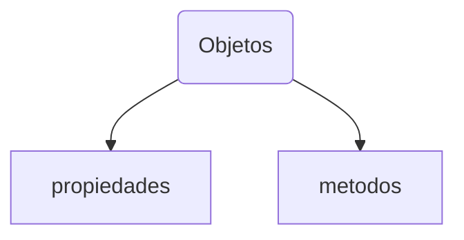
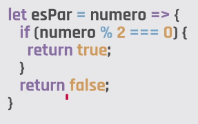
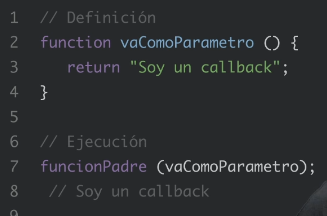

# Objetos literales

En JavaScript, un objeto literal es una entidad independiente con propiedades. A su vez, esas propiedades tienen valores.

El concepto de objetos puede compararse con entidades de la vida real. Por ejemplo, un país representaría un objeto literal con ciertas propiedades: su nombre, cierta cantidad de habitantes, su capital, etc. Del mismo modo, los objetos literales en JavaScript pueden tener propiedades que definan sus características.

Imaginemos entonces que queremos crear el modelo de un país en JavaScript. Mirá este video para aprender cómo hacerlo a través de un objeto literal:

## **`Objetos literales`**

En JavaScript, un objeto literal es una entidad independiente con propiedades. A su vez, esas propiedades tienen valores.

El concepto de objetos puede compararse con entidades de la vida real. Por ejemplo, un país representaría un objeto literal con ciertas propiedades: su nombre, cierta cantidad de habitantes, su capital, etc. Del mismo modo, los objetos literales en JavaScript pueden tener propiedades que definan sus características.

> Se recomienda poner una coma en la ultima propiedad




usamos llaves `{ }`
```
let miPais = { };
```
Dentro de los `{}` seteamos claves y valores, hacen referencia a una particularidad del objeto; la clave =`key` va acompaniada de `:` y el valor = `value` de una `,`.

```
let objeto = {
    propiedad : valor,
    propiedad : valor,
    propiedad : valor,
}
```

```
let mi pais = {
    nombre: 'Colombia',
    poblacion: 2334535,
    capital: 'Bogota',
};
```
## `Propiedades`

Las **`propiedades`** son estas claves (key) y valores (values), son sustantivos.

Para acceder a una propiedad de un objeto usamos `dot notation`.
Debe hacer referencia al objeto literal al que queremos acceder, poner el punto y la propiedad a la que queremos acceder.

```
'La capital de ': console.log('La capital de ' + mipais.nombre + ' es ' + miPais.capital)
```
**Ejemplo**

```
let curso = {
    cantidadAlumnos : 32,
    docentes : ['Nacho','Javier'],
    horario : 'de 11 a 20',
}

//console.log(curso);
//console.log(curso.cantidadAlumnos);
```
## `Metodos`

Los objetos literales tienen metodos.

Los **`metodos`** son funciones que se asignan como valor a una clave y que buscan hacer algo mas alla de tener un simple dato, son funcionales, se escriben con verbo.

Con una estructura similar a la de las funciones expresadas, vemos que se crean mediante el nombre del método, seguido de una función anónima.

Para ejecutar un método de un objeto usamos la notación `objeto.metodo()`. Los paréntesis del final son los que hacen que el método se ejecute

```
let mi pais = {
    nombre: 'Colombia',
    poblacion: 2334535,
    capital: 'Bogota',
    decirNacionalidad: function (){
        return 'Yo naci en Colombia';
    },
};
```

Para ejecutar este metodo, hacemos referencia el nombre del objeto y la `dot notation`; es necesario agregar los parentesis al ejecutar la funcion.

```
console.log(miPais.decirNAcionalidad());
```
## `this`

La palabra reservada this hace referencia al objeto en sí donde estamos parados. Es decir, el objeto en sí donde escribimos la palabra. Con la notación `this.propiedad` accedemos al valor de cada propiedad interna de ese objeto

Para no redundar dentro del metodo y hacer referencia a una propiedad que esta dentro del mismo objeto usamos la palabra `this`.

La Palabra **`this`**, esta palara hace referencia al objeto que esta invocando la funcion.

mejorando nuestro codigo:

```
let mi pais = {
    nombre: 'Colombia',
    poblacion: 2334535,
    capital: 'Bogota',
    decirNacionalidad: function (){
        return 'Yo naci en ' + this.nombre;
    },
};
```
**Ejemplos**

```
let curso = {
    cantidadAlumnos : 32,
    docentes : ['Nacho','Javier'],
    horario : 'de 11 a 20',
    notificaciones : function(){
        return 'El horario de cursada es de' + this.horario;
    },
}
```

## **`Constructor de objetos`**

JavaScript nos da una opción más para crear un objeto, a través del uso de una función constructora. La función constructora nos permite armar un *molde* y luego crear todos los objetos que necesitemos. La función recibe un parámetro por cada propiedad que queramos asignarle al objeto.

El molde para crear objetos objetos literales que conserven la misma estructura.
Es una funcion que toma por parametros los valores que necesitamos que tenga el objeto.
inician con *Mayus*

**Estructura**

**`Nombre`**
Definimos un nombre para la función, que será el nombre de nuestro constructor. Por convención, solemos nombrar a las funciones constructoras con `la primera letra mayúscula`. Esto es para diferenciarlas de las funciones normales.

**`Parametros`**
Definimos la cantidad de parámetros que consideremos necesarios para crear nuestro objeto. Todos los parámetros serán obligatorios para poder crear el objeto, a menos que definamos lo contrario.

**`Propiedades`**
Con la notación `this.propiedad` definimos la propiedad del objeto que estamos creando en ese momento. Por lo general los valores de las propiedades serán los que vengan por parámetros
Molde que crea un auto:

```
function Auto(laMarca, elModelo){
    this.marca = laMarca;
    this.modelo = elModelo;
}
```
## `Instanciar un objeto`

La función constructora `Auto()` espera dos parámetros: marca y modelo. Para crear un objeto `Auto` debemos usar la palabra reservada `new` y llamar a la función pasándole los parámetros que espera.

Crear un objeto particular a partir de su `funcion molde`.
Creamos una variable con el nombre del nuevo objeto, asignamos la palabra reservada new e invocamos la funcion constructora, pasando los parametros necesarios.

```
let miAuto = new Auto('Peugeot',2019);
console.log(miAuto);
```
Cuando ejecutamos el método new para crear un objeto, lo que nos devuelve es una instancia. Es decir, en la variable `miAuto` tendremos almacenada una instancia del objeto Auto. 

Usando la misma función, podemos instanciar cuantos autos queramos.
```
let miOtroAuto = new Auto('Chevrolet', 'Corvette');
```

> Accedemos a las propiedades y metodos a traves de `dot notation`

[ejercicios clase 13]('./clase_13/clase.js);

# JSON

En la web, la mayoría de las peticiones y sus respuestas viajan como texto plano, es decir, texto sin codificaciones especiales.

JSON (JavaScript Object Notation) es hoy por hoy **el formato más utilizado para transferir información**. Este es muy fácil de entender y manipular, ya que posee un formato muy parecido a la sintaxis de un objeto de JavaScript.

Es una cadena de texto facil de compartir y que todos los lenguajes de programacion estan en la posibildad de interpretar.

Se puede convertir a un objeto literal o un array

Javascript nos da un objeto nativo llamado `json` el cual viene con 2 metodos: `.parse()` y `.stringify()`.

- JSON, al ser una cadena de texto simple
- Es un formato ideal para transmitir información entre sitios y aplicaciones web. Especialmente si tenemos en cuenta que JavaScript está presente en todos los navegadores modernos.
- JSON es que cualquier lenguaje de programación puede interpretarlo con facilidad. De hecho, la mayoría de los lenguajes web trabajan nativamente con JSON

- Solo admite comillas dobles
- No admite metodos, solo propiedades y valores
- No va coma en el ultimo elemento


## **`JSON.parse()`**

Convierte un texto con formato JSON al tipo de dato equivalente de JavaScript.
- Recibe una cadena de texto con formatoJSON.
- Devuelve el mismo dato que recibió en formato JavaScript.JSON

Recibe como parametro un dato y retorna el mismo como un objeto array o un objeto literal.


**Ejemplo**
```
let datosEnJson = "[{
    "name":"Argentina",
    "capital":"Buenos Aires",
    "region":"Americas"
}]"

let datosConvertidos = JSON.parse(datosEnJson);

console.log(datosConvertidos);

[
    {
        name: 'Argentina',
        capital: 'Buenos Aires',
        region: 'Americas'
    }
]
```
## **`JSON.stringify()`**

Convierte un tipo de dato de JavaScript en un texto en formato JSON.
- Recibe un tipo de dato deJavaScript.- Devuelve una cadena de texto con formatoJSON.JSON

Lo contrario toma un array u objeto literal y retorna el dato en un string de tipo `JSON` 


**Ejemplo**

```
let datosEnObjeto = {
    nombre: 'Juana',
    apellido: 'De Arco',
    pais: 'Francia'
}

let datosConvertidos = JSON.stringify(datosEnObjeto);
console.log(datosConertidos);

`{"nombre":"Juana","apellido":"De Arco","pais":"Francia"}'
```

> Permiten tener un formato de intercambio de datos sencillo de interpretar por cualquier sistema

Podemos hacerlo con `arrays`

```
//array
let amigos =["Coco", "Pablito", "Sus", "Franco];

//convertir en JSON
let amigosJSON = JSON.stringify(amigos);

//muestro el contenido de amigosJSON
console.log(amigosJSON)

//Recuperar formato original, el array.
let amigosOriginal = JSON.parse(amigosJSON);

//Muestro el ARRAY
console.log(amigosOriginal)
```
Tambien podemos hacerlo con `objetos`:
```
//objeto
let persona = {
    nombre: 'Lili',
    edad: 29,
    domicilio: 'Aqui y alla'
}

//muestro objeto
console.log(persona)

//convertir objeto en string de tipo JSON
let personaJSON = JSON.stringify(persona);

//Muestro el JSON
console.log(personaJSON)

//Reconvertir a objeto
let personaOriginal = JSON.parse(personaJSON)

//Muestro OBJETO
console.log(personaOriginal)
```

# Sistema de módulos (modularización)

Dentro de las muchas ventajas que tiene trabajar con JavaScript está el sistema de módulos. Este no es más que una forma ordenada de trabajo, en la que podemos `separar nuestro código en partes que tengan sentido por su cuenta`.

Supongamos que queremos hacer una torta. A grandes rasgos tenemos dos partes bien definidas: una sería el bizcochuelo para separar las capas y otra sería el relleno. 
¿Tendría sentido que realicemos estas dos preparaciones al mismo tiempo en el mismo lugar? 
¿O sería mejor realizar por un lado el bizcochuelo y por otro el relleno? 
Para finalmente, en un tercer lugar, poder juntar ambas preparaciones y tener la torta terminada.

La **`modularización`** es básicamente eso: 

Poder separar nuestro código en diferentes archivos para hacerlo:
- más fácil de leer
- más corto
- mejor optimizado.

Podemos dividir los módulos en tres categorías:

1. Módulos **externos** son aquellos creados por otras personas o empresas, como lo son comúnmente las librerías y frameworks. Se deben instalar en la carpeta de nuestro trabajo, podemos instalarlos usando algo llamado npm que vamos a conocer más adelante

2. Módulos **nativos** similares a los externos, son funciones y métodos que nos ayudan a crear nuestras aplicaciones, con la diferencia de que vienen incluidos en el lenguaje (o en el caso de Node.js incluidos en el mismo entorno). Ya vienen instalados cuando creamos un proyecto de Node.js

3. Módulos **creados** son nuestras creaciones. Pueden ser variables, funciones, arreglos, casi cualquier cosa que nosotros queramos exportar. Aquellos que escribimos nosotros.

> Por convención, el nombre de la variable que almacene el módulo que estamos requiriendo suele recibir el mismo nombre del módulo, o una abreviatura.Los módulos.

## **`Modulos de node`**

Un `modulo` es un bloque de codigo reutilizable, una unidad de funcionalidad cuya existencia no altera incidencialmente el comportamiento de otros bloques de codigo.

Al programar tenemos que `atomizar` el codigo en pequenios archivos que guarden toda las funcionalidades que estamos creando para un objetivo definido; la existencia o no de ese archivo, no debe alterar la funcionalidad de la aplicacion

`node` nso da modulos para usar libremente, algunos los podemos usar sin instalarlos y algunos otros los instalamos a través de **`npm`**

Para requerir un módulo hace falta situarse dentro del archivo en el que queremos incorporarlo y hacer uso de la función nativa de Node.js: require(). Esta recibe como parámetro un string que será el nombre del módulo.Esta función devuelve un objeto literal. Por lo tanto, es importante guardar la ejecución en una variable para poder acceder, a través del dot notation, a todas las propiedades y funcionalidades del módulo.

```
let modulo = require(‘nombreDelModulo’);
```


[ver modulos nativos de node](http://www.nodejs.org/api);

Comos se usan?

1. Inicializar un proyecto en node, crear el archivo de entrada a la aplicacion, un archivo `app.js` este sera el *Entry point* que node tomara para comenzar a ejecutar la aplicacion.

2. Requerir el modulo que deseo dentro del archivo de entrada, usaremos la funcion nativa de node **`require()`**, esta funcion **toma como parametro un string que sera exactamente el nombre del modulo a requerir**.
    La funcion `require()` retorna algo y esto debe ser almacenado en una variable, de esta manera tendremos a mano toda la funcionalidad del modulo que requerimos. **utilizaremos el modulo a traves de esta variable** 

```
//libreria fs = file system que permite leer y manipular archivos

const fs = require('fs');
```
Al invocar el modulo con `require()` se genera un objeto literal en esa variable.

> Para ver todas las cosas que trae consigo un modulo es un `console.log` de la variable a la que asignamos el `require()`

Tenemos un archivo .txt 'prueba.txt'

.readFileSyn() es un metodo que recibe 2 parametros:
1. que archivo va a leer: Para indicarle donde esta el archivo usamos `__dirname` que es una constante, esto reemplaza automaticamente por la carpeta en donde se ejecute este archivo, asegurando que en cualquier pc que se que ejecute, funcione bien.

concatenamos un string que diga el nombre del archivo que queremos leer, en este caso: `+ '/prueba.txt'`
2. escribimos `'utf-8'` y esto le explica a la libreria `fs` que el archivo puede contener archivos especiales como ejemplo tildes. Esto permite que la codificacion del archivo se respete.


```
// en app.js

let fs = require('fs);

// vemos el objeto literal de fs, entendemos la interfaz
console.log(fs);

//leer un archivo y todos sus datos:
let datos = fs.readFileSync(__dirname + '/prueba.txt', 'utf-8')

//leemos datos
console.log(datos)

```
Requerimos de la libreria `moment`, vamos a `app.js` y vamos a requerirla.
```
let moment = require('moment');

//La llamamos como una funcion y utilizamos el metodo format el cual recibe en que formato queremos imprimir la fecha y horario actual.
console.log(moment().format('MMM Do YYYY'))

```

## **`Modulos creados`**

Para requerir un módulo creado por nosotros, primero hay que crear un archivo con extensión .js y, dentro del mismo, escribir el script que necesitemos.Una vez definido nuestro código, tenemos que dejarlo accesible para poder importarlo dentro de nuestra aplicación. Para eso, hay que hacer uso del objeto nativo module y de su propiedad .exports. A este le asignaremos el nombre de la variable que contenga la información que queremos exponer.
Si quisieramos hacer un modulo, crear una carpeta en la raiz del proyecto y dentro de esa carpeta un modulo que puede ser un archivo `.js`.

Una vez que exportamos nuestro módulo, vamos al archivo en donde lo queremos importar y usamos la función require().En este caso, le pasamos como argumento la ruta hacia el script donde se encuentra el módulo que queremos requerir. Para eso, usamos el ./. De esta forma, le estamos indicando a Node.js que el camino para llegar a ese módulo empieza desde donde estamos parados (app.js), hasta el nombre del archivo que le pasemos.

Cuando nos referimos a archivos de JavaScript, no hace falta escribir la extensión

> Como buena práctica, se suelen almacenar los módulos que creamos dentro de una carpeta con el mismo nombre del módulo que estamos por crear.


Cuando queremos usar la informacion y funcionalidades desde ese archivo?

Necesitamos exportar la variable que te interesa compartir con el archivo `app.js`.

Hacemos uso del objeto nativo de node `module` y su propiedad `.exports`

```
module.exports = variableConInformacionAExponer
```

la variable exportada puede ser un objeto literal con propiedades y metodos.

Volvemos a nuestro *Entry point* `app.js` haciendo el require correspondiente.

Para cada modulo que creemos nosotros y deseemos requerir hay que escribir `./nombreModulo`

** Crear paquete nuestro:**

En carpeta:
/superheroes
index.js

```
let superheroes = [
    {
        nombre: 'Batman'
    },
    {
        nombre: 'Iron Man'
    },
    {
        nombre: 'La Mujer maravilla'
    }
];

module.exports = superheroes;
```
En nuestro *Entry point*:

app.js
Si el archivo se llama `index.js` no hay que escribirlo, si tiene otro nombre ej: `prueba.js` hay que escrbirlo: `require('./superheroes/prueba')`

```
//El nombre de la variable no tiene que ser el mismo
let heroes - require('./superheroes');

console.log(heroes);
```
# File system

En la clase pasada vimos que existe un formato para algunos textos llamado JSON (JavaScript Object Notation), el cual funciona como una especie de interlocutor entre los distintos lenguajes de programación, y distintos programas. Recién vimos cómo el sistema de módulos nos ayuda a organizar mejor nuestro código, así como también nos brinda —mediante los módulos externos o nativos— nuevas funcionalidades para que nuestros programas sean mejores y más eficientes. Ahora, ¡vamos a mezclar un poco estas cosas!

El módulo nativo de Node.js llamado file system (fs) nos provee de la **posibilidad de trabajar con el sistema de archivos de nuestra computadora**, que en términos simples sería acceder al disco duro (o SSD si estamos un poquito más actualizados) para poder realizar algunas lecturas de archivos, modificarlos o mismo crearlos.

En este video vamos a ver un poco cómo podríamos poner en práctica estas funciones y qué tipo de funciones tenemos a nuestra disposición.

## **`.writeFileSync()`**

Es un método que trae el paquete nativo file system que nos permite escribir archivos. Recibe dos parámetros:●El primero corresponde al archivo en donde queremos escribir.●El segundo corresponde al contenido que queremos escribir.Algo importante a tener en cuenta es que si le pasamos el nombre de un archivo que aún no existe, el mismo método se encargará de crearlo.Otra cosa importante a tener en cuenta es que este método borra todo el contenido existente y lo reemplaza por el nuevo.

```
.writeFileSync()constfs=require('fs');
fs.writeFileSync('estrenos-2020.txt','Titanic 2');
```
Los métodos de escritura de archivos que trae file system solo pueden recibir contenido que sea de tipo string. Si lo que queremos guardar es otro tipo de dato de JavaScript, podemos usar el formato JSON. Para convertirlo utilizamos el métodoJSON.stringify().

```
const fs =require('fs');
let pelicula = {    
    titulo: 'Titanic',     
    minutos: 560
};
letpeliculaJson = JSON.stringify(pelicula);
fs.writeFileSync('titanic.json', peliculaJson);
```


`.writeFileSync` Recibe el archivo donde queremos escribir y el contenido que queremos escribir

```
fs.writeFileSync('bienvenida.txt','Hola Mundo');
```

convirtiendo un objeto literal podemos almacenarlos en archivos. usando `.stringify()` para guardar toneladas de informacion.
combinando FileSystem y JSON

`.writeFileSync` Reescribe el archivo, primero borra y luego escribe.
`.appendFileSync` Agrega contenido al final del archivo.

## **`.appendFileSync()`**

Es un método que trae el paquete nativo file system que nos permite agregar contenido a archivos. Recibe dos parámetros:
1. El primero corresponde al archivo en donde queremos escribir.
2. El segundo corresponde al contenido que queremos escribir.
Al igual que writeFileSync(), si le pasamos el nombre de un archivo que aún no existe, el mismo método se encargará de crearlo. 
A diferencia de writeFileSync(), este método agrega el contenido al final del contenido existente sin borrarlo.

```
const fs = require('fs');
fs.apppendFileSync('estrenos-2021.txt','Titanic 3');
```

Esto crea archivo: `prueba.txt` y dentro dice `Hola Mundo!`

```
let fs = require('fs');

fs.writeFileSync('prueba.txt', 'Hola Mundo!');
```
Reescribe `prueba.txt` y ahora dice `Prueba 2`

```
let fs = require('fs');

fs.writeFileSync('prueba.txt','Prueba 2');
```
muestra `Prueba2EL FINAL`

```
let fs = require('fs');

fs.appendFileSync('prueba.txt','EL FINAL');
```

## **`.readFileSync()`**

Es un método que trae el paquete nativo file system que nos permite recuperar datos de un archivo para poder usarlos.Como primer parámetro recibe la ruta del archivo que queremos leer.
```
const fs = require('fs');
let sitcoms = fs.readFileSync('sitcoms.txt');
```
Para poder decodificar los datos que el método devuelve es fundamentalpasarle un segundo parámetro aclarando el tipo de encoding.
```
let sitcoms = fs.readFileSync('sitcoms.txt', 'utf-8');
```

leer un archivo

`.readFileSync('ruta')` Esto nos da un buffer, por eso hay que agregar el utf-8 
`.readFileSync("text.txt",{encoding: 'utf-8'});`
`.readFile` AVERIGUAR

**Ejemplo**

```
let fs = require('fs');

let contenido = fs.readFileSync('prueba.txt',{encoding: 'utf-8'});
```


**Pecularidades**

1. Descromprimir el JSON en un objeto literal   

> Si estamos leyendo un archivoJSON, hay que convertir ese string en un objeto literal para poder manipular los datos usando el método JSON.parse().

## **`JSON.parse()`**

Pasa los datos en formato JSON a un objeto literal para poder ser manipulado con JavaScript.

```
let usersJSON = fs.readFileSync('users.json', 'utf-8');
let users = JSON.parse(usersJSON);
```

# C16 - Arrow Functions

Como ya vimos en clases anteriores, una función es un bloque de código que podemos invocar todas las veces que necesitemos. Puede realizar una tarea específica y retornar un valor, y nos permite agrupar el código que vayamos a usar muchas veces.

En esta ocasión, veremos que existe una forma un poco más compacta de crear o expresar nuestras funciones.

Las arrow functions (o funciones arrow) son una forma de crear funciones incorporadas a partir de ES6 (ECMAScript versión 6). Una de sus ventajas es que son más concisas que las funciones clásicas creadas con la palabra reservada function.

Veamos un ejemplo:

```
// forma clásica
function sumar(a, b) {
 return a + b;
}
console.log( sumar(2, 4) ); // 6

// ES6 arrow function
let sumar = (a, b) => a + b;

console.log( sumar(2, 4) ); // 6
```
> Lo que en la forma clásica llevaba 3 líneas de código, con las arrow functions lo podés resolver en una sola. 

Veamos el siguiente video para entender un poco mejor en qué casos sería mejor utilizarlas y todas las ventajas que traen.

> Ver video: Arrow function

- Deben ser asiganas como valor de una variable
- Si es de una sola linea: No necesita las llaves y el return tambien esta implicito

```
let suma = (num1,num2) => num1 + num2;
```
- si tiene un solo parametro tampoco necesita parentesis

```
let elDoble = num => num * 2;
```
Si es de varias lineas es así:



**Ejemplo**

```
let laMitad = numero => numero / 2;
```
```
let dividir = (numA, numB) => numA / numB;
```

Las funciones arrow nos permiten escribirlas con una sintaxis más compacta.

## Estructura basica

Pensemos en una función simple que podríamos programar de la manera habitual: una suma de dos números.

```
function sumar (a, b){ return a + b}
```

Ahora veamos la versión reducida de esa misma función, al transformarla en una función arrow.

```
let sumar = (a, b) => a + b;
```
## Nombre de una función arrow

Las funciones arrow son siempre anónimas. Es decir, que no tienen nombre como las funciones normales.

```
(a, b) => a + b;
```

Si queremos nombrarlas, es necesario escribirlas como una función expresada. Es decir, asignarla como valor de una variable.

```
let sumar = (a, b) => a + b; 
```

De ahora en más podremos llamar a nuestra función por su nuevo nombre.

## Parámetros de una función arrow

Usamos paréntesis para indicar los parámetros. Si nuestra función no recibe parámetros, debemos escribirlos igual

```
let sumar = (a, b) => a + b;
```
Una particularidad de este tipo de funciones es que si recibe un único parámetro, podemos prescindir de los paréntesis

```
let doble = a => a * 2;
```

## La flecha de una función arrow

La usamos para indicarle a JavaScript que vamos a escribir una función (reemplaza a la palabra reservada `function`).

```
let sumar = (a, b) => a + b;
```
Lo que está a la izquierda de la fecha será la entrada de la función (los parámetros) y lo que está a la derecha, la lógica (y el posible retorno).

> Las funciones arrow reciben su nombre por el operador =>. Si lo miramos con un poco de imaginación, se parece a una flecha.En inglés suele llamarse fat arrow (flecha gorda) para diferenciarlo de la flecha simple ->

## Cuerpo de una función arrow

Como ya vimos, si la función tiene una sola línea de código, y esta misma es la que hay que retornar, no hacen falta las llaves ni la palabra reservada return.

```
let sumar = (a, b) => a + b;
```
De lo contrario, vamos a necesitar utilizar ambas. Eso normalmente pasa cuando tenemos más de una línea de código en nuestra función
```
let esMultiplo = (a, b) => {
    let resto = a % b; // Obtenemos el resto de la div.
    return resto == 0; // Si el resto es 0, es múltiplo
};
```
> ver mas ejemplos en ppt: Funciones Arrow

# CALLBACKS

> Ver video clase 16: Callbacks

- Es una funcion que se pasa como parametro de otra funcion
- La funcion que recibe el parametro es la encargada de ejecutar la funcion recibida por parametro, cuando la necesite
- La funcion enviada por parametro es anonima es un callback, pero no todas son anonimas

```
function funcionPadre (function(){
    // codigo
})
```


Cuando se pasa la funcion callback dentro de `funcionPadre` no se debe ejecutar, no lleva parentesis. `funcionPadre` es quien ejecutara en su momento.


> ver ppt clase 16: Callbacks

