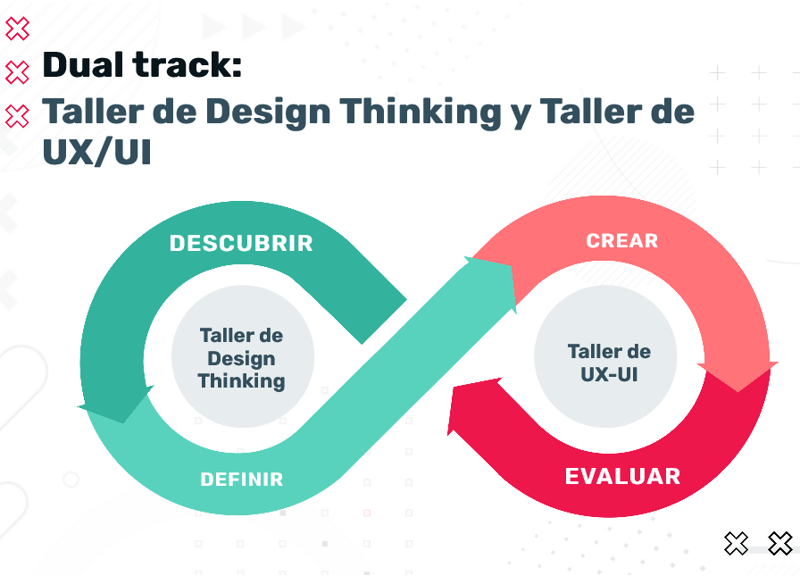
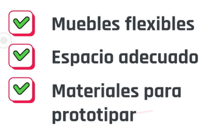
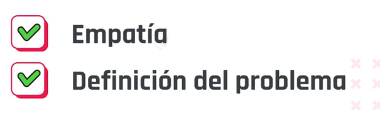
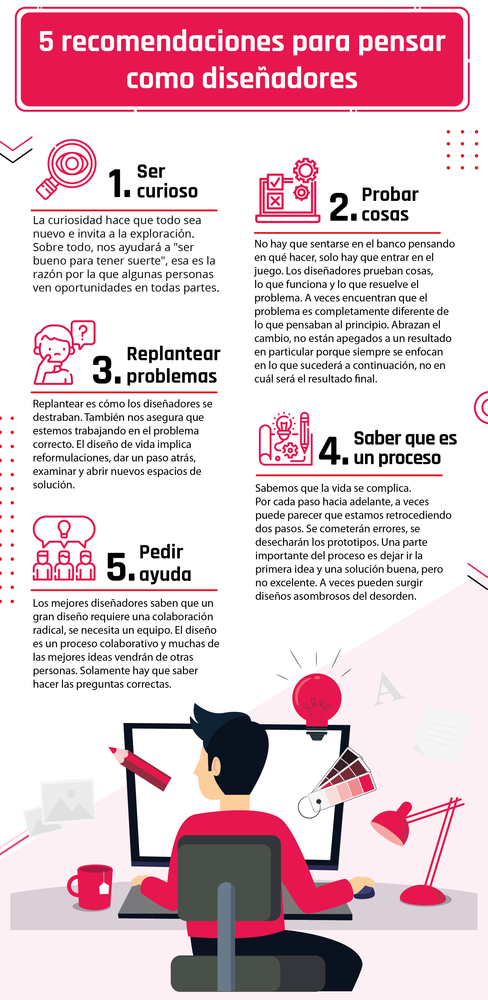
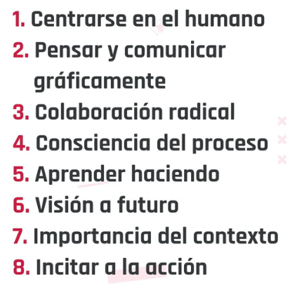

## Índice

1. Introducción a design thinking
- [C1- El disenio es el pensamiento convertido en herramienta](#c1)
    - [Donde estamos](#c1a)
    - [Bienvenida](#c1b)
    - [Componentes esenciales](#c1z)
    - [Factores](#c1y)    
    - [Que es desing thinking](#c1c)
    - [Pilares del Design thinking](#c1d)
    - [Mindset del design thnking](#c1x)
    - [DT como metodo cientifico](#c1e)
    - [Recapitulando](#c1f)
    - [Buenas practicas DT](#c1w)
    - [Como venimos](#c1g)

2. Empatizar
3. Definir e idear 
4. Cierre y aprendizajes

# C1 - El disenio es el pensamiento convertido en herramienta 
    
“El diseño es el pensamiento convertido en herramienta”
En esta primera clase, encontrarás la bienvenida a la materia y el recorrido por los módulos. Además conocerás a los profesores y también los pilares de esta metodología basada en el diseño centrado en las personas.

## Introducción al design thinking 

Actualmente el mayor desafío para el desarrollo de cualquier proyecto viene dado por encontrar modelos de gestión y herramientas de trabajo que nos permitan encontrar experiencias innovadoras y ágiles. En este contexto, las metodologías y marcos de trabajo ágiles se han convertido en los aliados principales para la gestión de proyectos y resulta indispensable formarse en la administración de entornos cambiantes donde prime la flexibilidad y la creatividad. Design thinking es una metodología enfocada en fomentar la innovación en las organizaciones y se destaca por contribuir al desarrollo exitoso de proyectos gracias a la atención y conocimiento sobre los usuarios y a la formación de equipos multidisciplinares.

¿Cuáles son los objetivos de la cursada?

El taller de design thinking de trabajo es un taller práctico diseñado para aprender haciendo de manera colaborativa. Los objetivos del taller son:

- Conocer la importancia de desarrollar metodologías de trabajo en equipo concentradas en los usuarios para alcanzar resultados exitosos.
- Comprender los beneficios de la agilidad en el desarrollo de soluciones reconociendo el error temprano como un aliado de la innovación.
- Conocer las bases y pilares de la metodología design thinking, sus etapas y principales herramientas aplicables en cada una de ellas.
- Aplicar la metodología en casos prácticos a lo largo de la cursada para experimentar los pasos de design thinking.

[Modulos](https://view.genial.ly/612d36c5522db10d76589c04)

### Te damos la bienvenida al Track de Diseño de la carrera.

¿Qué es? Un marco teórico-práctico donde vas a recorrer cada una de las etapas de diseño centrado en las personas.

¿Cómo lo vas a hacer? Empezás acá en Design Thinking, y continuá en el Taller UX/UI.

En el taller de Design Thinking nos centraremos en empatizar para poder identificar los mejores problemas a resolver y aprender a idear posibles soluciones.

En el Taller UX/UI aprenderás a prototipar centrándote en las personas y evaluar las interfaces que diseñes, para validar cuánto valor aportan a los usuarios.

[Dual track](https://view.genial.ly/612f93e39d61930d7ff86934)

## Taller de Design Thinking

### Descubrir

Empatizar desarrollando una comprensión del contexto, experiencias y comportamientos a través de herramientas cualitativas y cuantitativas.

### Definir

Una vez sintetizada la información de las personas, se converge en problemas bien definidos para resolver, priorizando los de mayor impacto.

## Taller de UX-UI

### Crear

Desarrollar un concepto o un conjunto de conceptos, a través de la generación rápida de ideas y la creación de prototipos de baja resolución, que se pueden compartir con otros para recibir comentarios. 

### Evaluar

Los equipos buscan comentarios sobre los prototipos, incluye el feedback sobre las ideas y suposiciones incrustadas en estos. De acuerdo al resultado, se repetirá alguna fase o se avanzará para ejecutarlos. 

***

## Que es Design Thinking 

El design thinking (“pensamiento de diseño” en español) es una metodología flexible e iterativa centrada en el humano para resolver problemas complejos.

> “El design thinking es un enfoque de innovación centrado en el ser humano que se nutre del conjunto de herramientas del diseñador para integrar las necesidades de las personas, las posibilidades de la tecnología y los requisitos para el éxito de un negocio”. Tim Brown (referente y CEO de Ideo)

> Ver video: Introducción al design thinking

<!-- inciio resumen video -->

Design thinking es un enfoque sistematico y centrado en el humano para resolver problemas complejos

para el proceso es fundamental:

- necesidades
- requisitos
- innovacio orientada al usuario

Requiere una retroalimentacion continua entre el desarrollador de la solucion y los usuarios objetivo

Los pensadores del producto deben ubicarse en el lugar de los usuarios finales
- Entrevistándolos
- Observando cuidadosamente sus comportamientos

Las soluciones e ideas se concretan y comunican en forma de prototipos lo antes posible, para obtener devoluciones de los usuarios antes de finalizar el producto

La innovacion y resolución efectiva de problemas segun esta mirada combina 3 componentes esenciales 

1. Viabilidad tecnica
2. Usabilidad economica
3. Deseabilidad humana

refleja una perspectiva humana que tiene a novedad y Deseabilidad

3 factores importantes para que sea exitoso: 

1. Interaccion colaborativa entre equipos multidisciplinarios

- respuestas heterogeneas
- surgen en grupos de entre 3 y 6 personas
- grupo de diferentes profesiones
- equipo con curiosidad y busqueda de nuevas perspectivas 
- objetivos especificos

2. El espacio de trabajo debe ser flexible y promover el trabajo colaborativo 
- condiciones espaciales optimas
- muebles flexibles
- espacio adecuado
- materiales para prototicar
- trabajar de pie 

3. El flujo de trabajo debe seguir el proceso de pensamiento del producto
- empatia del problema por identificacion
- consultar expertos
- participacion con personas, experiencias y motivaciones
- definicion el problema se sintetizan los desafios principales que se identificaron

<!-- fin resumen video -->

***

## Pilares del Design Thinking 

Design thinking, el enfoque increíblemente popular de la innovación, requiere un cierto tipo de mentalidad. Las personas que desean innovar en su trabajo y crear mejores experiencias, productos y servicios para sus usuarios o clientes pueden beneficiarse de la aplicación de ciertas actitudes que pueden potenciar su pensamiento y creatividad.

1. Ser curioso
2. Probar cosas
3. Replantear problemas
4. Saber que es un proceso
5. Pedir ayuda

> ver PDF: Minset del design thinking

<!-- resumen pdf -->

## Introducción

- Cada problema en este mundo es una oportunidad en sí mismo y la razón por la que las personas luchan por resolver sus problemas es que el 95% de ellos están pensando en soluciones en lugar de pensar en el problema.
- El diseño funciona según este mismo principio fundamental. Si nos enfocamos menos en el resultado y más en el pensamiento de diseño como enfoque, eso puede resultar en un impacto mayor.
- El pensamiento de diseño es un enfoque creativo de resolución de problemas con herramientas, métodos y mentalidad específicos. Los diseñadores lo utilizan para crear nuevos valores que son diferentes y para crear un impacto positivo. Practicarlo correctamente conduce a la innovación.

> El design thinking es una actitud que nos libera.

## ¿Por qué pensar en el diseño?

Esto ofrece a quienes no son diseñadores una nueva forma de abordar los problemas. En lugar de seguir el enfoque convergente normal en el que toman la mejor decisión de las alternativas disponibles, los alienta a explorar nuevas alternativas, soluciones e ideas que no han existido antes

## Análisis de causa raíz

Cuando se nos asigna la tarea de diseñar algo, debemos resolver el problema y averiguar cuál es el objetivo real preguntándonos: **"¿Por qué?"**, hasta que alcancemos el objetivo final. A esto se le llama análisis de causa raíz. Del mismo modo, existen varias herramientas, métodos y mentalidades que los diseñadores deben utilizar para ofrecer mejores soluciones.

[Mindset del desing thinking](https://view.genial.ly/60ae3137a048f80db59e786c) 

### 1. Mostrar, no decir

Comunicar lo que está pensando mediante imágenes. Es más efectivo que las palabras. Esto se puede hacer creando experiencias, usando imágenes ilustrativas y contando buenas historias.

### 2. Centrarse en los valores humanos

La empatía por las personas que diseñamos y la retroalimentación de ellas es fundamental para un buen diseño.

### 3. Claridad artesanal 

Crear una visión clara sobre el diseño a partir de muchos problemas. Enmarcar la visión y ponerla de manera que alimente la ideación e inspire a otros.

### 4. Abrazar la experimentación 

El prototipo no es simplemente una forma de validar nuestra idea, sino que es una parte integral del proceso de innovación. Pensar fuera de la caja, prototipar e iterar. Pensar, hacer y aprender de ello.

### 5. Ser consciente del proceso 

Conocer el proceso de diseño, dónde se encuentra ahora en el proceso, qué métodos utilizar en qué fase y cómo aplicarlo para alcanzar los objetivos.

### 6. Sesgar hacia la acción 

Un buen diseño se logra cuando realmente se hace. Muchas veces pasamos tanto tiempo pensando y creamos solo una cosa. Deberíamos esforzarnos más por hacer y hacer cosas, iterando una y otra vez después de pensar. Hacer también puede resultar en innovación.

### 7. Colaboración radical 

Reunir a diseñadores e innovadores de diferentes orígenes, intereses y puntos de vista variados. Cuando personas de diferentes campos se unen, pueden surgir ideas innovadoras.

***

## Design thinking como método científico 

Para profundizar en nuestra introducción y usando una analogía, podemos decir que el design thinking se asemeja al método científico. El método científico, que posibilitó tantos avances e innovaciones en los últimos siglos, fundamentalmente nos propone observar la realidad, postular una hipótesis y comprobarla mediante la experimentación. De forma similar, podemos decir que en DT observaremos a los usuarios para postular hipótesis del negocio y comprobarlas a través de prototipos. Por último, otra de las características del DT es que propone un enfoque sistemático y metodológico a la resolución de problemas, sea desarrollando un producto, servicio, emprendimiento u otro desafío, esto significa que podremos seguir una serie de pasos ordenados que nos orienten al logro de nuestros objetivos.

¿Listos para pensar en grande? ? ¡Les recomendamos la siguiente [charla TED](https://www.youtube.com/watch?v=UAinLaT42xY) para seguir aprendiendo e inspirándonos!

<!-- ideas video ted -->

pensamiento integrador: Capacidad de explotar ideas opuestas y limitaciones opuestas para crear nuevas soluciones

en disenio significa: equilibrar deseabilidad, lo que los humanos necesitan con viabilidad tecnica y viabilidad economica 
<!-- fin ideas -->

***

## Recapitulando 

> ver video: Recapitulando clase 1

<!-- resumen video -->

formas de trabajar de los disenadores

pensar en un otro
deetctar necesidades de otra persona
pensar y comunicar graficamente
construir en equipo, de cultura y perspectiva diferente
herramienta para cada caso
aprender haciendo
cultura de prototipo
incertidumbre
optimismo
acompaniamiento de quipo

<!-- fin resumen -->

## Buenas practicas design thinking 

1. Centrarse en el humano
2. Pensar y comunicar graficamente
3. Colaborarion radical
4. Consciencia del progreso
5. Aprender haciendo
6. Vision a futuro
7. Importancia del contexto
8. Incitar a la accion

