<style>
@import url('https://fonts.googleapis.com/css2?family=Roboto+Mono&display=swap');
t {
font-size: 50px;
color: #006d77;
font-family: 'Roboto Mono', monospace;
letter-spacing: 5px;
}
h1 {
color: #f2cc8f
}
h2 {
color: #e07a5f;
}
h3 {
color: #cd9777
}
r {
color: #03045e;
background-color: #90e0ef;
}
</style>


---

<t>Front End II</t>

---

## Índice

1. Bienvenida e Introducción a Javascript Front

-   [C1 - Bienvenida](#c1)
    -   [Introducción a la materia](#c1a)
    -   [Origen de JavaScript](#c1b)
    -   [DevTools: Consola](#c1c)
    -   [console.log()](#c1z)
    -   [alert()](#c1y)
    -   [Vinculando HTML y JavaScript](#c1s)
-   [C2 - Introducción a JavaScript Front](#c2)
    -   [Capturando datos del cliente](#c2a)
        -   [prompt()](#c2a1)
        -   [confirm()](#c2a2)
    -   [Manipulando datos](#c2b)
        -   [ParseInt()](#c2b1)
        -   [ParseFloat()](#c2b2)
        -   [Math()](#c2b3)
    -   [Bucles específicos](#c2c)
        -   [for in](#c2c1)
        -   [for of](#c2c2)
    - [Notas clase 2](#c2s)
    -   [Juego: Piedra papel o tijera - Nivel I](#c2s1)
        -   [Solución: Juego Nivel I](#c2s1a)
-   [C3 - Repaso](#c3)
    -   [Juego: Piedra papel o tijera - Nivel II](#c3s1)
    -   [Solución: Juego Nivel II](#c3s1a)

2. Manipulacion del DOM
-   [C4 - Introducción al DOM](#c4)
    -   [Objeto window y document](#c4a)
        -   [window](#c4a1)
        -   [document](#c4a2)
        -   [Quiz + repaso](#c4a3)
    -   [Seleccionando elementos](#c4b)
        -   [.querySelector](#c4b1)
        -   [.querySelectorAll](#c4b2)
        -   [Selectores del DOM](#c4b3)
        -   [Comparando selectores](#c4b4)
- [C5 - Modificando elementos con Javascript](#c5)
    - [Modificando el DOM](#c5a)
    - [Plantillas de texto / template literals](#c5b)
    - [Modificando estilos](#c5c)
    - [Modificando clases](#c5d)
- [C6 - Trabajando con nodos](#c6)
    - [Nodos en HTML](#c6a)
        - [Creación de nodos en el DOM](#c6a1)
        - [Métodos del objeto document](#c6a2)
        - [Sintaxis para crear un nodo elemento](#c6a3)
        - [Sintaxis para crear un nodo de texto](#c6a4)
        - [Sintaxis para adherir un elemento hijo al DOM](#c6a5)
    - [Elementos y atributos dinamicos](#c6b)
        - [Atributos dinamicos](#c6b1)
3. Web reactiva
- [C7 - Catch-up + Intro a eventos](#c7)
- [C8 - Que son los eventos?](#c8)
    - [¿Qué son los eventos?](#c8a)
        - [Carga de archivo js](#c8a1)
        - [on](#c8a2)
        - [preventDefault()](#c8a3)
        - [Eventos mas usados](#c8a4)
        - [preventDefault()](#c8a5)
        - [AddEventListener()](#c8a)
    - [Eventos de mouse](#c8b)
        - [Ejemplo varios eventos en simultaneo](#c81)
    - [Eventos del teclado](#c8c)
    - [Invocando funciones](#c8d)
        - [Tipos de funciones](#c8d1)
        - [Scope](#c8d2)
        - [Arrow functions](#c8d3)
        - [Funciones como parametros](#c8d4)
        - [Callbacks](#c8d5)
    - [Palabras reservadas: var - let - const](#c8e)
- [C9 - Enlazando conceptos](#c9)
    - [Notas clase 9](#c9s)
        - [setTimeOut()](#c9s1)
        - [setInterval()](#c9s2)
- [C10 - Primer entregable](#c10)
- [C11 - Formularios I](#c11)
    - [Estructura de un formulario: Inputs > Select > Textarea](#c11a)
    - [Almacenar datos](#c11b)
    - [Normalizando datos: Metodos de strings](#c11c)
    - [Quiz](#c11d)
- [C12 - Repaso](#c12)

4. Validación del lado del cliente

- [C13 - Formularios II](#c13)
    - [Evento de formularios](#c13a)
    - [Quiz](#c13b)
    - [Validaciones](#c13c)
    - [Live coding : Validaciones](#c13d)
    - [Objeto `location`](#c13e)
    - [Quiz](#c13f)
- [C14 - Json y Storage](#c14)
    - [Objeto literal vs Json](#c14a)
    - [Metodos JSON](#c14b)
    - [Objetos: LocalStorage y SessionStorage](#c14c)
    - [Quiz!](#c14d)
- [C15 -  Proyecto integrador](#c15)

5. Asincronismo y APIs
- [C16 - Introducción a Asincronismo](#c16)
    - [Introducción a HTTP > Request - Response](#c16a)
    - [Protocolo http > URI](#c16b)
    - [Como viaja la información](#c16c)
    - [Metodos http](#c16d)
    - [Códigos de estado HTTP](#c16e)
    - [Quiz](#c16f)
- [C17 - APIs I](#c17)
    - [Endpoint](#c17a)
    - [Rest](#c17b)
    - [AJAX](#c17c)
    - [AJAX Fetch - GET](#c17d)
    - [Try, Catch y Finally](#c17e)
- [C18 - APIs II](#c18)
    - [AJAX Fetch - POST](#c18a)
    - [Postman](#c18b)
- [C19 - To-Do app: docs](#c19)

6. implementación practica, animaciones y librerías

# C1 - Introducción <a id='c1'></a>

[Módulos de Front End](https://view.genial.ly/60ab9dbe27391f0d8711d89a) <a id='c1a'></a>

## Origen de Javascript <a id='c1b'></a>

> Ver video: Conociendo Javascript

<!-- inicio resumen video -->

Primero llamado _Mocha_, luego _LiveScript_ luego **_Javascript_**


### Cronologia

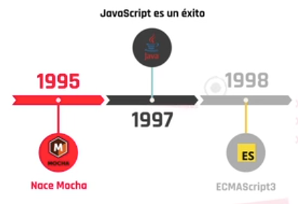


### Evolución Javascript


<!-- Fin resumen video -->

> ver repaso PDF: repaso-javascript

---

## Conociendo la consola del navegador <a id='c1c'></a>

> Ver pdf: devtools

<!-- Inicio resumen pdf -->

La consola es una herramienta que tenemos los desarrolladores en el navegador para tomar decisiones sobre nuestro proyecto al mismo tiempo que es interpretado por Chrome.

¿qué podemos hacer con ella?Cuando algo no funciona como queremos, podemos pasar mucho tiempo intentando descubrir cuál es el problema y arreglarlo. Por eso, la consola nos sirve para agilizar este proceso porque nos señala qué ocurre cuando ejecutamos una tarea o petición al servidor. Puede ser que nos devuelva el dato que buscábamos, un error o un aviso (warning). A este proceso se lo llamadepurar el código o debugging.

**Elements y Styles**

En la pestaña Elements veremos el código HTML y en Styles, nuestro CSS. Si hacemos clic en la flecha indicada en la imagen y luego, colocamos el mouse sobre los elementos en pantalla, nos daremos cuenta fácilmente dónde se encuentran en el código para poder manipularlos y apreciar el cambio sin tener que ir al editor de texto y guardar.

## Tipos de errores

Existen varios tipos de errores, en la consola se muestran en color rojo. Por ahora, los más comunes que vamos a conocer son:

-   **SyntaxError**: Representa un error de sintaxis en el lenguaje representado en JavaScript.
-   **TypeError**: Representa un error que ocurre cuando una variable o parámetro no es de un tipo válido, es decir, `undefined`.

## Responsive

Muchas veces necesitamos adaptar nuestra web para poder visualizarlas correctamente en distintos dispositivos. En la parte superior del inspector hay un icono de dispositivo, al hacer clic podemos determinar la resolución de pantalla o, directamente elegir un dispositivo.

## Application

Con la pestaña Application podremos ejecutar tareas respecto a los datos que se guardan por el cliente en nuestra web por cierta cantidad de tiempo. Como, por ejemplo, borrar de la memoria los datos ingresados en el login de un usuario.

_Lighthouse_ es una herramienta que genera reportes para comprobar ciertos recursos que debe tener la web para que sea óptima. Algunos de ellos son:

-   performance,
-   accesibilidad y
-   SEO.

<!-- fin resumen pdf -->

> Ver PDF: Javascript: Baby steps

<!-- inicio resumen pdf -->

## Primeros pasos en JavaScript

### `console.log()` <a id='c1z'></a>

Ahora que conocemos la consola como parte de las herramientas que debemos utilizar al desarrollar, pongamos en práctica algunas líneas de código.

Lo clásico sería mostrar un mensaje por consola, para eso, debemos implementar el método `log()` del objeto `Console`. Entonces, ¿cómo sería?

```javascript
console.log("Esto es un mensaje por consola");
```

Podemos probar ejecutar la misma sentencia con diferentes mensajes, incluso con
distintos tipos de datos y deberíamos tener el mismo resultado. Por ejemplo:

```javascript
console.log("Hola, soy otro texto");
console.log(25);
console.log(true);
```

**Variantes**

Como alternativas al .log() —pero rara vez implementadas— está bueno saber que
existen otros métodos como:

`.error()` Escribe un error en consola

`.warn()` Escribe una advertencia en consola

`.table()` Escribe una tabla en consola

```javascript
let miObjeto = {
    mensaje: "Mensaje de texto",
    utilidad: "prueba de JS",
};

let miArray = ["Primer mensaje del array", "Segundo mensaje del array", "Tercer mensaje del array"];

console.table(miObjeto);
console.table(miArray);
```

Sigamos probando alternativas, familiarizándonos con la consola del navegador e
implementemos código para obtener distintos resultados.
**También podemos realizar operaciones aritméticas y relacionales.**

```javascript
let numero = 5;
let numeroEnLetras = "5";

console.log(numero == numeroEnLetras);
console.log(numero === numeroEnLetras);
```

### `alert()` <a id='c1y'></a>

Así como mostramos mensajes por consola, los cuales son muy útiles para debbuggear nuestro código, también tenemos mensajes de alerta que puede ver el
usuario.
El método `alert()` pertenece al objeto `window`, pero para utilizar podemos
directamente implementarlo en la consola.

```javascript
alert("Esto es una alerta");
```

El método muestra una caja de alerta con el mensaje que le pasamos por parámetro y un botón de OK. Justamente es implementado para mostrarle al usuario cierta información que creamos importante. De esta manera simple y rápida ya podemos comunicarnos con el usuario.

No se trata de la interfaz más bonita del mundo, pero al menos así podemos mostrar
un cartel inevitable a la vista.

**Quiz**

¿Qué combinación de teclas abre la consola del navegador?
Ctrl, Shift + I
¡Correcto! Además de F12, podemos utilizar la combinación Ctrl, Shift + I

Puedo crear una variable directamente en la consola.
Verdadero

La consola solo es visible para los usuarios que están logueados.
Falso

A través de la consola puedo modificar páginas web.
Verdadero

¿Cuál es la función principal de la consola?
Depurar páginas web.

¿Puedo activar o desactivar la consola en mi sitio web?
Jamás, es una herramienta del navegador.

Al cerrar la consola pierdo todos los cambios que realicé en la misma.
Falso
¡Correcto! Las variables se mantienen hasta que se cierre o cambie de página el sitio.

<!-- inicio pdf clase sincrónica c1 -->

> Ver pdf: Vinculando HTML y JavaScript.pdf

## Vinculando HTML y JavaScript <a id='c1s'></a>

### Vinculación interna

Nos permite escribir código JavaScript directamente en nuestro archivo HTML. Sin embargo, esta no es la forma más prolija de trabajar.

```javascript
<body>
    <script>console.log(“HolaMundo!”);</script>
</body>
```

### Vinculación externa

Nos permite linkear nuestro archivo HTML con un archivo JavaScript externo

```javascript
<body>
    <script src="js/main.js"> </script>
</body>
```

Recordemos que, con el uso de la vinculación externa, no es necesario escribir las etiquetas `<script>` dentro de nuestro archivo con extensión **.js**

```javascript
let saludo = "Hola mundo!";

console.log(saludo);
```

<!-- fin pdf clase sincrónica -->

# C2 - Introducción a javaScript Front <a id='c2'></a>

## Capturando datos del cliente <a id='c2a'></a>

> Ver video: Capturando datos del cliente

Como vimos anteriormente, JavaScript en el navegador nos provee de ciertos objetos y métodos que podemos aplicar con un simple llamado a los mismos. Para continuar utilizando métodos de Window, podemos sumar otros que le permiten al usuario ingresar información, la cual podemos captar y utilizar en nuestros programas.

```javascript
alert("Esto es un alerta");
```

> Ver PDF: alert(), prompt(), confirm().pdf

## prompt() <a id='c2a1'></a>

Uno de ellos es el prompt(), este muestra un cuadro de diálogo con mensaje opcional, que solicita al usuario que introduzca un texto. Además tiene dos opciones: “Aceptar” o “Cancelar”.

```javascript
prompt("Ingresa nombre completo");
//Usuario ingresa contenido que queda tipo string

console.log(prompt("Ingresa nombre completo"));
//Muestra por consola lo que ingreso el usuario, de lo contrario es null
```

Por el momento ese dato se pierde, pero si lo almacenamos en un variable podremos utilizarlo para el resto de nuestro programa. Hagamos esa prueba.

```javascript
let nombreUsuario = prompt("Por favor, introduzca su nombre");
console.log(nombreUsuario);
```

> Al utilizar un espacio en memoria para guardar este dato, podremos utilizarlo como información. En el caso de que el usuario seleccione “Cancelar”, el resultado que nos retorna es null. En cambio, si el usuario presiona “Aceptar” sin completar nada, nos devolverá un texto vacío. Probemos también este caso y veamos el resultado.

## confirm() <a id='c2a2'></a>

El método `confirm()`muestra un cuadro de diálogo con un mensaje opcional y dos botones, “Aceptar” y “Cancelar”. En este caso, lo que nos <r>permite es ingresar alguna pregunta o indicación al usuario</r> para que este responda por sí o no únicamente. El valor que nos va a retornar es un booleano indicando `true` si pulsamos Aceptar y `false` si elegimos Cancelar.

```javascript
confirm("Esto pregunta y pide aceptar o cancelar");

console.log(confirm("acepta o cancela"));
// Devuelve true o false por consola
```

Recordemos que por sí solo el método no almacena ningún dato, pero si almacenamos el valor retornado en una variable, lo podremos utilizar como información. Hagamos la prueba de combinar ambos métodos en algo más funcional.

```javascript
let tratoPersonalizado = confirm("¿Desea un trato personalizado?");

if (tratoPersonalizado) {
    let nombre = prompt("Por favor, introduzca su nombre");
    alert("Le damos la bienvenida a nuestro sitio " + nombre + ". ¡Muchas gracias por visitarnos, estamos a su disposición!");
} else {
    alert("Gracias por conectarse.");
}
```

Ahora sí podemos ir viendo cómo tiene más sentido implementar los métodos, pero de manera conjunta para lograr un resultado más complejo. O por lo menos guardar esos datos y utilizarlos cuando lo creamos conveniente.

**Quiz**

Un modal es una pequeña ventana con la que el usuario interactúa y no desaparece hasta que presiona “OK” o “Aceptar”.
Verdadero

¿Qué método de window usamos en JavaScript para que el usuario ingrese datos por teclado?
`prompt()`

¿Cuál es la diferencia entre alert y confirm?
Con alert hay un botón para aceptar que el mensaje fue recibido, confirm hace una consulta al usuario y este decide por “Aceptar” o “Cancelar”.
¡Correcto! Con ambos métodos se utilizan botones y la ventana del modal no desaparece hasta pulsarlos. En el caso de alert, solo se podrá presionar “Aceptar” mientras que con confirm, nos aseguramos que el usuario decida por sí o por no, es decir, “Aceptar” o “Cancelar”.

Si no completo un dato en prompt y pulso “Aceptar”, retorna por defecto una cadena de texto vacío.
Verdadero
¡Correcto! El valor por defecto siempre será una cadena de texto en caso de “Aceptar” y null en caso de “Cancelar”.

Los datos obtenidos con cualquiera de los métodos de window se almacenan automáticamente y se visualizan en consola.
Falso
¡Correcto! Los datos se pierden si no son almacenados en una variable.

¿Qué retorna un prompt() si el usuario presiona “Cancelar”?
`null`
¡Correcto! El valor por defecto de la opción “Cancelar” es null, es decir, nulo o vacío. Que no existe. A diferencia de undefined, que existe, pero no está definido.

¿Qué tipo de dato almacena un confirm()?
booleano
¡Correcto! Porque “Aceptar” es verdadero (Sí) y Cancelar es falso (No).

---

## Manipulando datos <a id='c2b'></a>

**PARSEANDO**

Como vimos, los resultados de los valores obtenidos con el método `prompt()` no
siempre coinciden con el tipo de dato que necesitamos. Es decir, si le pedimos al
usuario que ingrese su edad y la guardamos en una variable para usar la misma y
sumársela al año actual, veremos que no obtenemos el resultado pretendido. 😐

```javascript
let edad = prompt("ingrese su edad");
console.log(edad + 2021);
```

Está claro que si a un texto le sumamos un número no obtendremos la sumatoria,
sino que tendremos la concatenación de ambos como un texto.

## `parseInt()` <a id='c2b1'></a>

Para no incurrir en errores como el anterior u otros tantos que pueden surgir de no comprobar el tipo de dato que estamos manipulando tenemos la función `parseInt()`. <r>Esta función parsea una cadena de texto y **devuelve un número**.</r>

```javascript
parseInt("22");
parseInt(prompt("Ingrese edad"));
```

De nuevo a lo de siempre, si no guardamos estos datos en ningún lado, difícilmente podamos hacer algo con ellos. Para eso, implementamos variables que almacenan el resultado de las funciones. Veamos su resultado.

```javascript
let a = parseInt("22");
let b = parseInt(prompt("Ingrese edad"));
let c = parseInt("22" + "150");
let d = parseInt(22 + 150);
let e = parseInt(22 + parseInt("150"));
let f = parseInt(22.55);
console.log(a); //22
console.log(b); //30
console.log(c); //22150
console.log(d); //172
console.log(e); //172
console.log(f); //22

//devuelve números
```

Al combinar y probar distintas posibilidades obtendremos distintos resultados, lo
fundamental es entender el funcionamiento de cada método y función para aplicarlo
según nuestras necesidades. Como vemos, en un caso puntual observamos que la
función `parseInt()` solo nos devuelve la parte entera del número que ingresemos, por lo que <r>si tenemos decimales los mismo quedarán truncados</r>.

## `parseFloat()` <a id='c2b2'></a>

Acá entra en juego esta otra función, que tiene el mismo objetivo que la anterior, pero en este caso si nos retorna los números decimales que existan.

```javascript
console.log(parseFloat(22.34));
console.log(parseFloat(22.3456284));
```

> Si fuimos probando estas funciones y además por curiosidad, o error —ambos son sumamente útiles🙂—, intentamos parsear un texto, vimos que el resultado obtenido no es un número.

## `NaN`

La propiedad `NaN` nos indica que el valor no es un número _(Not A Number)_, por lo que esto nos produciría un error si queremos realizar alguna operación aritmética con este valor.
Pongamos este ejemplo de una situación que nos produciría un error.
Supongamos que en el siguiente código, al ejecutarse, en el cuadro de
diálogo del prompt el usuario, por error o a propósito —cosa que
debemos tener en cuenta como programadores🧐—, ingresa un texto
“su edad”.

```javascript
let edad = parseInt(prompt("Ingrese su edad"));
if (edad > 18) {
    console.log("Es mayor de edad");
} else {
    console.log("Es menor de edad");
}
```

> 🚨Claramente no estamos exentos de que el usuario sea un [troll](<https://es.wikipedia.org/wiki/Trol_(Internet)>), por eso, siempre tenemos que buscar maneras de validar los datos que el usuario puede manipular.

**Desafio**

Te invitamos a resolver el siguiente desafío para seguir practicando. Para ello,
podés abrir el VS Code y pegar el último bloque de código implementado.

-   ¿Cuál es el resultado de este código?
-   ¿Es correcto lo que arroja en base a lo que ingresó el usuario?
-   ¿Dónde podría existir un problema?
-   ¿Cómo podríamos solucionarlo y llegar a un mejor resultado utilizando los
    métodos que ya conocemos? → Tip
    🎈Animate a refactorizar el código, pensar en los posibles errores y cómo salvarlos.

→ Tip: Tenemos la función `isNaN()`, la cual nos devuelve `true` si el valor dado como parámetro es NaN. Para conocer más podés ingresar [acá](https://developer.mozilla.org/es/docs/Web/JavaScript/Reference/Global_Objects/isNaN).

**Resolución**

```javascript
let edad = parseInt(prompt("Ingrese su edad"));

if (isNaN(edad)) {
    console.log("No es un numero");
} else if (edad > 18) {
    console.log("Es mayor de edad");
} else {
    console.log("Es menor de edad");
}
```

**EXTRA**

## Math() <a id='c2b3'></a>

Como un apartado de esta sección, traemos para revisar información de un objeto
que quizás nos sirva en algún momento de nuestro desarrollo. Estamos hablando de
[Math](https://developer.mozilla.org/es/docs/Web/JavaScript/Reference/Global_Objects/Math), que consta de muchísimas propiedades y métodos que nos pueden ser de
utilidad.

> Ver PDF: Math.pdf

<!-- resumen math -->

> ¿Para qué crear algo que ya existe y resuelve el problema por nosotros?

**Objetos incorporados en JavaScript**

Cuando hablamos de objetos incorporados, nos referimos a “cosas ya inventadas”. En referencia a la frase anterior, la respuesta puede variar, pero si existe una función o método que resuelve un problema típico, podemos recurrir a eso. No siempre es necesario crear una nueva solución, podemos implementar las disponibles.Justamente el objeto Math es uno de los casos porque tiene propiedades y métodos para constantes y funciones matemáticas.

**Propiedades**

Rara vez implementaremos alguna de las propiedades, pero estas se encuentran todas más que disponibles.

Por poner un ejemplo, podemos utilizar la propiedad que nos devuelve PI.

```javascript
Math.PI; //3.141592653589793
```

> En total son 8 constantes matemáticas a las que se puede acceder.

**Métodos**

Estos son funciones matemáticas que ya conocemos, se utilizan diariamente para realizar cálculos. Algunas de ellas son:

| Método           | Función                                                                       |
| ---------------- | ----------------------------------------------------------------------------- |
| `Math.random();` | Retorna un punto flotante, un número pseudoaleatorio dentro del rango [0, 1). |
| `Math.round();`  | Retorna el valor de un número redondeado al entero más cercano.               |
| `Math.max();`    | Devuelve el mayor de cero o más números.                                      |

> ver mas [metodos aquí](https://developer.mozilla.org/es/docs/Web/JavaScript/Reference/Global_Objects/Math#propiedades)

**Ejemplos**

`Math.random()`

Obtiene un número aleatorio basado en un algoritmo.

-   **No recibe parámetros.**
-   **Retorna** un punto flotante, un número pseudoaleatorio dentro del rango [0, 1). Desde el 0 (Incluido) hasta el 1, pero sin incluirlo (excluido).

```javascript
let randomSimple = Math.random(); // 0.049253517516472556
let randomEscalado = Math.random() * (100 - 1) + 1; // 86.5806550233727
parseInt(randomEscalado); // 86
```

`Math.round()`

Devuelve el valor del número dado redondeado al entero más cercano.

-   **Recibe** un número, idealmente con punto flotante (float).
-   **Retorna** el valor del número dado redondeado al entero más cercano.

```javascript
let num = Math.round(20.49); // 20
let aleatorio = Math.random() * (100 - 1) + 1; // 86.5806550233727
Math.round(aleatorio); // 87
```

`Math.max()`

-   **Recibe** un conjunto de números.
-   **Retorna** el mayor de cero o más números.

> Si al menos uno de los argumentos no puede ser convertido a número, el resultado es `NaN`.

```javascript
let numUno = Math.max(10, 20);   //  20
let numDos = Math.max(10, 20, 30.58);   //  30.58
let numTres = Math.max(10, 20, 30.58, “No”);   //  NaN
```

<!-- fin resumen pdf -->

[Juego: Piedra papel o tijera con Math()](https://view.genial.ly/60a68f844000a90d34ab3be5)

<!-- imágenes c2b1 al c2b7 -->

## Bucles específicos <a id='c2c'></a>

> Ver video: Bucles específicos

Los bucles o loops son una gran herramienta para poder recorrer elementos iterables. Sumemos algunas opciones más a las que ya conocemos.

### `for in` <a id='c2c1'></a>

Solo itera sobre objetos literales
necesitamos un objeto sobre el cual iterar por ejemplo _persona_

```javascript
let persona = {
    nombre: "Valentina Réquiz",
    edad: 30,
    profesion: "Programadora",
};
// palabra reservada for, parentesis y llaves, dentro de los parentesis declaramos unas variable cualquiera seguido de in mencionamos el objeto que deseemos iterar
for (let caracteristica in persona) {
    //aquí podemos el código que va a iterar
    //la variable característica toma las propiedades del objeto, no sus valores
    //si usamos en el console log el objeto y en corchetes la variable, traerá los valores de cada propiedad
    console.log(persona[caracteristica]);
}
```


## `for of` <a id='c2c2'></a>

Lo usaremos para iterar sobre arrays
necesitamos un array sobre el cual iterar
también nos servira para iterar sobre cadenas de texto
La sintaxis es parecida a la de `for in`

```javascript
let series = ["Squid Game", "Foundation", "The Orville"];

for (let unaSerie of series) {
    console.log(unaSerie);
}
```

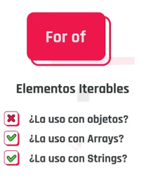

> ver PDF: Bucles específicos.pdf

<!-- resumen pdf -->

Las sentencias de Javascript for...in y for...of nos van a permitir iterar elementos usando una sintaxis clara y sencilla.

### Estructura for in

Estructura del for...in El bucle for...in nos permite iterar sobre cada una de las propiedades de un objeto

**for in**


### Estructura for of

**for of**

El bucle for...of nos permite iterar sobre cada uno de los valores de un elemento iterable, por ejemplo, un array

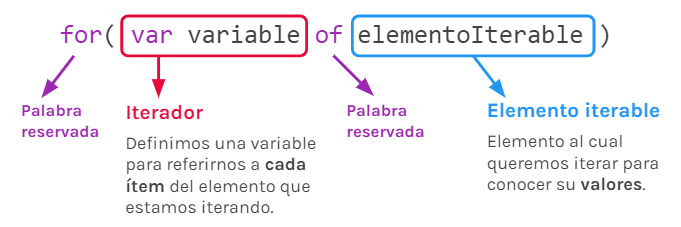

## Notas Clase 2 <a id='c2s'></a>

```javascript
parseInt(Math.random() * 3 + 1);
// Permite redonear, parseInt se queda con la parte entera del numero
```

> Ver código ejemplos: `for in` y `for of` en practica.js

<!-- juego piedra papel o tijera -->

## Juego: Piedra papel o tijera - Nivel I <a id='c2s1'></a>

con el método y funcion `math.random()` retorna un valor aleatorio entre 0 y 1 `[0,1)`

> Información dice que el valor no es realmente aleatorio, ya que esta basado en un algoritmo que toma como semilla el valor del el reloj de la computadora.
> para que me de un numero entre un numero especifico:

```javascript
Math.random() * 3;
//Esto me dará valores entre 0 y 3
```

para hacerlo mas acorde a un numero y que no salga el `0`

```javascript
Math.random() * 3 + 1;
//Esto da números aleatorios entre 1 y 3
```

para obtener el numero que necesito; quedandome con el entero puedo usar `parseInt`

```javascript
parseInt(Math.random() * 3 + 1);
//Toma el entero del Math.random()
```

para pedir la elección del jugador usamos `prompt()`

```javascript
const usuario = parseInt(prompt(`Ingrese 1 para piedra, 2 para papel, 3 tijera`));
//Uso el parseInt para que pase el String que devuelve el prompt a int
```

<!-- min 55 condicionales -->

**Solución: Juego Nivel I** <a id='c2s1a'></a>

```javascript
const computadora = parseInt(Math.random() * 3 + 1);

const usuario = parseInt(prompt("Ingrese 1 para piedra, 2 para papel o 3 para tijera."));

let resultado = "Sin resultado aun";

// lógica del juego
//si el usuario selecciona piedra
if (usuario == 1) {
    if (computadora == 1) {
        resultado = "Empate";
    }
    if (computadora == 2) {
        resultado = "Derrota!😑";
    }
    if (computadora == 3) {
        resultado = "Triunfo!😎";
    }
}

// si el usuario elige papel
if (usuario == 2) {
    if (computadora == 1) {
        resultado = "Triunfo!😎";
    }
    if (computadora == 2) {
        resultado = "Empate";
    }
    if (computadora == 3) {
        resultado = "Derrota!😑";
    }
}
// si el usuario elige tijera
if (usuario == 3) {
    if (computadora == 1) {
        resultado = "Derrota!😑";
    }
    if (computadora == 2) {
        resultado = "Triunfo!😎";
    }
    if (computadora == 3) {
        resultado = "Empate";
    }
}

alert("El resultado de la partida fue: " + resultado);
```

## Notas - Clase 3\*\* <a id='c3'></a>

## Juego: Piedra papel o tijera - Nivel II <a id='c3s1'></a>

Refactorizando el código, pensarlo en momentos clave, dentro de los momentos mejorar procesos.

Implementar funciones y reutilizarlas:

```javascript
function jugadaComputadora() {
    return parseInt(Math.random() * 3 + 1);
}
// Modularizamos el llamado de un numero aleatorio entre 1 y 3
```

otro momento es la jugada del usuario.
Por ahora no recibiría parametro, pero podria usar un `prompt` para recibir por parametro el ingreso del numero por parte del usuario

```javascript
function jugadaUsuario() {
    //2. definimos la variable
    let usuario;

    //4. Necesitamos una estructura que pregunte mínimamente una vez, si responde bien, puede salir, si no, sigue en la misma situación.
    do {
        //3. parsea el ingreso del usuario ---> 5.la muevo al do while
        usuario = parseInt(prompt("Ingrese 1 para piedra, 2 para papel o 3 para tijera."));
        //hago la comparacion: Lo dejo salir si cumple con condición para que la jugada sea valida: del 1 al 3, que sea numero,
    } while (usuario < 1 || usuario > 3 || isNaN(usuario));

    //1.devolveremos la jugada del usuario
    return usuario;
}
```

Otro momento son las comparaciones de las jugadas
Recibe las jugadas de pc y usuario por parametro, valores que serán entre 1 y 3 y devolverá el resultado de la jugada para saber quien gano

```javascript

function comparacionJugada(user,pc) {
    let resultado;
    //hay 3 posibilidades de resultados
    if (user == pc) {
        resultado = "Empate";
        //en el else if se definen escenarios donde ganaria el usuario
    }else if ((user==1 && pc==3) || (user==2 && pc==1) || (user==3 && pc=2)) {
        resultado = "usuario"
        //si ya hay empate y donde gana el usuario, en el else seria el tercer caso; las que quedan, donde gana la pc.
    } else {
        resultado = "computadora"
    }
    //Devuelve el resultado.
    return resultado;
}

```

Ahora vemos como lo ejecutamos creando el programa principal

```javascript
//Podemos crear constantes para los mensajes
const MSJ_EMPATE = "Empate!";
const MSJ_TRIUNFO = "Triunfo!";
const MSJ_DERROTA = "Derrota!";

//Que el programa haga una jugada
let computadora = jugadaComputadora();
//Pide a jugador su jugada
let jugador = jugadaUsuario();

//Procede a la comparacion de jugadas.
comparacionJugada(jugador, computadora);
```

Crearemos los puntajes, almacenara los puntajes, gana el que gane 2 partidas, gana.

```javascript
//crearemos un objeto
const puntajes = {
    usuario: 0,
    computadora: 0,
};

//según lo que venga de resultado, la guardamos en una variable para que quede mas legible
let partida = comparacionJugada(jugador, computadora);

//sumamos un punto en el contador
if (partida == "usuario") {
    puntajes.usuario++;
} else if ((partida = "computadora")) {
    puntajes.computadora++;
}
//Muestra por consola en formato tabla los puntajes en cada partida
console.table(puntajes);
```

Hacer que el programa se repita hasta que alguno de los usuarios llegue a los 2 puntos:

```javascript
let juego = true;
//usamos ciclo while puede ser for
//Se van a jugar partidas hasta que un jugador llegue a 2 puntos
while (juego) {
    //pero el juego
    let computadora = jugadaComputadora();
    let jugador = jugadaUsuario();
    let partida = comparacionJugada(jugador, computadora);

    if (partida == "usuario") {
        puntajes.usuario++;
    } else if ((partida = "computadora")) {
        puntajes.computadora++;
    }

    //evaluamos si alguien llego a los 2 puntos, si fue asi se apaga el juego
    if (puntajes.usuario > 1 || puntajes.computadora > 1) {
        juego = false;
    }
}
```

> `while` corta cuando encuentra la condición, `for` sigue iterando a menos que se haga `return` pero no es buena practica poner muchos return en funciones.

podemos cambiar la condición de `while` por:

```javascript
while (puntajes.usuario < 2 && puntajes.computadora < 2) {
    //pero el juego
    let computadora = jugadaComputadora();
    let jugador = jugadaUsuario();
    let partida = comparacionJugada(jugador, computadora);

    if (partida == "usuario") {
        puntajes.usuario++;
    } else if ((partida = "computadora")) {
        puntajes.computadora++;
    }
}
```

usamos los mensajes según las partidas

```javascript
//Creo alertas y uso los mensajes en la funcion
function comparacionJugada(user,pc) {

    let resultado;

    if (user == pc) {
        resultado = "Empate";
        alert("Esta partida fue: "+MSJ_EMPATE)
    }else if ((user==1 && pc==3) || (user==2 && pc==1) || (user==3 && pc=2)) {
        resultado = "usuario"
        alert("Esta partida fue: "+MSJ_TRIUNFO)
    } else {
        resultado = "computadora"
        alert("Esta partida fue: "+MSJ_DERROTA)
    }
    return resultado;
}

```

Vemos quien es el ganador

```javascript
if (puntajes.usuario > puntajes.computadora) {
    alert("EL RESULTADO GLOBAL FUE UN TRIUNFO");
} else {
    alert("EL RESULTADO GLOBAL FUE UNA DERROTA");
}
```

**Solución: Juego Nivel II** <a id='c3s1a'></a>

```javascript
/* ---------------------- JUEGO --------------------------- */
const MSJ_EMPATE = "Empate!";
const MSJ_TRIUNFO = "Triunfo!😎";
const MSJ_DERROTA = "Derrota!😑";

const puntajes = {
    usuario: 0,
    computadora: 0,
};

//se van a jugar partidas hasta que un jugador llegue a 2 puntos
while (puntajes.usuario < 2 && puntajes.computadora < 2) {
    let computadora = jugadaComputadora();

    let jugador = jugadaUsuario();

    let partida = comparacionJugada(jugador, computadora);

    //sumatoria de puntos
    if (partida == "usuario") {
        puntajes.usuario++;
    } else if (partida == "computadora") {
        puntajes.computadora++;
    }
    console.table(puntajes);
}

if (puntajes.usuario > puntajes.computadora) {
    alert("EL RESULTADO GLOBAL FUE UN TRIUNFO");
} else {
    alert("EL RESULTADO GLOBAL FUE UNA DERROTA");
}

/* -------------------- FUNCIONES ----------------- */
function jugadaComputadora() {
    return parseInt(Math.random() * 3 + 1);
}

function jugadaUsuario() {
    let usuario;

    do {
        usuario = parseInt(prompt("Ingrese 1 para piedra, 2 para papel o 3 para tijera."));
    } while (usuario < 1 || usuario > 3 || isNaN(usuario));

    return usuario;
}

function comparacionJugada(user, pc) {
    let resultado;

    if (user == pc) {
        resultado = "empate";
        alert("Esta partida fue: " + MSJ_EMPATE);
    } else if ((user == 1 && pc == 3) || (user == 2 && pc == 1) || (user == 3 && pc == 2)) {
        resultado = "usuario";
        alert("Esta partida fue: " + MSJ_TRIUNFO);
    } else {
        resultado = "computadora";
        alert("Esta partida fue: " + MSJ_DERROTA);
    }

    return resultado;
}
```

<!-- fin notas clase 3 sincrónica -->

# C4 - Introducción al DOM <a id='c4'></a>

## Objeto window y document <a id='c4a'></a>

_window y document_, ¿no son acaso lo mismo? Si nos apegamos a la descripción literal de la página de Mozilla, podremos decir que:

> **El objeto window** Representa la ventana que contiene al documento y **el objeto document** Representa al DOM (documento HTML) cargado en esa ventana”.

Hay que recordar que el DOM (document object model) representa al documento que se carga en el navegador como un árbol de nodos, en donde cada nodo representa una parte del documento.

Veamos esto en un ejemplo:


Esta es la representación que JavaScript le da a un documento HTML con su estructura habitual que contiene dentro del body un elemento `<h1>` y un elemento `<p>`.

> En resumen, `window` y `document` es la manera en la que JavaScript nos da acceso a los elementos presentes en el documento HTML para que a través de estas funcionalidades podamos manipular el contenido según nuestro criterio y necesidades.

> Ver video: El objeto window y document

<!-- resumen video y link -->

`window` la ventana, el navegador

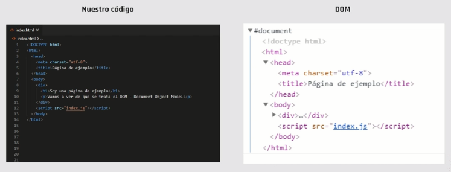

`document` DOM Document Object Model
document nos da propiedades y metodos para interactuar con el DOM

> window y document son nativos de javascript es decir que no tengo que almacenarlos en variables.

<!-- fin resumen video -->

[Link interactivo: objetos window y document](https://view.genial.ly/604946dc874b210da1260206)

<!-- resumen link y video inicio -->

## Introducción: qué son los objetos Window y Document

Window y Document son dos objetos mediante los cuales podremos manipular la interfaz que interactúa con el usuario, sin tener que hacer peticiones al servidor y devolverlas al usuario. Al interactuar con estos dos objetos, vamos a notar que la página no se recarga, ya que lo que se modifica es la interfaz


## Window <a id='c4a1'></a>

Sirve para trabajar con la **ventana** del navegador

-   El objeto **Window**, como bien lo indica su nombre, se refiere a toda la ventana que vemos en el navegador.
-   Este se utiliza principalmente para manipular la ventana. Algunas de las funciones más conocidas y comúnmente utilizadas del objeto Window pueden ser:
    -   `window.location` → Retorna un objeto con los detalles de la URL, la ruta, el href, etc.
    -   `window.height y window.width` → Retorna la altura y/o el ancho de la pantalla actual de la ventana.

```js
//alto de ventana
window.innerHeight;
//retorna ej 720
//ancho de ventana
window.innerWidth;
//retorna ej 650
window.innerWidth = 300;
//300
window.innerWith;
//300

//Podemos saber el host donde estamos, el nombre, ubicación, protocolo, path
window.location;
//Puedo pisar los datos
window.location.href = "http://noticias.com";
```

## Document <a id='c4a2'></a>

Esto permite interactuar con el documento dentro del navegador, con el **contenido** del documento

-   A diferencia del Window, el objeto Document se utiliza para leer y modificar, si así lo deseamos, el contenido de la ventana. Por ejemplo, lo podríamos usar para modificar nuestro HTML a través de sus clases y estilos.
-   Solemos llamar al objeto Document: DOM (Document Object Model) y, como se ve en el diagrama, se encuentra dentro del objeto Window. Para acceder a él y todos sus métodos, deberíamos hacerlo de la siguiente manera:
    -   `window.document.title` → Retorna el título del documento sobre el que estamos navegando.
-   Sin embargo, JS Front nos permite abreviarlo así:
    -   `document.title`

```js
//cambiar el color de fondo
document.bgColor = "red";
//cambia el color de fondo a red

//retorna array con todas las hojas de estilo vinculadas
document.styleSheets;

document.styleSheets[0];
//siendo un array ingreso con la posición
```

### Divs

Los Divs son componentes de nuestro HTML que pueden ser modificados y manipulados a través del uso del objeto Document.

<!-- fin resumen video y link -->

## Buenas prácticas

Si bien repasamos en líneas generales las funciones y los métodos más utilizados de los objetos window y document, no hay que dejar de explorar todas sus bondades. En estos links podemos acceder a la documentación y encontrar todo lo que podemos crear con JavaScript desde el front end: window y document.

**Quiz** <a id='c4a3'></a>

JavaScript nos permite interactuar con el front-end del usuario siempre y cuando se haga una petición al servidor.
Falso

¿Qué es el DOM?
La representación en objetos que hace JavaScript del documento HTML.

El objeto window representa la ventana donde estamos navegando.
verdadero

Mediante el objeto document podemos...
Leer todos los elementos del HTML y modificarlos, si así lo quisiéramos.


## Seleccionando elementos <a id='c4b'></a>

> Ver video: Seleccionando elementos

<!-- resumen video -->

Cuando queremos modificar que queremos modificar del contenido html

## .querySelector() <a id='c4b1'></a>

Este selector recibe un string que indica el selector CSS del elemento del DOM que estamos buscando.
Método que permite determinar donde queremos hacer el cambio.

> Es importante declarar una variable para almacenar el dato que nos traiga el selector, ya que de otra manera lo perderíamos al continuar la ejecución del programa.

```js
//etiqueta html
document.querySelector("form");
//etiqueta html con clase
document.querySelector("form.registracion");
//etiqueta con id
document.querySelector("form#unico");
//clase
document.querySelector(".especial");
```

retornara la etiqueta que estemos buscando, si la clase esta en muchas ubicaciones, devolverá la primera que haga match

## .querySelectorAll() <a id='c4b2'></a>

Devuelve todas las etiquetas que macheen con las etiquetas que le haya indicado, devolviendo una lista de nodos que podemos trabajar como un array

```js
//Devuelve todas etiquetas que macheen con .especial
document.querySelectorAll(".especial");
```

> Siempre que le pedimos a javascript que capture algo y no exista devolverá `null`

Podemos recorrer los párrafos usando `for of`

```js
let losParrafos = document.querySelector("p");

//De losParrafos dame un párrafo
for (const unParrafo of losParrafos) {
    console.log(unPárrafo);
}
//Hace un console.log de todos los Parrafos
```

Si usamos el mismo js para paginas donde no estén los selectores, podemos hacer una simple validación

<!-- min 16:20 -->

```js
//si este selector esta en index y no en contact
let strong = document.querySelector(".parrafo-especial strong");
//hacemos la validación y en contact no sale null
if (strong != null) {
    console.log(strong);
}
```


<!-- fin resumen video -->

> Ver PDF: Selectores del DOM.pdf

<!-- inicio resumen pdf -->

## Selectores del DOM <a id='c4b3'></a>

Para acceder a los elementos de una página, usamos selectores. Cada selector puede retornar un solo elemento o una lista de elementos. Para poder hacer uso de los selectores debemos hacer uso del objeto document, ya que los selectores son métodos del mismo.

## .getElementById()

Este selector recibe un string con únicamente el nombre del id del elemento del DOM que estamos buscando.

Por ejemplo:

```js
let marca = document.getElementById("marca");
//Nos va a retornar el elemento cuyo id coincida con el deseado
```

### Comparando selectores <a id='c4b4'></a>

| querySelector()                                                              | querySelectorAll()                                                             | getElementById()                                               |
| ---------------------------------------------------------------------------- | ------------------------------------------------------------------------------ | -------------------------------------------------------------- |
| Retorna el primer elemento del DOM que cumple con la condición que buscamos. | Retorna todos los elementos del DOM que cumplen con la condición que buscamos. | Retorna el elemento del DOM que cumpla con el id que buscamos. |

<!-- fin resumen pdf -->

# C5 - Modificando elementos con Javascript <a id='c5'></a>

## Modificando el DOM <a id='c5a'></a>

> Ver video: Modificando el DOM

<!-- resumen video -->

### innerHTML

Es una propiedad que te permite ver y/o modificar el HTML de una etiqueta y permite usar contenido html en su contenido.
Si queremos leer o modificar el contenido de una etiqueta HTML, vamos a utilizar esta propiedad.

> Si queremos guardar el valor, debemos asignar esa línea de código a una variable. De otra manera, cuando la ejecución continúe, se perderá el valor que hayamos buscado.

```js
//quiero modificar lo que hay dentro del div
document.querySelector("div");

//innerHTML para leer el contenido o modificarlo
document.querySelector("div").innerHTML;
```

`innerHTML` en caso de ser para escritura, `=` reemplaza completamente el contenido que tuviera antes

```js
document.querySelector("div").innerHTML = "reemplaza";
```

`innerHTML` en caso de ser para escritura, `+=` agrega informacion al final; mantiene lo que tiene anteriormente.

```js
document.querySelector("div").innerHTML += "agrega al final";
```

> Ver min: 0200 ejercicio practico

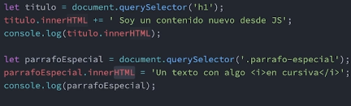

[Ver mas:](https://www.w3schools.com/js/js_htmldom_nodes.asp)

<!-- fin resumen video -->

> Ver PDF: Modificando el DOM.pdf

<!-- Resumen inicio pdf -->

Para poder hacer modificaciones al DOM siempre tenemos que tener seleccionado el objeto que queremos modificar. Esto lo podemos hacer usando selectores.

### innerText

Si queremos leer o modificar el texto de una etiqueta HTML, vamos a utilizar esta propiedad

```js
document.querySelector("div.nombre").innerText;
```

En este caso, si en mi div con clase nombre estuviera escrito “Leo”, la propiedad me retornaría el string “Leo”.

> Si queremos guardar el valor, debemos asignar esa línea de código a una variable. De otra manera, cuando la ejecución continúe, se perderá el valor que hayamos buscado.

Si queremos modificar el texto de una etiqueta HTML, vamos a utilizar esta propiedad de la siguiente manera:

```js
document.querySelector("div.nombre").innerText = "Luca";
```

Si utilizamos la propiedad de esta forma, todo el texto que teníamos en el div con clase nombre se va a cambiar por el string “Maria”.

> Sin embargo, también podríamos modificar el contenido sin perder lo que teníamos anteriormente..

Si queremos agregar contenido al texto de una etiqueta HTML, vamos a utilizar esta propiedad de la siguiente manera:

```js
document.querySelector("div.nombre").innerText += "Arango";
```

En este caso, lo que sucedería es similar a lo que sucede con el otro selector, pero el texto se incluiría dentro de la etiqueta div, quedando:

```html
<div class="“nombre”">Juan Arango</div>
```

### Propiedad Style

Nos permite leer y sobreescribir las reglas CSS que se aplican sobre un elemento que hayamos seleccionado.

```js
let titulo = document.querySelector(".title");
titulo.style.color = "cyan";
titulo.style.textAlign = "center";
titulo.style.fontSize = "12px";
titulo.style.backgroundColor = "#dddddd";
```

> Nótese que las reglas CSS que llevaban guiones (como font-size), en JavaScript se escriben en camelCase (es decir: fontSize).

<!-- fin resumen pdf -->

## Plantillas de texto / template literals <a id='c5b'></a>

> Ver video: Plantillas de texto


> Ver PDF: template strings

## Sintaxis de un template string

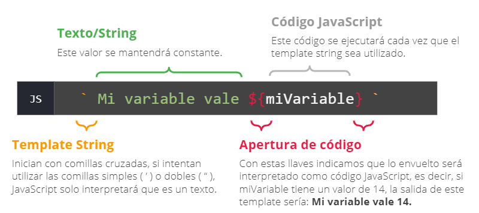

### 📜 Ejemplos!

```js
const nombre= 'Juan';
const miTemplate = `Mi nombre es ${nombre}`;
console.log(miTemplate) //Mi nombre es Juan
```
```js
const miTemplate =`2 * 3 es ${ 2 * 3 }`;
console.log(miTemplate); //2 * 3 es 6
```
```js
function suma(var1, var2) { 
    return var1 + var2
}
const temp =`El resultado es ${suma(2,2)}`;
console.log(temp); //El resultado es 4
```

> ### 💡
> Como se puede ver, dentro de las llaves se puede ejecutar cualquier código JavaScript, pero es buena costumbre que sea lo más sencillo posible

Ejemplos en html y su js

```html
<html lang="es"> <!-- JS en la siguiente hoja -->
    <head>
        <meta charset="UTF-8">
        <script src="scripts.js"></script>
        <title>Ejemplo</title>
    </head>
        <body id="body">

        </body>
</html>
```
```js
function escribirHTML(titulo, texto) {
    const body= document.getElementById('body');
    const miTemplate= `    
        <h1>${titulo}</h1>    
        <p>${texto}</p>
        `;  
        body.innerHTML+= miTemplate;
        }
        
        escribirHTML('Hola', 'Esto es un ejemplo de template string en html.');
        escribirHTML('Es dinámico', 'Podemos insertar elementos HTML mediante <b>JavaScript</b>');
        escribirHTML('Facilita la programación', 'Evita escribir mucho código y reutilizar el que si escribamos.');
        escribirHTML('En este ejemplo', 'Hemos utilizado una única función para poder escribir 4 veces en HTML, ¿te imaginás lo que sería esto sin esta función?');
```

Supongamos que tenemos un objeto de JavaScript con la siguiente estructura, el cual necesitamos utilizar para rellenar dinámicamente en el front end.

```js
let personaje = {
    nombre: "Michael",
    apellido: "Scott",
    nacimiento: {
        fecha: "15/04/1965",
        ciudad: "Scranton",
        estado: "Pensilvania",
    },
    imagenUrl: "https://upload.wikimedia.org/wikipedia/en/thumb/d/dc/MichaelScott.png/220px-MichaelScott.png",
    trabajo: {
        rol: "manager regional",
        compania: "Dunder Mifflin",
    },
};
```

**Quiz**

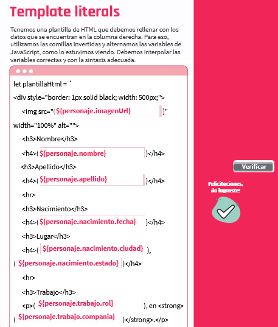

## Modificando estilos <a id='c5c'></a>

Con las funcionalidades que nos aporta el DOM de JavaScript, además de poder agregar y modificar el contenido de texto de un elemento presente en el HTML, podemos incluso agregar y eliminar estilos de CSS. Pero ¿bajo qué contextos esto es necesario? Pensemos en algo sencillo, algo como esto:


Esto es bastante común hoy en día. Y es algo bastante sencillo de hacer, pues simplemente, en el momento en el que damos clic en un botón, le estamos pidiendo a JavaScript que agregue o elimine líneas de CSS a un elemento determinado. ¡Y listo, ya está! Sencillo, ¿no? Veamos entonces cómo es posible esta "magia" gracias a JavaScript.

> ver video: Modificando estilos.mp4

<!-- resumen video -->

```js
document.querySelector("p").style.textAlign = center;
```

style = objeto

> En video: uso de confirm() para cambiar estilos, con un if.

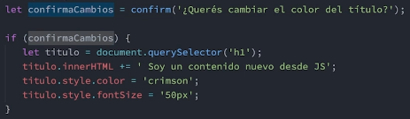

<!-- fin resumen video -->

## Styles

A través del DOM, podemos acceder al objeto style que define el estilo de un elemento seleccionado. Por ejemplo, style.color devuelve el color de un elemento y la sintaxis es la siguiente:

```js
element.style.color = "red";
//Otros ejemplos:
element.style.fontSize = "15px";
element.style.backgroundColor = "#FFFFFF";
```

## Modificando clases <a id='c5d'></a>

La propiedad style de los elementos del DOM nos permite agregar líneas de CSS, pero ¿qué pasaría si ese mismo conjunto de estilos los quisiéramos agregar de manera constante? Seguramente, bajo este escenario lo mejor será crear una clase en nuestra hoja de estilos y agrupar todo lo que queremos en esa regla. Ahora bien, la pregunta que nos surge aquí será: ¿cómo hacemos para aplicar ahora esa clase? Con JavaScript vamos a poder llevar a cabo este proceso, el cual, de por sí, es mucho más recomendado que aplicar líneas de estilo por separado. Hablaremos ahora del objeto classList que nos otorga el DOM.

> ver video: Modificando clases

<!-- resumen video -->

### `.classList`

Permite interactuar con las clases asignadas a dicha etiqueta:

```js
document.querySelector(".noticia").classList;
```

1. `add` permite agregar una clase.
2. `remove` elimina la clase.
3. `toggle` prende o apaga la clase.


> En video: Ejercicio practico, clases en style.css, uso classList, uso de confirm()

<!-- fin resumen video -->

> Ver pdf: Modificando Clases.pdf --- Ejemplos de classList

<!-- COMPLETAR -->

### `classList.contains()`

Nos permite preguntar si un elemento tiene una clase determinada. Devuelve un valor booleano.

```js
letcita = document.querySelector(".italicas");
cita.classList.contains("cita"); // false
```

```js
letcita = document.querySelector(".italicas");
cita.classList.contains("italicas"); // true
```

Podemos usar el `.contains` para hacer operaciones lógicas haciendo uso de los `if/else`.

**En resumen**

| .add()                       | .remove()                      | .toggle()                                                               | .contains()                                                              |
| ---------------------------- | ------------------------------ | ----------------------------------------------------------------------- | ------------------------------------------------------------------------ |
| Agrega la clase al elemento. | Elimina la clase del elemento. | Agrega la clase, si es que no la tiene. En caso de tenerla, la remueve. | Pregunta si el elemento tiene la clase o no. Devuelve un valor booleano. |

<!-- fin resumen -->

> ### 💡
> Puedo averiguar si un selector tiene alguna clase con `SELECTOR.classList.lenght`
>

### 📜 Ejemplo en clase!

```js
let items = document.querySelectorAll('li');

items[0].innerHTML = 'El <strong>52%</strong> del tráfico de todo Internet es creado por Bots (entre inofensivos y maliciosos).';

if(confirm("Desea pintar un parrafo de amarillo?")){
    items[1].style.backgroundColor = "yellow";
    items[1].style.fontWeight = "bold";
}

items.forEach( item =>{
    //chequeamos si el nodo tiene la clase "porcentajes"
    if(item.classList.contains('porcentajes')){
        console.log(item.classList.toggle('parrafo'))
    }

    //chequeamos si el nodo no tiene ninguna clase
    if(item.classList.length == 0){
        item.classList.add('alternativos')
    }
});
```

> ### [📌Actividad: Cambiar tema] pasar tema a oscuro

# C6 - Trabajando con nodos <a id='c6'></a>

## Nodos en HTML <a id='c6a'></a>

Los nodos son elementos o etiquetas del HTML que en conjunto forman un “árbol de nodos” al que llamamos DOM (Document Object Model).

Entonces, en JavaScript, el nodo objeto principal es el document, y dentro de él, se clasifican estos otros:

-   Todas las etiquetas del HTML que son nodos de elementos.
-   Los nodos de atributos de los elementos.
-   Los nodos de texto.
-   Los nodos de comentarios.

Cada nodo del árbol es un objeto, es decir, que contienen una colección de propiedades.
Del esqueleto de nodos que representa la estructura base de una web tenemos como ejemplo:

```html
<html>
    <head>
        <meta />
    </head>
    <body>
        <header>
            <!-- comentario  -->
            <h1 class=""></h1>
            <nav></nav>
        </header>
        <footer>
            <p></p>
            <a href=""> </a>
        </footer>
    </body>
</html>
```

El nodo de tipo elemento puede tener nodos secundarios anidados —uno dentro de otro— y generar así un objeto NodeList que representa una lista de nodos padre/hijos —también de tipo elemento, texto o comentarios—. Puede ser estática, no cambia, o dinámica cuando el contenido se actualiza automáticamente al cambiar la página web de forma dinámica.
Ahora bien, veamos los métodos que nos permitirán crear nodos.

## Creación de nodos en el DOM <a id='c6a1'></a>

> Ver PDF: Nodos en HTML.pdf

<!-- inicio resumen pdf -->

Para crear nodos en el HTML con JavaScript yluego insertarlos en el DOM, necesitaremos utilizar métodos específicos.

## Métodos del objeto document <a id='c6a2'></a>

| Métodos            |                                                                                                                                                                                                                   |
| ------------------ | ----------------------------------------------------------------------------------------------------------------------------------------------------------------------------------------------------------------- |
| `createElement()`  | Crea un nodo de tipo elemento según el nombre de la etiqueta de HTML que le indiquemos.                                                                                                                           |
| `createTextNode()` | Crea un nodo de texto explicitado entre comillas. No se visualiza hasta asignarlo a un elemento existente del DOM.                                                                                                |
| `appendChild()`    | Adhiere dentro del DOM un elemento hijo a un elemento padre. Si el elemento padre ya existía en el documento, cambia su posición hacia el otro elemento padre indicado. Si no existe, lo creamos con el método 1. |

## Sintaxis para crear un nodo elemento <a id='c6a3'></a>


## Sintaxis para crear un nodo de texto <a id='c6a4'></a>


## Sintaxis para adherir un elemento hijo al DOM <a id='c6a5'></a>


**Ejemplo**

```js
var botonVerMas = document.createElement("button");
var botonTexto = document.createTextNode("Ver más");

botonVerMas.appendchild(botonTexto);
document.body.appendChild(botonVerMas);
```

Resultado en el DOM

```html
<body>
    <button>Ver más</button>
</body>
```

**Analisis**

Almacenamos en una variable “botonVerMas” la creación de un botón.

```js
var botonVerMas = document.createElement("button");
```

Almacenamos en la variable “botonTexto” la creación de un nodo de texto que dice “Ver más”.

```js
var botonTexto = document.createTextNode("Ver más");
```

Adherimos a nuestro botón el nodo de texto creado anteriormente accediendo con su variable. Y luego, adherimos el botón al body del documento.

```js
botonVerMas.appendchild(botonTexto);
document.body.appendChild(botonVerMas);
```

<!-- fin resumen pdf -->


### 📜 Ejemplo en clase!

```js
const nombre = prompt("Ingrese su nombre");
const apellido = prompt("Ingrese su apellido");

const nodoSpan = document.querySelector('#nombre');

nodoSpan.innerHTML = `<strong>${nombre}</strong>`;

//creamos el nodo que vamos a insertar en el html
const parrafoNuevo = document.createElement('p');
//armamos un nodo de texto basado la variable apellido
const texto = document.createTextNode(`Su apellido es ${apellido}`);
//al parrafo le agregamos el nodo de texto
parrafoNuevo.appendChild(texto);

const contenedor = document.querySelector('.contenedor');

//insertamos el nodo ya completo en el HTML
contenedor.appendChild(parrafoNuevo);
```

## Elementos y atributos dinamicos <a id='c6b'></a>

Empecemos por pensar únicamente en HTML, un atributo es un modificador de un elemento. Es una palabra especial que nos permite controlar un determinado comportamiento en nuestra etiqueta.

Por ejemplo, en la etiqueta `a` tenemos un atributo fundamental que es el `href`, el cual indica la url a la que se apunta con en enlace.


> Es importante recordar que las etiquetas soportan cierto tipo de atributos, no todos pueden ser utilizados en cada elemento.

Obviamente tenemos muchos más ejemplos de atributos, algunos ejemplos son:

Etiqueta ``

-   alt
-   src
-   width

Etiqueta `<a>`

-   href
-   target

Etiqueta `<meta>`

-   charset
-   name

Entonces, ¿qué es lo dinámico en todo esto?

De lo que vimos hasta ahora, nada. ? Lo dinámico está en manipular completamente los posibles atributos desde nuestro código JavaScript. En el HTML los agregamos de manera estática, pero ahora desde JS podemos leerlos, agregar nuevos o eliminarlos gracias a distintos métodos que veremos a continuación.

<!-- inicio resumen pdf -->

## Atributos dinamicos <a id='c6b1'></a>

Sabemos que todos los elementos de HTML pueden tener atributos, lo importante es identificar **cuáles son, qué información adicional nosbrindan y qué valores admiten.**


**Atencion**
Los atributos usualmente están formados en pares de clave:valor. Debemos tener en cuenta que existen excepciones, no siempre por cada clave tendremos un solo valor


> Para pensar, ¿qué atributo que ya conocemos suele recibir varios valores?Recordemos en la clase en vivo compartir nuestros hallazgo

**Ejemplo**

```html
<!DOCTYPE html>
<html lang="es">
    <head>
        <meta charset="utf-8" />
        <title>Hello world</title>
    </head>
    <body>
        <p>Esta es nuestra portada 👇</p>
        
    </body>
</html>
```

### `hasAttribute()`

Este método nos sirve para consultar si el elemento posee o no un determinado atributo. Funciona de la siguiente manera:

-   **Recibe** un atributo.
-   **Retorna** `true` si el atributo existe, de lo contrario `false`

```js
//Seleccionamos un elemento del HTML
let elemento = document.querySelector("#portada");
//Consultamos si tiene un atributo src
elemento.hasAttribute("src"); // true
```

### `getAttribute()`

Este método nos permite obtener el valor de un determinado atributo. Funciona de la siguiente manera:

-   **Recibe** el nombre un atributo.
-   **Retorna** el valor si existe, de lo contrario nos devuelve una texto vacío ("").

```js
//Seleccionamos un elemento del HTML
let elemento = document.querySelector("#portada");

//Pedimos el valor del atributo
elemento.getAttribute("src"); // imagen_portada.jpg
```

### `removeAttribute()`

Este método borra por completo el atributo y sus valores del elemento. Si no lo encuentra, no hace nada. Funciona de la siguiente manera:

-   **Recibe** el nombre un atributo.
-   En cualquier caso, **no retorna ningún valor**

```js
//Seleccionamos un elemento del HTML
let elemento = document.querySelector("#portada");

//Pedimos el valor del atributo
elemento.removeAttribute("src");
```

> Este caso repercute en el HTML ya que una imagen sin src se muestra como rota.

### `setAttribute()`

Este método nos permite agregar un atributo con su respectivo valor al elemento seleccionado. Funciona de la siguiente manera:

-   Recibe el nombre del atributo y un valor para el mismo.
-   En cualquier caso, no retorna ningún valor

```js
//Seleccionamos un elemento del HTML
let elemento = document.querySelector("#portada");

//Pedimos el valor del atributo
elemento.setAttribute("src", "imagen_portada.jpg");
```

<!-- fin resumen pdf -->

> Ver PDF: Práctica atributos dinámicos.zip

<!-- HACER practica -->

### 📜 Ejemplo en clase!

```js
let imagenes = [];

const nodosImg = document.querySelectorAll('.imagen')

solicitarInfo();
renderizarInfo();

function solicitarInfo() {
    //solicitamos urls para rellenar nuestro array
    for(let i=0; i<nodosImg.length; i++){
        const imagen = prompt("Ingrese la url de una imagen");
        imagenes.push(imagen);
    }
}

function renderizarInfo() {
    //rellenar los atributos SRC de las imagenes
    for(let i=0; i<imagenes.length; i++){
        nodosImg[i].setAttribute('src', imagenes[i]);
        nodosImg[i].setAttribute('title', imagenes[i]);
    }
}
```

> ### [📌Actividad: Practica atributos](./Actividades/C6-practica-atributos.md)

# C7 - Catch-up + Intro a eventos <a id='c7'></a>

En este módulo nos enfocaremos en captar distintos sucesos interesantes que se producen por parte del navegador o el usuario. Justamente, producto de algún evento que se dispara en el sitio, podremos realizar alguna reacción al respecto.

# C8 - Que son los eventos? <a id='c8'></a>

Un evento es una acción que transcurre en el navegador o que es ejecutada por el usuario.

## ¿Qué son los eventos? <a id='c8a'></a>

Bien, podemos decir que un evento es algo que pasa en el documento HTML y que comúnmente es ejecutado por parte de la persona que usa nuestro aplicativo. Pongamos algunos ejemplos:

-   La persona hizo clic en un botón de la interfaz.
-   La persona ingresó un texto en el input del formulario.
-   La persona presionó exactamente la tecla "J".

Como podemos ver, un evento es esa acción que se desencadena cuando la persona ejecuta una acción determinada. Aunque vale la pena aclarar que no solamente la persona puede desencadenar una acción, también lo puede hacer de igual manera la ventana (window) que carga el documento HTML.

Pero para ver esto en más detalle vayamos al video y centrémonos en estos conceptos.

> Ver video: Que son los eventos

<!--  resumen video -->

-   Hay que tener en cuenta el elemento que Javaescript va a estar observando; primero hay que capturar el elemento
-   Ver cual es el evento que puede suceder en el; decir a que evento javscript va a estar prestando atencion
-   Que queremos que suceda cuando el evento se verifique; que queremos que suceda cuando ese evento suceda

Javascript nos da nos estrategias para encarar los eventos

1. `.on`+ una accion
   **Ejemplos** `onload`, `onclick`, `ondblclick` acompa;ados de una funcion que definira que queremos que suceda cuando el evento se verifica
2. `addEventListener()` que recibira 2 parametros; el primero, el nombre del evento sin la palabra on y el segundo un callback donde se encontrara el codigo de lo que quiero que se ejecute cuando el evento suceda

Cuando necesitamos trabajar con el evento ams en detalle, la funcion recibe un parametro `e` en cualquiera de las dos estrategias, cuando usamos el elemento `.this` se esta haciendo referencia al elemento puntual donde ocurre el evento

## Carga de archivo js <a id='c8a1'></a>

Linkear el script abajo de `<link rel="stylesheet" href="style.css">

```html
<link rel="stylesheet" href="style.css" />
<script src="./index.js"></script>
```

y queremos que el archivo `index.js` se ejecute despues que se cargue toda la pagina crearemos el siguiente evento

## Eventos `on`

### Evento `onload`

Este evento permite que todo el script se ejecute cuando se haya cargado por completo el objeto document dentro del objeto window

```
window.onload = function () {
    console.log("el documento está listo");
};
```

> Si uso onload, solo puedo hacer un evento onload, de lo contrario, pisara el primer onload que se haga
>
> Se suele escribir el código JavaScript dentro de esta función para prevenir errores que pueden ocurrir si el documento no está totalmente cargado al momento de la ejecución del script.

### Evento `onclick`

Este evento nos permite ejecutar una acción cuando se haga clic sobre el elemento al cual le estamos aplicando la propiedad.

```
btn.onclick = function () {
    console.log("hiciste clic!");
};
```

#### Eventos mas usados <a id='c8a4'></a>

| Evento      | Descripcion                                                     |
| ----------- | --------------------------------------------------------------- |
| onclick     | Cuando el usuario hace clic.                                    |
| ondblclick  | Cuando el usuario hace doble clic.                              |
| onmouseover | Cuando el mouse se mueve sobre el elemento                      |
| onmousemove | Cuando se mueve el mouse.                                       |
| onscroll    | Cuando se hace scroll.                                          |
| onkeydown   | Cuando se aprieta una tecla.                                    |
| onload      | Cuando se carga la página onsubmitCuando se envía un formulario. |

Para obtener más información, podemos visitar la documentación oficial haciendo clic en el siguiente link:

<https://developer.mozilla.org/en-US/docs/Learn/JavaScript/Building_blocks/Events>

### 📜 Ejemplo en clase!

```html
<div class="theme">
    <button onclick="cambiarTema()">Cambiar tema 🌛</button>
</div>
```
Cuando le da click al boton ejecuta la funcion `cambairTema()`
```js
function cambiarTema() {
    document.body.classList.toggle('dark);
}
```
```css
.dark {
    background-color: rgg(219,219,219);
}
```

> ### [📌Actividad: Cambio tema dinamico](./Actividades/C7-cambio-tema-dinamico.md)

> ### [📌Actividad: Renderizado dinamico de tarjetas](./Actividades/.md)


### Método `preventDefault()` <a id='c8a3'></a>

Nos permite evitar que se ejecute el evento predeterminado —o nativo— del elemento al que se lo estemos aplicando.Podemos usarlo, por ejemplo, para prevenir que una etiqueta “a” se comporte de manera nativa y que haga otra acción

Evita cualquier comportamiento nativo en un elemento HTML
**Ejemplo** Si estamos definiendo un hipervínculo, podemos evitar que nos redirija a algun lugar, o que un formulario frene en algun momento el envio de la informacion

> Siempre tenemos que tener seleccionado el elemento al que le queremos aplicar el preventDefault() mediante los selectores

```
let hipervinculo = document.querySelector("a");

hipervinculo.addEventListener("click", function (event) {
    console.log("hiciste click");
    event.preventDefault();
});
```


### Eventos con `AddEventListener()` <a id='c8a3'></a>

con AddEventListener

```js
window.addEventListener("load", function () {});
```

> Con AddEventListener, se harán todos los eventos en simultaneo, no se pisan. Permite tener muchas mas reacciones a algo

### 📜 Ejemplo!


```html
<!DOCTYPE html>
<html lang="en">
    <head>
        <meta charset="UTF-8" />
        <meta http-equiv="X-UA-Compatible" content="IE=edge" />
        <meta name="viewport" content="width=device-width, initial-scale=1.0" />
        <script src="./index.js"></script>
        <title>Ejemplo Eventos</title>
    </head>
    <body>
        <div>
            <button class="home-button">Hola</button>
            <button class="about">Conoce mas de nosotros!</button>
        </div>
    </body>
</html>
```

```js
window.addEventListener("load", () => {
    let homeButton = document.querySelector(".home-button");
    homeButton.addEventListener("click", () => {
        alert("Tocaste el boton!");
    });

    let aboutButton = document.querySelector(".about");
    aboutButton.addEventListener("click", (e) => {
        //Cancela el comportamiento por defecto de la etiqueta html, este caso el boton de about
        e.preventDefault();
        //Nos dice donde sucedio el evento
        console.log(this);
        alert("Quisiste saber sobre un evento!");
    });
});
```

> Ver pdf: ¿Qué son los eventos .pdf

## Eventos de mouse <a id='c8b'></a>

> Ver video: Eventos del mouse
> Ver pdf: Eventos de Mouse.pdf

### Eventos `click`

```js
window.addEventListener("load", () => {
    let homeButton = document.querySelector(".home-button");
    homeButton.addEventListener("click", () => {
        //podemos hacerlo con prompt o if etc...
        hommeButton.style.color = "red";
    });
});
```

### Evento `dblclick`

```js
window.addEventListener("load", () => {
    let homeButton = document.querySelector(".home-button");
    homeButton.addEventListener("dblclick", () => {
        //podemos hacerlo con prompt o if etc...
        hommeButton.style.color = "red";
    });
});
```

### Evento `mouseover`

```js
window.addEventListener("load", () => {
    let homeButton = document.querySelector(".home-button");
    homeButton.addEventListener("mouseover", () => {
        //podemos hacerlo con prompt
        hommeButton.style.color = "red";
    });
});
```

### 📜 Ejemplo!

```js
let texto = document.querySelector(".text");
texto.onmouseover = function () {
    console.log("pasaste el mouse");
};
```

También podríamos hacer:

```js
texto.addEventListener("mouseover", function () {
    console.log("pasaste el mouse");
});
```

### Evento `mouseout`

```js
window.addEventListener("load", () => {
    let homeButton = document.querySelector(".home-button");
    homeButton.addEventListener("mouseout", () => {
        //podemos hacerlo con prompt
        hommeButton.style.color = "red";
    });
});
```

### 📜 Ejemplo!


```js
let texto = document.querySelector(".text");
texto.onmouseout = function () {
    console.log("quitaste el mouse");
};
```

También podríamos hacer:

```js
texto.addEventListener("mouseout", function () {
    console.log("quitaste el mouse");
});
```

### 📜 Ejemplo! Eventos en simultaneo <a id='c81'></a>

```html
<!DOCTYPE html>
<html lang="en">
    <head>
        <meta charset="UTF-8" />
        <meta http-equiv="X-UA-Compatible" content="IE=edge" />
        <meta name="viewport" content="width=device-width, initial-scale=1.0" />
        <script src="./index.js"></script>
        <title>Ejemplo Eventos</title>
    </head>
    <body>
        <div>
            <button class="w3">a</button>
            <button class="w3">b</button>
            <button class="w3">c</button>
            <button class="w3">d</button>
        </div>
    </body>
</html>
```

```js
window.addEventListener("load", () => {
    //Selecciono todos los botones, nos da una lista
    let botones = document.querySelectorAll(".w3");

    //for para recorrer cada boton
    for (let i = 0; i < botones.length; i++) {
        //a cada uno de los botones le voy a generar un evento
        botones[i].addEventListener("click", () => {
            //para que el mismo boton donde se hizo click cambie de color
            //this hace referencia al lugar donde se hizo click
            this.style.color = "red";
        });
    }
});
```

## Eventos del teclado <a id='c8c'></a>

> Ver video: Eventos del teclado.mp4
>
> Ver pdf: Eventos del teclado.pdf

Útiles para validar lo que un usuario ingresa en los campos de un formulario

### Evento `keydown`

Se dispara al presionar una tecla
Este evento es lanzado cuando una tecla es presionada (hacia abajo). A diferencia del evento keypress, keydown es lanzado para las teclas que producen un carácter y también para las que no lo producen.

```js
let miInput = document.querySelector("#miInput");

miInput.onkeydown = function (event) {
    alert("Se presionó la tecla: " + event.key);
};
```

### Evento `keyup`

Se dispara al soltar la tecla que estamos presionando

```js
let miInput = document.querySelector("#miInput");

miInput.onkeyup = function (event) {
    alert("Se soltó la tecla: " + event.key);
};
```

### Evento `keypress`

Se activa al finalizar el recorrido de presion y liberacion de la tecla

> Para saber que tecla estamos presionando hay que revisar el evento en si, con el parametro e en el callback: `charCode`, `keyCode`, `key`

No se hace lo mismo según la tecla que se presenta, para saber mas información tenemos que mandarle el parametro e para revisar el evento.

Con la propiedad `key` podremos saber que letra se presiono

```js
e.key;
```

```js
let miInput = document.querySelector("#miInput");

miInput.onkeypress = function (event) {
    alert("Se presionó la tecla: " + event.key);
};
```

### 📜 Ejemplo!


```js
window.addEventListener("load", () => {
    window.addEventListener("keypress", () => {
        //podemos determinar algo depende la situacion
        if (e.key == "Enter") {
            alert("Ey! Que tocas enter?");
        }
    });
});
```

>### 📝 Quiz! <a id='c'></a>
>
>**¿Cuál de todas las propiedades de un evento de teclado es la que almacena el valor de la tecla presionada?**
> key
> 
>**Cuál de las siguientes opciones es la correcta para reemplazar los “?????” en la siguiente línea de código, teniendo en cuenta que queremos enviar un alert cuando se libere la tecla después de haber sido presionada:**
>   ```js
>    elemento.????? = function(){
>    alert(“¡se liberó la tecla!”)
>    }
>    ```
> onkeyup


## Invocando funciones <a id='c8d'></a>

> #### 📑
> pdf: Invocando funciones

JavaScript cuenta con estructuras denominadas funciones, estas no son más que fragmentos de código, los cuales no se ejecutan hasta que, en algún momento, lo ‘’invoquemos’’ o llamemos mediante un nombre o identificador.


[link fuera de lugar](https://view.genial.ly/60c352166df6b60db1b9d034)

## Tipos de funciones <a id='c8d1'></a>

✅ Funciones Declaradas

✅ Funciones Expresadas

✅ Callbacks

✅ Closures


Como hemos visto anteriormente, frente a un evento, nuestro código reacciona invocando una función, la que contendrá la acción que deseamos ejecutar en respuesta a dicho evento. En esta oportunidad, presentaremos algunos conceptos útiles relacionados con el uso de funciones.

## Scope <a id='c8d2'></a>

El scope es el contexto actual de ejecución. Ese contexto se refiere al “ámbito de vida” de las variables. Las mismas que “nacen” en un determinado bloque, “mueren” en ese bloque.

```js
function funcionDeEjemplo() {
    const x = "declarada dentro de la función"; // x solo se puede utilizar en funcionDeEjemplo
    console.log("Funcion interna");
    console.log(x);
}
console.log(x); // error
```
> ### 💡
> Si queremos llamar a una variable desde afuera de su bloque, esta no va a existir.

También entra en juego la jerarquía de los bloques, esto quiere decir que los scopes secundarios tienen acceso a los ámbitos primarios, pero no al revés.

### 📜 Ejemplo!

```js
function funcionPrimaria() {
    const variablePrimaria = "Me encuentro en el bloque superior";

    function funcionSecundaria() {
        const variableSecundaria = "Soy del bloque inferior";

        console.log("Dentro: " + variablePrimaria);
        console.log("Dentro: " + variableSecundaria);
    }
    funcionSecundaria();

    console.log("Fuera: " + variablePrimaria);
    console.log("Fuera: " + variableSecundaria); // error
}
funcionPrimaria();
```

> Lo que observamos es que desde dentro —es decir, el bloque inferior— podemos llamar a las variables superiores. Pero en el caso inverso no es posible, ya que no se detecta como definida, es inexistente en ese scope.

## Arrow functions <a id='c8d3'></a>

Existe otra forma de declarar una función mediante la notación de 'arrow function':

```js
let sumar = (a, b) => {
    let valor = a + b;
    return valor;
};
```

Esta forma es usual en algunos códigos. Su funcionamiento no varía, pero sí permite hacer notaciones más cortas, como la siguiente:

```js
let sumar = (a, b) => a + b;
```

Algunas particularidades acerca de esta notación:

-   Esta notación debe ser utilizada con una variable cuyo nombre será el nombre de la función.
-   Si luego de utilizar '=>', no se abren llaves, lo siguiente será devuelto como si se tratara de un return, pero la función no puede tener más de una línea.
-   Esta notación es utilizada mayormente cuando pasamos como parámetro una función, pero ahora vamos a eso.

## Funciones como parámetros <a id='c8d4'></a>

JavaScript nos permite utilizar una función como parámetro de otra, esto es de gran utilidad para nuestro código:

```js
function ejecutor(func) {
    // código de la función
    func();
    // código de la función
}

function sumar(a, b) {
    return a + b;
}

ejecutor(sumar(1, 2));
```

En el ejemplo, se puede ver que tenemos una función "ejecutor". Esta función realiza todo su algoritmo y, cuando lo necesita, ejecuta la función “func” pasada como parámetro. En el ejemplo, dicho parámetro corresponde a la función "sumar" que es pasada como argumento de la función "ejecutor" al momento de invocarla.

Se suele decir en estos casos que la función "ejecutor" es la responsable de ejecutar la función "sumar" (o cualquier otra que le pasemos como argumento al momento de invocar dicha función).

## Callbacks <a id='c8d5'></a>

El callback es el nombre que se le suele dar a funciones que son utilizadas como parámetros de otra función. Veamos otros ejemplos:

```js
miFuncion("este es un parámetro aleatorio", (a, b) => {
    return a + b;
});
```

En este ejemplo nuestro callback es la función `(a,b) => { return a + b }`. Este mismo ejemplo podría ser escrito, como vimos antes, de la siguiente manera:

```js
// Opción 1
miFuncion("este es un parámetro aleatorio", (a, b) => a + b);

// Opción 2
miFuncion("este es un parámetro aleatorio", function (a, b) {
    return a + b;
});

// Opción 3
miFuncion("este es un parámetro aleatorio", (a, b) => {
    return a + b;
});
```

> Estas 3 formas son exactamente iguales en comportamiento, siendo la última la más utilizada.

## Palabras reservadas <a id='c8e'></a>

A partir de ES6 utilizamos las siguientes palabras reservadas para declarar nuestras variables.

### var

El scope es su contexto de ejecución (en otras palabras, la variable vive dentro de la función en la cual es declarada). El scope de una variable declarada fuera de una función es global.

### let

Gracias a esta se introduce el scope de bloque. Las variables asignadas con `let` solo son accesibles dentro de su bloque. Recordemos que el bloque es aquella porción de código que se encuentra definida entre llaves `({})`, por ejemplo, dentro de un bloque if:

```js
let color = "rojo";
if (color === "rojo") {
    let colorElegido = color; // Esta variable vive dentro del bloque if
    console.log("El color elegido es" + " " + colorElegido); // El color elegido es rojo
} else {
    console.log(colorElegido); // Esto devolvería un error, ya que colorElegido no vive dentro del bloque else.
}
```

Las variables declaradas fuera de un bloque de código tienen un scope global.

### const

Su comportamiento es igual que el de let, salvo por la diferencia de que no se puede reasignar su valor. Su correcto uso minimiza el estado de mutación.

## Conclusiones

Viendo todas estas funcionalidades y comportamientos que nos dan las palabras reservadas, podemos inferir la siguiente conclusión.

> Lo ideal al momento de declarar una variable es utilizar siempre la palabra reservada `const`, salvo que en algún momento necesitemos reasignar su valor. En esos casos, podemos implementar la palabra reservada let.
> Prácticamente no deberíamos utilizar la palabra `var` en nuestro código, sin embargo, si en algún momento nos vemos en la necesidad de utilizar dicha palabra reservada para que nuestro código funcione, entonces, quizás debamos pensar en refactorizar nuestro código para evitar tener que recurrir al uso de var.

> ### [📌Actividad: Contador](./Actividades/C8-contador.md)

> ### [📌Actividad: Noticias Renderizadas](./Actividades/C8-noticias-renderizadas.md)

# C9 - Enlazando conceptos <a id='c9'></a>

> ### [📌Actividad: Cronometro](./Actividades/C9-cronometro.md)


## Notas clase 9 <a id='c9s'></a>

**normalize.css** saca todos los estilos que tenga el html por defecto en el navegador

Agregando `defer` al script en html, esto hara hacer una carga diferida del script, esto dejara poner el script en el head sin que se afecte la carga del documento html
blindando el documento para que todo funcione mejor

```html
<script src="" defer></script>
```

## `setTimeOut()` <a id='c9s1'></a>

Es un método de `window` que nos permite ejecutar un codigo despues de un determinado tiempo

```js
setTimeout(() => {
    alert("hola");
}, 3000);
```

## `setInterval()` <a id='c9s2'></a>

Ejecuta un codigo por un determinado lapso de tiempo continuamente

Este codigo hara que cada 2 segundos se ejecute por consola `hola`

```js
setInterval(() => {
    console.log("hola");
}, 2000);
```

### 📜 Ejemplo!

Esto pone el background de color rojo al mismo tiempo.

```js
setTimeout(function(){
    document.body.style.background="red";
}, 3000);

setTimeout(function(){
    valor.style.background="red";
}, 6000);

console.log("Hello");
```

# C10 - Primer entregable <a id='c10'></a>

> Ver pdf: Criterios de evaluacion

# C11 - Formularios I <a id='c11'></a>

> #### 🎬
>
> Video: Formularios

Los formularios web son uno de los principales puntos de interacción entre un usuario y un sitio web o aplicación, ya que permiten a los usuarios la introducción de datos, que generalmente se envían a un servidor web para su procesamiento y almacenamiento.

Antes de conocer cómo obtener los datos de los forms, vamos a revisar algunas posibilidades de optimizar el funcionamiento de un formulario.

✅ Pensar de que manera vamos a almacenar la información

✅ Implementar mecanismos necesarios para dar el formato antes de almacenar la información

## Estructura de un formulario <a id='c11a'></a>

[Link: Ejercicio estructura de un formulario](https://view.genial.ly/60cb53b9936d580d00fa91e4)

> #### 📑
>
> pdf: Elementos de formularios

### Inputs

Los input son los elementos más comunes para ingresar datos.

Estos están definidos por:

✅ La etiqueta llamada de la misma manera `input` y

✅ Mediante el atributo `type` definimos el formato de entrada del campo.

✅ Para los casos de `radio` y `checkbox` son importantes los campos de `name` y de `value`, ya que con esto van a definir al grupo al que pertenecen y el valor que se entrega en caso de ser seleccionado respectivamente.

#### 📜 Ejemplo!

```html
// input de texto
<input type="text">

// input que solo admite números
<input type="number">

// input para campos de email
<input type="email">

// input de fecha
<input type="date">

// grupo de opciones de selección única
<input type="radio" name="miOpcion" value="1">
<input type="radio" name="miOpcion"value="2">
<input type="radio" name="miOpcion"value="3">

// grupo de opciones de selección múltiple
<input type="checkbox" name="miOpcion"value="1">
<input type="checkbox" name="miOpcion"value="2">
<input type="checkbox" name="miOpcion"value="3">
```

### Select

✅ Son los campos que permiten seleccionar entre una lista desplegable de opciones.

✅ También es importante el atributo `value` para definir dar valor a nuestra opción

✅ No se validan con `.value`

#### 📜 Ejemplo!

```js
<select>
    <option value="opcion1"> nombre de la opción 0</option>
    <option value="opcion1"> nombre de la opción 1</option>
    <option value="opcion1"> nombre de la opción 2</option>
</select>
```

### Textarea

Se utilizan en caso de que se necesite ingresar una gran cantidad de texto.Generalmente se pueden ver utilizados para tener campos de comentario, mensajes, entre otros

```html
<textarea><textarea>
```

#### Limitar el tamaño de caracteres de un textarea

El valor por defecto de los eventos en JavaScript es true. Si cambiamos esto por false, estaríamos evitando que el evento se produzca, por lo tanto, si lo hacemos con onkeypress, la tecla presionada no se transforma en ningún carácter dentro del textarea.

De la siguiente manera se comprueba si se ha llegado al máximo número de caracteres permitido y en caso afirmativo se evita el comportamiento habitual del evento y, por lo tanto, los caracteres adicionales no se añaden al textarea:

```js
function limita(maximoCaracteres) {
    var elemento = document.getElementById("texto");
    if (elemento.value.length >= maximoCaracteres) {
        return false;
    } else {
        return true;
    }
}
```

> #### 📑
>
> pdf: Obteniendo datos de un form

## Etiquetas de un form en HTML


Conozcamos más propiedades en este link:

<https://developer.mozilla.org/es/docs/Web/HTML/Attributes>

## Almacenar datos <a id='c11b'></a>

### Atributo `value = ""`

Acá va la información que se enviará si el usuario selecciona este radio-button


### Propiedad `checked`

[opcional]Preselecciona la opción.

✅ Esta devuelve `true`, si fue seleccionado,

✅ `false`, si no lo está.

### input `type = "text"` y `type = "number"`

Existen muchas formas que podemos implementar en el código para obtener datos.

Vamos a ver unos ejemplos:

```html
<input type="text" id="nombre" value="OpcionA" /> <input type="number" id="numero" value="OpcionB" />
```

```js
var nombre = document.getElementById("nombre").value;
console.log(nombre); // OpcionA
var numero = document.getElementById("numero").value;
console.log(numero); // OpcionB
```

### input `type = "radio"`

✅ Tenemos que saber cuál de todos los input de tipo radio se ha seleccionado con la propiedad `checked`.

En el HTML

```html
<label for="">¿Acepta términos y condiciones?</label> <input type="radio" name="pregunta" value="si" /> Si <input type="radio" name="pregunta" value="no" /> No
```

1. Seleccionamos los elementos que tengan el mismo `name` para recorrerlos mediante un ciclo `forEach`.

2. Luego, por cada elemento, mostramos por consola los valores de cada uno y si fue seleccionado.

En js

```js
var elementos = document.getElementsByName("pregunta");
elementos.forEach(function (elemento) {
    console.log(`Elementos: ${elemento.value}`);
    console.log(`Seleccionado: ${elemento.checked}`);
});
// Elemento: si Seleccionado: true
// Elemento: no Seleccionado: false
```

### input `type = "checkbox"`

En este caso comprobamos cada checkbox de forma independiente al resto. Los checkbox admiten más de una selección

```html
<input type="checkbox" id="privacidad" value="privacidad" /> He leído la política de privacidad
```

✅ Seleccionamos los elementos que tengan el mismo `name` para recorrerlos mediante un ciclo `for` y

✅ Ejecutamos que muestre por consola la lista de los valores de cada uno y si fue seleccionado:

✅ Seleccionamos cada elemento por su Id y mostramos si fue seleccionado con `checked`

```js
var privacidad = document.getElementById("privacidad");
console.log(`Elementos: ${privacidad.value}`);
console.log(`Seleccionado: ${privacidad.checked}`);

// Elementos: privacidad
// Seleccionado: false
```

### Método `.preventDefault()`

**Evitar enviar un formulario dos veces**

Cuando se pulsa sobre el botón de envío de un formulario, se produce el evento click y por lo tanto, se ejecuta el envío de información de este; instrucción que por defecto sucede en todos los formularios.

Lo que deberíamos tener en cuenta a la hora de validar desde el cliente es que no debemos mandar esa información hasta haber certificado el contenido de dicho formulario: campos obligatorios, formato de mail correcto (hola@digitalhouse.com), etcétera.

Lo que necesitamos a través de JavaScript, y antes de ir a la propia validación, es frenar el envío de datos. Esto lo podemos lograr con el método `preventDefault()`.

Veamos cómo y dónde aplicarlo:

✅ Necesitamos capturar el formulario (getElement, querySelector) para luego poner un evento de escucha en el mismo (addEventListener).

✅ En el primer parámetro de este listener, vamos a poner `submit`, que justamente es el evento que se ejecuta al enviar un formulario.

✅ En el segundo parámetro —y como siempre— pondremos un callback. La diferencia es que ahora, este recibirá un parámetro que hará referencia al objeto `event`. Por eso, una buena idea sería llamarlo event, ev, o simplemente e.

✅ Por último, y ya dentro de las llaves del callback, utilizaremos el event antes mencionado y accederemos al método `preventDefault()`.

El código resultante sería el siguiente:

```js
let formulario = document.querySelector("form");
formulario.addEventListener("submit", function (event) {
    event.preventDefault();
});
```

## Normalizando datos: metodos de strings <a id='c11c'></a>

Cuando hablamos de **validar un dato** lo que hacemos es establecer una serie de reglas que debe cumplir el mismo para ser correcto. En cambio, el proceso de **normalizar** es organizar los datos de manera tal que respeten el formato deseado para ser enviados o posiblemente almacenados en una base de datos. 


> Ver pdf: Metodos de strings

La normalización de datos no es otra cosa que una serie de procesos, reglas o mecanismos que se utilizan para dar un formato común a los datos recolectados en una aplicación, independientemente de quién sea la persona que lo haya ingresado o la manera en lo que lo haya hecho.

Dicho proceso, puede incluir desde instrucciones que se brindan al usuario cuando se le pide que complete un determinado campo (por ejemplo: “Ingresá tu número de teléfono sin el 15”), hasta validaciones y manipulación de los datos recolectados, las que pueden realizarse tanto del lado del cliente como del servidor.

> ### 💡
> El proceso de normalizar es organizar los datos de manera tal que respeten el formato deseado para ser enviados o posiblemente almacenados en una base de datos. 

Y, entonces, ¿qué métodos podemos utilizar para manipular estos datos?

### 📜 Ejemplo!

Imaginemos que tenemos un `input` solicitando a la persona que introduzca sus películas favoritas, separadas por punto y coma.

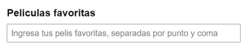

Al capturar el input correspondiente, obtendremos el siguiente resultado:

```js
const peliculasFavoritas = document.querySelector("#input-peliculas");
console.log(peliculasFavoritas);
//"Harry Potter;Mi Villano Favorito;Avatar
```

Ahora bien, supongamos que para poder almacenar dicha información en nuestra base de datos, es necesario que “normalicemos” la misma, convirtiéndola en un array de películas.

### método `split()`.

Este método nos permite dividir los caracteres de un string sobre la base del criterio que deseemos, obteniendo como resultado un array que contiene cada uno de los substrings generados.
Entonces, volviendo a nuestro array de películas,podríamos utilizar split para normalizar la información recolectada:

```js
const peliculasNormalizadas = peliculasFavoritas.split(";");
console.log(peliculasNormalizadas);
//['Harry Potter','Mi Villano Favorito','Avatar']
```

Ahora la informacion se encuentra normalizada y lista para ser almacenada.

### Método `.toLowerCase()`

Permite convertir el texto a minuscula

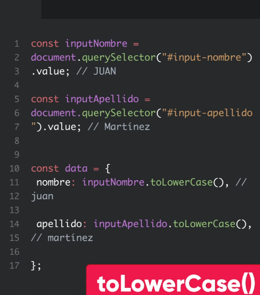

### Método `.toUpperCase()`

Permite convertir el texto a mayuscula


### Método `.concat()`

Permite concatenar 2 o mas strings en un unico valor

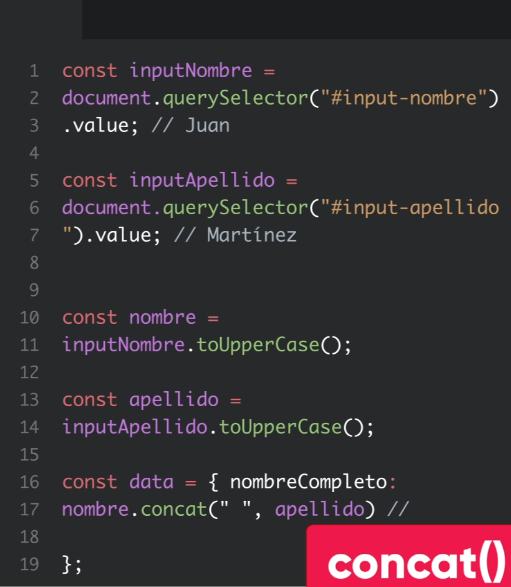

### Método `.trim()`

Permite eliminar los espacios en blanco que se encuentran en al final de un string

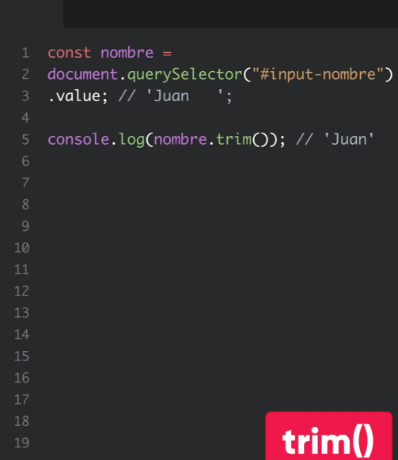

### Método `.replace()` y `.replaceAll()`

Permite cambiar o reemplazar caracteres por otros

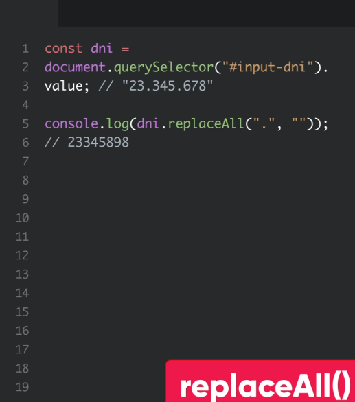


>### 📝 Quiz! <a id='c11d'></a>
>
>**¿Qué método nos ayudaría si el usuario ingresa espacios de más al final de su nombre?**
> Método trim
> 
>**¿Qué hace el método split?**
> Separa un string por sus caracteres o varios strings en valores de array.
> 
>**Con el método concat, podemos incorporar un array dentro de otro.**
> FALSO. concat crea un nuevo conjunto de valores de las 2 variables existentes. Por lo que en total, quedan 3 variables. 
> 
>**¿Qué resultado se espera de este código?** 
>    ```js
>    const p = 'El veloz zorro rojo saltó sobre el perro dormido';
>    console.log(p.replace('perro', 'mono'));
>    ```
> const p = 'El veloz zorro rojo saltó sobre el mono dormido'.
>
> **Si un usuario ingresa su nombre en mayúsculas, ¿qué podríamos hacer al respecto?**
> Método toLowerCase

## Notas clase 11

Formas de acceder/captar a un formulario:

```js
// 1.
const formulario = document.querySelector('form');
// 2.
const form = document.forms[0];
```

Formas de captar el `name` de un input

```js
//1.
document.querySelectorAll('[name=hobbies]');
//2.
document.getElementsByName('nacionalidad');
//3.
document.querySelectorAll('#listado-hobbies input');
```

La propiedad `checked` la usamos para verificar si un box del form esta checkeado y si hacemos `console.log` nos devuelve un booleano.


> ### [📌Actividad: Formulario](./Actividades/C11-formulario.md)

> ### 💡
> **Normalizacion**: Reglas y procesos que permiten unificar el formato de los datos en forma independiente a como el usuario los haya ingresado
> Ej: un correo ingresado con MAYUS, lo pasamos a MINUS.

**Normalizacion formulario**

```js
//1. Captamos el formulario
const formulario = document.querySelector('form');

// 4. Obtenemos la información de los nodos con el ID
const nombre = document.querySelector('#nombre');
const contrasenia = document.querySelector('#pass');
const telefono =  document.querySelector('#tel');
const hobbies =  document.querySelectorAll('#listado-hobbies input');
const nacionalidades = document.getElementsByName('nacionalidad');

//2. Prevenimos el envio del formulario por defecto y cuando de submit vamos a controlar todo lo que pasa
formulario.addEventListener('submit', function (event) {
    // 3. frenar el envío por defecto, para poder revisar todo antes.
    event.preventDefault();
    // 5. Captamos la información
    console.log(nombre.value);
    console.log(contrasenia.value);
    console.log(telefono.value);

    // 6. Vemos los nodos seleccionados con la propiedad `checked` y pusheamos a la lista
    let lista = [];
    hobbies.forEach( hobbie => {
        if(hobbie.checked){
            console.log(hobbie.id);
            lista.push(hobbie.id);
        }
    });
    // 7. Usamos checked para verificar cual fue la opcion del radio elegida y guardamos el dato en pais. 
    let pais;
    nacionalidades.forEach( radio =>{
        if(radio.checked){
            console.log(radio.id);
            pais = radio.id;
        }
    });
    //9. Mandamos los datos para verlos normalizados.
    console.log(normalizar(nombre.value, contrasenia.value, telefono.value, lista, pais));
    
});

//8. Creara un objeto con los datos normalizados.
function normalizar(nom, pass, tel, listadoHobbies, nacionalidad) {
    const datos = {
        //10. Pone en mayúscula la primera letra, con slice recorta el resto y lo pone en minúscula
        name: nom[0].toUpperCase() + nom.slice(1).toLowerCase(),
        password: pass,
        phone: tel,
        hobbies: listadoHobbies,
        nationality: nacionalidad
    }
    return datos;
}
```

# C12 - 

> ### [📌Actividad: Formulario II: Normalización](./Actividades/C12-formulario-2.md)

# C13 - Formularios II <a id='c13'></a>

> ### 💡
> Cuando hablamos de validar un dato lo que hacemos es establecer una serie de reglas que debe cumplir el mismo para ser correcto. En cambio, el proceso de normalizar es organizar los datos de manera tal que respeten el formato deseado para ser enviados o posiblemente almacenados en una base de datos. Pasemos a practicar ambos casos. 

> #### 🎬
> Video: Eventos de formulario

## Evento de formularios <a id='c13a'></a>

### Evento `focus`

Sucede cuando el usuario ingresa con el cursor dentro de un campo input

### Evento `blur`

Sucede cuando el cursor abandona el campo donde se encuentra.
Como cuando un ususario termina de completar un campo

### Evento `change`

Permite identificar que el valor de un campo, cambio. Este se puede aplicar sobre cualquier campo del formulario, inclusive sobre el formulario completo
Detecta un cambio en el html de ese campo

### Evento `submit`

Sucede cuando se le da click a un input o boton de tipo submit

> ### 💡
> Usar el preventDefault en la primer linea para evitar que evie el formulario antes

### Combinacion `this.value`

Retorna la informacion dentro del campo que estamos analizando

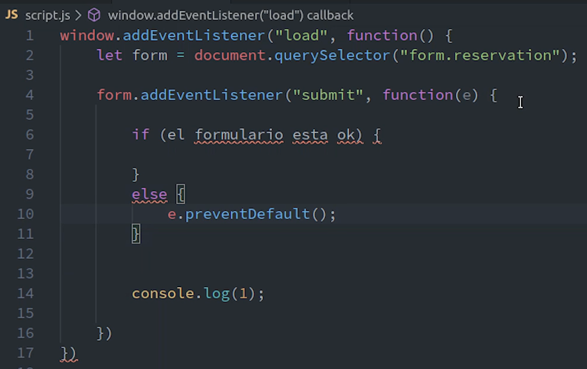


***
<!-- En nuestra carrera profesional como desarrolladores, nos encontraremos con muchas situaciones en las que será necesario obtener y manipular datos que provienen de formularios. Por ello, y ahora que ya vimos los métodos que nos permiten obtener los datos de un formulario, es momento de que veamos de qué manera podemos utilizar los mismos en una aplicación real.

En esta instancia, te proponemos una actividad mediante la cual partiremos de un formulario en el cual las personas completarán ciertos datos para poder registrarse en nuestra aplicación. El objetivo principal del ejercicio es poder aplicar los conocimientos que adquirimos hasta aquí, para obtener los datos ingresados por la persona, realizar algunas validaciones básicas sobre la información obtenida y almacenar los mismos en un objeto que contenga dicha información.

El punto de partida, es un repositorio de Github que se encuentra en este link. Allí, encontraremos la consigna, archivos y todo lo necesario para poder realizar la actividad. Para comenzar, podemos realizar un fork del repositorio para almacenarlo en nuestra cuenta de Github o simplemente descargarlo como un archivo .zip para trabajarlo localmente en la computadora. ¡Manos a la obra! -->

>### 📝 Quiz! <a id='c13b'></a>
>
>**El evento blur sirve para...**
> detectar que el usuario quitó el cursor de un input del formulario.
> 
>**El evento focus sirve para...**
> detectar que el usuario situó el cursor en un input del formulario.
> 
>**El evento change sirve para...**
> detectar cambios en el valor de un input.

## Validaciones <a id='c13c'></a>

> #### 🎬
> Video: Validaciones

> #### 📑
> pdf: Validación del lado del cliente


✅ Capturo el formulario, hay 2 formas:

```js
let formulario = document.querySelector("form.reservation");
```

```js
let formulario = document.forms["reservation"];
```

✅ Cuando se envia el formulario se ejecuta el evento `submit` entonces lo esucchamos

```js
formulario.addEventListener("submit", function(event){});
```
o
```js
formulario.onsubmit= (event) => {};
```

✅ Validamos cada campo; Podemos obtener nuestro input con querySelector para que finalmente preguntemos si el valor campo está vacío

```js
event.preventDefault();
let campoNombre = document.querySelector("input.nombre");
if(campoNombre.value==""){
    alert("El campo nombre no debe estar vacío");
};
```

✅ Almacenamos los errores: Creamos un array para acumular estos errores y cambiar nuestra lógica. Es decir, si el array no está vacío, entonces, prevenimos el envío del formulario, caso contrario, el formulario se enviará

```js
let errores= [];
let campoNombre = document.querySelector("input.nombre");
if(campoNombre.value==""){
    errores.push("El campo nombre está vacío");
}
if(errores.length>0){
    event.preventDefault();
}
```

✅ Mostramos los errores

En el HTML:

```html
<section class="errores">   
    <ul>
        ...   
    </ul>
</section>
```

En Js:

```js
if(errores.length>0){
    event.preventDefault();
    let ulErrores = document.querySelector(".errores ul");
    errores.forEach(error=> {
        ulErrores.innerHTML+=`<li>${error}</li>`
    });
}
```

### 📜 Ejemplo! Live coding : Validaciones <a id='c13d'></a>


Validaciones con `alert`
```js
window.addEventListener('load', ()=>{
    //Capturo el formulario
    let formulario = document.querySelector('form.reservation');
    //Quiero definir un evento en el momento en que se envíe el formulario
    formulario.addEventListener('submit', (e)=>{
        //prevenimos que se envíe el formulario antes de las validaciones
        e.preventDefault();

        //obtenemos cada uno de los campos y verificamos que si el campo no tiene lo que espero:error
        let campoNombre = document.querySelector('input.name');
        //Vemos el contenido del campo
        if(campoNombre.value == ""){
            alert('campo nombre debe estar completo')
        } else if(campoNombre.value.length < 3){
            alert('campo nombre debe tener al menos 3 caracteres')
        }

        let campoMensaje = document.querySelector('input.message');
        //Vemos el contenido del campo
        if(campoMensaje.value == ""){
            alert('campo mensaje debe estar completo')
        }

        let campoFecha = document.querySelector('input.date');
        //Vemos el contenido del campo
        if(campoFecha.value == ""){
            alert('campo fecha debe estar completo')
        }
        
        let campoPersonas = document.querySelector('input.people');
        //ver como se valida..
    })
})
```

Validaciones con un `array` de errores

```js
window.addEventListener('load', ()=>{
    let formulario = document.querySelector('form.reservation');
    formulario.addEventListener('submit', (e)=>{
        e.preventDefault();
        // creamos un array para mostrar los errores en una lista en un div>ul>lixerror
        let errores = [];
        //se va a pushear cada error, al array.
        let campoNombre = document.querySelector('input.name');
        if(campoNombre.value == ""){
            errores.push('campo nombre debe estar completo')
        } else if(campoNombre.value.length < 3){
            errores.push('campo nombre debe tener al menos 3 caracteres')
        }

        let campoMensaje = document.querySelector('input.message');
        if(campoMensaje.value == ""){
            errores.push('campo mensaje debe estar completo')
        }

        let campoFecha = document.querySelector('input.date');
         if(campoFecha.value == ""){
            errores.push('campo fecha debe estar completo')
        }
        
        let campoPersonas = document.querySelector('input.people');
        //ver como se valida..
        
        //Si el array esta vacío no hay errores, entonces is no hay errores se envía
        if(errores.length>0){
            e.preventDefault();
            //Busca seccion de errores
            let ulErrores = document.querySelector('div.errores ul');
            
            for (let i = 0; i< errores.length; i++) {
                ulErrores.innerHTML += `<li>${errores[i]}</li>`
            }
        }
    })
})
```

## validación "on time"

Antes de enviar datos al servidor, es importante asegurarse de que la información suministrada por parte de la persona visitante sea la que justamente estamos esperando recibir para posteriormente procesar.

Sirve para:

✅ Procurar una limpieza de los datos

✅ Ayuda a garantizar una excelente user experience. 

Porque resulta realmente molesto que cuando tenemos un error en el front end, sea necesario enviar la información al servidor para que este la verifique y nos haga ver el error cometido, ¿no?

Los procesos de validación no son para nada triviales, por el contrario, son una parte fundamental de nuestro proceso como desarrolladores. Además, vale la pena aclarar que nunca está de más sumar capas de validación a nuestro sistema. 

> ### 💡
>
> ✅ Simularemos el proceso de login de una persona dentro de nuestra aplicación, utilizando los conceptos que vimos hasta el momento. 

<!--
 Imaginemos, por ejemplo, que queremos iniciar sesión en una aplicación. Para ello, ingresamos nuestro email y contraseña y, seguidamente, damos clic en el botón Iniciar sesión. En ese momento, nuestra aplicación realiza un pedido al servidor, quién deberá validar que los datos ingresados sean correctos —es decir, que exista un usuario con esas credenciales registradas en la base de datos—. Si los datos son correctos, podremos loguearnos; caso contrario, el servidor nos devolverá un mensaje de error. -->

## Objeto `location` <a id='c13e'></a>

> #### 📑
> pdf: Objeto location

> #### 🎬
> Video: Objeto location

Trae consigo un par de propiedades y métodos que nos van a permitir recopilar información que viaje en la barra de direcciones. 

✅ Permite operar con la URL donde estamos

### Atributo `href`

✅ Devuelve toda nuestra url

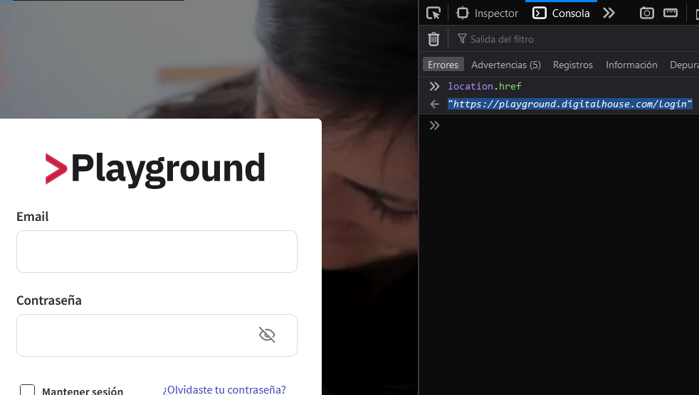

### Método `reload()`

Permite recargar nuestra pagina desde el front


### Atributo `search`

Devuelve la query string entera, la usamos instanciandola como un objeto con `URLSearchParams`

#### Query string

Cuando hacemos un pedido por `GET` o por medio de un hipervinculo, los datos viajan por `query string`

✅ Se agrega al final de nuestra URL despues del signo de pregunta `?`

✅ Contiene todos los parametros que solicitamos con nuestro pedido

```js
let query = newURLSearchParams(location.search);
if(query.has('search_query')){
    let search = query.get('search_query');
    console.log(search)
};
```

#### 📜 Ejemplo!
Buscamos Rosalia en el buscador de youtube

```
https://www.youtube.com/results?search_query=rosalia
```

Al enviar el formulario, nuestra url cambia y se crea esa query string con el dato que estamos buscando

## Interfaz `URLSearchParams`

✅ Sirve para instanciar un objeto de nuestra query string

✅ Con esto, se accede a metodos mas practicos para manipular el query string

Para instanciarlo:

```js
let query = new URLSearchParams(location.search);
```

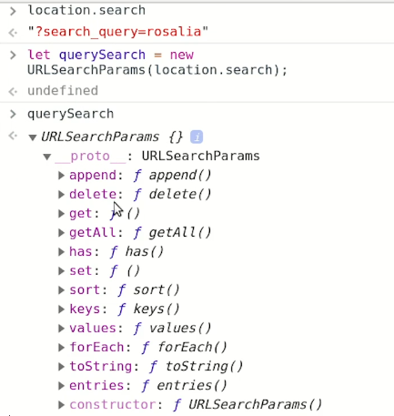

### Método `.has()`

Revisa si se encuentra un determinado parametro en la query string y devuelve un booleano

```js
query.has('search_query'); //true
```

### Método `.get()`

Nos devuelve el valor del parametro buscado.

```js
query.get('search_query'); //Rosalia
```


>### 📝 Quiz! <a id='c13f'></a>
>
>**Si utilizáramos el atributo href de location sobre la URL: https://www.youtube.com/results?search_query=peaky+blinders, ¿qué obtendríamos??**
> https://www.youtube.com/results?search_query=peaky+blinders
> 
>**¿Qué método del objeto location permite recargar el sitio??**
> location.reload()
> 
>**Si utilizáramos el atributo location.search de la URL: https://www.youtube.com/results?search_query=peaky+blinders, ¿qué obtendríamos?**
> search_query=peaky+blinders
> 
>**Si estamos en la URL: https://www.youtube.com/results?search_query=peaky+blinders, y teniendo en cuenta el código: "let query = new URLSearchParams(location.search)", ¿qué devolvería si implementáramos el método query.get(search_query)?**
> peaky+blinders        
> 

> #### 📑
> zip: ejercicio-formulario-timeout-main

> ### [📌Actividad: Formulario - validaciones](./Actividades/C13-formulario-3.md)


# C14 - Json y Storage <a id='c14'></a>

JSON es un formato de texto sencillo para el intercambio de datos. 

Su implementación deviene de la notación de objetos de JavaScript. 

✅ Está compuesto por clave valor

✅ Las propiedades van siempre entre comillas dobles. Esto último es un requisito esencial para su correcto funcionamiento.

```json
{
    "nombre": "JSON",
    "significado": "Javascript Object Notation",
    "lenguajeDeProgramacion": false,
    "tiposDeDatosDisponibles": [ "numbers", "strings", "booleans", "null", "arrays", "objects" ]
}
```

**¿En qué momento es útil?**

Cuando trabajamos con mucha cantidad de información, es necesario organizarla en nuestro proyecto de tal manera que todos los datos se almacenen en un archivo separado del archivo donde tenemos el código de nuestro programa. 

>### 👍
> Así, si necesitamos actualizar o modificar datos, podremos recurrir directamente al archivo JSON.

✅ Para poder recurrir a esta información, debemos utilizar ciertos métodos para leer esos datos. 

> #### 📑
> pdf: Métodos de JSON

## Objeto literal vs Json <a id='c14a'></a>

Objeto literal | JSON
------- | -------
Admite comillas simples y dobles | Las claves van entre comillas 
Las claves del objeto van sin comillas | Sólo se pueden usar comillas dobles | 
Podemos escribir métodos sin problemas | No admite métodos, sólo propiedades y valores
Se recomienda poner una coma en la última propiedad | No podemos poner una coma en el último elemento

> ### 💡
>  Debemos saber interpretar y parsear esa información para poder trabajarla como lo hacemos con los objetos literales.

## Metodos JSON <a id='c14b'></a>

Tenemos dos procesos que nos facilitan esto:

✅ `JSON.parse()` = JSON → JS

✅ `JSON.stringify()` = JS → JSON

## Método `JSON.parse()`

Analiza una cadena de texto JSON, la cual recibe por parámetro. Retorna un objeto de JS que se corresponde con el texto parseado

✅ Recibe JSON por parámetro

✅ Devuelve JS

```js
JSON.parse('{}');              // {}
JSON.parse('true');            // true
JSON.parse('"hola!"');           // "hola!"
```

## Método `JSON.stringify()`

Recibe un objeto o valor de JavaScript y lo convierte. Retorna una cadena de texto con el formato correspondiente a la notación JSON

✅ Recibe JavaScript por parámetro.

✅ Devuelve JSON.

Para practicar el parseo de un JSON, utilicemos el siguiente repositorio y resolvamos la consigna que se encuentra en los comentarios de JS.

<https://github.com/mates-code/practicando-JSON>

> #### 📑
> zip: practicando-JSON-main 

## Objetos: LocalStorage y SessionStorage <a id='c14c'></a>

Para poner un ejemplo, pensemos por un momento en un sistema de e-commerce, más exactamente en su carrito de compras. Seguramente, muchas veces hemos agregado productos a un carrito y repentinamente salimos de la página, para simplemente volver instantes después y darnos cuenta que las cosas que agregamos al carrito siguen ahí, intactas. Eso es posible gracias al almacenamiento local del navegador. Esta funcionalidad mejora la experiencia de usuario, sin tener que saturar el servidor de peticiones que nos sabemos si se van a concretar del lado del cliente. Con esto en mente, veamos cómo implementar estos conceptos que ya son algo familiares, pero esta vez desde el lado del front end. 

Uno de los usos más frecuentes de dicha técnica consiste en almacenar información relativa a la sesión de una persona dentro de determinada aplicación. De esta manera, por ejemplo, podemos mantener iniciada la sesión por más de que la persona cierre el navegador, evitando que deba realizar el login correspondiente cada vez que visita nuestra aplicación. 

> #### 🎬
> Video: LocalStorage y SessionStorage

> #### 📑
> pdf: Session storage y local storage

Ls funcion de ambos es almacenar informacion en el navegador.

✅ Esta informacion se puede recuperar en cualquier pagina del sitio

✅ Se guarda la informacion por usuario

✅ Usan los mismos metodos

✅ Solo podemos almacenar datos en formato string

### Objeto `localStorage`

Permite almacenarlas por tiempo indeterminado; Los datos almacenados en localStorage no tienen fecha de expiración


```js
localStorage.setItem('key', 'value');
```
```js
localStorage.getItem('key');
```
```js
localStorage.removeItem('key');
```

### Objeto `sessionStorage`

Nos permitirá guardar información en sesión. Es decir que si usamos esta opción y cerramos el navegador, la información acá almacenada se perderá

```js
sessionStorage.setItem('key', 'value');
```
```js
sessionStorage.getItem('key');
```
```js
sessionStorage.removeItem('key');
```

### Metodos `setItem()`

✅ Crea nuevos atributos y asigna valores para ellos

✅ El primer parametro: sera la clave que querramos guardar y el segundo sera el valor que esta clave lleve

```js
sessionStorage.setItem('nombre','Indira');
```

### Metodos `getItem()`

Nos va a devolver el valor de la clave que le pasemos
```js
//Aqui le estamos pidiendo que nos de el valor que posee la clave nombre
sessionStorage,getItem('nombre'); //Indira
```

### Método `removeItem()`

Recibe un solo parametro, la llave.

✅ Busca la clave correspondiente y la elimina

```js
sessionStorage.removeItem('nombre');
```

### Método `clear()`

Borra todo el contenido que hayamos almacenado en storage

```js
sessionStorage.clear();
```

### 📜 Ejemplo!


> ### 💡
> Si trabajamos con arrays y/u objetos literales tenemos que pasarlos a string para poder ser almacenados en session o local storage.
>```js
>sessionStorage.setItem("nombreUsuario",JSON.stringify())
>```

> ### 💡
> Para pasar de JSON a objeto javascript usamos `JSON.parse()`


> ### 💡
> Si queremos guardar los datos en localStorage y sessionStorage y estamos trabajando con arrays u objetos debemos usar los metodos de JSON.stringify para poder guardar la informacion

>### 📝 Quiz! <a id='c14d'></a>
>
>**¿Cuál es la diferencia entre sessionStorage y localStorage?**
>localStorage permite almacenar información por tiempo indeterminado y sessionStorage, no.
> 
>**El método .setitem() de localStorage, ¿qué nos permite realizar?**
> Agregar valores asociados a una key en localStorage.
> 
>**El método .removeitem() de sessionStorage, ¿qué nos permite realizar?**
> Remover valores asociados a una key en el sessionStorage.
>¡Perfecto! Recuerda siempre que el método es el mismo tanto para localStorage como para sessionStorage. En este caso lograste identificar la responsabilidad de remover los valores asociados al sessionStorage.
> 
>**El método .clear() de localStorage, ¿qué nos permite realizar?**
> Borrar todo el contenido de localStorage.
> ¡Muy bien! Este método es muy útil para programar la opción de cerrar sesión en nuestros proyectos.
>
>**¿Cuál de las siguientes es una de las características de sessionStorage?**
> Los datos se borran al cerrar la ventana del navegador.
>
> En storage se puede guardar un objeto valido o un `null`
>

<!-- 

¡Muy bien! Si llegamos hasta acá quiere decir que ya aprendimos:

    Eventos de un formulario, el cual nos sirve para captar una acción del usuario ante la cual puede realizarse algún proceso.
    El Objeto Location y sus propiedades; para conseguir parámetros de una URL y generar redirecciones.
    Validaciones, imprescindibles para un buen UX y para evitar posibles errores en los datos que ingresa el usuario.
    El formato JSON, el cual se compone de clave-valor, y sus metodos para el intercambio de datos.
    A utilizar el localStorage y el sessionStorage para almacenar información de usuarios en el lado del cliente.

¡Felicitaciones!, anotá las dudas que te hayan quedado pendientes para revisarlas con el profe. ¡Nos vemos!
 -->

> #### 📑
> zip: ejercicio-login-storage-main 

> ### [📌Actividad: Buscador](./Actividades/C14-buscador.md)

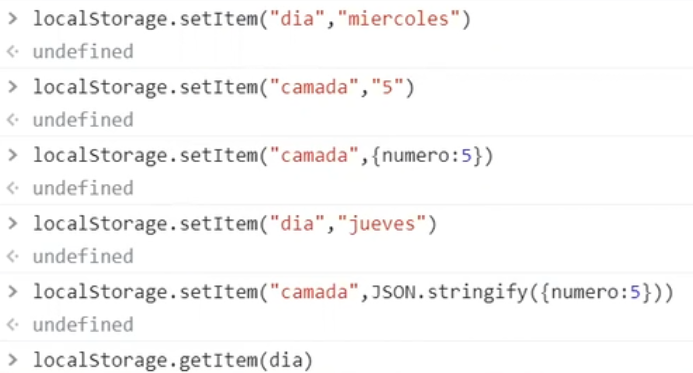

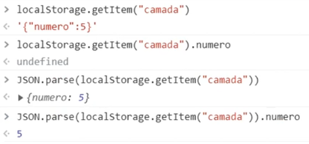


# C15 -  Proyecto integrador <a id='c15'></a>

> ### [📌Actividad: Guardar comentarios](./Actividades/C15-guardar-comentarios.md)

> ### [📌Actividad: Proyecto integrador To Do App](./Actividades/c15-proyecto-integrador-to-do-app.md)

> ### [📌Actividad: To Do I](./Actividades/C15-todo-do-I.md)

# C16 - Introducción a Asincronismo <a id='c16'></a>

## Concepto de asincronismo

Gracias al asincronismo generamos un código más funcional, rápido y eficiente, sin necesidad de recargar la página para actualizar la información. JavaScript es un lenguaje de programación asíncrono porque es capaz de ejecutar un hilo de tareas o peticiones en las cuales, si la respuesta demora, el hilo de ejecución de JavaScript continuará con las demás tareas que hay en el código. 

### Concurrencia y paralelismo

Existen 2 tipos de asincronismo:

- Concurrencia: cuando las tareas pueden comenzar, ejecutarse y completarse en períodos de tiempo superpuestos, en donde al menos dos hilos están progresando.

- Paralelismo: cuando dos o más tareas se ejecutan exactamente al mismo tiempo.

La diferencia entre la concurrencia y el paralelismo está en que, en el primer caso, no implica que las tareas terminen de ejecutarse al mismo tiempo literalmente como sí ocurre en el segundo caso. Además, decimos que JavaScript es un lenguaje no-bloqueante porque las tareas no se quedan bloqueadas esperando a que finalicen evitando proseguir con el resto de tareas.

Además, decimos que Javascript es un lenguaje no-bloqueante porque las tareas no se quedan bloqueadas esperando a que finalicen evitando proseguir con el resto de tareas. 

## Sincronismo/asincronismo

[Link: tareas sinconas vs asincronas](https://view.genial.ly/60ddcde1acd3a70d5261b118)


## Introducción a HTTP <a id='c16a'></a>

> #### 🎬
> Video: Introducción a HTTP

> #### 📑
> pdf: Introducción a HTTP

> ### 💡
> **Protocolo:** Reglamentos o instrucciones que se fijan por tradición o por convenio

### Request - Response

Dentro de esta estructura de comunicación, hablamos de `request` cada vez que el **cliente** le solicita un recurso al servidor y de `response` cada vez que el **servidor** le devuelve una respuesta al cliente.

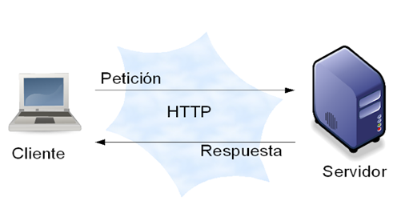

En versiones anteriores, los mensajes HTTP eran textos planos. 

En HTTP/2, los mensajes están estructurados en un nuevo formato, lo que contribuye a una mayor legibilidad y debugging más eficiente.

> ### 💡
> HTTPS es un protocolo mejorado de HTTP. Usando este protocolo, el servidor codifica la sesión con un certificado digital

> #### 🎬
> Video: Request y Response

## Formacion de una peticion y respuesta


### Request

Tienen:

✅ Linea de inicio

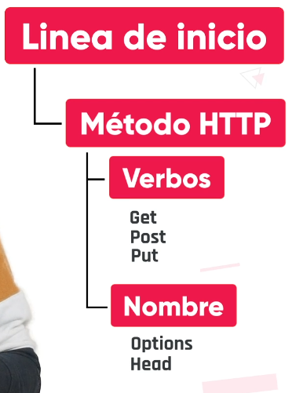

> ### 💡
> Debe elegirse solo un verbo o nombre

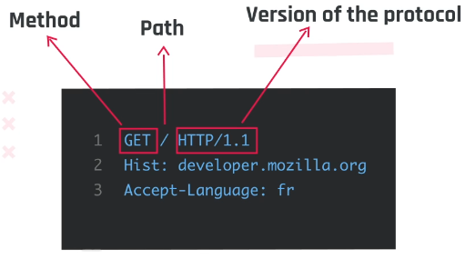

✅ Cabeceras

Son opcionales, aportan informacion adicional, no diferencia mayus de minus


✅ Un cuerpo

No todas las peticiones llevan uno, las peticiones que reclaman datos, normalmente no necesitan ningún cuerpo

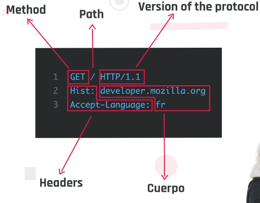

### Response

✅ Linea de inicio

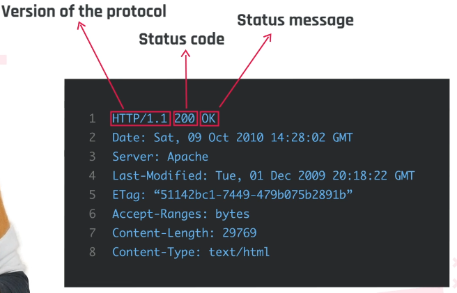


✅ Cabeceras y ✅ Un cuerpo

Son opcionales


## Protocolo http <a id='c16b'></a>

Hyper Text Transfer Protocol, o en castellano: protocolo de transferencia de hipertexto, gestiona las transacciones web entre clientes y servidores.
 
Gestiona la comunicación entre dos máquinas conectadas a una red, en donde una pide por un contenido específico y la otra se encarga de responder a dicha solicitud.

<!-- 
- ¿Será que el tipo de petición al servidor es el mismo cuando publicamos una foto en nuestra cuenta de Instagram que cuando queremos ver una foto de otra cuenta que no es nuestra?

- Cuando iniciamos sesión en nuestro correo electrónico, ¿nuestra contraseña está protegida desde que sale de nuestra computadora hasta que llega al servidor?

- Cuando queremos editar solo nuestro nombre en el perfil de LinkedIn, ¿la información que no modificamos se mantiene o se sobrescribe nuevamente por más que sea la misma?

- ¿Cuál será la diferencia entre ocultar alguna foto de nuestro perfil de Facebook y borrarla? -->

✅ Nos permite navegar hacia sitios web a traves de direcciones www y enlaces

✅ El protocolo HTTP permite la transferencia de información en la web a través de direcciones web, técnicamente llamadas URI.


### URI 

Una URI (identificador de recursos uniformes) 
Es un bloque de texto que se escribe en la barra de direcciones de un navegador web y está compuesto por dos partes: la URL y la URN.

`www` conocida como dirección web y técnicamente conocida como URI

- `URL`: Indica donde se encuentra el recurso que deseamos obtener y siempre comienza con un protocolo
- `URN`: Es el nombre exacto del recurso, el nombre del dominio 


#### Componentes de una URI

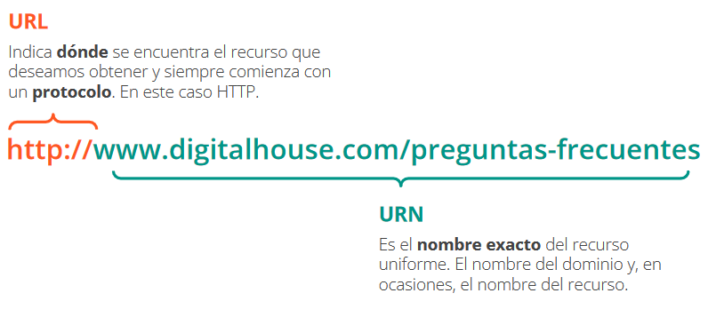

## Como viaja la informacion <a id='c16c'></a>

La información viaja a través de los headers o cabeceras, que son porciones de texto conteniendo la información requerida por el cliente o el servidor.

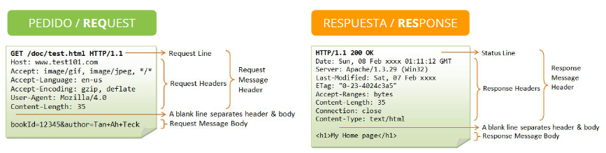

Además de las cabeceras, tenemos el body o cuerpo del mensaje, que es donde estará la información en sí del pedido o su respuesta. 

### 📜 Ejemplo!

- En el caso del pedido, puede ser el contenido de un formulario. 
- En el caso de una respuesta, puede ser el código de la página que solicitamos.


## Metodos http <a id='c16d'></a>

El protocolo HTTP define métodos de petición. 

Cada método representa una acción y, si bien comparten algunas características, implementan funcionalidades diferentes entre sí. 

✅ Se usan para indicar la accion que se desea realizar con un recurso determinado 

Los métodos más utilizados por este protocolo son:


### Método `GET`

Se utiliza para pedirle información al servidor de un recurso específico. Cada vez que escribimos una dirección en el navegador o accedemos a un enlace, estamos utilizando el método GET. En caso de querer enviar información al servidor usando este método, la misma viajará a través de la URL.

### Método `POST`

Se utiliza para enviar datos al servidor. Este método es más seguro que GET, ya que la información no viaja a través de la URL.

### Método `PUT`

Es muy parecido a POST. Se usa para reemplazar toda la información actual de un recurso presente en el servidor

### Método `PATCH`

Similar a PUT. Es utilizado para aplicar modificaciones parciales a un recurso en el servidor

### Método `DELETE`

Borra un recurso presente en el servidor. Cuando eliminamos un posteo en Facebook, por ejemplo, estamos utilizando este método.

> ### 💡
> PUT y PATCH suelen ser lo mismo. Elegir entre uno y otro va a depender del contexto y lo que queramos implementar en nuestra aplicación. Al editar un posteo o un perfil estaremos usando alguno de estos dos métodos

En resumen, tenemos 5 métodos y cada uno de ellos tiene un propósito.

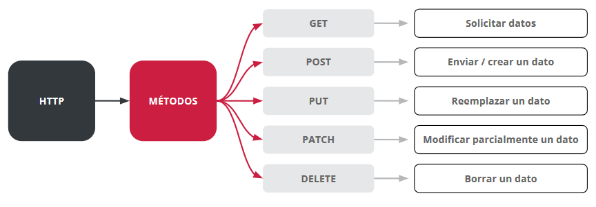

## Códigos de estado HTTP <a id='c16e'></a>

Cada vez que <r>el servidor</r> recibe una petición o request, este <r>emite un código de estado que indica, de forma abreviada, el estado de la respuesta HTTP</r>. 

El código tiene tres dígitos. 

El primero representa uno de los 5 tipos de respuesta posibles:

✅ 1 _ _  Respuestas informativas

✅ 2 _ _  Respuestas exitosas

✅ 3 _ _  Redirecciones

✅ 4 _ _  Errores del cliente

✅ 5 _ _  Errores de servidor

Algunos de los códigos más usados son:

- `200`: OK → La petición se realizó con éxito.
- `301`: Moved Permanently → El recurso se ha movido.
- `302`: Found → El recurso fue encontrado.
- `304`: Not Modified → El recurso no cambió, se cargará desde el caché.
- `400`: Bad Request → El pedido está mal.
- `401`: Unauthorized → No estás autorizado, seguramente debas autenticarte.
- `403`: Forbidden → El pedido está prohibido y no debería repetirse.
- `404`: Not Found → El recurso no fue encontrado.
- `500`: Internal Server Error → Hubo un error en el servidor.
- `503`: Service Unavailable → El servicio solicitado no está disponible.
- `550`: Permission denied → Permiso denegado

>### 📝 Quiz! <a id='c16f'></a>
>
>**HTTP es**
> un protocolo de transferencia
> 
>**HTTP nos permite...**
> transferir información en la web.
> 
>**Utilizando el método GET podemos...**
> podemos enviar información al servidor y también recibirla.
> 
>**El método POST es más seguro que el método GET cuando se trata de enviar información al servidor.**
> Verdadero
> 
> **En HTTP, cuando hablamos de request nos referimos al...**
> Cliente
>
> **En HTTP, cuando hablamos de response nos referimos al...**
> Servidor
>
> **¿Cuáles de los siguientes métodos son los más utilizados por HTTP?**
> get, patch, update, put , delete
>


> ### [📌Actividad: Simulacion asincronia](./Actividades/.md)

# C17 - APIs I

Es una interfaz que permite la comunicación entre 2 aplicaciones. 

Si tuviéramos que simplificar un poco esta definición y llevarlo a algo más simple, imaginemos que es un sitio que en vez de responder algo visual, como HTML con CSS, nos responde información. ¿Y de qué nos serviría esto? Bueno, los usuarios probablemente no van a ingresar a este tipo de sitios, pero sí una aplicación que necesite abastecerse de información particular. 

Por ejemplo, una aplicación que necesite un listado completo de todos los países del mundo podría consumir una API que le otorgue esa información.

> #### 🎬
> Video: Introducción a APIs

> ### 💡
> La url de las APIs se llaman endpoint

### Endpoint <a id='c17a'></a>

Es un punto de conexión donde necesitamos apuntar para obtener la informacion que queremos; <r>es la url para acceder a informacion en la api</r>

<r>A esas URL las llamamos `endpoints`</r>, es decir, el servidor expone a los clientes un conjunto de endpoints para que este pueda acceder. A esa interfaz uniforme, o sea, al conjunto de endpoints, le llamamos API.

Un endpoint está ligado al recurso que solicitamos, dicho recurso debe tener solamente un identificador lógico, y este proveer acceso a toda la información relacionada. 

> ### 💡
> Un endpoint es un recurso que usa el servidor y accedemos a él a través de la URL. 

### 📜 Ejemplo!

El servidor nos expone la URL /productos/listar. Dicho endpoint estará ligado al recurso que nos devuelva el listado de los productos solicitados.


## Rest <a id='c17b'></a>

> #### 🎬
> Video: Rest

> #### 📑
> pdf: Rest

REST son las siglas de Representational State Transfer

Un sistema REST es un tipo de arquitectura de servicios que proporciona estándares o protocolo que le permita a todos los sistemas que se comunican con él entender en qué forma lo tienen que hacer y bajo qué estructura deberán enviar sus peticiones para que sean atendidas.

REST es una arquitectura del tipo cliente-servidor porque debe permitir que tanto la aplicación del cliente como la aplicación del servidor se desarrollen o escalen sin interferir una con la otra. Es decir, <r>permite integrar con cualquier otra plataforma y tecnología tanto el cliente como el servidor</r>

> ### 💡
> Rest define como se tiene que estructurar una api segun esa arquitectura

### Características de la arquitectura REST

**Separar la aplicación web en 2**
1. La interfaz de usuario en una aplicación, **Ej:** Interfaz web pedidos a domicilio
2. Tener todo lo que la aplicación provee como servicio que la interfaz consume, **Ej:** lógica de negocio, la que registra los pagos

- Ubicación de los recursos
una sola ubicación para lo recursos. **Ej:** `/canciones`

**Stateless o "Sin estado"**

El servidor no almacena las peticiones que haga el cliente; cada solicitud es nueva e independiente.

REST propone que todas las interacciones entre el cliente y el servidor deben ser tratadas como nuevas y de forma absolutamente independiente sin guardar estado. Por lo tanto, si quisiéramos —por ejemplo— que el servidor distinga entre usuarios logueados o invitados, debemos mandar toda la información de autenticación necesaria en cada petición que le hagamos a dicho servidor.

> ### 💡
> Esto permite desarrollar aplicaciones más confiables, performantes y escalables.

**Cacheable**

Si se consulta habitualmente y no ha sufrido modificaciones, el cliente podria recordar esa respuesta, para no realizar ese pedido constante y eliminándole esa carga al servidor. Para que esto suceda el servidor debe responder con un encabezado `max-age`, cuyo valor es la cantidad de segundos que tiene ese recurso, una vez expirado el cliente debe volver a pedir el recurso

En REST, el cacheo de datos es una herramienta muy importante, que se implementa del lado del cliente, para mejorar la performance y reducir la demanda al servidor.

> ### 💡
> Poniendo cachés en el cliente, nos ahorramos realizar peticiones al servidor

### Principios de una arquitectura REST

✅ Debe ser una arquitectura cliente-servidor.

✅ Tiene que ser sin estado, es decir, no hay necesidad de que los servicios guarden las sesiones de los usuarios (cada petición al servidor tiene que ser independiente de las demás).

✅ Debe soportar un sistema de cachés.

✅ Debe proveer una interfaz uniforme, para que la información se transfiera de forma estandarizada.

✅ Tiene que ser un sistema por capas invisible para el cliente

### 📜 Ejemplo!

Desarrollamos una API que ofrece informacion de música queremos que sea una API REST

✅ Todos los datos a loa que querramos acceder estarán agrupados con nombres que serán sustantivos, cada uno de ellos los llamaremso recursos. Puede ser un documento, una imagen, una coleccion y en cualquier formato.

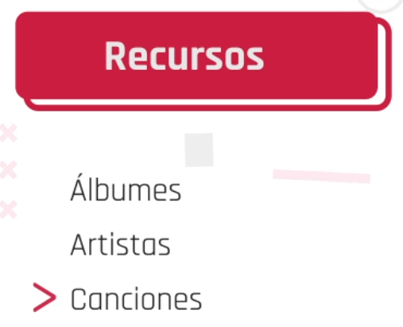

## Recursos uniformes 

Desde el lado del servidor, una arquitectura REST expone a los clientes a una interfaz uniforme.

● Todos los recursos del servidor tienen un nombre en forma de URL o hipervínculo.

● Toda la información se intercambia a través del protocolo HTTP.

En REST se aconseja un identificador de recursos para cada dato, una representacion del recurso consiste de datos y metadatos que describen al mismo y los enlaces que se pueden utilizar para consultar recursos relacionados 
Estos recursos son accesibles al cliente a traves de url, los clientes y servidores intercambian esas representaciones de recursos.

> ### 💡
> el recurso del servidor se refleja en una URL. 

## Formatos de envío de datos

Cuando el servidor envía una solicitud, este transfiere una representación del estado del recurso requerido a quien lo haya solicitado. 
Dicha información se entrega por medio de HTTP en uno de estos formatos: JSON (JavaScript Object Notation), RAW, XLT o texto sin formato, URL-encoded.
JSON es el más popular.

Los recursos se comparten en distintos formatos: 

### JSON

Debe agregarse a los `headers` un encabezado que indique el tipo de contenido 

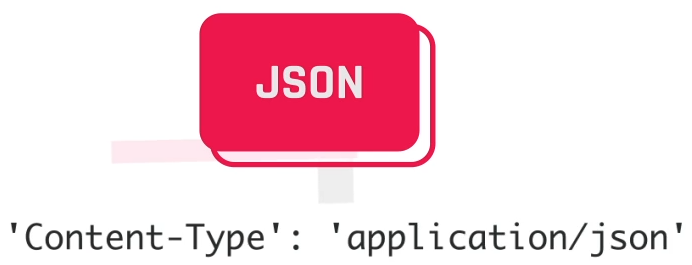

Cuando queramos enviar datos en formato JSON debemos agregar un encabezado en los headers que diga:

```js
"Content-Type": "application/json"
```
```json
{
   "id":1,
   "title": "..."
}
```
### RAW

Se utiliza para mandar datos con texto sin ningún formato en particular. Pero no es usualmente utilizada

### TEXT

Se utiliza para enviar datos que no sean en formato JSON, como archivos HTML y CSS.

### URL-encoded

Indica que se nos van a enviar datos codificados en forma de URL. Por lo tanto, nos envía algo muy similar a un query string.
Un dato enviado mediante este método se vería de la siguiente manera:

```
email%3Dcosme%40fulanito.fox%26password%3Dverysecret
```

### Metodo `HEAD`

Esun metodo HTTP que en API REST se utiliza con el fin exclusivo de conocer la ultima fecha de modificacion del recurso, en vez de pedirlo por GET lo pedimos por `HEAD` 

> ### 💡
> Para ver las metodos: <https://restfulapi.net/>

## AJAX <a id='c17c'></a>

AJAX (Asynchronous JavaScript and XML) es un conjunto de tecnologías que se utilizan para crear aplicaciones web asíncronas. 

✅ Esto las vuelve más rápidas y con mejor respuesta a las acciones del usuario. 

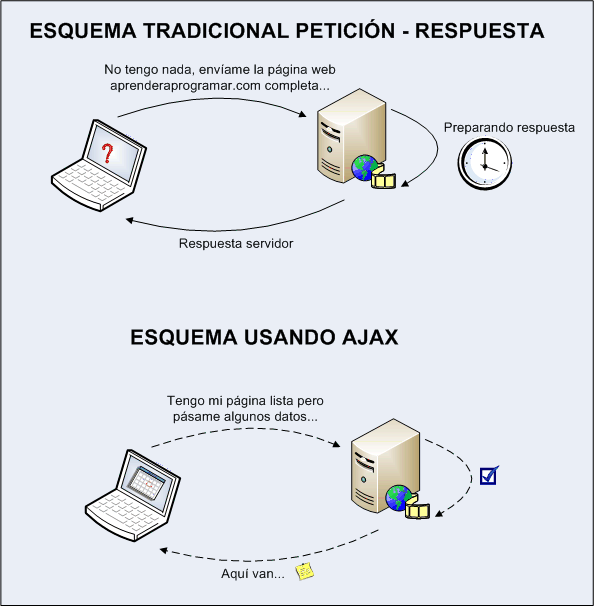


1. Se produce un evento en una página web (se carga la página, se hace clic en un botón)
2. JavaScript crea un objeto `XMLHttpRequest`
3. El objeto `XMLHttpRequest` envía una solicitud a un servidor web
4. El servidor procesa la solicitud.
5. El servidor envía una respuesta a la página web.
6. La respuesta es leída por JavaScript.
7. JavaScript realiza la acción adecuada (como la actualización de la página)

### 📜 Ejemplos prácticos de AJAX!

#### Autocompletado de Google

Esta te ayuda a completar tus palabras clave mientras las escribes. Las palabras clave cambian en tiempo real, sin embargo, la página como tal no cambia.

#### Votación o sorteo

En este se calculan resultados en tiempo real y se muestran los indicadores actualizado

#### Chat de atención al cliente

El usuario puede explorar la página al mismo tiempo y que el chat queda abierto sin que se recargue la web con cada nuevo mensaje

#### Notificaciones en redes sociales

Tanto Twitter, Facebook e Instagram, entre otras aplicaciones, reciben actualizaciones constantemente y llegan a ti como mensajes o contenido del inicio que podría interesarte

Para conocer métodos y propiedades del objeto:

<https://www.w3schools.com/xml/ajax_xmlhttprequest_create.asp> 

## AJAX Fetch <a id='c17d'></a>

Las solicitudes asincrónicas son un pilar fundamental del desarrollo con JavaScript, sobre todo cuando nos encontramos del lado del front end. Con ellas podremos hacer peticiones a distintas APIs y consumir los datos que estas nos proveen de forma dinámica y sin poner en riesgo la carga del resto de nuestra funcionalidad.

En la actualidad, JavaScript nos provee las funcionalidades de Fetch las cuales son de gran utilidad, ya que nos permiten, de una manera sencilla y rápida, establecer una comunicación con un servidor a través de los distintos endpoints que nos provea su API.


> #### 🎬
> Video: AJAX Fetch - Get

> #### 📑
> pdf: AJAX Fetch - Get

Fetch es una función nativa que nos permite hacer pedidos a una API desde nuestro front-end.

### Metodo `fetch()`

Es una funcion que nos permite comunicarnos con APIs, podemos generar pedidos mediante el metodo `GET` o enviar pedidos mediante el metodo `POST`
Recibe como primer parámetro la URL del endpoint al cual estamos haciendo el llamado asincrónico. 
<r>Al no saber cuándo se completa la petición, el servidor devuelve una promesa.</r>

## AJAX Fetch - GET

Al usar el metodo por `GET` recibe un solo parametro, esta sera la url que queremos consultar y luego 2 callbacks, el primero que decodifica el json de respuesta y el segundo con el que usaremos la informacion final

```js
fetch("https://restcountries.eu/rest/v2/")
```
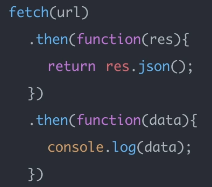

### Metodo `.then()`

El método then() retorna una Promesa. Recibe dos argumentos: funciones callback  para los casos de éxito y fallo de Promise.
Soluciona el primer pedido asincrono.

### Metodo `.catch()`

Permite manipular los errores como querramos.

**Resolvemos la promesa**

El primer `then` será el encargado de recibir un `callback` y retornará la respuesta 
de ese llamado asincrónico en formato `JSON`.

```js
fetch("https://restcountries.eu/rest/v2/")
.then(function(response){
   return response.json();
})
```
**Obtenemos los datos**

Una vez que la respuesta de nuestro pedido está en formato `JSON`, a través de otra promesa, podemos hacer con nuestra respuesta lo que queramos

```js
fetch("https://restcountries.eu/rest/v2/")
.then(function(response){
   return response.json();
})
.then(function(data){
   console.log(data)
})
```
**Atrapamos los errores**

En el caso de haber algún error, el `catch()` se encargará de atraparlo y luego lo imprimirá por consola.

```js
fetch("https://restcountries.eu/rest/v2/")
.then(function(response){
   return response.json();
})
.then(function(data){
   console.log(data)
})
.catch(function(error){
   console.error(error)
})
```


> ### 💡
> Para saber más podemos acceder a la documentación oficial de Fetch haciendo clic en el siguiente link
> <https://developer.mozilla.org/es/docs/Web/API/Fetch_API/Using_Fetch>

## Notas clase

Si lo pongo en una linea el `return` esta implicito

```js
.then( res => {console.log(res));
```

> ### [📌Actividad: Dog API](./Actividades/C17-dog-api.md)


## Try, Catch y Finally <a id='c17e'></a>

> #### 📑
> pdf: TRY - CATCH

**Manejo de errores**

Los errores que se producen en un programa pueden ocurrir debido a nuestros descuidos, una entrada inesperada del usuario, una respuesta errónea del servidor, entre otras razones. 
Por lo general, un script es interrumpido y se detiene cuando esto sucede. Pero podemos evitarlo con try...catch que nos permite “atrapar” errores para que el script pueda funcionar igualmente.

- La declaración `try` permite probar un bloque de código en busca de errores.
- La declaración `catch` permite manejar el error.
- La declaración `throw` permite crear errores personalizados.
- La declaración `finally` permite ejecutar código, después de intentar y capturar, independientemente del resultado.


**Sintaxis**

```js
try {
    //Block of code to try
}
catch(err) {
    //Block of code to handle errors
}
finally {
    //Block of code to be executed regardless of the try / catch result
}
```

### 📜 Ejemplo!


```js
function myFunction() {
    let message, x;
    message = document.getElementById("intro");
    message.innerHTML = "";
    x = document.getElementById("demo").value;
    //Ejecutamos un try con condicionales arrojando(throw) un mensaje:
    try { 
        if(x == "") throw "Contenido vacio";
        if(isNaN(x)) throw "No es un numero";
        x = Number(x);
        if(x > 10) throw "Numero demasiado alto";
        if(x < 5) throw "Numero demasiado bajo";
    }
    //Ejecutamos un catch para manejar el error mostrandolo en el navegador
    catch(err) { 
        message.innerHTML = "Error: " + err + ".";
    }
    //Ejecutamos la accion que termina con la funcion para devolver el valor requerido
    finally { 
        document.getElementById("demo").value = "";
    }
}
```

Tengamos en cuenta que un error puede provenir de valores diferentes:

Nombre de error | Descripción
------- | -------
RangeError | Se ha producido un número "fuera de rango".
ReferenceError | Ha ocurrido una referencia ilegal.
Error de sintaxis | Ha ocurrido un error de sintaxis.
Error de teclado | Ha ocurrido un error de tipo.
URIError | Se ha producido un error en encodeURI().

# C18 - APIs II <a id='c18'></a>

## AJAX Fetch - POST <a id='c18a'></a>

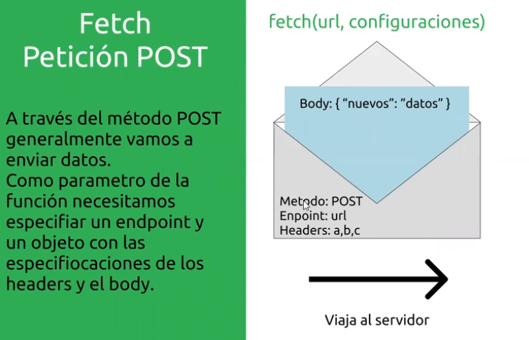


> #### 🎬
> Video: Ajax fetch - POST

Al enviar peticiones por `POST`, fetch tiene un segundo parametro opcional.

Como enviamos datos por POST debemos configurar un objeto literal con los datos necesarios para que la API entienda nuestra peticion, lo que debemos definir en este objeto literal es:

1. Definir el metodo `method` que utilizaremos, en este caso: `POST`
2. El segundo, es el mas importante, el `body` y este tendra el contenido del envio y siempre debera estar en formato `JSON` para esto solemos usar `.stringify(data)`, en este caso data era un objeto literal. 
3. El ultimo atributo es el `headers` o cabeceras, donde por ej podemos definir el tipo de contenido que enviaremos para que pueda ser interpretado por el servidor que reciba la respuesta 


En el codigo podemos orderar el envio de la informacion asi:


1. Armar la informacion que vamos a enviar que sera un objeto literal, donde el esquema de los datos va a depender de la API


2. Despues se arman las settings donde especificamos el metodo, body y headers 
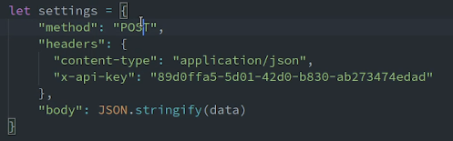

3. Por ultimo llamamos a fetch, solo que como segundo parametro, despues de la url, le mandamos las settings que hicimos en el 2do paso.


## Postman <a id='c18b'></a>

Permite testear una API.

1. creamos coleccion
2. Addrequest = Pedir un recurso
3. Poner url en barra, seleccionar GET como metodo de peticion
4. presionar send


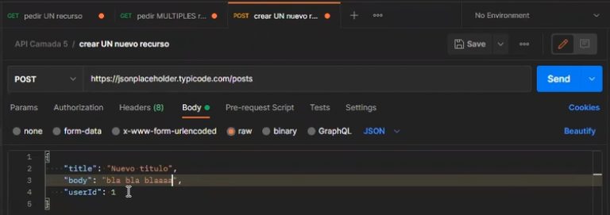


> #### 🎬
> Video: Postman

[Navegacion interactiva en POSTMAN](https://view.genial.ly/6035581287d9bb0d28955205)

### 📜 Ejemplo con `GET`

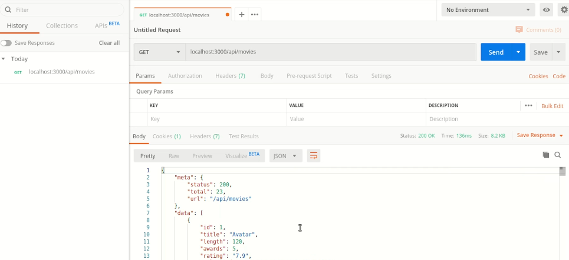

### 📜 Ejemplo con `POST`


> ### [📌Actividad: API practica](./Actividades/C18-api-practica.md)

## [Solved] Actividad mesa:


### 📜 Ejemplo DELETE postman: APP To Do

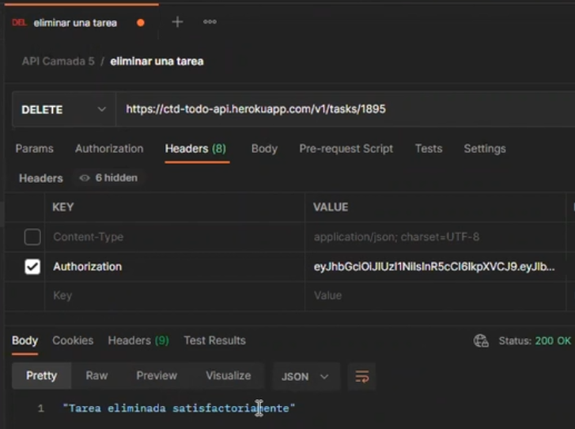

### 📜 Ejemplo PUT en APP To Do


# C19 - To-Do app: docs <a id='c19'></a>

> #### 📑
> pdf: Presentando la API de TODOs
>
> Autenticacion
> CRUD de tareas

> ### [📌Actividad: Proyecto integrador To Do App](./Actividades/c15-proyecto-integrador-to-do-app.md)

# C20 - To-Do App: Workflow

> #### 📑
> pdf: Arquitectura to-do App

Pensemos cada uno de estos recursos que encontramos en el directorio
raíz:

● `assets` → acá nos vamos a encontrar con los recursos gráficos que vamos a estar implementando en nuestra interfaz.

● `scripts` → este directorio almacena toda la lógica de nuestro proyecto, es donde residen todos los scripts correspondientes al comportamiento de las páginas con las que están asociados.

● `styles` → sin mucho para aclarar, todos los estilos de nuestra interfaz separados según su aplicación en todo o partes específicas de proyecto.

● `index.html` → aquí definimos nuestro “entry point”, nuestro punto de partida.
Como sabemos los servidores de manera estándar interpretan al index como la página principal de nuestro sitio. En este caso definimos a lo que sería el “login” como nuestra página principal, la que queremos que se renderize cuando un
usuario accede por primera vez.

● `mis-tareas.html` → esta es nuestra página dedicada a la vista privada de cada usuario que tiene un perfil y comienza a generar tareas en la aplicación.

● `signup.html` → como su nombre en inglés lo indica esta es nuestra página de
registro para aquellos usuarios que quieren crear un perfil por primera vez y
así acceder a nuestro servicio.

A grandes rasgos, esa es la estructura definida para este proyecto, para este caso puntual. Es importante entender esto, ya que no siempre se va a repetir esta arquitectura en todo proyecto de frontend, pero sí podemos decir que intentamos seguir las buenas prácticas como buenos desarrolladores que queremos ser.

## Buenas practicas

> #### 📑
> pdf: Buenas practicas

# C21 - Auth 

Una aplicación web moderna, necesita contar con diferentes tipos de información. En algunos casos, dicha información es pública y puede ser compartida con cualquier persona que acceda a nuestra aplicación. Pero, en otros casos, dicha información se encuentra reservada exclusivamente para una persona o un grupo de personas determinado.

Pensemos, por ejemplo, en la página web de un banco cualquiera. Si accedemos a su página principal, seguramente podremos visualizar cierta información institucional de dicha entidad, así como un listado de los servicios que la misma presta a sus clientes. Esta información, generalmente, es pública y puede ser visualizada por cualquier persona que ingrese al sitio web, independientemente de que dicha persona sea cliente del banco o no.

Ahora bien, ¿qué pasaría si yo quiero visualizar el saldo de la caja de ahorros que tengo abierta en ese banco?; ¿puedo acceder a esa información directamente desde la página principal del banco, o es necesario realizar algún paso adicional?.

Como es de imaginarse, la respuesta a esta pregunta es no. En efecto, para poder consultar el saldo de tu caja de ahorro, en general hace falta que se cumplan un par de requisitos: a) que seas cliente del banco, desde luego; b) que cuentes con un nombre de usuario y contraseña (o token de seguridad), que te permita acceder al Home Banking de la entidad; y c) que cuentes con un paquete que incluya una caja de ahorros.

A esta altura, puede que te preguntes de qué manera este ejemplo se relaciona con el desarrollo de aplicaciones web. Para responder dicha pregunta, debemos introducir los conceptos de Autenticación y Autorización.

La autenticación, como su nombre lo indica, implica verificar la identidad de la persona que accede a una aplicación determinada mediante el uso de sus credenciales. En otras palabras, la autenticación se enfoca en determinar que la persona es quien dice ser. Volviendo al ejemplo anterior, cuando ingresamos el nombre de usuario y contraseña para acceder al Home Banking, estamos autenticándonos. Si los datos ingresados son correctos, podremos acceder; caso contrario, la página nos impedirá el acceso, puesto que no puede verificar que realmente seamos la persona que decimos ser.

Ahora bien, supongamos que nos hemos autenticado correctamente dentro del Home Banking. Una vez allí, deseamos acceder al extracto de nuestra caja de ahorros. Como vimos anteriormente, para poder realizar dicha acción es necesario (además de autenticarnos con nuestras credenciales), contar con un paquete que incluya una caja de ahorros.

Entonces, si contamos con dicho paquete, seguramente encontraremos un botón o link que nos permitirá acceder al extracto. Caso contrario, no podremos acceder a ese recurso ya que no estamos autorizados para ello.

Como podemos ver en el ejemplo anterior, en este caso ya no estamos hablando de verificar si la persona es quien dice ser (ya que nos hemos logueado satisfactoriamente), sino que lo que aquí se esta validando es si la misma se encuentra habilitada para acceder a determinado recurso. Este concepto, se refiere a lo que conocemos como Autorización.

La autorización, entonces, se ocupa de determinar que tipo de acciones puede realizar la persona dentro de la aplicación, validando el acceso a los distintos tipos de recursos disponibles en dicha aplicación.

Si bien ambos conceptos (autenticación y autorización) se enfocan en diferentes momentos y situaciones, generalmente se complementan para generar un sistema de roles y permisos con el objetivo de brindar un adecuado sistema de seguridad para nuestra aplicación. Comprender y aplicar ambos conceptos en forma conjunta, nos permitirá crear aplicaciones web robustas y de calidad.

## JWT - JSON Web Tokens

> #### 📑
> pdf: jwt

Anteriormente, vimos los conceptos de autenticación y autorización, y de qué manera los mismos se complementan para brindarnos un nivel de seguridad adecuado para nuestra aplicación web.

En esta oportunidad, nos centraremos en una de las herramientas más utilizadas al momento de manejar procesos de autorización de usuarios: JSON Web Tokens (JWT).

**¿Qué es un JWT?**

Bueno, en pocas palabras, es un estándar abierto de codificación, utilizado para transmitir información de manera segura entre dos partes. La manera en la que dicha información se transmite es a través de un objeto JSON (seguro recuerdas que vimos como el formato JSON se utilizaba para compartir información entre cliente y servidor), y su particularidad es que lainformación transmitida puede ser verificada ya que el JWT se encuentre firmado digitalmente.
Ahora bien, ¿cómo se compone un JWT?. Básicamente, la estructura más simple de un JWTconsta de tres partes: Header, Payload y Signature

Ejemplo:

xxxxx.yyyyy.zzzzz

Veamos rápidamente cada una de dichas partes:

## Header

Esta parte, contiene la información respecto del tipo de token (JWT), y el algoritmo de encriptación utilizado. Su estructura es la siguiente:

```
{
"alg": "HS256",
"typ": "JWT"
}
```

## Payload 

Es la parte más relevante desde el punto de vista de la autorización, ya que
aquí se encontrará la información del usuario pudiendo incluir, por ejemplo, el rol que dicho usuario tiene dentro de la aplicación:

```
{
"sub": "1234567890",
"name": "John Doe",
"admin": true
}
```

## Firma: 

Es la parte que garantiza la autenticidad de la información incluida en el JWT,
permitiendo su verificación.
Hasta aquí, vimos cómo se compone un JWT. Ahora, es momento de preguntarnos de qué manera podemos utilizar el mismo dentro del proceso de autorización que vimos
anteriormente.
En líneas generales, cuando una persona inicia sesión en una aplicación determinada, el servidor verifica las credenciales ingresadas (nombre de usuario y contraseña). Si los mismos son correctos, el servidor autentica al usuario dentro de la aplicación, y envía un JWT como respuesta a la petición.
Dicho JWT, es entonces almacenado del lado del cliente, y enviado al servidor en cada nueva petición que se realice para acceder a un determinado servicio dentro de la aplicación. Ya que, como vimos más arriba, el token contiene la información del usuario (por ejemplo, su rol), el servidor puede acceder a dicha información al recibir la petición, y validar con ello si el usuario se encuentra autorizado a realizarla. Si esto es así, el servidor procesará el pedido y enviará la respuesta correspondiente. Caso contrario, se devolverá un error indicado que la persona no se encuentra autorizada.
En resumen, JWT es una herramienta de gran utilidad para la comunicación entre cliente y servidor, ya que nos permite compartir información del usuario de manera segura y eficaz, y acceder a dicha información para validar los roles y permisos de cada persona que accede a nuestra aplicación.

> ### 💡
> Si quieres profundizar sobre este tema, te dejamos el link a la documentación oficial de JWT: <https://jwt.io/#debugger-io>