<t>Infraestructura I</t>

## Índice

1. Inmersion

- [C1 - Introducción a la materia & the big picture](#c1)
  - [Bienvenida](#c1a)
  - [Introducción a la materia](#c1b)
  - [El centro de computadoras](#c1c)
  - [The big picture](#c1d)

2. Automatizacion

- [C2 - Automatizacion](#c2)
  - [Automatizacion de la intraestructura](#c2a)
    - [5 Tareas mas comunes de automatizar](#c2a1)
    - [Configuracion y mantenimiento del sistema](#c2a2)
    - [Infraestructura y servicios](#c2a3)
    - [Manejo del codigo](#c2a4)
    - [Contenedores](#c2a5)
    - [Ambientes de trabajo](#c2a6)
    - [Monitores de red](#c2a7)
    - [Lenguajes de scripting](#c2a8)
  - [Virtualizacion](#c2b)
    - [Historia virtualizacion](#c2b1)
    - [Componentes virtualizacion](#c2b2)
    - [Instalacion VM Debian, Apache2, OpenSSH, puTTy](#c2s1)
- [C3 - Repaso](#c3s1)
  - [Vagrant: box Debian](#c3s1)
  - [Automatizar: modificando file de vagrant](#c3s2)
  - [Cambiar HTML base modificando file vagrant](#c3s3)
- [C4 - Shell Scripting - Parte I](#c4)
  - [Introducción a la terminal de Linux](#c4a)
    - [La consola de Linux](#c4a1)
    - [Tipos de shell](#c4a2)
      - [Bourne Shell](#c4a2a)
      - [C/TC Shell](#c4a2b)
      - [Korn Shell](#c4a2c)
      - [Bourne-Again Shell (BASH)](#c4a2d)
    - [Ejecucion de la consola](#c4a3)
    - [Elevacion de privilegios](#c4a4)
  - [Comandos más utilizados en la terminal de Linux](#c4b)
    - [Consolidando nuestro ambiente](#c4b1)
    - [Verificando nuestro ambiente](#c4b2)
    - [Comandos para el manejo de archivos](#c4b3)
    - [Comandos para leer archivos de texto](#c4b4)
    - [Obtener datos desde un web service](#c4b5)
    - [Comando cURL](#c4b6)
    - [Comando jq](#c4b7)
    - [Combinación de uso de ambos comandos](#c5b8)
  - [Clase en vivo 4](#c4s)
    - [Listar servicios del sistema](#c4s1)
    - [Analizando los datos que van y vienen](#c4s2)
- [C5 - Shell Scripting - Parte II](#c5)
  - [Scripting](#c5a)
  - [Bash scripting](#c5b)
    - [Estructuras de control](#c5b1)
      - [Sentencia if-then](#c5b1a)
      - [Sentencia if-else](#c5b1b)
      - [Comparaciones numéricas](#c5b1c)
      - [Comparaciones de cadenas](#c5b1d)
      - [Cálculos matemáticos](#c5b1e)
    - [Ejemplo en Bash](#c5b2)
  - [Notas clase 5](#c5s)
- [C6 - Repaso](#c6s)
  - [Notas clase 6](#c6s1)
- [C7 - PowerShell](#c7)
  - [Introduccion a PowerShell](#c7a)
    - [Diferencias entre PowerShell y PowerShell Core](#c7a1)
    - [Usos comunes de PowerShell](#c7a2)
    - [Comandos cmdlet](#c7a3)
    - [Ejemplo uso comandos cmdlet](#c7a4)
  - [Kit de supervivencia de PowerShell](#c7b)
    - [módulos de PowerShell](#c7b1)
  - [Notas clase 7](#c7s)
- [C8 - Python](#c8)
  - [Introduccion a Python](#c8a)
    - [Importancia de python en infraestructura](#c8a1)
    - [Pros y contras de Python](#c8a2)
  - [Nos ponemos a practicar](#c8b)
    - [Variables](#c8b1)
    - [Tipos de variables](#c8b2)
    - [Indentación (sangría)](#c8b3)
    - [if en Python](#c8b4)
    - [Condiciones en Python](#c8b5)
    - [Bucles while y for](#c8b6)
    - [Ejemplos estructuras de control](#c8b7)
    - [instrucciones de selección](#c8b8)
    - [estructuras de selección](#c8b9)
  - [Notas clase 8](#c8s)
- [C10 - Configuration Management](#c10)
  - [Change management](#c10a)
  - [Configuration management](#c10a1)
  - [Change management + Configuration management](#c10a2)
  - [Configuration management tradicional](#c10a3)
  - [Etapa de construcción de un servidor](#c10a4)
  - [Etapa de ejecución de un servidor](#c10a5)
  - [Problemáticas: Configuration management + Change management, ¿es practicable?](#c10a6)
  - [¿Mascotas vs. Ganado?](#c10a7)
  - [¡Configuration as Code al rescate!](#c10a8)
  - [Los desafíos de adoptar Configuration as Code](#c10a9)
  - [Herramientas de configuration management](#c10a10)
    - [Chef](#c10a10a)
    - [Puppet](#c10a10b)
    - [PowerShell DSC](#c10a10c)
    - [Ansible](#c10a10d)
  - [Notas clase 10](#c10s)
- [C11 - Configuration Management - Ansible](#c11)
  - [Conociendo Ansible](#c11a)
    - [Idempotencia](#c11a1)
    - [Arquitectura](#c11a2)
    - [Inventario](#c11a3)
      - [Ejemplo de un inventario](#c11a4)
    - [Playbooks](#c11a5)
      - [Ejemplo de un playbook](#c11a6)
    - [Módulos](#c11a7)
      - [Ejemplo de un modulo](#c11a8)
    - [La herencia en python](#c11a9)
    - [Los casos de uso de Ansible](#c11a10)
    - [Configuration management con Ansible](#c11a11)
  - [Ansible en accion](#c11b)
    - [Configuración de IP en MV](#c11b2)
- [C12 - Primer parcial](#c12)

3. Containers

- [C13 - Docker en profundidad](#c13)
  - [Plataforma de Docker](#c13b)
  - [Containers y entornos](#c13a)
  - [Maquina virtual vs Contenedores](#c13c)
- [C14 - El ecosistema de Docker y mejores practicas](#c14)
  - [Creación de una imagen](#c14a)
  - [Las redes de Docker > bridge driver > Resolución de nombres](#c14b)
  - [Mejores practicas en Docker](#c14c)

4. Cloud computing
5. Cierre

# C1 - Introducción a la materia & the big picture <a id='c1'></a>

[Modulos infraestructura](https://view.genial.ly/61263a284987a50dae61ca14) <a id='c1a'></a>

---

## Introducción a la materia <a id='c1b'></a>

En la actualidad, la actividad cotidiana depende en un porcentaje elevado del correcto funcionamiento de los sistemas informáticos —y saber operar con dichos sistemas—. La dependencia del ámbito productivo con los complicados sistemas informáticos es tal, que un problema en una terminal de trabajo deja prácticamente sin efecto la capacidad operativa de cualquier usuario. Ante situaciones de esta naturaleza —considerando la complejidad de las actuales plataformas tecnológicas y la multiplicidad de usuarios con diversos niveles de acceso y experticia—, se hace necesaria la presencia de un profesional confiable que intervenga, rápida y eficazmente, con habilidades y destrezas mayores a las del operador habitual.

La función de este profesional —conocido como administrador de infraestructura— es brindar respuestas a los problemas habituales de hardware y software en cualquier ámbito informatizado, planteándose desde una problemática y evaluando su mejor solución. Este servicio debe estar en manos de profesionales que orienten, configuren, prevengan y resuelvan eventualidades, manteniendo sus equipos en un estado óptimo. Además, el administrador de infraestructura debe ser capaz de prestar servicios de administración y soporte de sistemas de base y elementos de infraestructura para el procesamiento de aplicaciones informáticas, tales como servidores, dispositivos de almacenamiento masivo, otros dispositivos de hardware, sistemas operativos, máquinas virtuales y administradores de redes, servicios de comunicaciones a través de redes públicas y privadas, dispositivos de switching, firewalls, motores de bases de datos, entre otros. Podrá además brindar servicios de administración de la infraestructura tecnológica en la cual opera el software de estas aplicaciones interviniendo en forma puntual para resolver los problemas que experimente esa infraestructura o su eficiencia operativa y realizar un diagnóstico de incidentes que se presenten en la operatoria habitual del sistema.

La intención es contribuir con soluciones concretas a la problemática del soporte de infraestructura IT que se presentan en la casi totalidad de las instituciones públicas y/o privadas, acelerando los tiempos en materia de formación de recursos humanos capacitados y demandados por todas aquellas organizaciones que cuentan con una infraestructura IT.

## ¿Qué es infraestructura de IT?

La infraestructura de tecnología de la información, o infraestructura de IT, se refiere a los componentes combinados necesarios para el funcionamiento y la gestión de los servicios de IT de la empresa y los entornos de IT.

## ¿Quién hace infraestructura?

Estudiar una carrera profesional no consiste solamente en los años que le vas a dedicar a terminar tus estudios. Después de obtener tu título te espera un largo camino de crecimiento profesional y, si bien muchas veces tenemos una idea de las opciones profesionales que existen, a veces tenemos nociones erradas o no hemos explorado correctamente todas las posibilidades que hay disponibles. Por eso, a lo largo de la carrera te compartiremos las opciones en el campo laboral que tienen todos aquellos que decidan ser profesionales de sistemas.

Es evidente que estamos en una era en la que casi cualquier tipo de tarea es mediada por un computador. Por eso, el conocimiento de un profesional de sistemas es necesario en sectores tan diversos como, por ejemplo, el entretenimiento o el mundo empresarial. A través de esta materia adquirirán conocimientos aplicables a las tareas que deben desarrollar en cualquier sector de IT.

## ¿Cuál es el perfil de un analista de infraestructura?

Las funciones que ejerce un analista de infraestructura, entre otras, son:

- Administrar servidores, software de base, comunicaciones y demás subsistemas, maximizando el aprovechamiento de los recursos y anticipando posibles eventualidades.
- Administrar redes de comunicación de datos (cableadas o no), asegurando la accesibilidad de los servicios y optimizando los recursos.
- Atender incidentes que afecten al soporte de infraestructura de IT, diagnosticar las causas que los originan y resolverlos o coordinar su solución.
- Instalar o reemplazar componentes de soporte de infraestructura de IT o adaptarla a nuevas condiciones de servicios externos minimizando riesgos para la seguridad y continuidad del servicio.
- Migrar o convertir sistemas, aplicaciones o datos tratando de minimizar riesgos para la seguridad y continuidad del servicio.
- Entender temas de contingencias y riesgos que puedan afectar al soporte de infraestructura de IT.
- Generar propuestas innovadoras y/o emprendimientos productivos propios del ámbito de la gestión de soporte de infraestructura de IT.

Esta persona se desempeña en centros de procesamiento de datos, ya sean de empresas u organizaciones de cualquier tipo usuarias de tecnología de la información. Su posición ocupacional suele denominarse administrador de red o administrador de sistemas, y trabaja solo o en pequeños grupos para administrar los recursos de infraestructura de tecnología de la información y atender y resolver incidentes, a fin de minimizar la posibilidad de interrupciones al servicio que brindan las aplicaciones informáticas a las organizaciones.

Por lo general, depende directa o indirectamente de un gerente de tecnología responsable por toda la operación y —en función de la dimensión de la organización en la cual se desempeñe— puede trabajar solo, en pequeños grupos o en grupos más grandes que permitan su especialización en determinadas tecnologías. En la mayoría de los casos, no tiene personal a cargo, aunque puede coordinar las actividades de pequeños grupos operativos. En algunos casos en que la infraestructura es muy pequeña puede brindarle sus servicios profesionales externamente atendiendo a los centros de procesamiento en forma presencial o a distancia.

## ¿Por qué es tan importante la infraestructura de IT?

La tecnología es el motor de prácticamente todos los aspectos de las empresas actuales. Desde el trabajo de un empleado individual hasta las operaciones de bienes y servicios. Si se conecta correctamente, la tecnología se puede optimizar para mejorar la comunicación, crear eficiencia y aumentar la productividad.

Si una infraestructura de IT es flexible, fiable y segura, puede ayudar a una empresa a cumplir sus objetivos y a ofrecer una ventaja competitiva en el mercado. De forma alternativa, si una infraestructura de IT no se implementa correctamente, las empresas pueden afrontar problemas de conectividad, productividad y seguridad, como infracciones e interrupciones del sistema. En general, contar con una infraestructura correctamente implementada puede ser un factor clave para la rentabilidad de un negocio.

Con una infraestructura de IT, una empresa puede:

- Ofrecer una experiencia del cliente positiva proporcionando acceso ininterrumpido a su sitio web y la tienda en línea.
- Desarrollar y lanzar soluciones al mercado con rapidez.
- Recopilar datos en tiempo real para tomar decisiones rápidas.
- Mejorar la productividad de los empleados.

---

## Arquitectura cliente-servidor <a id='c1c'></a>

La arquitectura cliente-servidor persigue el objetivo de procesar la información de un modo distribuido. De esta forma, pueden estar dispersos en distintos lugares y acceder a recursos compartidos.

Además de la transparencia y la independencia del hardware y del software, una implementación cliente-servidor debe tener las siguientes características:

- Utilizar protocolos _asimétricos_, donde el servidor se limita a escuchar en espera de que un cliente inicie una solicitud.
- El acceso es transparente, multiplataforma y multiarquitectura.
- Se facilitará la _escalabilidad_, de manera que sea fácil añadir nuevos clientes a la infraestructura —escalabilidad horizontal— o aumentar la potencia del servidor o servidores, aumentando su número o su capacidad de cálculo —escalabilidad vertical—.

Ahora veamos las características de los tres componentes de la arquitectura cliente-servidor.

[Arquitectura cliente-servidor](https://view.genial.ly/609fd90a72150f0d1205fa78)

> Ver video: La importancia del centro de datos

<!-- Resumen video -->

dentro de los middleware estan:

## DBMS

Sistema de administracion de base de datos que permiten:

- crear
- Recuperar
- Actualizar
- Administrar datos

## APIs

Interfaz de programacion de aplicaciones que brindan un conjunto de subrutinas funciones y procedimientos para ser utilizados en otro software

## Sistema operativo

El motor que va a aprovechar los recursos de la infraestructura,
conjunto de programas capaz de administrar los recursos fisicos del servidor
asi como los protocolos de ejecucion de otro software

<!-- fin resumen -->

[Caracteristicas fundamentales de un sistema operativo](https://view.genial.ly/60a81847f631260d39c063ca)

### Soporte de red

Es indispensable que tengan un soporte completo para poder brindar conectividad.

### Amplia compatibilidad con el hardware

Un punto fundamental para el aprovechamiento pleno de las características del servidor es que el S.O. <r>sea capaz de exprimir al máximo las características técnicas del hardware</r> en donde se ejecuta, es por ello que <r>se debe priorizar el uso de S.O. actualizados y con un soporte importante de controladores</r>.
Por ejemplo, que nuestros controladores permitan acceder a características avanzadas de gestión de discos rígidos, con el propósito de realizar arreglos redundantes para tener mayor velocidad y tolerancia a fallos.

### Seguridad

Teniendo en cuenta el rol que cumple el servidor, es de vital importancia que <r>el S.O. instalado sea seguro</r>; eso implica <r>no solo que este actualizado con todos los parches/actualizaciones, sino que además debe tener aplicadas políticas estrictas de acceso</r> para prevenir accesos no autorizados o ataques.

Adicionalmente esa seguridad <r>debe reforzarse con la instalación de Firewalls (por software o hardware) y antivirus</r>.

En este ítem también debemos incluir <r>el respaldo de la información</r>, ya sea por medio de herramientas que el propio S.O. nos ofrezca o instalando software externo, con el propósito de tener la menor pérdida de datos posible en caso de fallos fatales.

### Dispositivos físicos de protección

Debemos priorizar S.O. que en su arquitectura <r>permita una tolerancia a fallos</r>, ya sea mediante la generación de granja de servidores, que interconectados, operen como una gran unidad de proceso, dando la posibilidad <r>que ante la caída de uno de los integrantes de la granja, otro puede tomar su rol y responsabilidad</r>.

<!-- fin link -->

Conocidas estas características casi innegociables a la hora de elegir un S.O. para servidores, es común preguntarnos por qué se utilizan sistemas operativos y versiones específicas para el entorno de servidores y no usamos los mismos S.O. que tenemos instalados habitualmente en nuestras computadoras o estaciones de trabajo; eso se basa en algunas diferencias, a destacar:

### Manejo diferente del hardware:

Debido al diferente propósito, <r>los S.O. de estaciones de trabajo no pueden aprovechar todo el hardware disponible</r>, como, por ejemplo, el manejo de memoria RAM —teniendo el caso de Windows 10 64-bit que puede manejar 6TB de RAM, mientras que Windows Server 2019 alcanza los 24TB—.

### Características soportadas:

Hay funcionalidades que nativamente un S.O. de estación de trabajo no es capaz de brindar, ya que en su versión de kernel están limitadas o deshabilitadas —casos tales como la virtualización en algunas versiones de Windows 10—.

### Soporte:

Algo muy importante a tener en cuenta es, cuando nuestro negocio o aplicación depende de un S.O., es el <r>soporte por parte del fabricante/desarrollador</r>. En el caso de los S.O. de estación de trabajo, el soporte/cobertura que tenemos es para un uso específico, <r>si sobre esa base quisiéramos desplegar una arquitectura, por ejemplo, de servidor web, si bien es probable que nos funcione, vamos a carecer de soporte técnico</r> ya que el fabricante nos indicará que para ese propósito esta la version “Server” del producto.

Ya entrando en el terreno de las opciones disponibles para un S.O. de servidor, nos vamos a encontrar con dos opciones predominantes en el mercado:


En el grupo de los UNIX (o UNIX-like) tenemos a:

- GNU Linux
- FreeBSD
- macOsServer

En el grupo de Windows, integrado por toda la familia de Windows Server, tenemos las versiones que van desde la versión 2003 a 2019.

En el transcurso de la cursada nos vamos a centrar en GNU Linux y Windows, ya que son las opciones más utilizadas; iremos conociendo algunas características que ofrecen, como así también sus diferencias.

[juego unir conceptos](https://view.genial.ly/612678272e794b0d1e71472d)


---

## ¿Querés saber todo lo que vas a aprender en esta materia? <a id='c1d'></a>

Los profesores te van a dar la bienvenida a esta gran aventura. Comenzarán explicándote cómo se compone y funciona un centro de cómputos. De esta manera, te abrimos la ventana al mundo de la infraestructura.

Te vamos a dar una visión teórica sobre el paradigma cliente-servidor y te vamos a llevar de viaje desde la PC de un cliente hacia el data center. Vas a aprender acerca de sistemas operativos en el contexto del data center. A saber la diferencia entre los distintos sistemas operativos que existen en el mercado. Y, como si fuera poco, vas a saber sobre los usos y servicios que se les pueden dar.

Seguiremos con la historia de la virtualización, analizando las capas de servicios con sus funcionalidades y, sobre todo, sabrán de los beneficios de esta tecnología. Te sumergiremos en el mundo de las redes mostrándote el modelo OSI, descubriendo sus protocolos y te llevaremos de viaje con un paquete de una estación de trabajo a otra. Vas a entender el famoso chiste del que hablan los informáticos sobre capa 8. Te mostraremos el mundo de los procesos ITIL: service request management, incident management, problem management y change management; por si llegás a tener que ver algún caso en una herramienta de tickets en tu carrera, vas a saber y poder diferenciarlos.

Además, te introduciremos en el maravilloso mundo de la criptografía. Vas a ver cómo puede ser utilizada para autenticar partes, principalmente, en el contexto de SSH y HTTPS. Aprenderás los comandos básicos para el copiado, borrado y creación de archivos y directorios. También te explicaremos los comandos básicos para la obtención de datos desde un web service y posterior proceso.

Estudiarás qué es el pipeline en la consola y te explicaremos Bash como lenguaje de scripting.

Luego, vamos a pasar por PowerShell, otro lenguaje de automation muy utilizado en las empresas hoy en día. Vas a saber cómo instalar, abrir y ejecutar comandos en una consola y los distintos módulos que existen que te van a ayudar a simplificar muchos futuros scripts.

Para que no te quedes afuera de los lenguajes de scripting, vas a ver también Python, uno de los más reconocidos hoy en día. Te vamos a dar una perspectiva de para qué es y para qué sirve y vas a poder reconocer las aplicaciones —que tanto usás en el día a día— que fueron creadas en ese lenguaje.

Seguimos el camino de esta carrera mostrándote configuration management y Ansible. A esta altura vas a usar el emoji con los anteojitos de sol o los de lectura, el que te guste más.

Continuaremos con una tecnología que nos encanta (y a vos seguro también): Docker. Recorreremos todos los productos de esta simpática ballenita y vamos a ver todos sus usos y mejores prácticas.

Terminaremos este viaje que es Infraestructura I mostrándote todo lo relacionado a cloud computing. Analizaremos los modelos de responsabilidad y vas a poder diferenciar los modelos IaaS, PaaS y SaaS. Conocerás modelos como nube híbrida y serverless. Te mostraremos diferentes nubes: Azure, Google y AWS. Practicarás con AWS Educate y armaremos un pequeño ambiente.

Del otro lado somos un equipo que armamos con mucha pasión todo el contenido de esta materia, con los requerimientos que el programa pide y de lo que nos hubiese gustado aprender a nosotros en el paso que ahora están haciendo. Te agradecemos enormemente tu tiempo y esperamos que nuestro aporte te sea de mucha utilidad en tu carrera. ¿Comenzamos?

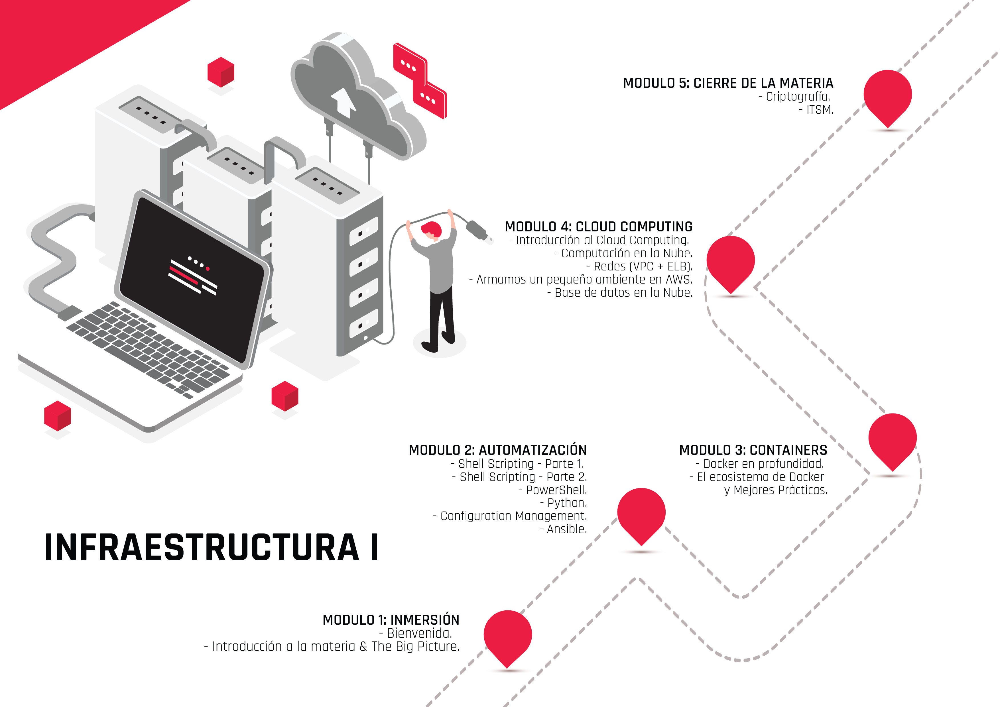

---


# C2 - Automatización <a id='c2'></a>

## Automatización de la infraestructura <a id='c2a'></a>

Habitualmente resulta cansador realizar las mismas tareas rutinarias en el área de sistemas. ¿Por qué mejor no automatizamos la infraestructura? Es decir, que esa tarea la realice un sistema sin errores y más eficientemente. En esta clase vas a conocer cómo implementar la automatización en infraestructura.

> Ver PDF: Automatización de la infraestructura..pdf

<!-- inicio resumen pdf -->

**Automatización de la infraestructura**

Como vimos anteriormente, <r>la Infraestructura IT es el conjunto de dispositivos y aplicaciones de software necesarios para que cualquier empresa opere.</r> Esta se compone de elementos como:

- software,
- hardware,
- redes,
- instalaciones
- y todo lo que se requiera para desarrollar, controlar, monitorear y dar soporte a los servicios que ofrece el departamento de IT.
  Por otro lado, <r>la automatización consiste en usar la tecnología para realizar tareas casi sin necesidad de las personas.</r> Se puede implementar en cualquier sector en el que se lleven a cabo tareas repetitivas.

La automatización de la IT —también denominada automatización de la infraestructura— <r>**consiste en el uso de sistemas de software para crear instrucciones y procesos repetibles a fin de reemplazar o reducir la interacción humana con los sistemas de IT.**</r>

## ¿Por qué automatizar?

Automatizar tareas permite ganar tiempo y maximizar la productividad de nuestra infraestructura IT. En tiempos de **cloud computing**, este es el mensaje que se repite una y otra vez: <r>cómo hacer más con menos</r>, cómo conseguir que los profesionales IT de nuestra empresa dediquen más tiempo a generar valor para la compañía y menos a tareas repetitivas que se podrían realizar de forma automática.

## Beneficios de automatizar

- Elevar la productividad empresarial.
- Reducir costos operativos.
- Tener una mejor capacidad de respuesta.
- Facilidad de adaptación.
- Disminuir los riesgos de fallas.
- Elevar la seguridad de la información.
- Alojar una mayor cantidad de datos.
- Elevar la competitividad del negocio.

<!-- fin resumen pdf -->

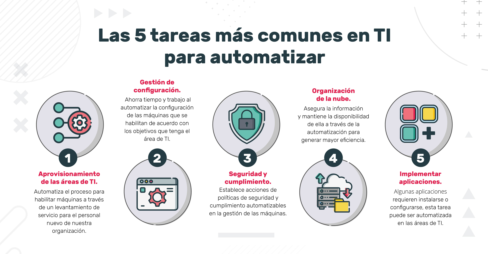 <a id='c2a1'></a>

> Ver PDF: Configuración y Mantenimiento del sistema.pdf

<!-- inicio resumen -->

## Configuración y mantenimiento del sistema <a id='c2a2'></a>

Retomando el concepto que vimos:

> “La automatización de la infraestructura consiste en el uso de sistemas de software para crear instrucciones y procesos repetibles a fin de reemplazar o reducir la interacción humana con los sistemas de TI”.

Este plantea una visión muy amplia, ya que tiene que abarcar los diversos rubros de las empresas que poseen su área de sistema. Según el tipo de organización en la que trabajamos, es el grado de automatización con el que nos vamos a encontrar en la infraestructura de TI.
Uno de los roles del equipo de trabajo del área de sistemas es el **DevOps** engineer, encargado de **automatizar** los procesos del área de **Development** y **Operations**. Su función es hacer más amigable y eficiente la relación entre estos dos equipos de trabajo.


## Infraestructura y servicios <a id='c2a3'></a>

Primeramente tenemos que analizar los dispositivos que tenemos en nuestra red de IT. Si contamos con servidores **`legacy`** o servicios contratados por un **`cloud providers`**.
De las dos opciones anteriores, lo que tenemos que tener en cuenta es el sistema operativo con el que trabajan (MAC, Linux, Windows).

De los cloud providers más conocidos contamos con:

- AWS
- Google Cloud
- Microsoft Azure


Para la elección se evalúan los costos y la oferta de **servicios que disponen**. Esta última es cada vez más robusta y completa (load balancing, backup, clustering, security, etc.).

## Manejo del código <a id='c2a4'></a>

Partimos desde donde alojamos nuestro código de trabajo si somos programadores.
Por excelencia el gestor de versionado e integrador de código más utilizado es **Git**.
Los alojamientos de estos repositorios más conocidos en la nube son GitLab, GitHub, Bitbucket, Gitea, entre otros.
En estos se almacena nuestro código de las aplicaciones que
pueden estar en lenguajes de programación diversos según lo que necesitemos —por ejemplo: Python, JavaScript, Java, .NET, etc.—.
También podemos automatizar el deploy de nuestro código con CI/CD (refiere a las prácticas combinadas de integración continua y entrega continua).

Algunas herramientas para hacerlo son:

- Jenkins
- GitActions
- JetBrains

## Contenedores <a id='c2a5'></a>

Los contenedores se están convirtiendo en el modelo de empaquetado de software del producto que desarrollamos. <r>Permiten la virtualización de ambientes de trabajo compatibles transportables, totalmente configurados para que nuestro código funcione en todos los equipos.</r> El más popular es **Docker**.

Cuando manejamos muchos contenedores, tenemos que migrar a un clúster de
contenedores, dirigidos por los orquestadores de contenedores. Por ejemplo:
Kubernetes o Docker Swarm.

## Ambientes de trabajo <a id='c2a6'></a>

Luego, hay que tener en cuenta en qué ambiente está nuestro cluster.

En cada ambiente se trabaja con distintas tecnologías, según el grado de exposición del producto. Automatizando estos procesos vamos a tener más eficiencia, transparencia, facilidad de replicación y recuperación.

Los ambientes más populares son:

- Ansible
- Chef
- Puppet
- Terraform

## Monitores de red <a id='c2a7'></a>

Es muy importante tener la supervisión de los dispositivos que hay en nuestra red y de los servicios, y programar alertas en caso de que suceda algún cambio.

Para esto podemos utilizar:

- Nagios,
- Prometheus,
- Icinga2 o
- DataDog.

## Lenguajes de scripting <a id='c2a8'></a>

Necesitamos trabajar en estrecha colaboración con los desarrolladores y el administrador del sistema para automatizar tareas de los operadores y desarrolladores (como pueden ser
backups, cron jobs, system monitoring).

Según el sistema operativo, podemos usar:

- Bash o
- PowerShell.

Pero también existen lenguajes de scripting independientes del SO, como:

- Python,
- Ruby o
- Go.
  El más popular es `Python`, ya que posee muchas librerías y es de fácil lectura y aprendizaje.

**Conclusión**

Estas tecnologías expuestas para automatizar la infraestructura TI no son todas las que están en el mercado, sino una visión general de las que hoy son las más populares. Hay que tener en cuenta que cada día se están desarrollando nuevas herramientas y metodologías de trabajo para cada empresa, como también empresas que brindan el servicio de automatización outsourcing de la organización.
<r>Siempre hay que tomar la decisión basándose en la necesidad, recursos disponibles y experiencia que cuenta la empresa.</r>

<!-- fin resumen pdf -->

## Virtualización <a id='c2b'></a>

¿Cómo viene todo hasta acá? Ahora vamos a refrescar algunos conocimientos que ya vimos en Introducción a la Informática, principalmente la virtualización, dado que es una de las formas de automatización más utilizadas en la infraestructura IT.

## Introducción a la virtualización

La **virtualización** permite mejorar la agilidad, la flexibilidad y la escalabilidad de la infraestructura de IT, al mismo tiempo que proporciona un importante ahorro de costos.

Algunas **ventajas** de la virtualización son:

- Mayor movilidad de las cargas de trabajo.
- Aumento del rendimiento.
- Menos esfuerzo en los upgrades/updates del sistema.
- Mejor disponibilidad de los recursos o la automatización de las operaciones:
- Simplifican la gestión de la infraestructura de IT.
- Permiten reducir los costos de propiedad y operativos.

A continuación, encontrarás la historia de la virtualización y sus componentes.

## Historia de la virtualización <a id='c2b1'></a>

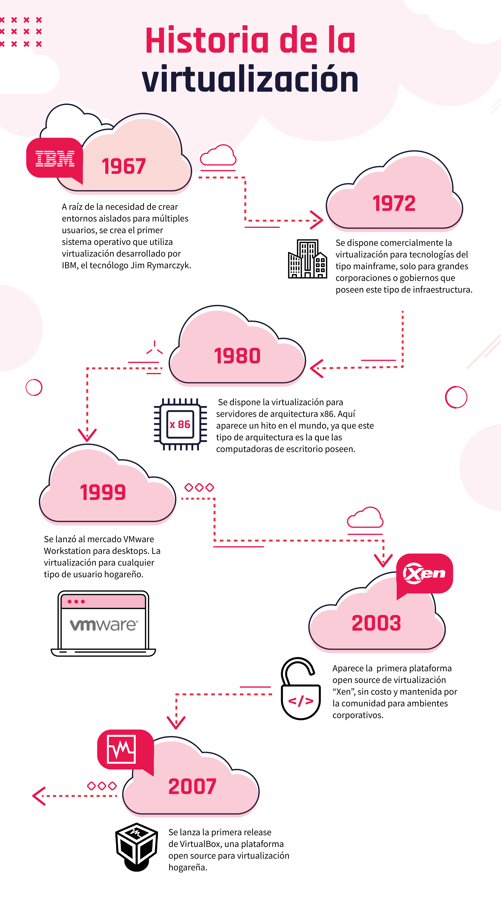

## Componentes de la virtualización <a id='c2b2'></a>

[Componentes](https://view.genial.ly/60a95ee45e2a3d0d271c0bbd)


**Maquinas virtuales**

En la actualidad se pueden crear sistemas operativos guest del tipo Microsoft y Linux en casi todas sus versiones, se deben tener en cuenta las versiones de cada sistema operativo y la compatibilidad con el sistema host.

**Administrador de maquinas virtuales**

Desde la herramienta de management se administran todos los recursos físicos y virtuales de los guest que son las instancias virtuales que se crean para usos específicos. Desde el mismo management podremos establecer clustering con otros virtual machines manager para tener alta disponibilidad y tolerancia a fallos. Además, administra todos los recursos virtuales de nuestras virtual machines.

**Sistema operativo base**

Es el sistema operativo encargado de administrar los dispositivos físicos (hardware) y proveer una capa de abstracción a los entornos virtuales.

**Hardware (Servidores fisicos)**

Los microprocesadores, tanto los de Intel como los de AMD, tienen una característica llamada virtualización de CPU. Se aplica a servidores o máquinas de escritorio.

> Ver pdf: Instalacion virtual box y vagrant
>
> Ver actividad: crear mv

<!-- actividad sincronica -->

### actividad sincronica

para pasar a root

```bash
su -
```

- **APT** es un proyecto gigante y su plan original incluia una interfaz gráfica. Está basado en una biblioteca que contiene la aplicación central y apt-get fue la primera interfaz — basada en la línea de órdenes — desarrollada dentro del proyecto. apt es un segundo frontend de linea de comandos proporcionado por APT el cual soluciona algunos errores de diseño de la orden apt-get.

- **Su** El programa su permite usar el intérprete de comandos de otro usuario sin necesidad de cerrar la sesión actual. Comúnmente se usa para obtener permisos de root para operaciones administrativas sin tener que salir y reentrar al sistema.

- El servidor HTTP Apache es un servidor web que ofrece muchas y potentes funciones. Entre ellas se incluyen módulos que cargan de forma dinámica, soporte de medios robusto y una amplia integración con otro software popular.

- Me resolto familiar, como un escritorio remoto

<!-- fin actividad sincronica -->

---

<!-- inicio notas clase 2 en vivo -->

**Notas - Clase 2: Virtualización**

<!-- inicio notas sincronico 2 -->

Uso de virtualización para testeo y aprovechar recursos de hardware.
Saber el comportamiento de una aplicacion en un sistema operativo.
Al hacer un servidor quiza sirva virtualizarlo, aprovechando los recursos de hardware de esa forma.

recomendado estar con red cableada para la instalacion de `Debian` la version mas comun es AMD64

servidores Legacy se refiere a los servidores fisicos.

## Instalacion VM Debian, Apache2, OpenSSH, puTTy <a id='c2s1'></a>

> ver instalacion vm Debian en min 09:00
>
> Ver PDF: Crear una VM
>
> Link video: habilitar virtualización [link](https://www.youtube.com/watch?v=oTMMc9KWtco)

instalamos la vm en oracle vm, para administrar un servidor sin un entorno grafico

GRUB es un gestor de arranque que se instala en el disco, antes de la particion donde teniendo ese GRUB podemos tener varias instalaciones en el mismo disco de distintos sistemas operativos

vamos a instalar un servidor web y lo vamos a consultar desde nuestra maquina host. Vamos a ver la pagina web que esta alojada en este servidor que estamos haciendo

Terminada la instalacion y configuracion de nuestra maquina cirtual Debian:

```
login: nombre
clase: clave
```

Procedemos a instalar el servidor web apache, el mas conocido en linux, mas antiguo y open source

cambiamos el login a root para realizar cambios de administrador

```bash
su root
```

instalamos apache2

```
apt-get install apache2
```

pide un S para continuar y bajara unos archivos e instalara el servidor web

verificamos que el servidor este andando en la computadora con:

```
ip address
```

ip address muestra los dispositivos de red que tenemos en nuestra maquina virtual


muestra 2 dispositivos, el primero es `lo` hace referencia al `local host` siempre es `127.0.0.1`, no la tenemos que usar ya que hace referencia a su misma placa de red.

la que tenemos que ver es la 2 `enp0s3`: `192.168.1.25` que la direccion que tiene esta en el mismo rango que la direccion ip de la maquina host.

Verificamos esto fuera de nuestra maquina virtual, en nuestra maquina host

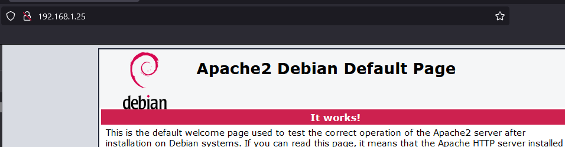

Ahora instalaremos un servidor SSH, desde el root, este servidor nos da una puerta de entrada a nuestra maquina virtual desde afuera, desde este protocolo ssh. (Como un team viewer para terminales, con esto s ehace mantenimiento de servidores)

```bash
apt-get install openssh-server
```

cuando ponemos esto crea ciertas dependencias y se instala el servidor ssh, al mismo tiempo usaremos la app `puTTy` en nuestro host.

en host name ponemos la ip que ip address
`192.168.1.25` nos sale un warning y le ponemos que si.

y ya nos conecta, usamos el login del usuario normal no el root, ya que ssh no deja root.

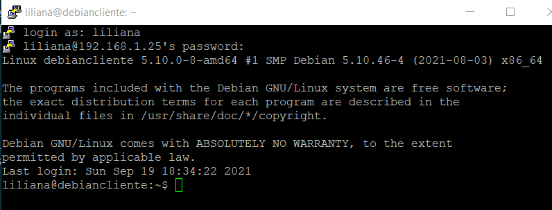

esto nos sirve para usar vagrant y nos acerca a la automatización.

> PuTTY is a free implementation of Telnet and SSH for Windows and Unix platforms, along with an xterm terminal emulator.

<!-- fin resumen clase sincronica 2 -->

**Notas - Clase 3: Repaso**

<!-- inicio notas clase 3 sincronica -->

## Vagrant: Automatización box Debian <a id='c3s1'></a>

Vamos a usar vagrant para automatizar la virtualización.
Con un script con vagrant lo haremos mucho mas rapido

paso a paso:

- Creamos una carpeta llamada ejVagrant y accedemos desde PowerShell

- con vagrant instalado, descargaremos la box de Debian, una box es una maquina virtual preconfigurada, vemos las diferentes boxes en la vagrant cloud:

<app.vagrantup.com/boxes/search>

nosotros usaremos:

una box de Debian y usaremos virtualbox como hypervisor, se llama `debian/buster`

ejecutamos el comando:

```powershell
vagrant box add debian/buster64
```

esto demora un poco, luego seleccionamos la opción 2: virtualbox

el **vagranfile** que tiene el siguiente código con extension `all types`, configura la maquina virtual y le pone nombre `network server` y que configure una `public network`

```powershell
# -*- mode: ruby -*-
# vi: set ft=ruby :
# All Vagrant configuration is done below. The "2" in Vagrant.configure
# configures the configuration version (we support older styles for
# backwards compatibility). Please don't change it unless you know what
# you're doing.
Vagrant.configure("2") do |config|
  config.vm.define "server" do |server|
  config.vm.box = "debian/buster64"
  server.vm.hostname = "server"
  server.vm.network "public_network"
  end
end
```

validamos el código:

```powershell
vagrant validate
```

si hacemos

```powershell
vagrant up
```

y hay un error, también lo va a validar
con `vagrant up` corre la maquina virtual

Todo el proceso de la clase 2 de instalar y configurar el sistema operativo vagrant lo va a automatizar; lo ahorramos con la box.

Cuando termine de instalar con el comando verificamos que esta corriendo.

```powershell
vagrant status
```

Si dice running y abrimos el virtualbox vemos que esta corriendo


ahora vamos a instalar un servidor web, vamos a tener que loggearnos a esta maquina virtual

Como vagrant ya estala un ssh usamos el siguiente código y esto evita el uso de puTTy

```powershell
vagrant ssh server
```

el comando anterior nos loguea automáticamente a la maquina virtual

ahora vamos a instalar un servidor web: apache, para eso necesitamos los permisos de root, vagrant es el password por defecto de root.

```powershell
su root
Password: vagrant
# Por defecto el password de root es vagrant
```

ahora que estamos como root instalaremos el servidor web apache2

```powershell
apt-get install apache2
```

pregunta, le decimos Y, lo va a bajar, configurar y lo va a instalar.

para ver si esta funcionando nos fijamos la ip

```powershell
ip address
```

Verificamos que funcione en el navegador
que corre nuestro servidor web


**Resumen**
Esto automatiza la tarea de tener un servidor web usando los recursos de hardware de nuestra computadora, antes lo usamos de forma manual en la clase 2 y en la clase 3 se automatiza el proceso.

Podemos cambiar las configuraciones cuando esta instalado en nuestra computadora, yendo a la documentacion de en este caso `Debian`

> Las boxes se guardan en:

```
C:usuarios>user>.vagrant.d>boxes
```

Automatizaremos mas el proceso anterior, agregando por defecto al script un servidor web

primero saldremos del root y de la maquina virtual.


para parar nuestra maquina virtual:

```powershell
vagrant halt
```

Destruir la maquina de vagrant con:

```powershell
vagrant destroy -f
```

## Automatizar: modificando file de vagrant <a id='c3s2'></a>

Agregamos las instrucciones al script para que se instale automáticamente el `Apache2`

```powershell
Vagrant.configure("2") do |config|
  config.vm.define "server" do |server|
  config.vm.box = "debian/buster64"
  server.vm.hostname = "server"
  server.vm.network "public_network"
  #Esto es lo nuevo que se agrega al file
  #Le dice al server que se aprovisione desde la linea de comandos
  server.vm.provision "shell", inline: <<-SHELL
  #Y ejecute estos comandos:
    apt-get update
    apt-get install -y apache2
    #Dice que termine el shell
    SHELL
  end
end
```

Primero lo validamos:

```powershell
vagrant validate
```

si esta ok

```powershell
vagrant up
```

Nos logueamos para ver la ip, aunque tambien podemos configurarla

```powershell
vagrant ssh server
```

y luego, no es necesario entrar como root, pedimos el ip y lo verificamos

```powershell
ip address
```

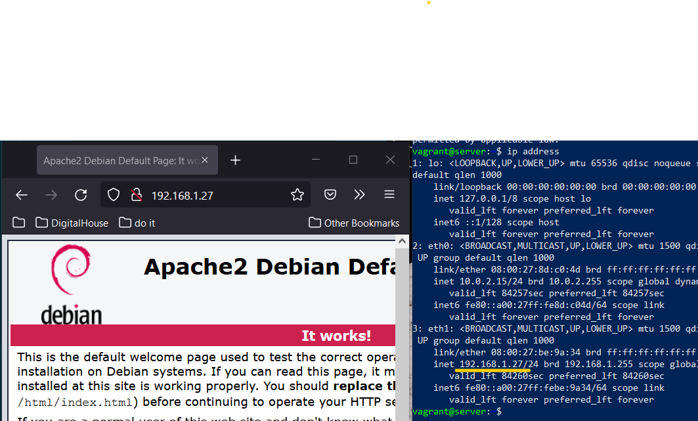

Cerramos la vm

```powershell
#loguados en el servidor con vagrant ssh server
exit
```

y eliminamos la VM con:

```powershell
vagrant destroy -f
```

## Cambiar html base en el script <a id='c3s3'></a>

Copiar el `HTML`, ponerlo en la carpeta vagranfile para copiar esta pagina en donde iria la pagina por defecto de Apache.

```powershell
Vagrant.configure("2") do |config|
    config.vm.define "server" do |server|
    config.vm.box = "debian/buster64"
    server.vm.hostname = "server"
    server.vm.network "public_network"
    server.vm.provision "shell", inline: <<-SHELL
        apt-get update
        apt-get install -y apache2
        SHELL
    #Esto es lo nuevo que se agrega al file
    server.vm.provision "file", source: "index.html", destination: "index.html"
    server.vm.provision "shell", inline: "mv index.html /var/www/html/index.html"
    end
end
```

Esto movera el archivo HTML a ese lugar, tiene que existir ese HTML

Creamos una pagina html en la carpeta del vagrant file

```powershell
#paso 1: Correr vagrant
vagrant up
#paso 2: Elegir la red
1
#paso 3: Nos logueamos en la maquina virtual
vagrant ssh server
#paso 4: Consulto ip
ip address
```


(Se ve en otra pc en mi misma red, no se si afuera)
(NO MATE ESTA ULTIMA MAQUINA VIRTUAL)
(UTIMO COMANDO FUE `vagrant halt`)

PARA PRENDERLA `vagrant up`

<!-- fin resumen clase 3 sincronica -->

# C4 - Shell Scripting - Parte I <a id='c4'></a>

## Introducción a la terminal de Linux <a id='c4a'></a>

¿Cómo viene todo hasta acá? Ojalá hayas podido recuperar energías porque comienza el momento de trabajar sobre nuevas definiciones.

En esta clase vamos a avanzar respondiendo algunas preguntas:

- ¿Qué es una shell CLI o intérprete de comandos?
- ¿Cuáles son los tipos de shell?
- ¿Cómo iniciamos una consola en Linux?
- ¿Cuáles son los privilegios del superusuario root?

> ver PDF: Introduccion a la Terminal. Diferentes formas de ejecución.pdf

<!-- inicio resumen pdf -->

## La consola de Linux <a id='c4a1'></a>

La interfaz de línea de comandos, o CLI —por sus siglas en inglés command-line interface—, es un método de comunicación entre usuario y máquina que acepta instrucciones del usuario a través de líneas de texto (siguiendo unas determinadas reglas de sintaxis que puedan ser interpretadas por el sistema operativo).La herramienta que posibilita la función de interfaz de usuario se la denomina shell. Aplicado en el ámbito de la interfaz de línea de comandos, estaríamos hablando de una shell CLI o intérprete de comandos.
Diferentes

## Tipos de shell <a id='c4a2'></a>

En Linux tenemos una multitud de shells o intérpretes diferentes. El más conocido de todos probablemente es Bash, debido a que es el que suele venir por defecto en la gran mayoría de distribuciones GNU/Linux, pero también destacan otros como Bourne Shell (sh), Korn Shell (ksh) o C Shell (csh), los cuales vamos a conocer.

### Bourne Shell <a id='c4a2a'></a>

Lleva el nombre de su creador en los Laboratorios Bell, Steve Bourne. Fue la primera shell utilizada para el sistema operativo Unix y ha superado en gran parte la funcionalidad de muchas de las shells más recientes. Todas las versiones de Linux Unix permiten a los usuarios cambiar a la original Bourne Shell, conocida simplemente como "sh", si así lo desean. Sin embargo, hay que tener en cuenta que al hacerlo, se renuncia a funcionalidades como el completado de nombres de archivo y el historial de comandos que los depósitos posteriores han añadido.

### C/TC Shell <a id='c4a2b'></a>

El C Shell fue desarrollado posteriormente al Bourne Shell y está pensado en facilitar el control del sistema al programador en lenguaje C. La razón de esto es que su sintaxis, como vamos a apreciar, es muy similar a la de este lenguaje.Conocido popularmente también como csh, está presente en otros SO, por ejemplo, en Mac OS. Posee una evolución, conocida como `tcsh` que incorpora funcionalidades avanzadas y mayores atajos de teclado

### Korn Shell <a id='c4a2c'></a>

Esta también fue escrita por un programador en los Laboratorios Bell, David Korn. Intenta combinar las características de la C Shell, TC Shell y Bourne Shell en un solo paquete. También incluye la capacidad para crear nuevos comandos de shell para los desarrolladores cuando surja la necesidad.

> Posee funciones avanzadas para manejar archivos de comandos que la colocan a la par de lenguajes de programación especializados, como AWK y Perl.

### Bourne-Again Shell (BASH) <a id='c4a2d'></a>

La Bourne-Again Shell es una versión actualizada de la Bourne Shell original. Es una shell utilizada ampliamente en la comunidad de código abierto.Su sintaxis es similar a la utilizada por la Bourne Shell, incorporando funcionalidades más avanzadas que se encuentran en las shells C, TC y Korn.Entre las funcionalidades adicionales que carecía Bourne, está la capacidad para completar nombres de archivos pulsando la tecla TAB, la capacidad de recordar un historial de comandos recientes y la capacidad de ejecutar múltiples programas en segundo plano a la vez.

## Ejecución de la consola <a id='c4a3'></a>

### Consola de Linux: Ejecución en inicio

Si bien cada distribución de Linux tiene su manera particular de acceder a la consola, cuando el SO se inicia en los niveles 1, 2, 3 y 4 nos llevará por defecto a la consola.

### Consola de Linux: Ejecución desde GUI

Si en cambio nuestro SO inicia en nivel 5 (con GUI), para poder utilizar la terminal tenemos diferentes opciones. Estas varían de acuerdo a la distribución instalada. En el caso de Ubuntu, tenemos dos opciones:

- La primera de ellas es lanzando un TTY, o espacio de trabajo sin entorno gráfico. Podemos ejecutar 7 terminales al mismo tiempo de esta forma. De la 1 a la 6, ninguna tiene interfaz gráfica. Para cambiar de TTY en Linux debemos usar el atajo de teclado Control+Alt más la tecla —de F1 al F7— del TTY que queramos ejecutar.

`ctrl + alt + f1`

- La segunda opción es encontrar una app dedicada que se ejecuta en una ventana, dentro del panel de aplicaciones de nuestra distro. En el caso de Ubuntu, por ejemplo, podemos encontrar esta terminal dentro del cajón de programas del entorno gráfico GNOME.

## Los privilegios del superusuario root <a id='c4a4'></a>

Por lo general, los sistemas operativos contemplan el uso de solo un usuario, el cual tiene permisos de administrador. En Linux las cosas se manejan de una forma particular, se separa la cuenta de usuario común de la de superusuario y es eso lo que conocemos como root. Esta cuentaposee todos los privilegios y permisos para realizar acciones sobre el sistema.

Para la ejecución de algunos comandos debemos ingresar dicho acceso (clave de root). Sin embargo, se debe tener un conocimiento sobre las acciones que se realizan, ya queuna acción realizada de manera errónea podría ocasionar daños importantes en el sistema. El uso de instrucciones con privilegios de superusuario pueden ser sumamente útiles, pero totalmente devastadoras si desconocemos las consecuencias de su uso en el sistema. Veamos el método para elevar nuestros privilegios.

### Elevando privilegio

Suponiendo que iniciamos sesión como un usuario “común”, denominado “edorio” y queremos reiniciar un servicio (cron), vamos a obtener lo siguiente:

```bash
edorio@DESKTOP-W10:~$ service cron start
* Starting periodic command scheduler cron
cron: can't open or create /var/run/crond.pid: Permission denied

[fail]
edorio@DESKTOP-W10:~$
```

Para evitar el error, debemos usar el comando sudo, previo al comando que queremos ejecutar. Nos pedirá la contraseña de root y se ejecutará como tal de manera satisfactoria

```bash
edorio@DESKTOP-W10:~$ sudo service cron start
[sudo] password for edorio:
  * Starting periodic command scheduler cron
[ OK ]
edorio@DESKTOP-W10:~
```

<!-- fin resumen pdf -->

## Comandos más utilizados en la terminal de Linux <a id='c4b'></a>

A continuación vas a encontrar respuestas a los siguientes interrogantes:

- ¿Cómo navegar por el sistema de archivos mediante la consola?
- ¿Cómo manejar los archivos desde la consola?
- ¿Cómo obtener información desde un web service?

> Ver PDF: Comandos Utiles - parte 1.pdf

<!-- resumen inicio pdf -->

## Consolidando nuestro ambiente <a id='c4b1'></a>

Para poder seguir correctamente los ejemplos posteriores, es deseable que en tu ambiente (máquina virtual o WSL) tengas replicada la siguiente estructura de carpetas y archivos.

Para ello debemos ejecutar los siguientes comandos, en el orden dado (solo el texto que está luego del prompt o sea, luego del “$”, en color blanco):

```bash
edorio@DESKTOP-W10:~$ mkdir dir1 dir2 dir3

edorio@DESKTOP-W10:~$ touch dir1/archivo1.txt dir2/archivo2.txt dir3/archivo3.txt
```

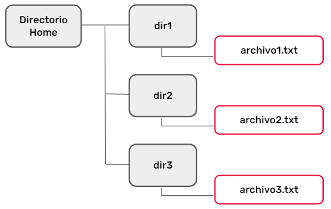

## Verificando nuestro ambiente <a id='c4b2'></a>

Listamos los directorios con la instrucción `ls -R`. Deberíamos obtener lo siguiente:

```bash
edorio@DESKTOP-W10:~$ ls -R
.:
dir1  dir2  dir3
./dir1:
archivo1.txt
./dir2:
archivo2.txt
./dir3:
archivo3.txt
```

## Comandospara el manejo de archivos <a id='c4b3'></a>

### ls

Con el comando ls podrás listar los diferentes archivos y directorios de la carpeta de trabajo en la que te encuentres. El comando acepta multitud de opciones, algunas de las cuales veremos a continuación.A continuación, podemos observar el uso más simple del comando ls. Si no le indicamos ninguna opción, enumerará todos los archivos y directorios que se encuentran en la carpeta de trabajo actual, sin tener en cuenta archivos ocultos.

```bash
edorio@DESKTOP-W10:~$ ls
dir1  dir2  dir
```

### ls -a

Con esta opción, el comando te mostrará —en forma de lista— todo el contenido que se encuentre dentro del directorio de trabajo, incluyendo archivos y carpetas ocultos. Dependiendo del shell, algunos tipos de archivos se mostrarán con colores diferentes

```bash
edorio@DESKTOP-W10:~$ ls -a
.         .aws           .bash_logout  .config    .landscape
.profile                  .vagrant.d  dir3 ..        .azure
.bashrc       .docker    .local       .ssh    dir1  .ansible
.bash_history  .cache        .fastlane  .motd_shown
.sudo_as_admin_successful  dir2
```

### ls -l

Esta opción es similar a la anterior, pero muestra el contenido en forma de lista e incluye información referente a cada elemento. Es de las más utilizadas, siendo especialmente útil a la hora de conocer el propietario y los permisos de cada fichero

```bash
edorio@DESKTOP-W10:~$ ls -l
total 12
drwxr-xr-x 2 edorio edorio 4096 May 21 01:59 dir1
drwxr-xr-x 2 edorio edorio 4096 May 21 01:59 dir2
drwxr-xr-x 2 edorio edorio 4096 May 21 01:59 dir3
```

### mkdir

Te permitirá crear un directorio con el nombre y la ruta que especifiques. Si no le indicás ninguna ruta, por defecto, te creará la carpeta dentro del directorio de trabajo en el que te encuentres

```bash
edorio@DESKTOP-W10:~$ mkdir dir4
```

Caso contrario, le podés indicar que cree un directorio con un path definido dentro de dir1.

```bash
edorio@DESKTOP-W10:~$ mkdir dir1/subdir1
```

### rmdir

Te permite eliminar el directorio que le especifiques. Un detalle importante es que para poder utilizar este comando, el directorio a borrar debe estar vacío

```bash
edorio@DESKTOP-W10:~$ rmdir dir4
```

El de arriba es el uso más simple del comando, sin indicar ruta.

Podemos también borrar un directorio con un path definido.

```bash
edorio@DESKTOP-W10:~$ rmdir dir1/subdir1
```

### rm

Este comando permite eliminar archivos sueltos y directorios que no se encuentren vacíos.

```bash
edorio@DESKTOP-W10:~$ rm dir1/archivo1.txt
```

El de arriba es el uso más simple del comando, sin indicar ruta.Eliminamos 1 archivo específico dentro de dir1

```bash
edorio@DESKTOP-W10:~$ rm -r dir2
```

Con el modificador -r eliminamos el directorio dir2 y, recursivamente, todo su contenido. Es un comando a utilizar con mucha precaución

### cp

Usando este comando serás capaz de copiar archivos y directorios. Así como ubicarlos en otras rutas, definiendo origen primero y luego destino.

```bash
edorio@DESKTOP-W10:~$ cp dir3/archivo3.txt dir1/archivo1.txt
```

El de arriba es el uso más simple del comando, sin indicar ruta. Copiamos en este caso el archivo3.txt, hacia dir1 y lo nombramos archivo1.txt.
En este caso, con el modificador -r copiamos el directorio dir3 en uno llamado dir2, que el mismo comando creo.

```bash
edorio@DESKTOP-W10:~$ cp -r dir3 dir2
```

### mv

Este comando te servirá para mover archivos desde la consola. La sintaxis es muy sencilla, solamente deberás especificar la ubicación de inicio —incluyendo el nombre del archivo— y la ubicación de destino.

```bash
edorio@DESKTOP-W10:~$ mv dir1/archivo1.txt dir3/archivo1.txt
```

Movimos un archivo de dir1 a dir3, conservando su nombre original.
En el siguiente caso usamos el comando mv para renombrar un archivo, ya que las rutas definidas son las mismas.

```bash
edorio@DESKTOP-W10:~$ mv dir3/archivo1.txt dir3/archivo3bis.tx
```

## Comandos para leer archivos de texto <a id='c4b4'></a>

### cat

Este es uno de los comandos más utilizados cuando se trata de manejar archivos de texto (en formato .txt) desde la terminal. Entre sus múltiples opciones, está la posibilidad de crear un archivo e imprimir por pantalla su contenido.

```bash
edorio@DESKTOP-W10:~$ cat >dir1/archivo1.txt
```

Esto nos abrirá el archivo1.txt, permitiendo editarlo. Con la combinación CTRL+D terminaremos la edición y se guardará el contenido.

```bash
edorio@DESKTOP-W10:~$ cat dir1/archivo1.txt
Hola Digital House, esto es CAT
```

Invocando el comando sin el símbolo “>”, nos mostrará por pantalla el contenido del mismo. Se puede usar con el modificador -n, para numerar las líneas y con el -b, con el propósito de no mostrar las líneas en blanco.

### more

Este es otro comando útil para imprimir por pantalla el contenido de un archivo de texto. Esencialmente es igual que el comando cat, con la diferencia que este comando pagina el contenido, por lo que es más adecuado para leer archivos largos.

```bash
edorio@DESKTOP-W10:~$ more /var/log/dpkg.log
```

Nos paginará el archivo en cuestión, de tal manera que en sus últimas líneas lo veremos así:

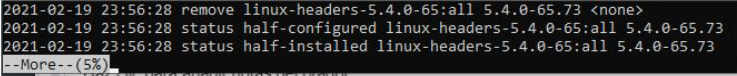

### nano

Nano es un editor de textos para la terminal, que más que para leer archivos sirve para modificarlos y editarlos. Aunque para esta guía también nos vale perfectamente para abrir el archivo y visualizar su contenido desde la línea de comandos.

```bash
edorio@DESKTOP-W10:~$ nano dir1/archivo1.txt
```

Nos mostrará:


Una vez abierto, en la parte inferior se visualizará las diferentes combinaciones de teclas que necesitarás a la hora de trabajar con archivos.

En la parte inferior se muestran las diferentes combinaciones de teclas que se necesitarán a la hora de trabajar con archivos:

- `CTRL+R`: combinación para indicarle un archivo de texto a Nano para que lo abra y muestre su contenido por la consola.
- `CTRL+V:` estando dentro de Nano y con el archivo abierto en la consola, esta combinación sirve para avanzar a la página siguiente.
- `CTRL+Y`: sirve para retroceder a la página anterior.
- 0` CTRL+W`: sirve para introducir un carácter o grupo de caracteres y buscar en el texto cualquier letra o palabra que coincida con el parámetro de búsqueda.
- `CTRL+X`: para cerrar el archivo una vez que lo hayas terminado de visualizar en la consola. Eso cerrará el editor de texto Nano y volverá a aparecer el prompt de Bash por consola.

### grep

Este comando, perteneciente a la familia Unix, es una de las herramientas más versátiles y útiles disponibles. Se encarga de buscar un patrón que definamos en un archivo de texto. Su primer parámetro es la cadena de texto a buscar, luego el o los archivos (acepta comodines como \*, pudiendo con el modificador -r recorrer recursivamente) que vamos a buscar.

```bash
edorio@DESKTOP-W10:~$ grep "Digital House" * -r
```

En este caso, buscamos la cadena “Digital House” en todos los archivos, de manera recursiva, la ejecución nos devolvió lo siguiente:


### tee

Lee una entrada estándar y la escribe en la salida estándar y en uno o más archivos. De forma normal, en la redirección de salida, las líneas del comando se escriben en un archivo, pero si queremos ver dicha salida al mismo tiempo, no podemos. ¡Usando el comando tee sí es posible lograrlo!

```bash
edorio@DESKTOP-W10:~$ ls -l | tee listado.txt
```

En este caso, además de mostrarnos el directorio, el mismo será guardado en un archivo

```bash
edorio@DESKTOP-W10:~$ ls -l | tee -a listado.txt
```

Utilizando el modificador -a, se agregará el contenido al archivo, sin pisar lo anterior.

<!-- fin resumen pdf -->

> Ver PDF: Comandos Utiles - parte 2.pdf

<!-- inicio resumen pdf -->

## Obtener datos desde un web service <a id='c4b5'></a>

La terminal de Linux tiene tanta versatilidad y potencia que nos permite vincularla con un web service, obtener datos de allí y procesarlos con propósitos tales como agregarlo a archivos en nuestro servidor, modificarlos y republicarlos.Las opciones son muy variadas, por ejemplo obtener un JSON desde una URL externa, procesar su contenido, obtener el o los atributos que nos interesen y —en función de ello— crear nuevos archivos, insertarlos en una base de datos.


## Comando cURL <a id='c4b6'></a>

### Aspectos técnicos

Es un comando disponible en la mayoría de los sistemas basados en Unix. Es una abreviatura de “Client URL”. Los comandos de cURL están diseñados para funcionar como una forma de verificar la conectividad a las URL y como una gran herramienta para transferir datos. El comando tiene una amplia compatibilidad con los protocolos más usados


### Sintaxis básica

El uso más simple de cURL es mostrar el contenido de una página. El siguiente ejemplo mostrará la página de inicio de digitalhouse.com:

```bash
edorio@DESKTOP-W10:~$ curl https://www.digitalhouse.com
```

Como vemos, no es muy útil esto, ya que es dif ícil llegar a información que nos pueda ser de utilidad visualizándola solamente en pantalla. Pero si usamos el modificador `-o`, podremos escribir ese contenido HTML de la página de inicio en un archivo en nuestro equipo:

```bash
edorio@DESKTOP-W10:~$ curl https://www.digitalhouse.com -o mipagina.html
```

Esto guardará todo el HTML en el archivo mipagina.html.

### Descargas

El uso de este modificador puede extenderse a procesar descargas:

```bash
edorio@DESKTOP-W10:~$ curl https://ubuntu.zero.com.ar/ubuntu-releases/20.04/ubuntu-20.04.2.0-desktop-amd64.iso -o ubuntu.iso
```

Descarga la ISO de la URL de referencia y la nombrará **ubuntu.iso**

```bash
edorio@DESKTOP-W10:~$  curl https://ubuntu.zero.com.ar/ubuntu-releases/20.04/ubuntu-20.04.2.0-desktop-amd64.iso -O -C 0
```

En este caso, no renombramos el archivo de destino (con el modificador -O). Además, permitimos la continuidad de la descarga con el modificador -C.

### Encabezados y verificaciones

El modificador -v nos permite verificar la conectividad hacia un sitio remoto

```bash
edorio@DESKTOP-W10:~$ curl https://www.digitalhouse.com -v
```

Esto nos brindará, además del contenido, datos como la IP de destino, protocolos de seguridad y certificados utilizados.

```bash
edorio@DESKTOP-W10:~$  curl https://www.digitalhouse.com -I
```

El modificador -I nos muestra todos los encabezados de la solicitud, tales como ruta por defecto, publicador web, entre otros.

### Contenido JSON

Viendo todas las opciones brindadas, nos podemos imaginar lo útil de este comando con el propósito de obtener el contenido en formato JSON desde un endpoint que lo entregue en dicho formato. Por ejemplo, la API de OpenStreetMap, la cual nos devuelve una dirección pasándole las coordenadas, con la siguiente URL:
<https://nominatim.openstreetmap.org/reverse.php?lat=-34.60378&lon=-58.38161&zoom=18&format=jsonv2>

```bash
edorio@DESKTOP-W10:~$  curl "https://nominatim.openstreetmap.org/reverse.php?lat=-34.60378&lon=-58.38161&zoom=18&format=jsonv2" -o resultado.json
```

Allí estamos guardando en el archivo resultado.json lo obtenido en el web service. Notemos el detalle de colocar la URL entre comillas simples o dobles.

## El comando jq <a id='c4b7'></a>

### Aspectos técnicos `./jq`

JSON es un formato de datos estructurados ampliamente utilizado que se utiliza normalmente en la mayoría de las API y servicios de datos modernos. Es particularmente popular en aplicaciones web debido a su naturaleza liviana y compatibilidad con JavaScript.

Desafortunadamente, shells como Bash no pueden interpretar y trabajar con JSON directamente. Esto significa que trabajar con JSON a través de la línea de comando puede ser engorroso e implica la manipulación de texto utilizando una combinación de herramientas como sed y grep

Allí es donde aparece jq, un potente procesador JSON para la consola.

### Sintaxis básica

`jq` se basa en el concepto de filtros que funcionan sobre un flujo de JSON. Cada filtro toma una entrada y emite JSON a la salida estándar. Tomando el archivo JSON obtenido con cURL, una ejecución sencilla de jq nos devuelve todo el contenido del JSON.

```bash
edorio@DESKTOP-W10:~$ jq '.' resultado.json
```

Como vemos, no vamos a acceder a ningún atributo en especial, ya que con el modificador ‘.’ no se lo indicamos

### Accediendo a propiedades

Para poder acceder a una propiedad específica es necesario indicarla luego del punto, con el nombre de la misma

```bash
edorio@DESKTOP-W10:~$ jq '.display_name' resultado.json
```

En este caso, accederemos a la propiedad display_name del JSON. Si queremos acceder a varias propiedades, las separamos por coma

```bash
edorio@DESKTOP-W10:~$ jq '.display_name,.type' resultado.json
```

De esta manera, accedemos a display_name y type

> TIP: Si alguna propiedad tuviese un espacio en su nombre, debemos envolverla con comillas dobles

## Combinación de uso de ambos comandos <a id='c4b8'></a>

### Combinar comandos con pipelines

Para poder combinar el poder de cURL con el recurso y la capacidad de proceso de jq debemos combinarlo usando pipelines. Para ello vamos a realizar una introducción a una de las características más interesantes que tiene la terminal.El pipeline o tubería es una función que permite utilizar la salida de un programa como entrada en otro.

El pipeline en Linux se representa con la barra vertical (|), la cual dividirá los comandos. Por ejemplo, si nosotros queremos saber la IP de nuestro equipo, lo hacemos con la instrucción:

```bash
edorio@DESKTOP-W10:~$ ip address
```

Esta nos devolverá muchísimos datos (MAC, protocolos, direcciones IPv4 e IPv6, entre otros). Si quisiéramos filtrar dentro de ese texto por la cadena “192.168”, lo deberíamos llevar a un archivo y allí buscar con grep.

```bash
edorio@DESKTOP-W10:~$ grep “192.168” miarchivo.txt
```

Pero es aquí en donde aparece la magia del pipeline, ya que podemos combinar ambas sentencias en una.

Para ello, primero colocamos nuestra sentencia inicial, sabiendo que tipo de salida puede tener, separamos con el pipeline y colocamos la segunda sentencia.

```bash
edorio@DESKTOP-W10:~$ ip address | grep "192.168"
```

Allí el grep nos indicará la línea coincidente con “192.168”. Nuestro pipeline podría seguir aplicándose sin límites más allá de aquellos que imponga el sistema operativo, por ejemplo cantidad de procesos en ejecución

### Aplicar el pipeline con cURL y jq

Conociendo el uso básico del pipeline, vamos a aplicarlo a la obtención de datos externos y el parseo de una propiedad específica, la cual la guardaremos en un archivo. Nuestro comando tendrá tres partes


### Aplicar el pipeline con cURL y jq

En este caso, vemos cómo la sentencia obtiene el JSON con cURL, lo procesa con jq para obtener el display_namey el type, y finalmente lo guarda en un archivo llamado consultapipe.txt

```bash
edorio@DESKTOP-W10:~$ curl "https://nominatim.openstreetmap.org/reverse.php?lat=-34.60378&lon=-58.38161&zoom=18&format=jsonv2" | jq ".display_name,.type" | tee consultapipe.txt
```

> Ver PDF: comandos

<!-- HACER -->
<!-- fin resumen pdf -->

> Ver PDF: Ejercitación - Comandos basicos.pdf
>
> Ver PDF: Ejercitacion

## Notas: Clase 4 <a id='c4s'></a>

<!-- resumen clase en vivo 4 -->

Run time levels, capas de linux al arrancar
Son estadios del kernel de Linux

[Link: Run level](https://searchdatacenter.techtarget.com/definition/runlevel)

En el run level 5 repasaremos comandos de Linux

Para apagar la maquina desde la consola, hay que pasar por esos niveles.
Primero hay que hacerlo desde el usuario `root`

Apaga el sistema

```bash
/sbin/init 0
```

Reinicia el sistema

```bash
/sbin/init 6
```

Para saber en que level estamos

```bash
who -r
```

Donde estamos ubicados

```bash
pwd
```

### cat

concatena informacion de archivos y crea uno nuevo

cat nombrearchivo1 nombrearchivo2 > nombrearchivo3

tambien crea archivos

```
cat > lista_nombres
```

Se queda titilando esperando que in Lo guardo con `ctrol + D` y con `ctrol + x` salimos del archivo.


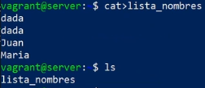

Lo consultamos con

```
nano lista_nombres
```

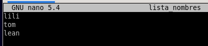

con `control + x` salimos del archivo

con cat tambien podemos convertir un archivo a mayusculas o minusculas.

## ;

Ejecuta las cosas sencuencialmente, primero uno, luego otro...

## &&

Ejecuta si el segundo comando si el anterior fue exitoso, no usa la salida del comando anterior.

## pipeline

conecta un comando con otro, devuelve un resultado/salida del comando que esta anteriormente
usa la salida de un comando para otro comando.
El pipeline, agarra el resultado del primer comando lo guarda en memoria y lo usa para el proximo comando

## grep

Hace una busqueda y nos va a devolver lo que le pedimos que buscara, en este caso que traiga todas las ip que comiencen con: `192.168`

```bash
ip address | grep "192.168"
```


Busca dentro de un archivo, o dentro de un resultado y devuelve el resultado pedido


## sudo eleva permisos del superusuario

En debian no esta instalado por defecto, en ubuntu si
con sudo en debian, no es necesario estar como root cuando tienes el sudo, ya que sudo eleva los permisos como superusuario; directamente se puede instalar:

eleva permisos de superusuario

```bash
sudo apt-get install curl
```

## curl

Es una aplicacion consultar paginas web desde la terminal
Consultar json, bajar un archivo.

Pagina que sirve para consultar comandos `cheat.sh`


En esta pagina `cheat.sh` podemos consultar para que sirven comandos

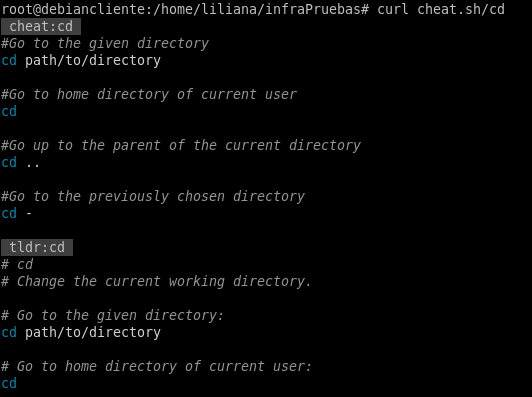

## chmod

Cambia los permisos de lectura, escritura y ejecucion
Una forma facil de usar chmod es con sus valores numeros

usando la numeric representation: `rwx`
**_Read Write Execute_**
El primer digito habla sobre el duenio/usuario, el segundo es el grupo de usuarios(user group en linux: son los usuarios que estan dentro de un grupo de usuarios; los usuarios activos que estan dentro del servidor), y el tercero es el mundo; otros que no estan dentro del grupo.

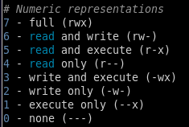

Ej: Si le quiero dar permiso para todo:

```bash
chmod 777
```

Ej: Solo permiso de lectura

```bash
chmod 400
```

Ej: Archivo de lectura y ejecucion

```bash
chmod 505
```

## ping

mide el tiempo de respuesta, se puede hacer con el tiempo de respuesta local o de otros servidores.
Se usa para medir servidores de una aplicacion y queremos medir el tiempo de respuesta.

```bash
#Dice que mande solo 5 paquetes, que mida 5 veces el tiempo de rfespuesta
ping -c 5 "192.168..."
```

## Abrir varias consolas a la misma vez

`control alt f2` abre otra instancia
`control alt f1` vuelve a la anterior

No paran, siguen funcionando en segundo plano

## Actividad en clase

### Listar servicios del sistema <a id='c4s1'></a>

Listar todos los servicios que se estan ejecutando en el sistema

```bash
systemctl list-unit-files --type service --all
```


Pararemos el apache2 que habiamos instalado

```bash
sudo systemctl stop apache2
```

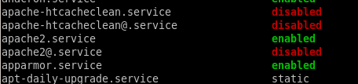

Prendiendo de nuevo apache

```bash
sudo systemctl start apache2
```

Para sacar a apache del inicio, cuando se activa la vm

```bash
sudo systemctl disable apache2
```

Para activar el serivio de apache desde el inicio

```bash
sudo systemctl enable apache2
```

Para ver el status, si esta corriendo o no

```bash
sudo systemctl status apache2
```

## Analizando los datos que van y vienen <a id='c4s2'></a>

Analizar los datos que van y vienen de nuestros servidores

> `netstat` esta deprecado

## ss -plnt

`ss -plnt` muestra los puertos que estan abierto escuchando la maquina

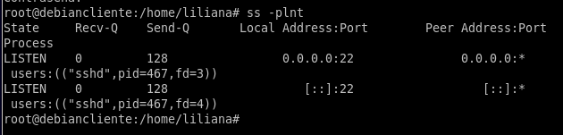

> Para borrar paquetes: `apt-get remove nombredeloquequieroborrar`

## tcpdump

Sirve para monitorear un puerto que este siendo utilizado por un servicio
Se usa para analizar y monitorear paquetes de red
Monitorea el trafico de red de un determinado puerto

```bash
tcpdump -i enp0s3 port 80
```

puede cambiar el nombre, lo verificamos con `ip address`
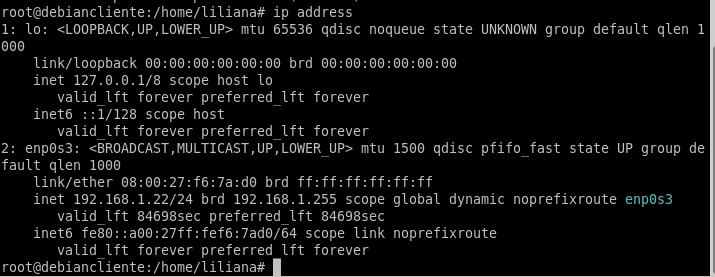

<!-- fin resumen clase en vivo -->

# C5 - Shell Scripting - Parte II <a id='c5'></a>

## Scripting <a id='c5a'></a>

**Automatizar procesos de tareas al sistema**

En esta clase vamos a presentar la interfaz de Bash como un shell de Unix, donde el usuario puede programar que se ejecuten órdenes al sistema operativo. Bash nos sirve para comunicarnos con nuestro sistema. Un ejemplo claro es la forma de automatizar la orden de realizar un backup cada determinado tiempo de la base de datos.

> Ver video: Introduccion a bash

<!-- inicio resumen pdf -->

## Interaccion con sistema operativo de una forma automatizable

`bash` es una interfaz que interpreta las ordenes que el usuario le hace al sistema ejecutado en una consola de UNIX
Tambien se pueden leer y ejecutar ordenes desde un archivo llamado script que nos permite hacer persistente una lista de tareas a realizar por el sistema operativo
Tambien es un lenguaje de scripting, lo que lo hace una herramienta muy potente para la administracion de sistemas y automatización de tareas

Para ejecutar multiples comandos en un solo paso desde el shell, podemos escribirlos en una sola linea y separarlos en `;`

Creamos un nuevo archivo

```bash
touch myscript
nano myscript


Shebang: #!
```

Define que shell usaremos, `bash` the shell en nuestro caso

```bash
#!/bin/bash
```

Los comandos de shell se escriben 1 por linea

<!-- fin resumen pdf -->

<!-- FIN resumen -->


## Bash scripting <a id='c5b'></a>

¡Ahora sí! Manos a la obra. En este apartado vamos a tener nuestros primeros scripting realizados por nosotros. De a poco nos introduciremos en las estructuras de control de los algoritmos de programación.

> Ver PDF: Estructuras de control

<!-- inicio resumen pdf -->

## Estructuras de control <a id='c5b1'></a>

### Sentencia if-then <a id='c5b1a'></a>

Los scripts de Bash necesitarán condicionales. Normalmente nos imaginamos un escenario tal como “Si el valor es menor que 10, hacé esto, si no hacé aquello”. Para ello utilizamos if-then. La estructura más básica de la sentencia `if-then`es así:

if command; then
hacer algo
fi

```bash
#!/bin/bash
if whoami; then
  echo "It works"
fi
```

### Sentencia if-else <a id='c5b1b'></a>

La sentencia `if-then-else` toma la siguiente estructura:

if comand; then
hacer algo
else
hacer otra cosa
fi

Si el comando se ejecuta y retorna cero (lo cual significa éxito), no ejecuta los comandos después de la sentencia else. Por otro lado, si la sentencia if retorna un número distinto de cero (lo cual significa que la condición no se cumple), el shell ejecuta los comandos después de la sentencia else. En el ejemplo que sigue vemos cómo nos devuelve un mensaje de acuerdo si el comando ping fue satisfactorio.

```bash
#!/bin/bash
ping -c 1 8.8.8.8
if [ $? -ne 0 ]; then
echo "No está en red"
else
echo "Sí está en red"
fi
```

## Comparaciones numéricas <a id='c5b1c'></a>

Podemos realizar una comparación numérica entre dos valores numéricos utilizando las sentencias de esta tabla

|                     |                                                      |
| ------------------- | ---------------------------------------------------- |
| number1 -eq number2 | Comprueba si number1 es igual a number2.             |
| number1 -ge number2 | Comprueba si number1 es más grande o igual number2.  |
| number1 -gt number2 | Comprueba si number1 es más grande que number2.      |
| number1 -le number2 | Comprueba si number1 es más pequeño o igual number2. |
| number1 -lt number2 | Comprueba si number1 es más pequeño que number2.     |
| number1 -ne number2 | Comprueba si number1 no es igual a number2.          |

Teniendo en cuenta que la sentencia de comparación se encuentra entre corchetes, ejemplificamos:

```bash
#!/bin/bash
num = 11
if [ $num -gt 10 ]; then
  echo "$num is bigger than 10"
else
  echo "$num is less than 10"
fi
```

## Comparaciones de cadenas <a id='c5b1d'></a>

Podemos realizar una comparación de cadena entre dos valores alfanuméricos utilizando las sentencias de esta tabla

|     |     |
| --- | --- |

`string1 = string2` Comprueba si string1 es idéntico a string2.
`string1 != string2` Comprueba si string1 no es idéntico a string2.
`string1 < string2` Comprueba si string1 es menor que string2.
`string1 > string2` Comprueba si string1 es mayor que string2.
`-n string1` Comprueba si string1 es mayor que cero.
`-z string1` Comprueba si string1 tiene una longitud de cero.

Podemos aplicar la comparación de cadenas en nuestro ejemplo. Si estamos logueados como root, va por el **if**, si no por el **then**

```bash
#!/bin/bash
user="root"
if [ $user = $USER ]; then
echo "The user $user&nbsp; is the current logged in user"
fi
```

## Cálculos matemáticos <a id='c5b1e'></a>

Podemos realizar cálculos matemáticos básicos utilizando la sintaxis $ ((2 + 2)):

```bash
#!/bin/bash
var1=$(( 5 + 5 ))
echo $var1
var2=$(( $var1 * 2 ))
echo $var2
```

<!-- fin resumen pdf -->

> Ver PDF: Ejemplo en Bash.pdf
>
> ver PDF: Realizamos nuestro primer script.pdf

## Notas: Clase 5 <a id='c5s'></a>

Entro desde powershell a mi maquina virtual de debian

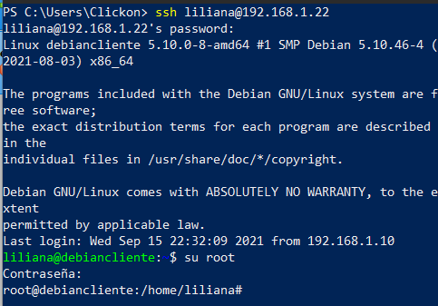

Abrimos

```bash
nano script.sh
```


Pegamos el siguiente código

```bash
#!/bin/bash
for word in $(cat lista_nombres)
do
  echo "El nombre es $word"
done
```

Lo guardamos.

Modificamos los permisos de ejecucion del archivo desde el usuario `root` con el código

```bash
chmod +x script.sh
```

Para ejecutar un escript en bash

```bash
./script.sh
```


El siguiente script agregandole la sentencia if
recorrera todo el listado escribiendo `El nombre es Lean`
y con la sentancia `if` se ejecutara el comando `Encontre a juan` cuando el ciclo llegue a `Juan`

```bash
#!/bin/bash
for word in $(cat lista_nombres)
do
  echo "El nombre es $word"
    if [ $word = "Juan" ]; then
      echo "Encontre a $word"
    fi
done
```

> control o guardo, enter, control x salgo.

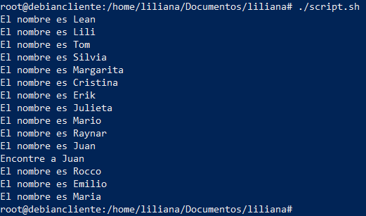

**Ejercicio 2**

> Instalamos jq en git bash y la vm

`jq` sirve para consultar datos Json

modificamos de nuevo el script, con este script `jq '.gender'` va a leer, `read -r gen` va a leer y `echo` va a devolver/mostrar el genero.

```bash
#!/bin/bash
for word in $(cat lista_nombres)
do
  echo "El nombre es $word"
    curl -s https://api.genderize.io/?name=$word | jq '.gender' |{ read -r gen; echo "Gender of $word is: $gen"; }
    curl -s https://api.nationalize.io/?name=$word | jq '.country[0].country_id' | { read -r cn; echo "Country of $word is: $cn"; }
done
```

Resultado:

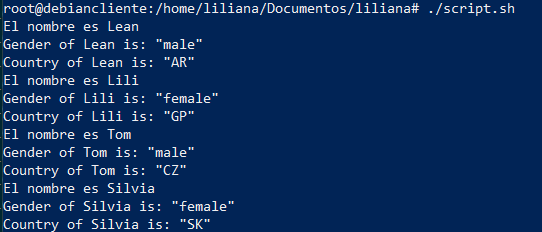

# C6 - Repaso <a id='c6s'></a>

Repaso acceso a VM desde powershell
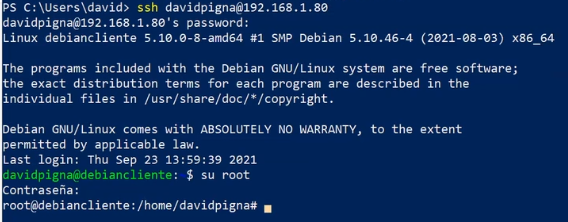

## Notas clase 6 <a id='c6s1'></a>

Powershell funciona tambein como lenguaje de programacion

> Ver PDF: Armemos un script un poco mas complejo.pdf

**Desarrollo actividad con git bash**

usamos una lista de nombres 456 nombres de github

[Link github](https://raw.githubusercontent.com/olea/lemarios/master/nombres-propios-es.txt)

creamos una carpeta

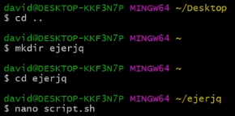

entramos con nano a editar el nuevo script `script.sh`
copiamos de la actividad el código al nano y tabulamos

**Codigo actividad a reemplazar**


`shuf` es un comando que hace referencia a shuffle, elige un solo nombre aleatoriamente


reemplazamos:


si el comando anterior fue exitoso ejecuta el segundo, `a*` indica que empieza con a y sigue con cualquier cosa, dice 4 porque empieza en 0

```bash
[[ $nombre == A* ]] && [ $countA -le 4 ]
```

Ejecutamos el script y seleeciono 5 nombres con A


> Los espacios entre los corchetes son necesarios, `le` les equal

El ejercicio pide consultar las apis, hay que acomodar el curl

El curl va despues del let

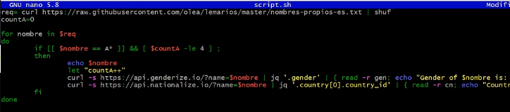

con este script consultara las apis

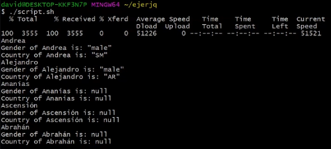

Ejercicio pide: seleecionar aleatoriamente 5 nombres que no empiecen ni con a ni con l

ponemos un `elif`; otra condicion del `if` y una opción es poner que sea distinto de a


Lo testeamos...


> Ver script.sh

el código es:

```bash
req=`curl https://raw.githubusercontent.com/olea/lemarios/master/nombres-propios-es.txt | shuf`
countA=0
countotro=0
for nombre in $req
do
	if [[ $nombre == A* ]] && [ $countA -le 4 ] ;
	then
		echo $nombre
		let "countA++"
		curl -s https://api.genderize.io/?name=$nombre | jq '.gender' | { read -r gen; echo "Gender of $nombre is: $gen"; }
		curl -s https://api.nationalize.io/?name=$nombre | jq '.country[0].country_id' | { read -r cn; echo "Country of $nombre is: $cn"; }
	elif [[ $nombre != A* ]] && [[ $nombre != L* ]] && [ $countotro -le 4 ] ;
	then
		echo $nombre
		let "countotro++"
		curl -s https://api.genderize.io/?name=$nombre | jq '.gender' | { read -r gen; echo "Gender of $nombre is: $gen"; }
		curl -s https://api.nationalize.io/?name=$nombre | jq '.country[0].country_id' | { read -r cn; echo "Country of $nombre is: $cn"; }
	fi
done
```

Este mismo ejercicio lo podemos hacer con Powershell pero lleva otra sintaxis

```powershell
$req = Invoke-WebRequest -Method Get -Uri<urlAlListado>$nombresConA = $req.Content.split("`n") | Where-Object { $_ -like"A*" }
1..5 | ForEach-Object {
  $random = Get-Random -Minimum 0 -Maximum $($nombresConA.count-1)$nombresConA[$random]
}
```

# C7 - PowerShell <a id='c7'></a>

## Introduccion a PowerShell <a id='c7a'></a>

> Ver video: PowerShell

<!-- HACER -->

Te introducimos al lenguaje PowerShell. Sigamos el recorrido con un poco de historia.


Seguimos recorriendo los conceptos de PowerShell. A continuación veremos la diferencia entre PowerShell y PowerShell Core.

<!-- VER PG - si subieron contenido -->

## Diferencias entre PowerShell y PowerShell Core <a id='c7a1'></a>

¿Qué es PowerShell Core? ¿Y cuál es la diferencia con Windows PowerShell?

- PowerShell Core es una nueva versión de PowerShell,
- Un shell de línea de comandos y lenguaje de scripts que se incluye con Microsoft Windows.

Es decir que contamos con dos ediciones de PowerShell.
Existe el PowerShell de hace una década que está integrado en todas las versiones recientes del sistema operativo Windows de Microsoft y el nuevo PowerShell Core.

Microsoft ve a PowerShell Core como una evolución de PowerShell.
El primero está disponible como una aplicación multiplataforma, el último solo para Windows.

<r>La naturaleza multiplataforma de PowerShell Core significa que las secuencias de comandos que se escriban se ejecutarán en cualquier sistema operativo compatible.</r> Se pueden escribir scripts de PowerShell Core en Windows y usarlos en dispositivos macOS X o Linux compatibles. Incluso hay versiones experimentales (no compatibles) para dispositivos ARM.

Microsoft trabaja activamente en PowerShell Core.
PowerShell, por otro lado, se encuentra en un estado que se puede comparar mejor con el soporte extendido para las versiones de Windows.
Microsoft no tiene planes de agregar funciones a PowerShell, pero lanzará correcciones de errores críticos y actualizaciones de seguridad.

Esto significa que el riesgo de regresión será muy bajo para Windows PowerShell, por lo que se puede contar con él como una plataforma estable para cargas de trabajo existentes.

Por último, vale la pena aclarar que PowerShell Core no afecta a Windows PowerShell de ninguna manera en dispositivos con Windows. Por lo que ambos pueden convivir sin problemas.

Guías de instalación de PowerShell

A continuación encontrarás la guía de instalación de PowerShell para cada sistema operativo.

Windows

Linux

macOS

## Usos comunes de PowerShell <a id='c7a2'></a>


<!-- resumen inicio link -->

### Monitoreo

Para escribir scripts que pueden ser utilizados por un software de monitoreo.

### Testear infraestructura

Las pruebas de infraestructura en Pester son código de PowerShell que ejecuta el módulo Pester PowerShell y se crea de una manera específica, conocida como lenguaje específico de dominio (DSL). Este DSL describe el estado deseado y tiene el código necesario para verificar ese estado y comparar el resultado.

### Automatización de procesos

Automatizar tareas en un proceso de liberación de software (CI/CD).

### Automatización de tareas

PowerShell sirve para facilitar a los administradores de sistemas las tareas de automatización, administración y configuración de sistemas.

### Configuracion management

Al utilizar PowerShell DSC.

## Comandos cmdlet <a id='c7a3'></a>

> Ver PDF: comandos cmdlet.pdf

<!-- inicio resumen pdf -->

| Cmdlet            | Descripción.                                                                                                                                        |
| ----------------- | --------------------------------------------------------------------------------------------------------------------------------------------------- |
| Set-Location      | Establece la ubicación de trabajo actual en una ubicación específica.                                                                               |
| Get-Content       | Obtiene el contenido del elemento en la ubicación especificada.                                                                                     |
| Add-Content       | Agrega contenido a los elementos especificados, por ejemplo, agregar palabras a un archivo.                                                         |
| Set-Content       | Escribe o reemplaza el contenido de un elemento con contenido nuevo.                                                                                |
| Copy-Item         | Copia un elemento de una ubicación a otra.                                                                                                          |
| Remove-Item       | Elimina los elementos especificados.                                                                                                                |
| Move-Item         | Mueve un elemento de una ubicación a otra.                                                                                                          |
| Set-Item          | Cambia el valor de un elemento al valor especificado en el comando.                                                                                 |
| New-Item          | Crea un nuevo elemento.                                                                                                                             |
| Start-Job         | Inicia un trabajo en segundo plano de Windows PowerShell.                                                                                           |
| Compare-Object    | Compara dos conjuntos de objetos.                                                                                                                   |
| Group-Object      | Agrupa objetos que contengan el mismo valor en propiedades especificadas.                                                                           |
| Invoke-WebRequest | Obtiene contenido de una página web en Internet.                                                                                                    |
| Measure-Object    | Calcula los valores de propiedad de determinados tipos de objetos. Puede realizar tres tipos de mediciones según los parámetros del comando.        |
| Resolve-Path      | Resuelve los caracteres comodín en una ruta y muestra el contenido.                                                                                 |
| Resume-Job        | Reinicia un trabajo suspendido.                                                                                                                     |
| Set-Variable      | Establece el valor de una variable. Crea la variable si no existe una con el nombre solicitado.                                                     |
| Show-Command      | Muestra comandos de Windows PowerShell en una ventana de comandos gráfica.                                                                          |
| Sort-Object       | Ordena los objetos por valores de propiedad.                                                                                                        |
| Start-Service     | Inicia uno o más servicios detenidos.                                                                                                               |
| Start-Process     | Inicia uno o más procesos en la computadora local.                                                                                                  |
| Suspend-Job       | Detiene temporalmente un trabajo.                                                                                                                   |
| Wait-Job          | Espera a que los trabajos en segundo plano de Windows PowerShell se completen antes de mostrar el símbolo de sistema.                               |
| Where-Object      | Selecciona los objetos del conjunto de objetos que se le pasan.                                                                                     |
| Write-Output      | Envía el objeto especificado al siguiente comando en la canalización. Si es el último comando en la canalización, el objeto se mostrará en consola. |

## Ejemplo uso comandos cmdlet <a id='c7a4'></a>

- Set-Location: Establece la ubicación actual.
  Entra a los registros de la maquina

```powershell
PS C:\> Set-Location -Path "HKLM:\"
PS HKLM:\>
```

- Get-Content: Obtiene el contenido de un archivo de texto.
  > paralelismo con bash es `cat`

```powershell
Get-Content -Path .\LineNumbers.txt

Esta es la línea 1
Esta es la línea 2
```

- Add-Content: Añade contenido a un archivo de texto.

```powershell
Add-Content -Path .\LineNumbers.txt -Value 'Fin de archivo'

Esta es la línea 1
Esta es la línea 2
Fin de archivo
```

- Set-Content: Modifica una línea de un archivo de texto.

```powershell
(Get-Content -Path .\LineNumbers.txt) |
ForEach-Object {$_ -Replace 'Fin de archivo', 'Esta es la línea 3'}
|

Set-Content -Path .\LineNumbers.txt

Get-Content -Path .\LineNumbers.txt
Esta es la línea 1
Esta es la línea 2
Esta es la línea 3
```

- Copy-Item: Copia un archivo a un directorio específico.

```powershell
Copy-Item "C:\Wabash\Logfiles\mar1604.log.txt" -Destination "C:\Presentation"
```

- Remove-Item: Este ejemplo elimina de la carpeta actual todos los archivos que tienen una extensión de nombre de archivo .doc con la excepción de los que tengan un _1_ en su nombre.

```powershell
Remove-Item * -Include *.doc -Exclude *1*
```

- Move-Item: Mueve un archivo a otro directorio y lo renombra.

```powershell
Move-Item -Path C:\test.txt -Destination E:\Temp\tst.txt
```

- Set-Item: Este ejemplo crea un alias llamado np para el Notepad de Windows.

```powershell
Set-Item -Path alias:np -Value "c:\windows\notepad.exe"
```

- New-Item: Crea un archivo en el directorio actual.

```powershell
New-Item -Path . -Name "archivo.txt" -ItemType "file" -Value "Texto de prueba"
```

- Start-Job: Ejecuta un script como un proceso en segundo plano.

```powershell
Start-Job -FilePath C:\Scripts\Sample.ps1
```

- Compare-Object: Compara el contenido de dos archivos:

  Este ejemplo compara el contenido de dos archivos, el ejemplo usa los siguientes dos
  archivos de texto, cada uno con un valor en una línea diferente.

  - verduras.txt contiene los valores: papa, zapallo, tomate.
  - frutas.txt contiene los valores: banana, tomate, naranja.
    El resultado muestra solo las líneas que son diferentes entre los archivos. En verduras.txt

  Usa el objeto de referencia (<=) y en frutas.txt usa el objeto de diferencia (=>). Las líneas que se encuentran en los dos archivos no son mostradas.

```powershell
Compare-Object -ReferenceObject (Get-Content -Path C:\Test\verduras.txt)
-DifferenceObject (Get-Content -Path C:\Test\frutas.txt)

InputObject SideIndicator
----------- -------------
banana =>
naranja =>
papa <=
zapallo <=
```

- Group-Object: Agrupa archivos por su extensión.

```powershell
$files = Get-ChildItem -Path $PSHOME -Recurse
$files | Group-Object -Property extension -NoElement | Sort-Object -
Property Count -Descending

Count Name
----- ----
365 .xml
231 .cdxml
197
169 .ps1xml
142 .txt
114 .psd1
63 .psm1
49 .xsd
36 .dll
15 .mfl
15 .mof
```

- Invoke-WebRequest: Muestra una página web.

```powershell
Invoke-Webrequest -Uri "http://www.google.com"
```

- Measure-Object: Este comando cuenta los archivos y carpetas del directorio actual.

```powershell
Get-ChildItem | Measure-Object
```

- Resolve-Path: Muestra la ruta actual.

```powershell
PS C:\> Resolve-Path ~

Path
----
C:\Users\User
```

- Resume-Job: Reanuda un trabajo por nombre.

```powershell
PS C:\> Resume-Job -Name WorkflowJob, InventoryWorkflow, WFTest*
```

- Set-Variable: Establece una variable y obtiene su valor.

```powershell
Set-Variable -Name "desc" -Value "Una descripción"
Get-Variable -Name "desc"

Name Value
---- -----
desc Una descripción
```

- Show-Command: Abre un cmdlet en una ventana de comandos.

```powershell
Show-Command -Name "Invoke-Command"
```


- Sort-Object: Ordena el directorio actual por nombre.

```powershell
PS> Get-ChildItem -Path . | Sort-Object

Directory: C:\Users\User

Mode LastWriteTime Length Name
---- ------------- ------ ----
-a---- 2/13/2019 08:55 26 anotherfile.txt
-a---- 2/13/2019 13:26 20 Bfile.txt
-a---- 2/12/2019 15:40 118014 Command.txt
-a---- 2/1/2019 08:43 183 CreateTestFile.ps1
d----- 2/25/2019 18:25 Files
d----- 2/25/2019 18:24 Logs
-ar--- 2/12/2019 14:31 27 ReadOnlyFile.txt
-a---- 2/12/2019 16:24 23 Zsystemlog.log
```

- Start-Service: Inicia un servicio detenido.

```powershell
Start-Service -Name "eventlog"
```

- Start-Process: Inicia un proceso que use valores por defecto.

```powershell
Start-Process -FilePath "sort.exe"
```

<!-- fin resumen pdf -->

## Kit de supervivencia de PowerShell <a id='c7b'></a>

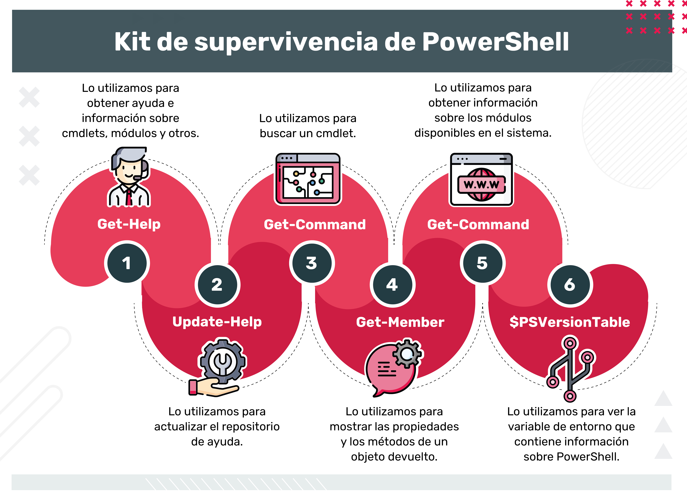

> Ver PDF: Kit de supervivencia de PowerShell

<!-- inicio resumen pdf -->

**¿Qué es un pipeline?**

Es una serie de comandos conectados mediante operadores de canalización (“|”, ASCII 124). Cada operador del pipeline envía los resultados del comando anterior al siguiente comando.
La salida del primer comando se puede enviar para procesar como entrada para el segundo comando y el resultado se puede enviar a otro comando. Lo anterior es una cadena de comandos o pipeline complejo que se compone de una serie de comandos simples.

```
Command-1 | Command-2 | Command-3
```

En este ejemplo, los objetos que Command-1 emite se envían a Command-2 . Command-2 procesa los objetos y los envía a Command-3. Este último procesa los objetos y los envía a través del pipeline. Dado que no hay más comandos en la canalización, los resultados se muestran en la consola.
En un pipeline, los comandos se procesan en orden de izquierda a derecha. El procesamiento se controla como una operación única y el resultado se muestra a medida que se genera.

**¿Qué es una variable?**

Una variable es una unidad de memoria en la que se almacenan los valores. En PowerShell, las variables se representan mediante cadenas de texto que comienzan por un signo de dólar ($), como `$a`, `$process` o `$my_var`.

Los nombres de variable no distinguen mayúsculas de minúsculas y pueden incluir espacios y caracteres especiales. Sin embargo, los nombres de variable que incluyen caracteres especiales y espacios son difíciles de usar y deben evitarse. Para obtener más información, vea nombres de variable que incluyen caracteres especiales.

**Tipos de variables en PowerShell**

- Variables creadas por el usuario: el usuario crea y mantiene las variables. De forma predeterminada, las variables que se crean en la línea de comandos de PowerShell solo existen mientras la ventana de PowerShell está abierta. Cuando se cierra la ventana de PowerShell, se eliminan las variables. Para guardar una variable, deberán agregarla a su perfil de PowerShell.

- Variables automáticas: estas almacenan el estado de PowerShell. Estas variables las crea PowerShell y cambia sus valores según sea necesario para mantener su precisión. Los usuarios no pueden cambiar el valor de estas variables.

- Variables de preferencia: estas almacenan las preferencias de usuario para PowerShell. Estas variables las crea PowerShell y se rellenan con valores predeterminados. Los usuarios pueden cambiar sus valores.

**¿Qué son las estructuras de control?**

Las estructuras de control permiten modificar el flujo de ejecución de las instrucciones de un programa. Con ellas se puede:

- De acuerdo con una condición, ejecutar un grupo u otro de sentencias (If-Then-Else).

- De acuerdo con el valor de una variable, ejecutar un grupo u otro de sentencias (Switch-Case).

- Ejecutar un grupo de sentencias solo cuando se cumpla una condición (Do-While).

- Ejecutar un grupo de sentencias hasta que se cumpla una condición (Do-Until).

- Ejecutar un grupo de sentencias un número determinado de veces (For-Next).

**Tipos de estructuras de control**

Todas las estructuras de control tienen un único punto de entrada. Las estructuras de control se pueden clasificar en: secuenciales, iterativas y de control avanzadas. Esta es una de las cosas que permiten que la programación se rija por los principios de la programación estructurada.

Los lenguajes de programación modernos tienen estructuras de control similares. Básicamente lo que varía entre las estructuras de control de los diferentes lenguajes es su sintaxis. Cada lenguaje tiene una sintaxis propia para expresar la estructura

**¿Qué es un script de PowerShell?**

Un script es un archivo de texto sin formato que contiene uno o más comandos de PowerShell. Los scripts de PowerShell tienen una extensión de archivo .ps1.

Ejecutar un script es muy parecido a ejecutar un cmdlet. Pueden ejecutar scripts en el equipo o en una sesión remota en otro equipo.

Al escribir un script se guarda un comando para su uso posterior y facilita el uso compartido con otros usuarios. Lo más importante es que permite ejecutar los comandos simplemente escribiendo la ruta de acceso del script y el nombre de archivo. Los scripts pueden ser tan simples como un solo comando en un archivo o tan complejos como un programa completo.

**¿Qué es una función en PowerShell?**

En PowerShell, como en muchos lenguajes, una función es un conjunto de instrucciones a las que les damos un nombre. El principal interés de las funciones es que podemos llamarlas varias veces, sin tener que volver a escribir las instrucciones en cada llamada.

Si se escriben scripts o comandos únicos de una línea de PowerShell y encuentran que a menudo tienen que modificarlos para distintos escenarios, es bastante probable que estos sean buenos candidatos para convertirlos en una función que se pueda volver a usar.

<!-- fin resumen pdf -->

> Ver PDF: Definición Módulo de Powershell V2.pdf

<!-- inicio resumen pdf -->

## módulos de PowerShell <a id='7b1'></a>

**¿Qué es un módulo?**

Como mencionamos antes, un módulo es un paquete que contiene objetos de
PowerShell, como cmdlets, proveedores, funciones, flujos de trabajo, variables y alias.
Los objetos u acciones de este paquete se pueden implementar en un script de
PowerShell, una DLL compilada o una combinación de ambos. Por lo general, estos
archivos se agrupan en un solo directorio.
Las personas que escriben comandos pueden usar módulos para organizar sus
comandos y compartirlos con otros. Las personas que escriben módulos pueden agregar
los comandos en los módulos a sus sesiones de PowerShell y usarlos como comandos
integrados.

**Carga automática de los módulos**

A partir de PowerShell 3.0, este importa módulos automáticamente la primera vez que ejecuta cualquier comando en un módulo instalado. Ahora podés usar los comandos en un módulo sin ninguna configuración o configuración de perfil, por lo que no es necesario administrar los módulos después de instalarlos en tu computadora.
Los comandos de un módulo también son más fáciles de encontrar. El cmdlet
Get-Command obtiene todos los comandos en todos los módulos instalados, incluso si aún no están en la sesión. Podés encontrar un comando y usarlo sin tener la necesidad de importar el módulo primero. Solo los módulos que se almacenan en la ubicación especificada por la variable de entorno PSModulePath se importan automáticamente.
Los comandos que incluyen un carácter comodín (\*) se consideran para descubrimiento, no para uso y no importan ningún módulo. Los módulos en otras ubicaciones deben importarse ejecutando el Import-Module cmdlet.

> Ver PDF: Trabajando con módulos de PowerShell.pdf

<!-- inicio resumen pdf -->

**¿Cómo utilizar e instalar un módulo de PowerShell?**

- Instalar el módulo.
- Buscar los comandos que agregó el módulo.
- Utilizar los comandos que agregó el módulo

Si recibís un módulo como una carpeta con archivos,
debés instalarlo en tu computadora antes de poder
usarlo en PowerShell. La mayoría de los módulos se
instalan automáticamente. PowerShell viene con
varios módulos preinstalados, a veces llamados
módulos centrales.
En equipos con Windows, si las funciones que se
incluyen con el sistema operativo tienen cmdlets para
administrarlas, esos módulos están preinstalados.

Módulos de PowerShell
El cmdlet Install-Module obtiene uno o más módulos que
cumplen los criterios especificados de un repositorio en línea.
Este verifica que los resultados de la búsqueda sean módulos
válidos y copia las carpetas del módulo en la ubicación de
instalación.
Los módulos instalados no se importan automáticamente
después de la instalación. Podés filtrar qué módulo está
instalado en función de las versiones mínima, máxima y exacta
de los módulos especificados.

> Si el módulo que se está instalando tiene el mismo nombre o versión —o contiene comandos en un módulo existente—, se muestran mensajes de advertencia.

**¿Cómo encontrar módulos instalados?**

Para encontrar módulos que están instalados en una ubicación de módulo predeterminada, pero que aún no se han importado a tu sesión, debés escribir:

```powershell
Get-Module -ListAvailable
```

Para encontrar los módulos que ya se han importado a tu sesión, escribí en tu sesión de PowerShell:

```powershell
Get-Module
```

El cmdlet `Find-Module` busca módulos en un repositorio que coinciden con los criterios especificados. Find-Module devuelve un objeto **PSRepositoryItemInfo** para cada módulo que encuentra. Los objetos se pueden enviar por el pipeline a cmdlets como `Install-Module`.

La primera vez que Find-Module intente utilizar un repositorio, es posible que
te solicite que instales actualizaciones. Si la fuente del repositorio no está
registrada con el cmdlet Register-PSRepository, se devuelve un error.
Find-Module devuelve la versión más reciente de un módulo si no se utilizan
parámetros que limiten la versión.

```powershell
Find-Module Name PowerShellGet
Version   Name              Repository           Description
-------   ----              ----------           -----------
2.1.0     PowerShellGet     PSGallery            PowerShell module
with commands for discovering...
```

**¿Cómo buscar los comandos en un módulo?**

Usamos el comando Get-Command cmdlet para buscar todos los comandos disponibles. Podés usar los parámetros del Get-Command cmdlet para filtrar comandos por módulo, nombre y sustantivo

```powershell
Get-Command -Module <module-name>
```

**¿Cómo obtener ayuda para los comandos de un módulo?**

Si el módulo contiene archivos de ayuda para los comandos que exporta, el Get-Help cmdlet mostrará los temas de ayuda. Usá el mismo Get-Help formato de comando que usarías para obtener ayuda para cualquier comando de PowerShell. Para obtener ayuda para un comando de un módulo, escribí:

```powershell
GetHelp <command-name>
```

Para obtener ayuda en línea para el comando en un módulo, escribí:

```powershell
GetHelp <command-name>
```

Para descargar e instalar los archivos de ayuda de los comandos de un módulo, escribí:

```powershell
Update-Help -Module <module-name>
```

**¿Cómo importar un módulo o un archivo del mismo?**

La importación es necesaria cuando un módulo no está instalado en las
ubicaciones especificadas por la variable de entorno PSModulePath,
$env:PSModulePath; o el módulo consta de un archivo, como un archivo `.dll` o `.psm1`, en lugar de un módulo típico que se entrega como una carpeta.
Para importar módulos, podés usar el Import-Module cmdlet. Para importar
módulos en una ubicación PSModulePath en la sesión actual, utilizá el siguiente
formato de comando:

```powershell
Import-Module <module-name>
```

**¿Cómo quitar un módulo?**

Al quitar un módulo, se eliminan de la sesión los comandos que el módulo agregó.
Para hacerlo tendrás que utilizar el siguiente formato de comando:

```powershell
Remove-Module <module-name>
```

## Notas clase 7 <a id='c7s'></a>

Repaso:

Guardar variables en powershell y mostrar con `echo`


Powershell es una herramienta para automatizar SO, servicios, guardar consultas de sql, es un lenguaje de programacion

**Paralelismo con bash**
La diferencia entre powershell y bash, se usan soluciones propias de powershell, usa comandos internos.
En vez de usar apps exteriores, se usan comandos propios.

> Ver PDF: Realizamos nuestros primeros scripts en PowerShell.pdf

Powershell es un lenguaje de programacion

- ver setup de mysql con powershell

> Ver PDF: Trabajamos_con_modulos_de_PowerShell.pdf

**Solucion de actividad**

Creamos la base de datos desde el CLI de MySQL UNICODE
pide contrasenia, ponemos la que es de mysql


Como administrador en PowerShell:

Buscamos modulo:

```powershell
find-module -name invokequery
```

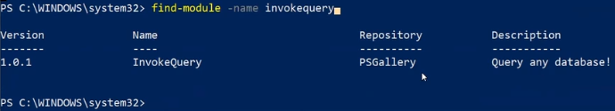

Instalo el modulo

```powershell
install-module -name invokequery
```

## `Invoke-MySqlQuery`

Nos va a permitir hacer consultas sql desde powershell, es un programa preprogramado que lo bajamos como un modulo.

una **Ventaja** puede ser que se puedan automatizar consultas. Disponible para usar como en un `script.sh`

<https://powerwamp.readthedocs.io/en/latest/Invoke-MySQLQuery/>

En PowerShell, dentro de una variable que se va a llamar `$creds`

```powershell
$creds = Get-Credential
```

Esto nos va a preguntar usuario y contrasenia de nuestra base de datos y la va a guardar en esa variable los datos de acceso.

Guarda dentro de la variable `$query` la busqueda de la base de datos.

```powershell
$query = new-SqlQuery -sql "select * from test"
```

consulta base de datos por un modulo que fue instalado

```powershell
Invoke-MySqlQuery -SqlQuery $query  -Credential $creds -Server localhost -Database test
```

**Resultado:**
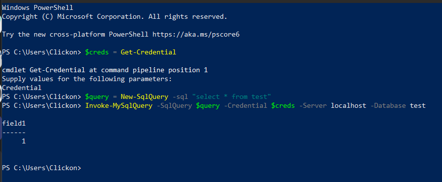

## Otros comandos:

Para saber si un comando esta instalado:

```powershell
Get-command New-SqlQuery
```

Para saber donde estan instalados los modulos, puede mostrar varias rutas.

```powershell
$env-POModulePath
```

> ver pdf paso Ana: Powershell-cheatsheet.pdf

# C8 - Python <a id='c8'></a>

## Introduccion a Python <a id='c8a'></a>

Python es un lenguaje de escritura rápida, escalable, robusto y de código abierto. Esto hace que Python sea un aliado perfecto para la inteligencia artificial, ya que permite plasmar ideas complejas con unas pocas líneas de código, lo que no es posible con otros lenguajes.

Te invitamos a conocer este lenguaje del que todos hablan.

> Ver video: Introduccion a Python

1. gratuito
2. open source
3. Nuevas librerias constantemente
4. Lenguaje multiparadigma
5. Apto para todas las plataformas

## Historia de Python

Su nombre se debe a la afición de Van Rossum al grupo Monty Python. Su concepción se enfocaba en que fuera fácil de usar y aprender, sin que esto penalizará sus capacidades. En su momento, no llegó a adquirir la suficiente importancia debido a la falta de recursos en el hardware de la época.


## ¿Qué es y para qué sirve Python?

Python se define como un “lenguaje de programación versátil, multiplataforma y multiparadigma que se destaca por su código legible y limpio”. A su vez, se emplea en plataformas de alto tráfico como Google, YouTube o Facebook. Su principal objetivo es la automatización de procesos, lo que hará de las tareas algo mucho más simple. Uno de sus puntos fuertes es que “comprueba los errores sobre la marcha”. En este sentido, Python crea un código con gran legibilidad, que ahorra tiempo y recursos.

## Usos de Python

Phyton se convirtió en uno de los lenguajes de programación más utilizados en la actualidad, aunque tiene una presencia en el mercado de más de 30 años. Uno de sus principales aliados es la inteligencia artificial, pero también se destaca en aplicaciones web y big data.

Python también se utiliza para obtener información de otros sitios web, lo que comúnmente se denomina “scraping”. Incluso tiene aplicaciones prometedoras en el campo médico que mejoran la capacidad de brindar diagnósticos y tratamientos precisos a los pacientes. Otras áreas como astronomía, robótica, vehículos autónomos, negocios, meteorología y desarrollo de interfaces gráficas de usuario también se benefician con el uso de Python.

Avancemos para conocer por qué es importante Python en el contexto de infraestructura.

## Importancia de python en infraestructura <a id='c8a1'></a>

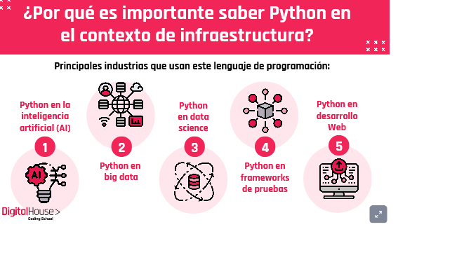

[Importancia de python en infraestructura](https://view.genial.ly/60ca9b9e7a0b2e0d81b26e59)

### Python en la inteligencia artificial (AI)

Python es un lenguaje de escritura rápido, escalable, robusto y de código abierto, ventajas que hacen de Python un aliado perfecto para la inteligencia artificial.

Permite plasmar ideas complejas con unas pocas líneas de código, lo que no es posible con otros lenguajes.

### Python en big data

El uso de Python está muy extendido en el análisis de datos y la extracción de información útil para empresas

### Python en data science

Python se ocupa de los datos tabulares, matriciales y estadísticos, e incluso los visualiza con bibliotecas populares.

### Python en frameworks de pruebas

Python es ideal para validar ideas o productos, ya que tiene muchos frameworks integrados que ayudan a depurar el código y ofrecen flujos de trabajo y ejecución rápidos.

### Python en Desarrollo Web

Python permite construir mucho más con menos líneas de código, por lo que se crean prototipos de forma más eficiente.

## Pros y Contras <a id='c8a2'></a>


Continuemos este recorrido. Ya vimos para qué se utiliza el lenguaje, dónde es mayormente aplicado y los beneficios que tenemos al utilizarlo. Seguiremos ahora con la parte práctica, metiéndonos en profundidad en los términos y conceptos de este lenguaje. ¿Nos acompañás?

## Nos ponemos a practicar <a id='c8b'></a>

> Ver pdf: Variables en Python.pdf

<!-- inicio resumen pdf -->

## Variables <a id='c8b1'></a>

### ¿Qué es una variable en Python?

En algunos lenguajes de programación, las variables se pueden entender como "cajas" en las que se guardan los datos, pero <r>en Python las variables son "etiquetas" que permiten hacer referencia a los datos (que se guardan en unas "cajas" llamadas objetos)</r>.

Python es un lenguaje de programación orientado a objetos y su modelo de datos también está basado en objetos.

Para cada dato que aparece en un programa, Python crea un objeto que lo contiene.

Cada objeto tiene:

- **Un identificador único** (un número entero, distinto para cada objeto). El identificador permite a Python referirse al objeto sin ambigüedades.
- **Un tipo de datos** (entero, decimal, cadena de caracteres, etc.). El tipo de datos permite saber a Python qué operaciones pueden hacerse con el dato.
- **Un valor** (el propio dato)

### ¿Cómo definir una variable?

Las variables en Python se crean cuando se definen por primera vez, es decir, cuando se les asigna un valor por primera vez.
Para asignar un valor a una variable se utiliza el operador de igualdad (`=`). A la izquierda de la igualdad se escribe el nombre de la variable y a la derecha el valor que se quiere dar a la variable.

Una variable puede almacenar números, texto o estructuras más complicadas (que se verán más adelante).

Si se va a almacenar texto, el texto debe escribirse entre comillas simples (`'`) o dobles (`"`), que son equivalentes.

A las variables que almacenan texto se les suele llamar cadenas (de texto). Si no se escriben comillas, Python supone que estamos haciendo referencia a otra variable.

```py
numeros = 000000
numeros1 = 02473
numeros2 = 12653
text = 'variabletexto'
text2 = 'variabletexto’
```

### Nombres de variables

Aunque no es obligatorio, se recomienda que el nombre de la variable esté relacionado con la información que se almacena en ella, para que sea más fácil entender el programa.
Si el programa es trivial o mientras se está escribiendo un programa, esto no parece muy importante, pero si se consulta un programa escrito por otra persona o escrito por uno mismo, pero hace tiempo, resultará mucho más fácil entender el programa si los nombres están bien elegidos.
También se acostumbra a utilizar determinados nombres de variables en algunas ocasiones, como se verá más adelante, pero esto tampoco es obligatorio.

### Tipos de variables <a id='c8b2'></a>

En el apartado anterior hay definiciones de algunos de los tipos de variables que hay en Python:

números decimales, números enteros y cadenas (una o más letras).

Aunque se definan de forma similar, para Python no es lo mismo un número entero, un número decimal o una cadena ya que, por ejemplo, dos números se pueden multiplicar, pero dos cadenas no **(curiosamente, una cadena sí que se puede multiplicar por un número)**.

Una vez se ha definido una variable, se puede utilizar para hacer cálculos o para definir nuevas variables, como muestran los siguientes ejemplos:

### Utilizar o modificar variables ya definidas

```py
>>>a = 2
>>>a + 35
>>>horas = 5
>>>minutos = 60 * horas
>>>segundos = 60 * minutos
>>>segundos
1800
>>>horas = 1
>>>minutos = 2
>>>segundos = 3
>>>segundos + 60 * minutos + 3600 * horas
3723
```

En caso de utilizar una variable no definida anteriormente, Python genera un mensaje de error.

```py
>>>dias = 7 * semanas
Traceback (most recent call last):
  File "<pyshell#1>", line 1, in <module>
    dias = 7 * semanas
  NameError: name 'semanas' is not defined
```

> Ver pdf: Estructuras de control en Python.pdf

## Indentación (sangría) <a id='c8b3'></a>

En Python, las líneas de código que están dentro de un mismo deben estar agrupadas, teniendo el mismo número de espacios a la izquierda de cada línea, al igual que sucedería en la vida real.
A modo de ejemplo:

```
- Carrefour
  - Carnicería
    - Cerdo
    - Pollo
  - Pescadería
```

Este siguiente caso no sería correcto, y en Python generaría un error (o el funcionamiento no sería el esperado):

```
- Frutería
  - Peras
- Manzanas
```

Lógicamente, `Manzanas` no puede estar al mismo nivel que `Frutería`. En Python, se recomienda usar siempre bloques de cuatro espacios, aunque si se usan otro número de espacios, también funcionará.
También se pueden usar tabuladores, aunque se recomienda no usarlos.

## if en Python <a id='c8b4'></a>

En todo programa llega el momento, que en función de una determinada condición, hay que realizar una serie de cosas u otra.

Esto se hace con el comando `if (condición principal)`, con los opcionales `elif (condiciones adicionales, se pueden poner tantas como se quiera)` y `else (si no se ha cumplido ninguna de las anteriores, solo se puede poner una vez y al final)`.

A modo de ejemplo:

```py
>>> Alonso_Position=1>
>> if (Alonso_Position==1):
>>>     print("Espectacular Alonso, se ha hecho justicia a pesar del coche")
>>>     print("Ya queda menos para ganar el mundial")
>>> elif (Alonso_Position>1):
>>>     print("Gran carrera de Alonso, lástima que el coche no esté a la altura")
>>> else:
>>>     print("No ha podido terminar la carrera por una avería mecánica")
```

## Condiciones en Python <a id='c8b5'></a>

Las condiciones que se suelen usar con más frecuencia son:

| Condicion | Descripcion              |
| --------- | ------------------------ |
| a == b    | Indica si a es igual a b |

a < b
a > b |
not | NO: Niega la condición que le sigue.
and | Y: Junta dos condiciones que tienen que cumplirse las dos |
or | O: Junta dos condiciones y tienen que cumplirse alguna de las dos.

## Bucles While y for <a id='c8b6'></a>

### while

En ocasiones, tenemos que repetir varias veces una determinada tarea hasta conseguir nuestro objetivo.
En Python esto se realiza con el comando `while`. Con los while, hay que tener la precaución de no realizar un «bucle infinito», que consiste en un bucle que nunca termina por un error en la programación.  
En el caso siguiente, esto ocurriría si no hubiéramos puesto la línea `vuelta=vuelta+1`.

A modo de ejemplo while en Python se usa así:

```py
>>> while vuelta<10:
>>>     print("Vuelta "+str(vuelta))
>>>     vuelta=vuelta+1
Vuelta 1
Vuelta 2
Vuelta 3
Vuelta 4
Vuelta 5
Vuelta 6
Vuelta 7
Vuelta 8
Vuelta 9
```

### for

En ocasiones, tenemos que repetir varias veces una determinada tarea hasta conseguir nuestro objetivo.
En Python esto se realiza con el comando `for`. En el caso del for, no es posible realizar un bucle infinito. Como se puede ver en el siguiente ejemplo, range genera una secuencia de números desde 1 hasta 10. `for` se puede utilizar con cualquier objeto con el que se pueda iterar (ir saltando de elemento en elemento).

A modo de ejemplo for en Python se usa así:

```py
>>> for vuelta in range(1,10):
>>>     print("Vuelta "+str(vuelta))
Vuelta 1
Vuelta 2
Vuelta 3
Vuelta 4
Vuelta 5
Vuelta 6
Vuelta 7
Vuelta 8
Vuelta 9
```

for se puede utilizar con cualquier objeto con el que se pueda iterar (ir saltando de elemento en elemento), como vemos en este ejemplo con una lista:

```py
>>> coches = (‘Ferrari’, ‘Tesla’, ‘BMW’, ‘Audi’)
>>> for coche in coches:
>>>    print(coche)
Ferrari
Tesla
BMW
Audi
```

Si lo combinamos con la función enumerate, además irá dándoleun número a cada elemento:

```py
>>> coches = ('Ferrari', 'Tesla', 'BMW', 'Audi')
>>> for i, coche in enumerate(coches):
>>>    print(str(i) + " - "+ coche)
0 - Ferrari
1 - Tesla
2 - BMW3 - Audi
```

> Ver pdf: Trabajamos con Estructuras de Control II

Como hemos observado anteriormente, los algoritmos requieren dos estructuras de control importantes:
iteración y selección.
Ambas están disponibles en Python en varias formas.
El programador puede elegir la instrucción que sea más útil para la circunstancia dada.

Para la iteración, Python proporciona una instrucción `while` estándar y una instrucción `for` muy potente.

La instrucción while repite un cuerpo de código mientras una condición sea verdadera.

Por ejemplo:

## Ejemplos estructuras de control <a id='c8b7'></a>

**Ejemplo while**

Este código imprime la frase “Hola, mundo” cinco veces. **La condición en la instrucción while se evalúa al inicio de cada repetición.**
Si la condición es `True`, el cuerpo de la instrucción se ejecutará.

Es fácil ver la estructura de una instrucción while de Python debido al patrón de sangrado obligatorio que el lenguaje impone.

```py
>>> contador = 1
>>> while contador <= 5:
...    print("Hola, mundo")
...    contador = contador + 1

Hola, mundo
Hola, mundo
Hola, mundo
Hola, mundo
Hola, mundo
```

---

La instrucción while es una estructura iterativa de propósito general que usaremos en una serie de algoritmos diferentes.
En muchos casos, una condición compuesta controlará la iteración.
Un fragmento como el siguiente:

```py
while contador <= 10 and not hecho:
```

Haría que el cuerpo de la instrucción fuera ejecutado solo en el caso en que se cumplan ambas partes de la condición.

El valor de la variable `contador` tendría que ser **menor o igual a 10** y el valor de la variable `hecho` tendría que ser **False (not False es True)** de modo que True and True da como resultado True.

Aunque este tipo de estructura es muy útil en una amplia variedad de situaciones, otra estructura iterativa, la instrucción `for`, se puede usar junto con muchas de las colecciones de Python.

**Ejemplo for**

La instrucción `for` puede usarse para iterar sobre los miembros de una colección, siempre y cuando la colección sea una secuencia.

Por ejemplo:

```py
>>> for item in [1,3,6,2,5]:
     print(item)

1
3
6
2
5
```

Asigna a la variable `item` cada valor sucesivo de la lista `[1,3,6,2,5]`.
Entonces se ejecuta el cuerpo de la iteración.
Esto funciona para cualquier colección que sea una secuencia (listas, tuplas y cadenas).

---

Un uso común de la instrucción `for` es implementar una iteración definida sobre un rango de valores.

Ejecutará la función print cinco veces. La función range devolverá un objeto de rango que representa la secuencia “0,1,2,3,4” y cada valor se asignará a la variable item. Este valor es entonces elevado al cuadrado y se imprime en pantalla.

La siguiente instrucción:

```py
>>> for item in range(5):
...   print(item**2)
...
0
1
4
9
16
>>>
```

---

## instrucciones de selección <a id='c8b8'></a>

Las instrucciones de selección les permiten a los programadores hacer preguntas y luego, con base en el resultado, realizar diferentes acciones.

La mayoría de los lenguajes de programación proporcionan dos versiones de esta útil estructura: ifelse e if.

Un ejemplo sencillo de una selección binaria que utiliza la instrucción ifelse es el siguiente:

En este ejemplo, el objeto referenciado por n se **comprueba para ver si es menor que cero**.
Si es así, se imprime un mensaje indicando que es negativo.
Si no es así, la instrucción ejecuta la cláusula else y calcula la raíz cuadrada.

```py
if n<0:
   print("Lo siento, el valor es negativo")
else:
   print(math.sqrt(n))
```

---

## estructuras de selección <a id='c8b9'></a>

Las estructuras de selección, como ocurre con cualquier otra estructura de control, pueden anidarse de modo que el resultado de una pregunta ayude a decidir si se pregunta la siguiente.

Por ejemplo, supongamos que puntaje es una variable que contiene una referencia a un puntaje de un examen de ciencias de la computación.

Este fragmento clasificará un valor llamado puntaje mediante la impresión de la calificación cualitativa obtenida. **Si el puntaje es mayor o igual a 90**, la instrucción imprimirá “A”. **Si no lo es (else)**, se hace la pregunta siguiente. **Si el puntaje es mayor o igual a 80**, entonces debe estar entre 80 y 89, ya que la respuesta a la primera pregunta era falsa.
En este caso se imprimirá la letra “B”.

Puede verse que el patrón de sangrado de Python ayuda a dar sentido a la asociación entre if y else sin necesidad de elementos sintácticos adicionales.

```py
if puntaje >= 90:
   print('A')
else:
   if puntaje >= 80:
      print('B')
   else:
      if puntaje >= 70:
         print('C')
      else:
         if puntaje >= 60:
            print('D')
         else:
            print('F')
```

---

Una sintaxis alternativa para este tipo de selección anidada utiliza la palabra clave `elif`. El else y el if siguiente se combinan para eliminar la necesidad de niveles de anidamiento adicionales. Tené en cuenta que el último else sigue siendo necesario para proporcionar el caso por defecto, en caso de que todas las demás condiciones fallen.

```py
if puntaje >= 90:
   print('A')
elif puntaje >= 80:
   print('B')
elif puntaje >= 70:
   print('C')
elif puntaje >= 60:
   print('D')
else:
   print('F')
```

---

## estructura de selección de una sola vía

Python también tiene una estructura de selección de una sola vía, la instrucción if. Con esta instrucción, si la condición es verdadera, se realiza una acción.
En caso de que la condición sea falsa, el procesamiento simplemente continúa con la instrucción que siga después del if.
Por ejemplo, el siguiente fragmento **comprobará primero si el valor de una variable n es negativo**.
Si lo es, entonces es modificado mediante la función de valor absoluto.
Sea cual sea el caso, la siguiente acción es calcular la raíz cuadrada.

```py
if n<0:
   n = abs(n)
print(math.sqrt(n))
```

---

## comprensión de listas <a id='c8b10'></a>

Regresando a las listas, existe un método alternativo para crear una lista que usa estructuras de iteración y de selección, conocido como comprensión de listas.

Una comprensión de lista permite crear fácilmente una lista basada en algunos criterios de procesamiento o de selección.

Por ejemplo, si quisiéramos crear una lista de los primeros 10 cuadrados perfectos, podríamos usar una instrucción for:

La variable x toma los valores de 1 a 10 especificados por la estructura for. El valor de x\*x se calcula y se agrega a la lista que se está construyendo.

```py
>>> listaCuadrados=[]
>>> for x in range(1,11):
         listaCuadrados.append(x*x)

>>> listaCuadrados
[1, 4, 9, 16, 25, 36, 49, 64, 81, 100]
>>>
```

Usando comprensión de listas, podemos hacer lo mismo en un único paso como

```py
>>> listaCuadrados=[x*x for x in range(1,11)]
>>> listaCuadrados
[1, 4, 9, 16, 25, 36, 49, 64, 81, 100]
>>>
```

La sintaxis general para una comprensión de listas también permite agregar un criterio de selección para que únicamente se agreguen ciertos ítems.

Esta comprensión de listas construyó una lista que contenía solamente los cuadrados de los números impares en el rango de 1 a 10.

Por ejemplo:

```py
>>> listaCuadrados=[x*x for x in range(1,11) if x%2 != 0]
>>> listaCuadrados
[1, 9, 25, 49, 81]
>>>
```

---

Cualquier secuencia que soporte la iteración se puede utilizar dentro de una comprensión de listas para construir una nueva lista.

```py
>>>[letra.upper() for letra in 'estructuras' if letra not in 'aeiou']
['S', 'T', 'R', 'C', 'T', 'R', 'S']
>>>
```

## Notas clase 8 <a id='c8s'></a>

Toma valores aleatorios entre 0 1 y 2, el ultimo numero no lo toma:

```py
random.randrange(0,3)
```

Las variables dentro de python son un objeto

Concatena de un mismo tipo con `+`, con llaves tambien
Concatena con distintos tipos de dato con `,`

<!-- fin notas clase -->

# C9 - Repaso <a id='c9'></a>

## Notas clase 9

Repaso vagranFile

```powershell
Vagrant.configure("2") do |config|
  # El nombre de la virtual machine, el nombre externo
  config.vm.define "server" do |server|
  config.vm.box = "debian/buster64"
  # El nombre del host; la maquina en si, el nombre interno
  server.vm.hostname = "server"
  # Define si es una red privada o publica, en este caso es publica, con conexion a internet
  server.vm.network "public_network"
  # Hypervisor que vamos a usar para ejecutar la vm
  config.vm.provider "virtualbox" do |vb|
  vb.gui = true
  # Si piden poner 1g escribimos 1024, si son 2gb 2048; siempre va de 512 en 512
  vb.memory = "512"
  # Instala el apache
  server.vm.provision "shell", inline: <<-SHELL
    apt-get update
    apt-get install -y apache2
    SHELL
  # Mueve un file y lo reemplaza por otro html
  server.vm.provision "file", source: "index.html", destination: "index.html"
  server.vm.provision "shell", inline: "mv index.html /var/www/html/index.html"
  end
end
```

Podemos automatizar consultas, inicios de servidores, consultas a bases de datos

# C10 - Configuration Management <a id='c10'></a>

> Ver pdf: ¿Qué es configuration management.pdf

<!-- inicio resumen -->

Configuration management y change management son dos de los procesos fundamentales del conjunto de metodologías conocido como ITIL.

> Conjunto de reglas y buenas practicas, lo emite AXELOS, hay certificaciones para esto y para empresas basadas en itil.

## Change management <a id='c10a'></a>

ITIL describe la gestión de cambios como el proceso de controlar y gestionar un cambio a lo largo de todo su ciclo de vida con el objetivo de minimizar el riesgo.

**¿Qué es un cambio?**

Según ITIL, un cambio es la modificación o eliminación de cualquier cosa que pueda afectar directa o indirectamente los servicios. Básicamente, cualquier cambio en la infraestructura de IT de una organización puede afectar las operaciones de la organización.

**Ejemplos de un cambio:** reemplazo de hardware, instalación de software en un servidor o la modificación de una configuración de un sistema que alterará su comportamiento

> Se encarga de gestionar los cambios, mediante push o pull

## Configuration management <a id='c10a1'></a>

Es el proceso que permite gestionar los cambios de configuración de nuestros activos informáticos —ya sean de software o hardware—, permitiendo a la organización mantener un registro histórico y a su vez aplicar controles —como un proceso de aprobación para cambios que cumplan con determinadas características—. Cada uno de los activos informáticos en el contexto de este proceso se los conocen como **configuration items (CI)** y se almacenan en lo que es llamado CMDB (configuration management database).

> Almacena los cambios en una base de datos para tener control.

## Change management + Configuration management <a id='c10a2'></a>

Ambos procesos se complementan, ya que **change management** aporta a la gobernabilidad de los cambios que se efectúan en el parque tecnológico de una organización, y configuration management nos permite gestionar una base de datos (CMDB) con la informacion de nuestros activos (CIs) y un historial de los cambios realizados para cada uno de ellos.De esta manera, de ocurrir la falla de uno de nuestros activos que nos fuercen a restaurarlo, por ejemplo, una falla crítica en un servidor, el proceso de configuration management nos aporta una vista de todos los cambios sucedidos para ese activo desde su creación, y así permitirnos reproducir cada uno de los cambios y devolverlo al estado anterior a la falla

## Configuration management tradicional <a id='c10a3'></a>

**¿Cómo se ve en la práctica?**

Tomemos como ejemplo el ciclo de vida de un servidor. Este se puede dividir en 2 etapas:

- La etapa de **construcción** del servidor: un conjunto de pasos que pueden ser automatizados, documentados o sencillamente conocimiento común del área de IT, que permiten la puesta en marcha de un servidor y registrarlo en la CMDB como un nuevo CI.

- Su ciclo de vida, a lo que podemos llamar etapa de **ejecución**: todo lo que suceda en relación al activo y cambios que puedan suceder en el.


## Etapa de construcción de un servidor <a id='c10a4'></a>

### Instalación del S.O

El proceso de instalación del sistema operativo en el hardware o máquina virtual.

### Configuración del S.O.

El conjunto de configuraciones definido por la organización como requeridas para el que el servidor pueda formar parte del ecosistema

### Instalación del software de base

Es probable que la organización de IT haya determinado que debe instalarse software adicional para que el servidor pueda operar correctamente dentro del ecosistema. Estos pueden incluir: antivirus, software de IDS / IPS, agentes de backup, etcétera

### Instalación de aplicación y servicios

Finalmente, durante el proceso de construcción del servidor se debe instalar y configurar el software o servicio que dará sentido a su existencia. Por ejemplo, si el servidor está destinado a ser un servidor web, no solo se trata de instalar el servidor web (IIS, NGINX, Apache, etc.), sino que también se trata de desplegar el sitio web que lo alojará.

## Etapa de ejecución de un servidor <a id='c10a5'></a>

### Patching

El proceso de instalar actualizacion del sistema operativo, dependiendo del sistema operativo es la cadencia con la que este proceso se ejecutará. En términos generales las organizaciones eligen ejecutar instalaciones mensuales de actualizaciones. Este proceso debería verse reflejado mediante el proceso de change management.

### Cambios de configuración

Cualquier cambio de configuración del sistema operativo o hardware que responda a una necesidad. Estos deberían verse reflejados como parte del proceso de change management.

### Solución de problemas

Cualquier incidencia que haya producido una falla en el sistema reduciendo o anulando su funcionamiento. Requiriendo la intervención de un administrador para restaurar el nivel de servicio. Estas deberían verse reflejadas como parte del proceso de incident management.

### Cambios no autorizados

**¡Alerta!** Cualquier cambio o actividad realizado en el servidor y que no queda documentado en un ticket, ya sea como un cambio o un incidente.

## Problemáticas: Configuration management + Change management, ¿es practicable? <a id='c10a6'></a>

¿Es posible reconstruir un activo el mismo estado que se encontraba previo a la falla que nos forzó a restaurarlo? El poder realizar esto de manera exitosa depende de muchas variables:

- La disciplina que hayamos tenido para realmente reflejar cada uno de los cambios realizados al activo durante su ciclo de vida.
- Quedará a discreción del administrador a cargo de la restauración que cambios son necesarios reproducir, y cuales pueden ser obviados.
- Error humano, podemos equivocarnos al intentar reconstruir el activo. Toda tarea manual conlleva lugar a errores. Y cuanto más antiguo sea un activo, mayor será la cantidad de cambios que tengamos que aplicar, en consecuencia, mayor la posibilidad de cometer un error.
- La existencia de cambios no autorizados

> Un cambio no autorizado que es implementado con éxito es más **peligroso** que uno que no lo es. Ya que produce una configuración efectiva sin dejar evidencia de la misma

## ¿Mascotas vs. Ganado? <a id='c10a7'></a>

Cuando se habla de configuration management se tiene a hacer una divergencia entre ‘Mascotas’ y ‘Ganado’. ¿Por qué?

En términos generales, se dice que en los procesostradicionales, aquellos en los que encontramos las problemáticas previamente mencionadas, cada servidor administrado de forma individual se convierte en una mascota,con un trato personalizado.

Mientras que en los procesos modernos de administración de servidores, los mismos se administran en conjunto, con una mirada industrial y abarcativa del parque tecnológico. Se adopta un enfoque que nos permite implementar soluciones rápidas y reemplazar componentes fallidos en lugar de invertir tiempo en intentar resolver problemas complejos. Similar a como sucede en la ganadería donde el ganado se administra como un todo

## ¡Configuration as Code al rescate! <a id='c10a8'></a>

En los procesos modernos de configuration management, la posibilidad de definir la configuración de un servidor como código (Configuration as Code, o CaC) es fundamental.

- Gestionar el parque tecnológico como ganado no sería posible sin la utilización de un sistema de configuration management.
- Cualquier cosa definida como código puede ser automatizada.
- El código puede ser sometido a pruebas.
- CaC es un paso anterior a habilitar Self-Healing y Self-Remediation (dos prácticas del mundo moderno de infraestructura que permiten implementar procesos de autorreparación).
- Es compatible con el proceso de change management de ITIL, ya que las modificaciones no suceden en los activos, sino en un repositorio que soporta versionado. De modo que los cambios pueden ser testeados y desplegados en ambientes bajos para luego aplicarlos en producción.
- No reemplaza al proceso de configuration management de ITIL, hasta comparten el mismo nombre.

> Podemos definir la estructura como un todo

## Los desafíos de adoptar Configuration as Code <a id='c10a9'></a>

Transicionar de los procesos tradicionales a los procesos modernos puede llevarnos a afrontar varios desafíos:

- Tenemos que entender si realmente tiene sentido transicionar a estos procesos.
- Comprender qué tan lejos queremos ir con la implementación de CaC, ¿vamos a adaptar los sistemas existentes? ¿O adoptaremos la práctica solo para los nuevos sistemas?
- Abandonar las viejas formas de trabajar puede presentar resistencia.
- Puede que necesitemos repensar la forma en la que se construyen los servidores en la organización.

> Ver video: Un proceso de configuracion management moderno

<!-- inicio resumen video -->

Todo parte de un requerimiento, puede ser como configurar un aspecto de un sistema operativo como un antivirus, o configurar un servidor web o un motor de bases de datos.

**Escenario tradicional**
El admin de infraestructura, deberia crear un ticket (por lo gral del tipo _change request_) luego se conectaria a los servidores correspondientes para efectuar la configuracion requerida.
Esto es un proceso tradicional, que son procesos imperativos, donde configuramos un servidor.


**Escenario moderno**
El administrador escribe un archivo o manifiesto de dicha configuracion que luegos era aplicado a los servidores correspondientes.
En los procesos modernos, son procesos declarativos, donde manifestamos la configuracion que sera aplicada pr un sistema de _configuration management_ en el servidor.
Una vez la configuracion esta codificada puede suceder 2 escenarios:

- aplicar la configuracion manualmente, no difiere de la configuracion tradicional.
- el admin opte por guardar los cambios en un sistema de control de versiones, ejemplo git
  usando git como fuente de verdad, para que un sistema de CM observe los cambios y aplique la configuracion en los servidores
  Este enfoque suele ser parte de las practicas que se utilizan en el modelo `GitOps`

Habiendo enviado el código al repositorio git, comienza el proceso automatico.
Un sistema externo tomara la configuracion del repositorio git para lego plasmarla en los servidores indicados

**Como llega la configuracion definida como código a ese sistema**
Esto depende de la naturaleza del _configuration manegement_ que hayamos elegido.
Algunos podrian monitorear el repositorio git en busca de cambios, y en caso de detectar cambios configurar los activos requeridos con la configracion correspondiente al ultimo `commit` del branch que estan monitoreando.

Quien se ocupa de conectar el repositorio git, con el sistema de _configuration manegement_ es un proceso que se llama **`pipeline`**, estos son utilziados mayormente en el proceso de despliegue de software tiene 2 etapas distintas:

- Build
- Releases

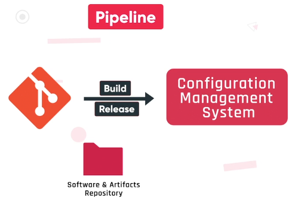

En un proceso de liberacion o despliegue de una aplicacion la instancia de

**`Build`** Tiende a utilizarse para testear y compilar a aplicacion y asi producir el artefacto que luego sera distribuido e instalad. En el proceso de contexto de _configuration manegement_ en la instancia de **`build`** de un pipeline, podemoss hacer exactamente lo mismo;

- testear la configuracion
- verificar que el formato sea correcto y si fuese necesario
- compilar

En el proceso de **`release`** en Pipeline lo que haremos es enviar al sistema de _configuration manegement_ el resultado del proceso de `build`

**Como hacemos para que nuestros servidores sepan que hay una nueva configuracion esperandolos**
Los servidores que estan gobernador por _configuration manegement_ tienen instalado un agente que cumple 2 funciones esenciales.

1. Registra el servidor contra el sistema de _configuration manegement_, permitiendo que el sistema reconozca la existencia del servidor. El agente es quien aplicara la configuracion en el servidor
2. El agente entonces, opera de representante para el sistema de _configuration manegement_ en el contexto del servidor a configurar.

Durante el proceso de registro, los servidores envian informacion sobre ellos mismos al sistema de _configuration manegement_, produciendo un inventario vivo.

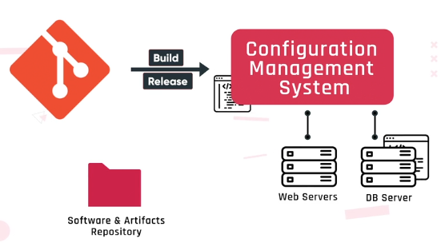

Entonces, cualquier cambio que surge en el servidor, se puede ver reflejado en el sistema de forma casi inmediata. Luego, el admin de sistemas asigna una configuracion a un servidor, dependiendo de distintos parametros o combinacion de parametros, por ejemplo:

- Nombre del servidor
- El rol
- Segmento de la red

Si al configuracion especifica que se debe instalar software en el servidor, el mismo debe estar disponible en una ubicacion que sea accesible para el servidor.

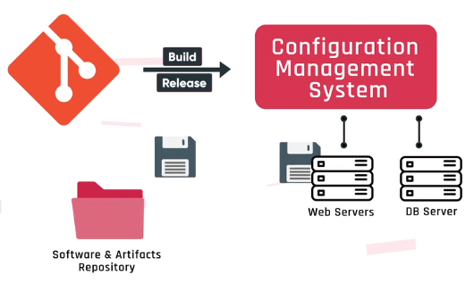

<!-- fin resumen video -->

## Herramientas de configuration management <a id='c10a10'></a>

¿De qué manera podemos implementar la gestión de los cambios? Continuemos para averiguarlo.

[Link: Herramientas](https://view.genial.ly/60d4b9157c0c4a0d7c4f7828)

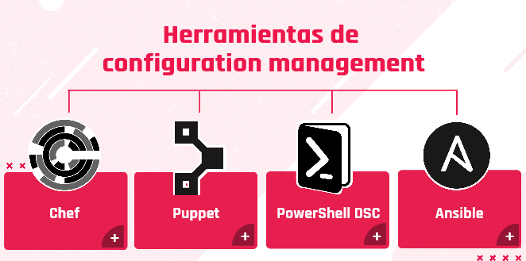

### Chef <a id='c10a10a'></a>

Es una plataforma de configuration management con una arquitectura cliente-servidor, principalmente, orientada a Linux. Lo que significa que las configuraciones son definidas y asignadas en el servidor y es mediante el cliente de Chef que se hacen efectivas en aquellos activos(servidores en vivo en ese momento) que deseamos configurar.

La presencia de un cliente hace que Chef pueda detectar las desviaciones que se producen a causa de posibles intervenciones manuales y así corregirlas para devolverla al estado deseado. El cliente de Chef funciona en modo “pull”, lo que significa que este verifica periódicamente contra el servidor si hay nuevas versiones de la configuración.

Las configuraciones de Chef se escriben en Ruby.

### Puppet <a id='c10a10b'></a>

Al igual que Chef, es una plataforma de configuration management con una arquitectura cliente-servidor, principalmente, orientada a Linux. Lo que significa que las configuraciones son definidas y asignadas en el servidor y es mediante el cliente de Puppet que se hacen efectivas en aquellos activos que deseamos configurar.

Como en Chef, la presencia de un cliente hace que Puppet pueda detectar las desviaciones que se producen a causa de posibles intervenciones manuales y así corregirlas. El cliente también funciona en modo “Pull”. Las configuraciones de Puppet se escriben en un DSL (domain specific language) creado por Puppet labs.

La gran diferencia entre Puppet y Chef está dada por las capacidades de reporting que tiene Puppet.

### PowerShell DSC <a id='c10a10c'></a>

DSC (del inglés, desired state configuration) es una tecnología que forma parte de PowerShell, originalmente desarrollada para mantener la configuración de hosts que Windows Server, es multiplataforma y puede también configurar hosts Linux.

Puede funcionar tanto en una arquitectura cliente-servidor (modo “pull’) o en una modalidad standalone (modo “push”). Cuando DSC funciona en modo “push” las configuraciones son definidas localmente y el cliente (llamado LCM, del inglés local configuration manager) es el encargado de aplicarlas sin buscar en un servidor. Tanto en modo “push” como en modo “pull”, tiene la capacidad de determinar si han habido desviaciones respecto de la configuración definida y corregirlas.

Las configuraciones para DSC son escritas en el lenguaje de scripting PowerShell.

### Ansible <a id='c10a10d'></a>

Es una tecnología de configuration management desarrollada en Python. Ansible no requiere de la instalación de un agente en aquellos servidores que se configuraran usando Ansible, sino que la herramienta establece una conexión vía SSH y de esa manera despliega las configuraciones.

Su versatilidad ha hecho que su uso evolucione más allá de ser utilizada como herramienta de configuration management para configurar hosts. Sino que también se utiliza como orquestador, para controlar despliegues en la nube y hasta desplegar aplicaciones como parte de un proceso de liberación de software.

Las configuraciones en Ansible se escriben en archivos con formato YAML (un superset del formato JSON).

## Notas clase 10 <a id='c10s'></a>

ITIL es un conjunto de reglas y metodologias, hace referencia a buenas practicas para aplicar a infraestructura

En [Axelos](https://www.axelos.com/) Se pueden hacer certificaciones ITIL, es para personas.

La norma ISO20000 esta basado en ITIL y es la que certifica empresas.

change management y configuration management, dependen una de la otra, se usan en conjunto. Se encargan de gestionar los cambios que hagamos en la infraestructura, pero se diferencian en:

**Change management** que gestiona esos cambios

**Configuration management** nos da un proceso de aprobacion para esos cambios y los va a registrar en la **CMDB - configuration management database** dando un control de los cambios que se hicieron.

Si no esta registrado, no hay control sobre ese cambio.

Da una ventaja de solucionar problemas de una manera mas dinamica y rapida.

Aplicamos esas configuraciones en formato de código **Configuration as code**
donde podemos definir la estrutura como un todo.

Un servidor `chef` que funciona con pull, se mantiene comunicado con los servidores tipo cliente(web, db), estos tienen que tener un cliente chef instalado en cada servidor, que es el que va a estar consultando periodicamente al servidor de chef a ver si hay algun cambio que necesita. Cuando hay una nueva configuracion el servidor chef le manda la configuracion y eso se llama **pull**, es decir que estamos trayendo esa configuracion desde el otro servidor.

`ansible` no requiere que los servidores a los que actualiza, tengan instalado un cliente. ansible aplica las configuraciones en modo **push**, es decir, aplica las configuraciones directamente en el servidor(web, db), sin el uso de un cliente instalado previamente o un agente.
Se va a conectar por `ssh`
Usa un archivo de configuracion `yaml` que se llama **playbook**, para aplicar las configuraciones. Sin el uso de un cliente instalado en el servidor(web, db), lo unico que tiene que tener instalado es python y ssh.

# C11 - Ansible <a id='c11'></a>

> #### 📑
>
> pdf: Conociendo Ansible


✅ Se trata de un software de gestión de la configuración automática y remota

✅ Permite centralizar la configuración de numerosos servidores, dispositivos de red y cloud providers de una forma sencilla y automatizada.

✅ Ansible es una herramienta open source de configuration management y de aprovisionamiento, similar a Chef, Puppet o Salt.

✅ Usa SSH para conectarse a los servidores y ejecutar las tareas de configuración.

✅ Ansible nos permite controlar y configurar nodos desde un servidor central.

> ### 💡
>
> Lo que lo hace diferente de otras herramientas de configuration management es que <r>Ansible utiliza la infraestructura de SSH</r>. El proyecto se originó en 2013 y, finalmente, fue comprado por Red Hat en 2015.

## Ventajas de Ansible

✅ **No usa agentes**: Mientras que al equipo que queramos configurar se pueda acceder vía SSH y correr Python, se podrá configurar usando Ansible.

✅ **Idempotente**: Toda la arquitectura de Ansible está estructurada alrededor del concepto de idempotencia. La idea es que solo se harán configuraciones si son necesarias y que se podrán aplicar de manera repetible sin provocar efectos secundarios.

✅ **Declarativo**: A diferencia de un script, en donde debemos escribir la lógica necesaria para efectuar una configuración, Ansible trabaja por nosotros, dejándonos escribir una descripción del estado que deseamos para un servidor o conjunto de servidores. Es luego Ansible el que se encarga de aplicar dicha descripción de forma idempotente.

✅ **Fácil de aprender**.

> ### 💡 ¿Idempotencia?
>
> - Wikipedia define a la idempotencia como: _“es la propiedad para realizar una acción determinada varias veces y aun así conseguir el mismo resultado que se obtendría si se realizase una sola vez”_.
> - En los procesos de infraestructura modernos, en donde las configuraciones se definen en **forma de código** y muchas veces de forma **declarativa**, la idempotencia no solo es una herramienta sino una necesidad para poder implementar procesos de alta predictibilidad

## Arquitectura Ansible <a id='c11a2'></a>


### Inventario <a id='c11a3'></a>

El inventario es una lista de los nodos que pueden ser accedidos por Ansible.

✅ Por defecto, el inventario está soportado por un archivo de configuration, cuya ubicación es `/etc/ansible/hosts`.

✅ Los nodos pueden estar listados por nombre o IP.

✅ Cada nodo es asignado a un grupo, como pueden ser “web servers”, “db servers”, entre otros.

✅ El inventario debe estar escrito en uno de muchos formatos, estos pueden ser `YAML`, `INI`, etcétera.

✅ YAML es el formato más utilizado en la industria

#### 📜 Ejemplo!

```yaml
mail.example.com

[webservers]
foo.example.com
bar.example.com

[dbservers]
one.example.com
two.example.com
three.example.com
```

### Playbooks

Los playbooks son archivos también escritos en formato YAML.

✅ Estos archivos son la descripción del estado deseado de los sistemas que vamos a configurar.

✅ Ansible es el que hace todo el trabajo para llevar los servidores al estado que nosotros hayamos especificado sin importar el estado en el que estén cuando la configuración se aplique.

✅ Los playbooks hacen que las nuevas instalaciones, actualizaciones y la administración del día a día sea repetible, predecible y confiable

✅ Los playbooks son simples de escribir y mantener. Se escriben en un lenguaje natural por lo que son muy sencillos de evolucionar y editar.

✅ Los playbooks contienen Plays (jugadas). Las jugadas (contienen tareas (en inglés, tasks). Las tareas invocan módulos.

#### 📜 Ejemplo!

Este playbook instala la versión más reciente de `Apache` y se asegura que este corriendo en aquellos servidores que estén bajo el grupo “webservers” en el inventario:

```yaml
---
- hosts: webservers
  remote_user: root

  tasks:
    - name: Asegurarse que la ultima versiond de Apache este instalada
      yum:
        name: httpd
        state: latest

    - name: Asegurarse que Apache este correindo
      service:
        name: httpd
        state: started
        enabled: yes
```

### Módulos

✅ Hay más de 1000 módulos incluidos con Ansible para automatizar las diferentes partes de nuestro ambiente.

✅ Se puede pensar en los módulos como los plugins que hacen el trabajo real de configuración. Cuando se ejecutan las tareas escritas en un playbook, lo que se está ejecutando es en realidad un módulo.

✅ Cada módulo es independiente (no debería tener dependencia de otros módulos) y se lo puede escribir en cualquiera de los lenguajes de scripting standard de mercado (Python, Perl, Ruby, Bash, etc.).

✅ Uno de los principios de diseño de los módulos es la idempotencia.

✅ Dentro de los módulos más populares podemos encontrar: Service, file, copy, iptables, entre otros

#### 📜 Ejemplo!

Ya vimos que los módulos se incluyen en los playbooks para componer configuraciones complejas o abarcativas. <r>Pero también es posible invocar módulos individualmente desde la línea de comandos una única vez</r>. Ya sea para probar el módulo o realizar una tarea específica.

A continuación, vemos dos comandos:

El primero reproduce una de las tareas que ya vimos en un playbook que nos ayuda a asegurarnos que el servicio de Apache está corriendo.

El segundo invoca el módulo ‘ping’ para hacer un ‘ping’ localmente contra ‘localhost’:

```bash
ansible 127.0.0.1 -m service -a "name=httpd state=started"
ansible localhost -m ping
```

## La herencia de Python

Ansible está desarrollado en Python y, en consecuencia, hereda y/o implementa algunos aspectos del lenguaje. Y si bien, no es necesario ser desarrollador de Python para poder hacer uso de Ansible. Hay algunas cuestiones que es importante conocer:

- El lenguaje de templating (Jinja2)
- Operador ternario: El operador ternario de Python se puede utilizar dentro de los templates de Jinja para alterar algunos comportamientos de nuestros playbooks en función de ciertas condiciones.
- Errores: Muchas veces los errores que encontremos van a estar en un formato que, de estar familiarizados con Python, nos resultará más sencillo de leer.

## Casos de uso de Ansible

- **Aprovisionamiento**: Utilizar Ansible para instanciar servidores o máquinas virtuales “configurando el sistemas de virtualización”.

- **Configuration management**: gestionar y mantener las configuraciones de nuestros servidores.

- **App deployment**: distribuir aplicaciones.

- **Continuous delivery**: Utilizarlo como componente de un proceso de CI/CD para automatizar el despliegue de una aplicación luego de su proceso de compilación.

- **Seguridad y compliance:** La naturaleza idempotente de Ansible hace que podamos utilizarlo para distribuir configuraciones asociadas con la seguridad sin importar la configuración actual.

- **Orchestration:** Puede ser utilizado también para orquestar operaciones en la nube o ‘configurar’ la nube.

## Configuration management con Ansible

Ansible es la herramientas más simple para implementar una estrategia de configuration management.

✅ Está diseñado para ser minimalista, consistente, seguro y altamente confiable.

✅ Cualquier desarrollador, tester o administrador de infraestructura puede fácilmente utilizarlo para configurar un conjunto de nodos.

✅ cualquier persona en el departamento de IT podría escribir un playbook sin mayores dificultades.

✅ Las configuraciones descritas en Ansible (playbooks) son sencillamente una descripción de la infraestructura (en un lenguaje fácilmente inteligible para el ojo humano) de modo que cualquier persona en el área de IT podría entender el significado de cada tarea en un playbook.

> ### 💡
>
> Ansible solo requiere el password o la clave privada del usuario que se utilizará para acceder desde Ansible a los sistemas que se configuraron.


> ### 👍
>
> Links: galaxy.ansible.com
> Investigar: jinja2

## Ansible en acción <a id='c11b'></a>

¡Vamos a poner manos a la obra! Veamos cómo nos ayuda Ansible en la infraestructura IT.

### Creación del ambiente de trabajo

> #### 📑
>
> pdf: Ansible en accion
> Preparacion de entorno

> ### 💡
>
> Con los playbooks aplicamos configuraciones de forma automatica a varios servidores al mismo tiempo

> Ver pdf: Configuración de IP en MV.pdf

## Configuración de IP en MV <a id='c11b2'></a>

## Cambiar o añadir una dirección IPv4 en un servidor dedicado Linux

Por defecto, los servidores dedicados están configurados para llevar a cabo una configuración automática de la red a través de DHCP. Al servidor se le asigna siempre la primera dirección IP establecida en el contrato. Si desea cambiar la dirección del servidor o asignar una adicional, se requiere una configuración IP estática.Por razones de seguridad de la red, todos los servidores están configurados con una red /32 (máscara de red 255.255.255.255) y, por lo tanto, solo pueden llegar directamente a su puerta de enlace (gateway) y a las direcciones IP configuradas localmente. Para poder "comunicarse" con otros servidores en el segmento de red, todos los demás paquetes deben enrutarse utilizando la puerta de enlace estándar. Esto requiere una ruta de host a la puerta de enlace

### Editor Vim

El editor Vim dispone de un modo de línea o inserción y un modo de mando o comando. Podemos acceder al modo de inserción con la tecla “i”. En este modo, los caracteres introducidos se insertarán inmediatamente en el texto. Para acceder al modo de comando, usamos “ESC”. En este modo, todo lo que se introduzca con el teclado se interpretará como un comando.Para salir de Vim y guardar el archivo, debemos usar el comando :wq y luego presionar “Enter”

### Notas de experiencia y buenas prácticas

Siempre que vamos a modificar una archivo de configuración, es de muy buena práctica hacer un backup del archivo que vamos a modificar en caso de que necesitemos volver al estado original. En esta caso, vamos a modificar el archivo de configuración de la red. Por lo tanto, el primer paso será hacer un backup de la configuración:

```bash
usuario@debian: $ cd /etc/network/
usuario@debian:/etc/network/$ sudo cp interfaces interfaces.old
usuario@debian:/etc/network/$ ls
if-down.d if-post-down.d  if-pre-up.d  interfacesinterfaces.old   interfaces.d if-up.
```

De esta manera, podremos —en caso de equivocarnos— volver al estado inicial con el comando inverso:

```bash
sudo cp -f intinterfaces.old interfaces
```

## Debian o Ubuntu

1. Abrí el archivo `/etc/network/ifcfg-eth0` con el editor Vim.
2. Copiá y pegá el siguiente comando en `/etc/network/interfaces`, sustituyendo `<DIRECCIÓN_IPv4_PRINCIPAL>` con la dirección IP de tu servidor.

```bash
auto eth0
iface eth0 inet static
address <DIRECCIÓN_IPv4_PRINCIPAL>
netmask 255.255.255.255
gateway 192.168.9.1
pointopoint 192.168.9.1
```

Comprobá que la máscara de red, la puerta de enlace y la conexión Point-To-Point se hayan copiado exactamente como se especificó anteriormente. Prestá especial atención al parámetro pointopoint

El archivo de configuración editado tendrá el siguiente aspecto:

```bash
# This file describes the network interfaces available on your system
# and how to activate them. For more information, see interfaces(5).

# The loopback network interface
auto lo
iface lo inet loopback

# The primary network interface
auto eth0
iface eth0 inet static
address 192.168.9.5
netmask 255.255.255.255
gateway 192.168.9.1
pointopoint 192.168.9.1
```

**Por ejemplo**

```bash
# /etc/network/interfaces -- configuration file for ifup(8), ifdown(8)
# Generated by debian-installer.
# The loopback interface
auto eth0
iface eth0 inet static
address 192.168.9.5
netmask 255.255.255.255
gateway 192.168.9.1
pointopoint 192.168.9.1
allow-hotplug eth0
iface eth0 inet6 static
address 1234:01D1:1234:B000:0000:0000:0001:E123
netmask 64
post-up ip -6 route add fe80::1 dev eth0
post-up ip -6 route add default via fe80::1 dev eth0
post-down ip -6 route del default via fe80::1 dev eth0
post-down ip -6 route del fe80::1 dev eth0
```

3. Luego, reiniciá la red con el siguiente comando:/etc/init.d/systemctl restart networking

```bash
/etc/init.d/systemctl restart networking
```

## CentOS

1. En CentOS, abrí el archivo `/etc/sysconfig/network-scripts/ifcfg-eth0` con el editor Vim.
2. Aplicá los siguientes cambios para la configuración de IP estática y sustituí `<DIRECCIÓN_IPv4_PRINCIPAL>`con tu dirección IP.

```bash
DEVICE=eth0
BOOTPROTO=static
NM_CONTROLLED="yes"
ONBOOT=yes
IPADDR=<DIRECCIÓN_IPv4_PRINCIPAL>
NETMASK=255.255.255.255
```

3. Ahora, configurá la ruta necesaria. Creá un archivo de configuración `/etc/sysconfig/network-scripts/route-eth0` insertando el siguiente contenido:

```bash
ADDRESS0=192.168.9.5
NETMASK0=255.255.255.255
ADDRESS1=0.0.0.0
NETMASK1=0.0.0.0
GATEWAY1=192.168.9.
```

4. Reiniciá la red con el siguiente comando:

```bash
sudo service network restart
```

# Modulo 3: Containers

## Tutorial docker

```
docker run -d -p 80:80 docker/getting-started
```

`-d` - run the container in detached mode (in the background)
`-p 80:80` - map port 80 of the host to port 80 in the container
`docker/getting-started` - the image to use

### Pro tip

You can combine single character flags to shorten the full command. As an example, the command above could be written as:

```
docker run -dp 80:80 docker/getting-started
```

# C13 - Docker en profundidad <a id='c13'></a>

## Vocabulario de Docker

Te dejamos algunos conceptos que serán importantes que reconozcas para que te familiarices con ellos:

`Host`: una máquina virtual que ejecuta Docker daemon para alojar una colección de contenedores Docker.

`Cliente`: aquí se ejecutan los comandos que están siendo ejecutados. (cliente-servidor).

`Imagen`: una colección ordenada de sistemas de archivos (capas) que se utilizarán al crear una instancia de un contenedor.

`Contenedor`: una instancia en tiempo de ejecución de una imagen.

`Registro`: una colección de imágenes de Docker.

> #### 🎬
>
> Video: Que es docker

Los contenedores son la vía que nos coloca Docker para tener el mismo uso que con las máquinas virtuales creadas de la forma tradicional.

Docker utiliza estos contenedores para aislar uno o más procesos.
Estos procesos en el host necesitan memoria, CPU, acceso a la red y espacio en disco.

✅ Proporciona una capa adicional de abstraccion y automatización de virtualizaion de aplicaciones en multiples sistemas operativos

✅ Facilidad para: Construir, ejecutar, detener, investigar, modificar y manipular contenedores.

✅ Utilizando Docker podemos contener cualquier aplicacion en cualquier lenguaje, usando cualquier sistema operativo

✅ Docker provee una API de alto nivel para proveer contenedores livianos que ejecutan procesos de manera aislada

✅ Usar Docker puede simplificar la creacion de sistemas distribuidos, permitiendo que multiples aplicaciones, tareas de trabajadores y otros procesos funciones de forma <r>autonoma</r> en una sola maquina fisica o en varias maquinas virtuales

✅ Los sistemas operativos que los ejecutan, pueden reducirse, ya que los contenedores ya cuentan con la mayor parte de lo que necesitan para ejecutarse

✅ Simplifica la creacion y el funcionamiento de tareas de carga de trabajo y otros sistemas distribuidos.

✅ Docker reduce costos en infraestructura, ahorra costos de mantenimiento y servidores.

✅ Permite que los equipos de desarrollo seanmas eficientes, siendo otro ahorro de costos y disminucion de problemas.

**Docker con aplicaciones:**

✅ Es un ambiente perfecto para que las aplicaciones funcionen de forma correcta.

✅ Automatiza el despliegue de aplicaciones dentro de los contenedores de software

✅ Es una forma siplificada de empaquetar y ejecutar aplicaciones

✅ Posibilita implementar aplicaciones de manera mas eficiente en entornos de nube

✅ Las aplicaciones dockerizadas, pueden ejecutarse en cualquier lugar y sobre cualquier cosa.

✅ La naturaleza de Docker, permite que se necesiten mejor recursos para ejecutar la misma aplicacion

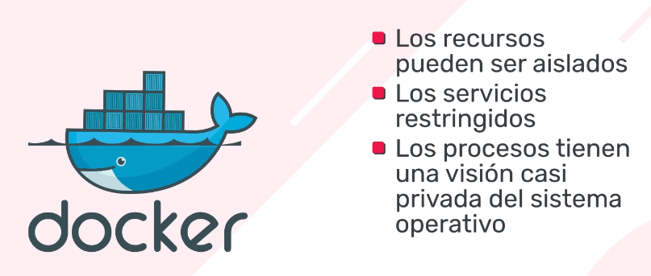

- Los recursos pueden ser aislados
- Los servicios restringidos
- Los procesos tienen una vision casi privada del sistema operativo

con:

- Su identificados de espacio de proceso
- Estructura del sistema de archivos
- Interfaces de red

Entonces:
Contenedores multiples, comparten el mismo nucleo pero cada contenedor puede ser restringido a usar solo una cantidad definida de recursos. Como CPU y memoria.

> ### 💡
>
> Encapsulando las dependencias, se trabaja mejor en conjunto.

> #### 📑
>
> pdf: Containers y Plataforma de Docker.pdf

## Plataforma de Docker <a id='c13b'></a>


### Docker Engine

✅ También conocido como `Docker daemon`

✅ Es el programa que permite **construir**, **enviar** y **ejecutar** contenedores.

✅ Utiliza espacios de nombres y grupos de control del kernel de Linux para proporcionar un entorno de tiempo de ejecución aislado para cada aplicación.

### Docker Hub

Es un registro en línea de imágenes de Docker

✅ Docker Hub es un servicio de registro de repositorios proporcionado por Docker Inc. Compartir y colaborar son sus premisas.

✅ Nos permite extraer y enviar imágenes de la ventana
acoplable hacia y desde Docker Hub

✅ Es un repositorio en línea basado en la nube que almacena ambos tipos de repositorios, es decir, el repositorio público y el privado.
Los repositorios públicos son accesibles para todos, pero el privado es accesible para el propietario interesado de los repositorios.

> ### 💡
>
> Podemos tratar esto como un GitHub, donde obtenemos y enviamos nuestro código fuente, pero en el caso de Docker Hub descargamos o publicamos nuestras imágenes de contenedor.

#### Caracteristicas

1. Repositorios de imágenes:
   Nos ayuda a encontrar y extraer imágenes de contenedores de Docker Hub.

2. Equipo y organizaciones:
   Nos permite crear grupos de trabajo e impulsar los repositorios privados, que están disponibles para su uso únicamente dentro de nuestra organización.
   De esta forma, hemos gestionado el acceso a nuestros repositorios privados de imágenes de contenedores

3. Integración de GitHub y Bitbucket:
   Permite la integración con repositorios de código fuente como GitHub y Bitbucket.

4. Construcciones automatizadas:
   Si se ha enviado algún cambio en el código fuente a los repositorios, automáticamente detecta y crea imágenes de contenedor desde GitHub o Bitbucket y las envía a Docker Hub

5. Webhooks:
   Una vez que hemos enviado nuestras imágenes con éxito, con la ayuda de un webhook, desencadena una acción para integrar Docker Hub con otros servicios.

6. Imágenes oficiales y del editor:
   Las imágenes de alta calidad proporcionadas por los dockers se consideran imágenes oficiales y se pueden extraer y utilizar. Del mismo modo, las imágenes de alta calidad proporcionadas por proveedores externos son imágenes del editor —también llamadas imágenes certificadas— que brindan soporte y garantía de compatibilidad con Docker Enterprise.

### Docker Trusted Registry

Es un registro privado en el sitio para imágenes de Docker.

✅ Los registros Docker sirven para almacenar las diversas imágenes Docker que utilicemos en nuestro sistema.
De esta forma podremos subir imágenes nuevas a los registros o descargarlas cuando las necesitemos en alguna máquina Docker.

✅ El registro es como una estantería donde las imágenes se almacenan y están disponibles para extraerlas con el fin de compilar contenedores que ejecuten servicios o aplicaciones web.

✅ Hay registros de Docker privados a nivel local y en la nube pública.

✅ Docker Hub es que un registro público mantenido por Docker; junto con Docker Trusted Registry, una solución a nivel empresarial

✅ Colocar imágenes en un registro permite almacenar fragmentos de la aplicación que son estáticos e inmutables, incluidas todas sus dependencias a nivel de marco. Después, esas imágenes se pueden versionar e implementar en varios entornos y, por lo tanto, proporcionar una unidad de implementación coherente.

### Docker Client

✅ Es el que toma las entradas del usuario y las envía al daemon.

✅ El cliente y el daemon pueden ejecutarse en el mismo host o en diferentes hosts.

### Docker Images

✅ Es una plantilla de solo lectura utilizada para crear contenedores.

✅ Contiene un conjunto de instrucciones para crear los contenedores

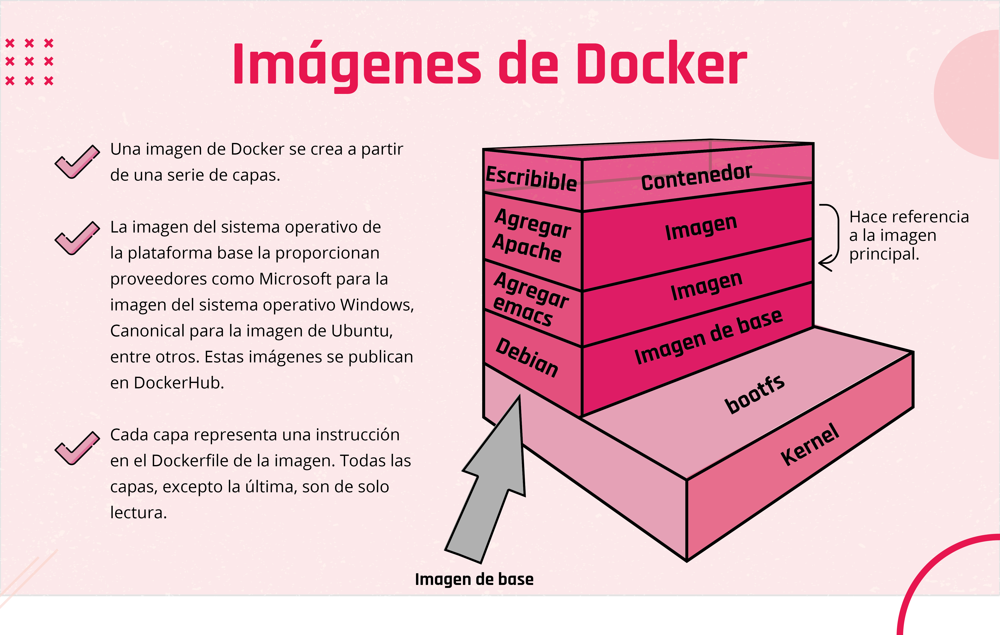

### Docker Containers

Es una plataforma de aplicación aislada basada en una o más imágenes que contiene todo lo necesario para ejecutar una aplicación

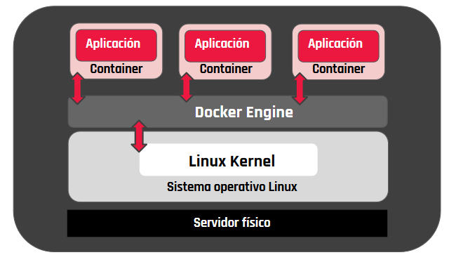

### Docker Compose

Aprender a utilizar Docker Compose

Docker Compose es una herramienta que permite simplificar el uso de Docker. A partir de archivos YAML es más sencillo crear contendores, conectarlos, habilitar puertos, volúmenes, etc.

✅ Con Compose podemos crear diferentes contenedores y al mismo tiempo, en cada contenedor, diferentes servicios, unirlos a un volumen común, iniciarlos y apagarlos, etc.

✅ Es un componente fundamental para poder construir aplicaciones y microservicios.

✅ En vez de utilizar Docker vía una serie inmemorizable de comandos Bash y scripts, Docker Compose te permite mediante archivos YAML para poder instruir al Docker Engine a realizar tareas, programáticamente. Y esta es la clave, la facilidad para dar una serie de instrucciones y luego repetirlas en diferentes ambientes.

**¿Por qué utilizar Docker con Docker Compose?**

Docker y Docker Compose nos brindan algunos beneficios:

- No necesitamos instalar ni mantener software adicional en nuestro equipo.
- Podemos tener todo nuestro entorno de desarrollo en un único repositorio, por ejemplo, tenemos el back end, el front end y las configuraciones de la base de datos en un mismo repositorio lo que facilita a los desarrolladores el poder colaborar de mejor manera en el proyecto.
- Levantar todo el entorno de desarrollo se limita a un solo comando

```
docker-compose up.
```

#### Desventaja

Pero no todo es color de rosa, también tenemos una desventaja que está enfocada al rendimiento, ya que a pesar de que los contenedores están enfocados a ser eficientes, siguen consumiendo recursos de la máquina anfitriona tales como procesador y memoria por lo que si la cantidad de contenedores que están corriendo al mismo tiempo es grande o si los contenedores son pesados al momento de crearse y levantarse, podrían llevar a cuelgues del sistema y cosas similares.


### Docker Swarm

Es una herramienta integrada en el ecosistema de Docker que permite la gestión de un cluster de servidores. Pone a nuestra disposición una API con la que podemos administrar las tareas y asignación de recursos de cada contenedor dentro de cada una de las máquinas.


## Desafio de la virtualización


## Maquina virtual vs Contenedores <a id='c13c'></a>

[Link](https://view.genial.ly/60d4f1dc1c0f540d68e8011f)


### Sistema operativo duplicado

Las máquinas virtuales deberán contener el sistema operativo y todos los componentes de soporte.

### Arquitectura del contenedor

✅ Los contenedores ofrecen una alternativa a la ejecución de aplicaciones directamente en el host o en una máquina virtual que puede hacer que las aplicaciones sean más rápidas, portátiles y escalables.

✅ La flexibilidad proviene de que el contenedor puede llevar todos los archivos que necesita. Al igual que la aplicación que se ejecuta en una máquina virtual, puede tener sus propios archivos de configuración y bibliotecas dependientes, además de tener sus propias interfaces de red distintas de las configuradas en el host.

Entonces, nuevamente, al igual que con la VM:

✅ Una aplicación en contenedores debería poder moverse más fácilmente que sus contrapartes instaladas directamente y no tener que competir por los mismos números de puerto porque cada contenedor en el que se ejecutan tiene interfaces de red separadas.

## Docker en accion


## Taxonomia basica en Docker


### Containers <a id='c13a'></a>

#### Entornos fisicos

- Aplicaciones construidas e implementadas tradicionalmente en sistemas físicos con relación 1:1.
- Las nuevas aplicaciones a menudo requieren nuevos sistemas físicos para el aislamiento de recursos

#### Entornos virtuales

- Mejor utilización e implementación de aplicaciones, más rápidas que en un entorno físico tradicional.
- Las aplicaciones implementadas en máquinas virtuales son muy compatibles.

#### Entornos fisicos y virtuales

✅ Aceleran aún más la implementación de la aplicación.

✅ Reducen el esfuerzo para implementar aplicaciones.

✅ Optimizan el desarrollo y las pruebas.

✅ Menores costos asociados con la implementación de aplicaciones.

✅ Incrementan la consolidación de servidores.

> #### 📑
>
> pdf: DockerFile

## Dockerfile

Es un archivo de texto simple con un conjunto de comandos o instrucciones.

Estos comandos / instrucciones se ejecutan sucesivamente para realizar acciones en la imagen base para crear una nueva imagen de la ventana acoplable.

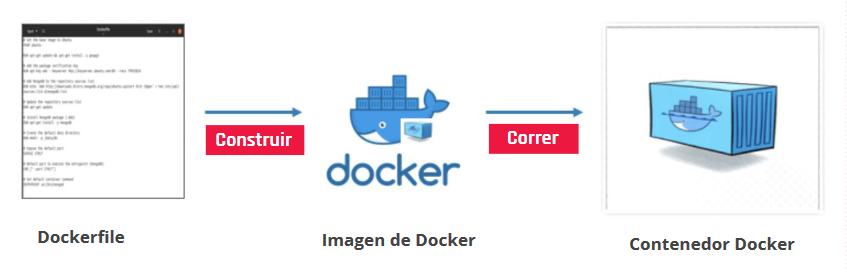

### Instrucciones básicas de Dockerfile

`DE`: Define la imagen base para usar e iniciar el proceso de construcción.

`CORRER`: Toma el comando y sus argumentos para ejecutarlo desde la imagen.

`CMD`: Función similar a un comando run, pero se ejecuta solo después de que se crea una instancia del contenedor.

`PUNTO DE ENTRADA`: Se dirige a su aplicación predeterminada en la imagen cuando se crea el contenedor.

`AÑADIR`: Copia los archivos de origen a destino (dentro del contenedor).

`ENV`: Establece variables de entorno.

### Etiquetas de imagen

Los tags o etiquetas sirven para identificar las versiones de las imágenes, a la hora de listar las imágenes se listan con su tag o etiqueta asociado.

Pueden agrupar sus imágenes usando nombres y etiquetas (si no proporcionan ninguna etiqueta, se asume el valor predeterminado de la última).

> #### 📑
>
> pdf: Ejercicio Docker

docker container run -d --name spaghettidocker -p80:80 davidpigna/spaghettidocker

Parametros

`-d` ejecuta en segundo plano
`-p` publish

# C14 - El ecosistema de Docker y mejores practicas <a id='c14'></a>

Algunas de estas buenas prácticas son simples recomendaciones que te van a venir bien a la hora de actualizar o mantener esas imágenes. Te invitamos a conocerlas.

## Creacion de una imagen <a id='c14a'></a>

> #### 📑
>
> pdf: Docker hub > Regsitro > Creacion de repositorio

El proceso de crear una imagen requiere un Dockerfile.
Podemos pensar un Dockerfile como un manual de instrucciones que le dice a Docker qué ensamblar. En resumen, es un archivo de configuración que sigue ensamblando instrucciones.

**¿Cómo funciona?**

Docker lee las instrucciones de un Dockerfile y crea imágenes automáticamente. La imagen de Docker es un sistema de archivos en capas y consta de varias capas de solo lectura. Cada capa de una imagen de Docker representa las instrucciones de un Dockerfile.

A continuación, sigamos los pasos para crear una imagen usando un Dockerfile que especifica la configuración de nuestra aplicación

```
# sudo vim Dockerfile
```

```
FROM ubuntu:16.04
ENV DEBIAN_FRONTEND noninteractive
MAINTAINER someuser@somedomain.com
RUN apt-get update
RUN apt-get install mysql-server -y
CMD echo "My first image created."
```

Echemos un vistazo a algunas de las palabras clave importantes que se utilizan en Dockerfile. Podemos utilizar `#` para agregar un comentario en un Dockerfile.

**FROM** (de): define la imagen base que se utilizará.

**MANTEINER** (mantenedores): persona que va a mantener esa imagen.

**RUN** (correr): se utiliza para ejecutar la instrucción dada para la imagen. En nuestro caso, primero actualiza el sistema y luego instala MySQL.

**CMD**: se utiliza para ejecutar un comando una vez que se ha lanzado el contenedor.

**COPY** (copiar): se utiliza para copiar un archivo de nuestro sistema operativo host al contenedor de la ventana acoplable.

**EXPOSE** (exponer): se utiliza para especificar el número de puerto en el que el contenedor ejecutará su proceso.

Una vez que nuestro Dockerfile se ha creado correctamente, debemos ejecutar docker build para “armar” nuestra imagen localmente, para luego enviarla a Docker Hub. Este comando debemos ejecutarlo dentro de la carpeta donde se encuentra el Dockerfile.

```
docker build ./ -t asadali08527/first-repo
```

Podemos verificar que la imagen está creada con la siguiente línea de código:

```
docker image ls
```

Una vez que nuestra imagen se ha creado correctamente y se está ejecutando, podemos enviarla a Docker Hub mediante el comando push.

```
docker push asadali08527/first-repo
```

Podemos verificar las etiquetas de la imagen y el estado en Docker Hub.

### Las imágenes certificadas por Docker

Estas son las imágenes oficiales impulsadas por proveedores o contribuyentes.
Una imagen solo puede ser certificada por Docker Hub si su contenido cumple con las reglas, estándares y leyes proporcionadas por Docker Hub.

En resumen, esa imagen debe pasar ciertas pruebas de referencia.

Docker Hub proporciona `inspectDockerImage`, herramienta a través de la cual un proveedor puede autocertificar las imágenes y los complementos (por lo general, el proveedor o contribuyente publica sus complementos para registrar volúmenes y redes).

### Imágenes populares en Docker Hub

Hay muchas imágenes seleccionadas y optimizadas disponibles en Docker Hub.
La popularidad de estas imágenes depende de varios factores, presencia en el mercado, calificaciones, puntajes de satisfacción, entre otros.
Para obtener una lista detallada de los repositorios más populares, podés visitar el sitio web de Docker Hub.
El uso de una imagen también depende del sistema operativo y su arquitectura.

Si conocemos para qué sistema operativo y arquitectura se utilizarán las imágenes, debemos considerar los siguientes factores clave antes de extraer una imagen:

✅ Buscar una versión específica utilizando etiquetas (principalmente la última).

✅ Optar por el que tenga máxima cantidad descargas y estrellas.

✅ Buscar la fecha de su última actualización.

✅ Si es posible, verificar su tipo, ya sea del editor verificado u oficial (Docker Certified)

## Las redes de Docker <a id='c14b'></a>

Nos vamos a enfocar en el driver llamado `bridge`, ya que con el nuevo enfoque de Docker orientado a habilitar a los desarrolladores es el que mayoritariamente le darán uso en sus computadoras.

Todos los otros drivers están orientados a ambientes productivos, pero ese ámbito hoy está dominado por Kubernetes, que tienen otro modelo de Networking completamente diferente.

Las redes de tipo “bridge” son locales y exclusivas del host en donde fueron creadas.

- Son el tipo de red por defecto en Docker.
- Simula la creación de switches o hubs, de nivel 2 (en el modelo OSI). Podemos utilizar herramientas como ‘brctl’ en Linux para ver el funcionamiento interno.
- Luego de la instalación de Docker se crea por defecto una red de tipo bridge llamada `“bridge”`, las buenas prácticas indican que esta no debe ser utilizada y en su lugar se deben crear nuevas redes para usos específicos.

### Bridge Driver en acción

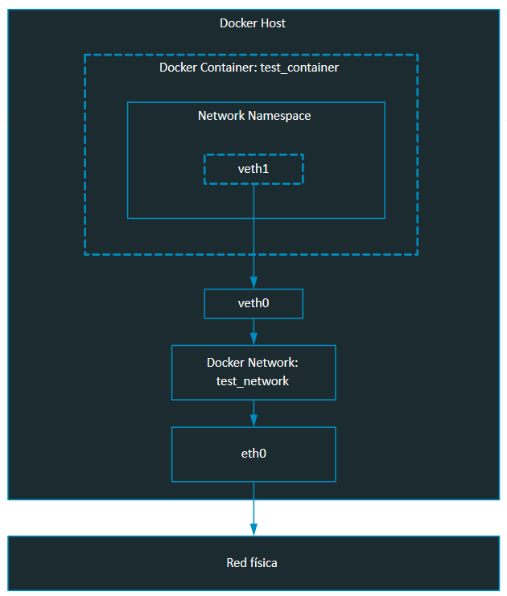

### Resolución de nombres

Las IPs son efímeras y más aún en el mundo de los containers —estos también deberían serlo—. De modo que necesitamos una forma que le permita a un container hablar con otro sin conocer necesariamente la IP que le fue asignada.

Para todas las redes que creemos —las redes creadas por defecto no nos proveen esta ventaja—, y para todos los containers a los que se le asigne un nombre de manera deliberada —usando

```
--name  en  docker  create
```

— conectados a estas, Docker nos provee con un servicio de resolución de nombres dentro del ámbito de la red misma utilizando el nombre del container para identificarlo por medio del servicio DNS.

`docker network`

`- create`: nos permite crear una red.

`--internal`: agrando esta opción la red creada será del tipo ‘privada’.

`- connect`: nos permite conectar un container existente a una red.

`docker run`

`--network <networkName>`: nombre de la red a la cual conectaremos el container.

`--name`: nombre del container, necesario para que funcione la resolución de nombres.

`-p <hostPort>:<containerPort>`: nos permite publicar ciertos puertos de un container en el host para poder acceder al servicio dentro del container.

`-P`: nos permite publicar todos los puertos definidos en la especificación del container (Dockerfile) en puertos aleatorios del host.

## Mejores practicas en Docker <a id='c14c'></a>

[Link](https://view.genial.ly/614cd9344691c70d429b489c)

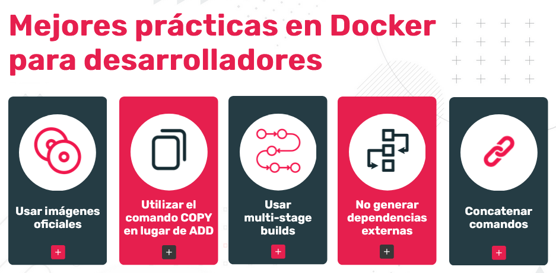

### Usar imágenes oficiales

En Docker Hub vamos a encontrar 2 tipos de imágenes. Las oficiales, publicadas por organizaciones (por ejemplo, Ubuntu) o las publicadas por usuarios individuales. ¿Cómo diferenciarlas? Las imágenes oficiales están etiquetadas como tal en el sitio de Docker Hub. Si buscamos Ubuntu, vamos a ver que las imágenes publicadas por Canonical están etiquetadas como Docker Official Image.

Sin embargo, la manera más práctica para entender si una imagen es oficial o no, es su nombre. Las imágenes no oficiales incluyen el nombre del usuario que las publicó, mientras que las oficiales, no. Veamos la diferencia a la hora de ejecutar “docker pull”. Para una imagen oficial sería:

```
docker pull ubuntu:latest
```

Mientras que para una imagen que no lo es, el comando se vería así:

```
docker pull usuario/nginx:latest.
```

En el caso de la imagen no oficial, seguramente contenga un servidor Nginx, pero no sabemos (por lo menos sin realizar un análisis más detallado) qué otras modificaciones podría haber incluido el usuario que publicó la imagen.

### Utilizar el comando COPY en lugar de ADD

Ambos permiten agregar o copiar un archivo de una fuente externa a una imagen de Docker. ADD fue el primero en ser creado para la especificación de los Dockerfiles. La gran diferencia reside en que **ADD soporta copiar desde distintos orígenes**. Por ejemplo, puede agregar un archivo hosteado en la web, puede agregar un archivo que está en un filesystem de la máquina que está compilando el Dockerfile y también puede desempaquetar un archivo .tar (tarball, un formato de empaquetado nativo de Unix/Linux). El problema es que ADD —al hacer un montón de cosas— puede generar confusión, incluso algunos inconvenientes técnicos (¿qué pasa si quiero copiar un archivo .tar a la imagen en lugar de descomprimirlo?) y hasta generar problemas de performance.

**COPY**, por el contrario, fue introducido más tarde para cumplir la función específica de **copiar un archivo desde un filesystem local a la imagen**. Incluso COPY, al tener un propósito más específico, facilita la lectura del Dockerfile.

En términos generales, se recomienda:

- Usar COPY para copiar archivos locales a la imagen en tiempo de compilación.
- Usar RUN para ejecutar curl y encadenar con otros comandos para bajar un archivo de una fuente web y copiarlo, instalarlo o descomprimirlo.
- Usar ADD cuando se tiene un archivo .tar y se lo quiere desempaquetar dentro de la imagen que se está construyendo.

### Usar multi-stage builds

Esta es una práctica un tanto compleja, pero vale la pena saber que existe. Nos permite generar imágenes más pequeñas incluyendo explícitamente solo aquellos componentes necesarios para ejecutar una aplicación.

Hasta ahora, debés haber visto Dockerfiles que incluyen un solo FROM. En los multi-stage builds, los Dockerfiles tienen dos o más ocurrencias de FROM. Esto produce varias imágenes etéreas durante el proceso de “build” y nos permite copiar elementos entre ellas, hasta **generar una imagen definitiva con solo aquello estrictamente necesario para ejecutar la aplicación**.

En esta práctica, por lo general, se usa una primera imagen de base (especificada en el primer FROM), en la que copiamos el código fuente de nuestra aplicación y contamos con las herramientas necesarias para compilarla. Luego, indicamos un segundo FROM dentro del mismo Dockerfile, haciendo referencia a una imagen de base que tiene solo lo necesario para ejecutar la aplicación, pero no así las herramientas de compilación. Y copiamos el artefacto generado producto de la compilación en el primer container, al segundo.

### No generar dependencias externas

Los contenedores que construyamos tienen que ser trasladables. No importa en dónde corran, deben poder contar con todo lo necesario para ejecutar las aplicaciones que viven en ellos.

Es natural que los desarrolladores se sientan tentados a montar directorios del equipo en el que desarrollan dentro de un container para así acelerar el ciclo de desarrollo. En lugar de tener que compilar la imagen cada vez que desean probar su aplicación y copiar los artefactos necesarios dentro de ella, es más sencillo mapear un directorio local y dejar allí los componentes actualizados.

Esta práctica puede llevar a que, a la hora de correr las aplicaciones en producción, haya dependencias no resueltas.
De modo que, contrario a lo que se especifica aquí: <https://docs.docker.com/develop/dev-best-practices/#differences-in-development-and-production-environments>, recomendamos que no utilices volúmenes de tipo bind en los ambientes de desarrollo.

### Concatenar comandos

Muchas veces nos vamos a encontrar con líneas como esta en Dockerfiles:

```
RUN apt-get update && apt-get upgrade -y
```

En lugar de algo como:

```
RUN apt-get update
RUN apt-get upgrade -y
```

¿Por qué? Cada línea en un Dockerfile produce una nueva capa en nuestra imagen. De modo que ejecutar estos dos comandos por separado, produciría dos capas. En este caso, ambos comandos sirven al mismo propósito: actualizar los paquetes instalados en el sistema operativo. Por eso, tiene sentido concatenarlos, ya que están estrechamente relacionados, y ejecutar uno sin ejecutar el otro no tendría sentido. De esta manera, optimizamos el uso de recursos y tiempo de compilación.

Podés encontrar más información al respecto de esta práctica en: <https://docs.docker.com/develop/dev-best-practices/#how-to-keep-your-images-small>

**Conclusión**

> ### 💡
>
> Podemos probar con distintos entornos y lenguajes, la idea es conseguir optimizar al máximo nuestro entorno de desarrollo y enfocarnos en el principal objetivo que es escribir código de calidad.

> #### 📑
>
> pdf: Ejercitacion mesas

> ### 💡
>
> **Documentación de Docker**:
> – [docker network create](https://docs.docker.com/engine/reference/commandline/network_create/#specify-advanced-options)
> – [Networking Overview](https://docs.docker.com/network/)
> – [Networking with standalone containers](https://docs.docker.com/network/network-tutorial-standalone/) >**Blogs**:
> – [How Docker Container Networking Works - Mimic It Using Linux](https://dev.to/polarbit/how-docker-container-networking-works-mimic-it-using-linux-network-namespaces-9mj) >[Network Namespaces](https://dev.to/polarbit/how-docker-container-networking-works-mimic-it-using-linux-network-namespaces-9mj) >**Libro**:
> – [Poulton, N. (2017). Docker Deep Dive.](https://www.amazon.com/-/es/Nigel-Poulton/dp/1521822808)

# C15 - Repaso

> #### 📑
>
> pdf: Armemos un ambiente con Docker
--

> fuente (L. Ospina)
