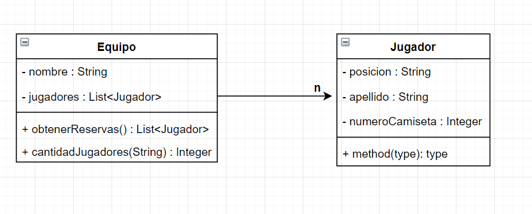

<link rel="stylesheet" type="text/css" media="all" href="../styles.css" />

# Actividad: Mundial de futbol

**Enunciado**

Al mundial de fútbol la `selección argentina` lleva `un plantel de 23 jugadores`, de los cuales se conoce su `posición` (“ARQUERO”, “DEFENSOR”, “MEDIOCAMPISTA” o “DELANTERO”), `apellido` y el `número de camiseta`. Del plantel de 23 jugadores, es sabido que los primeros 11 son los titulares, los siguientes 7 son los suplentes y los 5 restantes son de reserva.

Basado en el enunciado realizar:

A) El diagrama de clases que lo modelice, con sus relaciones, atributos y métodos.
B) La programación del método `obtenerReservas` que devuelva (no muestre por consola) a todos los jugadores de reserva de la selección.

> ### 💡
> No recibe nada porque trabaja sobre su lista de jugadores
> Devuelve una lista.

C) La programación del método `cantJugadores` que recibe como parámetro una posición y devuelva la cantidad de jugadores en esa posición. Si la posición no es ninguna de las mencionadas arrojar una excepción.

> ### 💡
> recibe String que es la posicion del jugador, devuelve un integer

**Solucion**

### UML



### Clases

En `Jugador.java`

```java
package com.company;

public class Jugador {

    private String apellido;
    private String posicion;
    private Integer numeroCamiseta;

    public Jugador(String apellido, String posicion, Integer numeroCamiseta) {
        this.apellido = apellido;
        this.posicion = posicion;
        this.numeroCamiseta = numeroCamiseta;
    }
    //Necesitamos el getter para obtener la posicion del jugador
    public String getPosicion() {
        return posicion;
    }

    public Integer getNumeroCamiseta() {
        return numeroCamiseta;
    }
}
```

En `Equipo.java`

```java
package com.company;

import java.util.ArrayList;
import java.util.List;

public class Equipo {

    private String nombre;
    private List<Jugador> jugadores;

    public Equipo(String nombre) {
        this.nombre = nombre;
        //Importante no olvidar inicializar la lista ⬇
        this.jugadores = new ArrayList<>();
    }

    //Necesitamos este metodo para agregar jugador, ahora podemos crear el jugador en el main
    public void agregarJugador(Jugador jugador){
        jugadores.add(jugador);
    }
    
    // Busca jugador por el numero de camiseta y se evita que sea nulo con el throws
    public Jugador buscarJugador(Integer numeroDeJugador) throws EquipoException {
        
        //forEach usamos para recorrer y buscar
        Jugador jugadorBuscado = null;
        for (Jugador jugador : jugadores) {
            if (jugador.getNumeroCamiseta().equals(numeroDeJugador)){
                // Asigna el jugador a la variable jugadorBuscado
                jugadorBuscado = jugador;
                //Si encuentra el jugador deja de iterar con break
                break;
            }
        }
        if(jugadorBuscado != null){
            return jugadorBuscado;
        }else {
            //Si es nulo devuelve el error:
            throw new EquipoException("no existe el jugador con ese numero");
        }
    }

    //Recibe String que es la posicion buscada 
    public Integer cantidadJugadores(String posicion) throws EquipoException {
        // Si posiciones validas no contiene a la posicion se crea una excepcion y le mandamos como mensaje el error.
        if(!(posicionesValidas().contains(posicion))){
            throw new EquipoException(posicion + " no es una posicion valida");
        }
        //Hacemos un contador e iteramos. y obtener la posicion con el get de jugador
        Integer jugadoresEnPosicion = 0;
        for (Jugador jugador : jugadores) {
            if(jugador.getPosicion().equals(posicion)){
                jugadoresEnPosicion++;
            }
        }
        return jugadoresEnPosicion;
    }

    //Devuelve lista de jugador, usamos este for porque importa la posicion en la lista
    public List<Jugador> obtenerReservas(){
        //Variable lista de reserva
        List<Jugador> reserva = new ArrayList<>();
        //En vez de length es size()//Arranca en 17 y termina en el largo de la lista porque los ultimos 5 son la reserva.
        for (int i = 17; i < jugadores.size(); i++) {
            reserva.add(jugadores.get(i));
        }
        return reserva;
    }

    //Devuelve lista de Strings de posiciones que son validas
    private List<String> posicionesValidas(){
        List<String> posicionesValidas = new ArrayList<>();
        //Agregamos las posiciones que son validas.
        posicionesValidas.add("DELANTERO");
        posicionesValidas.add("ARQUERO");
        posicionesValidas.add("MEDIOCAMPISTA");
        posicionesValidas.add("DEFENSOR");
        posicionesValidas.add("AGUATERO");
        return posicionesValidas;
    }
}
```

En `EquipoException.java`

```java
package com.company;

public class EquipoException extends Exception {
    public EquipoException(String message) {
        super(message);
    }
}
```

En `Main.java`

```java
package com.company;

public class Main {

    public static void main(String[] args) {
        //Instanciamos el equipo
        Equipo equipo = new Equipo("Sacachispas");
        //Creamos los jugadores
        equipo.agregarJugador(new Jugador("Colmenares","ARQUERO",1));
        equipo.agregarJugador(new Jugador("David","DEFENSOR",2));
        equipo.agregarJugador(new Jugador("David","DEFENSOR",2));
        equipo.agregarJugador(new Jugador("David","DEFENSOR",2));
        equipo.agregarJugador(new Jugador("David","DEFENSOR",2));
        equipo.agregarJugador(new Jugador("Pladino","MEDIOCAMPISTA",5));
        equipo.agregarJugador(new Jugador("Pladino","MEDIOCAMPISTA",5));
        equipo.agregarJugador(new Jugador("Pladino","MEDIOCAMPISTA",5));
        equipo.agregarJugador(new Jugador("Pladino","MEDIOCAMPISTA",5));
        equipo.agregarJugador(new Jugador("Pladino","MEDIOCAMPISTA",5));
        equipo.agregarJugador(new Jugador("Pladino","MEDIOCAMPISTA",5));
        equipo.agregarJugador(new Jugador("Coronel","DELANTERO",10));
        equipo.agregarJugador(new Jugador("Coronel","DELANTERO",10));

        //Preguntamos cantidad de jugadores, como hay una posible excepcion le ponemos un Try Catch
        try {
            System.out.println(equipo.cantidadJugadores("MEDIO"));
        } catch (EquipoException e) {
            //Medio no es una posicion valida entonces devuelve el error pero no para el codigo.
            e.printStackTrace();
        }
    }
}

```
## [⏪ Atrás](../README.md)