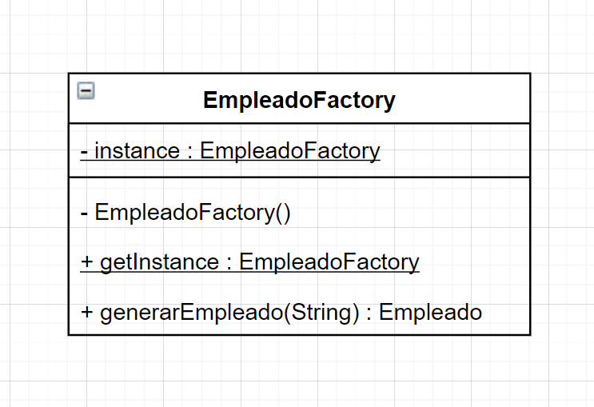

<link rel="stylesheet" type="text/css" media="all" href="../styles.css" />

# Actividad: Empresas Factory

Dada la siguiente familia de clases, se te encomienda el desafío de optimizar el diseño, teniendo en cuenta que necesitamos construir objetos de estas clases a partir de diferentes parámetros establecidos.


Si recibimos como parámetro “EMP-INT” deberás poder construir un objeto de la clase EmpleadoRelacionDependencia con un sueldo de 1000 dolares y si el parámetro es “EMP-EXT” deberás poder construir un objeto de la clase EmpleadoContratado con un importe por hora de 7 dolares y una retencion impuesto de 14%.

Basado en el enunciado realizar:

a) Modificar el diagrama de clases con la implementación del Patrón Factory
b) La programación del método calcularSueldo que devuelva (no muestre por consola) el sueldo para la cantidad de días que dicho método reciba como parámetro. Tener en cuanta que en el caso de los empleados en relación de dependencia se deberá calcular el proporcional a los días trabajados.

Consideraciones: Considerar que los meses tienen todos 30 días y trabajan 8 hs diarias.


## **Solucion**

### UML de la fabrica

**Singleton**
- Se garantiza que solo haya una instancia de EmpleadoFactory con el **constructor privado** solo se puede construir dentro de EmpleadoFactory
- Se garantiza que solo haya un EmpleadoFactory en todo el sistema con `instance` que hace por default la fabrica, que sera tipo de dato EmpleadoFactory
- Garantizamos que solo exista un EmpleadoFactory haciendo `-instance: EmpleadoFactory` un atributo estatico : <r>`-instance: EmpleadoFactory`</r>
- `getInstance()` Es publico y devuelve el EmpleadoFactory y como instance es estatico getInstance tambien es estatico.

**La parte de fabrica**

Le damos a otro objeto al responsabilidad de crear instancias `Empleado`

- Metodo publico que genere empleado, recibe string que es un codigo y basado en eso construye el empleado



## Clases

En `Empleado.java`

```java
package com.company;

public abstract class Empleado {

    private String nombre;
    private String apellido;
    private Integer legajo;

    public Empleado() {
    }

    public Empleado(String nombre, String apellido, Integer legajo) {
        this.nombre = nombre;
        this.apellido = apellido;
        this.legajo = legajo;
    }

    public abstract Double calcularSueldo(Integer dias);
}
```

En `EmpleadoContratado.java`

```java
package com.company;

public class EmpleadoContratado extends Empleado {

    private Double importePorHora;
    private Double retencionImpuesto;

    public EmpleadoContratado() {
    }

    public EmpleadoContratado(String nombre, String apellido, Integer legajo) {
        super(nombre, apellido, legajo);
    }

    public EmpleadoContratado(Double importePorHora, Double retencionImpuesto) {
        this.importePorHora = importePorHora;
        this.retencionImpuesto = retencionImpuesto;
    }

    @Override
    public Double calcularSueldo(Integer dias) {
        return null;
    }

    @Override
    public String toString() {
        return "EmpleadoContratado{" +
                "importePorHora=" + importePorHora +
                ", retencionImpuesto=" + retencionImpuesto +
                '}';
    }
}

```

En `EmpleadoFactory.java`: 

```java
package com.company;

public class EmpleadoFactory {
    //Atributo estatico llamado instance
    private static EmpleadoFactory instance;

    //Creacion de constantes, tienden a ser publicas, por convencion van en MAYUS y separados con guion bajo
    public static final String CODIGO_EMPLEADO_CONTRATADO = "EMP-EXT";
    public static final String CODIGO_EMPLEADO_RD = "EMP-INT";

    //Tenemos un constructor privado, esto evita que se instancie 2 veces EmpleadoFactory
    private EmpleadoFactory() {
    }

    //Si la instancia esta en null creamos EmpleadoFactory, si no, retorna la instancia.
    public static EmpleadoFactory getInstance() {
        if(instance == null){
            instance = new EmpleadoFactory();
        }
        return instance;
    }
    //Parte fabrica, tienen a recibir solo 1 atributo. En este caso String codigo, usamos las constantes 
    public Empleado generarEmpleado(String codigo){
        switch (codigo) {
            case CODIGO_EMPLEADO_RD:
                return new EmpleadoRelacionDependencia(1000.0);
            case CODIGO_EMPLEADO_CONTRATADO:
                return new EmpleadoContratado(7.0,14.0);
            default:
                return null;
        }
    }
}
```

En `EmpleadoRelacionDependencia.java`

```java
package com.company;

public class EmpleadoRelacionDependencia extends Empleado {

    private Double sueldoMensual;

    public EmpleadoRelacionDependencia(Double sueldoMensual) {
        this.sueldoMensual = sueldoMensual;
    }

    @Override
    public Double calcularSueldo(Integer dias) {
        return null;
    }

    @Override
    public String toString() {
        return "EmpleadoRelacionDependencia{" +
                "sueldoMensual=" + sueldoMensual +
                '}';
    }
}
```

En `Main.java`

```java
package com.company;

public class Main {

    public static void main(String[] args) {
	
    //Las 2 instancias son iguales, ocupan el mismo espacio en mmemoria, apuntan al mismo objeto. En la vida real no hay 2, solo es 1 ya que es lo mismo.
    EmpleadoFactory empleadoFactory = EmpleadoFactory.getInstance();
    EmpleadoFactory otraEmpleadoFactory = EmpleadoFactory.getInstance();

    //Le pide a la fabrica que codigo tiene. En este caso CODIGO_EMPLEADO_CONTRATADO
    Empleado empleado = empleadoFactory.generarEmpleado(EmpleadoFactory.CODIGO_EMPLEADO_CONTRATADO);
        System.out.println(empleado);
    }
}
```

## [⏪ Atrás](../README.md)
