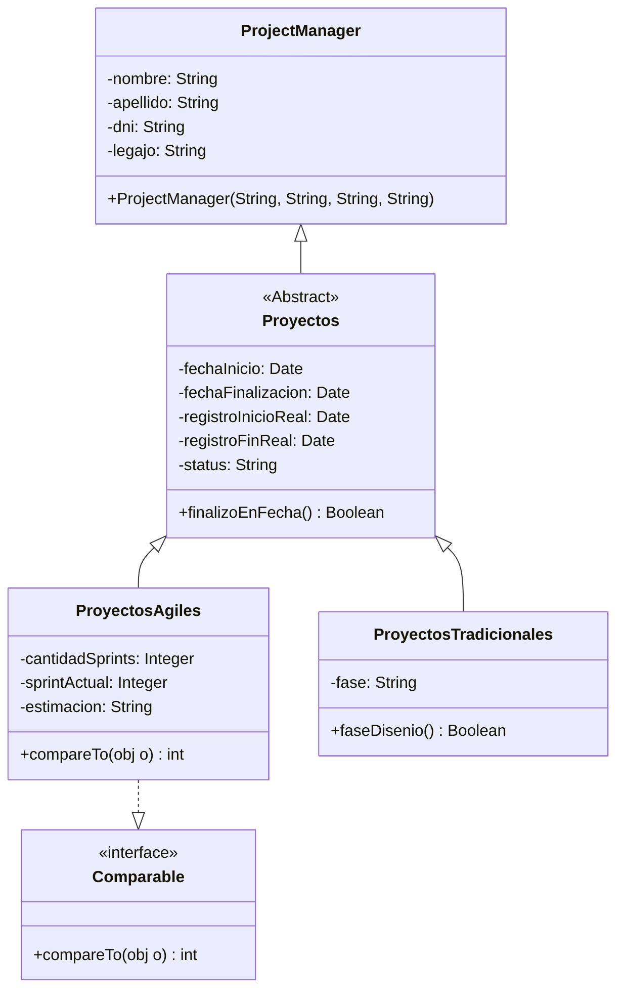

<link rel="stylesheet" type="text/css" media="all" href="../styles.css" />

# Pre - Parcial # 1:

La consultora DigitalProject necesita construir un sistema para administrar sus proyectos.
Un Proyecto solo puede tener asignado a un project manager y los datos que se necesitan de él son: el nombre, el apellido, DNI y su legajo. Utilizar un constructor que permita asignar todos estos atributos al momento de crear el objeto.

Los proyectos además de tener asociado a un project manager tienen una fecha de inicio planificada del proyecto y una fecha planificada de finalización del mismo además también deben registrarse su fecha de inicio real y su fecha de fin real y el status del mismo que puede ser: “EN INICIO”, “EN EJECUCIÓN” y “FINALIZADO”.

Existen dos variantes de proyectos: proyectos ágiles y proyectos tradicionales. De los proyectos ágiles debemos poder saber la cantidad de sprints del proyecto, el nro de sprint actual sobre el que se está trabajando y una descripción con el tipo de estimación que se utiliza en dicho proyecto. Por otro lado de los proyectos tradicionales debemos poder saber en qué fase se encuentran: “ANÁLISIS”, “DISEÑO”, “PROGRAMACIÓN”, “TESTING”, “IMPLEMENTACIÓN”

El sistema debe contar con las siguientes funcionalidades:

De cualquier tipo de proyecto debemos poder saber si finalizo en fecha, un proyecto finaliza en fecha si su fecha de fin es igual a su fecha de fin planificada y además su status está “FINALIZADO”.
En el caso de los proyectos ágiles debe ser posible compararlos. Un proyecto ágil es mayor a otro de acuerdo a la cantidad de sprints que tiene cada uno.
Es importante contar con alguna funcionalidad en los proyectos tradicionales para saber si se encuentran en fase de “DISEÑO”.

## UML



En `Proyectos.java`

```java
package com.company;

import java.util.Date;

public abstract class Proyectos {
    private ProjectManager projectManager;
    private Date fechaInicio;
    private Date fechaFinalizacion;
    private Date registroInicioReal;
    private Date registroFinReal;
    private String status;

    public Proyectos(ProjectManager projectManager, Date fechaInicio, Date fechaFinalizacion, Date registroInicioReal, Date registroFinReal, String status) {
        this.projectManager = projectManager;
        this.fechaInicio = fechaInicio;
        this.fechaFinalizacion = fechaFinalizacion;
        this.registroInicioReal = registroInicioReal;
        this.registroFinReal = registroFinReal;
        this.status = status;
    }

    public Boolean finalizoEnFecha() {
        if (fechaFinalizacion.equals(registroFinReal) && status.equals("FINALIZADO")) {
            return true;
        } else {
            return false;
        }
    }
}
```

En `ProjectManager`

```java
package com.company;

public class ProjectManager {
    private String nombre;
    private String apellido;
    private String dni;
    private String legajo;

    public ProjectManager(String nombre, String apellido, String dni, String legajo) {
        this.nombre = nombre;
        this.apellido = apellido;
        this.dni = dni;
        this.legajo = legajo;
    }
}
```

En `ProyectosAgiles`

```java
package com.company;

import java.util.Date;

public class ProyectosAgiles extends Proyectos implements Comparable{
    private Integer cantidadSprints;
    private Integer sprintActual;
    private String estimacion;

    public ProyectosAgiles(ProjectManager projectManager, Date fechaInicio, Date fechaFinalizacion, Date registroInicioReal, Date registroFinReal, String status, Integer cantidadSprints, Integer sprintActual, String estimacion) {
        super(projectManager, fechaInicio, fechaFinalizacion, registroInicioReal, registroFinReal, status);
        this.cantidadSprints = cantidadSprints;
        this.sprintActual = sprintActual;
        this.estimacion = estimacion;
    }

    @Override
    public int compareTo(Object o) {
        ProyectosAgiles otroProyecto = (ProyectosAgiles) o;
        int respuesta = 0;
        if (this.cantidadSprints > otroProyecto.cantidadSprints){
            respuesta = 1;
        }
        if (this.cantidadSprints < otroProyecto.cantidadSprints){
            respuesta = -1;
        }
        return respuesta;
    }
}
```

En `ProyectosTradicionales.java`

```java
package com.company;

import java.util.Date;

public class ProyectosTradicionales extends Proyectos{
    private String fase;

    public ProyectosTradicionales(ProjectManager projectManager, Date fechaInicio, Date fechaFinalizacion, Date registroInicioReal, Date registroFinReal, String status, String fase) {
        super(projectManager, fechaInicio, fechaFinalizacion, registroInicioReal, registroFinReal, status);
        this.fase = fase;
    }

    public Boolean faseDisenio(){
        return this.fase.equals("DISEÑO");
    }
}

```

En el `Main.java`

```java
package com.company;

import com.sun.source.tree.NewArrayTree;

import java.util.Date;

public class Main {

    public static void main(String[] args) {
	// Projects Managers
        ProjectManager pManager1, pManager2;
        pManager1 = new ProjectManager("Leandro","Chennales","15974851","abc1254");
        pManager2 = new ProjectManager("Liliana","Ospina","1587412","col1254");
        // Proyectos
        ProyectosAgiles pa1, pa2;
        pa1 = new ProyectosAgiles(pManager1, new Date(121,01,01),new Date(121,01,02),new Date(121,01,28),new Date(121,01,1),"FINALIZADO",10,2,"estimacion");

        ProyectosTradicionales pt1, pt2;
        pt1 = new ProyectosTradicionales(pManager2,new Date(121,01,01),new Date(121,01,01),new Date(121,01,01),new Date(121,01,01),"FINALIZADO","DISEÑO");
        System.out.println(pt1.faseDisenio());
    }

}

```

## [⏪ Atrás](../README.md)