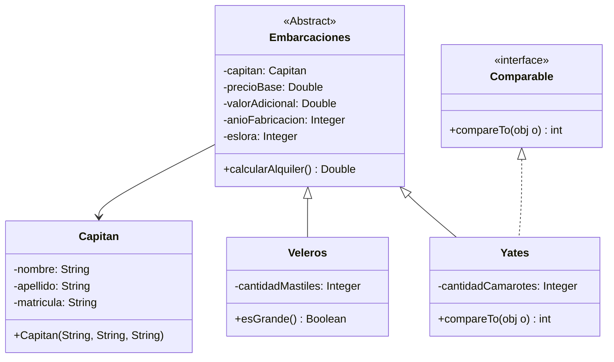

# Pre - Parcial # 3:




En `Capitan.java`
```java
package com.company;

public class Capitan {
    private String nombre;
    private String apellido;
    private Integer matricula;

    public Capitan(String nombre, String apellido, Integer matricula) {
        this.nombre = nombre;
        this.apellido = apellido;
        this.matricula = matricula;
    }
}

```
En `Embarcacion.java`

```java
public abstract class Embarcacion {
    private Capitan capitan;
    private Double precioBase;
    private Double costoAdicional;
    private Integer anioFabricacion;
    private Double eslora;

    public Embarcacion(Capitan capitan, Double precioBase, Double costoAdicional, Integer anioFabricacion, Double eslora) {
        this.capitan = capitan;
        this.precioBase = precioBase;
        this.costoAdicional = costoAdicional;
        this.anioFabricacion = anioFabricacion;
        this.eslora = eslora;
    }

    public Double calcularMontoAlquiler() {
        Double precioFinal = this.precioBase;
        if (this.anioFabricacion > 2020) {
            precioFinal = precioFinal + this.costoAdicional;
        }

        return precioFinal;
    }
}
```

En `Yate.java`

```java
package com.company;

public class Yate extends Embarcacion implements Comparable {
    private Integer cantidadCamarotes;

    public Yate(Capitan capitan, Double precioBase, Double costoAdicional, Integer anioFabricacion, Double eslora, Integer cantidadCamarotes) {
        super(capitan, precioBase, costoAdicional, anioFabricacion, eslora);
        this.cantidadCamarotes = cantidadCamarotes;
    }

    public int compareTo(Object object) {
        Yate otroYate = (Yate)object;
        if (this.cantidadCamarotes > otroYate.cantidadCamarotes) {
            return 1;
        } else {
            return this.cantidadCamarotes < otroYate.cantidadCamarotes ? -1 : 0;
        }
    }
}
```
En `Velero.java`

```java
package com.company;

public class Velero extends Embarcacion {
    private Integer cantidadDeMastiles;

    public Velero(Capitan capitan, Double precioBase, Double costoAdicional, Integer anioFabricacion, Double eslora, Integer cantidadDeMastiles) {
        super(capitan, precioBase, costoAdicional, anioFabricacion, eslora);
        this.cantidadDeMastiles = cantidadDeMastiles;
    }

    public Boolean esGrande() {
        return this.cantidadDeMastiles > 4;
    }
}
```
En el `Main.java`

```java
public class Main {
    public Main() {
    }

    public static void main(String[] args) {
        Capitan capitan = new Capitan("Tom", "Hanks", 1);
        new Yate(capitan, 5000.0D, 1000.0D, 2021, 100.0D, 6);
        Yate yate2 = new Yate(capitan, 5000.0D, 1000.0D, 2021, 100.0D, 3);
        Velero velero = new Velero(capitan, 5000.0D, 1000.0D, 2021, 100.0D, 3);
        System.out.println(yate2.compareTo(yate2));
        System.out.println(velero.esGrande());
    }
}
```
## [⏪ Atrás](../README.md)