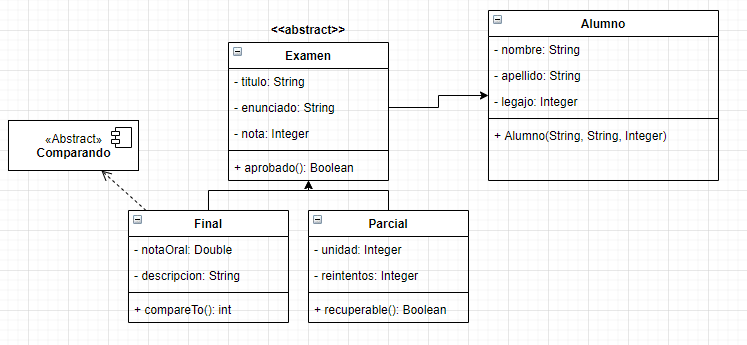

<link rel="stylesheet" type="text/css" media="all" href="../styles.css" />

# Pre - Parcial # 4:



En `Alumno.java`

```java
package com.company;

public class Alumno {
    private String nombre;
    private String  apellido;
    private Integer legajo;

    public Alumno(String nombre, String apellido, Integer legajo) {
        this.nombre = nombre;
        this.apellido = apellido;
        this.legajo = legajo;
    }
}
```

En `Examen.java`

```java
package com.company;

public abstract class Examen {
    private Alumno alumno;
    private String titulo;
    private String enunciado;
    private Integer nota;

        public Examen(Alumno alumno, String titulo, String enunciado, Integer nota) {
            this.alumno = alumno;
            this.titulo = titulo;
            this.enunciado = enunciado;
            this.nota = nota;
        }


        public Boolean aprobado(){
        return nota >=4;
    }

    public Integer getNota() {
        return nota;
    }
}
```

En `Parcial.java`

```java
package com.company;

public class Parcial extends Examen {
    private Integer unidad;
    private Integer intentos;

    public Parcial(Alumno alumno, String titulo, String enunciado, Integer nota, Integer unidad, Integer intentos) {
        super(alumno, titulo, enunciado, nota);
        this.unidad = unidad;
        this.intentos = intentos;
    }

    public Boolean recuperable(){
        if(intentos <= 3 && unidad <= 3 ){
            intentos ++;
            return true;
        }
        else if( intentos <= 2 && unidad > 3){
            intentos ++;
            return true;
        }
        else{
            return false;
        }
    }
}
```

En `Final.java`

```java
package com.company;

public class Final extends Examen implements Comparable{
    private Double notaOral;
    private String descripcion;

    public Final(Alumno alumno, String titulo, String enunciado, Integer nota, Double notaOral, String descripcion) {
        super(alumno, titulo, enunciado, nota);
        this.notaOral = notaOral;
        this.descripcion = descripcion;
    }

    @Override
    public int compareTo(Object o) {
        Final otroFinal= (Final) o;

        if ((this.getNota()+this.notaOral) > (otroFinal.getNota() + otroFinal.notaOral)){
            return 1;
        }
        else if((this.getNota()+this.notaOral) < (otroFinal.getNota() + otroFinal.notaOral)){
            return -1;
        }
        else{
            return 0;
        }
    }
}
```

En el `Main.java`

```java
package com.company;

public class Main {
    public static void main(String[] args) {
        Alumno a1= new Alumno("Pepe","Mujica",111);
        Parcial p1= new Parcial(a1,"POO","Hacer UML", 3,5,2);
        Final f1= new Final(a1,"POO","Hacer UML", 4,8.0,"Hablo de herencia");
        Final f2= new Final(a1,"POO","Hacer UML", 4,8.0,"Hablo de herencia");

        System.out.println(f1.compareTo(f2));

    }
}
```

## [⏪ Atrás](../README.md)