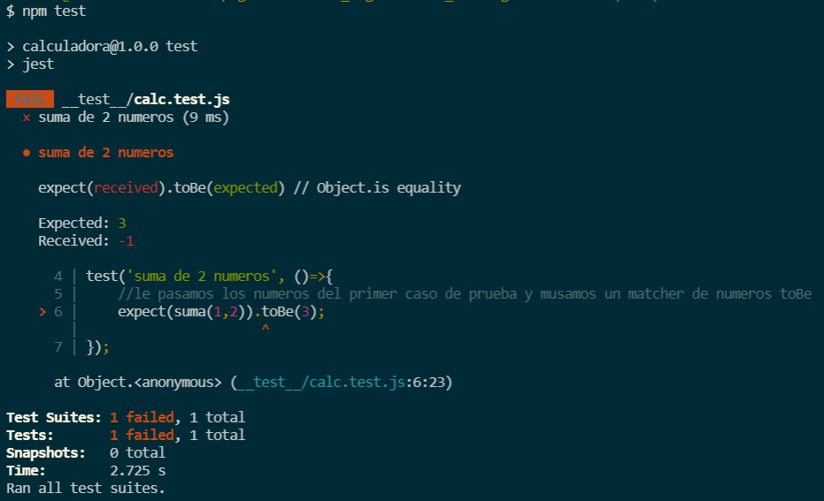
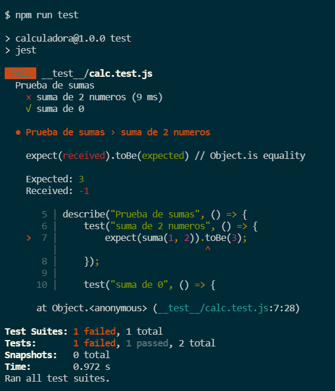
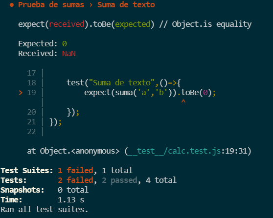

# Prueba 1: calculadora: suma

Funcion o unidad de prueba, o modulo, todo aquello que puedo aislar y probar y obtener un resultado

```js
function suma(a,b) {
    return a-b; //En vez de + ponemos - para probar
}
```
## Método `console.assert()`

Hacemos un caso de prueba con las funcionalidades que tengo de js, a `assert()` se le pasa una condición booleana, con el mismo código se puede hacer saber que hay un error en la funcion

```js
console.assert(suma(1,2)==3, 'ERROR: El resultado esperado de 1+2 es 3');
```

Podemos hacer otro caso de prueba:

```js
console.assert(suma(0,0)==0, 'ERROR: El resultado esperado de 0+0 es 0');
```

Necesitamos de varios casos de prueba para verificar que existe un error en mi funcionalidad

### 📜 Ejemplo!

```js
function suma(a,b) {
    return a-b; //En vez de + ponemos - para probar
}
// Caso de prueba 1:
console.assert(suma(1,2)==3, 'ERROR: El resultado esperado de 1+2 es 3');

// Caso de prueba 2
console.assert(suma(0,0)==0, 'ERROR: El resultado esperado de 0+0 es 0');
```

Si hay muchos casos de prueba, necesitamos un framework que genere un reporte de resultados.

Los frameworks se instalan en las dependencias:

1. npm init
2. 
3. y

Esto crea el package json 
4. instalamos jest


EN CONSOLA


```
{
  "name": "calculadora",
  "version": "1.0.0",
  "description": "",
  "main": "calc.js",
  "scripts": {
    "test": "jest"
  },
  "keywords": [
    "test",
    "jest"
  ],
  "author": "Liliana",
  "license": "MIT"
}


Is this OK? (yes) Y
```
El siguiente comando va a instalar todas las librerías y dependencias en el entorno de desarrollo


```
npm install --save-dev jest
```
añade la dependencia de jest con la version

***

Trasladamos los casos de prueba a jest para que ejecute los unit test

## Convenciones de jest

✅ Todos los archivos de prueba deben estar en una carpeta llamada `__test__`

✅ Dentro de esa carpeta van los archivos: `calc.test.js`

> ### 💡
> Es un archivo de prueba por la extencion: `.test.js`

Este código ya no lo necesito en `calc.js`

```js
// Caso de prueba 1:
console.assert(suma(1,2)==3, 'ERROR: El resultado esperado de 1+2 es 3');

// Caso de prueba 2
console.assert(suma(0,0)==0, 'ERROR: El resultado esperado de 0+0 es 0');
```

Necesitamos exportar la funcion que luego se importara desde los archivos de prueba

En `calc.js`

```js
function suma(a,b) {
    return a-b; //En vez de + ponemos - para probar
}

module.exports = suma;
```

En el archivo de prueba `calc.test.js` importo

```js
const suma = require('../calc.js');
```

Para crar un nuevo test:

- Usamos la palabra `test()`
- Se le pone un nombre

```js
test('suma de 2 numeros', ()=>{
    //Aquí va el resultado esperado de esta suma
})
```
- Se usa la palabra clave `expect` 
- Le pasamos por parametros los valores 
- Usamos un Matcher de numeros

```js
test('suma de 2 numeros', ()=>{
    //le pasamos los numeros del primer caso de prueba y musamos un matcher de numeros toBe
    expect(suma(1,2)).toBe(3);
});
```

Ejecutamos los casos de prueba con:

```bash
npm test
```
o 
```bash
npm run test
```

Obtenemos la descripcion mas detallada de lo que se ejecuto 



Si agregamos el otro caso y ejecutamos

```js
test('suma de 2 numeros', ()=>{
    expect(suma(1,2)).toBe(3);
});
test('suma de 0', ()=>{
    expect(suma(0,0)).toBe(0);
});
```
En consola:


si los casos de prueba empiezan a crecer los debo agrupar con la palabra clave `describe()`

En este ejemplo agruparemos las pruebas de sumas


Movemos dentro de `describe()` todos los casos

### 💡 Importante!

En el archivo segurarnos de extraer `describe`

```js
const { expect, describe } = require("@jest/globals");
```

```js
const { expect, describe } = require("@jest/globals");

const suma = require("../calc.js");

describe("Prueba de sumas", () => {
    test("suma de 2 numeros", () => {
        expect(suma(1, 2)).toBe(3);
    });

    test("suma de 0", () => {
        expect(suma(0, 0)).toBe(0);
    });
});
```
Tenemos como reporte de resultado:



Mi código puede ser mas robusto a partir de casos de prueba:

Agregamos una prueba de `null`

```js
const { expect, describe } = require("@jest/globals");

const suma = require("../calc.js");

describe("Prueba de sumas", () => {
    test("suma de 2 numeros", () => {
        expect(suma(1, 2)).toBe(3);
    });

    test("suma de 0", () => {
        expect(suma(0, 0)).toBe(0);
    });

    test("Suma de null",()=>{
        expect(suma(null,null)).toBe(0);
    })
});
```

Nos devuelve el reporte:


Si en los requerimientos no esta, debemos hablarlo con el analista

Seguimos agregando casos: sumamos texto

```js
const { expect, describe } = require("@jest/globals");

const suma = require("../calc.js");

describe("Prueba de sumas", () => {
    test("suma de 2 numeros", () => {
        expect(suma(1, 2)).toBe(3);
    });

    test("suma de 0", () => {
        expect(suma(0, 0)).toBe(0);
    });

    test("Suma de null",()=>{
        expect(suma(null,null)).toBe(0);
    });

    test("Suma de texto",()=>{
        expect(suma('a','b')).toBe(0);
    });
});
```



Si necesitamos que sean valores numéricos lo probamos con `isNaN()`

En `calc.js`

```js
function suma(a,b) {
    if(isNaN(a) || isNaN(b)){
        return 0; //Si lo define el requerimiento
    }else {
        return a+b; 
    }
}
```

Ahora en el resultado, pasaron todas las pruebas


> ### 💡
> Los unit test aportan mayor robustez
>
> casos que no tenia en cuenta
>
> Soportar otros valores de entrada

## [⏪ Atrás](../README.md)