# C11 Introducción a Flexbox

Es una metodología de CSS que permite maquetar un sitio web utilizando una estructura de filas y columnas.

Cuando usamos flotación para posicionar un elemento en un sitio web, el mismo deja de formar parte del flujo natural de la estructura de elementos. Esto genera solapamiento de cajas y estructuras difíciles de mantener.
Flexbox propone un único flujo, en el que dispondremos de los elementos con mayor libertad para distribuir, redimensionar y reordenar cada uno de ellos en función de ese flujo de trabajo.

¿Qué es un eje?

Los ejes dentro de un contenedor `flex` definen la orientación a partir de la cual se desplazarán los elementos internos del mismo.

Un contenedor flex posee dos ejes:

1. el eje principal, llamado también **main axis**, y 2. el eje transversal, llamado **cross axis**.

Algo particular dentro de este tipo de posicionamiento es que tanto el main axis y el cross axis no están definidos ni por el plano horizontal ni por el plano vertical. Si no que todo dependerá de la configuración que nosotros dispongamos al momento de escribir nuestro código.

Este es un tema bastante importante dentro del esquema de un contenedor flex, así que, sin más, vayamos a la teoría para aprender un poco más de estos conceptos.

> Flexbox trabaja con dos ejes para desarrollar todo su flujo interno:el eje X y el eje Y.Según cómo decidamos ordenar los elementos, llamaremos main axis a uno y cross axis al otro.

## Ejes en Flex

Cuando trabajamos en un flujo flex, hablamos del **main axis** y el **cross axis**.
Definiendo el eje principal de nuestro contenedor flex estamos determinando el flujo que tendrán los elementos dentro del contenedor.
En función de cuál es el eje principal, los elementos se distribuyen en filas horizontales o en columnas verticales


## flex-direction

Con esta propiedad definimos el **main axis** (eje principal) del contenedor, que puede ser tanto horizontal como vertical.
El cross axis (eje transversal) será la dirección perpendicular al main axis

## **`flex-direction: row`**

Los ítems se disponen en el **eje x**, de izquierda a derecha. Si no le aclaramos la propiedad flex-direction al contenedor, row es el valor por defecto.


## **`flex-direction: row-reverse`**

Los ítems se disponen en el **eje x**, de derecha a izquierda. En este caso, estamos invirtiendo el inicio y fin del main-axis


## **`flex-direction: column`**

Los ítems se disponen en el **eje y**, de arriba hacia abajo


## **`flex-direction: column-reverse`**

Los ítems se disponen en el eje y, de abajo hacia arriba.En este caso, estamos invirtiendo el inicio y fin del main-axis.


Flexbox nos da dos propiedades para alinear fácilmente los elementos. A través del main axis con justify-content.A través del cross axis con align-items.

> Flexbox nos da dos propiedades para alinear fácilmente los elementos. A través del main axis con justify-content.A través del cross axis con align-items.

## justify-content

Con esta propiedad alineamos los ítems a **lo largo del main axis**. Si es horizontal, se alinearán en función de la fila. Si es vertical, se alinearán en función de la columna

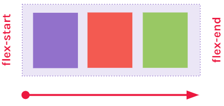

## **`justify-content:flex-start`**

Los ítems se alinean respecto del **inicio** del **main axis** que hayamos definido. Si no le aclaramos el justify-content al contenedor, flex-start es el valor por defecto.

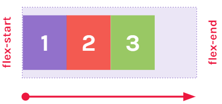

## **`justify-content:flex-end`**

Los ítems se alinean respecto del final del main axis que hayamos definido

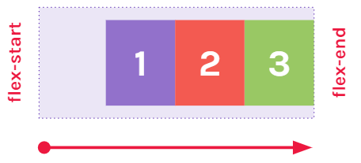

## **`justify-content:center`**

Los ítems se alinean en el centro del main axis

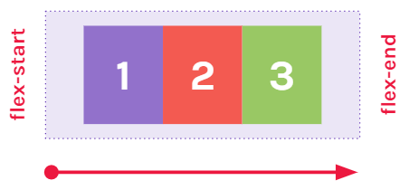

## **`justify-content:space-between`**

Los ítems **se distribuyen de manera uniforme**. El primer ítem será enviado al inicio del main axis, y el último ítem, al final. El espacio libre se repartirá para separar los ítems.

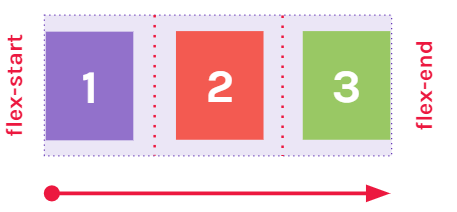

## **`justify-content:space-around`**

Los ítems se distribuyen de manera uniforme. El espacio libre disponible se repartirá entre todos los elementos. Del espacio que le toque a cada elemento, la mitad irá a la derecha y la otra a la izquierda (o arriba y abajo en caso de que sean columnas).


## align-items

Con esta propiedad alineamos los ítems a **lo largo del cross axis**. Si no aclaramos esta propiedad, el valor por defecto es stretch, en otras palabras, los ítems ocuparán todo el espacio disponible en el cross axis.


## **`align-items: stretch`**

Los ítems se ajustan para abarcar todo el contenedor. Si el cross axis es vertical, se ajustan en función de la columna. Si el cross axis es horizontal, se ajustan en función de la fila

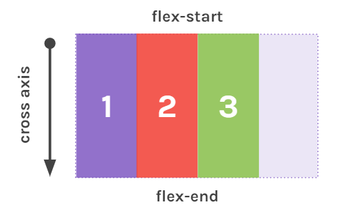

## **`align-items: flex-start`**

Los ítems se alinean al inicio del cross-axis.


## **`align-items: flex-end`**

Los ítems se alinean al final del eje transversal.


## **`align-items: center`**

Los ítems se alinean al centro del eje transversal.


## align-content

Si tenemos un contenedor de una sola línea (donde flex-flow se establece como no-wrap) utilizaremos align-items, pero en el caso de que estemos trabajando con contenedores multilínea debemos utilizar align-content.

Con esta propiedad alineamos los ítems a lo largo del cross axis cuando los contenedores flexibles incluyen de varias líneas (donde flex-flow se establece en wrap o wrap-reverse).Los valores que admite la propiedad align-content son similares a los que podemos utilizar para align-items. Vale la pena probar como funcionan ambas propiedades para entenderlas bien.

## **`align-content: flex-start | flex-end`**


## **`align-content: center | stretch`**


## **`align-content: space-between | space-around`**


# Estructura básica

Flexbox propone una estructura basada en el uso de un contenedor padre (flex-container) y sus elementos hijos (flex-items).

Para empezar a trabajar con Flexbox tenemos que definir un flex-container.

Para eso usamos la propiedad:

```
display:flex;
```

De esta forma, estamos habilitando un contexto flex, para trabajar con los hijos directos del elemento.

La propiedad display también puede recibir el valor `inline-flex`

```
.contenedor-padre {
    display: flex;
}
```

Cuando hablamos de un flex-container, hablamos de un elemento HTML que contiene a uno o más elementos. A estos elementos anidados los llamamos flex-items.
En el flex-container es en donde configuramos la mayoría de las propiedades flex

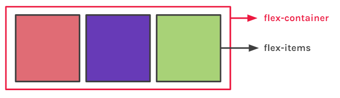

## flex-wrap

Por defecto, los elementos hijos de un contenedor flex van a tratar de entrar todos en una misma línea.


## **`flex-wrap: wrap`**

la propiedad

```
flex-wrap:wrap
```

Permitirá que los ítems tomen el ancho definido y que los que no entren en la línea, caigan a la siguiente. flex-wraptambién puede recibir los valores `nowrap` y `wrap-reverse`

```
.contenedor-padre {
    display: flex;
    flex-wrap: wrap;
}
```

Para aclararle al contenedor que **debe respetar el ancho definido** de sus hijos usamos la propiedad `flex-wrap` con el valor `wrap`.


## flex-items

Un flex-item, a su vez, puede convertirse en un flex-container. Para eso, solo hace falta asignarle la regla `display:flex`, para que así sus elementos hijos pasen a ser flex-items

```
.elemento-hijo {
    display: flex;
}
```

# Items

Cuando trabajamos con el posicionamiento Flexbox, generalmente todo lo implementamos directamente en el elemento padre contenedor.

Pero ¿qué pasa si deseamos modificar el comportamiento de un flex item? ¿Es posible esto?

Flexbox nos da la posibilidad de aplicarle propiedades directamente a cada ítem para poder manipularlos por separado y tener mayor control

> Estas propiedades aplicarán para los flex-items siempre y cuandoel contenedor padre sea un flex-container.

## Order

Con esta propiedad controlamos el orden de cada ítem, sin importar el orden original que tengan en la estructura HTML. Esta propiedad recibe un número entero, positivo o negativo,como valor. Por defecto, todos los ítems flex tienen un order: 0 implícito, aunque no se especifique.

```
.caja {
    order: 1;
}
```

## **`order: número positivo`**

Si le asignamos a la caja Q (que posee la clase caja-q) la propiedad ordercon valor 1, esta pasará al final de la fila por ser el número más alto.
Recordemos que, por defecto, el valor del orden de cada ítem es **0**.

```
.caja-q {
    order:1;
}
```

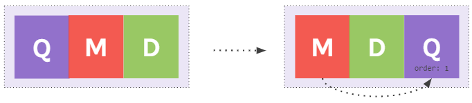

## **`order: número negativo`**

Si ahora le asignamos a la caja D la propiedad order con un -1 como valor, esta pasará al principio de la fila. Colocando al ítem con el orden más pequeño primero.

```
.caja-d {
    order: -1;
}
```

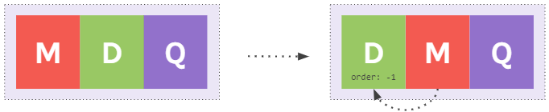

Las cajas se irán ordenando respetando la secuencia desdelos números negativos hacia los positivos.

## flex-grow

Con esta propiedad definimos **cuánto puede llegar a crecer un ítem** en caso de disponer de espacio libre en el contenedor.
Configura un crecimiento flexible para el elemento


Si ambos ítems tienen la propiedad `flex-grow` con valor 1, a medida que el contenedor se agrande, irán abarcando el espacio disponible en partes iguales

```
.caja-a, .caja-b {
    flex-grow: 1;
}
```


Si un solo ítem tienen la propiedad flex-grow, este intentará ocupar el espacio libre disponible, a medida que el contenedor se agrande, según la proporción que definamos con el valor.

```
.caja-b {
    flex-grow: 1;
}
```


El número que le asignamos a flex-grow determina qué cantidad de espacio disponible dentro del contenedor flexible tiene que ocupar ese ítem.
1 equivale al 100% del espacio disponible, y 0 al 0%.
Podemos usar cualquier valor en el medio, como 0.25 para el 25%


## align-self

Nos permite alinear, sobre el cross axis, a cada ítem al que le apliquemos esta propiedad, independientemente de la alineación que se haya definido en el contenedor flex con align-items


## **`align-self: flex-end`**

Con flex-end, el ítem se alínea al final del eje transversal.

```
.contenedor-padre {
    align-items: flex-start;
    }
.caja-dos {
    align-self: flex-end;
}
```


## **`align-self: center`**

Con center, el ítem se alínea al centro del eje transversal

```
.contenedor-padre {
    align-items: flex-start;
}
.caja-dos {
    align-self: center;
}
```

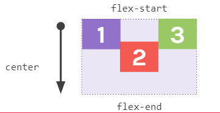

## **`align-self: flex-start`**

Con flex-start el ítem se alínea al inicio del eje transversal

```
.contenedor-padre {
    align-items: flex-end;
}
.caja-dos {
    align-self: flex-start;
}
```


## **`align-self: stretch`**

Con stretch, el ítem se ajusta hasta abarcar todo el cross axis, es el comportamiento por defecto. Funciona siempre que el elemento no tenga definida una altura.

```
.caja-uno, .caja-tres {
    align-self: flex-start;
}
.caja-dos {
    align-self: stretch;
}
```


# C14 VIEWPORTS

¿Qué es el viewport? En palabras sencillas, es la parte visible de cualquier navegador web, en la cual se puede ver el contenido de la página, sin tener que hacer scroll.

Es decir, que el viewport (en español, puerto visible) es en donde se muestra el contenido de nuestros documentos HTML.

Saber de la existencia de este concepto, y entenderlo, es parte fundamental del desarrollo adaptativo o responsive. Algo que vale la pena tener siempre en mente es que el viewport va a determinar la manera en la que el navegador visualiza el contenido de nuestro sitio web.

## Etiqueta viewport

La etiqueta `<meta>` viewport da al browser instrucciones de **cómo se debe dimensionar y escalar la página web** al cargarse.
En el ejemplo a continuación presentamos la estructura básica de este tag.
En ocasiones, puede que lo veamos con más información

```
<metaname="viewport" content="width=device-width, initial-scale=1">
```

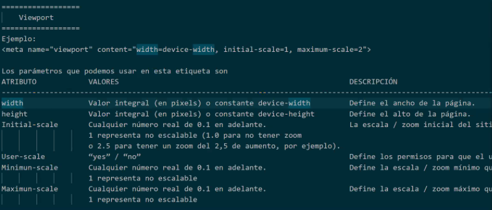

# Medidas relativas

Una medida relativa es aquella que, dependiendo de su contexto, podrá variar y adaptarse, sin la necesidad de que tengamos que cambiar la misma en nuestro código.

La medida relativa más común es el porcentaje (%). Como es bien sabido por todo el mundo, una medida porcentual toma una parte de una medida completa y, dependiendo de esa medida completa, la medida porcentual podrá variar.

Pero los porcentajes no son las únicas medidas relativas que existen en el mundo de CSS. Así que manos a la teoría para aprender aquellas otras medidas relativas que CSS tiene disponibles.

> Las medidas relativas son aquellas que tienen en cuenta el contexto donde se encuentran. Si el contexto cambia, estas medidas cambiarán con él

**El contexto**

Según de qué medida estemos hablando, el número que pongamos será relativo a:

-   El contenedor padre.
-   El tamaño de la fuente del sitio.
-   El tamaño de la fuente del contenedor padre.
-   El tamaño del viewport.

Si tomamos los porcentajes como ejemplo, podemos decir que son una unidad relativa, puesto que 30% de ancho no será lo mismo para un elemento situado dentro de un contenedor de 2000px de ancho que para un contenedor de 1000px de ancho.

## **`Los porcentajes %`**

Cualquier medida expresada en porcentaje siempre estará relacionada con la medida (en ese mismo eje) del elemento padre que la contiene.
Si el contenedor padre mide 300px de ancho y le asignamos un ancho del 50% al elemento interior, este medirá 150px (el 50% del ancho padre).
**Ojo: no se recomienda usar porcentajes para el alto de un elemento.**

```
.elementoContenedor{
    width: 300px;
}
.elementoInterior{
    width: 50%;
} // Será 150px
```

## Calculando el porcentaje

Una buena herramienta para calcular o hacer el traslado de píxeles a porcentajes, es la regla de 3 simple.
Para cada elemento del contenedor padre, el cálculo sería:


Entonces, si calculamos cada elemento, nos quedaría así:


## **`em`**

Los ems son **siempre relativos al elemento padre**. Tomarán como valor de referencia la propiedad `font-size`.

El punto de referencia inicial es el valor de font-size del elemento `<html>`, que por defecto es 16px. El resto de los elementos tendrán 1em de font-size que equivale al mismo valor que tenga el padre.

Si le asignamos 1.5em al font-size de cualquier elemento, el tamaño resultante será el valor del padre multiplicado por el valor en ems → 16px \* 1.5 = 24px.

```
p{
    font-size: 1.5em
} // 16px * 1.5 = 24px
```

**Si utilizamos ems en una propiedad que no sea font-size, se tomará para el cálculo el font-size que tenga el elemento que estemos modificando**.

Por lo general, se utilizan este tipo de unidades para todo lo que sea relacionado a la tipografía, pero también podemos aplicarlo a otras propiedades como margin y padding para que varíen en función de los tamaños de las fuentes.

```
p{
    font-size: 20px;
    line-height: 2em; // 20px * 2 = 40px;
    padding: 1.5em; // 20px * 1.5 = 30px;
}
```

## **`rem`** (RECOMENDADO)

Como nos habremos dado cuenta, usar ems puede ser muy complicado.
Los rems funcionan muy parecido a los ems, con la diferencia de que **siempre tomarán de base el tamaño de font size del elemento `<html>`**.

Eso quiere decir que el tamaño expresado en rems no modificará el de los elementos hijos y tampoco se verá afectado por el del elemento padre.

Por lo general, es mejor usar rems en lugar de ems ya que conservamos las ventajas de una unidad relativa, pero nos evitamos hacer cálculos complejos y estar pendientes de cómo se afectan los elementos entre sí.

> algunos establecen en la etiqueta html un font-size de 62.5% para calcular el rem mas facil.

## Medidas de viewport

El viewport es el espacio visible que tiene el navegador para mostrar el sitio. Eso quiere decir que se pueden utilizar medidas relativas a este espacio para poder determinar el tamaño de ciertos elementos

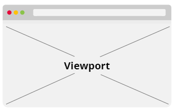

## Viewport width y viewport height

## **`vw`** o viewport width

Es relativo al ancho total del viewport.

## **`vh`** o viewport height

Es relativo al alto total del viewport.

Ambas medidas están expresadas como porcentajes del total, eso quiere decir que **50vh** será equivalente al 50% del alto disponible en el viewport

```
div{
    width: 25vw; // 25% del ancho disponible
    height: 50vh; // 50% del alto disponible
}
```

Cualquier medida expresada en viewport width (vw) o viewport height (vh) tomará siempre como referencia al viewport del documento


# Media queries

Las media queries no son otra cosa más que simples reglas de CSS que agrupan, a su vez, otras reglas que se aplicarán si se cumple una condición determinada. Esta condición generalmente tiene que ver con la resolución de pantalla del dispositivo de salida.

En otras palabras, las media queries nos van a permitir que la estructura de nuestros documentos HTML se conviertan en estructuras adaptativas o responsive.

Son un conjunto de reglas de CSS que nos permiten cambiar los estilos de los elementos en función de las características del dispositivo que esté visualizando nuestro sitio.
La mayor parte de nuestros estilos estará fuera de las media queries.

Dentro de cada media query escribiremos solo aquello que necesitemos ajustar para ese tamaño de viewport.

Por lo general, se escriben al final de nuestra hoja de CSS

## **`min-width`**

Al especificar min-width estamos diciendo: “si como mínimo el viewport tiene N píxeles de ancho, apliquemos estas reglas”.

Similar a decir → “Desde este ancho, hacia arriba”

```
@media (min-width: 460px){
    body {
        background: red;
    }
}
```

## **`max-width`**

Al especificar max-width estamos diciendo: “si como máximo viewport tiene N píxeles de ancho, apliquemos estas reglas”.Similar a decir → “Desde este ancho, hacia abajo”

```
@media (max-width: 768px){
    body {
        background: yellow;
    }
}
```

## Orientacion

Al especificar la orientación (portrait o landscape) estamos diciendo: “si como máximo el viewport tiene N píxeles de ancho y además el dispositivo está en posición vertical/horizontal, apliquemos estas reglas”.

```
@media (max-width: 460px) and (orientation: landscape){
    body {
        background: blue;
    }
}
```

**Mobile first** (RECOMENDADO)

Si utilizamos mobile first como estrategia de diseño, la idea es determinar de manera general las reglas CSS para pequeñas pantallas para luego, a través de media queries, ir aclarando el comportamiento en viewports más grandes.

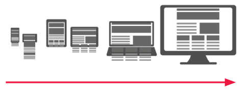

```
body {
    background: red;
}
@media (min-width: 460px){
    /* Tablets */
}
@media (min-width: 768px){
    /* Laptop */}
```

**Mobile last** (NO RECOMENDADO)

Si utilizamos mobile last como estrategia de diseño, la idea es determinar de manera general las reglas CSS para grandes pantallas para luego, a través de media queries, ir aclarando el comportamiento en viewports más pequeños.

```
body {
    background: red;
}
@media (max-width: 768px){
    /* Tablets */
}
@media (max-width: 460px){
    /* Smartphones */
}
```

## Los breakpoints

Llamamos breakpoints o puntos de quiebre a cada salto de tamaño sobre el cual aplicamos una media query. No hay una regla fija sobre cuáles usar, pero acá dejamos los más utilizados.


# Formularios

Estos nos van a permitir disponer de una entrada de datos por parte del cliente para que posteriormente podamos administrar esa información suministrada.

En los siguientes temas, vamos a aprender los conceptos básicos para la correcta generación de formularios y algún que otro secreto.

Para lograr que un formulario funcione correctamente, hacen falta las siguientes 3 instancias


## Formularios en HTML

## **`<form></form>`**

Con esta etiqueta indicamos que vamos a crear un formulario en nuestro documento HTML. Todos los elementos que queramos incluir en el formulario van a ir dentro de las etiquetas: `<form></form>`.

Esta etiqueta engloba todos los campos del formulario.
Posee 2 atributos principales:

1. **`action=""`**
   Define la ruta donde se va a procesar la informacion capturada en los campos del formulario
2. **`method=""`**
   Define como se enviará la informacionñ en este contexto hay dos valores posibles `GET` y `POST`

```
<form action="/registro"method="POST">
    <!-- Aquí van los campos -->
</form>
```

## **`<label></label>`**

Sirve para implementar un **texto descriptivo** que acompañe a cada campo del formulario
Este texto **Describe lo que esperamos que el usuario haga, dentro del campo**

Por lo general, cada campo o grupo de campos tendrá su `label` asociado. Cuando el usuario haga click en el label, se activará automáticamente el campo que corresponda


```
<formaction="/registro"method="POST">
    <labelfor="nombre">Nombre:</label>    <inputtype="text"name="nombre" id="nombre">

    <label for="email">Email:</label>    <inputtype="email"name="email" id="email">

    <label for="telefono">Edad:</label>    <inputtype="tel"name="edad" id="telefono">
</form>
```

## **`<input>`**

Es una etiqueta multifuncion, es decir, con esta etiqueta podemos generar distintos tipos de campos en el formulario.
Posee un atributo super importante llamado `type`

```
    <form action="/registro"method="POST">
        <input type="text"name="usuario">
        <input type="password"name="clave">
        <input type="email"name="email">
        <input type="tel"name="telefono">
        <input type="number"name="edad">
    </form>
```

-   **`type=""`**
    Recibe un valor, y dependiendo el valor, se generara un tipo distinto de campo.
    Sus posibles valores son:

-   **text**: Generara un campo basico de una sola linea, que recibe caracteres alfanumericos

```
<input type="text">
```

-   **email**: Nos solicitara que la informacion que ingresemos coincida con el formato de email.

```
<input type="email">
```

-   **password**: Generara un campo de una sola linea, todo lo que escribamos, se vera oculta; nos mostrara caracteres.

```
<input type="password">
```

-   **tel**: Cuando el visitante se encuentre desde un dispositivo movil, active el teclado numerico.

```
<input type="tel">
```

## **`<textarea></textarea>`**

El textarea nos permite texto de gran tamaño y con múltiples líneas.
A diferencia del input, el textareatiene etiqueta de apertura y cierre.
Un campo de comentarios.

```
<form action="/contact"method="POST">
    <label for="comentario">Deje su Comentario:</label>
    <textareaname="comentario" id="comentario">Contenido</textarea>
</form>
```

## **`<select></select>`**

Lista desplegable las cuales agrupan muchas opciones:
ej: paises, mes del anio
Genera una cajita que contiene las opciones, estas opciones lo generamos con la etiqueta `<option>`
Este elemento nos permite agregar un componente que muestra opciones. Como el resto de los campos, debe llevar el parámetro name para enviarse

```
<form action="/colors"method="GET">
    <label>Seleccione un color:</label>
    <select name="color">
        <option value="#ff0000">Rojo</option>        <optionvalue="#00ff00">Verde</option>
        <option value="#0000ff">Azul</option>
        <option value="#770077">Morado</option>
    </select>
</form>
```

## **`<option></option>`**

Las opciones de un select son representadas por elementos option.Los elementos `option` tienen etiqueta de apertura y cierre

Generara una opcion dentro de la cajita de `select`, si queremos mostrar varias opciones tendremos que usar todas las veces que sea necesario esta etiqueta.


**ejemplo**

```
<select>
    <option>Chile</option>
    <option>Ecuador</option>
    <option>Uruguay</option>
</select>
```

## **`<button></button>`**

Nos permite generar un botón. Con la propiedad `type` definimos el tipo.

-   Un botón de tipo `reset` reinicia el formulario a su estado inicial.
-   Un botón de tipo `submit` se encarga de enviar el formulario.
-   Un botón de tipo `button` no realizará ninguna acción por defecto. Por lo general, programaremos una con ayuda de JavaScript

El boton que nos permite enviar la informacion, recibe el atributo `type=" "`

```
<button type="reset">Borrar</button>
<button type="submit">Enviar</button>
```

```
<form action=""method="">
    <label for="usuario">Ingrese el usuario:</label>    <inputtype="text"name="usuario">
    <buttontype="reset">Cancelar</button>
    <buttontype="submit">Enviar</button>
</form>
```

-   **`type="reset"`**: Sirve para borrar todo lo que hayamos ingresado en el formulario
-   **`type="submit"`**: Enviara el formulario a la ruta indicada en el atributo `action` en la etiqueta `<form>`

## Otros atributos:

Los siguientes atributos pueden ir en cualquiera de los campos del formulario.

-   **`name`** (IMPORTANTE)
    Todos los campos del formulario deberian tener su respectivo nombre, permite identidicar a cada campo con un nombre en particular. Es importante saber que **los elementos que no tengan name, no se envían**.

-   **`value`**
    Se implemente en aquellos campos que no permiten insercion de texto por parte de los usuarios. Por ej: los option.
    Es usado para darle un valor especifico a ese campo, para luego ser procesado al momento de enviar un formulario.

-   **`required`**
    Usado en cualquier campo y genera que ese campo sea obligatorio, si no se llena ese campo, saldra una alerta para llenar dicho campo.

-   **`placeholder`**
    Usado en cualquier campo que permite insercion de texto, sirve como texto de ayuda y ejemplo, para decirle al usuario como llenar ese campo

-   **`checked`**
    Se encarga de preseleccionar la opcion, en los radio values


**Ejemplo**

```
<formaction="/login"method="POST">
    <p>
        <label>Nombre:</label>
        <inputtype="text"name="usuario">
    </p>
    <p>
        <label>Email:</label>
        <inputtype="email"name="email">
    </p>
    <p>
        <buttontype="submit">Enviar</button>
    </p>
</form>
```


# Radio button y checkboxes

-   permiten generar peticiones especificas

## radio buttons

botones de opcion, se generan con la etiqueta input con `type="radio"` y estan anidados dentro de la etiqueda `label`
permite elegir solo una de las opciones presentadas

```
<label>
    <input type="radio">
    Acepto los terminos
</label>
```

para que solo se seleccione uno, tenemos que usar el atributo `name` y asignar a este el mismo valor que todas la opciones, de esta manera el navegaor entiende que estas opciones pertenecen a un solo campo y por lo tanto solo podemos elegir una de ellas

```
<label>
    <input type="radio" name="tipoSuscripcion">
    Quincenal
</label>
<label>
    <input type="radio" name="tipoSuscripcion">
    Mensual
</label>
<label>
    <input type="radio" name="tipoSuscripcion">
    Trimestral
</label>
```

> opcional: Con el atributo `checked` preseleccionamos la opcion.

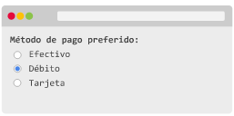

## checkboxes

Al hacer clic en él queda seleccionado y con otro clic quitamos la selección.
O casillas de verficacion, usamos el `input` pero cambiamos el type a `checkbox`, esto permite elegir varias opciones.
El atributo name cumple la funcion de referente del campo, para que al momento de procesar la informacion, hagan parte de la misma respuesta.

```
<label>
    <input type="checkbox" name="pasatiempos">
    ver tv
</label>
<label>
    <input type="checkbox" name="pasatiempos">
    Aprender javascript
</label>
<label>
    <input type="checkbox" name="pasatiempos">
    Practicas HTML
</label>
```

> Si le asignamos el atributo checked a un elemento de tipo input, ya sea radio button o checkbox, este va a aparecer ya seleccionado por defecto.

Un uso particular del checkbox es utilizarlo para recolectar información que responde a preguntas con respuestas como sí/no porque permite tildar o destildar en un solo elemento. En ese caso no es necesario agregar un valor, ya que, en caso de seleccionarse la opción, llegará con el valor “on”.

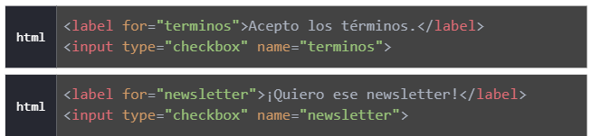


## value

A traves de este atributo podemos definir el valor que queremos procesar cuando se envie el formulario, cuando no permite la insercion de texto por parte del usuario requerimos `value`, esaa informacion seria la que iria al back-end

```
<label>
    <input type="checkbox" name="pasatiempos" value="tv">
    ver tv
</label>
<label>
    <input type="checkbox" name="pasatiempos" value="js">
    Aprender javascript
</label>
<label>
    <input type="checkbox" name="pasatiempos" value="html">
    Practicas HTML
</label>
```

# Formularios avanzados

## **`type="date"`**

Nos permite ingresar una fecha incluyendo año, mes y día. Para crear un elemento de tipo `date` usamos un `input` a cuyo atributo type le damos el valor date.
Dentro de los atributos del elemento, la fecha siempre se formatea como **aaaa-mm-dd**,
por ejemplo 2020-10-25.

Por fuera tomará el formato que corresponda según el idioma del usuario.

Desplegara un calendario, podemos pedirle al usuario cualquier dato que coincida con una fecha, si deseamos que este control muestre una fecha determinada, podemos usar value con un valor predeterminado.

```
<input type="date" name="fechaNacimiento" value="1985-08-28">
```

### atributos

-   **`min`**
    Es opcional. Nos permite definir la fecha mínima que puede ser ingresada

-   **`max`**
    Es opcional. Nos permite definir la fecha máxima que puede ser ingresada

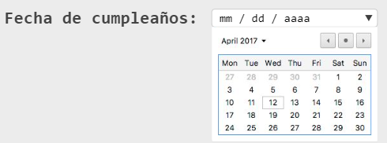

## **`type="file"`**

Nos permite cargar uno o más archivos desde la computadora.Para crear un elemento de tipo file usamos un input a cuyo atributo type le damos el valor file.

```
<label>Seleccionar una imagen para el perfil:</label>
<input type="file" name="avatar" accept=".jpg" multiple>
```

Generara un control con un boton de explorar, que al ser activado abrira el explorador de archivos del sistema y permitira elegir cualquier archivo del sistema

> lo podemos personalizar esteticamente con CSS y JavaScript

Tambien podemos definir si acepta un solo archivo o varios, por defecto solo acepta un archivo pero si queremos permitir varios, implementamos el atributo `multiple`

Podemos definir el tipo de archivos que admite con el atributo `accept`, basta con definir los tipos de formatos de archivo que el campo podria admitir, separando los mismos por una coma `,`

```
accept=".jpg, .png"
```

### atributos

-   **`accept`**
    Nos permite definir qué tipo de archivos serán aceptados

-   **`multiple`**
    Por defecto solo permite un archivo, si deseáramos aceptar más de uno, usamos multiple.


## validacion de usuario del lado front

Revisamos si los datos son los que esperamos

cuando un campo presenta errores preparamos el html para un mensaje usando un `<span>`

```
<label>Nombre Completo</label>
<input type="text" name="nombreUsuario">
<span class="feedback"> </span>
```

Recibira el texto resultante despues de la validacion de los datos

# Formularios accesibles

Para que nuestro formulario pueda ser completado por todos los usuarios, debemos asegurarnos que también es accesible mediante teclado y que devuelve la información correcta

-   Etiqueta `label`

**Antes** del campo para:

-   text
-   textarea
-   select
-   password
-   file

> a la izquierda o arriba del campo

**Detrás** del campo para los tipo:

-   checkbox (multiselección)
-   radio button (excluyente)

Etiquetar los controles de forma correctaFormularios accesibles

-   **`label for`**

La relación entre la etiqueta y el control del formulario al que pertenece debe estar siempre asociada con `for`.

**`for` debe ser siempre igual al `id`** del control del formulario y cada id debe ser único.

```
<label for="fname">Nombre</label>
<inputid="fname" type="text" name="nombre">
```

**Label no debe usarse para los campos:**

-   **`Image`**, como puede ser el caso de un botón enviar, en estos elementos utilizamos el atributo alt.
-   Para los tipos **`submit y reset`** debemos usar value.
-   Para los **`button`** en los que su contenido se usa como una etiqueta.

## Etiquetas de agrupamiento

Utilizamos las etiquetas de agrupamiento cuando sea necesario y/o aclaratorio, por ejemplo:

-   Agrupamos semánticamente un número de controles del formulario mediante el campo **`fieldset`**, como en una agrupación de opciones de radios o checks.

-   Añadimos una descripción a esta agrupación con el elemento **`legend`**.

-   Con **`optgroup`** podemos agrupar una serie de `options` dentro de un select. Con este elemento ayudamos a los usuarios a encontrar la información de una forma más simple, sobre todo en listas muy largas.

## **`fieldset`**

Fieldsetnos permite agrupar cuando haya varios elementos de formulario asociados. Cada fieldset debe tener una leyenda.

## **`legend`**

Es el texto que describe el grupo de asociados de los elementos de formulario.

```
<fieldset>
    <legend>Tipo de equipo</legend>
    <br />
    <input id="pc" type="radio" name="rb3" value="radiobutton">
    <label for="pc">PC</label>
    <br />
    <input id="linux" type="radio" name="rb3" value="radiobutton">  <label for="linux">Linux</label>
    <br />
</fieldset>

```

## **`optgroup`**

nos permite agrupar las opciones de selección de una lista de un formulario.

## **`label`** (atributo)

es obligatorio en este elemento y debería proveer a los usuarios una pista o descripción acerca de los contenidos del grupo.

```
<p> Elije un auto:
    <select>
        <optgrouplabel="Ferrari">
            <option>458 Spider</option>
            <option>F12 Berlinetta</option>
            <option>California T</option>
        </optgroup>
            <optgrouplabel="Porsche">
            <option>Macan</option>
            <option>918 Spyder</option>
        </optgroup>
    </select>
</p>
```

> La agrupación de opciones en un control select puede mejorar la legibilidad y la facilidad de uso

## Campos obligatorios

**RECOMENDADO**

-   Poniendo directamente el texto “obligatorio” vamos a evitar más confusiones en la interpretación. Por ejemplo, “Email (obligatorio)”.
-   Identifiquemos los errores marcando el foco con cambio de color en el campo que se ha producido, y además describiendo con texto el error cometido.

**NO RECOMENDADO**

-   Usar el _ para indicar que un campo es requerido. Se debe añadir el texto “Los campos con _ son obligatorios” o similar. Formularios accesibles
-   No identifiquemos un campo obligatorio solo con color. Esto podría no funcionar para las personas con daltonismo.

Los textos de los mensajes de la validación deben ser lo más descriptivos posible y aclarar al usuario lo que está sucediendo.


## Tabulado

## **`Tabindex`**

Una de las formas más comunes de la navegación a través de un formulario es utilizando la tecla _Tab_.
Una persona llena un campo, presiona la tecla Tab, rellena el campo siguiente, y así sucesivamente, hasta que se alcanza el final del formulario.
Para lograrlo debemos establecer el orden en que se asignan esas tabulaciones de la siguiente manera:

```
<a href="documento2.html" tabindex="2" style="float: right;">
Segundo documento.</a>
<a href="documento1.html" tabindex="1">Primer documento.</a>
```

-   **Un número entero** que indica la posición del elemento en la navegación por tabulación. Si varios elementos comparten el mismo tabindex, su orden relativo sigue la posición relativa en el documento.

-   Si el valor es **negativo** (usualmente tabindex="-1"), el elemento se encontrará excluido de la navegación por tabulación.

-   Si este atributo es omitido, el navegador determinará automáticamente la posición de todos los elementos capaces de recibir el enfoque de acuerdo a su posición en el código.

## extra

Guardar variables en CSS

```
:root{
    --primary-color: #495406;
    --secondary-color: grey;
}
// Lo usamos:

color: var(--primary-color);
```

Usar codigos de iconos propios o entendibles del navegador codigo #

```
propiedad: "\2605";
```

Configurar 1 rem = 10px

```
html{
    font-size: 62.5%;
}
```

# C17 - Pseudoclases

En ocasiones, al estar navegando dentro de un sitio web, se generan cambios visuales cuando pasamos con el cursor del mouse sobre un determinado elemento, o cuando ya hemos visitado un determinado enlace.

Este tipo de comportamientos se pueden dar gracias a algo que en CSS se conoce como los pseudo selectores. Estos nos **van a permitir configurar el comportamiento visual** de un determinado elemento en relación de lo que pase con el mismo en pantalla.

Los pseudo selectores nos permiten una manera alternativa de crear elementos y de aplicar estilos en función de los estados y organización de los elementos.

-   Se suelen aplicar sobre un selector existente, se utilizan para modificar un comportamiento determinado o el contenido de un elemento de html

Estan divididos en 2 grandes grupos:

1. **pseudoclases**

    Que nos permiten aplicar estilos en función de:

    - Los estados de los elementos.
    - La ubicación dentro de la estructura de HTML.
    - La presencia de ciertos atributos de HTML

    Se aplican sobre un selector especifico y ya existente

    ```
    .selector:pseudo-clase{
        /* CSS*/
    }
    ```

    ### Las pseudo clases de los enlaces:

        Los enlaces son uno de los elementos que tienen pseudo clases específicas.
        En este caso serán **`:link , :visited, :hover y :active`**

-   **`:link`**  
     Se utiliza para aplicar estilo a los enlaces `<a></a>` que tengan la propiedad `href`.
    Los estilos definidos por la pseudoclase `:link` serán anulados por cualquier pseudo clase posterior relacionada con el enlace (:visited, :hover o :active) que tenga al menos la misma especificidad

    ```
    a:link {  
        background-color: rgb(234, 0, 255); 
        border-color: rgb(161, 17, 89); 
        color: red;
    }
    ```

-   **`:visited`**
    Se usara para aplicar estilos a los enlaces que hayan sido visitados, al menos una vez por parte del visitante.
    Sus estilos también podrán ser anulados por el resto de los pseudo selectores de enlaces.

    ```
    a {
        color: green;
    }
    a:visited {
        color: gray;
    }
    ```

-   **`:hover`**
    Aplica sus lineas de CSS cuando el usuario pasa el cursor del mouse sobre un elemento especifico.
    Si se aplica a un enlace, sus estilos también podrán ser anulados por el resto de los pseudo selectores de enlaces.

    Puede ser aplicada en cualquier elemento del html y no solamente en los enlaces

    ```
    a {
        color: green;
        text-decoration: none;
    }
    a:hover {
        color: orange;
        text-decoration: underline;
    }
    .warning-text:hover {
        color:red;
        background-color: yellow;
    }
    ```
-   **`:active`** 
    Se utiliza para aplicar estilo a los enlaces `<a></a>` que estén siendo cliqueados por el usuario. 
    Normalmente se utiliza para la animación del clic.
    Sus estilos también podrán ser anulados por el resto de los pseudo selectores de enlaces.

    ```
    a:active {   
        background-color: rgb(234, 0, 255);   
        border-color: rgb(161, 17, 89); 
        color: red;
    }
    ```

    ### Las pseudo clases de los inputs:

    Los inputs son otro de los elementos que tienen pseudo clases específicas.En este caso serán :focus , :enabled, :disabled y :target.

    ```
    input:focus { border-color: orange; }
    input:disabled { background-color: gray;}
    :target { font-weight: bold; }css
    ```

-   **`:focus`**
    Se aplica cuando un elemento tiene el foco del cursor, es decir, cuando el cursor se encuentra dentro de dicho elemento.El caso más normal es cuando el usuario está completando un campo de un formulario

    -   inputs
    -   texarea

    ```
    input:focus {
        color:orange;
        font-weight: bold;
    }
    ```
-   **`:disabled`**
    Se aplica cuando un elemento está deshabilitado, es decir, cuando posee la propiedad `disabled`.
    Normalmente se utiliza para darle estilos a los campos que no se pueden completar en un formulario.  O a aquellas opciones que están desactivadas.


2. **pseudoelementos**

    Los pseudo elementos, que nos permiten crear elementos desde CSS sin tener que modificar la estructura del HTML.

    Manipulan contenido de un elemento presente en el doc html, podemos agregar contenido antes o despues de un elemento determinado

    Los pseudo elementos también se usan junto a los selectores de CSS.
    Para usarlos, escribimos el nombre del selector primero, seguido de doble dos puntos :: y el pseudo elemento que queramos utilizar.
    
    Los más utilizados son ::before y ::after, pero existen muchos más como ::first-letter y ::first-line

    ```
    selector::pseudo-elemento { 
        propiedad: valor;
    }
    ```

    - **`::before`**
    Se utiliza junto con la propiedad `content` para introducir contenido en el documento usando CSS.
    Este nuevo contenido **aparecerá antes** del contenido interno del elemento.

    ```
    h2::before {
        content: 'voy antes';
    }
    ```

    - **`::after`**
    Se utiliza junto con la propiedad content para introducir contenido en el documento usando CSS.
    Este nuevo contenido aparecerá después del contenido interno del elemento.

    ```
    h2::after {
        content: 'voy depues';
    }
    ```

    > reciben la propiedad `content` que recibe el contenido que ira antes o despues.

    Por defecto ::before y ::after son elementos de línea, por lo que aparecerán antes y después del contenido existente. Pero podemos transformarlos en elementos de bloque y usarlos para cualquier cosa que se nos ocurra.

    

## Esquema general de sintaxis de CSS:

Teniendo en cuenta todo lo que aprendimos, el orden para escribir una regla de CSS sería el siguiente:

```
selector #id.class :pseudoclase ::pseudoelemento [atributo] { 
    propiedad:  valor;   
    propiedad:  valor; 
    propiedad:  valor;
}
```
# C19 - Propiedades CSS

**Ejemplos**

[sitio 1](https://assets.digitalhouse.com/content/ar/td/fe/c12/1.gif)

[sitio 2](https://assets.digitalhouse.com/content/ar/td/fe/c12/2.gif)

Las animaciones vienen en muchas formas y formatos. Pueden ser tan sutiles como un ligero movimiento de un botón.
Se puede configurar a través de la interacción del usuario con el sitio o pueden ser independientes a las acciones de los visitantes.

[button animado](https://assets.digitalhouse.com/content/ar/td/fe/c12/3.gif)

También pueden ser tan espectaculares y llamativas como un fondo completamente animado. 

[Fondo animado](https://assets.digitalhouse.com/content/ar/td/fe/c12/4.gif)

Se puede configurar a través de la interacción del usuario con el sitio o pueden ser independientes a las acciones de los visitantes.
Recordemos que es muy importante tener en cuenta que las animaciones deben cumplir una misión en específica:

- Captar la atención de los usuarios,
- Presentar los productos y/o servicios,
- Ofrecer un descuento especial,
- Distraer al visitante mientras se carga la web,
- Abrir nuevos bloques de información, etc…

# Transform

> ver ppt

Al usar transform, tenemos que pasarle como valor la función que queremos que ejecute

```
transform: function;
```

## **`scale()`**

Representa la candidad de escala que se aplicara en cada direccion, el contenido se expande

- scale(x)
- scale(x,y)

```
transform: scale(2);
```

## **`skew()`**

Cantidad de sesgo o inclinacion que se aplicara

- skew(x)
- skew(x,y)

```
transform: skew(15deg);
```

## **`rotate()`**

Rota el elemento alrededor de un punto fijo en el plano 2D, sin deformarlo, se usa la medida `deg` que representa un angulo en grados.

```
transform: rotate(180deg);
```

## **`translate`**

Mueve el elemento en direcciones

```
transform: translate(50px);
```

## **`transform-origin`**

Modifica el origen de las transformaciones de un elemento, podemos pasarle como valor en píxeles, top, bottom, right, left. Es decir, elige un lugar del elemento para transformarlo y luego con `transform` se elige a partir de que funcion se va a modificar de esa manera

```
transform-origin: bottom right 60px;
transform: rotate(160deg);
```

[Click: Para ver mas funciones transform](https://developer.mozilla.org/es/docs/Web/CSS/transform#s%C3%ADntaxis)


# Animaciones

El concepto clave de una animación generada con CSS son **los keyframes o fotogramas. Estos son los contenidos que se muestran en un elemento en un segundo**, algo similar a lo que pasa con un video, donde este no es otra cosa que una secuencia de fotografías pasadas de manera muy rápida, dando la sensación de movimiento.

Pero dejemos estos conceptos aquí de momento y adentrémonos en las herramientas que CSS nos brinda para crear estas lindas y atractivas animaciones.

> ver ppt keyframes

- Hacemos una animacion que se puede reutilizar
- Debemos indicar los puntos que queramos durante toda la animacion
- Las animaciones van del 0% al 100%, es decir podemos determinar el inicio, el final, como cualquier otro punto intermedio entre estos dos valores.

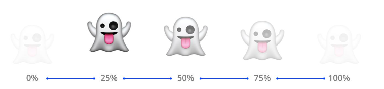

1. Creamos la animacion: Usamos la palabra `@keyframes` y le asigamos un nombre. En este ejemplo la llamamos *fantasma*

```
@keyframes fantasma {
    /* Aquí definiremos los puntos de la animación */
}
```

2. Dentro de las llaves iremos modificando las propiedades y sus valores a lo largo de la animacion: de 0 a 100% en los puntos que queramos.

```
@keyframesfantasma {   
    0% { 
        opacity: 0% 
    }   
    25% {
        transform: translateY(-20px);
        opacity: 100%
    }  
    100% { 
        opacity: 0% 
    }
}
```

3. Volvemos al selector del elemento. y agregamos las siguientes propiedades para configurar la animacion:

## **`animation-name`**

Para definir cual es la animacion que queremos utilizar.

## **`animation-duration`**

Para establecer el tiempo que debe durar la animacion. El valor puede ser en segundos `s` o milisegundos `ms`.

## **`animation-iteration-count`**

Para definir la cantidad de veces que se repetirá la animacion. Puede ser un numero o la palabra `infinite` para que se reproduzca de esa manera.

## **`animation`**

Es la forma abreviada: name + duration + iteration:

```
.fantasma {  
    animation: fantasma 3s infinite;
}
```

**Ejemplo**

Un círculo que se achica.

```
.mi-elemento {
    width: 200px;
    height: 200px;
    position: relative;
    border-radius: 100%;
    animation-name: achicando;
    animation-duration: 1000ms;
    animation-iteration-count: infinite;
    animation-direction: alternate;
}


@keyframes achicando {
    0% {
        background-color: salmon;
    }
    
    100% {
        background-color: peachpuff;
        height: 100px;
        width: 100px;
        opacity: 0.5;
    }
}
```

# Transiciones

Cuando jugamos un poco con la pseudo clase `:hover`, es fácil darnos cuenta que la misma es realmente genial, dado que nos permite generar un cambio de estado del elemento dependiendo de si el cursor del mouse pasa sobre este o no.

Sin embargo, puede que en ocasiones queramos que dicho cambio se pueda hacer de una manera un poco más sútil, de una manera un poco más amena, y no tan "brusca" como suele darse.

Es por ello que CSS, hoy en día, nos brinda la posibilidad de implementar transiciones. Estas nos **permiten lograr que estos cambios de estado se puedan ejecutar de una manera sutil y agradable** para el ojo del visitante.

Para aprender cómo usar las transiciones, veamos el video.

> ver ppt

1. Determinamos el elemento a manipular y a que propiedad queremos agregarle el efecto. Ej: color fondo y color tipografia

```
button {   
    background-color: #eaeaea;
    color: #000
}
```

2. Para modificar el valor de una propiedad de manera gradual necesitamos: 
- una propiedad con un valor inicial
- una interaccion por la cual el valor se vera modificado y el nuevo valor que cobrara la propiedad

**La interaccion**

En este caso usaremos la iteraccion de cuando el cursor pasa sobre el elemento con la pseudo clase `:hover`.

```
button:hover {    
    background-color: #1a73e8;    
    color: #fff;
}
```
3. Volvemos al selector del elemento y agregamos el valor de la propiedad `transition`.

## **`transition-property`**

Define en que propiedad del elemento elegido va a aplicarse la transicion.
Podemos pover varias separadas por  comas`,`.

## **`transition-duration`**

Establece el tiempo que debe durar la transicion.
Por defecto es `0s` o `0ms`. Es decir que no se reproducira.

```
button {   
    background-color: #eaeaea;
    color: #000;
    transition-property: background-color, color;transition-duration: 0.5s;
}
```

## **`transition`**

Es la propiedad abreviada: propiedad + duracion, propiedad+ duracion, si hay varias.

```
button {   
    background-color: #eaeaea;
    color: #000;
    transition:background-color 0.5s,color 0.5s;
}
```

**Ejemplo**

La idea es transformar este cuadrado en un círculo (border radius 50%) en 450ms. Para esto, debemos escribir, transition y border-radius. Estas deben de ser agregadas al componente en CSS correspondiente.

```
.mi-elemento {
    width: 100px;
    height: 100px;
    background-color: salmon;
    border-radius: 0%;
    transition: border-radius 450ms;
}
 
.mi-elemento:hover {
    border-radius: 50%;
}
```