# C1 - Introduccion a la informatica

**¿Qué es una computadora?**

Seguramente alguna vez nos hemos preguntado ¿cómo funciona la computadora? Nos detuvimos a pensar, al menos por un momento, qué componentes hay dentro de ella y cómo se relacionan para que esta funcione.

Como ya sabemos, una computadora es un dispositivo electrónico capaz de recibir instrucciones y ejecutarlas. Estas instrucciones son dadas por un usuario, por medio de una interfaz que presenta el sistema operativo lo cual hace más sencilla la comunicación entre el usuario y la máquina. El sistema operativo interpreta y ejecuta con los recursos que dispone, a estos recursos se les conoce como hardware y todo lo que interpreta y ejecuta los deseos del usuario es el software.

Pero, ¿esto fue siempre así ? A lo largo de la historia, esto ha ido evolucionando de manera continua, gracias a la aparición de nuevos componentes y diferentes personas que idearon una forma de maximizar la utilización de estos avances tecnológicos.

Pues bien, ha llegado el momento de adentrarnos en el estudio de esta maravillosa herramienta. También tendremos la oportunidad de conocer explorar y dar órdenes a nuestro sistema informático mediante texto, ¡qué loco suena! ¿no? Solemos dar instrucciones por medio de una interfaz que nos permite comunicarnos con la computadora, ahora conoceremos otros medios para poder comunicarnos ¡Genial!

Además, conoceremos otra gran herramienta de la informática para el control de versiones, ¿qué es el control de versiones? Eso lo descubriremos adentrándonos en la unidad y sabremos bien qué herramientas utilizar y cómo llevar sus procesos a cabo.

Al finalizar este módulo, contaremos con los conocimientos y capacidades suficientes para comprender el lenguaje técnico en cuanto a componentes y unidades de medidas utilizadas en la informática, como así también, conocerás un poco de la historia y cómo fue que la computadora llegó a ser lo que es hoy en día.

> Ver video: Introduccion a la informatica. cronologia de computacion

**Quizz**

¿Quiénes manejaban la famosa super computadora ENIAC?
¡Excelente! Un grupo de mujeres. Junto a Ada Lovelace son consideradas las primeras programadoras de la historia.

¿Quién expresó que estamos en la era cognitiva?
IBM El gigante de la tecnología aportó su respetada opinión en este tema.

¿Quién intentó crear la primera computadora?
Charles Babbage. Pero, lamentablemente, no pudo hacerlo en vida, la primera computadora fue creada un año después de su muerte.

¿Qué deseamos a futuro con la inteligencia artificial?
¡Muy bien! La inteligencia artificial se encuentra orientada a un agente flexible capaz de percibir su entorno y llevar a cabo diferentes acciones.

¿Con qué propósito creó, en 1936, Alan Turing su famosa máquina?
Descifrar los mensajes alemanes. Si bien comenzó de esa forma, Turing sabía que su máquina iba más allá de ese propósito y que cambiaría al mundo.


[Glosario tecnico](https://view.genial.ly/6038fe0b21b4a20d66aa5233)


### Hardware

El hardware o equipo se refiere a las partes físicas, tangibles, de un sistema informático, sus componentes eléctricos, electrónicos, electromecánicos y mecánicos. Ejemplos de hardware son los cables, gabinetes, periféricos de todo tipo y cualquier otro elemento físico involucrado; contrariamente, el soporte lógico e intangible es el llamado software.

- Entrada

Son aquellos componentes que permiten el ingreso de información, en general desde alguna fuente externa o por parte del usuario. Proveen el medio fundamental para transferir hacia la computadora (al procesador) información desde alguna fuente, sea local o remota. También permiten cumplir la tarea esencial de leer y cargar en memoria el sistema operativo y los programas informáticos, los que a su vez ponen operativa la computadora y hacen posible realizar las más diversas tareas.

Entre los periféricos de entrada se puede mencionar: teclado, mouse, escáner, micrófono, cámara web, joystick, lectoras de CD, DVD o BluRay, entre otros.

- Salida

Son aquellos que permiten dar salida a la información resultante de las operaciones realizadas por la CPU. Los más comunes de este grupo son los monitores, las impresoras, las consolas. y los altavoces. 

- Internos

El hardware interno es el conjunto de componentes físicos que forman parte del dispositivo principal, siendo inseparable de este.

En otras palabras, cada parte del hardware interno es una pieza fundamental de cara al funcionamiento correcto del dispositivo. Ya que si faltara alguna de las partes de este, podría bien no ejecutar alguna tarea e incluso directamente no funcionar.

Ejemplos de hardware interno: Placa base, CPU, RAM, GPU, HDD, SDD. 

### Software

Se conoce como software o soporte lógico al sistema formal de un sistema informático, que comprende el conjunto de los componentes lógicos necesarios que hacen posible la realización de tareas específicas, en contraposición a los componentes físicos que son llamados hardware. La interacción entre el software y el hardware hace operativo un ordenador (u otro dispositivo), es decir, el software envía instrucciones que el hardware ejecuta, haciendo posible su funcionamiento.

- `Software de sistema`

    Desvincula al usuario y al programador de los detalles del sistema informático en particular que se use, transparentando el procesamiento referido a las características internas de: memoria, discos, puertos y dispositivos de comunicaciones, impresoras, pantallas, teclados, etc. El software de sistema le procura al usuario y programador adecuadas interfaces de alto nivel, controladores, herramientas y utilidades de apoyo que permiten el mantenimiento del sistema global. Incluye entre otros:

    - Sistemas operativos
    - Controladores de dispositivos
    - Herramientas de diagnóstico
    - Herramientas de corrección y optimización
    - Servidores
    - Utilidades

- `Software de programación`

    Es el conjunto de herramientas que permite al programador desarrollar programas de informática, usando diferentes alternativas y lenguajes de programación, de una manera práctica. Incluyen en forma básica:

    - Editores de texto
    - Compiladores
    - Intérpretes
    - Enlazadores
    - Depuradores
    - Entornos de desarrollo integrados (IDE)


- `Software de aplicación`

    Es aquel que permite a los usuarios llevar a cabo una o varias tareas específicas, en cualquier campo de actividad susceptible de ser automatizado o asistido, con especial énfasis en los negocios. Incluye entre muchos otros:

    - Aplicaciones para Control de sistemas y automatización industrial
    - Aplicaciones ofimáticas
    - Software educativo
    - Software empresarial
    - Bases de datos
    - Telecomunicaciones (por ejemplo, Internet y toda su estructura lógica)
    - Videojuegos
    - Software de diseño asistido (CAD)

### Servidores

Un servidor es una computadora capaz de atender las peticiones de un cliente y devolverle una respuesta en concordancia. Se pueden ejecutar en computadoras dedicadas a las cuales se les conoce individualmente como "el servidor" o en la mayoría de los casos una misma computadora puede proveer múltiples servicios y tener varios servidores en funcionamiento.

- `Servidor web`

Almacena documentos HTML, imágenes, archivos de texto, escrituras, y demás material web compuesto por datos (conocidos colectivamente como contenido) y distribuye este contenido a clientes que lo piden en la red.

- `Servidor de base de datos`

Provee servicios de base de datos a otros programas u otras computadoras, como es definido por el modelo cliente-servidor. También puede hacer referencia a aquellas computadoras (servidores) dedicadas a ejecutar esos programas, prestando el servicio.

- `Servidor de archivos`

Es el que almacena varios tipos de archivos y los distribuye a otros clientes en la red.

### Interfaces de usuario (UI)

La interfaz de usuario es el espacio donde se producen las interacciones entre seres humanos y máquinas. El objetivo de esta interacción es permitir el funcionamiento y control más efectivo del sistema informático desde la interacción con el humano.

- `Interfaz de linea de comandos (CLI)`

Interfaces alfanuméricas (intérpretes de comandos) que solo presentan texto.

- `Interfaz grafica de usuario (GUI)`

Permiten comunicarse con la computadora de forma rápida e intuitiva representando gráficamente los elementos de control y medida.

- `Interfaz nativa de usuario (NUI)`

Pueden ser táctiles, representando gráficamente un "panel de control" en una pantalla sensible al tacto que permite interactuar con el dedo de forma similar a si se accionara un control físico; pueden funcionar mediante reconocimiento del habla, como, por ejemplo, Siri; o mediante movimientos corporales, como es el caso de Kinect.


# C2 - Introducción a la terminal

terminal nos referimos a un software o programa contenedor que ejecuta un shell.
Un shell, es la interfaz de línea de comandos con la que vamos a interactuar, se encarga de procesar datos y devolver resultados.

> *Hace décadas, este era un dispositivo físico que consistía en poco más que un monitor y un teclado*

### `Terminal` 

> Ver video: Terminal y su importancia
> Ver ppt: La terminal

Entonces, **una terminal es una interfaz que nos sirve para comunicarnos con una computadora**.

**Una consola es un tipo especial de terminal**. Para empezar a escribir en la consola es necesario hacerlo a través de **líneas de comandos**.

### `Lineas de comandos`
Es una instrucción específica dada a una aplicación informática para realizar algún tipo de tarea o función. **Permiten a los usuarios dar instrucciones por medio de textos sencillos como mostrar archivos**, crear archivos, mostrar datos, llamar procesos, entre otros.

Esos comandos son propios y generalmente varían según el sistema operativo.

[Comandos terminal bash](https://drive.google.com/file/d/1jPrmvt1oKPOh4MVzERW3t6izRl4ZUG_O/view)

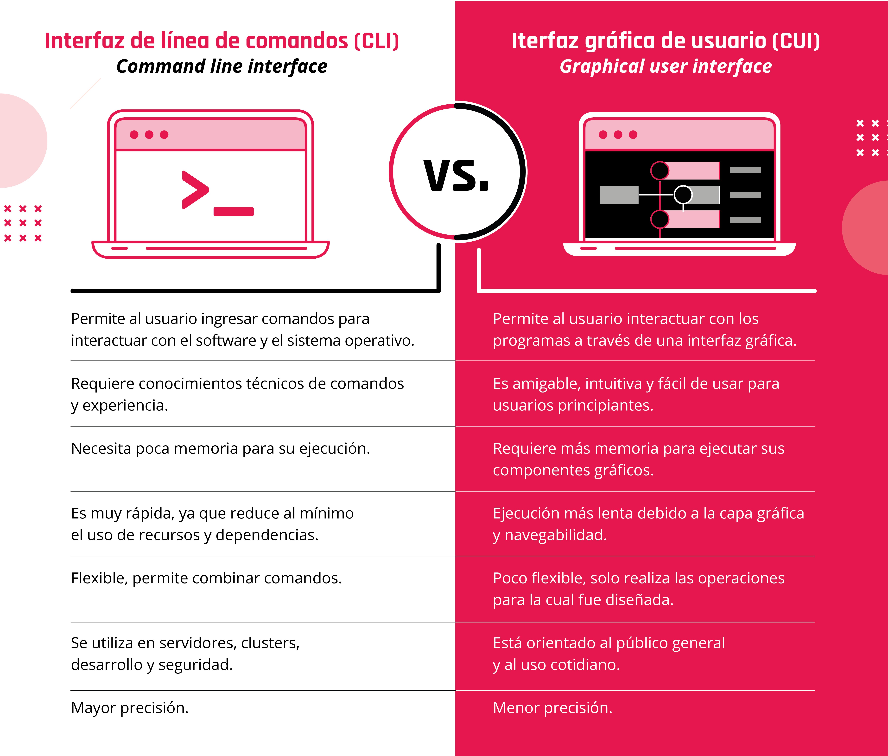

[Que hacer con la terminal](https://view.genial.ly/60475ea26498a30dc36cdffc)

**Quizz**

¿Qué es una terminal?
Es un programa que está presente en todos los sistemas operativos.

¿A qué llamamos líneas de comando?
Es la interfaz más limpia y sin distracciones, permite personalizarla.

El comando básico cd permite:
Navegar por las carpetas.

Para crear y editar archivos de texto, necesito el comando:
gedit.

¿Qué comando permite saber siempre el nombre de la carpeta en el que uno se encuentra situado?
pwd.

> Ver video: Comandos.

> comando tiene argumentos y acciones: Ej: ls (**argumento**) -t(**opciones**)

```
pwd // donde estas ubicado
cd // cambio de directorio
ls // muestra todos los archivos del repositorio
ls -t //ordena por fecha de modificacion
ls -a //lista hasta ocultosls
ls -R //lista el contenido y archivos que hayan
ls -lah //lista permisos, duenio, fecha...
cp // copiar archivos
cd / //hace que vayamos al home
cd .. //volver atras
cd ../carpeta/ //va para atras y se mete en la carpeta
mkdir //crea carpetas
touch //crea archivos
rm //remove
rm * //borra todos los archivps de la carpeta, sin pasar por consola
rm -r carpeta/ //borra recursivamente

```
### `Ruta absoluta`
Ruta completa, **pwd**, se usa la barra **` / `** al comienzo de la ruta, es mas precisa

### `Ruta relativa`
Damos la indicacion desde donde estamos parados.

[Busqueda: Find y Grep](https://view.genial.ly/60afb06cf42d920d778de964)

```
find -name //busca por nombre
find -size //busca por tamanio de archivo
find || grep -i //no tiene encuenta mayus, en find o grep
find || grep . //Busca a partir donde estamos ubicados.
grep -n //muestra la linea donde hay coincidencias dentro de archivos
grep -r // Busca en carpetas recursivamente
find || grep " " // cuando buscas un termino que tenga mas de 2 palabras
```
---
- El lenguaje que usamos en la consola e git bash es **bash**
- PowerShell es la consola mas potente

### Scripts

Archivos ejecutables, acciones automaticas usamos `nano`

```
echo //print de pantalla

```
creamos un script:

```
nano carpeta.bat
#!/bin/bash
echo "print algo"
echo " "
mkdir carpeta
cd carpeta
echo "fin proceso"
```
elegimos `control + o` enter `control + x`

```
chmod + x //Para modificar el script
chmod + x script.sh //cambia el tipo de archivo
tar //comando para comprimir
```

# C4 - Introducción a Git

> Ver video: Introduccion a Git
> Ver video: Instalacion Git

Es una herramienta que tiene muchos beneficios:
Trabajar en grupo de forma colaborativa, comunicar cambios, manejar distintas versiones.

`git` es un software de control de versiones.
Pensado para la eficiencia y confiabilidad del mantenimiento de aplicaciones cuando estas tienen un gran numero de archivos de codigo fuente.
Su proposito es llevar registro de los cambios y coordinar el trabajo que varias personas realizan sobre los mismos.

- util para compartir proyectos con diferentes personas
- tener versiones del mismo proyecto
- guardar proyectos en la nube

**Satisface 2 necesidades**

1. Backup de nuestros archivos constantemente actualizado
2. compartir nuestro trabajo con los demas colaboradores de nuestro trabajo.

### **Creando un `repositorio local`**

> Ver video: Repositorio local

**Palabras claves**

A modo de resumen, repasemos las palabras claves de este video:

- **Repositorio local**: es el que tiene todos los archivos (que hayas guardado en él) en nuestra computadora.
- **Commits**: son los paquetes que nos van a permitir ir haciendo un seguimiento de los cambios que vamos realizando, dado que cada uno de ellos tiene una timestamp, o fecha de creación, y un autor.

Los commits van a ser nuestro historial de cambios que se fueron haciendo en el proyecto.

Un repositorio sea local o remoto es un almacen de archivos; como una estantería, **donde seran almacenados los archivos** en pequenios commits.

**Comandos paso a paso**

Desde la terminal nos ubicamos en la carpeta y escribimos:

```
git init
```

Esto genera un repositorio local vacio, ya que hay que especificar que archivos deseamos agregar.

Los commits son el historial de cambios que se fueron haciendo en el proyecto; generan un punto cronologico en la linea de tiempo del proyecto, esto permite hacer un seguimiento de los cambios que se van realizando, dado que cada uno de ellos tiene una *time-stamp* y un autor.

Para hacer el seguimiento hay que agregarle nuestra identidad:

```
git config user.name "aqui va usuario"
```
podemos corroborar que lo agregamos bien:

```
git config user.name
```
agregamos nuestro mail de git

```
git config user.email "aqui va mail"
```
y tambien lo podemos corroborar:

```
git config user.email
```
podemos guardar la configuracion de forma predeterminada:

```
git config --global user.name "aqui va usuario"
git config --global user.email "aqui va mail"
```

despues de crear la url del repositorio en `Github`
posicionados en la carpeta donde creamos el repositorio local agreamos el comando:

```
git remote add origin "va url del repositorio de github"
```
Esta accion **sincroniza nuestro repositorio local con el repositorio remoto**.
Podemos verificar la operacion:
```
git remote -v
```
### **Agregar archivos a nuestro repositorio**

> Ver video: Agregando archivos al repositorio

Posicionados en nuestro repositorio local:

```
git add nombre_de_archivo
```
Para pedir informacion del estado del repositorio:
```
git status
```
Para agregar **todos** los archivos presentes en el repositorio:

```
git add .
```
Por cada modificacion que se realice en un archivo, git la tomara como un archivo nuevo o indicacion de cambio efectuado. Este es el control de versiones.

Entonces para cada cambio repetirmos, git add

```
git add .
```

**Quiz**

¿Cómo guardo los cambios en Git en forma versionada?
¡Muy bien! Es a través de los commits que vamos a poder hacer el seguimiento de los cambios que se van realizando en los proyectos, ya que cada uno de ellos genera un punto cronológico en la línea de tiempo del proyecto.

¿Cómo agrego los archivos a Git?
Utilizamos git add . para agregar todos los archivos o git add con el nombre del archivo para agregar de a uno

Si tengo el archivo productos.js y lo agrego a Git mediante el comando git add y posteriormente lo modifican...
Hay que volver a agregarlo al commit con otro git add
¡Muy bien! Cada vez que desees guardar el estado de un archivo, y que git deje constancia del mismo, debés realizar un git add.


### **Confirmando archivos**

> Ver video: Confirmando archivos

Creamos commits, que son pequenios paquetes de adiciones o modificaciones que tendran una marca/descripcion clara y estaran firmados por el autor.
Estos generan puntos cronologicos en la linea de tiempo del proyecto; nos permiten identificar el estado del mismo hasta ese momento especifico y volver a los mismos si quisieramos.

Para crear un commit, necesitamos haber agregado los archivos al repositorio con git add y luego:

```
git commit -m "descripcion de modificacion"
```
Para revisar el historial de cambios en nuestros proyectos; generamos un historial de los commits con:

```
git log
```
Podemos volver a un estado anterior siempre y cuando le hayamos puesto git add con:

```
git checkout nombre_archivo
```
> **Github** Es una plataforma colaborativa que permite llevar un control de versiones. Los repositorios que estan en github se llaman repositorios remotos y los que tenemos en la pc son repositorios locales.

**Quiz**

Un commit tiene...
fecha, autor y mensaje
¡Muy bien! Cada vez que subimos archivos (nuevos o modificados) a un repositorio remoto, se suben en forma de un pequeño paquete de modificaciones de archivos. Cada paquete tiene una fecha de creación (timestamp) y un autor.

Con Git...
podemos tener un orden cronológico del proyecto.
podemos revertir cambios y volver a un estado anterior.

Seleccionar el orden correcto para persistir los cambios de productos.js.
git add productos.js —> se modifica el archivo —> git add productos.js —>git commit -m "Carrito agregado"
¡Muy bien! Luego de modificar un archivo, si queremos guardar las modificaciones, tenemos que decirle a Git que las incluya, utilizando el comando git add.


En Git el ciclo de vida del archivo es:

1. Creación del archivo, por ejemplo index.html (aquí el archivo está en estado untracked).

2. Cambiamos el estado del archivo a seguimiento a través del comando git add index.html (especificando nombre del archivo index.html para este caso). Si el archivo ya no será modificado, pasar al paso 6.

3. Si el archivo es modificado, deja de estar en seguimiento y pasa a un estado de modificado, ya que Git detecta que hubo cambios.

4. Guardamos el archivo con ctrl+g (o ctrl + s) y luego escribimos git add index.html (especificando nombre del archivo index.html para este caso), el archivo pasa al stage area.

5. El archivo está listo para realizar el commit, que es cuando se genera el punto histórico, a través del comando git commit.

Para especificar que git no realice más seguimiento a un archivo, usamos el comando git rm --cached donde si bien el archivo como tal no se ha eliminado, Git procede a ignorarlo y pasa a un estado de untracked.

# C5 - Github

Siguiendo las instrucciones del video, crearemos un repositorio en la nube. Ahora, vamos a poder descargar y modificar el repositorio desde cualquier computadora del mundo.

Para poder cumplir con este objetivo vamos a utilizar https://github.com/. Pero, ¿qué es Github?
Es una plataforma colaborativa que nos va a permitir llevar un control de versión
sobre nuestro código. 

> Ver video: GitHub

**Palabras clave**

A modo de resumen, repasamos las palabras y conceptos clave del video sobre GitHub:

- GitHub es un lugar en la nube.
- Repositorio es el lugar en donde se irán almacenando los archivos de nuestro proyecto y a través del cual podremos hacer seguimiento de los mismos.
- Repositorios remotos: viven en la nube, es decir, en GitHub.
- Repositorios locales: viven en nuestra computadora.

> Ver pdf paso a paso: Github

**Quiz**

Git y GitHub:
Git es un sistema de versionado y GitHub un sistema en la nube que provee de ese servicio.
¡Muy bien! Si bien tienen un nombre similar, Git es la tecnología que mantiene el sistema de versionado, mientras que GitHub es un proveedor del servicio. Hay muchos más, como GitLab o Bitbucket, los invitamos a visitar sus páginas webs y ver qué ofrecen.

Un repositorio en GitHub es…
un sitio web donde puedo almacenar proyectos.
Podés almacenar archivos y proyectos ¡DE FORMA GRATUITA!

¿Cuál es la diferencia entre un repositorio local o remoto?
Un repositorio local es el que se encuentra en mi computadora y el remoto es el de GitHub.
¡Muy bien! Recordá que es necesario crear un vínculo entre ambos para poder mantener actualizados los archivos locales que están conectados a ese repositorio en la nube.


Conectando nuestro repositorio local a GitHub

Llegó finalmente el momento de conectar lo que estuvimos realizando localmente con GitHub. Para poder hacer esto, debemos tener:

1. Una cuenta en GitHub.
2. Un repositorio local que utilizaremos para poder conectarlo.

Con el objetivo de poder practicar junto al video, tenemos que poseer un repositorio local configurado:

1. Debemos inicializar un repositorio. Para esto, ejecutemos git init en la carpeta que queramos conectar el repositorio.
2. Luego tenemos que indicar al repositorio nuestros usuario ejecutando dos comandos:

```
git config user.name “mi usuario” (escribimos nuestro nombre de usuario).
git config user.email “miCorreo@email.com” (escribimos nuestra dirección de correo).
```

Si tenemos dudas de cómo ejecutarlos, podemos recurrir al video de la clase de git “Creando nuestro primer repositorio local”.

Con estos pasos hechos, continuemos con el siguiente video.

> Ver video: conectar repositorio local

### **Subiendo archivos**

Hicimos las modificaciones al código, resolvimos los errores, finalizamos las nuevas funcionalidades y el equipo está ansioso esperando que compartamos el código. Vamos a ver cómo compartir el código en nuestro repositorio local.

> Ver video: Subiendo archivos.

`git push` Una vez hicimos el commit, enviaremos los archivos del repositorios local al repositorio remoto. Donde origin se refiere al repositorio remoto y main a la rama donde queremos insertar los commits.

```
git push origin main
```
Hace push a todas las ramas, creandolas en el remoto.
```
git push -u origin main
```
origin > es Remoto


### **Bajando archivos**

Para generar una copia exacta en la computadora de todos los archivos existentes en un repositorio remoto.

> Ver video: Bajando archivos

```
git clone "url_del_repositorio"
```

`git pull` Para mantener sincronizados los archivos existentes entre diferentes pc y/o quieras actualizar el repositorio remoto con el local, siempre primero debes actualizar las archivos que hayan sufrido cambios o actualizaciones o hayan nuevos archivos con:

```
git pull origin main
```
### **Resolviendo conflictos**

Todo iba de maravilla hasta que alguien decidió modificar el mismo archivo en el que estábamos trabajando y, para nuestra desgracia, hizo el push primero. ¿Hora de entrar en pánico? ¿Tiempo de abandonar la carrera de programación? ¡No, para nada!

Los conflictos son parte natural del trabajo en equipo y son aún más comunes en proyectos complejos con equipos numerosos. En el siguiente video veremos cómo darle solución a cada uno de ellos.

> Ver video: Resolviendo conflictos

[resolviendo conflictos](https://view.genial.ly/5f920b8a4874e60d0eb73d67)

Cuando 2 personas o mas modifican el mismo archivo.
Traemos los cambios con
```
git pull origin main
```
veremos en el documento algo como:
```
<<<<<<<<<<<<<<<<<<<<<<<<<HEAD
__aqui_van_nuestros_cambios__
=============================
__cambios_traidos_de_github__
>>>>>>>>>>>>>>>>>>>>>>>876769
```
Aqui decidiremos que haremos, si dejamos cambios nuevos mas los nuestros, si cambiamos los 2 cambios o dejamos los viejos.
una vez resuelto, volvemos a preparar los commits con `git add .`

> Una manera de evitar conflictos es hacer commits pequenios y el uso de ramas paralelas a la version principal.

### **Ramas**

> Ver el pdf de ramas

Es una linea paralela que actua como copia alternativa del repositorio, en la cual podemos agregar funcionalidades sin modificar la linea original ni afectar el codigo que hay ahí.
Es una version 2 del proyecto en la cual puedo probar cosas nuevas y si gustan las puedo fusionar con la rama principal.

Para crear una nueva rama:
```
git branch nombre_rama_nueva
```
Podemos ver las ramas creadas con:
```
git branch --list
```
Muestra todas las ramas locales y remotas:
```
git branch -a
```
Para eliminar una rama:
```
git branch -d nombre_rama
```
Para forzar la eliminacion de una rama:
```
git branch -D nombre_rama
```
Para movernos de una rama a otra usamos:
(en visual code esquina izquierda podemos movernos tambien)

```
git checkout nombre_rama
```
> Solo podemos movernos a otras ramas si no tenemos cambios, si tenemos modificaciones y necesitamos cambiar de rama debemos eliminarlos o hacer commits.

Para guardar los cambios y subirlos al repositorio, ubicados en nuestra rama:

Traemos los nuevos posibles cambios de la rama con:
```
git pull origin nombre_rama
```
en caso que no haya conflicto o se haya resuelto:
```
git push origin nombre_rama
```
### **Fusionar con rama principal**

Luego de haber hecho los `git push` a nuestra rama. Mergearemos con la rama main.

Para eso nos cambiamos a la rama main:

```
git checkout main
```
Primero traemos los posibles cambios que se hayan dado en la rama principal:
```
git pull origin main
```
Podemos verificar que todo este bien con :
```
git status
```
Si esta todo limpio, es hora de mergear:
```
git merge nombre_rama
```
Ahora el contenido de mi rama esta en la rama main.
Con `git log` vemos que al hacer el merge se genera un commit automatico.
Luego, si hago un `git status` me avisara que la rama remota esta desactualizada por lo que hare un git push con los cambios.

```
git push origin main
```
Cuando tengamos que agregar mas archivos a mi rama.
Nos dirigimos a nuestra rama:
```
git checkout nombre_rama
```
Podemos verificar el ultimo commit para saber si nuestra rama esta desactualizada o no con:
```
git log --oneline
```
Si esta desactualizada, debemos emparejarlas, tenemos que mergear la rama main a mi rama, es decir el proceso inverso:

```
git merge main
```
> Ver ppt. Paso a paso
> Ver pdf: Guia de uso RECOMENDADO
> Ver pdf: Comandos git y glosario

[Guia de la mochila](https://docs.google.com/document/d/1UagYcWhfh-4T1eY8x3XcSeziYmJ-lkJu4rrOTAId1Hs/edit)

[Flow de Github](https://view.genial.ly/605237fbeca4360d872c50e5)

> Ver practica integradora Git + Github

# C7 - Componentes de una computadora

¿Qué significan los términos hardware o software? Las computadoras deben su funcionamiento a esos dos elementos básicos. El primero, como su nombre lo indica, es la parte “dura” de un sistema informático, los componentes electrónicos en sí, como placas de video, memorias, teclados, todo componente tangible que utilizamos para interactuar con nuestro ordenador. El segundo, es la parte “blanda” que proporciona las instrucciones necesarias para realizar una determinada función, como, por ejemplo, los sistemas operativos, los juegos, programas de usuario y demás. Como vemos, tanto el hardware como el software dependen el uno del otro para poder existir.

¡Acompañanos a averiguar qué es una computadora, cuáles son sus partes y cómo interactúan entre sí!

> ver video: The big Picture

## Componentes internos

### **Placa madre o motherboard**

Es la placa principal de cualquier computadora, al que todos los demás dispositivos se conectan, tanto de manera directa (como los circuitos eléctricos interconectados), como indirecta (a través de puertos USB u otro tipo de conectores). 


### **Procesador**

También llamado unidad central de procesamiento o CPU, es el “cerebro” de la computadora, su función es interpretar y ejecutar las instrucciones a través de operaciones básicas: aritméticas y lógicas. Es quien “dirige” las operaciones que realiza la computadora.Se localiza en la placa madre y posee un disipador de calor sobre el mismo.


### **Memoria RAM y ROM**

- La memoria RAM es el componentes que almacena información de manera temporal. Tiene la particularidad de que el contenido de la misma se elimina cada vez que se apaga la computadora.

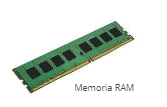

- La memoria ROM, por otra parte, almacena información de manera permanente. Guarda todo lo relacionado a la configuración inicial para el arranque de la máquina y funcionamiento básico.Memoria RAMMemoria ROM

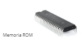

### **Placa de video y sonido**

Son componentes internos que se conectan a la placa madre.●La placa de video o tarjeta gráfica, es la encargada de mostrar imágenes en el monitor. Hace referencia al conjunto formado por la GPU (Graphic Processing Unit), los módulos de memoria, su disipador, salidas de video, etc.●La placa de sonido permite que la computadora reproducir sonidos a través de auriculares o parlantes. También permite recibir sonidos a través de micrófonos.


### **Dispositivos de almacenamiento secundario**

Almacena datos de manera permanente. Es información que la computadora no necesita de manera inmediata para su funcionamiento. Puede almacenar archivos de todo tipo como documentos, imágenes, videos, audios, etc. El dispositivo de almacenamiento secundario interno es el disco rígido, o disco duro.


### **Fuente de Alimentación**

La fuente de alimentación de una computadora convierte la energía del tomacorriente en el tipo de energía que necesita la computadora. Envía la misma a través de cables a la placa madre y a otros componentes.

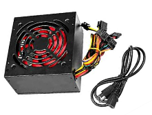

## Componentes externos

Los componentes externos de una computadora son todos aquellos dispositivos que utiliza la computadora, pero que no son imprescindibles para su funcionamiento.

### **Dispositivos periféricos**

Son aquellos que se conectan a la  para añadir funciones u operaciones a la computadora, pero no son parte esencial de la misma.

Pueden ser:
- De entrada: Introducen datos a la computadora.
- De salida: Extraen datos de la computadora.
- Mixtos: Cumplen ambas funciones.

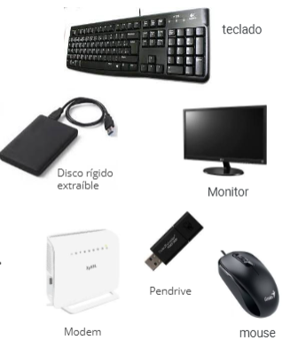

[Visual de componentes externos - Dispositivos de entrada, salida y mixtos](https://view.genial.ly/6055e4ba1cf7590da4c84053)

[Visual de componentes internos - Arquitectura de componentes](https://view.genial.ly/60552308b28f3c0d9046d463)

**Quiz**

¿Qué es una computadora?
Opción 1: Es esencialmente una máquina que recibe datos, los procesa y muestra los resultados. Los mismos pueden ser almacenados, transmitidos o impresos .

Los componentes internos de una computadora son:
Opción 3: Son todos los elementos físicos inseparables de la computadora. Si faltara alguno de ellos, la misma podría funcionar de manera incorrecta o no hacerlo.

¿Qué son los periféricos?
Son aquellos dispositivos que se conectan a la CPU para añadir funciones u operaciones a la computadora, pero no forman parte esencial de la misma 

Representar información como pulsos eléctricos es lo que le permite a las computadoras procesar la información y transformarla.
Opción 1: Verdadero

## Unidad de Procesamiento Central

Podríamos decir que el Procesador, denominado también Unidad de Procesamiento Central o CPU, es el "cerebro" de un sistema informático ya que controla el funcionamiento de todo el hardware y el software. En efecto, ejecuta instrucciones almacenadas como números binarios organizados en la memoria principal, por lo que, cuanto más potente sea tu procesador, más rápido podrá hacer las operaciones y más rápido funcionará tu dispositivo en general. Entre otras cualidades, es también el encargado de leer, interpretar y procesar las instrucciones primero del Sistema Operativo, y después de los programas o aplicaciones que tenés instalados en el ordenador.

Llegados hasta acá, sigamos descubriendo quién piensa dentro de nuestras computadoras, quién se encarga de ejecutar cada una de las tareas y cómo lo hace.

> ver video: Quien piensa

Bases del funcionamientos de los dispositivos electronicos:

- Buscar el proximo paso
- Leer y ejecutar la instruccion
- Obtener el resultado

> ver ppt. Analizando el cerebro

El microprocesador o simplemente procesador (CPU) es el cerebro del sistema, justamente procesa todo lo que ocurre en la PC y ejecuta todas las acciones que existen.

## **CPU - Caracteristicas**

### Zócalo / Socket de un CPU

El zócalo de CPU se usa para fijar y conectar el procesador, sin soldarlo, lo cual permite quitar y poner diferentes modelos y familias sin tener que cambiar de placa base. 
El zócalo realiza todas las comunicaciones con el exterior. Dependiendo del número de conexiones se podrán tener más elementos integrados y ofrecer un mayor ancho de banda hacia los otros componentes del sistema.


> Nota: Los celulares y laptops, como norma general, no utilizan socket

### Núcleos / Cores de un CPU

Los núcleos son como un subprocesador en sí mismo. 

Los procesadores de un solo nucleo (single core) no pueden realizar más que una tarea al mismo tiempo.

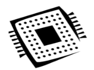

Una CPU con dos núcleos (dual core) sí que podría realizar dos tareas al mismo tiempo, uno de cuatro (quad core), pues cuatro, y así de forma correlativa con tantos núcleos como incorpore. 

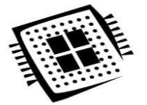

### Hilos / Threads de un CPU

Los hilos son el flujo de control de programa. Ayudan de forma directa a la manera en la que un procesador administra sus tareas. Su función es que los “tiempos de espera”entre procesos se aprovechen mejor.Los hilos pueden hacer creer al usuario que sí se puede hacer más de una cosa al mismo tiempo dividiendo la tarea en porciones, de modo que se alternan porciones de tareas para que parezca que se ejecutan al mismo tiempo.


### Memoria caché de un CPU

La memoria caché es la memoria más rápida del sistema y se utiliza para acelerar el acceso a memoria de nuestro procesador. Almacena los datos e instrucciones más utilizados por el sistema para evitar perder tiempo y tener que acceder a ellos en la RAM.

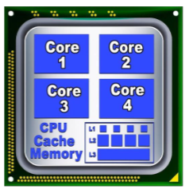

### Frecuencia de un CPU

El procesador está gobernado por un reloj que sincroniza sus componentes y limita las operaciones que es capaz de realizar en una determinada cantidad de tiempo.La frecuencia es el número de cambios que se hace en un determinado segundo. 

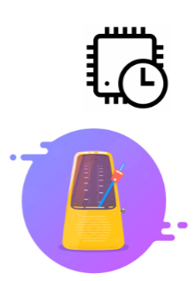

## **CPU - Rendimiento**

La frecuencia no lo es todo

Hay parámetros más importantes para medir el rendimiento de un procesador en funcionamiento. Aquel al que se le suele dar una mayor importancia es el IPC o Instrucciones Por Ciclo. 

El IPC mide el número de instrucciones que un procesador es capaz de realizar en cada ciclo de su reloj interno. 

Mientras que una CPU con una velocidad de reloj más rápida puede completar más ciclos en un segundo, una CPU con un IPC más alto, pero con una frecuencia más baja, puede ser capaz de completar más tareas en un segundo. 

> “Los microprocesadores se están metiendo en todo. En un futuro cercano no habrá ningún accesorio—salvo una escoba, tal vez— que no tenga un procesador dentro.” Arthur C. Clarke

Microprocesadores:


**Quizz**

¿Qué es el CPU?
Es el encargado de procesar todas las tareas de nuestra PC, a través de la resolución de instrucciones lógicas y matemáticas que están almacenadas en la memoria RAM.

Seleccioná características atribuibles al CPU:
Cantidad de núcleos.
Tamaño de la memoria caché.
Frecuencia del reloj.

Seleccionar el componente desde donde toma los datos y las instrucciones el CPU para realizar sus tareas:
La memoria RAM.

La potencia del procesador depende de..
La frecuencia.
Los núcleos.
Los hilos.

## Arquitectura de Von Neumann

El procesador es un dispositivo que necesita comunicarse con muchos otros elementos. Lee datos e instrucciones de la memoria RAM, requiere información desde perifericos de entrada y se comunica con periféricos de salida para mostrar los resultados.


La mayoría de las computadoras actuales están inspiradas en el modelo de Von Neumann. A pesar de los años transcurridos desde su publicación, la estructura interna de las computadoras que utilizamos hoy en día, aún conservan la mayor parte de las características propuestas por el matemático y físico húngaro. A continuación, vamos a conocer un poco más sobre este modelo.

John Von Neumann fue un físico y matemático, que diseñó la arquitectura básica de las computadoras que utilizamos hasta hoy.

### Cómo funcionaban las primeras computadoras

Las primeras computadoras tenían programas fijos. Algunos equipos muy simples siguen utilizando este diseño. Por ejemplo, una calculadora de escritorio posee un programa fijo que puede resolver cálculos de matemáticas básicas

Las primeras computadoras fueron diseñadas para realizar cálculos específicos. Cuando era posible, se podían “reprogramar”, pero este era un proceso laborioso que contenía un rediseño de ingeniería, y luego un largo proceso de recableado físico y reconstrucción de la máquina.

Al finalizar la Primera Guerra Mundial, se evidenció la necesidad de crear una máquina de propósito general, puramente electrónica. Así nació la arquitectura de Von Neumann.

## **Modelo o arquitectura de Von Neumann**

El modelo o arquitectura de Von Neumann es un modelo conceptual que muestra cómo funciona una computadora. Está basado en el desarrollado por el físico y matemático John Von Neumann

Está formado por:
- CPU (central processing unit) o unidad central de procesamiento. 
    Esta, a su vez, contiene:
    - Una ALU (arithmetic logic unit) o unidad aritmético lógica y Registros del procesador. 
    - Una unidad de control y un contador de programa.count
- Tiene una memoria principal y accede a mecanismos de entrada y salida.

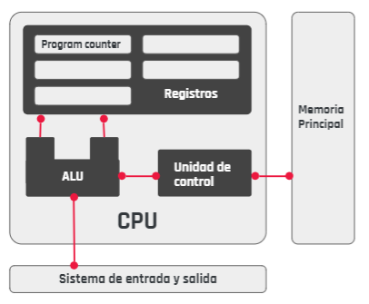

### **CPU o unidad central de procesamiento**

Es la encargada de interpretar y procesar las instrucciones recibidas de un programa. La CPU contiene a la ALU, la unidad de control y un conjunto de registros

- La **ALU o unidad aritmético lógica** solo realiza operaciones aritméticas y lógicas sobre los datos. Realiza los cálculos de suma, resta, multiplicación, división y resta, pero también puede realizar operaciones lógicas del tipo AND, OR o NOT.

- La **unidad de control** controla el funcionamiento de la ALU, la memoria y los dispositivos de entrada y salida de la computadora. Gestionará  el proceso de mover los datos y programa desde y hacia la memoria y de ejecutar las instrucciones del programa.

- Los **registros** son áreas de almacenamiento de alta velocidad en la CPU, todos los datos deben almacenarse en un registro antes de poder procesarse. 
    - El **registro de datos** de memoria contiene los datos que se transfieren a la memoria.
    - El registro de direcciones de memoria contiene la ubicación en la memoria, de los datos a los que debe acceder.
    - El **contador de programa** o program counter es quien calcula la cantidad de ciclos de ejecución y apunta a la próxima instrucción en ser ejecutada.

Funciona utilizando el llamado “Ciclo de la máquina”,  usando cuatro simples pasos: buscar, decodificar, ejecutar, almacenar.

Las instrucciones son obtenidas por la CPU desde la memoria. La CPU luego decodifica y ejecuta estas instrucciones. El resultado es almacenado de nuevo en la memoria luego que se complete el ciclo de ejecución de las instrucciones.


## CPU vs GPU


# C8 - Memorias

Introducción a las memorias de nuestra computadora

Nuestra memoria puede ser definida como la capacidad de recordar. Es la facultad del cerebro para retener y recordar eventos del pasado, ya sean sensaciones, impresiones, sentimientos o ideas concretas.

En informática, esta idea no está muy lejos de la realidad, puesto que la memoria es el dispositivo que retiene, memoriza o almacena datos informáticos durante algún periodo de tiempo. ?En ese sentido, proporciona una de las principales funciones de los ordenadores porque almacena información y conocimientos. Interconectada a la CPU y a los dispositivos de entrada/salida, implementa lo fundamental del modelo de computadora de la arquitectura de Von Neumann.

¿Están preparados para conocer más sobre las memorias y cuáles existen?

> ver video: Introduccion a memorias

[Tipos de memorias: Principal vs Secundaria](https://view.genial.ly/605f54dbe44ee30d9ab72db6)

[Caracteristicas de las memorias RAM](https://view.genial.ly/60b6c1cc9f478b0d11b0f180)

- Velocidad
- capacidad
- Latencia
- Voltaje

**Quizz**

La memoria principal posee las siguientes características:
Opción 1: Puede ser volátil.
Opción 2: Su capacidad es limitada.
Opción 4: Su velocidad es mayor que la memoria secundaria.
Opción 5: Su costo es más elevado que la memoria secundaria.

Para acceder simultáneamente a dos módulos de memoria RAM, estos deben ser:
Opción 1: De la misma capacidad, velocidad, frecuencia, latencia y fabricante.

¿Qué es la latencia?.
Opción 4: Es la cantidad de ciclos de reloj que transcurren entre una petición y su respuesta.

La velocidad total de una memoria RAM se obtiene al sumar la velocidad de cada módulo.
Opción 1: Verdadero.

## Unidades de Medida

¿La información que almacenamos en la computadora ocupa espacio?

¡Por supuesto! ¡Todo es medible!

Desde la cantidad de lluvia que cae hasta la temperatura que sentimos puede medirse. Así también, todo dispositivo de almacenamiento o incluso la memoria principal de la computadora tiene cierto tamaño.

Una fotografía o un vídeo, físicamente, se almacenan en algún lugar, por ejemplo, en la tarjeta de memoria SD de nuestros teléfonos, tabletas o en el disco duro de la computadora. Si analizamos el caso de la imagen, podemos ver que entre sus propiedades hay un número interesante que aparece allí:

Podemos ver que todos los píxeles y toda la información de la imagen, ocupan 16,8 kilobytes. Hay muchos archivos, particularmente los de vídeo, que ocupan muchos gigabytes de espacio. Un vídeo de buena definición, grabado desde un celular, de aproximadamente una hora, ocupa aproximadamente 2 gigabytes con alta definición.

Siempre deberemos tener en cuenta el tamaño que ocupan nuestros archivos porque las capacidades de almacenamiento son limitadas.

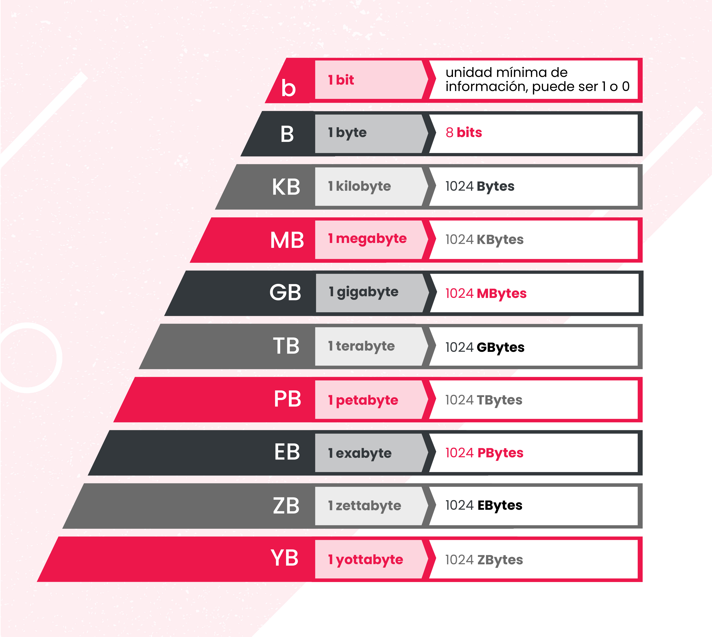

> Ver ppt: Sistema numerico

El sistema de numeración es un conjunto de símbolos y reglas de generación que permiten construir todos los números válidos del sistema.

## Tipos de sistemas numéricos 

Sistema numerico no posicional y sistema numerico posicional


Se define como dígito a cada uno de los símbolos diferentes que constituyen el sistema de numeración. 

### **Base y dígito**

Definimos como base del sistema de numeración a la cantidad de dígitos que lo conforman. 
Ejemplo: Este sistema está formado por diez símbolos, los dígitos del 0 al 9. Por lo tanto, estaremos frente a una base 10.

Una vez agotada la cantidad de dígitos que forman al sistema de numeración, las cantidades mayores a la base se obtienen combinando en forma adecuada los diferente dígitos del sistema. Esto hace que cada uno de los dígitos adopte distintos valores según la posición que ocupe.

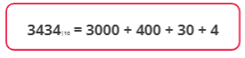

Una forma más clara es si expresamos en número en función de su base 10. 


También podemos representar números decimales en sistema posicional. 


### Sistema binario

Es un sistema de numeración que está formado por dos símbolos, los dígitos son representados utilizando dos cifras: 0 y 1. 

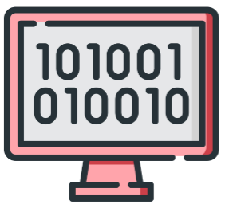

**Quizz**

¿Cuál es la menor unidad de medida de almacenamiento?
Opción 2: Un bit.

Enunciado: Un bit es...
Opción 3: Un dígito del sistema binario que puede ser 0 o 1.

Un byte es...
Opción 2: 8 bits.

Un megabyte es...
Opción 2: 1024 kilobytes.
Opción 4: 1048576 bytes.

2048 megabytes son...
Opción 2: 2 gigabytes.

## Memoria principal

¿Qué es la RAM? RAM es el acrónimo de random access memory (memoria de acceso aleatorio). La información almacenada en este tipo de memoria se pierde cuando se desconecta la alimentación del PC o del portátil. Se conoce generalmente como memoria principal o memoria temporal o volátil del sistema informático. Es el lugar donde se almacenan temporalmente tanto los datos como los programas la CPU está procesando, o va a procesar, en un determinado momento.

> Ver video: Memoria principal.

> ver ppt: Registros, cache, RAM.

> Lo que realmente desató la capacidad de la computación programable fue la invención de las memorias. Dr. John E. Kelly III Vicepresidente ejecutivo de IBM

## Registros de la CPU

Un registro es una memoria de muy alta velocidad, que se utiliza en los procesadores para acceder a información importante de manera rápida. 

La CPU tiene 5 registros internos.

1. PC: Program counter
2. IR: Instructions register 
3. MAR: Memory address register
4. MDR: Memory data register
5. Accumulator

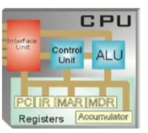

- Los **registros** son áreas de almacenamiento de alta velocidad en la CPU, todos los datos deben almacenarse en un registro antes de poder procesarse. 
    - El **registro de datos** de memoria contiene los datos que se transfieren a la memoria.
    - El registro de direcciones de memoria contiene la ubicación en la memoria, de los datos a los que debe acceder.
    - El **contador de programa** o program counter es quien calcula la cantidad de ciclos de ejecución y apunta a la próxima instrucción en ser ejecutada.

## Caché de la CPU

Es un apoyo importante para el procesador que se divide en un total de tres niveles generales al que podemos sumar un cuarto que no resulta nada común.La diferenciación entre memoria caché L1, L2 y L3 (tambien existe L4)  obedecen a un orden de jerarquía establecido por cercanía al procesador, velocidad y capacidad.

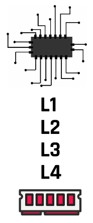

## Tipos de RAM

### **V (video) RAM**

Es la memoria RAM optimizada para adaptadores de vídeo. Tienen dos puertos para que los datos de vídeo puedan escribirse al mismo tiempo. El adaptador de vídeo lee regularmente la memoria para refrescar la pantalla del monitor.

### **DDR RAM**

Lanzada en el año 2000, aunque no empezó a usarse hasta casi 2002. Operaba a 2.5V y 2.6V y su densidad máxima era de 128 Mb (por lo que no había módulos con más de 1 GB) con una velocidad de 266 MT/s (millones de trasnferencia por segundo) (100-200 MHz).

### **DDR2 RAM**

lanzada hacia 2004, funcionaba a un voltaje de 1.8 voltios, un 28% menos que DDR. Se dobló su densidad máxima hasta los 256 Mb (2 GB por módulo). Lógicamente la velocidad máxima también se multiplicó, llegando a 533 MHz.

### **DDR3 RAM**

El lanzamiento de esta memoria se produjo en 2007 y supuso toda una revolución porque aquí se implementaron los perfiles XMP. Para empezar los módulos de memoria operaban a 1.5V y 1.65V, con velocidades base de 1066 MHz pero que llegaron mucho más allá, y la densidad llegó hasta a 8 GB por módulo.

##3 **DDR4 RAM**

Lanzada en 2014. Se reduce el voltaje hasta 1.05 y 1.2V, aunque muchos módulos operan a 1.35V. La velocidad se ha visto notablemente incrementada, pero su base comenzó en los 2133 MHz. Actualmente ya hay módulos de 32 GB, aunque esto se va ampliando poco a poco.

### **DDR5 RAM**

Lanzada a mediados del 2020 llega a anchos de banda de hasta 6.4 Gbps en sus modelos iniciales, es la primera memoria DDR de doble canal en un solo chip. Su frecuencia base es de 4800 MHz y, además, su consumo baja por la clásica reducción de voltaje, esta vez a 1.1 V. Su capacidad de almacenamiento máxima en un módulo de memoria es de 128 GB.

> “La memoria guardará lo que valga la pena. La memoria sabe de mí más que yo; y ella no pierde lo que merece ser salvado.” -Eduardo Galeano

**Quizz**

¿Qué es la memoria principal?
Es la memoria de la computadora donde se almacenan temporalmente tanto los datos como los programas que la CPU está procesando, o va a procesar, en un determinado momento.
Es la memoria conocida como rom la cual utiliza el procesador para cargar su configuración inicial al arrancar.

La memoria RAM...
Significa memoria de acceso aleatorio.
Permite acceder a cualquier byte de memoria sin acceder a los bytes precedentes.

La memoria caché es..
Un tipo de memoria que guarda datos para que las solicitudes futuras de esos datos se puedan atender con mayor rapidez.

La memoria caché del procesador contiene los niveles L1, L2, L3 y L4.
L1 es el nivel con menor capacidad de almacenamiento.
Dependiendo del procesador puede haber o no, un nivel L4.

Cuando el CPU necesita un dato, ¿cómo lo busca?
Lo busca en su memoria caché y si no lo encuentra, se lo pide a la memoria RAM.

## Memoria secundaria

La memoria secundaria está compuesta por todos aquellos dispositivos capaces de almacenar datos. Estos dispositivos pueden ser internos, como el disco duro, o extraíbles, como los discos flexibles y DVDs.

En consecuencia, podríamos decir que la memoria secundaria es un tipo de almacenamiento masivo y permanente (no volátil) con mayor capacidad para almacenar datos e información. Pero veamos con mayor detenimiento el siguiente video y algunos de los dispositivos de mayor impacto para afianzar estos conceptos ¿Listos?

> Ver video: Memoria secundaria.

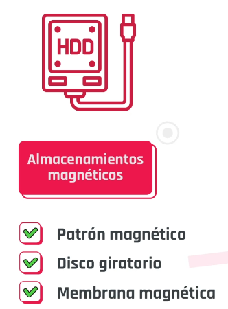


[Tipos y ejemplos: Memorias secundarias](https://view.genial.ly/606089bc410dd80d483b58bd)

**Quizz**

Los discos sólidos funcionan con magnetismo. 
Falso

¿Qué es un disco M2?
Una variante del disco solido.

Los Blu-ray solo poseen una capa de escritura.
Falso.

¿Dónde se produce el cuello de botella en los discos SSD? 
En el bus sata.

¿De qué material están compuestas las cintas magnéticas?
Óxido de hierro.

# C10 - Sistemas operativos

- Es un **conjunto de programas** que permite manejar la memoria, disco, medios de almacenamiento de información y los diferentes periféricos o recursos de nuestra computadora.
- Es el software que maneja el hardware; el soporte logico; **administra los recursos ofrecidos por el hardware** y actúa como un intermediario entre la computadora y su usuario; comunicacion **usuario-dispositivo**
- Tambien administra los **protocolos de ejecucion de otro software**
- Ofrece un ambiente amigable y sencillo de interpretar
- Se encuentran en constante mejoria

## Funcionalidades y administracion 

> Ver video: funcionalidades y administracion

[Administracion e tareas, de usuarios y estructura interna](https://view.genial.ly/60c8e8768637b30d68d162d2)

Recursos administrados por el sistema operativo

- Gestionar la **memoria** de acceso aleatorio y ejecutar las aplicaciones, designando los recursos necesarios.
- Administrar la **CPU**, gracias al algoritmo de programación.
- Direccionar las **entradas y salidas** de datos (a través de drives), por medio de los periféricos de entrada y salida.
- Administrar **la información** para el buen funcionamiento de la PC.
- Dirigir **las autorizaciones** de uso para el usuario.
- Administrar **los archivos**.

### En PC domesticas
- Son monousuario
- Ofrece un ambiente amigable y sencillo de interpretar

### En servidores

- Encontramos sistemas operativos heredados de sistemas operativos:
    - **UNIX**
    - **Red Hat**
    - **Windows Server**
    Diseniados especificamente para este tipo de computadoras.
- Son multiusuario, eso las diferencia de los **OS** domesticos, el uso.
- Se encuentran en constante mejoria

## Clasificacion de los Sistemas operativos 

**segun su licencia**

### Open source
Permiten al sistema operativo.
- Modificar
- Usar
- Adaptar 
Ej: Ubuntu, Red Hat

### Proprietary software
No permiten modificaciones:
Ej: Windows

## Tipos de sistemas operativos

> Los tipos de sistemas operativos varian segun el ahrdware y la funcion decada dispositivo

|Usuario|Gestion de tareas|Gestion de recursos|Estructura interna|
|-------|-----|-----|---------------------------------------|
|Multiusuario|Multitarea|Centralizado|Monolitica|
|Monousuario|Monotarea|Distribuido|Jerarquica|
| | | |Cliente - Servidor|
| | | |Maquina virtual|

### Segun el usuario

**Multiusuario**:
varios usuarios ejecuten simultáneamente sus programas, por medio de terminales contactadas o por sesiones remotas en una red de comunicaciones.
Ej: Unix, Linux, Solaris.

**Monousuario**:
solamente permite ejecutar los programas de un usuario a la vez. Ej: Las primeras windows.

### Segun la gestion de recursos

**Centralizado**:
solo permite utilizar los recursos de un solo ordenador.

**Distribuido**:
permite ejecutar los procesos de más de un ordenador al mismo tiempo.

### Segun la gestion de tareas

**monotarea**:
Pueden realizar solo una tarea a la vez sin que se pueda interrumpir
Son los OS mas primitivos, como DOS.
Ej: si queremos imprimir, solo va a poder imprimir y luego realizar otra tarea, no al mismo tiempo.

**Multitarea**:
Permiten realizar varias teas al mismo tiempo

### Segun su estructura interna

**Monolitica**:
tiene un solo programa compuesto de un conjunto de rutinas que están entrelazadas entre sí; pueden comunicarse entre ellas.
Suelen estar hechos a medida, son muy rapidos,no son flexibles para soportar diferentes tipos de aplicaciones.

**Jerarquica**:
tiene varios niveles y cada uno de estos están definidos y tienen una interfaz.
Se subdivide en capas o anillos, perfectamente definidas y con una clara interfaz con respecto al resto de los recursos.

**Cliente - Servidor**:
El sistema operativo cliente-servidor sirve para toda clase de aplicaciones, por lo tanto, es de propósito general y cumple con las mismas actividades que los sistemas operativos convencionales.
El núcleo de esta estructura establece la comunicación entre los clientes y los servidores. 

**Maquina virtual**:
Los sistemas operativos tipo máquina virtual separan dos conceptos que suelen estar unidos en el resto de sistemas: la multiprogramación y la máquina extendida. El objetivo es integrar distintos sistemas operativos dando la sensación de ser varias máquinas diferentes.

[Mapa sistemas operativos](https://view.genial.ly/60c8e8768637b30d68d162d2)

**Quizz**

¿Un sistema operativo es el soporte físico que controla el funcionamiento del equipo lógico?
Falso.

Los recursos fundamentales que administra el sistema operativo son:
El procesador.
La memoria.
La información.

El sistema operativo permite que varios usuarios ejecuten simultáneamente sus programas es:
Multiusuario.

¿Cuál de la siguiente lista es un sistema operativo para servidores? 
Red Hat.
Microsoft Windows Server.
Debian.

-----------

## Arquitectura cliente-servidor

Persigue el objetivo de procesar la información de un modo distribuido. De esta forma, pueden estar dispersos en distintos lugares y acceder a recursos compartidos.

Además de la transparencia y la independencia del hardware y del software, una implementación cliente-servidor debe tener las siguientes características:

## Caracteristicas:

-   Utilizar **protocolos asimétricos**, donde el servidor se limita a escuchar en espera de que un cliente inicie una solicitud.

-   El acceso es transparente, multiplataforma y multiarquitectura.

-   Se facilitará la escalabilidad, de manera que sea fácil añadir nuevos clientes a la infraestructura —escalabilidad horizontal— o aumentar la potencia del servidor o servidores, aumentando su número o su capacidad de cálculo —escalabilidad vertical—.

[La Arquitectura cliente-servidor, tiene 3 componentes:](https://view.genial.ly/609fd90a72150f0d1205fa78)

**Servidor** -- **Middleware** -- **Cliente**

### **Servidor**:

-   Es un ordenador con prestaciones elevadas.
-   En este enfoque, **es un proceso que ofrece recursos y servicios a los clientes que lo solicitan** (back end).
-   Segun el tipo de servidor implantado, tendremos un tipo de arquitectura cliente-servidor diferente.
-   Se facilita la integridad y el mantenimiento de los programas y datos ya que se encuentran centralizados.

### **Middleware**:

-   Es la parte del software de un sistema que **se encarga del transporte** de los mensajes entre el cliente y el servidor y facilita la interconexion de sistemas heterogéneos sin utilizar tecnologías propietarias. Por lo cual, se ejecuta en ambos lados de la estructura.

-   Permite independizar a los clientes y a los servidores. Además, ofrece más control sobre el negocio, debido a que permite obtener información desde diferentes orígenes —uniendo tecnologías y arquitecturas distintas— y ofrecer de manera conjunta.

-   Los sistemas están débilmente acoplados ya que interactúan mediante el envío de mensajes.


### **Cliente**:

-   De manera genérica, nos referimos a una computadora, normalmente con prestaciones ajustadas

-   en entornos cliente-servidor, se utiliza el término front end, ya que es un proceso que solicita los servicios del servidor a través de una petición del usuario.

-   Un proceso cliente **se encarga de interactuar con el usuario**, por lo que estará construido con alguna herramienta que permita implementar interfaces gráficas (GUI).

### Pasos:

1. Inicio del **Servidor**:
   Durante el arranque del sistema operativo o con la intervencion de un admin del sistema.
   Una vez iniciado, espera solicitudes de los clientes.

2. Uno de los **Clientes** realiza una solicitud al servidor.

3. El servidor recibe la solicitud, realiza cualquier verificacion necesaria y, si todo es correcto la procesa. (\*a traves del **middleware\***).

4. Cuando el servidor disponga del resultado solicitado, lo envia al cliente.(\*a traves del **middleware\***).

5. El cliente recibe el resultao que solicito. A continuacion realiza las comrpobaciones oportunas, si son necesarias, y si es el objetivo final, lo muestra al usuario. (**_Middleware_**)

### Ejemplo cotidiano:

Las peticiones o request son emitidas por un **cliente**, que puede ser:

-   un navegador web
-   una app mobil
-   una app desktop
    Las peticiones van a definir que tipo de informacion se va a pedir y donde.
    EJ: del navegaor chrome pidiendo la pag de digital house de argentina.
    La peticion no suele ir directo al servidor porque no suelen hablar el mismo lenguaje.
    Por esto aparece el **Middleware**, una capa de software que se va a encargar de traducir el pedido para qe sea comprendido por el servidor.
    Dentro de los Middleware, tenemos a los **DBMS** un sistema de administracion de base de datos que permite
-   crear
-   recuperar
-   actualizar
-   administrar datos.
    tambien estan las **API** Una interfaz de programacion de aplicaciones que brindan un conjunto de subrutinas funciones y procedimientos para ser utilizados en otro software.


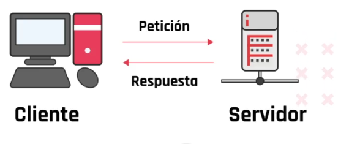

El servidor recibe nuestra **request** este se va a encargar de procesarla y en funcion de su logica preparar una respuesta llamada **response**, response pasara por el mismo proceso que la peticion, la traducira el middleware y finalmente el cliente de interpretarla y mostrarla.

Cuando el flujo de request y response se hace masivo, el servidor debe lo mas protegido posible:

-   Temperatura ideal
-   Seguridad de acceso
-   Energia ininterrumpida

Para eso, existen centros de datos o **Datacenter** que son inmuebles especialmente construidos para albergar sistemas de comunicacion y de informacion, los cuales estan protegidos:

-   Contra incendios
-   Accesos indebidos
-   contra interrupcion de energia

Los datacenters nos permiten pensar en alojar nuestros servicios en varios servidores
haciendola ademas, tolerable a fachas

El **Sistema operativo** motor que va a encargarse e aprovechar los recursos de toda la infraestructura. Usamos los sistemas operativos de red como

-   Windows
-   Linux

> Ver video: arquitectura cliente servidor.mp4

## [Caracteristicas fundamentales de un sistema operativo](https://view.genial.ly/60a81847f631260d39c063ca)

**Soporte de red**:

-   Es indispensable que tengan un soporte completo para poder brindar conectividad.

**Amplia compatibilidad con el hardware**:

-   Se debe priorizar el uso de S.O. actualizados y con un soporte importante de controladores. Por ejemplo, que nuestros controladores permitan acceder a características avanzadas de gestión de discos rígidos, con el propósito de realizar arreglos redundantes para tener mayor velocidad y tolerancia a fallos.

**Seguridad**:

-   El S.O. instalado sea seguro;
-   Que este actualizado con todos los parches/actualizaciones.
-   debe tener aplicadas políticas estrictas de acceso para prevenir accesos no autorizados o ataques.- Instalación de Firewalls (por software o hardware) y antivirus.
-   respaldo de la información, ya sea por medio de herramientas que el propio S.O. nos ofrezca o instalando software externo, con el propósito de tener la menor pérdida de datos posible en caso de fallos fatales.

**Tolerancia a fallos**:
Mediante la generación de granja de servidores que interconectados, operen como una gran unidad de proceso dando la posibilidad que ante la caída de uno de los integrantes de la granja, otro puede tomar su rol y responsabilidad.

**Se eligen otros sistemas operativos para los servidores por**:

-   **Manejo diferente del hardware**: Debido al diferente propósito, los S.O. de estaciones de trabajo no pueden aprovechar todo el hardware disponible, como, por ejemplo, el manejo de memoria RAM —teniendo el caso de Windows 10 64-bit que puede manejar 6TB de RAM, mientras que Windows Server 2019 alcanza los 24TB—.

-   **Características soportadas**: Hay funcionalidades que nativamente un S.O. de estación de trabajo no es capaz de brindar, ya que en su versión de kernel están limitadas o deshabilitadas —casos tales como la virtualización en algunas versiones de Windows 10—.

-   **Soporte**: Algo muy importante a tener en cuenta es, cuando nuestro negocio o aplicación depende de un S.O., es el soporte por parte del fabricante/desarrollador. En el caso de los S.O. de estación de trabajo, el soporte/cobertura que tenemos es para un uso específico, si sobre esa base quisiéramos desplegar una arquitectura, por ejemplo, de servidor web, si bien es probable que nos funcione, vamos a carecer de soporte técnico ya que el fabricante nos indicará que para ese propósito esta la version “Server” del producto.

**2 Opciones predominantes del mercado**

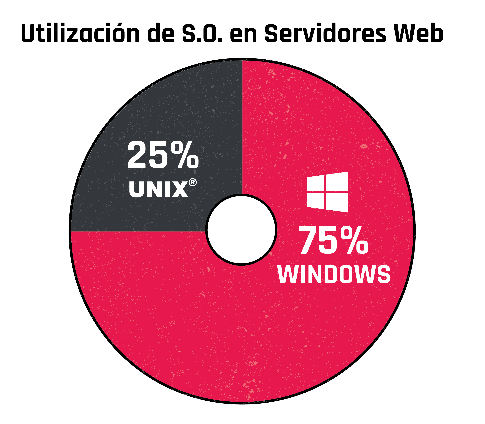

**25%** UNIX
**75%** WINDOWS

### **En el grupo de los UNIX** (o UNIX-like) tenemos a:

-   GNU Linux
-   FreeBSD
-   macOsServer

### **En el grupo de Windows**:

Integrado por toda la familia de Windows Server, tenemos las versiones que van desde la versión 2003 a 2019.

[Windows vs MacOs vs Linux](https://view.genial.ly/60628708c026f60d49a8336c)

## Windows

-   El OS mas usado
-   Lanzado en 1985
-   Al principio funcionó como una interfaz gráfica encima de MS-DOS.
-   Luego las características de MS-DOS se integraron en Windows 95.
-   tiene el 88.14% del mercado
-   Tiene uno de los mejores antivirus **windows defender**
-   Ideal oara gaming

### **Pros**

1. **Integración**: casi todas las aplicaciones del mercado son compatibles con Windows.

2. **Soporte**: existe mucho soporte, tanto oficial como en diferentes foros y webs.

3. **Facilidad de uso**: es muy fácil de usar, sumado a eso, la mayoría de nosotros creció utilizando alguna versión de Windows.

### **Contras**

1. **Seguridad**: al ser el S.O. más utilizado, es el que más malware atrae.

2. **Costo**: es un sistema operativo costoso.

3. **Tamaño**: algunas versiones de Windows ocupan mucho espacio de disco.

## Mac

-   Este sistema operativo es más antiguo que Windows.
-   Lanzado en 1984.
-   Comenzó a utilizar una interfaz gráfica desde su inicio.
-   Todas sus actualizaciones o versiones reciben un nombre en clave para los usuarios, por ejemplo: Mojave para la del 2018, Catalina para la del 2019 y Big Sur para la del 2020.
-   Es el segundo OS mas usado.
-   Esta basado en Unix
-   Solo el personal de Apple puede acceder al codigo fuente
-   Se sincroniza facilmente con dispositivos Apple.

### **Pros**

1. **Estabilidad**: debido a la minuciosa optimización entre su hardware y software el S.O. casi no presenta fallos.

2. **Seguridad**: este S.O. es reconocido por su seguridad y menos vulnerabilidad ante los malware.

3. **Diseño**: tiene un diseño muy estético y fácil de utilizar.

### **Contras**

1. **Costo**: comprar una MAC suele ser muy costosa.

2. **Compatibilidad**: a pesar que fue aumentando con el tiempo, todavía existen muchas aplicaciones no compatibles con Mac OS.

3. **No apto para Gamers**: en estos sistemas no corren la mayoría de los últimos juegos.

## Linux

-   GNU/Linux hace referencia a los sistemas operativos basados en Unix cuyo núcleo (kernel) se conoce como Linux
-   creado por el ingeniero de software finlandés Linus Torvalds.
-   Estos sistemas operativos emplean múltiples componentes y herramientas del proyecto GNU, como un ambiente de escritorio gráfico, editor de imágenes, bibliotecas para lenguajes de programación, compiladores, entre otros.
-   286 es el numero actual de las distribuciones.
-   Linux es software libre.
-   1.4% es el mercado mundial
-   el 97% de las computadoras mas rapidas del mundo utilizan Linux.

### **Pros**

1. **Costo**: Cualquiera puede usarlo, modificarlo y redistribuirlo sin costo.

2. **Seguridad**: Los sistemas operativos basados en Linux poseen pocos virus o estos son inexistentes.

3. **Estabilidad**: Es muy estable, tanto que es muy usado en servidores.

### **Contras**

1. **Complejidad**: a la mayoría se le hace difícil entenderlo y manejarlo, incluso puede volverse problemático instalar un simple programa.

2. **Compatibilidad**: muchos de los programas más utilizados en el mercado no funcionan o necesitan parches y conversiones para funcionar.

3. **Portabilidad**: la portabilidad de las distribuciones de Linux no es prioritaria para muchos desarrolladores de software y de hardware.

## Servicios de los Sistemas Operativos

> Ver ppt. Servicios de sistemas operativos.

Utiles para ejecutar programas, manipular archivos o asignar recursos.

-   **Publicacion web**:
    Software que se encarga de despachar el sitio web al usuario

    Al escribir una direccion de un sitio web, el sistema hace una busqueda DNS para encontrar en cual servidor esta alojado el sitio en cuestion.
    Cuando el server es encontrado, el navegador le pide el contenido del sitio web y el webserver procesa este pedido, y envia dicho contenido al navegador, dando como resultado la visualizacion en la pantalla.

    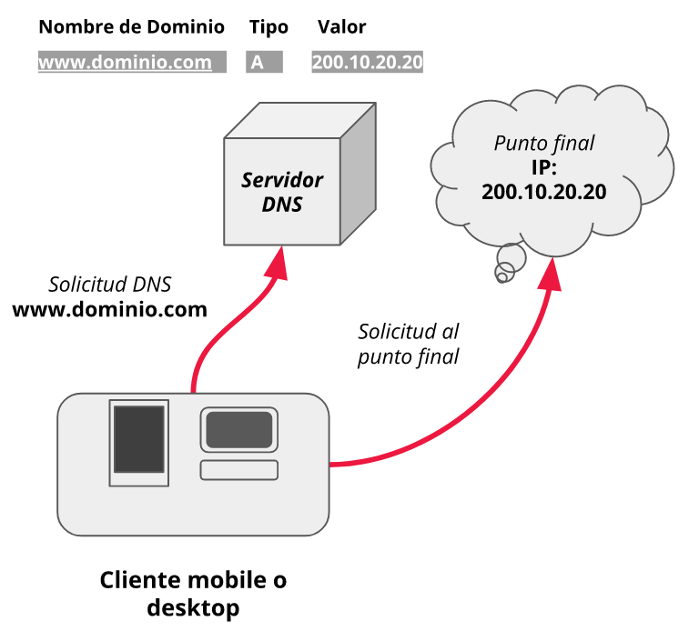

    Los mas usados:

    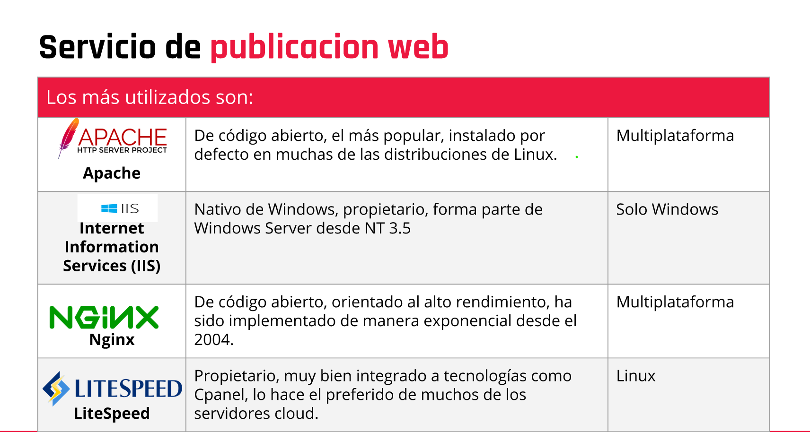

- **Base de datos**: También conocido como database server o RDBMS (Relational DataBase Management Systems).

    En caso de bases de datos relacionales, es un tipo de software de servidor que permiten la organización de la información mediante el uso de tablas, índices y registros.

    En la actualidad se hace cada vez más extendido el uso de bases de datos no relacionales, conocidas popularmente como No-SQL.

    es el servicio que provee de información a otras aplicaciones web o equipos/hosts, tal como se especifica en el modelo cliente servidor.

    mediante un usuario, contraseña y nombre de host, se le permite realizar diferentes tareas, dependiendo del nivel de privilegios que posea, tales como selección, actualización y borrado de datos.

    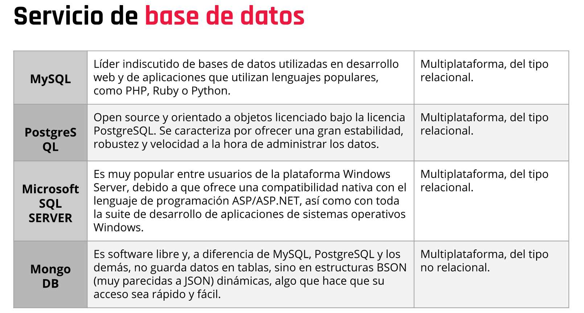

-   **Correo electronico**:
    Un servidor de correo es el encargado de
    enviar y recibir mensajes de correo electrónico
    entre hosts, usuarios o servidores.

    Procesado de los mensajes, filtrado, almacenamiento, envío, recepción y reenvío de correos.

    Es una de las aplicaciones más populares en
    usar el protocolo TCP/IP, y que permite en
    cuestión de segundos comunicarnos con
    cualquier persona en otra parte del mundo.

    El servidor consta de dos componentes fundamentales:

    1. MTA (Mail Transport Agent):
       En palabras simples, un
       agente de transferencia de
       correo es un software
       encargado de transferir el
       email de un host (equipo
       informático) a otro.
    2. MDA (Mail Delivery Agent):
       Tiene las funciones de recibir el correo
       de un MTA y llevarlo al inbox de la casilla
       de correo, que previamente se comunicó
       con el servidor POP o IMAP. Existen
       muchos formatos utilizados por las
       casillas de correo, dependiendo de la
       configuración que haya aplicado el
       administrador de sistemas a cargo.

        

-   **Archivos**:
    Un file server (o servidor de archivos) es un
    servidor central de una red de ordenadores,
    que pone a disposición del cliente conectado
    un conjunto de archivos o parte del mismo.

    De este modo, proporciona a los usuarios
    un lugar de almacenamiento
    centralizado para los archivos en sus propios
    soportes de datos, disponible para todos los
    clientes autorizados.

    El administrador del servidor establece unas directrices estrictas para
    determinar qué usuarios tienen derechos de acceso y a qué datos.
    Cada sistema operativo tiene su propio servicio de compartición de archivos, es
    por ello que la elección muchas veces depende de las plataformas de clientes.
    Los servicios de archivos más utilizados son:

    -   CIFS/Samba (utilizado en Linux)
    -   NTFS Share (nativo de los sistemas Microsoft)
    -   NFS (desarrollado por Sun y originario de los sistemas UNIX)

-   **Red**:
    Es muy extendido el uso de los propios
    servicios del sistema operativo con el
    propósito de satisfacer necesidades de ruteo,
    firewall o proxy.
    Este tipo de implementaciones se aplica más
    tomando como base sistemas Linux,
    implementando sobre ellos una serie de
    paquetes/softwares que dan como resultado
    routers, firewalls o proxies.

    Las soluciones más utilizadas son:

    -   PFSense: Stack basado en BSD, que cumple con múltiples funciones tales
        como Router, VPN, Firewall.
    -   OPNSense: Derivado del primero y de Monowall, muy presente en el
        mercado de los routers corporativos.
    -   DD-WRT: Basado en Linux, extendido su uso en routers hogareños,
        destaca por los pocos requerimientos para funcionar.

-   **Dominio**:
    Un controlador de dominio (DC) es un servidor que
    responde a las solicitudes de autenticación y verifica a los usuarios en las redes informáticas. Los dominios son una forma jerárquica de organizar usuarios y equipos que trabajan juntos en la misma red y, el controlador de dominio mantiene todos esos datos organizados y protegidos.

    La responsabilidad principal del DC es autenticar y validar el acceso de los usuarios a la red.

    Cuando los usuarios inician sesión en su dominio, el DC verifica su nombre de usuario, contraseña y otras credenciales para permitir o denegar el acceso.

    Los más utilizados son:

    -   En el ecosistema Windows, Active Directory, presente desde
        Windows 2000. Utiliza como base los protocolos LDAP, Kerberos
        y DNS.
    -   En el ecosistema Linux, existe NIS y NIS+, originalmente llamado
        YellowPages. También es posible implementar LDAP en Linux y
        convivir con ActiveDirectory.

## Diferencias entre windows y Linux.

> Ver ppt: Diferencias entre windows y Linux.

### **Powershell**

Vimos que la GUI es la manera más extendida de administrar servidores Windows. Hablamos de sus ventajas en lo que a curva de aprendizaje se refiere y sus pocos cambios con el paso del tiempo, lo que hace que una vez familiarizados con estas consolas podemos dominar en varios aspectos cualquiera de las versiones de Windows Server.

Las consolas de administración, al ser componentes específicos a determinadas funciones —administración de dispositivos, discos físicos, usuarios de dominio, etc.— en determinados escenarios, tales como la automatización de procesos, pueden no ser suficientes y es allí cuando nos surge la necesidad de administrar nuestro Windows con comandos, tal como lo haríamos en Linux.

Windows siempre tuvo una interfaz de línea de comandos, pero limitada en funciones y apoyada en un lenguaje casi obsoleto como Batch.

### **EL LENGUAJE**

El lenguaje de la consola incluye declaración de variables, variables especiales predefinidas, operadores matemáticos, incluyendo igualdades y desigualdades numéricas, manejo de vectores, comparación entre estos, operadores de asignación, vectores asociativos —hashtables—, valores booleanos, ciclos y ruptura de los mismos, operadores de expansión para simplificación de ejecuciones complejas —creación de vectores por medio de llamados a procedimientos, creación dinámica de vectores, etc.—; comentarios, operadores de comparación binaria, caracteres de escape, orden de ejecución, ciclos del tipo "foreach", creación de procedimientos y funciones, creación de filtros, estructuras condicionales complejas —if/then/else/elseif/switch—, operador de invocación dinámica del contenido de variables.

### **LOS COMANDOS**

Los comandos de PowerShell llamados cmdlets —por command-applets—. Están estructurados de la siguiente manera: un verbo y un nombre separados por un guión (-): verbo-nombre. Vamos a ver un ejemplo, para ello abrimos nuestra consola de

Powershell y ejecutamos:

```
Get-Command
```
El verbo —evidentemente en inglés— describe la acción a realizar sobre el nombre. En el anterior ejemplo, recuperamos —Get— los comandos —Command—. En este caso, el comando nos devolverá una lista de los comandos disponibles de Powershell. Con PowerShell encontramos numerosos verbos genéricos tales como Get, Set, Add, Remove, entre otros, que se combinan con diferentes nombres como Path, Variable, Item, Object, Computer, etcétera. Los nombres que constituyen los comandos están siempre en singular y esto es válido también para los parámetros. Por lo tanto, es posible, mezclando verbos y nombres, acordarse fácilmente de un buen número de comandos. Hay que tener en cuenta que los comandos, así como sus parámetros asociados, pueden escribirse indistintamente en mayúsculas o en minúsculas. El analizador sintáctico PowerShell no es case sensitive.

### **Bash**

Ya vimos que para poder interactuar con los S.O. teníamos a la interfaz gráfica (GUI) o la interfaz de línea de comandos (CLI), y supimos que la primera es más utilizada en Windows y la segunda, en Linux.

La CLI de Linux, además de ser muy potente, tiene de manera nativa la interpretación de lenguaje llamado BASH, o Bash Shell, el cual tiene como propósito la creación de scripts que facilitan la administración del sistema.

Las funciones Bash pueden:

- Eliminar tareas repetitivas.
- Ahorrar tiempo.
- Proporcionar una secuencia de actividades bien estructurada, modular y formateada.
- Con scripts, podemos proporcionar valores dinámicos a comandos usando argumentos de línea de comando.
- Puede simplificar comandos complejos en una sola unidad en ejecución.
- Una vez creada, se puede ejecutar cualquier cantidad de veces por cualquier persona. Construye una vez y ejecuta muchas veces.
- Los flujos lógicos se pueden construir utilizando funciones Bash.
- Las funciones Bash se pueden ejecutar al inicio del servidor o agregando un cron job programado.
- Los comandos pueden ser depurados.
- Tener comandos de shell interactivos.

Un ejemplo sencillo de una función Bash sería

```
#!/bin/bash
testfunction
testfunction(){
   echo "My first function"
}
```
El cual como resultado de ejecución devolverá en pantalla

```
My first function
```

Las funciones bash pueden aceptar cualquier número de parámetros. El siguiente ejemplo acepta dos parámetros:

```
#!/bin/bash
testfunction(){
   echo $1
   echo $2
}
```

Los scripts bash soportan:

- Bucle while
- Bucle for
- Declaración if
- Elemento lógico and
- Elemento lógico or
- Declaración Else If
- Declaración case

# C11 - ¿Qué es un proceso?

Un proceso es un **programa en ejecución** y **un programa ejecutable** es un conjunto de instrucciones y datos almacenados en un fichero. Así pues, cuando el contenido de ese programa se carga en la memoria y se pone en ejecución, se convierte en un proceso.

Los procesos son gestionados por el sistema operativo y están formados por:

- Las instrucciones de un programa destinadas a ser ejecutadas por el microprocesador.
- Su estado de ejecución en un momento dado, esto es, los valores de los registros de la unidad central de procesamiento para dicho programa.
- Su memoria de trabajo, es decir, la memoria que ha reservado y sus contenidos.
- Otra información que permite al sistema operativo su planificación.

> Ver video: introduccion a procesos.mp4

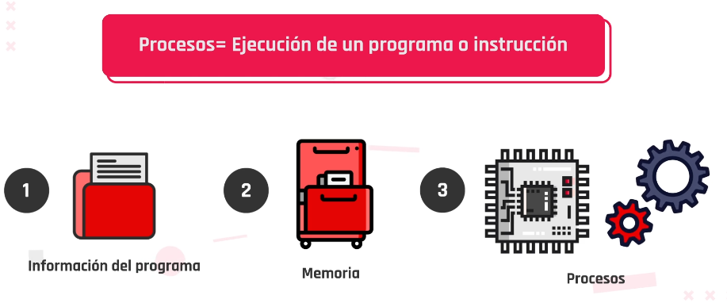

cuando queramos que se realice una instruccion, los procesos asumen el trabajo para que la CPU ejecute la tarea con el plan de accion diseniado.

informacion de programa se carga en memoria, se llama proceso.

Todos los software ejecuctables se organizan en procesos que quieren utilizar la CPU y es el SO que organiza esos procesos.

el cambio de procesos se llaman cambio de contexto.

Los proceoss se ejcutan uno a la vez.
No pueden almacenarse en la memoria principal, ya que consumen espacio.
Los procesos son efimeros, se crean y se terminan

se crean:
1. De manera interactiva con el usuario
    ej: cuando exportamos un proceso
2. Creados en segundo plano, llamados al sistema operativo.
    ej: cuando un software no puede acceder a un recurso, le pide al SO que lo gestione

para que un proceso termine tiene que pasar por un estado que determine su condicion:

1. Nuevo
    Cuando se crea
2. Listo/ preparado
    cuando el SO lo carga en la memoria
3. Ejecucion
    cuando se ejecuta, hay varios caminos:
    cambiar el contexto o que sea suspendido
4. Bloqueado
    cuando es suspendido  y espera que un proceso o recurso pueda ser utilizado
5. Salida
    Cuando el proceso es ejecutado y cumple con su objetivo.

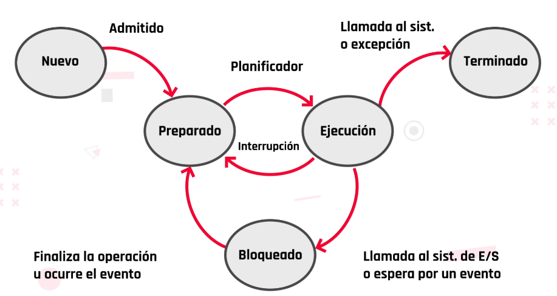
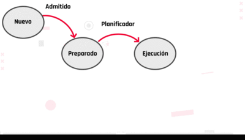

Mecanismos de comunicacion entre procesos o IPC

**IPC seniales:**
    avisos que puede enviar un proceso a otro.
    El OS se encarga que el proceso que reciba la se;al tome una accion para gestionar

**IPC memoria compartida**
    recurso para que puedan intercambiar informacion
    entonces 2 procesos pueden estar realizandose con la memoria compartid y al mismo tiempo pueden intercambiar informacion

**IPC hijos**
    cuando se da un proceso no puede resolverse instantaneamente
    se crean otros procesos que se denominan hijos.
    su funcion es realizar subtareas para ayudar al proceso padre pueda resolver la tarea.
    Los procesos padres, pueden tener varios procesos hijos, pero los procesos hijos solo pueden tener un proceso padre


**Quiz**:

- Un proceso es un programa en ejecución junto con el entorno asociado (registros, variables, entre otros). Verdadero

- ¿A qué llamamos el corazón de un sistema operativo? Kernel

- Las acciones que el sistema operativo realiza para cambiar el proceso A por el B se denominan: Cambio de proceso.

clase sincronica:
- procesos tienen turnos
- dentro de los procesos hay hilos
- un hilo existe cuando un proceso esta trabajando
- los procesos son efimeros
- los procesos no comparten recursos
- los hilos si comparten los procesos

**cambio de contexto** cambiar el modo de ejecucion a un modo espera, del procesador, no del proceso. ej semaforo.

**cambio de proceso**, cuando el proceso entra 

------------------

## Comunicación entre procesos

En muchas ocasiones, los programas o procesos necesitan intercambiar información entre sí. 

Cuando chateamos a través de la red hay dos procesos (dos navegadores) que intercambian información. 
La cooperación entre procesos requiere que estos se comuniquen. A continuación, indicaremos los **mecanismos básicos de comunicación**:

### **IPC Memoria compartida**

Se basa en que los procesos que desean comunicarse **compartan una misma región de memoria física**. Para llevar a cabo la comunicación, uno escribe y otro lee de la región de memoria compartida. Los procesos **utilizan servicios del OS para compartir la región**, es mas economica que un multiprocesador.

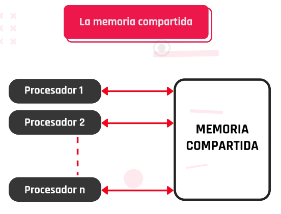

### **IPC Paso de mensajes**

Los procesos utilizan una pareja de servicios del OS para comunicarse. Estos servicios son conocidos habitualmente como send y receive. **Para llevar a cabo la comunicación un proceso ejecuta la función send y el otro receive**, intercambiando de esta forma un bloque de información que recibe el nombre de mensaje.
El intermediario entre ambos procesos es el Kernel.
son compatibles con cualqier arquitectura de pc.


## Comunicacion de mensajes

> Ver video: Comunicacion entre procesos

### **Independientes**

autonomos; no pueden ser afectados ni afectar a otros procesos

### **coperativos**

si pueden afectar y ser afectados, cualquier proceso que comparta es cooperativo.

porque se debe hacer una cooperacion entre procesos?

1. algunos proceoss carecen de informacion, deben consultarla
2. como la info es ompartida el CPU es mas veloz, esto da modularidad, cuando una tarea tiene varios pasos la cpu puede ejecutarlos de manera independiente y simultanea.

Puede haber errores si se ha ejecutado una tarea de forma erronea o no haya planificacion.
ej: cuando mandamos a imprimir.

**Quizz**:

1. Existen dos tipos de procesos que se ejecutan de manera concurrente.
procesos independientes y cooperativos

2. En el modelo de memoria compartida se establece un espacio en memoria que será compartido por los procesos.
verdadero

3. La memoria compartida es generalmente más ___________ que usar un multiprocesador.
economica

4. En el caso del modelo de pasos de mensajes, podemos decir que:
Los procesos no comparten memoria
LA comunicacion se hace mediante operaciones explicitas de envio y recepcion

## Sincronizacion de procesos

> Ver video: Sincronizacion de procesos

Cuando un proceso exige mucho y relentiza los demas, 

los procesos transitan por estados; indican el ciclo de vida donde se encuentran, el SO toma decisiones sobre el
(ver estados: nuevo..)

para la sincronizacion de proceso existen los semaforos:

Espera / Bloqueado / Avance

1. proceso independiente
    trabajan por ellos mismos, sin ayuda

2. cooperativos
    trabajan en funcion d elos recursos y la disponibilidad de otros procesos.

### El area critica

Se genera una cola de procesos y la utliza el primero que la solicita

importante planificacion del uso de la CPU
de lo contrario lleva que la cola de procesos colapse o que tenga inanicion. que es que funcione de forma ineficiente.

## Tecnicas de planificacion
- FIFO - firts in firts out
se asigna tiempo al primer proceso que lo solicite.

> es ineficiente


- SJF Shortest job first
prioridad al proceso con menor tiempo de ejecucion

> cuando entra el proceso tiene que ejecutarse completo, mientras se ejecuta un ciclo, llega otro proceso que se pone en fila, cuando llega un proceso con menos ciclos; uno mas corto, se pone en primera instancia y el mas largo se pone al final. Cuando los procesos son iguales se mantiene el FIFO. Si continuan llegando procesos cortos, los procesos largos no se llegan a ejecutar, seria una innanicion, se le niegan recursos.


- SRTF - Shortest remaining time
si un proceso largo se esta ejecutando y hay uno mas corto, se interrumpe el largo y se inicia el mas chico, luego retoma al largo en el mismo punto.

> se ordena la prioridad por los ciclos mas chicos. se van ejecutando y si entra uno mas chico se reorganiza y asi.


- ROUND ROBIN 
porcion de tiempo establecida(o quantum de tiempo) en donde los procesos que van llegando se ejecutan en el cpu hsata que el tiempo se cumpla una vez cumplido, se interrumpe el proceso y si necesita ams tiempo vuelve a la cola.
tiempo de ejecucion equitativo.

> se especifica un intervalo de tiempo para ejecutarse ej> 4 entonces si es un proceso de 9 se ejecutan 4 y va a la cola. es decir, se ejecutan procesos de 4 en 4 tiempos y se organizan por orden de llegada

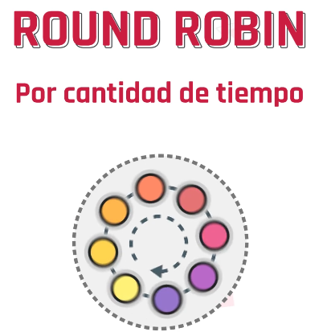

- otras planificaciones:
combinan las explicadas u otros algoritmos:

retroalimentacion multinivel 
planificacion por comportamiento

establecen prioridades entre procesos o cambiando el tiempo de ejecucion.

**Quiz**

La sincronización de procesos permite que mientras un proceso está escribiendo un registro, otro proceso no pueda leer. 
Verdadero.

Es una herramienta de sincronización
Semáforo.

En esta planificación el procesador ejecuta los procesos por orden de llegada y los demás esperan en la cola.
FIFO

Esta política de planificación toma de la cola de los procesos preparados el que necesite menos tiempo de ejecución para realizar su trabajo.
SJF

Algunas características del proceso de planificación SRTF son:
Es muy eficiente
Puede ser injusta ya que un proceso corto puede echar a uno largo que esté haciendo uso del procesador y que además esté terminando.
Presenta mayor sobrecarga. 

---------------------------------

## ¿Qué es un hilo?

> ver video: hilos

Los hilos, también llamados **thread**, representan una secuencia simple de instrucciones ejecutadas en paralelo con otras secuencias, **son una manera de dividir un programa en varias tareas que se ejecutan simultáneamente**. Un proceso puede contener uno o más hilos.

Todos los hilos de un proceso comparten el mismo entorno de ejecución (variables globales, espacio de direcciones, ficheros abiertos, etc.). Para ordenar la forma en la que los hilos acceden a datos comunes hay que emplear mecanismos de sincronización. 

> procesadores, transistores configurados que realizan operaciones binarias que realizan operaciones binarias

mayor cantidad de nucleos, mayor cantidad de procesos se pueden ejecutar en paralelo.

un proceso puede dividirse en secuencias de tareas: hilos
porciones de codigo que pueden ejecutarse de forma simultanea en coperacion con otros subprocesos.

la eficiencia del proceso al dividir las tareas seria mayor.

multiples hilos pueden existir dentro de un proceso ejecutandose de forma concurreente compartiendo recursos y memoria.

se diferencian de los procesos ya que estos no comparten recursos cuando se ejcutan.

Los hilos deben estar sincronizados, ya que un subproceso puede bloquear un recurso y negarle el proceso a otro hilo.

en el 2000 trabajaba un hilo a la vez; monoliticos, 
- tienen capacidad de respuesta menor.
- comportamiento predecible
- pocos errores
- menores problemas con bloqueos de recursos

multihilos los multinucleos consisten en varios hilos de ejecucion, aumentando la velocidad de procesamiento.
- excelente capacidad de respuesta a trabajos en paralelo
- compleja sincronizacion 
- dificil de predecir comportamientos
- pueden escaparse errores en la etapa de prueba

----------------------------

## Algoritmos de planificacion

> Ver ppt: Algoritmos de planificacion

El planificador del procesador tiene 
como misión la asignación del mismo a 
los procesos que están en la cola de 
procesos preparados. 

- **Primero en llegar, primero en salir **

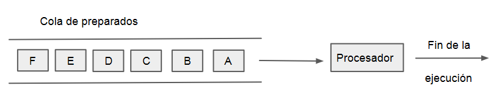

En esta política de planificación llamada FIFO (First In, First Out), el procesador 
ejecuta cada proceso hasta que termina; por tanto, los procesos entren en cola 
de procesos preparados permanecerán encolados en la **orden en que lleguen** 
hasta que les toque su ejecución. También se conoce como “primero en entrar, 
primero en salir”

- **Round-Robin** 


Consiste en conceder a cada proceso de ejecución **un determinado periodo de tiempo** q(quantum), transcurrido el cual, si el proceso no ha terminado, se 
le devuelve al final de la cola de procesos preparados, concediéndose el 
procesador al siguiente proceso por su correspondiente quantum.
Como vayan llegando se les asigna un q terminado

- **El siguiente proceso, el más corto (SJF)**

Esta política **toma de la cola** de procesos preparados **el que necesite menos tiempo de ejecución para realizar su trabajo**. Para ello, debe saber el tiempo de ejecución que necesita cada proceso, lo cual no es tarea fácil, pero es posible a través de diversos métodos como puede ser la información suministrada por el propio usuario o por el propio programa, basándose en la historia anterior. 
Comienza con el que llego en 0, ejecuta el tiempo wue lleve, luego segun la llegada si llego mientras ejecutaba el proceso que llego en 0 y el tiempo de ejecucion elige al que menor tiempo de ejecucion lleva.

- **Próximo proceso, el de tiempo restante más corto (SRTF)**
Esta técnica cambia el proceso que está en ejecución cuando se ejecuta un 
proceso con una **exigencia de tiempo de ejecución total menor que el que se está ejecutando** en el procesador. 

- **Colas múltiples**
Cuando los procesos que van a ser ejecutados en una computadora se 
pueden agrupar en distintos grupos, podemos asignarlos a diferentes 
colas, cada una con distinta planificación, para darle a cada una de ella 
la que realmente necesite. 
Esta política divide la cola en procesos preparados en varias colas 
separadas, de manera que los procesos se asignan a una determinada 
cola según sus necesidades y tipo.

**Quizz**

¿Qué es la planificación? 
Políticas y mecanismos que poseen los sistemas operativos para realizar la gestión del procesador.

En esta política de planificación el procesador ejecuta cada proceso hasta que termina con el mismo. 
FIFO 

En esta política se asocia a cada proceso una ___________, de manera que el procesador se asigna al proceso de mayor relevancia.  
Prioridad 

En esta técnica cambia el proceso que está en ejecución cuando se ejecuta un proceso con exigencia de tiempo de ejecución menor al que se está ejecutando.   
SRTF

> Ver actividad: Maquina virtual

Los seres humanos tenemos diferentes personalidad. Podemos hacer una analogía con las computadoras y decir que estas “personalidades” están definidas en base al sistema operativo con el cual operan. Mediante la herramienta virtualbox vamos a conocer un tipo de “personalidad” diferente a la que estamos acostumbrados, este sistema operativo puntualmente del que hablamos es Linux. En esta clase vamos a trabajar con él y compararlo con nuestro sistema operativo actual.


# C14 - Lenguaje de programación

El lenguaje es un sistema compuesto por signos que las personas utilizamos para poder comunicarnos. Entonces, no sería tan disparatado pensar en utilizar un sistema para poder comunicarnos con la computadora.

Los lenguajes de programación son los medios a través de los cuales damos instrucciones a la computadora para indicarle lo que nuestro programa debe hacer. Estas instrucciones se componen de una serie de pasos (algoritmos) que deben ser claros y precisos, es decir, no pueden contener ambigüedades.

Por ello, no podemos darle instrucciones en nuestro lenguaje natural, sino que debemos realizarlo mediante un lenguaje formal.

En relación a lo anterior, podemos clasificar los lenguajes de programación de acuerdo a diversos criterios. 

> Ver video: Lenguaje de programacion

- hay que ser especificos al programar
- Se da a traves de pasos que se llaman algoritmos
- los lenguajes formales para dar instrucciones los llamamos lenguajes de programacion
- cambian con el tiempo

Existen muchos lenguajes de programacion, divididos en:

1. especificos 

Resuelven problemas puntuales
ej: para realizar graficos matematicos

2. generales 

Aplicaciones distintas, independiente del contexto

hay lenguajes de programacion de

1. alto nivel

mas cercanos al lenguaje natural, que al lenguaje maquina de `0 y 1`
ej: Javascript

2. bajo nivel

Son utilizados para dar instrucciones especificas y utilizar al maximo los recursos disponibles
hay qeu estar atentos al hardware

**Quizz**

¿Qué son los lenguajes de programación? 
Son lenguajes formales que utilizamos para darle instrucciones a nuestra computadora. 

¿Cuál es el lenguaje más cercano al lenguaje natural? 
Lenguaje de alto nivel. 

Para aprender a programar es necesario aprender todos los lenguajes posibles. 
Falso.

JavaScript es un lenguaje de programación de bajo nivel. 
Falso

## Paradigmas de programación

Un paradigma es una forma de pensar bajo un modelo preestablecido. Pero… ¿qué es un paradigma de programación?

**Es una manera o estilo de programación de software**. Existen diferentes formas de diseñar un lenguaje de programación y varios modos de trabajar para obtener los resultados que necesitan los programadores. 
Se trata de un conjunto de métodos sistemáticos aplicables en todos los niveles del diseño de programas para resolver problemas computacionales.

Los lenguajes de programación adoptan uno o varios paradigmas en función del tipo de órdenes que permiten implementar. Estos paradigmas varían dependiendo de nuestros intereses y necesidades.

> Ver video: Paradigmas de programacion

decada 60:
- formas de programacion estrcuturada, codigo linea tras linea
- pensar otro modelo de programacion
- otras reglas para programar, representando los objetos de la nave, con estado interno y funcion, ahi nacio el lenguaje de programacion: **simula** y el paradigma de programacion orientado a objetos.

> a la forma de pensar bajo un modelo, se le llama paradigma

[Paradigmas de programación](https://view.genial.ly/606da0a1c1da530d9635eb62)

## Paradigma estructurado
- sigue una linea de pensamiento
- se suele ejecutar una instruccion a la vez
- acotado set de instrucciones
- utilizado en el desarrollo de sistemas

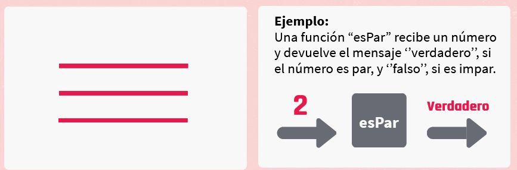

## Paradigma de programacion orientado a objetos

- el codigo puede agruparse
- se agrupa de tal forma de representar la entidad
- interpreta mensajes
- utiliza abstracciones 
- crea entidades

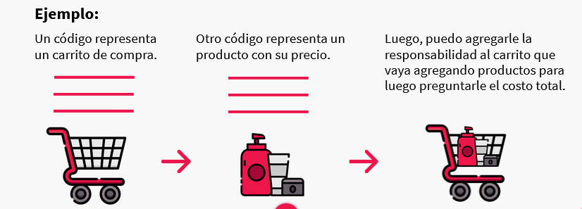

## Paradigma funcional

- se basa en funciones matematicas
- Tiene la propiedad de **inmutabiliadad**, devuelve el mismo valor:
    La fortaleza del paradigma radica en que siempre que a la funcion x se le pasa el valor A, esta siempre va a devolver el valor B.


## Paradigma logico

- utiliza reglas logicas para consultar al sistema
- infiere de las reglas logicas que hacer

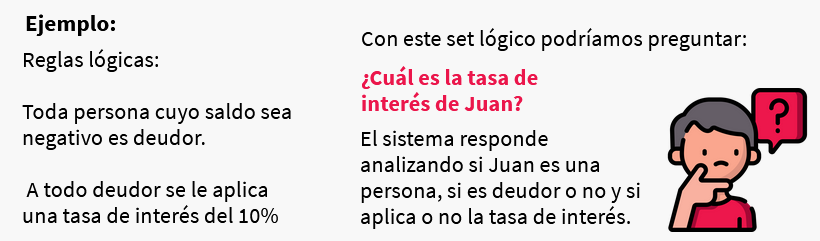

## Paradigma de programacion con lenguaje especifico de dominio

- resuelven problemas superespecificos


## Multiparadigma

- lenguajes modificados para dar soluciones en distintos paradigmas 

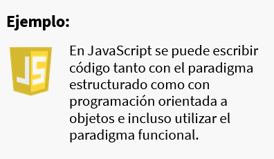

## Del código al ejecutable

Cuando escribimos un código, podemos hacerlo en un lenguaje similar al nuestro, pero… ¿cómo hace la computadora para entender este código?

A continuación, veremos cómo trabaja el compilador, esta increíble herramienta que convertirá nuestro código en instrucciones que la computadora pueda entender y ejecutar: el código máquina.

> Ver video: Del codigo al ejecutable.mp4

**Como interpreta la maquina**

Un programa puede estar escrito en distintos archivos y distintos lenguajes.

las instrucciones pasan del codigo que escribimos al codigo que la maquina entienda, esta traduccion se llama `compilacion`

**`Compilacion`**

Toma todo el codigo fuente y lo transforma en el programa ejecutable escrito o codigo maquina, listo para ser ejecutado en los dispositivos

El resultado de la compilacion es `el ejecutable` se ejecutara correctamente siempre y cuando la maquina donde se compile sea similar a donde se ejecute

Esto quiere decir:
- Similar arquitectura de CPU
- Sistema operativo similar


Un codigo puede ser independiente a la arquitectura con:

1. maquinas virtuales VM
Cuando escribimos codigo en la VM, en codigo fuente va a ser compilado a codigo maquina, al codigo que entienda la VM, hay versiones de VM para distintos sistemas, entonces no requerimos volver a compilarlo, la VM va a realizar la traduccion por nosotros al sistema al que se ejecute

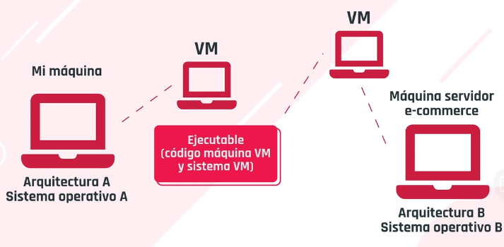

LAs empresas mantienen las VM

2. interprete

Analiza linea por linea en cada sistema donde se ejecuta el codigo fuente, traduce en el momento a un codigo maquina que la misma entiende.
Esto permite que el codigo programa pueda ser independiente de la arquitectura, ya que el codigo fuente, no es compilado previamente a codigo maquina para crear el ejecutable

Esta eleccion viene del lado del tipo de lenguaje de programacion que usemos y como fue diseniado. no podemos decidir si se compila o se ejecuta o con una VM.

Tenemos lenguajes de programacion:
- Compilados:
    Se ejecuta velozmente

- Ejecutados en una VM:
    Por la portabilidad de ejecuta primero en la VM, que hace de intermediaria con la fisica.
    Permiten escribir codigos que van a funcionar independiente de en donde corran

- Interpretados
    La traduccion se hace linea por linea cada vez que se ejecuta, eso relentiza la ejecucion del codigo
    Permiten escribir codigos que van a funcionar independiente de en donde corran

La diferencia radica en la performace y el rendimiento

> Ver ppt. Frameworks, IDEs...

## frameworks

Un framework es un patrón o esquema que ayuda a la programación a estructurar el código, ahorrando tiempo y esfuerzos a los programadores.

Es un conjunto de herramientas que nos facilitan el desarrollo de software. 

Para poder lograrlo incluyen implementos como los siguientes:
- APIs
- Librerías
- Herramientas de depuración
- Edición
- Prototipado
- Programas de soporte

> Flask | ExpressJS | laravel | Vue.js | spring MVC | django | ANGULAR | Ruby on Rails

No están ligados necesariamente a un lenguaje concreto, aunque así sea en muchas ocasiones.

**Por ejemplo**: 
En *Ruby on Rails*, “Ruby” es el lenguaje de programación y “Rails”, el framework.

Sin embargo, no existen impedimentos para definir el mismo framework para lenguajes diferentes.
También es posible que el framework defina una estructura para una aplicación completa, o bien solo se centre en un aspecto de ella.

## Librerias 

Una librería no es más que un conjunto de código que alguien ha realizado para que podamos reutilizar dentro de nuestros proyectos.

El objetivo de una librería no es otro que hacer más fácil y rápido el desarrollo de ciertas funciones dentro de nuestroprograma o aplicación.Normalmente las librerías **están enfocadas a solucionar problemas concretos**. Es decir, no nos brindan una estructura para nuestro proyecto, pero sí **van a ayudar a resolver funcionalidades específicas**.

> SQLite | jUnit5 | axios | React.JS | GRUNT | Redux

**Librerías vs. Frameworks**

Una `librería` es un código escrito previamente, ya utilizado por otros desarrolladores, listo para que lo utilicemos y pretende hacernos la vidamás fácil y su trabajo másrápido

Un `framework` es un esqueleto. Podría decirse que es como el marco de una casa. La estructura está predeterminada, y el trabajo del desarrolladores llenar los vacíos con su código

## Editores de texto

Los editores de texto se crearon para mostrar el código de una forma agradable y realizaban algunas acciones muy simples. Sin embargo, los editores de texto modernos, siguen agregando capacidades que solo los IDEs tenían.

Los editores de texto son herramientas mucho más simples y compactas. Proporcionan un entorno de desarrollo simple. 

Los editores de texto tienen la peculiaridad de trabajar con archivos de texto y carpetas, es decir, al abrir una carpeta podemos trabajar con todo lo que hay dentro. 

> Existen editores sofisticados como Atom, Sublime Text y Brackets, los cuales muestran el código de una forma pintoresca y atractiva.

## IDE

Los IDEs, a diferencia de los editores de texto, no trabajan con archivos y carpetas. En su lugar, emplean el concepto de proyectos.

Un **IDE o Integrated Development Environment**(entornos de desarrollo integrado) posee muchas más herramientas que se integran en un mismo programa.
Los IDEs tienen como principal característica que **no trabajan con archivos y carpetas**. 
En su lugar, emplean el concepto de proyectos.
Un proyecto es una carpeta en el disco duro, pero tiene la diferencia que **el IDE crea archivos adicionales al código para optimizar la experiencia del usuario**.

En estos archivos puede tener configuraciones de ejecución, deploy, tipo de proyecto, etc. Debido a que los IDEs son plataformas muy complejas, es posible hacer un sinfín de cosas, y los plugins que ofrecen son prácticamente ilimitados.

Las características que más resaltan de un IDE son:
- Debugger en tiempo real.
- Visualiza gráficamente casi cualquier cosa, desde XML,JSON, UML, bases de datos, interfaces gráficas, etc.
- Ayuda en tiempo real.

**Quizz**

El objetivo de una librería no es otro que hacer más fácil y rápido el desarrollo. ¿Cuáles de las siguientes son librerías conocidas?
Redux.
Axios.
Grunt.
JUnit 5.

Son herramientas mucho más simples y compactas que proporcionan un entorno de desarrollo simple. 
Editores de textos

Tienen como principal característica emplear el concepto de proyectos.
IDEs

Los frameworks no están ligados necesariamente a un lenguaje concreto.
Verdadero.


## Escritorios remotos

> Ver video: Escritorios remotos

- programas que nos permiten acceder e interactuar con una pc  distancia a travess de una conexion a internet desde donde lo necesitemos
- no requieren conexion de red fisica ni un hardware adicional para vincular las computadoras

Los requerimientos son:

- Acceso a internet
- Ambas computadoras con la misma aplicacion de escritorio remoto
- computadoras encendidas en simultaneo

La computadora a la quese accede de forma remota recibe el nombre de *host*
La computadora desde la que se va a trabajar fisicamente se va a llamar *cliente*

Es posible que varios clientes puedan acceder a un mismo *host* mientras cuente con la capacidad suficiente para soportar las conexiones simultaneas

Ventajas:
- ahorro de recursos
- existen apps pagas y gratuitas

> TeamViewer | AnyDesk | Assist | Chrome Remote Desktop | Windows Remote Desktop

Desventajas
- si el programa no posee es posible objeto de ciberataques
- rendimiento depende de la calidad de conexion a internet

## Máquinas virtuales

Los servidores generalmente solo utilizaban un 30% del total de su capacidad, por lo que el otro 70% estaba constantemente desperdiciado. 
Para solucionar estos problemas de mal aprovechamiento de recursos, se creó la virtualización, lo que nos permite en un mismo equipo poder estar corriendo diversos sistemas operativos que simulan ser computadoras reales. A continuación veremos más sobre este tema.

Una imagen en informática es un concepto que puede dividirse de dos formas.

- La primera es la forma digital de una foto. Es decir, se captura un momento a través una cámara digital, en donde lo que está viendo el fotógrafo queda inmortalizado en un conjunto de bits en un archivo, por ejemplo, con un formato .jpg.

- La segunda manera, en vez de capturar una situación, “fotografía” configuraciones y datos de un sistema de archivos, como un programa o sistema.

El formato más conocido o utilizado del segundo tipo de imágenes es el `.iso`, el cual generalmente se utiliza para hacer copias de sistemas de archivos completos.

De esta manera, la imagen de un programa o sistema operativo puede ser trasladada e instalada en cualquier computadora.

- capaz de contener en su interior un sistema operativo, haciendole creer que e suna computadora de verdad

> Ver video: Maquinas virtuales

hay 2 tipos de MV

## De sistemas

emula una pc completa
el lugar donde la maquina es creada se llama `hypervisor` es una capa de software que es instalada sobre la parte fisica y su funcion es asignar parte de la
    - Memoria
    - CPU
    - Disco rigido
    - Otros recursos fisicos

**hypervisor**: 

Sobre el hypervisor podemos crear las maquinas virtuales que querramos y funcionan como una pc real

2 tipos de hypervisor

1. Tipo 1
mas rapido
mas seguro
corre en la parte fisica de la pc
sobre el se crea una o mas amquinas virtuales

2. Tipo 2.
Corre sobre un sistema operativo
es mas lento

- MV De procesos

Emula solo un proceso completo
se comporta de la misma manera
util para desarrollar aplicaciones

ventajas:
probar otros sistemas operativos
ejecutar programas antiguos
ejecutar aplicaciones disponibles para otros sistemas
ofrecen entorno de seguridad
mejora el aprovechamiento del hardware
virtualizacion al almacenamiento y las redes

desventajas:
Son menos eficientes, ya que acceden al ahrdware de forma indirecta
cuando hay varias maquinas se puede afectar el rendimiento

[ver componentes de virtualizacion](https://view.genial.ly/60a95ee45e2a3d0d271c0bbd)

[ver beneficios de la virtualizacion](https://view.genial.ly/60a98f355e2a3d0d271c121c)

# C16 - Redes

Dispositivos conectados entre si, que envian y reciben datos para compartir informacion y recursos

La finalidad de su creacion fue:

- Acortar las distancias
- Asegurar la confiabilidad y disponibilidad de la informacion
- Aumentar la velocidad y la transmision de los datos
- Reducir los costos

> ver video: Redes y clasificacion en clase 16


[Clasificacion de Redes](https://view.genial.ly/6071ae84bb4aff0d42db659c)


1. ## Redes por alcance

- PAN:

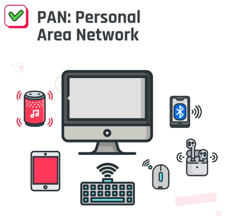

- LAN

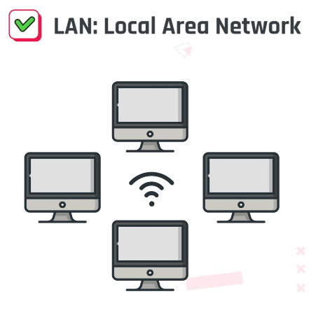

- MAN


- WAN

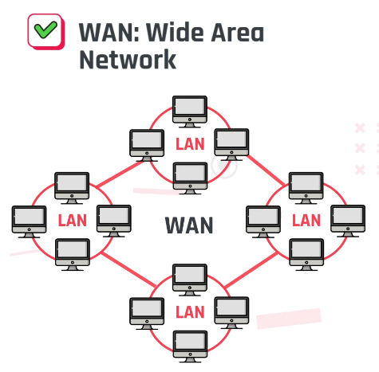

2. ## Redes por grado de autenticacion

- Red privada
- Red publica

3. ## Redes por tipo de conexion

- Par trenzado


- Cable coaxial

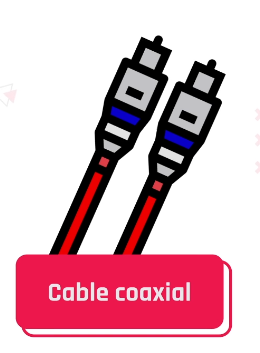

- Fibra optica


- Redes inalambricas


- infrarrojo
- Bluetooth
- wifi

**Quizz**

¿Qué es una red?
Conjunto de dispositivos independientes que se comunican y comparten recursos.

Cuando hablamos de una Red MAN nos referimos a:
Una red con un alcance de hasta 60 km.
Red de área metropolitana.

¿Cuáles son redes que enlazan los dispositivos mediante sistemas físicos o medios guiados?
Coaxial.
Fibra óptica.

La extranet es una red que puede ser usada por todas las personas.
Falso.

------------------

## Medios de transmision

El medio de transmisión constituye el soporte físico a través del cual el emisor y receptor pueden comunicarse en un sistema de transmisión de datos.

[medios guiados y no guiados](https://view.genial.ly/60744a7d653d280d8693dea3)

## **Medios de transmision guiados**

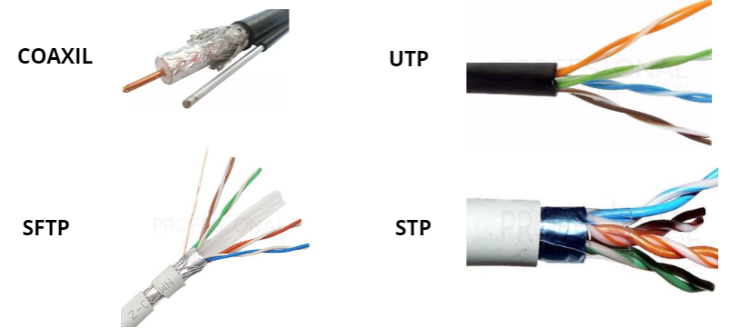
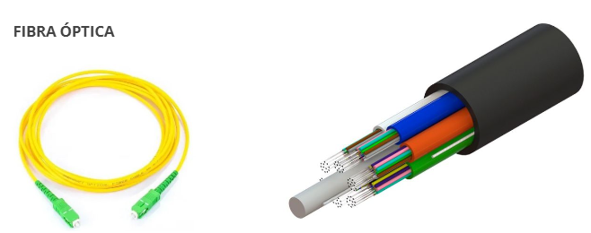

|Nombre|Descripcion|
|------|-----------|
|**Cable coaxial**|10 Mbps, 750 MHz por defecto. Desde 500 hasta 800 m sin perdida.|
|**UTP 5 y 5e**|Entre 100 Mbps y 1 Gbps, 100 MHz para cables UTP/FTP. Hasta 100 m sin pérdida.|
|**UTP 6 y 6e**|Hasta 10 Gbps, entre 250 y 500  MHz para cables  FTP/SFTP. Hasta 100 m sin pérdida.|
|**UTP 7 y 7a**| 10 Gbps, 600 y 1000 MHz para cables SFTP. Hasta 100 m sin perdida.|
|**UTP 8**| 40 Gbps, 1200 MHz para cables SFTP. Hasta 30 m sin perdida.|
|**Fibra óptica**|Desde 10 hasta 200 Gbps, hasta 4700 MHz. 80 Km sin pérdida.|

**Pares trenzados**

Conjunto de pares de hilos de cobre conductores, cruzados entre sí. La forma trenzada del cable se utiliza para reducir la interferencia eléctrica con respecto a los pares cercanos que se encuentran a su alrededor. La velocidad máxima de transmisión es de 1 Gbps y la distancia entre repetidores es de 2 a 10 km.

Se utiliza con frecuencia para las comunicaciones telefónicas o las redes Ethernet. Dos cables conductores de un mismo circuito se retuercen entre sí. Los cables están conformados por pares de cables trenzados, de esa forma obtienen protección de interferencias externas. Existen varios tipos, como UTP, STP, SFTP, entre otros. Dependiendo la categoría alcanzan diferentes distancias que pueden alcanzar los 100 m.

**Cable coaxil**

Tiene un alambre de cobre duro en su parte central. La velocidad máxima de transmisión es de 2 Gbps y la distancia entre repetidores es de 10 a 100 km.

Está diseñado para transmitir señales de alta frecuencia.Compuesto por un cable de cobre, tres protecciones aislantes y blindaje que previenen de la interferencia de señales electromagnéticas externas. Con su blindaje el cable coaxial puede soportar grandes longitudes de distancias. 

**Fibra óptica**

Es un enlace hecho con un hilo muy fino de material transparente y recubierto de un material opaco que evita que la luz se disipe. Por el núcleo, es una hebra fina hecha de vidrio o plásticos, se envían pulsos de luz, no eléctricos. La velocidad máxima de transmisión es mayor a 10 Gbps y la distancia entre repetidores es mayor a 100 km.

Es un tipo de cable que está compuesto por varias hebras de vidrio, los cuales transmiten datos en forma de haz de luz. Existen dos tipos: monomodo y multimodo. La diferencia radica en que el último posee un núcleo más grande que le permite transmitir datos en sentidos opuestos al mismo tiempo.

## **Medios de transmision no guiados**

Los medios no guiados transmiten toda su información utilizando el aire como medio de transmisión. Grandes ejemplos en la actualidad de estos medios son el wifi, bluetooth o la comunicación satelital.

|Nombre|Descripcion|
|------|-----------|
|**Wifi / bluetooth**|Se transmiten los datos en forma de onda a través del aire. Pueden estar direccionadas o ser omnidireccionales. Las primeras tienen más distancia de cobertura, pero en una sola dirección. En cambio, las segundas pueden ir en todas las direcciones, pero tienen menor distancia de propagación. **Señales de bluetooth** Hacen posible la transmisión de los datos mediante un enlace por radiofrecuencia. **Señales de wifi** Permiten la interconexión inalámbrica de dispositivos electrónicos.|
|**Microondas**|Transmiten en forma muy direccional, pero con grandes volúmenes de transmisión, llegando a los 10 Mbps.|
|**Infrarrojo**|Poseen las mismas técnicas que las empleadas por la fibra óptica, pero son por el aire. Son una excelente opción para las distancias cortas, hasta los 2 Km. Son ondas direccionales incapaces de atravesar objetos sólidos.|

[**Lo que se viene**](./img/new.png)

A futuro existen diferentes proyectos que mejorarían notablemente las comunicaciones, aunque algunos son teóricos aún, se esperan grandes resultados de estas tecnologías.

|Nombre|Descripcion|
|---|---|
|Li-fi|Se trata de un nuevo tipo de conexión inalámbrica que utiliza fuentes de luz en lugar de microondas para transmitir datos, de ahí su nombre: Light Fidelity (fidelidad de la luz).|
|6G|Es una tecnología que revolucionará toda la red. Sería 50 veces más rápida que el 5G y alcanzará una velocidad de descarga de hasta 1 TB por segundo.|


**Quizz**

¿Qué tipos de medios de transmisión de datos vimos?
Medios guiados.
Medios no guiados.

Este medio de transmisión guiado lleva en el centro un alambre de cobre duro y se encuentra recubierto por un material aislante.
Cable coaxial.

En el medio de transmisión por fibra óptica, la velocidad de transmisión es de hasta:
10 gbps.

¿Las señales por wifi y Bluetooth forman parte de los medios no guiados? 
Verdadero.

Las señales por bluetooth tienen el mismo alcance que una señal wifi solo que cambia el protocolo.
Falso.


----------------

## Velocidades de internet

Internet es una red global donde es posible acceder a casi cualquier tipo de información, mediante la comunicación con cualquier persona o dispositivo en el mundo. Posee las mismas características que las otras redes de comunicaciones de datos. 

**Caracteristicas de una red de datos**

|Nombre|Descripcion|
|---|---|
|Velocidad|Es el tiempo en el que se transmiten los datos, la rapidez de subida y bajada depende del medio y estándares que utilicemos para comunicarnos, se mide generalmente en megabits por segundo.|
|Seguridad|Su objetivo está en evitar que intrusos accedan a la información transmitida.|
|Confiabilidad|Mide la relación de fallos en la transmisión: menos fallos, más confiable.|
|Escalabilidad|Evita que el servicio no decaiga si el número de usuarios aumenta.|
|Disponibilidad|Es la capacidad de la red para estar siempre funcionando.|

**Bajada de datos**

Es la capacidad que tiene Internet para navegar entre la red, es decir, la velocidad con la cual podemos descargar elementos —por ejemplo, páginas web—.

**Subida de datos**

Es la capacidad de cargar datos en la Web, por ejemplo, podríamos verlo en el tiempo que demora en subir un video a YouTube.

**Paquetes**

Son los bloques en lo que se divide la información al viajar por la red. El pinges el tiempo exacto que demora un paquete de datos en ser enviado de un dispositivo a otro, se mide en milisegundos. 

## [Test de velocidad](https://www.speedtest.net/es)

Un test de velocidad, o speedtest, es una herramienta utilizada para evaluar la perfomance de nuestra de red datos o de Internet. En ella podemos ver nuestra velocidad de subida, bajada y ping.Desde aquí podemos ingresar a un test sencillo, que evaluará estos aspectos. Luego de ingresar, hacemos clic en “Inicio”, se realiza el test y, a continuación, nos mostrará una pantalla como la siguiente. 

**Quizz**

Internet es la mayor red de datos del mundo
Verdadero.

¿En qué unidad se mide el ping?. 
milisegundos (ms).

¿Qué es un bloque de datos?: 
Las partes en las que se divide un paquete.
Las partes en las que se divide la información.

¿Cuáles de las siguientes palabras no es una característica de una red?
Trazabilidad

La velocidad de bajada es más importante que la de subida.
Falso.

-------------------

## Componentes red

|Nombre|Descripcion|
|---|---|
|Hub|El Hub es un dispositivo simple con una única misión, la de interconectar losordenadores de una red local. Su funcionamiento es sencillo, cuando undispositivo de la red local que están conectados a él le envía datos, el Hub losreplica y transmite instantáneamente al resto de ordenadores de esta red local.|
|Switch|Los Switch son los hermanos listos de los Hub, y también se utiliza para la creación de redes locales. La principal diferencia es que a través del Switch la información enviada por el ordenador de origen va directamente al ordenador de destino sin replicarse en el resto de equipos que estén conectados.|
|Modem|Un módem es un dispositivo que se encuentra entre el router y la línea denuestra operadora. Cuando establecemos la conexión con el operador, a nivelde red, el módem obtiene tiene una dirección IP pública que, lógicamente, es única. Solamente puede haber una dirección IP pública en Internet, y queidentificará nuestra conexión.|
|Router|El router es el aparato que todos tenemos en nuestro hogar para conectarnos a la red. Básicamente su función es conectarse al módem y también a los diferentes equipos que tengamos. De esta forma puede recibir la información y expandirla a otros dispositivos ya sea por cable o mediante Wi-Fi.Un router asigna una dirección IP local a cada dispositivo, a diferencia del módem que tiene una IP pública única. En este caso, el router lleva Internet a nuestros dispositivos y es capaz de crear una red LAN.|

> Ver video: Red en casa

> Ver mas en ppt: Componentes de red, plc, repetidor wifi.

[Problemas de red: Pasos](https://view.genial.ly/60a86042be5e480d57b1c459)

-----------

# C17 - Modelo OSI

Es un modelo conceptual de interconexión que permite que diversos sistemas se comuniquen mediante un estándar. Se puede entender como un lenguaje universal de comunicación entre redes, computadoras, servidores, etc., que se basa en la idea de dividir un sistema de comunicación en siete capas y cada una de ellas trabaja sobre la precedente.

podemos decir que cada capa contiene unidades de datos que se van convirtiendo en las de la capa superior. A continuación, podemos ver el diagrama que relaciona la capa del modelo con los datos de la misma.

[Datos_segun_capas_modelo_OSI](https://view.genial.ly/60b299dcfafa9d0d8314a932)

1. La capa física
Capa de dispositivos físicos que participan en la transferencia de datos y se convierten en una secuencia de bits, que es una serie de unos y ceros. Electricidad a bits

2. La capa de enlace de datos
Es muy similar a la capa de red, pero lo que hace es facilitar la transferencia de datos entre dos dispositivos ubicados en una misma red. Toma los paquetes de la capa de red y los rompe en trozos más pequeños denominados tramas.
Al igual que la capa de red, esta capa es la responsable del control de flujo y de errores respecto de esa comunicación dentro de la red. Contiene la subcapa “MAC address” que ayuda a controlar el flujo de paquetes de datos hacia y desde una tarjeta de interfaz de red a otra a través de un canal compartido en una red

3. La capa de red
Es la responsable de posibilitar las transferencias de datos entre dos redes diferentes —concepto de ruteo—. Su objetivo es fragmentar, en el dispositivo emisor, los datos de la capa de transporte en unidades más pequeñas llamadas paquetes y rearmarse después en el dispositivo receptor. La capa de red también busca el mejor camino físico para que los datos lleguen a su destino, esto se conoce como enrutar. Algunos la denominan capa de Internet

4. La capa de transporte
Esta capa es responsable de coordinar la transferencia de datos a través de las conexiones de red. Ayuda a regular varios elementos involucrados en la transmisión de datos entre sistemas finales y hosts. Dichos factores incluyen el tamaño, la secuencia, la velocidad y el destino del paquete de datos.
Una vez que la capa de transporte ha administrado y verificado de manera efectiva los paquetes de datos, estos pasan hacia o desde la capa de red. Algunos de los ejemplos más conocidos de la capa de transporte incluyen el protocolo de control de transmisión (TCP) y el protocolo de datagramas de usuario (UDP).

5. Capa de sesion
Es la responsable de la apertura y cierre de comunicaciones entre dos dispositivos y su función es crear una sesión o conexión que permite que dos dispositivos se comuniquen entre sí. Una vez que se ha formado la sesión, los datos se pasan a la capa de transporte.
Además de configurar una sesión, la conexión resultante entre las máquinas también se administra y finaliza una vez que la sesión termina en esta capa. La capa de sesión también es responsable de la autenticación y reconexión en caso de que ocurra una interrupción de la red.

6. Capa de presentacion
La función principal de esta capa es definir el formato y el cifrado de los datos, gestionar la seguridad y confidencialidad de la red, compresión y empaquetado de texto. Codifica los mensajes desde el formato dependiente del usuario al formato común y viceversa, para la comunicación entre sistemas diferentes.

7. Capa de aplicacion
Es la capa que interactúa con los datos del usuario. Las aplicaciones de software, como navegadores web y clientes de correo electrónico, dependen de la capa de aplicación para iniciar comunicaciones

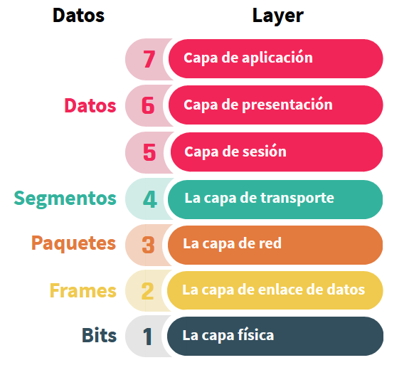

**Flujo de datos**

Cuando los datos se envían de un dispositivo a otro, deben viajar hacia abajo a través de cada capa en el dispositivo de envío y luego hacia arriba a través de las capas en el extremo receptor. El diagrama del Modelo OSI ilustra esto mismo:


- Al comienzo del proceso, los datos se entregan a la capa de aplicación, esta realiza cualquier función que necesite en los datos, 
- luego entrega los datos a la capa de presentación, que los pasa a la siguiente capa y así sucesivamente hasta la capa física.
- Al llegar a la capa física, los datos se transmiten por el medio al dispositivo receptor.
- En el extremo receptor, los datos son recogidos del medio por la capa física, que luego los entrega a la capa superior. 
- Los datos viajan hacia arriba a través de todas las capas hasta llegar a la capa de aplicación. 
- Luego, la capa de aplicación entrega los datos a la aplicación adecuada.

Ahora, a medida que los datos pasan de una capa a otra, los datos se manipulan de diferentes formas. 

**Por ejemplo**, 
- la capa de transporte segmenta los datos y agrega un encabezado al frente de cada segmento. 
- La capa de transporte siempre hace esto con los datos que recibe de las capas superiores; de hecho, está aplicando un protocolo a los datos, un conjunto de reglas que pertenecen a la capa. 
- Las tres capas inferiores del modelo OSI, transporte, red y enlace de datos agrupan los datos de alguna manera y agregan encabezados y, a veces, avances a los datos. 
- Un encabezado contiene información que se adjunta al frente de los datos, mientras que un tráiler es información adjunta al final.
- La capa de transporte agrupa los datos en segmentos. Entonces, decimos que la PDU (unidad de datos primaria) de la capa de transporte es el segmento. Agrega un encabezado a cada segmento y entrega cada segmento a la capa de red.


La capa de red convierte cada segmento en un paquete adjuntando otro encabezado. Entonces, decimos que la PDU (unidad de datos primaria) de la capa de red es el paquete. Luego entrega cada paquete a la capa de enlace de datos.


La capa de enlace de datos convierte cada paquete en una trama adjuntando otro encabezado y también un tráiler. Entonces decimos que la PDU (unidad de datos primaria) de la capa de enlace de datos es la trama. Luego entrega cada trama a la capa física.


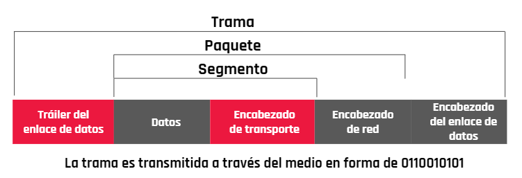

En el extremo receptor, los datos se deben desempaquetar.
- La capa de enlace de datos elimina el primer encabezado y el final de la trama y pasa el paquete adjunto a la capa de red. 
- Esta capa quita el encabezado del paquete y pasa el segmento adjunto a la capa de transporte. 
- La capa de transporte espera a que lleguen suficientes segmentos y luego ensambla los segmentos para crear el flujo de datos original y lo pasa a los niveles superiores.

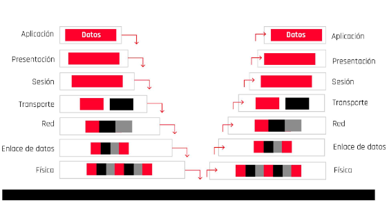

Mediante estos conceptos ahora podemos entender cómo es el flujo de datos entre las diferentes capas de este modelo.

> Todo este proceso también es denominado encapsulación y desencapsulación de datos en el modelo OSI.

# Protocolo de Internet

El protocolo de Internet, conocido por sus siglas en inglés **IP** —Internet Protocol—, es el protocolo principal de la familia de protocolos de Internet y su importancia es fundamental para el intercambio de mensajes en redes informáticas. Es decir, **son normas que nos van a regir el intercambio de información a través de una red de computadoras o dispositivos.**

<p style="font-weight:700; font-size:17px; color:cyan">El protocolo IP junto al protocolo de control de transmisiones —TCP o Transmission Control Protocol— sientan las bases de Internet. </p>

**Para que el remitente pueda enviar un paquete de datos al destinatario,** 
- El protocolo IP define una estructura de paquetes que agrupa los datos que se tienen que enviar. Así, el protocolo IP establece cómo se describe la información sobre el origen y el destino de los datos y los separa de los datos útiles en la cabecera de cada paquete de información enviado.

El protocolo IP identifica cada dispositivo que se encuentre conectado a la red mediante su correspondiente dirección IP. 
- La dirección IP se utiliza para identificar de manera unívoca tanto al dispositivo como a la red a la que pertenece, dividiéndose así en dos partes:

    - Una dirección que identifica la red.
    - Una dirección que identifica al dispositivo dentro de esa red.

No puede haber en una misma red y, por lo tanto, tampoco en Internet, dos dispositivos conectados con una misma dirección IP. 
- La dirección IP es única y exclusiva para cada equipo conectado a Internet.

Pero, normalmente, no solemos memorizar las direcciones IP, sería casi imposible memorizar las IP de las webs a las que queremos acceder. Con este objetivo, se crearon los nombres de dominio. Entonces cada vez que queremos acceder a una página web utilizamos su nombre de dominio, como, por ejemplo, google.com en vez de utilizar su dirección de IP 78.45.789.03

<p style="font-weight:700; font-size:17px; color:cyan">Quien se encarga de estas traducciones entre nombres de dominio y direcciones IP será el protocolo de sistema de nombres de dominio —Domain Name System o DNS— que tenga configurado nuestro dispositivo. </p>

> Ver video: Protocolos - clase 17

[Protocolos de internet](https://view.genial.ly/607c2b39cd833f0cf3c240e8)

***

## **Protocolo de Internet IP**

IP —Internet Protocol, en inglés— 
- es un protocolo de comunicación de datos digitales.
- clasificado funcionalmente en la **capa de red** —que es la que nos proporciona conectividad y la selección de ruta entre dos sistemas hosts—. 
- La función principal es conseguir que los datos lleguen desde origen al destino, aunque no tenga una conexión directa. 
- Estos datos se transfieren mediante paquetes conmutados —método de agrupar los datos transmitidos a través de una red digital en paquetes, estos están compuestos por los datos en sí y la información de control que nos indicará cual es la ruta que debe tomar para que los datos lleguen a destino—.

Este protocolo se encargará de buscar el mejor método de enrutamiento, **sin garantías de alcanzar el destino final**, pero aun así trata de buscar la mejor ruta entre las conocidas por la máquina que esté usando IP. 

## **TCP**

El TCP —Transmission Control Protocol, en inglés— 
- garantiza que los datos sean entregados al lugar de destino, sin ningún error y en el mismo orden que se transmitieron. 
- Se encuentra en una **capa intermedia** entre el protocolo IP y la aplicación y, esta ubicación se debe a que la aplicación necesita que la comunicación de la red sea confiable. 
- El protocolo TCP da soporte a muchas de las aplicaciones más populares de Internet —navegadores, intercambio de ficheros, etcétera— y protocolos de aplicación HTTP, SSH, FTP, entre otros.

## **DNS**

El sistema de nombres de dominio —DNS, en inglés Domain Name System—, 
- es un sistema de nomenclatura jerárquico descentralizado para dispositivos conectados tanto a Internet como a redes privadas, que asocia información con el nombre del dominio. 
- **Su función principal es “traducir”** los nombres de los dominios que estamos acostumbrados, como youtube.com, en identificadores binarios asociados con los equipos conectados a la red o direcciones IP, como 84.78.754.20.
- Para acceder a Internet los usuarios utilizan el nombre de dominio, en lugar de los complejos números de IP, pero ¿de dónde obtiene Internet las direcciones IP correspondientes a los nombres de dominio solicitados? Para ello, Internet utiliza su “agenda grande ” llamada DNS. 
- El servidor DNS proporciona este servicio a Internet.

## **TCP/IP**

El TCP/IP —protocolo de control de transmisión/protocolo de Internet— 
- Consiste en un par de protocolos que permiten la comunicación entre los dispositivos o computadoras pertenecientes a una red sin importar si el software o el hardware de cada uno es diferente. 
- Este protocolo funciona de la siguiente forma: cuando se transfiere información de un dispositivo a otro —por ejemplo, mensajes de correo electrónico o cualquier otro tipo de datos— esta información no es transmitida de una sola vez, sino que se divide en pequeñas partes. 
- El modelo TCP/IP es usado para comunicaciones en redes y, como todo protocolo, describe un conjunto de guías generales de operación para permitir que un equipo pueda comunicarse en una red. 
- TCP/IP provee conectividad de extremo a extremo especificando cómo los datos deberían ser formateados, direccionados, transmitidos, enrutados y recibidos por el destinatario.


## **UDP**

El protocolo de datagramas de usuario —UDP, en inglés User Datagram Protocol— 
- es un protocolo del nivel de transporte basado en el intercambio de datagramas —un datagrama es un paquete de datos y un paquete de datos es cada uno de los bloques en que se divide la información para enviar—.
- Su función es permitir el envío de datagramas a través de la red sin que se haya establecido previamente una conexión ya que el propio datagrama incorpora suficiente información de direccionamiento en su cabecera.
- El protocolo UDP es más ligero ya que no utiliza tantas capas como el protocolo TCP/IP porque no existe un control sobre el envío de los paquetes.
- Al ser orientada a la no conexión **lo único que le interesa a este protocolo es enviar los datagramas lo más rápido posible**, sin tener en cuenta si el paquete llegó completo o no. 
- Se utiliza comúnmente para la transmisión de datos de alta velocidad, por ejemplo para streaming, juegos online, entre otros. 

## **HTTP**

El protocolo de transferencia de hipertexto —HTTP, en inglés Hypertext Transfer Protocol— 
- es un protocolo orientado a transacciones y sigue el esquema petición-respuesta entre un cliente y un servidor. 
- El cliente —normalmente un navegador web— realiza una petición enviando un mensaje, con cierto formato al servidor. 
- El servidor —se le suele llamar un servidor web— le envía un mensaje de respuesta, permitiendo la comunicación entre ambos. 
- Tiene como desventaja que no está protegida y podríamos pensar que toda la información está en texto puro. Si alguien intercepta una comunicación, podría ver nuestros datos.

## **HTTPS**

El protocolo seguro de transferencia de hipertexto —en inglés, Hypertext Transfer Protocol Secure o HTTPS— 
- Está destinado a la transferencia segura de datos de hipertexto. 
- Lo que hace es encriptar los datos que son enviados entre clientes y servidores utilizando algoritmos de encriptación, de este modo toda la información sensible, como números de tarjetas, números de teléfono, claves de acceso, entre otros, pueden ser enviados de manera segura. 
- Si alguien intercepta una comunicación, no podría ver nuestros datos sensibles, solamente obtendría un mensaje encriptado y este va a ser muy difícil de desencriptar.

***

**Refrescando nuestros conocimientos de redes**

¿Recuerdan el armado de la red hogareña en donde contábamos con algunos dispositivos como notebooks, tablets y teléfonos, y mediante un router conectado a Internet repartiamos direccionamiento IP y teníamos una red privada con conexión a Internet? ¿Pero qué pasa a bajo nivel de nuestras redes? ¿Cómo es la comunicación?

Para repasar el contenido establecemos en 2 protocolos básicos **los tipos de comunicación de los dispositivos que se comunican mediante el protocolo IP**.

Estos son TCP y UDP. 


**El protocolo TCP** (protocolo de control de transmisión) 
- establece una conexión antes de enviar el tráfico, 
- luego envía los paquetes de datos y confirma la recepción.

**El protocolo UDP** (protocolo de datagrama de usuario) 
- no establece una conexión directa, es decir, el protocolo envía los datos a quien los reciba. 
- Se utiliza para enviar información de manera rápida y sin esperar la confirmación de recepción de los paquetes enviados.

# C19 - Direcciones

De la misma manera que las casas de las personas son identificadas y ubicadas a través de un sistema de numeración o direcciones, la forma de ubicar a las computadoras dentro de las respectivas redes a las cuales se conectan es a través de direcciones. Estas pueden ser:

- MAC
- IP

> Ver video - Clase 19: Direcciones IP
> Ver .ppt - Clase 19: Direcciones

### **Direcciones IP**

Una dirección IP es un número único que representa la ubicación de un dispositivo dentro de Internet o de una red. 
IP significa “protocolo de Internet” y son una cadena de números separados por puntos. 
Esta dirección puede ser IPv4 e IPv6.

Las direcciones IPv4 se expresan como un conjunto de cuatro números, un ejemplo podría ser la dirección 192.158.1.38.

Cada número del conjunto puede oscilar entre 0 y 255. Por lo tanto, el rango   de   direccionamiento IP completo va desde `0.0.0.0` a `255.255.255.255`

Internet se basa en la suite de protocolos de red TCP/IP. 
- A cada computadora en Internet se le asigna una dirección de Protocolo de Internet (IP) única, que en la actualidad es un número de 32 bits representado por cuatro cadenas de números, los cuales varían de 0 a 255 y se separan por puntos.
- Cuando un usuario envía un mensaje a otro en Internet, primero se descompone en paquetes mediante el protocolo TCP. 
- Cada paquete contiene su dirección de destino.
- Después los paquetes se envían del cliente al servidor de red, y de ahí a tantos servidores como sea necesario para que lleguen a una computadora específica con una dirección conocida. 
- En la dirección de destino, los paquetes se vuelven a ensamblar para formar el mensaje original.

Existen dos tipos de direcciones IP públicas y privadas.

**Las públicas** 

Son todas aquellas que sirven para identificarnos en Internet, es decir, para identificar dispositivos en la gran red.

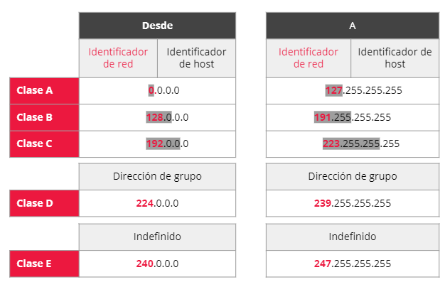

**Las IP privadas** 

Son el número asignado a un dispositivo dentro de una red privada. Es decir, para identificar, por ejemplo, nuestro celular, notebook, tablet, entre otros dispositivos, dentro de una misma red wifi en nuestro hogar. Se reservan para ello determinados rangos de direcciones:


**Dirección IP estática o dinámica** 

La dirección IP será estática o dinámica en función de si es siempre la misma o va cambiando. Dependiendo del caso, será asignada por el proveedor de acceso a Internet, un router o el administrador de la red privada a la que esté conectado el equipo.

|Nombre|Descripción|
|---|---|
|Estáticas|Un número IP asignado de manera fija. Aunque el dispositivo con la IP asignada esté apagado, este continuará manteniendo la misma dirección.|
|Dinámicas|Se asignan cuando el dispositivo está funcionando, dependiendo de las IP que están libres. A diferencia de las estáticas, si el dispositivo se apaga, cuando vuelva a encenderse podría llegar a tener otra IP diferente.|


### **Direcciones MAC**

Todos los dispositivos tienen una dirección MAC, la cual es la asignada por el fabricante a la hora de la creación del dispositivo de conexión. 

Está compuesta por 48 bits, los cuales son alfanuméricos,que a su vez están divididos en dos segmentos donde uno identifica al fabricante y el otro al dispositivo. 


Por sus siglas en inglés significa Media Access Control. 
- Es un identificador único que cada fabricante le asigna a la tarjeta de red de sus dispositivos conectados, desde un ordenador o móvil hasta routers, impresoras u otros dispositivos. 
- Cada dirección MAC es única a nivel mundial y, en teoría, son fijas para cada dispositivo.
- Cada dirección MAC incluye seis parejas de números. 
- Los primeros tres pares sirven para identificar al fabricante y los tres siguientes al modelo concreto. - Es importante tener en cuenta que un equipo puede contar con hardware variado para conectarse a las redes. 
- De esta forma, es común tener una dirección MAC para Ethernet, otra para wifi y otra para bluetooth.

Si queremos verificar la dirección MAC en Windows,debemos:
- Pulsar las teclas `Windows+R` para abrir Ejecutar.- Escribir `cmd` y presiona `Enter` para ir al Símbolo desistema.
- Escribir: `ipconfig /all` 

Si queremos verificar la dirección MAC en MacOS, debemos:
- Acceder a las Preferencias del Sistema y luego hacerclic en Red.
- Hacer clic sobre Avanzado, que se encuentra en la parte inferior de la ventana.
- En la pestaña Hardware se encuentra la información sobre la dirección MAC.

Si queremos verificar la dirección MAC en distribuciones GNU/Linux, debemos:
- Acceder a la consola y escribir `ifconfig`
- La dirección MAC es la dirección que aparece en elcampo HWaddr.

Esta información resulta muy útil para los administradores de sistemas que tienen que
dirigir redes con cientos o miles de dispositivos conectados.

### **Mascara de subred**

Una subred es una combinación de números que sirve para delimitar el ámbito de una red de computadoras. 
**El protocolo TCP/IP usa la máscara de subred para determinar si un host está en la subred local o en una red remota.**
Su función es indicar a los dispositivos qué parte de la dirección IP es el número de la red, incluyendo la subred y qué parte es la correspondiente al host.

Los números IP, como vimos anteriormente, poseen una parte que corresponde a la red y otra que corresponde al host:


¿Cómo distingue el sistema qué parte es la red y qué parte es el host?A través de una máscara de subred:

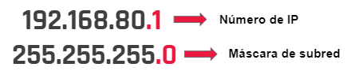

**¿Para qué sirve una máscara de subred?**

Veamos un ejemplo. 

Supongamos que en nuestra casa tenemos tres dispositivos conectados. 
La IP del primero es 
`192.168.1.2`, la del segundo, 
`192.168.1.3` y la del tercero, 
`192.168.1.4`. 
Podemos ver que los tres primeros números son iguales mientras que el último cambia.

**Lo que hace la máscara de subred es identificar esa parte fija de la IP de la parte variable.**

La máscara le asignará el 225 a la posición de nuestra IP que no varía y le pone un 0 a la variable.


Se pueden separar la dirección IP y la máscara de subred, la red y las partes de host de la dirección. Podemos verlo transformando las direcciones a binario:

Dirección IP:
`192.168.1.2 = 11000000.10101000.00000001.00000010`

Máscara de subred:
`255.255.255.0 = 11111111.11111111.11111111.00000000`

Los primeros 24 bits se identifican como la dirección de red. 
Los últimos 8 bits se identifican como la dirección de host. 

Esto nos proporciona los siguientes números:

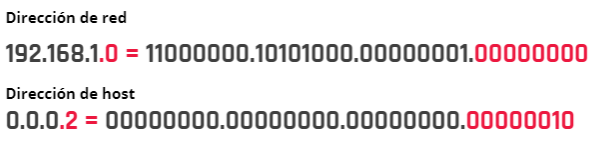

Si el router tiene la dirección IP 192.168.1.1 y máscara 255.255.255.0, todo lo que se envía a una dirección IP con formato 192.168.1.X se manda hacia la red local; mientras que direcciones con distinto formato de dirección IP serán enviadas hacia otra red, como Internet. 

### **Direcciones IP importantes** 

Existen algunas IP dentro de las redes que solo un dispositivo puede tener y por lo que si otro dispositivo se asigna una de estas direcciones, la red podría no funcionar correctamente.

|Nombre|Descripción|
|---|---|
|Router|La primera dirección disponible (por ejemplo 192.168.1.1) corresponde al router, el dispositivo que hace enlace con las otras redes, como Internet. De este modo, todos los dispositivos que quieran consultar algo en Internet lo primero que deben hacer es enviar la petición a la dirección del router, el cual se encargará de redirigir la petición.|
|Broadcast|Es la dirección más alta de la red a la que pertenezca el dispositivo, y es utilizada por el router para enviar un mensaje de difusión a todos los dispositivos que tengan una IP asignada dentro de la red, en redes hogareñas generalmente es 192.168.1.255.|

### **IPv6**

IPv6 es la versión 6 del protocolo de Internet. 
Está destinada a sustituir al estándar IPv4, ya que la anterior versión cuenta con un límite de direcciones de red que impide el crecimiento de la misma.

**Ventajas de IPv6**
|Nombre|Descripción|
|---|---|
|Número casi ilimitado de IPs únicas|Este nuevo protocolo permite que cada dispositivo conectado a Internet tenga su propia dirección IP. Una ventaja que poco a poco se va convirtiendo en un requisito con el continuo avance del Internet de las cosas.|
|Autoconfiguración|El nuevo protocolo consta de mejores métodos para realizar la configuración automática, lo que supone una mejora significativa respecto al clásico DHCP utilizado en IPv4.|
|Más seguridad|El protocolo IPv6 puede ser mejorado con IPsec (en inglés: Internet Protocol Security) para gestionar la encriptación y autenticación entre hosts. Proporciona un sólido marco de seguridad de punto a punto en la transferencia de datos.|
|Más eficiencia|La gestión de paquetes es mucho más eficiente en IPv6.|

**Quizz**

Las redes públicas pueden tener IP dinámicas o fijas, a diferencia de las redes privadas.
Falso

La última dirección IP es una IP reservada.
Verdadero.

Una subred es una forma de facilitar el uso de redes grandes.
Verdadero

Cuál de las siguientes afirmaciones es correcta.
La dirección MAC es asignada por el fabricante

***

## Direccionamiento

> Ver video: Clase 19 - Direccionamiento


**¿Cuál es la función de un routeren la red?**

El router realiza las siguientes acciones:

1. Recibe el paquete de datos.
2. Busca cuál es la dirección de destino.
3. Verifica la tabla de enrutamiento que tiene configurada.
4. Procede a enviar el paquete a destino por la mejor ruta posible.

**¿Cómo hace un router para enviar y recibir información?**

Un router, para recibir o enviar información, utiliza tablas de enrutamiento, que son un conjunto de reglas que sirven para determinar qué camino deben seguir los paquetes de datos.

Las tablas de enrutamiento contienen toda la información necesaria para hacer que uno o varios paquetes de datos puedan viajar a través de la red utilizando el mejor camino.

**Componentes de una tabla de enrutamiento**

Algunos componentes importantes de una tabla de enrutamiento son:

- **Red de destino**: corresponde a la red de destino donde deberá ir el paquete de datos.
- **Siguiente salto**: es la dirección IP de la interfaz de red por donde viajará el paquete de datos para seguir con su camino hasta el final.
- **Interfaz de salida**: es la interfaz de red por donde deben salir los paquetes para llegar posteriormente a destino.

## **Tipos de enrutamiento**

### **Enrutamiento estático**

Las tablas se crean de forma manual. El administrador de red las configura con la información de cómo alcanzar las diferentes redes remotas. 
Este es responsable de que las redes sean accesibles y estén libres de bugs e inconsistencias.

- Consume menos ancho de banda.
- Consume menos memoria.
- Se utiliza para redes pequeñas.
- No es escalable.

**Ventajas y desventajas del enrutamiento estático**

- **Ventajas**: aunque el mantenimiento es complicado, no se consume ancho de banda de red para enviar mensajes entre routers.
- **Desventajas**: cualquier cambio en la red requiere que el administrador agregue o elimine las rutas afectadas por dichos cambios.

### **Enrutamiento dinámico**

La información necesaria para crear y mantener actualizadas las tablas se obtienen de los demás routers de la red. 
Estos utilizan protocolos de enrutamiento para intercambiar información con sus routers vecinos.

- Alto consumo de ancho de banda.
- Alto consumo de memoria.
- Se utiliza para redes grandes.
- Es automático.

**Ventajas y desventajas del enrutamiento dinámico**

- **Ventajas**: el administrador solo pone en marcha el enrutamiento dinámico, luego las tablas de enrutamiento se ajustan automáticamente ante cambios en la red.
- **Desventajas**: consume mucho ancho de banda debido a los mensajes que intercambian los routers para configurarse automáticamente.

## **Puertos**

Cuando necesitamos acceder a un servicio desde Internet, es totalmente necesario abrir un puerto en nuestro router. 

Actualmente disponemos de dos protocolos en **la capa de transporte**: `TCP` y `UDP`. 
Por lo tanto, dependiendo del tipo de servicio que queramos utilizar, tendremos que abrir el puerto TCP o UDP, aunque también podría haber servicios que necesiten abrir un puerto TCP y UDP simultáneamente.

Dentro de la comunicación por Internet, los protocolos TCP y UDP se encargan de:
- establecer la conexión, 
- ensamblar los paquetes de datos tras la transmisión 
- y —a continuación— enviarlos a los programas a los que se dirigían en el receptor. 

Para que esta transferencia pueda tener lugar, el sistema operativo debe generar y abrir entradas. 
A cada entrada se le asigna un número de identificación específico. 
Tras la transmisión, el sistema receptor sabe a dónde hay que suministrar los datos gracias al número de puerto. 

En el paquete de datos siempre se incluyen dos números de puerto: el del emisor y el del receptor.

Los puertos están numerados de manera consecutiva de 0 a 65535. 

Algunos de estos números están estandarizados y se asignan a determinadas aplicaciones. 
El responsable del registro es la *Internet Assigned Numbers Authority (IANA)*. 
Junto a estos, también hay un amplio rango de números de puerto que se asignan de forma dinámica. 
Un navegador usa un puerto de este tipo durante una visita a una página web. Una vez el usuario abandona la página, el número vuelve a quedar libre.

El protocolo TCP es un protocolo conectivo, fiable y orientado a conexión. Esto significa que es capaz de retransmitir los segmentos de paquetes en caso de que haya alguna pérdida desde el origen al destino. 
Si estamos utilizando algún protocolo en la capa de aplicación —como HTTP, FTP o SSH, donde todos ellos utilizan el protocolo TCP—, en la primera comunicación se realizará este intercambio de mensajes. 

A continuación, listamos **algunos de los principales puertos TCP que usan muchos protocolos de la capa de aplicación** y también aplicaciones:

|Puerto|Descripcion|
|---|----|
|Puerto 21| El puerto 21 por norma general se usa para las conexiones a servidores FTP en su canal de control, siempre que no hayamos cambiado el puerto de escucha de nuestro servidor FTP o FTPES.|
|Puerto 22| por norma general este puerto se usa para conexiones seguras SSH y SFTP, siempre que no hayamos cambiado el puerto de escucha de nuestro servidor SSH.|
|Puerto 25| el puerto 25 es usado por el protocolo SMTP para el envío de correos electrónicos. Este protocolo también puede usar los puertos 26 y 2525.|
|Puerto 53| es usado por el servicio de DNS (Domain Name System).|
|Puerto 80| este puerto es el que se usa para la navegación web de forma no segura (HTTP).|
|Puerto 443| este puerto es también para la navegación web, pero en este caso usa el protocolo HTTPS, que es seguro y utiliza el protocolo TLS por debajo.|
|Puerto 3306| puerto usado por las bases de datos MySQL.|
|Puerto 8080| es el puerto alternativo al puerto 80 TCP para servidores web. Normalmente se utiliza este puerto en pruebas|
|Puerto 53| es utilizado para servicios DNS. Este protocolo permite utilizar tanto TCP como UDP para la comunicación con los servidores DNS.|


**Los puertos son puntos de conexión para el intercambio de información y la transmisión de datos.**

Cuando enviamos datos desde nuestra red local a la externa el router utiliza una serie de canales o puertas en las que se organiza el contenido que enviamos. Estos son los puertos. 

Funcionan como puertas que se abren y cierran y permiten el paso de la información que enviamos o recibimos en la red.

**Todos los routers tienen un total de `65536` puertos** que van desde el 0 al 65535. La IANA, entidad que supervisa la asignación global de direcciones IP y otros recursos relativos a los protocolos de internet tiene establecido un estándar de asignación de puertos.

Existen 3 grupos de puertos que tienen una función específica:

- **Puertos del 0 al 1023**: Son los que están reservados para el sistema operativo de la computadora y los protocolos más importantes para su funcionamiento.

- **Puertos del 1024 al 49151**: Son los puertos registrados, los que se utilizan por las aplicaciones y los juegos que instales en la computadora.

- **Puertos del 49152 al 65535**: Puertos dinámicos o privados, corresponden a las aplicaciones que necesitan conectarse a un servidor.

***

# C20 - Intranet y transmisión de paquetes

Una intranet es una red informática interna —normalmente de una empresa u organismo— basada en los estándares de Internet, en la que las computadoras están conectadas a uno o varios servidores web.

Los datos que viajan a través de las redes se encapsulan en “tramas”. En caso de que la longitud de la trama sea mayor a la que se puede transmitir por un canal, esta se divide en pequeños fragmentos capaces de ser transmitidos y son reensamblados al llegar al destinatario.

## **Intranet, extranet e internet**

¿Escucharon hablar de estos conceptos alguna vez? Veamos de qué se trata.

- **Intranet**: es una red informática que utiliza los protocolos de Internet para compartir información, sistemas operativos o servicios de computación dentro de una organización. Es interna, por lo que solo los miembros de esa organización tienen acceso a ella.

- **Extranet**: es parte de la Intranet de una organización que se extiende a usuarios fuera de ella.

- **Internet**: se define como una red de redes, ya que hace referencia a un entorno digital que conecta computadoras de todo el mundo y que permite el intercambio de información de forma pública.

***

**Cómo se transmite la información a través de Internet?**

Para transmitir o recibir información más allá de nuestra red local, necesitamos la ayuda de nuestro proveedor de servicios de internet (ISP), quien nos da acceso a la misma conectándonos con otras redes.

El ISP tiene reglas sobre qué información puede ser transmitida o no, de acuerdo a distintas legislaciones de cada territorio, por lo que existen soluciones alternativas para obtener conexiones más directas.

> Ver video: Redes de direccionamiento externo

## **VPN**

Una red privada virtual, o por sus siglas en inglés también llamada VPN, es una tecnología que protege nuestra privacidad cuando utilizamos Internet dirigiendo nuestra conexión a través de un servidor que oculta la dirección IP y encripta la comunicación online.Cuando se utiliza una VPN, la información enviada desde la computadora pasa a través de uno de los servidores del proveedor de VPN antes de llegar a su destino. 

**Ventajas**
- Son fáciles de instalar y utilizar.
- Velocidad No se ve afectada por el software de cifrado y los servidores.
- Compatibilidad con la mayoría de los dispositivos. 

**Desventajas**
- Encriptación débil
- Fallos del software: Esto puede ocasionar que los mensajes viajen sin cifrar y fuera de la red VPN.
- Políticas de registro variadas

## **TOR**

A primera vista, la red Tor es similar a una VPN. Los mensajes hacia y desde sucomputadora pasan a travésde la red Tor en lugar deconectarse directamente a los recursos de Internet. Pero donde las VPN brindan privacidad, Tor brinda anonimato.

**Ventajas**

- Difíciles de apagar: La red está distribuida por lo que no hay un lugar central para hacerlo.
- Anonimato casi completo.

**Desventajas**
- Lentitud: Los mensajes pasan por tres o más servidores y se cifran y descifran al menos 3 veces.
- Dirigida por voluntarios: Por lo tanto, no hay ingresos para actualizaciones y mantenimiento.
- Baja compatibilidad con dispositivos


**Quiz**

El enrutamiento o routing es:
Elegir la mejor ruta para enviar datos desde una red a otra.

La conexión entre dos computadoras depende de múltiples factores, por lo tanto, nunca se conectan a través de las misma direcciones IP.
Falso La respuesta no es correcta. La conexión entre dos computadoras se establece siempre a través de las direcciones IP.

¿Qué utiliza nuestra computadora para diferenciar solicitudes a diferentes aplicaciones que se encuentran en un mismo servidor?
Puertos

¿Qué es el ISP?
El proveedor de servicios de Internet.
Se encarga de recibir y enviar datos pudiendo aplicar filtros de normativas.

Las tablas de enrutamiento nos sirven para determinar qué camino deben seguir los datos.
Verdadero

El Proxy y las VPN son __________ que se utilizan para _________.
Protocolos/ el direccionamiento
