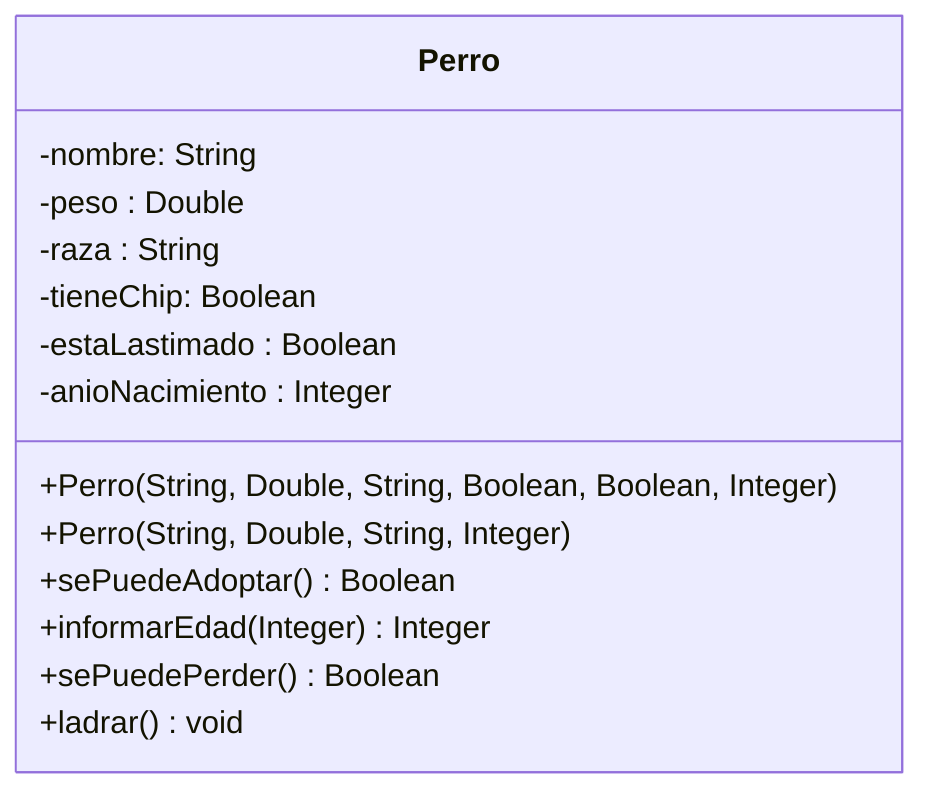

<link rel="stylesheet" type="text/css" media="all" href="../styles.css" />

# Actividad: Clases, atributos y responsabilidades

Identificar, modelar e implementar en Java la clase involucrada en el enunciado especificando sus atributos, responsabilidades, al menos dos constructores y los correspondientes getters, y setters.

Para una institución que adopta perros se requiere tener de ellos: 
si están en adopción o no, raza, año aproximado de nacimiento, peso, si tiene o no chip, si está o no lastimado y el nombre de pila que le asignaron en la institución.

Deberemos poder preguntar la edad de un perro y si es un perro factible de perderse —entendiendo que los perros que tienen chip son los que no se pueden perder—. Por otro lado, se puede enviar a adopción a un perro si no está lastimado y su peso es mayor a 5 kg.


### Modelo actividad



### Clase Perro en java

```java
package com.company;

public class Perro {
    private String nombre;
    private Double peso;
    private String raza;
    private Boolean tieneChip;
    private Boolean estaLastimado;
    private Integer anioNacimiento;

    public String getNombre() {
        return nombre;
    }
    public Double getPeso() {
        return peso;
    }
    public String getRaza() {
        return raza;
    }
    public Boolean getTieneChip() {
        return tieneChip;
    }
    public Boolean getEstaLastimado() {
        return estaLastimado;
    }

    public Integer getAnioNacimiento() {
        return anioNacimiento;
    }

    public void setNombre(String nombre) {
        this.nombre = nombre;
    }
    public void setPeso(Double peso) {
        this.peso = peso;
    }
    public void setRaza(String raza) {
        this.raza = raza;
    }
    public void setTieneChip(Boolean tieneChip) {
        this.tieneChip = tieneChip;
    }
    public void setEstaLastimado(Boolean estaLastimado) {
        this.estaLastimado = estaLastimado;
    }
    public void setAnioNacimiento(Integer anioNacimiento) {
        this.anioNacimiento = anioNacimiento;
    }

    //    constructores
    public Perro(String nombre, Double peso, String raza, Boolean tieneChip, Boolean estaLastimado, Integer anioNacimiento){
        this.nombre = nombre;
        this.peso = peso;
        this.raza = raza;
        this.tieneChip = tieneChip;
        this.estaLastimado = estaLastimado;
        this.anioNacimiento = anioNacimiento;
    }
    public Perro(String nombre, Double peso, String raza, Integer anioNacimiento){
        this.nombre = nombre;
        this.peso = peso;
        this.raza = raza;
        this.anioNacimiento = anioNacimiento;
    }
    //metodos

    public Boolean sePuedeAdoptar(){
        if (peso >= 5 && !estaLastimado){
            return true;
        }else{
            return false;
        }
    }
    //restar 2021 - anioNacimiento
    public Integer informarEdad(Integer anioActual){
        return anioActual-anioNacimiento;
    }
    public Boolean sePuedePerder(){
        if (tieneChip){
            return false;
        }else {
            return true;
        }
    }
    public void ladrar(){
        System.out.println("guau guau");
    }
}
```

### En el main

```java
package com.company;

public class Main {

    public static void main(String[] args) {
	// write your code here
        Perro perro = new Perro("Tom",12.8,"Bulldog", false, false,2017);
        perro.ladrar();
        if(perro.sePuedeAdoptar()){
            System.out.println("Se puede dar en adopción");}else{
            System.out.println("no se puede dar en adopción");
        }

    }
}
```

## [⏪ Atrás](../README.md)