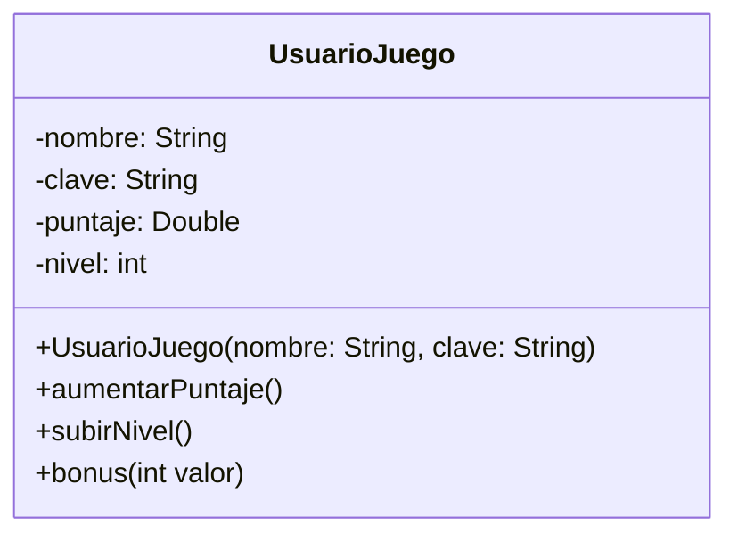

<link rel="stylesheet" type="text/css" media="all" href="../styles.css" />

# Actividad: Clases, atributos y responsabilidades

Para desarrollar un juego necesitamos implementar la clase `UsuarioJuego`. Los usuarios tienen `nombre` y `clave`, estos datos se deben suministrar cuando se crea un nuevo usuario.
Inicialmente tienen `puntaje` y `nivel` en cero. Sin embargo, pueden aumentar tanto el puntaje como el nivel en 1, debemos suministrar un método para poder hacerlo. 
El usuario también puede recibir un bonus, esto quiere decir que recibe un valor extra que se suma a su puntaje

### Modelo



### class UsuarioJuego

```java
package com.company;

public class UsuarioJuego {

    //atributos
    private String nombre;
    private String clave;
    private Double puntaje;
    private int nivel;

    //constructor
    public UsuarioJuego(String nombre, String clave){
        this.nombre = nombre;
        this.clave = clave;
        //lo tengo que inicializar en cero
        this.puntaje = 0.0;
        this.nivel = 0;
    }
    //no lleva parametro porque en uml no dice y porque aumenta siempre en 1
    public void aumentarPuntaje(){
        this.puntaje++;
        System.out.println("Se aumento el puntaje en "+this.puntaje);
    }
    public void subirNivel(){
        this.nivel++;
        System.out.println("Se aumento el nivel en "+this.nivel);
    }
    //recibe un parametro y lo incrementa en puntaje
    public void bonus(int valor){
        //tengo que convertir el int ya que puntaje recibe Double
        this.puntaje += valor;
        System.out.println("Por tu bonus se aumento el puntaje en "+this.puntaje);
    }
}

```

### En el Main

```java
package com.company;

public class Main {

    public static void main(String[] args) {

        UsuarioJuego usuarioJuego = new UsuarioJuego("Tom","12345");
        usuarioJuego.aumentarPuntaje();
        usuarioJuego.bonus(520);
        usuarioJuego.subirNivel();
    }
}
```

## [⏪ Atrás](../README.md)