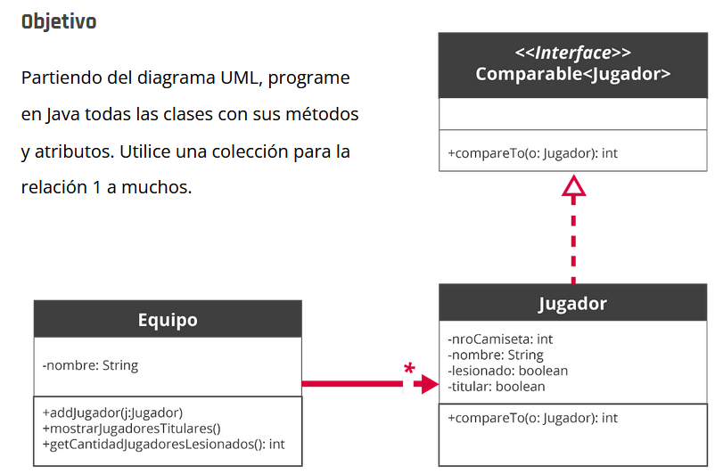

<link rel="stylesheet" type="text/css" media="all" href="../styles.css" />

# Actividad # C16 - Equipos Futbol



## Consideraciones:

El método `mostrarJugadoresTitulares()` solo debe mostrar por consola aquellos jugadores que son titulares y ordenados por número de camiseta.

El método `getCantidadJugadoresLesionados()` debe ir sumando y devolver la cantidad de jugadores que están lesionados y que son titulares.

## Solucion:

`Jugador.java`

```java
package com.company;
// Implementa comparable jugador para compararlos y poder ordenarlos, lo que esta entre <> es un template.
public class Jugador implements Comparable<Jugador> {

    // Atributos
    private Integer numeroCamiseta;
    private String nombre;
    private Boolean lesionado;
    private Boolean titular;

    // Constructor para crear mis jugadores
    public Jugador(Integer numeroCamiseta, String nombre, Boolean lesionado, Boolean titular) {
        this.numeroCamiseta = numeroCamiseta;
        this.nombre = nombre;
        this.lesionado = lesionado;
        this.titular = titular;
    }

    //Capta el atributo privado lesionados
    public Boolean getLesionado() {
        return lesionado;
    }

    //Capta el atributo privado titular
    public Boolean getTitular() {
        return titular;
    }

    //Forma de mostrar en pantalla el objeto
    @Override
    public String toString() {
        //Definimos como el objeto se transforma en string
        return "numero: " + numeroCamiseta + " nombre: " + nombre ;
    }

    //Usamos Comparable para ordenar listas, recibe por parametro al otro jugador
    @Override
    public int compareTo(Jugador jugador) {
        
        if(this.numeroCamiseta > jugador.numeroCamiseta){
            return 1;
        }
        if(this.numeroCamiseta < jugador.numeroCamiseta){
            return -1;
        }
        return 0;
    }

    public String getNombre() {
        return nombre;
    }
}
```
`Equipo.java`

```java
package com.company;

import java.util.ArrayList;
import java.util.Comparator;
import java.util.List;

// Equipo tiene una lista
public class Equipo {
    //Atributos
    private String nombre;
    // Le indico que tipo de dato va a ser la lista, va a tener una lista de jugadores. List el mas usado
    private List<Jugador> jugadores;

    // Constructor con solo nombre porque no queremos en este caso que inicie con una lista, igual tengo que inicializar la lista en vacio
    public Equipo(String nombre) {
        this.nombre = nombre;
        //Siempre inicializamos la lista, en este caso la lista en vacio. Si no la inicializa hace un nullpointer
        this.jugadores = new ArrayList<>();
    }

    // Primera responsabilidad, la lista es privada por eso necesita una forma de agregarle cosas a la lista. Recibe el jugador
    public void addJugador(Jugador jugador){
        //Agregamos el jugador que recibe por parametro
        jugadores.add(jugador);
    }

    //Traemos jugadores lesionados
    public Integer getCantidadJugadoresLesionados(){
        //Ciclo forEach para recorrer jugadores, los guardamos en una variable
        Integer lesionados = 0;
        //  Primero el tipo de dato= Jugador y el nombre que le vamos a poner a cada elemento que recorro= jugador : Lo que estamos recorriendo= jugadores
        // se lee: por cada jugador dentro de los jugadores = inter crea el forEach
        for (Jugador jugador : jugadores) {
            if (jugador.getTitular() && jugador.getLesionado()){
                lesionados++;
            }
        }
        return lesionados;
    }
    // Muestra en pantalla
    public void mostrarJugadoresTitulares(){
        // Muestra jugadores ordenados y pide set de reglas de orden como parametro. Para orden que ya le dimos en el compareTo (numeroCamiseta) ponemos null.
        jugadores.sort(null);
        // Itera cada jugador
        for (Jugador jugador : jugadores) {
            // chequeamos que el jugador sea titular
            if(jugador.getTitular()){
                // to string ensenia a java a mostrar un objeto en pantalla, pero sout lo hace internamente
                System.out.println(jugador);
            }
        }
    }
}
```
En `Main.java`

```java
package com.company;

public class Main {

    public static void main(String[] args) {
     
        Jugador jugador = new Jugador(2,"Icardi",true,true);

        Equipo equipo = new Equipo("PSG");

        equipo.addJugador(jugador);

        equipo.addJugador(new Jugador(30,"Messi",false,false));
        equipo.addJugador(new Jugador(1,"Pato",false,true));
        equipo.addJugador(new Jugador(11,"Di Maria",false,true));

    //    System.out.println(equipo.getCantidadJugadoresLesionados());

        equipo.mostrarJugadoresTitulares();
    }
}
```

## [⏪ Atrás](../README.md)
