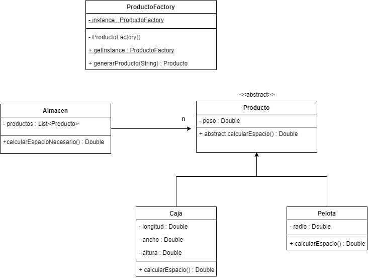

<link rel="stylesheet" type="text/css" media="all" href="../styles.css" />

# C21 - ProductoFactory

* Agregamos la fabrica con la instance privada y estatica
* agregamos el getinstance publico y estatico para poder pedirselo a la clase
* Agregamos constructor privado
Hasta aqui es **Singleton**
* Agreando el metodo generar producto lo hace **factory**
* Almacen va a utilizar una productoFactory para crear sus productos

## UML



En `Producto.java`

```java
package com.company;

public abstract class Producto {

    private Double peso;

    public Producto(Double peso) {
        this.peso = peso;
    }

    //Cuando no nos interesa pasarle peso
    public Producto() {
    }

    public abstract Double calcularEspacio();
}
```

En `ProductoCaja.java`

```java
package com.company;

public class ProductoCaja extends Producto {

    private Double longitud;
    private Double ancho;
    private Double altura;

    public ProductoCaja(Double longitud, Double ancho, Double altura) {
        this.longitud = longitud;
        this.ancho = ancho;
        this.altura = altura;
    }

    @Override
    public Double calcularEspacio() {
        return longitud * ancho * altura;
    }
}
```

En `ProductoPelota.java`

```java
package com.company;

public class ProductoPelota extends Producto {

    private Double radio;

    public ProductoPelota(Double radio) {
        this.radio = radio;
    }

    @Override
    public Double calcularEspacio() {
        return Math.PI * Math.pow(radio,3) * 4.0/3.0;
    }
}
```

En `Almacen.java`

```java
package com.company;

import java.util.ArrayList;
import java.util.List;

public class Almacen {

    private List<Producto> productos;

    public Almacen() {
        productos = new ArrayList<>();
    }

    public Double calcularEspacioNecesario(){
        Double espacioNecesario = 0.0;
        for (Producto producto : productos) {
            espacioNecesario += producto.calcularEspacio();
        }
        return espacioNecesario;
    }
    // Para manejar el exception 
    public void cargarProducto(String codigo){
        try {
            //Para cargar el producto le pido a ProductoFactory la instancia y le pido generar el producto, puede fallar porque generar producto tiene una exception que no estamos manejando, para eso envolvemos esto en try catch
            //Llamamos a la instancia porque generar producto no es estatico, si no llamamos a la instancia antes no podemos generar producto
            productos.add(ProductoFactory.getInstance().generarProducto(codigo));
        } catch (ProductoFactoryException e) {
            //Imprime el error
            e.printStackTrace();
        }
    }
}
```

En `ProductoFactory.java` : Iniciamos la Fabrica

```java
package com.company;

import java.util.regex.PatternSyntaxException;

public class ProductoFactory {

    private static ProductoFactory instance;

    public static final String CODIGO_PELOTA_TENIS = "PELOTATENIS";
    public static final String CODIGO_PELOTA_FUTBOL = "PELOTAFUTBOL";
    public static final String CODIGO_CAJA10X10 = "CAJA10X10";

    private ProductoFactory(){
    }
    //Lo mas importante que tenga getInstance, primero preungtamos si es nula, si es nula se obtiene la instance si no, retorna la existente; si es null se inicializa, tiene que ser estatico para acceder a los atributos estaticos
    public static ProductoFactory getInstance() {
        if(instance == null){
            instance = new ProductoFactory();
        }
        return instance;
    }
    //Creamos la fabrica, la mejor practica es retornar un exception, ponerlos el throws para avisar que puede tener excepcion
    public Producto generarProducto(String codigo) throws ProductoFactoryException {
        switch (codigo){
            case CODIGO_PELOTA_TENIS:
                return new ProductoPelota(0.32);
            case CODIGO_PELOTA_FUTBOL:
                return new ProductoPelota(11.0);
            case CODIGO_CAJA10X10:
                return new ProductoCaja(10.0,10.0,10.0);
            default:
                throw new ProductoFactoryException(codigo + " no es un codigo valido");
        }
    }
}
```

En `ProductoFactoryException.java`

```java
package com.company;

public class ProductoFactoryException extends Exception{
    //Lo hago con el constructor String:message
    public ProductoFactoryException(String message) {
        super(message);
    }
}
```
En `Main.java`

```java
package com.company;

public class Main {

    public static void main(String[] args) {

        Almacen almacen = new Almacen();
        almacen.cargarProducto(ProductoFactory.CODIGO_PELOTA_FUTBOL);
        almacen.cargarProducto(ProductoFactory.CODIGO_PELOTA_FUTBOL);
        almacen.cargarProducto(ProductoFactory.CODIGO_PELOTA_FUTBOL);
        almacen.cargarProducto(ProductoFactory.CODIGO_CAJA10X10);
        almacen.cargarProducto(ProductoFactory.CODIGO_PELOTA_TENIS);
        almacen.cargarProducto(ProductoFactory.CODIGO_PELOTA_TENIS);
        almacen.cargarProducto(ProductoFactory.CODIGO_PELOTA_TENIS);
        almacen.cargarProducto(ProductoFactory.CODIGO_PELOTA_TENIS);

        System.out.println(almacen.calcularEspacioNecesario());
    }
}
```
## [⏪ Atrás](../README.md)