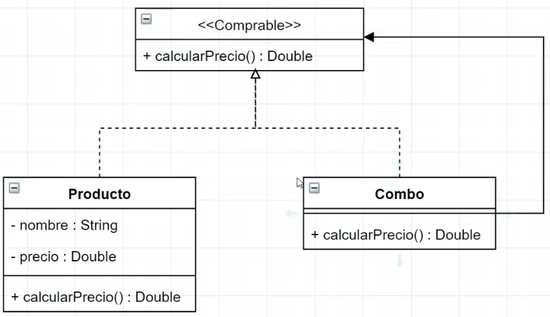

<link rel="stylesheet" type="text/css" media="all" href="../styles.css" />

# C22 - Patron Composite 

Producto va a ser un comprable
Comprable: responsabilidad calcular o informar su precio
Combo: Es un comprable y tiene una lista de comprables; un combo puede estar hecho de otros combos.




En `Interface Comprable.java`

```java
public interface Comprable {
    //Esta resposnabilidad nos devuelve el precio de tipo Double
    public Double calcularPrecio();

}
```

En `Producto.java`

```java
//Se comporta como un comprable por eso implementa Comprable
public class Producto implements Comprable {
    private String nombre;
    private String precio;

    //Constructor que recibe atributos
    public Producto(String nombre, Double precio){
        this.nombre = nombre;
        this.precio = precio;
    }

    //Cumplimos la interfaz de Comprable asi que tiene la responsabilidad de calcular precio, producto ya tiene su precio, entonces vaa  devovler el valor del atributo
    @Override
    public Double calcularPrecio(){
        return precio;
    }
}
```

En `Combo.java`
```java
//Se comporta como un comprable por eso implementa Comprable
public class Combo implements Comprable{
    //Ademas de comportarse como Comprable tiene un atributo lista de comprables.
    private List<Comprable> comprables;

    //Creamos constructor con ningun parametro, lo creamos para inicializar la lista
    public Combo(){
        comprables = new ArrayList<>();
    }

    //Para cumplir con la interfaz agregamos la responsabilidad de calcular el precio. Suma el precio de cada uno de los comprables, por eso tiene que recorrer la lista
    @Override
    public Double calcularPrecio(){
        Double precioTotal = 0.0;

        //Recorre cada comprable donde en la lista de comprables ejecuta el codigo.
        for (Comprable comprable : comprables){
            precioTotal += comprable.calcularPrecio();
        }
        return precioTotal;
    }
}
```
## [⏪ Atrás](../README.md)