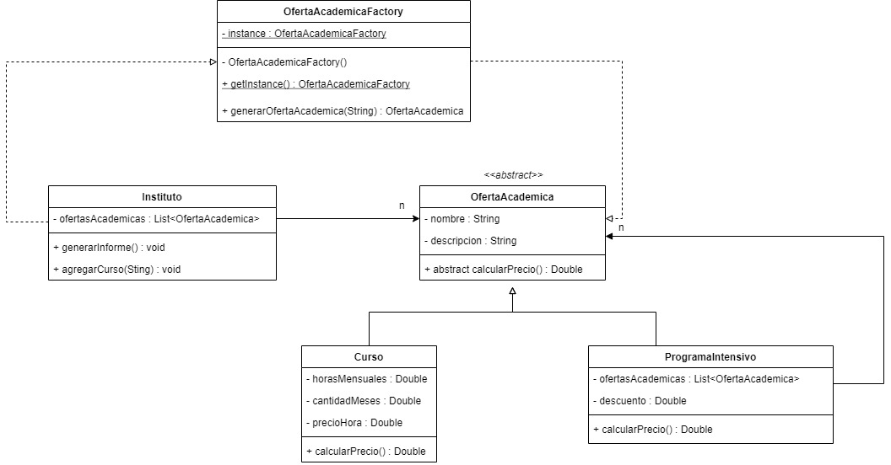

<link rel="stylesheet" type="text/css" media="all" href="../styles.css" />

# C23 - Instituciones

Un instituto necesita desarrollar un sistema para el área comercial y académica que le permita armar ofertas académicas, es decir, armar paquetes con los cursos que se dictan en la institución para constituir programas intensivos. Estos cursos están diseñados a su vez para poder dictarse y ofrecerse en forma independiente sin necesidad de cursar un programa intensivo. Es decir, que tanto un curso como un programa son ofertas académicas que el área comercial podrá ofrecer.

Toda oferta académica es decir cursos y programas tienen un nombre, una descripción y deberán tener una funcionalidad que le permita al área comercial poder contar con un precio para cada una de estas ofertas con la siguiente lógica:
El precio de un curso se calcula de acuerdo a la cantidad de carga horaria mensual de ese curso por la cantidad de meses de duración y un valor hora que se establece por cada Curso.
El precio de un programa intensivo es la sumatoria de los precios de todos los cursos que forman el programa y se bonifica un determinado porcentaje dependiendo del programa.
El instituto deberá poder generar un informe que permita mostrar todos los cursos y programas que ofrece indicando el nombre y precio de cada uno (no es necesario mostrar los cursos que tiene un programa intensivo).

Reproducir la siguiente situación en una clase Test que contenga el método main e invocar al método que genera el informe. 
Curso: Front End tiene una carga horaria de 16 horas mensuales de dos meses de duración con un precio de 1000 pesos la hora, es decir que tiene un precio de 32.000 pesos. 
Curso: Back End tiene una carga horaria de 20 horas mensuales de dos meses de duración con un precio de 900 pesos la hora, es decir que tiene un precio de 36.000 pesos. 
El programa intensivo FullStack que posee ambas materias y cuyo porcentaje de bonificación es de 20% tiene un precio final de 54.400 pesos.

## UML



## Codigo

En `OfertaAcademica.java`

```java
package com.company;

// 1. Clase Abstracta
public abstract class OfertaAcademica {

    private String nombre;
    private String descripcion;

    public OfertaAcademica(String nombre, String descripcion) {
        this.nombre = nombre;
        this.descripcion = descripcion;
    }

    //Metodos abstractos van en clases abstractas
    public abstract Double calcularPrecio();

    public String getNombre() {
        return nombre;
    }
}
```

En `Curso.java`

```java
package com.company;

//2. Clase Curso
public class Curso extends OfertaAcademica {

    private Double horasMensuales;
    private Double duracionMeses;
    private Double precioPorHora;

    public Curso(String nombre, String descripcion, Double horasMensuales, Double duracionMeses, Double precioPorHora) {
        super(nombre, descripcion);
        this.horasMensuales = horasMensuales;
        this.duracionMeses = duracionMeses;
        this.precioPorHora = precioPorHora;
    }

    //Implementa metodo calcular precio
    @Override
    public Double calcularPrecio() {

        return horasMensuales * duracionMeses * precioPorHora;
    }
}
```

En `ProgramaIntensivo.java`

```java
package com.company;

import java.util.ArrayList;
import java.util.List;

//3. Clase programa intensivo
public class ProgramaIntensivo extends OfertaAcademica{

    private List<OfertaAcademica> ofertasAcademicas;
    private Double descuento;

    public ProgramaIntensivo(String nombre, String descripcion, Double descuento) {
        super(nombre, descripcion);
        this.descuento = descuento;
        ofertasAcademicas = new ArrayList<>();
    }

    //Metodo agregar ofertas academicas
    public void agregarOferta(OfertaAcademica ofertaAcademica){

        ofertasAcademicas.add(ofertaAcademica);
    }

    @Override
    public Double calcularPrecio() {
        Double sumaPrecio = 0.0;
        for (OfertaAcademica ofertaAcademica : ofertasAcademicas) {
            sumaPrecio += ofertaAcademica.calcularPrecio();
        }
        return sumaPrecio - sumaPrecio*descuento;
    }
}
```

En `OfertaAcademicaFactory.java`

```java
package com.company;

//4. Factory
public class OfertaAcademicaFactory {

    private static OfertaAcademicaFactory instance;

    public static final String CODIGO_FULL_STACK = "full-stack";
    public static final String CODIGO_FRONT_END = "front-end";
    public static final String CODIGO_BACK_END = "back-end";


    private OfertaAcademicaFactory(){

    }

    public static OfertaAcademicaFactory getInstance() {
        if(instance == null){
            instance = new OfertaAcademicaFactory();
        }
        return instance;
    }
    // Generamos la oferta en FULLSTACK agregamos los cursos qie estan dentro del programa, podemos usar este mismo metodo generarOfertaAcademica, si no se hace el throw ponemos return null;
    public OfertaAcademica generarOfertaAcademica(String codigo) throws OfertaAcademicaFactoryException{
        switch (codigo){
            case CODIGO_FRONT_END :
                return new Curso("front-end","soy un curso",16.0,2.0,1000.0);
            case CODIGO_BACK_END :
                return new Curso("back-end","soy un curso",20.0,2.0,900.0);
            case CODIGO_FULL_STACK :
                ProgramaIntensivo programaIntensivo = new ProgramaIntensivo("full-stack", "soy un programa",0.2);
                programaIntensivo.agregarOferta(generarOfertaAcademica(CODIGO_FRONT_END));
                programaIntensivo.agregarOferta(generarOfertaAcademica(CODIGO_BACK_END));
                return programaIntensivo;
            default:
                throw new OfertaAcademicaFactoryException(codigo + " no es un codigo valido");
        }
    }
}
```

En `Instituto.java`

```java
package com.company;

import java.util.ArrayList;
import java.util.List;

//5.
public class Instituto {

    private List<OfertaAcademica> ofertasAcademicas;

    public Instituto() {
        ofertasAcademicas = new ArrayList<>();
    }

    //Recibe codigo para generar curso, agarra a factory para generar curso, si uso throw tengo que usar try catch
    public void agregarCurso(String codigo){
        try {
            ofertasAcademicas.add(OfertaAcademicaFactory.getInstance().generarOfertaAcademica(codigo));
        } catch (OfertaAcademicaFactoryException e) {
            e.printStackTrace();
        }
    }

    //Imprime nombre y precio, en oferta academica hice getter de nombre  y uso metodo de calcular precio de la clase abstracta
    public void generarInforme(){
        for (OfertaAcademica ofertaAcademica : ofertasAcademicas) {
            System.out.println("nombre: " + ofertaAcademica.getNombre() +" precio: " + ofertaAcademica.calcularPrecio());
        }
    }
}
```

En `Main.java`

```java
package com.company;

//7. Si hay tiempo hacemos la exception
public class OfertaAcademicaFactoryException extends Exception {
    public OfertaAcademicaFactoryException(String message) {
        super(message);
    }
}
```

En `Test.java`

```java
package com.company;

//6. Agrego los cursos con las constantes
public class Test {

    public static void main(String[] args) {

        Instituto instituto = new Instituto();
        instituto.agregarCurso(OfertaAcademicaFactory.CODIGO_FRONT_END);
        instituto.agregarCurso(OfertaAcademicaFactory.CODIGO_BACK_END);
        instituto.agregarCurso(OfertaAcademicaFactory.CODIGO_FULL_STACK);

        instituto.generarInforme();
    }
}
```

## [⏪ Atrás](../README.md)