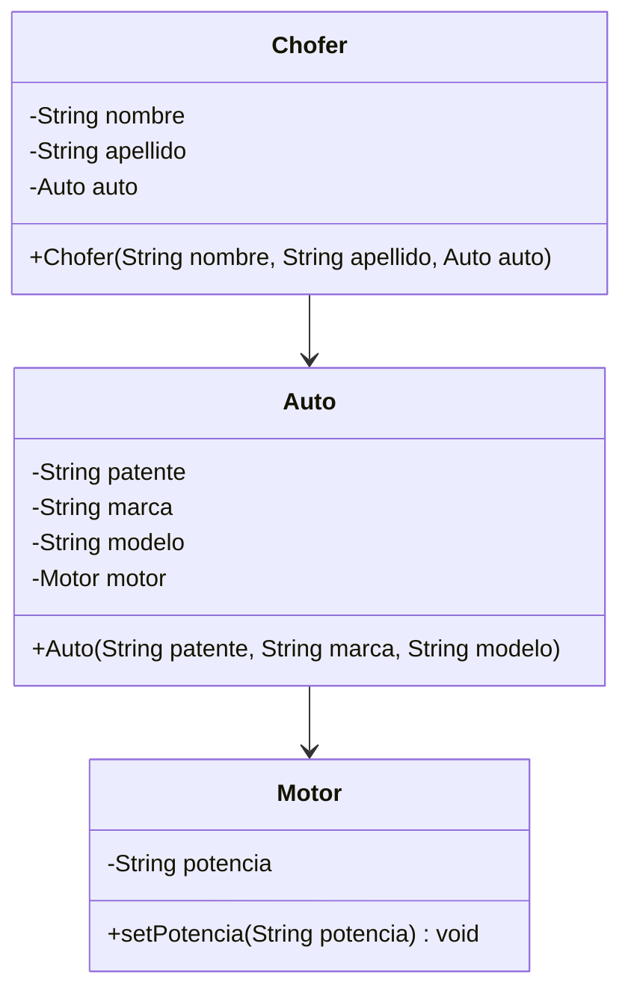

<link rel="stylesheet" type="text/css" media="all" href="../styles.css" />

# Live coding: Relaciones UML > Chofer > Auto > Motor

## UML clases asociadas: El chofer tiene asignado un auto, tenemos un auto que tiene un motor

No sale en el constructor, por lo tanto la instancia de motor tiene que ser creada en algún momento


### Auto.java

Clase Auto
```java
package com.company;

public class Auto {
    private String patente;
    private String marca;
    private String modelo;
    //Estre atributo esta definido pero no esta instanciado, entonces cuando necesite utilizarlo me dara error de null pointer
    private Motor motor;

    public Auto(String patente, String marca, String modelo) {
        this.patente = patente;
        this.marca = marca;
        this.modelo = modelo;
        //Lo instanciamos en el constructor para usarla luego, asi evito el null pointer
        motor = new Motor();
    }

    public String getPatente() {
        return patente;
    }
}

```
### Chofer.java

```java
package com.company;

public class Chofer {
    private String nombre;
    private String apellido;
    //esta instancia me permite ver los metodos de Auto
    private Auto auto;


    public Chofer(String nombre, String apellido, Auto auto) {
        this.nombre = nombre;
        this.apellido = apellido;
        this.auto = auto;
    }
    //Teniendo el metodo get en Auto podemos acceder a la responsabilidad de Auto
    //chofer puede ver patente a traves de un metodo
    //El chofer tiene un auto, y este auto que tiene es el que puede acceder a los metodos correspondientes del auto, se mantiene la responsabilidad en el auto.
    public String verPatente(){
        //uso la instancia de auto (ver arriba)
        return auto.getPatente();
    }

}
```
### Motor.java

```java
package com.company;

public class Motor {
    private String potencia;

    public void setPotencia(String potencia) {
        this.potencia = potencia;
    }
}
```

Asi las utilizamos cuando queremos crear un objeto: en el main:

### Main.java

```java
package com.company;

public class Main {

    public static void main(String[] args) {
        Chofer chofer, chofer1;
        chofer = new Chofer("Juan","Perez", new Auto("abc123","Ford","Mondeo"));
//        System.out.println("Patente auto asignado: "+chofer.verPatente());

        //Otra situacion es tener un auto creado previamente
        Auto auto = new Auto("dcb423","Fiat","Punto");
        //Cuando creo el chofer mando el auto que ya tengo creado
        chofer1 = new Chofer("Ana","Ospina", auto);
        System.out.println("Patente auto asignado: "+chofer1.verPatente());
    }
}

```

En consola:


## [⏪ Atrás](../README.md)