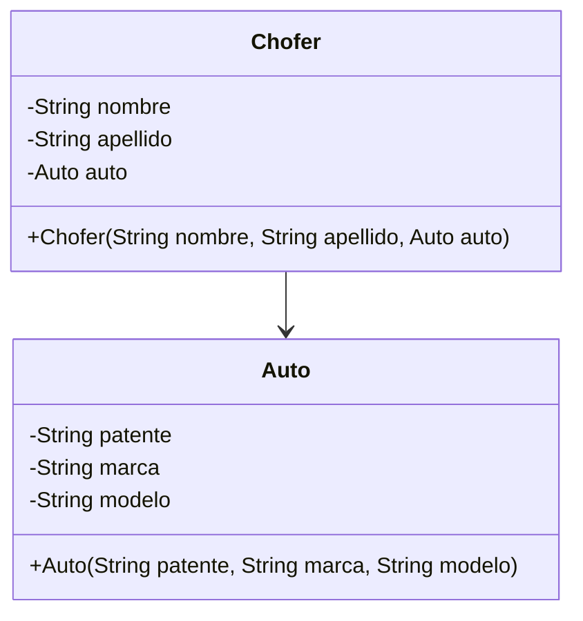

<link rel="stylesheet" type="text/css" media="all" href="../styles.css" />

# Live coding: Relaciones UML > Chofer > Auto

## UML clases asociadas: El chofer tiene asignado un auto


### Auto.java

Clase Auto
```java
package com.company;

public class Auto {
    private String patente;
    private String marca;
    private String modelo;

    public Auto(String patente, String marca, String modelo) {
        this.patente = patente;
        this.marca = marca;
        this.modelo = modelo;
    }

    public String getPatente() {
        return patente;
    }
}

```
### Chofer.java

```java
package com.company;

public class Chofer {
    private String nombre;
    private String apellido;
    //esta instancia me permite ver los metodos de Auto
    private Auto auto;


    public Chofer(String nombre, String apellido, Auto auto) {
        this.nombre = nombre;
        this.apellido = apellido;
        this.auto = auto;
    }
    //Teniendo el método get en Auto podemos acceder a la responsabilidad de Auto
    //chofer puede ver patente a traves de un método
    //El chofer tiene un auto, y este auto que tiene es el que puede acceder a los metodos correspondientes del auto, se mantiene la responsabilidad en el auto.
    public String verPatente(){
        //uso la instancia de auto (ver arriba)
        return auto.getPatente();
    }
}
```
Asi las utilizamos cuando queremos crear un objeto: en el main:

### Main.java

```java
package com.company;

public class Main {

    public static void main(String[] args) {
        //Creamos un chofer que tiene asignado el auto
        Chofer chofer;
        //Cuando lo creo pasamos por parametro nombre, apellido y auto, lo podemos crear en este momento
        chofer = new Chofer("Juan","Perez", new Auto("abc123","Ford","Mondeo"));

        //que pasa si chofer necesita información de auto. Si necesito acceder debo tener un get o un set en Auto.

        System.out.println("Patente auto asignado: "+chofer.verPatente());

    }
}
```

En consola:


## [⏪ Atrás](../README.md)