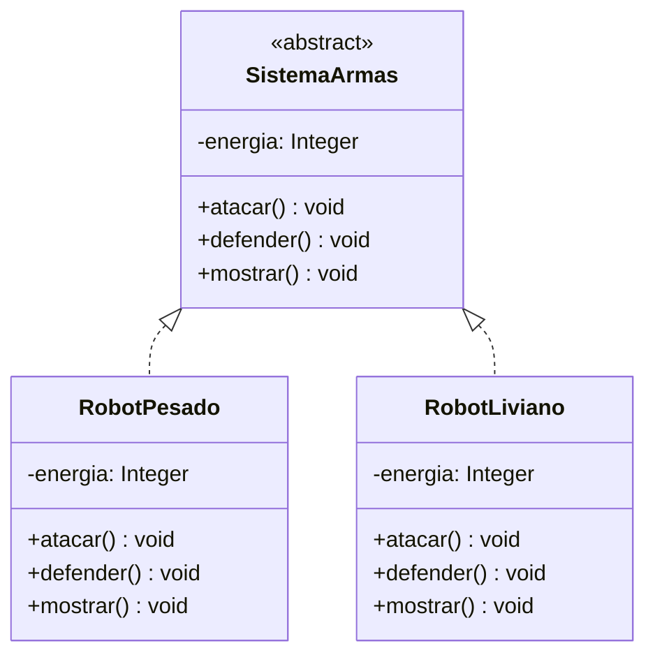
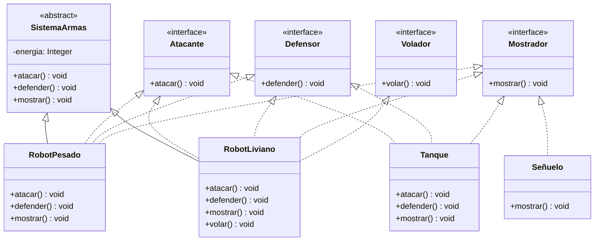

En el UML

```mermaid
classDiagram
class SistemaArmas {
<<abstract>>
-energia: Integer
+atacar() void
+defender() void
+mostrar() void
}

class RobotPesado {
-energia: Integer
+atacar() void
+defender() void
+mostrar() void
}

class RobotLiviano {
-energia: Integer
+atacar() void
+defender() void
+mostrar() void
}

SistemaArmas <|.. RobotPesado
SistemaArmas <|.. RobotLiviano
```

con interfaces

```mermaid
classDiagram
class SistemaArmas {
<<abstract>>
-energia: Integer
+atacar() void
+defender() void
+mostrar() void
}

class Atacante {
<<interface>>
+atacar() void
}

class Defensor{
<<interface>>
+defender() void
}

class Mostrador{
<<interface>>
+mostrar() void
}

class Volador{
<<interface>>
+volar() void
}

class RobotPesado {
+atacar() void
+defender() void
+mostrar() void
}

class RobotLiviano {
+atacar() void
+defender() void
+mostrar() void
+volar() void
}

class Tanque {
+atacar() void
+defender() void
+mostrar() void
}

class Señuelo {
+mostrar() void
}

SistemaArmas <|-- RobotPesado
SistemaArmas <|-- RobotLiviano

Atacante <|.. Tanque
Atacante <|.. RobotPesado
Atacante <|.. RobotLiviano
Defensor <|.. Tanque
Defensor <|.. RobotPesado
Defensor <|.. RobotLiviano
Mostrador <|.. RobotPesado
Mostrador <|.. Tanque
Mostrador <|.. Señuelo
Mostrador <|.. RobotLiviano
Volador <|.. RobotLiviano

```