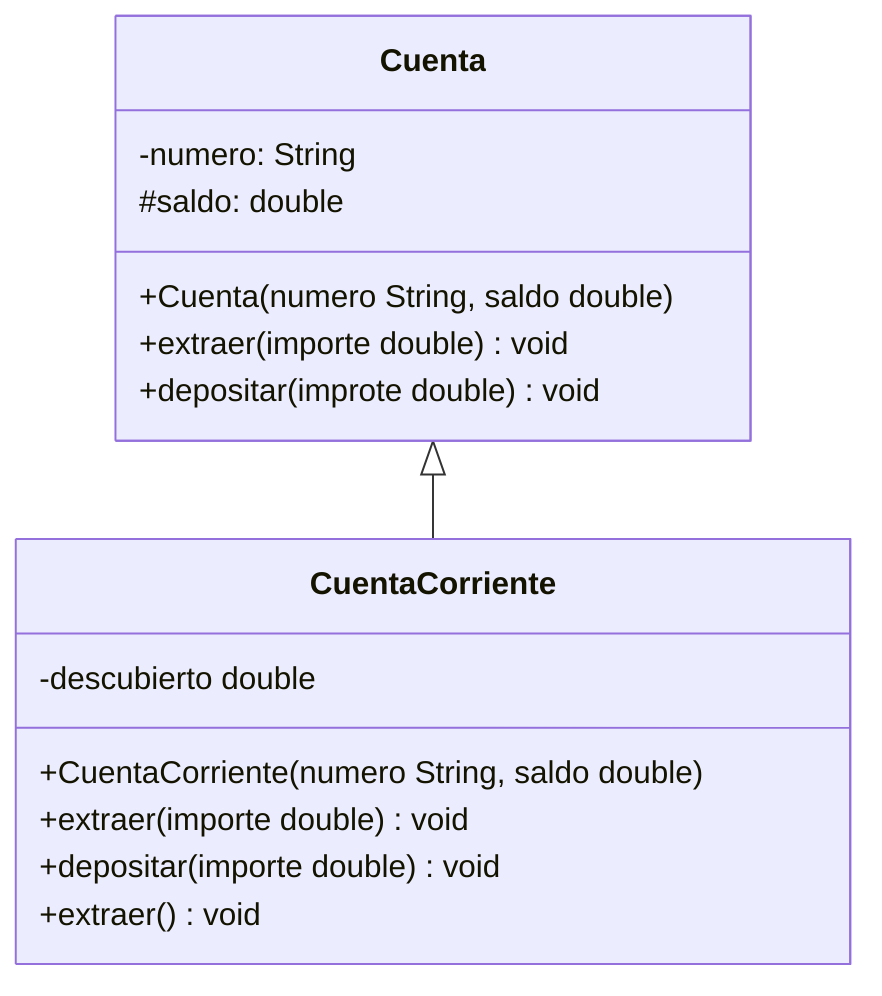

<link rel="stylesheet" type="text/css" media="all" href="../styles.css" />

# Actividad PG: Herencia (Object)

Seguimos trabajando con Cuenta y CuentaCorriente, en este caso vamos a sobrescribir los métodos heredados de Object, hashCode() y equals().

Vamos a considerar que dos cuentas son iguales si tienen el mismo número.



```java
 class Cuenta{
    private String numero;
    protected double saldo;
    
    public Cuenta(String numero, double saldo){
        this.numero=numero;
        this.saldo=saldo;
    }

    public double getSaldo(){
        return saldo;
    }
    public String getNumero(){
        return numero;
    }

    public void extraer(double importe){
        if (importe <=saldo ){
            saldo-=importe;
        }
    }
    public void depositar(double importe){
        saldo+=importe;
    }

    @Override
    public int hashCode(){
        int hash = 31;
        hash = hash * numero.hashCode();

        return hash;
    }
    
    @Override
    public boolean equals(Object o){
        if (o==null){
            return false;
        }
        if (!(o instanceof Cuenta)){
            return false;
        }    
        else{
            Cuenta cuentaAux = (Cuenta)o;
        return 
        this.getNumero().equals(cuentaAux.getNumero());
        }
    }
}
```

## [⏪ Atrás](../README.md)