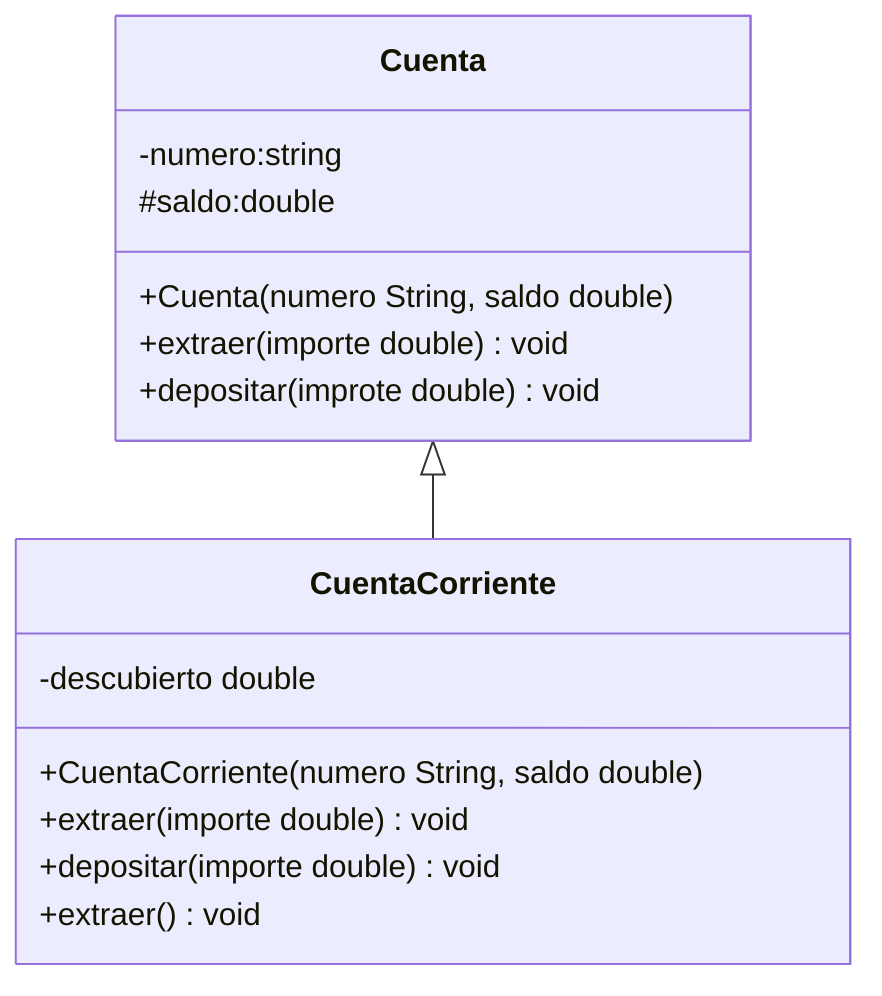

<link rel="stylesheet" type="text/css" media="all" href="../styles.css" />

# Actividad PG: @Override > Extends > descubierto


Tenemos la clase cuenta bancaria, que tiene como atributos numero y saldo, su responsabilidad es extraer o depositar. Si realizamos un deposito el saldo se ve incrementado, si realizamos una extracción solo es posible si el importe a extraer es menor o igual al saldo. Para realizar las acciones tanto de extraer como de depositar es necesario indicar el importe.

A partir de esta clase Cuenta, queremos extender en CuentaCorriente, que agrega un atributo descubierto. El descubierto lo vamos a fijar inicialmente en $1000. Descubierto es un valor que se permite extraer aunque no haya saldo, es decir, si tengo $1000  en saldo y  un descubierto de $500.

Si quiero extraer $2000 no puedo hacerlo porque supera el importe disponible (saldo+descubierto).

Si quiero extraer $1200 puedo efectuar la extracción porque no supera el importe disponible(saldo + descubierto).

Una cuenta corriente nos permite extraer como máximo el saldo +descubierto.

Además en la cuenta corriente disponemos de un método extraer al que no hay que indicarle el valor, siempre efectuará un retiro de $1000 si es posible, es decir, si hay saldo disponible.

En `UML`



En `Cuenta.java` :

```java
package com.company;

public class Cuenta {
    private String numero;
    protected double saldo;

    public Cuenta(String numero, double saldo) {
        this.numero = numero;
        this.saldo = saldo;
    }
    public void depositar(double importe){
        this.saldo += importe;
    }
    public void extraer(double importe){
        if (importe<=saldo) {
            this.saldo -= importe;
        }
    }
    public double getSaldo() {
        return saldo;
    }
    public void setSaldo(double saldo) {
        this.saldo = saldo;
    }
}

```

en `CuentaCorriente.java`

```java
package com.company;

public class CuentaCorriente extends Cuenta {
    private double descubierto;

    public CuentaCorriente(String numero, double saldo) {
        super(numero, saldo);
        this.descubierto = 1000;
    }

    @Override
    public void extraer(double importe) {
        if (this.saldo+descubierto>=importe){
            this.saldo -= importe;
        }
    }

    public void extraer(){
        if (saldo>0){
            this.saldo -= 1000;
        }
    }
}

```

## [⏪ Atrás](../README.md)