----
<t>Programación orientada a objetos</t>

---

## Índice

1. Introducción a la programación orientada a objetos

-   [C1- Que es Java](#c1)
    -   [1.1 Bienvenida](#c1a)
    -   [1.2 Primer acercamiento a Java](#c1b)
    -   [1.3 Primer programa](#c1c)
    -   [1.4 Tipos de datos](#c1d)
    -   [1.5 ¿Qué es un tipo de dato?](#c1z)
    -   [1.6 Actividad PG](#c1pg)
    -   [1.7 Sintaxis Java](#c1y)
    -   [1.8 Estructura de control if, for, while, switch](#c1e)
    -   [1.9 Clase en vivo](#c1s) 🎥
-   [C2 - Introducción a Java](#c2)
    -   [2.1 Clases > Variables > Tipos de datos](#c2a)
        -   [2.1.1 Método .equals()](#c2a1)
        -   [2.1.2 Método .comparteTo()](#c2a2)
        -   [2.1.3 Paquetes](#c2a3)
        -   [2.1.4 String](#c2a4)
        -   [2.1.5 String vacía y String nula](#c2a5)
        -   [2.1.6 Integer](#c2a6)
        -   [2.1.7 Float](#c2a7)
        -   [2.1.8 Date](#c2a8)
        -   [2.2 Ingreso de datos, Scanner](#c2b)
            -   [2.2.1 Clase System](#c2b)
            -   [2.2.2 Clase Scanner](#c2b)
                -   [2.2.2.1 Instanciación del objeto Scanner](#c2b1)
                -   [2.2.2.1 Metodos de Scanner](#c2b2)
                -   [Ejemplo paso a paso Scanner](#c2b3)
        -   [2.3 Funciones](#c2c)
            -   [2.3.1 Definir una funcion > Nombre > Parametros > Devuelto](#c2c1)
            -   [Implementación de la función](#c2c2)
            -   [Actividad PG > Calculadora > Es divisible](#c2c3)
        -   [Array](#c2d)
            -   [Ciclos en arrays](#c2d1)
-   [C3 - Repaso](#c3)
<!-- HACERNOTAS -->
-   [C4 - Objetos y UML](#c4)
    -   [Concepto de Objeto y Clases](#c4a)
        -   [Análisis de items ⭐⭐⭐](#c4a1)
        -   [Ejemplo: Caso veterinaria](#c4a2) - [Primera solución](#c4a1a)
    -   [Clases](#c4b)
        <!-- - [Atributos, responsabilidades y constructor](#c4c) -->
        -   [Diagramar clases y atributos](#c4c1)
        -   [Encapsulamiento](#c4c2)
        -   [Objetivo: Definir atributos y responsabilidades](#c4c3)
            -   [Atributos y responsabilidades](#c4c3a)
                -   [Ejemplos de un objeto con sus atributos y métodos ⭐⭐⭐](#c4c5)
        -   [Constructor de un objeto](#c4c4)
    -   [Encapsulamiento (publico / privado)](#c4d)
        -   [Detalles importantes ⭐⭐⭐](#c4d1)
    -   [Diagrama UML](#c4e)
        -   [Diagrama de clases](#c4e1)
        -   [Quiz](#c4e2)
-   [C5 - Clases](#c5)
    -   [Atributos, constructores y métodos en Java](#c5a)
        -   [Atributos](#c5a1)
        -   [Constructores](#c5a2)
        -   [Métodos](#c5a3)
        -   [Nombres en Java](#c5a4)
        -   [Crear una clase en Java](#c5a5)
        -   [Crear una clase en el IDE](#c5a6)
    -   [Proteger el Encapsulamiento](#c5b)
        -   [Métodos de acceso: setters y getters](#c5b)
        -   [Uso de setters y getters](#c5b1)
        -   [Actividad PG](#c5b2)
    -   [Instancia](#c5c)
    -   [La clase en Java ⭐⭐⭐](#c5d)
    -   [Variables y métodos de clase](#c5e)
        -   [Variable de clase](#c5e2)
        -   [Métodos de clase](#c5e3)
        -   [Ejemplos de uso: La clase Camión](#c5e4)
        -   [Actividad PG](#c5e1)
    -   [Live coding: Creación de clase y uso](#c5f)
    -   [Actividad en clase](#c5s1)
-   [C6 - Repaso](#c6)
    -   [Actividad: Clase Perro > chip > adopción](#c6a)

2. Programación orientada a objetos en Java

-   [C7 - Relaciones entre clases](#c7)
    -   [Introducción: Relaciones entre clases](#c7a)
    -   [Representacion en UML de relaciones](#c7b)
        -   [Navegación](#c7b1)
        -   [Multiplicidad o cardinalidad](#c7b2)
        -   [Ejemplos](#c7b3)
    -   [Tipos de relaciones](#c7c)
        -   [Relación de asociación](#c7c1)
        -   [Relación de uso / dependencia](#c7c2)
        -   [Relación de Agregación](#c7c3)
        <!-- HACER ejercitarían-->
        -   [Relación de Composicion](#c7c4)
        <!-- HACER ejercitarían -->
    -   [Implementación en Java](#c7d)
        -   [Actividad PG](#c7d2)
-   [C8 - Herencia](#c8)
    -   [Proceso de abstracción](#c8a)
    -   [Relación de Herencia](#c8b)
    -   [Relación de herencia en UML](#c8c)
    -   [Herencia múltiple](#c8d)
    -   [Generalización y especialización](#c8e)
        <!-- HACER -->
    -   [Encapsulamiento y la herencia](#c8f)
    -   [Modificador de visibilidad `(#)`](#c8g)
    -   [Firma de un método](#c8h)
    -   [Sobrecarga de métodos](#c8i)
    -   [Sobreescritura de métodos](#c8j)
-   [C9 - Repaso](#c9)
<!-- HACER -->
-   [C10 - Herencia en Java](#c10)
    -   [Actividad PG: Herencia](#c10a)
    -   [Sobrecarga en Java](#c10b)
    -   [Sobreescritura en Java](#c10c)
    -   [Anotación @Override](#c10h)
    -   [Actividad: PG > @Override > Extends > descubierto](#c10d)
    -   [La clase Object: Metodos .toString(), .hashCode(), .equals()](#c10e)
    -   [Operador instanceof > Método .getClass > Casting](#c10f)
    -   [Actividad: PG > Herencia (Object) > hashCode() > equals() > instanceof > @Override](#c10g)
        <!-- CONTINUAR -->
        <!-- HACER -->
-   [C11 - Clases abstractas](#c11)
    -   [Clase abstracta en UML](#c11a)
    -   [Clase abstracta en Java](#c11b)
    -   [Metodos abstractos](#c11c)
    -   [Los metodos abstractos en UML](#c11d)
    -   [Métodos abstractos en Java](#c11e)
    -   [Sobreescribir metodos abstractos](#c11f)
    -   [Atributos y métodos en clases abstractas](#c11g)
    -   [Binding (Vinculación)](#c11h)
    - [Polimorfismo](#c11i)
    - [Casting](#c11j)
    - [Diferencias entre clases abstractas y clases concretas](#c11k)
    - [Live coding: Clases abstractas](#c11l)
    - [Quiz: Clases abstractas](#c11m)
- [C12 - Repaso](#c12)
- [C13 - Interface](#c13)
    - [Polimorfismo en Interfaces](#c13a)
    - [Interface e Implements](#c13b)
    - [Interface Comparable ](#c13c)
    - [Método CompareTo()](#c13d)
    - [Live coding - Interface](#c13e)

# C1 - Que es Java <a id='c1'></a>

## ¡Les damos la bienvenida a la materia Programación Orientada a Objetos! <a id='c1a'></a>

Durante la cursada de esta materia vas a adquirir las bases y desarrollar la capacidad de modelar y programar desde la perspectiva del paradigma orientado a objetos. También te va a permitir comprender y analizar los diferentes desafíos que enfrentan los actuales equipos de trabajo al momento de desarrollar.

Los conceptos se aplicarán en el lenguaje de programación Java, uno de los más utilizados para desarrollos en empresas IT hoy en día y el conocimiento de patrones de diseño que resultan fundamentales al momento de diseñar un software.

## Primer acercamiento a Java <a id='c1b'></a>

> ver video: Que es Java
>
> Ver PDF: Instalación IntelliJ Idea y JDK.docx.pdf

### Primer programa <a id='c1c'></a>

> Ver video: Método main.mp4
>
> Ver PDF: Primer programa en Java.pdf

<!-- Resumen pdf-->

en Java el nombre de la clase y el nombre del archivo
deben coincidir —incluso en mayúsculas y minúsculas—.

Esta funcion indica el comienzo del programa

```java
public static void Main(String args[])
```

la forma de mostrar algo por consola,

```java
System.out.println("Mi primer ejemplo ");
```

Con esta instrucción también podemos concatenar un texto literal y una variable.
Por ejemplo:

```java
int num=10;

System.out.println("El valor es " + num);
```

<!-- fin resumen -->

## Tipos de datos <a id='c1d'></a>

### Sintaxis en Java

Vamos a ver cómo se utilizan en Java algunas herramientas que ya conocemos. En algunos conceptos la sintaxis es similar a JavaScript, pero tiene algunas variaciones. Una de las cosas que es bastante diferente es el tratamiento de variables. Vamos a verlo a continuación

> ver PDF: ¿Qué es un tipo de dato.pdf

<!-- Resumen pdf -->

### ¿Qué es un tipo de dato? <a id='c1z'></a>

#### Un lenguaje tipado

Decimos que el lenguaje de programación Java es un lenguaje fuertemente tipado.
Pero esto, ¿qué quiere decir? <r>Un lenguaje tipado es el que me exige una declaración explícita de la variable antes de comenzar a usarla.</r>

### Declaración de una variable

Entonces, para declarar una variable, es necesario indicar el tipo de dato y nombre que se le asigna. Recordar que Java es un lenguaje case sensitive, los tipos de datos siempre se escriben en minúscula. Para los tipos comunes vamos a ver una excepción: el tipo String que siempre lo inicializamos con mayúscula, como en el ejemplo a continuación.

```java
int valor;
double coeficiente;
String nombre;
```

#### Uso de las variables

<r>Una vez declarada la variable, sólo podrá utilizarse con datos del tipo indicado</r>, es decir, una variable de tipo int no podrá almacenar un valor de tipo double, una variable de tipo String no podrá almacenar un valor numérico que se utilice para hacer operaciones aritméticas

### Operaciones aritméticas

Respecto a las operaciones aritméticas, debemos tomar en cuenta que <r>si se opera entre dos variables de tipo entero, el resultado es siempre un valor de tipo entero.</r>
Esto pasa con todos los tipos de datos, es decir, <r>una operación solo puede realizarse con variables del mismo tipo y el resultado mantiene el tipo de dato.</r>
Pero hay una operación en la que podríamos querer cambiar el tipo de dato y que el resultado se diera en otro.

Veamos varias situaciones

<!-- Ver pdf situaciones con enteros y floats -->

> Ver video: Declaración de variables.mp4

### Actividad PG <a id='c1pg'></a>

#### Ejercicio 1

Es hora de que crees tus primeras variables en java
La idea es que crees tres variables una que se va a llamar numeroEntero y va a ser de tipo int una que se va a llamar numeroConComa de tipo double y por último una llamada nombre de tipo string

Luego de declararlas asignarles un valor acorde a su tipo

```java
package com.company;

public class Main {

    public static void main(String[] args) {
        int numeroEntero = 10;
        double numeroConComa = 3.5;
        String nombre = "Indira";
    }
}
```

Como en muchos otros lenguajes de programación, en Java podemos realizar diversas operaciones. Vamos a necesitar realizarlas para poder resolver problemáticas con nuestros futuros programas. A continuación, nos encontramos con ejercicios de operaciones y una Java cheat sheet muy útil con los principales operadores que podemos utilizar en este lenguaje.

#### Ejercicio 2

Ahora ya te damos dos variables creadas, numeroEntero y numeroConComa;
El objetivo del ejercicio es que le asignes un valor acorde a su tipo a cada variable, el valor puede ser cualquiera mientras que respetes el tipo de dato
Luego vas a declarar la variable suma de tipo double, sumar ambos valores y asignárselos a suma

```java
package com.company;

public class Main {

    public static void main(String[] args) {

        int numeroEntero = 10;
        double numeroConComa = 3.4;
        double suma;
        suma = (double)numeroEntero + numeroConComa;
    }
}
```

## Sintaxis Java <a id='c1y'></a>

> Ver PDF: Sintaxis Java

| Matematicos              |                                              |
| ------------------------ | -------------------------------------------- |
| Suma                     | +                                            |
| Resta                    | -                                            |
| División                 | /                                            |
| Multiplicación           | \*                                           |
| Módulo                   | % (devuelve el resto de una división entera) |
| Operador unario sumar 1  | ++                                           |
| Operador unario restar 1 | --                                           |

| Operadores lógicos |                                                                             |
| ------------------ | --------------------------------------------------------------------------- |
| Y                  | && (devuelve verdadero si las dos evaluaciones son verdaderas)              |
| O                  | 2palitos (devuelve verdadero si una de las dos evaluaciones son verdaderas) |
| No                 | ! (devuelve lo opuesto al resultado de la evaluación)                       |

| Operadores relacionales |                |
| ----------------------- | -------------- |
| Mayor                   | >              |
| Menor                   | <              |
| Igual                   | == o .equals() |
| Mayor o igual           | >=             |
| Menor o igual           | <=             |
| No igual                | !=             |

| Tipos de datos primitivos |                                                                                |
| ------------------------- | ------------------------------------------------------------------------------ |
| byte                      | Números enteros entre -128 y 127                                               |
| short                     | Números enteros entre -32768, 32767                                            |
| int                       | Números enteros entre -2147483648 y 2147483647                                 |
| long                      | Enteros muy grandes, entre -9223372036854775808 y 9223372036854775807          |
| float                     | Número con coma -3.402823e38 a 3.402823e38                                     |
| double                    | Número con coma, mayor capacidad -1.79769313486232e308 a -1.79769313486232e308 |
| string                    | Cadena de caracteres                                                           |
| char                      | Un carácter (Ej: ‘a’) Unicode                                                  |
| boolean                   | Verdadero o falso (true /false)                                                |

## Estructura de control en Java <a id='c1e'></a>

Las estructuras de control en Java tienen la misma sintaxis que en JavaScript.

Contamos con:

✅ Decisión if - switch

✅ Repetición while - for

A continuación recordemos brevemente cómo es su sintaxis.

### Estructura de decision:

```java
if (condición){
//código que se corre si la condición es verdadera
} else if(condición){
//código que se corre si la primera condición no fue verdadera y la segunda sí es verdadera
}else {
// código que se corre si ninguna condición anterior fue verdadera
}
```

```java
switch (variable){
case valor1:
//código que se ejecuta si la variable tiene valor1
break;
case valor2:
//código que se ejecuta si la variable
tiene valor2
break;
.
.
default:
//código que se ejecuta si la variable tiene algún valor no enumerado
}
```

### Estructuras de repetición:

```java
for(Integer i = 0; i < valorMáximo; i++){
//código que se ejecuta cada vez
}
```

```java
for(Object object : listaDeObjetos){
//código que se va a ejecutar por cada objeto en la lista
}
```

```java
while(condición){
//hacer este código
}
```

> Ver video: Ciclo for
>
> Ver PDF: Ejercitación estructuras.pdf

### Ejercitación estructuras <a id='c1act'></a>

#### Ejercicio 1

Definir dos números enteros. Asignarles un valor a cada uno. Comprobar si un número es
divisible por el segundo e indicar mediante un mensaje el resultado obtenido.
NOTA: Que sea divisible quiere decir que al dividir da un valor exacto, es decir, sin
decimales.

```java
package Sincro;

public class C1ejercitaciónEstructuras {
    public static void main(String[] args) {
        int num1 = 10;
        int num2 = 5;

        if (num1%num2 == 0){
            System.out.println("El numero "+num1+" es divisible por "+num2);
        } else {
            System.out.println("Los números no son divisibles");
        }
    }
}

// Muestra en consola: El numero 10 es divisible por 5
```

> Ver PDF: Definiendo mascotas / Ejercitación tipo variables.pdf <a id='c1s'></a>

<!-- inicio actividad -->

#### Solución actividad sincrónica

```java
public class c1_actividad_mascotas {
    public static void main(String[] args) {
        // Manchita
        String nombrePerro = "Manchitas";
        Integer edadPerro = 2;
        Double comidaPerro = 1.5;
        String sonidoPerro = "Guau guau guau";
        System.out.println("El perro se llama "+nombrePerro+" tiene "+edadPerro+" años, come "+comidaPerro+" kilos de comida. Y me dice "+sonidoPerro);

        //Nemo
        String nombrePez = "Nemo";
        Integer edadPez = 1;
        Double comidaPez = 0.3;
        String sonidoPez = "Glup glup";
        System.out.println("El pez se llama "+nombrePez+" tiene "+edadPez+" años, come "+comidaPez+" kilos de comida. Y me dice "+sonidoPez);

    }
}
```

<!-- fin actividad sincrónica -->

# C2 - Introducción a Java <a id='c2'></a>

El núcleo de Java son **las clases**, más adelante veremos que son y cómo construirlas.
Pero para comenzar a trabajar debemos comenzar a utilizar las clases propias de Java.

## Variables

En Java encontramos como herramienta para el desarrollo <r>los tipos primitivos, llamamos así a los tipos de datos que solo nos permiten almacenar un valor.</r>
**Por ejemplo:** `int`, `float`, `double` y `char`.
Cuando definimos una variable con estos tipos primitivos, solo podemos almacenar valores.

## Clases

En este caso tendremos un elemento que:

✅ Almacena un valor,

✅ Nos permite realizar ciertas operaciones que ya vienen programadas, a estas operaciones las llamamos métodos.

### Por ejemplo:

`String` es una clase, por eso, se la inicializa en mayúscula.
**Todas las clases las nombramos con la inicial en mayúscula**, si definimos:

```java
String nombre;
```

Al utilizar nombre, veremos que nos ofrece los métodos disponibles


Estas son funciones que ya vienen resueltas y solo podemos utilizarlas con la clase a la cual le pertenece, es decir, <r>**cada clase en Java tiene sus propios métodos**</r>.

Para comenzar a conocer cómo funcionan las clases propias del lenguaje, vamos a nombrar 3 clases que nos resultan útiles —y de hecho String ya la utilizamos en nuestra primera clase—:

✅ String

✅ Integer

✅ Float

> ## 💡
>
> Notemos que todas comienzan con la inicial en mayúscula.

### Método .equals() <a id='c2a1'></a>

Algo a tener en cuenta <r>cuando usamos estas clases es que no podemos usar operadores como `“==”`</r>, para efectuar una comparación por igual usamos `.equals()`.

Por ejemplo:

```java
nombre.equals(“Juan”)
```

Esto nos devuelve `true` en el caso que en nombre se guarde la cadena “Juan” y falso en caso contrario.

El **`equals()`** se utiliza para comparar por igual, siempre que estemos trabajando con clases.

### Método .compareTo() <a id='c2a2'></a>

Si queremos comparar si un valor es mayor o menor que otro debemos usar `.compareTo()`

Otra cosa a destacar es que una `String` a la cual no le asignamos nada tiene el valor `null`.

> ## 💡
>
> Esto sucede con todas las clases, si definimos un elemento (objeto) de una clase inicialmente tendrá el valor `null`.

## Paquetes <a id='c2a3'></a>

Para organizar las clases, existen los paquetes, estos son contenedores donde se pueden agrupar las clases. Más adelante los utilizaremos para nuestras clases, pero por ahora debemos saber que <r>también las clases de Java se encuentran agrupadas en paquetes</r>, o como su nombre en inglés: _package_.

## Tipos de dato:

### String <a id='c2a4'></a>

Para utilizar datos de tipo texto, vamos a declararlos como `String`. Las Strings nos permiten utilizar funciones ya programadas, que le pertenecen. Las llamamos métodos.

```java
public static void main(String[] args){
    String nombre;
}
```

A partir de esta variable vamos a ver cómo utilizar algunos de estos métodos de uso frecuente.

Métodos usados:

```java
.length() //calcula longitud del string
.toUpperCase() //convierte a mayúscula
.equals() //comprueba
.toChar() //obtiene caracteres, en el () indicamos la ubicación
```

#### 📜 Ejemplo! <a id='c2a4a'></a>

```java
String nombre= "Juan";
int cantidad;
char inicial;

cantidad = nombre.length();

nombre.toUpperCase();

if(nombre.equals("JUAN")){
    System.out.println("Se pasó a mayúscula");
}
inicial = nombre.charAt();
```

## String vacía

Si aún no hemos asignado nada a las String, entonces, contiene un valor `null`, <r>en ese caso no se pueden usar los métodos.</r>

```java
String nombre;

if(nombre==null){
    System.out.println("Cadena con valor nulo");
}
```

## String vacía y String nula <a id='c2a5'></a>

En una String podemos tener las dos situaciones:
Puede tener un valor nulo o estar vacía.

|                    |                                                                                            |
| ------------------ | ------------------------------------------------------------------------------------------ |
| `String nombre;`   | Cadena que aún no se ha inicializado, esta en null. Aun no puedo utilizar métodos propios. |
| `nombre = "";`     | Cadena vacía.                                                                              |
| `nombre = "Juan";` | Cadena inicializada con el valor "Juan".                                                   |

## Integer <a id='c2a6'></a>

Integer como clase y no como tipo primitivo se utiliza de una forma distinta.

Para comenzar a utilizar un Integer tenemos dos posibilidades:

1. En este caso definimos y creamos un Integer, dándole un valor inicial 0

```java
Integer valor = 0;
```

2. En la segunda forma hacemos algo similar, pero la parte de la izquierda es la definición y la parte de la derecha la creación con un valor inicial 1.

```java
Integer num = new Integer(1);
```

> Cuando solo definimos algo de tipo Integer, su valor inicial es null, es necesario darle un valor inicial.

### 📜 Ejemplo!

Comprobamos la relación entre dos números enteros, utilizando clases

Métodos usados:

✅ `.equal()`

✅ `.compareTo()`

```java
Integer valor1 = 10;
Integer valor2 = 30;
int comparar;

if (valor1.equals(valor2)){ //comprobamos si son iguales
    System.out.println("Son iguales");
}
else {
    comparar = valor1.compareTo(valor2); //Compara la relación entre dos valores, si valor 1 es mayor, dará 1, si valor2 es mayor, dará -1
    if (comparar>0){
        System.out.println("valor1 es mayor que valor2");
    }
    else {
        System.out.println("valor2 es mayor que valor1");
    }
}
```

## Float <a id='c2a7'></a>

Float como clase y no como tipo primitivo se utiliza de una forma distinta.
Para comenzar a utilizar un Float tenemos dos posibilidades:

1. En este caso definimos y creamos un Float, dándole un valor inicial `2.5f`, la f quiere decir `float`, si no lo ponemos se asume que es algo de tipo `Double`.

```java
Float coeficiente=2.5f;
```

2. En la segunda forma hacemos algo similar, pero la parte de la izquierda es la definición y la parte de la derecha la creación con un valor inicial 0.5.

```java
Float num = new Float(0.5);
```

Al igual que `Integer`, si no tiene un valor inicial, está en `null`

Cuando solo definimos algo de tipo `Float`, su valor inicial es `null`, siempre es necesario darle un valor inicial.

> ## 💡
>
> Las clases `Integer` y `Float` son equivalentes a los tipos de datos primitivos, es decir, me <r>permiten almacenar valores de los tipos indicados, pero además me dan ciertas funcionalidades.</r> > **Se suele decir que envuelven los tipos primitivos**.
> Ver pdf: String, Integer, Float y Clases String, Integer, Float.pdf

## Date <a id='c2a8'></a>

La clase **Date** permite trabajar con fechas. A diferencia de las clases que vimos hasta ahora, <r>si definimos un objeto de tipo **Date**, no es posible hacerlo vacío</r>. Un objeto Date se crea con un valor inicial que es el de la fecha actual.

```java
import java.util.Date;

public class Main {
    public static void main(String[] args) {
        Date fecha = new Date();
        System.out.println(fecha.toString()); //Muestra la fecha actual
    }
}
```

> Para usar Date es necesario agregar `import java.util.Date;`

Para crear un Date con otro valor, lo hacemos de la siguiente manera:

```java
public static void main(String[] args) {
    Date fecha = new Date(120,11,5);
    System.out.println(fecha.toString());
    //Muestra 5/12/2020
}
```

Los parámetros que usamos son año, mes, día, teniendo en cuenta:
al valor que colocamos para año le suma 1900:

```
1900 + 120 = 2020
```

los meses los enumera desde cero o sea 11 es en realidad 12 (diciembre)De esta forma obtenemos la fecha que necesitamos

> Ver pdf: Ejercitación - Integer,String.pdf

<!-- HACER ejercitación-->

<!--FIN hacer ejercitación -->

### Ingreso de datos, Scanner <a id='c2b'></a>

Muchos elementos de Java son clases, vimos anteriormente String, Integer y Float.
Para realizar la entrada y salida de datos también utilizamos clases propias de Java.

## Clase System

Una clase muy importante es `System`, en ella encontramos `System.in` y `System.out`, que nos permitirán <r>interactuar con las entradas y salidas del programa. </r>

Ya vimos que `Sistem.out.println` nos permite mostrar un dato o mensaje.
Para ingresar valores vamos a utilizar `System.in`.

Las entradas se realizan mediante esta clase, es decir, <r>la información ingresa a través de `System.in`, pero para gestionarla y asignarla a las variables utilizaremos los métodos que nos provee `Scanner`</r>.

Veamos de qué se trata.

[Link: Ingreso de datos con Scanner](https://view.genial.ly/60abec1fea8a290d34b9fe66)

## Clase Scanner

Es una clase propia de Java, que nos permite ingresar valores. Tiene métodos, funciones ya programadas, que nos permiten ingresar distintos tipos de datos.

### ¿Cómo lo creamos?

Cuando definimos nuestro elemento de tipo Scanner, nos aparece esta indicación. Esto significa que para poder utilizarlo debemos agregar la clase correspondiente, que se encuentra en `java.util`

```java
public static void Main(String[] args) {
    //write your code here
    Scanner
}
```

**Definición**

Cuando aceptamos la sugerencia, nos agrega el `import`, finalizamos la definición dándole un nombre como lo haríamos con cualquier variable.

```java
import java.util.Scanner;

public class Main {
    public static void main(String[] args) {
        //Write your code
        Scanner lector;
    }
}
```

### Creación / Instanciación del objeto Scanner <a id='c2b1'></a>

Luego de definirlo, es necesario crear el objeto o distanciarlo.

```java
Scanner lector; //Definición del objeto lector
lector = new Scanner(System.in); //creación o instanciación del objeto
```

Lo creamos asociado a System.in, es decir, todo ingreso de datos será interceptado por el Scanner.

### Métodos de Scanner <a id='c2b2'></a>

```java
.nextByte() //para leer un dato de tipo byte.
.nextShort() //para leer un dato de tipo short.
.nextInt() //para leer un dato de tipo int.
.nextLong() //para leer un dato de tipo long.
.nextFloat() //para leer un dato de tipo float.
.nextDouble() //para leer un dato de tipo double.
.nextBoolean() //para leer un dato de tipo boolean.
.nextLine() //para leer un string hasta encontrar un salto de línea.
.next() //para leer un string hasta el primer delimitador, generalmente hasta un espacio en blanco o hasta un salto de línea.
```

> Ver PDF: Ejemplos Scanner.pdf

<!-- inicio resumen pdf -->

### Ejemplo paso a paso Scanner <a id='c2b3'></a>

#### Definición de Scanner

Definimos el Scanner, para luego ingresar los valores en las variable definidas

```java
//Definimos un objeto Scanner, en este caso lo llamamos scanner
Scanner scanner;
//Creamos el scanner a partir del System.in
scanner = new Scanner(System.in);

//Definición de variables para los datos, que necesitamos ingresar
int num1;
int num2;
float coeficiente;
String nombre;
char inicial;
```

#### Ingresar valores numéricos

Ingresamos los datos numéricos. Para lograr una interacción más amigable con el usuario, indicar qué se espera

```java
int num1;
int num2;
float coeficiente;

* //Ingreso de datos de tipo int, se utiliza el método .nextInt()
System.out.println(“Ingrese primer valor”);
num1 = scanner.nextInt();
System.out.println(“Ingrese segundo valor”);
num2 = scanner.nextInt();

//Ingreso de datos de tipo float, se utiliza el método .nextFloat()
System.out.println(“Ingrese el coeficiente”);
coeficiente= scanner.nextFloat();
```

### Ingresar texto

Ingresamos un texto, en este caso un nombre y luego se obtiene la inicial. No hay un método para ingreso de caracteres

```java
String nombre;
char inicial;

System.out.println(“Ingrese su nombre”);
//Ingreso de datos tipo String, se utiliza el método .nextLine()
nombre = scanner.nextLine();
//a partir de la String ingresada en nombre, mediante el método .charAt(0) se obtiene el primer carácter, el parámetro 0 indica que carácter se desea obtener
inicial = nombre.charAt(0)
```

<!-- fin resumen pdf -->

> Ver video: Scanner
>
> Ver PDF: Ejercitación - Scanner.pdf

<!-- HACER pdf -->

<!-- FIN pdf -->

## Funciones <a id='c2c'></a>

> Ver PDF: Funciones

<!-- inicio resumen pdf -->

Las funciones en Java son similares a las vistas en JavaScript, pero hay algunas cosas a tener en cuenta por ser un lenguaje tipado, vamos a tener que definir más cosas.

### Definir una funcion <a id='c2c1'></a>

Para definirla vamos a considerar 3 cosas:

✅ Qué devuelve la función

✅ Qué nombre tiene

✅ Los parámetros que necesitamos

Cuando decimos qué devuelve nos referimos al tipo de dato que devuelve la función.

Entonces la definición sería en forma general algo de este estilo.

```
Tipo devuelto nombre (parametros)
```

#### Nombre

El nombre debe ser lo más descriptivo posible, no importa si necesitamos unir dos o más palabras, por ejemplo para nombres descriptivos pueden ser:
calcularTotal, asignarTurno, buscarNumeroMasRepetido, suma

#### Parámetros

No hay muchas diferencias en cuanto a los parámetros, solo que es necesario indicar el tipo de cada uno, entonces para que una función reciba valores lo indicaremos de la siguiente manera.

```
(int num1, int num2)
```

```
(double importe, String descripcion)
```

```
(int cantidad, int posición, String nombre)
```

#### Tipo devuelto

Hasta ahora, las diferencias no fueron tantas, tal vez, esta es la mayor diferencia con la forma en la que aprendimos en JavaScript.
<r>Las funciones pueden devolver un valor de retorno de algún tipo determinado</r>, por ejemplo `int, double, Integer, String`, etc. En realidad pueden devolver cualquier cosa no solo valores, también estructuras enteras, lo veremos más adelante, pero hay que indicar que tipo tiene lo que devolvemos.

Veamos algunos ejemplos

```java
int suma(int num1, int num2)
//devuelve un entero
```

```java
double calcularTotal(double importe, int cantidad)
//Devuelve un Double
```

De esta forma tendremos definida una función con un valor de retorno.

Pero hay otro tipo de funciones, las que no devuelven nada en ese caso en donde
indicamos el tipo devuelto colocaremos la palabra reservada **`void`**.

Veamos un ejemplo.

```java
void mostrarMensaje(String mensaje)
//Cuando no queremos que devuelva nada
```

<r>Usamos las funciones de tipo `void`, cuando queremos que nuestra función sólo realice una serie de pasos o acciones y no nos devuelva nada</r>.

### Implementación de la función <a id='c2c2'></a>

Hasta ahora vimos cómo definir una función, ahora veamos que varía en la
implementación, vamos a tener dos situaciones.

#### 1. Que la función tenga valor de retorno

En el primer caso, debemos incluir un `return` con el valor devuelto, el tipo de este valor tiene que coincidir con el tipo de dato indicado como tipo devuelto.

```java
int suma(int num1, num2){
    return num1,num2;
}
```

> ## 💡
>
> ¡El valor retornado tiene que ser del tipo indicado!

#### 2. Que no devuelve nada.

En caso de tener una función no tenga tipo de retorno, nos quedaría así:

```java
void mostrarMensaje(String mensaje){
    System.out.println(mensaje);
}
```

<!-- fin resumen pdf -->

> Ver PDF: Ejercitación - funciones.pdf

<!-- HACER -->
<!-- FIN -->

### Ejercicios PG <a id='c2c3'></a>

#### Ej. Calculadora

Vamos a crear nuestras primeras funciones
Tenemos la clase Calculadora que por ahora solo va trabajar con nuestro tipo primitivo int
Tenemos que crearle cuatro funciones a nuestra calculadora sumar, restar, dividir y multiplicar

**Solución:**

```java
public class c2_calculadora_pg {
    public int sumar(int a, int b) {
        int num1 = a;
        int num2 = b;
        return num1 + num2;
    }
    public int restar(int a, int b) {
        int num1 = a;
        int num2 = b;
        return num1 - num2;
    }
    public int multiplicar(int a, int b) {
        int num1 = a;
        int num2 = b;
        return num1 * num2;
    }
    public int dividir(int a, int b) {
        int num1 = a;
        int num2 = b;
        return num1 / num2;
    }
}
```

#### Ej. Es Divisible

Hacer una función que reciba como parámetro dos valores y devuelva un boolean. La función debe comprobar si el primer número es divisible por el segundo.
NOTA: Que sea divisible quiere decir que al dividir da un valor exacto, es decir, sin decimales.

**Solución:**

```java
public class c2_esDivisible {
    public boolean esDivisible(int numero1,int numero2) {
        int num1 = numero1;
        int num2 = numero2;

        if (num1 % num2 == 0) {
            return true;
        } else {
            return false;
        }
    }
}
```

## Array <a id='c2d'></a>

> Ver PDF: Array, diferencia con colecciones.pdf

<!-- Inicio resumen pdf -->

Los arrays son <r>estructuras de datos estáticas</r> que permiten guardar elementos del mismo tipo en forma contigua; objetos

Permiten el acceso a sus elementos de forma aleatoria a través de un índice que comienza desde 0 (cero)

> ## 💡
>
> La colección ArrayList tiene este mismo comportamiento y, por ello, su nombre, la colecciones son de longitud dinamica


En Java, <r>un array es un objeto</r> y, como tal, debe usarse el operador `new` **para crear una instancia**, pero a diferencia de las colecciones, <r>los array son de longitud fija</r>, la cual debe definirse en la creación, siendo inmutable.


Establecemos valores a un array a través de su índice.
Dado que es una estructura fija, no se pueden eliminar elementos.

```java
nombres[0] = "Juan";
nombres[1] = "Mario";
nombres[3] = "Marcelo";
```


> ### ❌
>
> Intentar acceder a un índice fuera de rango como por ejemplo `nombres[10]` provoca una excepción. (Error)

### Ciclos en array <a id='c2d1'></a>

Podemos recorrer un array a través de un ciclo `for, while o for each` y también utilizar la propiedad `length` que nos indica el tamaño del array

```java
for(int i = 0; i < nombres.length; i++)
    System.out.println(nombres[i]);
```

```java
int i = 0;
while(i < nombres.length) {
    System.out.println(nombres[i]);
    i++;
}
```

```java
for(String nombre : nombres)
    System.out.println(nombre);
```

<!-- fin resumen pdf -->

> #### 🎬
> Video: Clase 2 vivo

# C3 - Repaso <a id='c3'></a>

> Ver PDF: Ejercicio 3
>
> Ver PDF: Ejercicio talleres

# C4 - Objetos y UML <a id='c4'></a>

## Concepto de Objeto y Clases <a id='c4a'></a>

Estamos iniciando nuestro aprendizaje de la llamada Programación Orientada a Objetos, que nos va a permitir resolver situaciones problemáticas con un enfoque diferente al de otros paradigmas.
Ahora es como si utilizamos los “anteojos de objetos” para ver nuestro mundo y abstraer la realidad en un programa de puros objetos.

Ahora ya que estamos hablando sobre esto, veamos un video sobre Objetos

> ver video: Concepto de objetos

**Resumen video:**

Un objeto: Es algo que tiene:

✅ Características (o atributos) y

✅ Responsabilidades (dependen del contexto)

Siempre que pensemos en los objetos que van a componer nuestro sistema; <r>tenemos que analizarlos según el contexto en el cual estamos trabajando</r>.

### Ejemplo silla

-   Características:

    -   Es de color blanco
    -   Es de plástico
    -   Tiene respaldo

-   Responsabilidades:
    -   Sostenerme al sentarme en ella
        dependiendo del contexto tendria otras como:
    -   golpear un zombie

#### Responsabilidades usuario facebook

-   puede comentar
-   puede postear
-   puede likear

#### Responsabilidades usuario uber

-   Pedir un auto
-   calificar un conductor

> Ver PDF: Analizando un caso.pdf

## Analisis de un caso

Analizar un caso requiere de tomarse un tiempo para :

✅ Comprender el contexto

✅ Tomar nota de los detalles más relevantes

✅ Considerar sus soluciones.

Hay soluciones que pueden amoldarse más a ser eficientes que eficaces.

En este análisis, nos vamos a acotar a lo que les iremos proponiendo mediante distintas consignas.

### Analisis de items <a id='c4a1'></a>

Dentro del análisis de los detalles, es bueno lograr diferenciar ciertos ítems:

1. Cosas que realizan acciones (personas, entidades, máquinas, etc)
2. Características (sustantivo)
3. Acciones (verbos)
4. Detalles o requerimientos especiales

### Ejemplo: Caso veterinaria <a id='c4a2'></a>

Analizando el texto donde María detalla cómo sería el proceso de un cliente en la veterinaria podemos **resaltar** las palabras que nos ayudarán luego para sintetizar los requerimientos del sistema.

_“Son las 11 a.m. y entra a la veterinaria por primera vez Juana con su mascota Picha. Las registramos a ambas, anoto el nombre y apellido del cliente y también qué mascota tiene. De la mascota voy a anotar la raza. Juana había pedido previamente un turno con uno de los veterinarios. Juana deja a la perra en la veterinaria para que sea atendida. El veterinario atiende a Picha, le realiza un diagnóstico y lo guarda en el historial de diagnósticos. Más tarde, Juana pasa a buscar a Picha. Los diagnósticos son guardados según la fecha con una descripción y la mascota asociada. De los veterinario — empleados— se conoce el nombre, apellido y matrícula.”_

María nos aclara que la forma de agendar turnos todavía no la tiene definida. Le comentamos que el sistema pronto le va a mostrar el diseño para ver si se había entendido todo bien.

Para empezar con la actividad, destinar 5 minutos con el objetivo de analizar el texto del relato y trata de identificar los ítems con los colores propuestos anteriormente. En la siguiente sección proponemos una posible resolución —no avancemos todavía, no al spoiler—.

#### Primera Solución <a id='c4a1a'></a>

¿Cómo analizar desde el paradigma de objetos?

Tomando las bases de este paradigma podemos realizarnos preguntas que nos ayudan como guía:

**¿Qué objetos participan?**

1. Cliente
2. Veterinario
3. Diagnóstico
4. Historial de diagnósticos

**¿Cuáles son sus atributos?**

Del Veterinario:

-   Nombre
-   Apellido
-   Matrícula

**¿Qué responsabilidades tienen?**

Del Veterinario:

-   Realiza diagnóstico de las mascota

> ### 💡
>
> Recordemos que su responsabilidad es en este **contexto**

<!-- fin resumen pdf -->

## Clases e instancias <a id='c4b'></a>

Hasta ahora estuvimos hablando de objetos y de sus características, es momento de meternos con otra parte importantisima de la programación orientada a objetos: **las clases**

> #### 🎬
>
> Video: Clases e instancias

**Resumen video:**

Lo primero que debemos hacer antes de crear el sistema, es <r>modelar los aspectos de la vida real que influyen en nuestro contexto</r>

✅ mascotas

✅ dueños

✅ veterinarios

✅ diagnósticos

hay que entender las abstracciones con las que vamos a trabajar. <r>Cada unos de esos elementos se va a traducir como **una clase**</r>

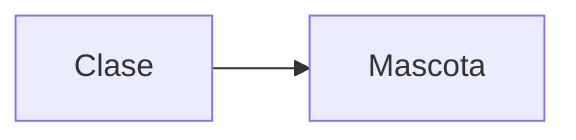
```mermaid
flowchart LR
Clase --> Mascota
```

> ### 💡
>
> Mascota es el molde de lo que representa la idea de una mascota

<r>Los objetos serian instancias concretas de ese molde</r>:
Como los perros los gatos, que representan elementos concretos de nuestro sistema, <r>las instancias pueden ser multiples</r>

instancia y objeto son sinónimos

<r>Nuestro sistema va a tener clases definidas y por cada una de las clases, podemos generar muchas instancias que van a ser las representaciones de los objetos concretos</r>

```java
//clase
class Mascota {
    //instancia
    perro
    gato
    pájaro
}
```

<!-- fin resumen video -->

<!-- ## Atributos, responsabilidades y constructor <a id='c4c'></a> -->

> #### 🎬
>
> Video: Conclusion

**Resumen video:**

## Diagramar clases y atributos <a id='c4c1'></a>

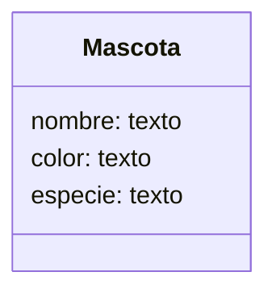
```mermaid
classDiagram
class Mascota{
    nombre: texto
    color: texto
    especie: texto
}
```

Vamos a entender cada `clase` como un **nuevo tipo de dato**

Cada tipo de dato define:

✅ atributos

✅ responsabilidades

Dicho de otra manera, que puedo hacer con ese objeto?

### 📜 Ejemplo!

Una lista, es un tipo de dato especifico, al cual podemos pedirle que nos diga la cantidad de elementos que contiene, lo mismo vamos a hacer con las clases que estamos definiendo.

Vamos a agregarle responsabilidades que al estar programando vamos a llamar **métodos**.

Pero como estamos definiendo un tipo de dato desde 0, tenemos que aclarar en nuestro diagrama, todos los metodos; es decir todas las responsabilidades que van a poder ejecutar los objetos de nuestra clase.

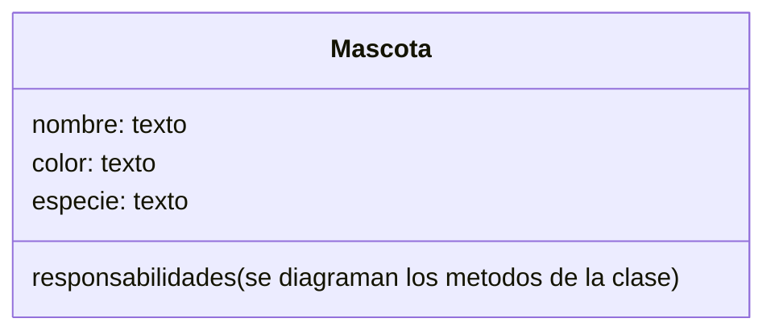
```mermaid
classDiagram

class Mascota{
    nombre: texto
    color: texto
    especie: texto
    responsabilidades(se diagraman los metodos de la clase)
}

```

**por ejemplo**

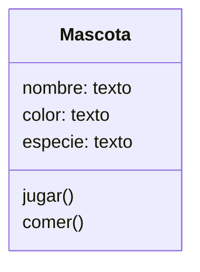
```mermaid
classDiagram

class Mascota{
    nombre: texto
    color: texto
    especie: texto
    jugar()
    comer()
}

```

De esta forma agregamos los métodos a las clases de nuestro sistema

Agregaremos el nombre de la responsabilidad, luego entre parentesis `()` agregaremos los parametros en caso de ser necesario

También podemos definir si un método va a devolver un resultado, señalándolos con `:` y agregando el tipo de dato que va a devolver esa responsabilidad al ejecutarse

Ademas agregaremos adelante del método un `+` si es publico o un `-` si es privado

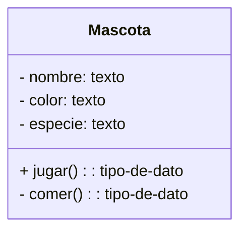
```mermaid
classDiagram

class Mascota{
    - nombre: texto
    - color: texto
    - especie: texto
    + jugar(): tipo-de-dato
    - comer(): tipo-de-dato
}
```

## Encapsulamiento <a id='c4c2'></a>

Porque ponemos los atributos por diseño como privados
Se oculta `el como funciona` y solo deja el enfoque en `que hace`, importa el **`que`**

Cada una de las responsabilidades de nuestra clase se va a modelar como metodos, asi ocultamos las propiedades y el comportamiento interno de los objetos

> ### 💡
>
> Preguntar a la mascota como: decir nombre, decir color, decir especie, se va a explicitar con metodos
>
> Al leer los metodos, se puede saber que se puede hacer con una mascota


**En resumen:** Lo que hacemos es definir un nuevo tipo de dato, con todas las características que lo representan (atributos), y todas las funciones asociadas que podemos ejecutar (Responsabilidades)

<!-- fin resumen video -->

## Atributos y comportamientos <a id='c4c3'></a>

> #### 📑
>
> pdf: Descubriendo Objetos

**Resumen pdf**

### Objetivo: Definir atributos y responsabilidades

Poder definir en los objetos, sus atributos y responsabilidades.

Para eso, en cada ejemplo:
Hacer una lista de los atributos y responsabilidades que descubran.

**Pensá, imaginá y compartí.**

Entonces, ¿cuáles son los atributos y las responsabilidades de cada objeto? Siempre pensá en
lo que tiene que ver con el contexto, es decir, no todo, solamente lo que forme parte de mi
problema.

De los siguientes contextos indicá los atributos de los objetos a modelar:

|     | Contexto                         | Objeto a modelar                      |
| --- | -------------------------------- | ------------------------------------- |
| 1   | Una fábrica                      | Empleado                              |
| 2   | Un cine                          | Butaca(o sea, el lugar en el cine)    |
| 3   | Un sistema de facturación        | Artículo                              |
| 4   | Una gestión de servicio mecánico | Auto                                  |
| 5   | Una misión a Marte               | Perseverance(vehículo de exploración) |

**Fin resumen**

## Atributos y responsabilidades <a id='c4c3a'></a>

Entonces, ¿qué son los atributos y las responsabilidades de un objeto?

### Atributos

<r>Los atributos de un objeto son las características y propiedades distintivas que permiten darle significado.</r>
Continuando con el ejemplo visto anteriormente en el video:

-   **Clase**: Veterinaria
-   **Objeto**: Veterinario
-   **Atributo**: nombre, apellido, matrícula

### Responsabilidades

Mientras que <r>las responsabilidades o comportamientos son la manera en que actúa o reacciona un objeto</r> —es decir, **es lo que representa la actividad visible y comprobable exteriormente**—, en la programación orientada a objetos <r>vamos a llamar al comportamiento de los objetos: “**métodos**’, los cuales nos van a permitir establecer cómo van a responder los objetos cuando interactuemos con ellos</r>.

> ### 💡
>
> ¡Atención! Los atributos y comportamientos van a depender del contexto del objeto, tal como hemos visto en el video en el caso de la silla.

Cada método especifica la operación o comportamiento que a su vez puede acceder a la estructura interna del objeto, como así también interactuar con otros objetos. <r>Por lo general, **los encontramos como verbos indicando las acciones que puede realizar el objeto** </r>.

-   **Clase**: Veterinaria
-   **Objeto**: Veterinario
-   **Atributo**: nombre, apellido, matrícula.
-   **Responsabilidades**/**comportamiento**: recibirMascota, curar, HacerDiagnostico.

### Ejemplo: objeto con sus atributos y métodos <a id='c4c5'></a>

> #### 📑
>
> pdf: Ejemplos de un objeto

**Resumen pdf:**

Nuestro contexto es la veterinaria. Ahora vamos a modelar a nuestro **objeto Veterinario** mediante un diagrama. Podemos apreciar cómo modelamos los objetos mediante el lenguaje unificado de modelado, por sus siglas en inglés, UML.

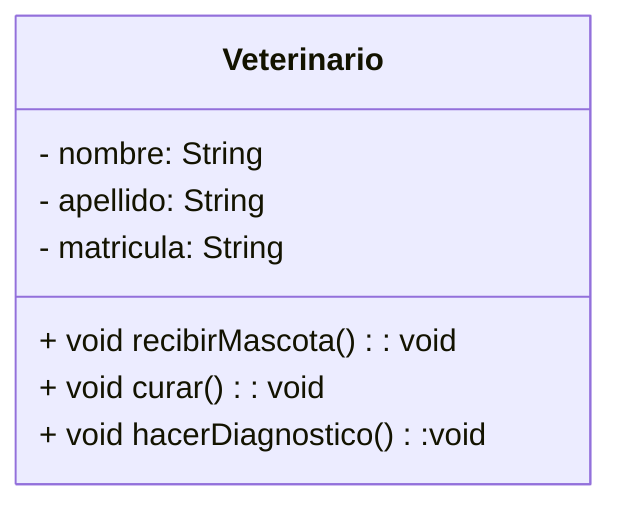
```mermaid
classDiagram
class Veterinario{
    - nombre: String
    - apellido: String
    - matricula: String
    + void recibirMascota(): void
    + void curar(): void
    + void hacerDiagnostico():void
}
```

#### Cambiemos de contexto

Ahora nos encontramos analizando el sistema contable de la clínica veterinaria.
Vamos a modelar nuestro objeto Veterinario para el nuevo contexto

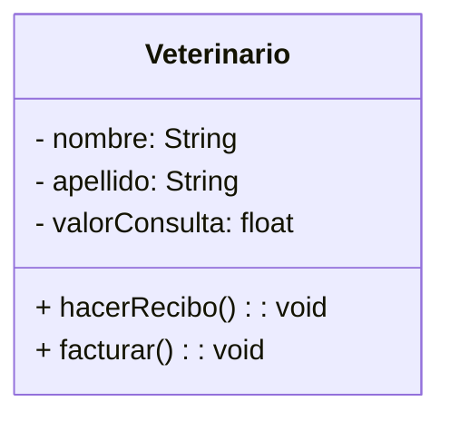
```mermaid
classDiagram
class Veterinario{
    - nombre: String
    - apellido: String
    - valorConsulta: float
    + hacerRecibo(): void
    + facturar(): void
}

```

¿Podemos ver que ahora hay otros atributos y responsabilidades diferentes?

Ambos son veterinarios, y en cada caso —o contexto— vamos a modelar los atributos y responsabilidades que sean necesarios para lograr la solución de ese problema en particular

> ### 💡
>
> Siempre tenemos que tener en cuenta el contexto de nuestro análisis

**Fin resumen**

## Constructor de un objeto <a id='c4c4'></a>

Ya tenemos claramente definidas las partes de nuestro objeto, ya podemos dejar lista nuestra definición (la clase Veterinaria).

A partir de esa clase, podemos crear los objetos.

Cada objeto tendrá sus valores propios de cada atributo y será capaz de hacer cada una de sus responsabilidades.

<r>Para poder crear estos **objetos** utilizaremos el **Constructor** que será quien, a partir de la clase, **genera un nuevo objeto**.</r>

Al objeto Veterinario vamos a darle un método constructor:


## Encapsulamiento (publico / privado) <a id='c4d'></a>

No todo el mundo no tiene que saber cómo hago yo las cosas
Los objetos son clave para comprender la tecnología orientada a objetos. Tenemos que conocer sus atributos, pero ¿debo cambiarlos?. Claro, como aprendimos desde niños, para usar lo de otro debo pedirlo a su dueño. Por eso:

> ### 💡
>
> es muy importante que en el caso de programación de objetos, cada uno **“oculte”** su manera de guardar sus atributos y los **“exponga”** mediante acciones que cualquiera puede invocar.

Mi manera de recordar mi edad es desconocida para cualquiera, pero cuando me pregunten la edad, van a recibir la información de cuántos años tengo. Y ustedes lo deben hacer de formas diferentes, ¿recuerdan la fecha de nacimiento, cuántos cumplieron o cuántos años más que sus hermanos tienen? Esto se llama encapsulamiento y vamos a estudiarlo a continuación.

> #### 📑
>
> pdf: Qué es encapsular?

**Resumen pdf:**

El encapsulamiento es una de las propiedades más importante de la programación orientada a objetos.

Cuando hablamos de encapsulamiento, no debemos olvidarnos del origen de la palabra “colocar en cápsulas”. ¿Qué serían las cápsulas? Es un envoltorio que protege el contenido en su interior.

> ### 👍
>
> En la POO, buscamos impedir que cualquier otro objeto pueda tener acceso a la estructura interna de un objeto

Solamente yo puedo cambiar o mostrar mi estado y con los métodos específicos que van a indicar cómo pedir cambios en dichos atributos desde el exterior del objeto.

**De ahora en más, cuando diseñamos nuestros objetos, tenemos que tener en cuenta el encapsulamiento.**

### 📜 Ejemplo!

Si tuviéramos un objeto `Persona`, que tiene como atributo su clave de acceso bancario, no sería conveniente que todos los objetos puedan acceder libremente a dicho atributo. <r>El objeto Persona debería establecer un método controlado y seguro para devolver la clave de acceso bancario, por ejemplo, si es que se cumplen medidas de seguridad.</r>


## Detalles importantes a considerar <a id='c4d1'></a>

-   Cuando definamos un objeto, dejar sus atributos privados.
-   Los métodos que sean públicos serán vistos por los otros objetos.
-   Usar siempre métodos públicos para ver o modificar las características de tus objetos.
-   Para cambiar el valor de un atributo se usa un método `set`, por ejemplo, para cambiar el nombre será `setNombre(String)`
-   Para obtener el valor de un atributo se usa un método `get`, por ejemplo, para saber el nombre será `getNombre(): String`

> ### 💡
>
> Los métodos para ver o cambiar atributos se los denomina getters y setters respectivamente.

**fin resumen**

## Diagrama UML <a id='c4e'></a>

**¿Qué es UML?**

UML son las siglas para _Unified Modeling Language_, que en castellano significan: Lenguaje de modelado unificado. Es un lenguaje de modelado, de propósito general, usado para la visualización, especificación, construcción y documentación de sistemas orientados a objetos.


## Diagrama de clases <a id='c4e1'></a>

El lenguaje de modelado unificado (UML) contiene distintos diagramas de estructura, comportamiento e interacción. En este caso, vamos a ver un diagrama de estructura conocido como diagrama de clases, que <r>muestra una vista estática de la estructura del sistema</r>, o de una parte de este, describiendo qué atributos y comportamiento debe desarrollar con los métodos necesarios para llevar a cabo las operaciones del sistema.

¿Cómo le presentamos el sistema de la veterinaria a una persona que nunca vio código en su vida? Con el diagrama de clases vamos a graficar un rectángulo dividido en tres partes por cada tipo de clase que exista. Conozcamos de qué se trata.

[Características: Diagrama de clases](https://view.genial.ly/60b24f2589103c0d7c05a59f)

### Nombre

Nombre de la clase que identifica al objeto en singular y siempre empezando con mayúscula

### Atributos

Indica los atributos de la clase, tiene en cuenta la visibilidad, el nombre del atributo y el tipo de dato. La visibilidad es una propiedad que permite a un objeto operar sobre otro. Si un objeto no ve a otro, no puede enviarle un mensaje para pedirle su colaboración. Hay tres niveles de visibilidad disponibles:

**Publica**
Se representa con el símbolo `+` e indica que cualquier clase externa con visibilidad hacia el clasificador dado puede utilizar la característica.

`+ atributo:Tipo`

**Privada**
Se representa con el símbolo `-` y solo el propio clasificador puede utilizar la característica.

`- atributo:Tipo`

**Protegida**
Se representa con el símbolo `#` e indica que cualquier descendiente del clasificador puede utilizar la característica.

`# atributo:Tipo`

### Responsabilidades

Indica los métodos de la clase, teniendo en cuenta la visibilidad, el nombre del método, los parámetros y el tipo de dato que retorna el método.

`+ método(parametros):Tipo`

## Draw.io: Software para graficar el Diagrama de Clases

Al momento de poder graficar estas clases, vamos a utilizar un programa que nos facilita el trabajo, aquí hay una breve descripción de cómo usarlo.

> Ver PDF: Draw.io

> ### 📜 Quiz <a id='c4e2'></a>
>
> **¿Cuál es la diferencia entre clase y objeto ?**
> Una clase es la representación abstracta de objetos de un mismo tipo, mientras que un objeto es una instanciación de una clase.
>
> **Indicá cuáles son componentes del objeto.**
> Atributos, nombre, comportamiento
>
> **¿En qué consiste un método en programación orientada a objetos?**
> En la forma en que responden los objetos a los mensajes dirigidos a ellos.

## Reconozcamos en un problema cuales son los objetos

El diagrama de clases y el modelado son fundamentales para la programación orientada a objetos.
Ya tenemos el suficiente detalle para poder hacer un problema más completo.
Es tu turno…. ¡vamos!

> ver PDF: Ejercitación Modelado Objetos.pdf

<!-- HACER -->

> Ver: Ejercitación 1- modelar cuestiones bancarias.pdf

<!-- HACER -->

> Ver: Ejercitación 2- modelar cuestiones bancarias.pdf

**Solución**

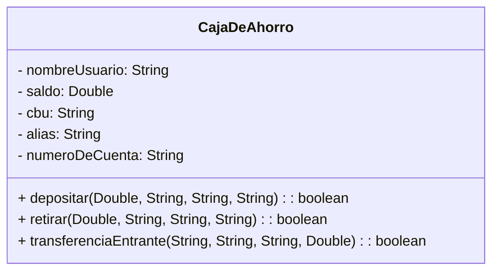
```mermaid
classDiagram
class CajaDeAhorro {
    - nombreUsuario: String
    - saldo: Double
    - cbu: String
    - alias: String
    - numeroDeCuenta: String
    + depositar(Double, String, String, String): boolean
    + retirar(Double, String, String, String): boolean
    + transferenciaEntrante(String, String, String, Double): boolean
}
```

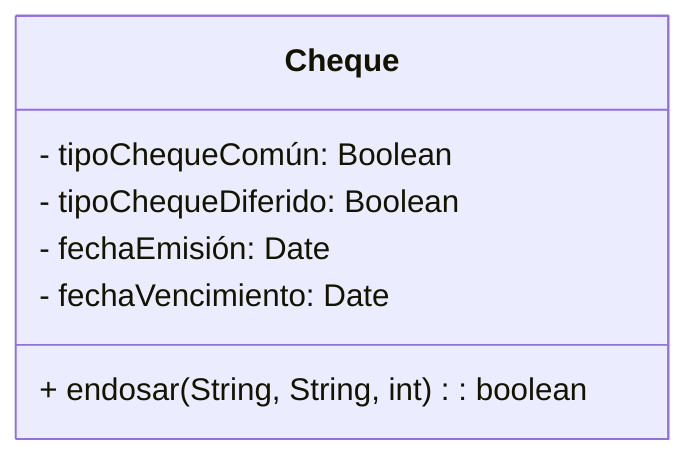
```mermaid
classDiagram
class Cheque {
    - tipoChequeComún: Boolean
    - tipoChequeDiferido: Boolean
    - fechaEmisión: Date
    - fechaVencimiento: Date
    + endosar(String, String, int): boolean
}
```

# C5 - Clases <a id='c5'></a>

> #### 📑
> pdf: Atributos y metodos, constructores

**Resumen pdf:**

## Atributos, constructores y métodos en Java <a id='c5a'></a>


### Atributos <a id='c5a1'></a>

Los atributos de nuestra clase son:

✅ descripcion 

✅ precioVenta

✅ stock.


**Los atributos de la clase Articulo en Java**

Definimos los atributos como privados para preservar el encapsulamiento.

```java
public class Articulo{

    private String descripcion;
    private double precioVenta;
    private int stock;
}
```

### Constructores <a id='c5a2'></a>

**Los Constructores de la clase Articulo**

En el constructor apareció la palabra reservada `this`, se utiliza para hacer referencia a la instancia u objeto. <r>Cuando creamos una instancia con `new`, se ejecuta el constructor</r>. Esa instancia que estamos creando es la que estamos nombrando con el `this` y al hacer `this.descripcion` nombramos el atributo descripcion de ella.

**El constructor:**


**Los constructor de la clase Articulo en Java**

```java
public class Articulo{
    private String descripcion;
    private double precioVenta;
    private int stock;

    public Articulo(String descripcion, int cantidad,double precio){
    this.descripcion = descripcion;
    precioVenta = precio;
    stock = cantidad;
    }
}
```

✅ El constructor es un método que no tiene tipo de dato, 

✅ Se llama igual que la clase. 

✅ Recibe como parámetros los valores que se desea asignar inicialmente a los atributos, es decir, los valores iniciales.

✅ Se puede usar para inicializar los atributos.

```java
public Articulo(String descripcion, int cantidad,double precio)

```
> ### 💡
> Para diferenciar el atributo descripcion del parámetro que tiene el mismo nombre, usamos `this`.
>
> `This` hace referencia al objeto o instancia con el que se está trabajando.

```java
this.descripcion = descripcion;
```

### Métodos <a id='c5a3'></a>

**Los métodos de la clase Articulo**

Los métodos de nuestra clase son `hayStock()` y `consultarPrecio()`


```java
public class Articulo{
    private String descripcion;
    private double precioVenta;
    private int stock;

    +    public Articulo(String descripcion, int cantidad,double precio)

    public boolean hayStock(){
            return stock>0;
    }
    public double consultarPrecio(){
        return precioVenta;
    }
}
```

Método `hayStock()` Devuelve:
- `true` si stock es mayor a 0 
- `false` en caso contrario

```bash
public boolean hayStock(){
    return stock > 0;
}
```

Método `consultarPrecio()` Devuelve:
- el Precio de Venta

```bash
public double consultarPrecio(){
    return precioVenta;
}
```

<!-- fin resumen pdf -->

## Nombres en Java <a id='c5a4'></a>

[Nombres en Java](https://view.genial.ly/60c0aeda7860d10d09dec39c)

<!-- resumen link -->

### Camel Case

Camel case es un estilo de escritura que se aplica a frases o palabras compuestas. El nombre se debe a que las mayúsculas a lo largo de una palabra en CamelCase se asemejan a las jorobas de un camello.

### Atributos

Los nombres de los atributos comienzan con minúscula, si necesitamos usar más de una palabra, a partir de la segunda inicializamos en mayúscula.
`elAtributo`

### Métodos

Se nombran de la misma forma que los atributos, la primera palabra en minúscula y si el nombre tuviera más palabras, todas se inicializan en mayúscula. Recomendamos poner nombres lo más descriptivos posibles, aunque esto implique usar varias palabras.
`calculoSueldoNeto`

### Objetos

La primera palabra en minúscula y si tiene más de una palabra, las siguientes se inicializan en mayúscula.
`nombre, importeTotal`

### Clase

Los nombres de las clases siempre van con la inicial en mayúscula, si necesitamos usar dos o más palabras para nombrar una clase van pegadas y con todas las iniciales en mayúscula.
`CamelCase, Empleado`

### Paquetes

Todas las letras en minúscula.

### Constantes

Todas las letras en mayúscula y si hay más de una palabra, separadas por guión.
`IVA, DIAS_SEMANA`

<!-- fin resumen link -->

> Ver PDF: Crear una Clase en Java.pdf

<!-- inicio resumen pdf -->

## Crear una clase en Java <a id='c5a5'></a>

### Planteo

Para resolver un problema hemos detectado la necesidad de una clase Artículo. 

Los artículos tienen:
- nombre, 
- precio de compra, 
- precio de venta y 
- stock disponibles. 

El comportamiento que se espera de ellos es que puedan informar si hay stock disponible y cuál es la ganancia obtenida por cada venta, según los precios disponibles

### Diseño

Luego de realizar el diseño de la clase en un diagrama, el próximo paso es implementarla:


## Crear una clase en el IDE <a id='c5a6'></a>

Creamos una clase en nuestro `package`. 

Al hacer clic con el botón derecho del mouse, obtenemos un menú contextual, seleccionamos **New** y luego **Java Class**.

Luego le asigno un nombre —siempre la inicial en mayúscula—.

**La nueva clase**

Al crear la clase estará vacía. Debemos incorporar los atributos y métodos.
Definiéndolos con el alcance correcto para mantener el encapsulamiento.

>### 👍
> Esto sería los atributos como `private` y los métodos como `public`.

```java
package com.company;

public class Articulo{

}
```

> ### 💡 Importante
> - No cambiar nunca el nombre de la clase. El nombre del archivo **.java** debe coincidir con el nombre de la clase.
>
> - Los nombres de las clases siempre deben inicializarse en mayúscula y deben estar en singular.
>
> - Es importante estar seguros del nombre que le vamos a dar. Java necesita mantener el mismo nombre de la clase como nombre del archivo fuente .java


## Proteger el encapsulamiento <a id='c5b'></a>

Los atributos de una clase deben ser privados, para garantizar el ocultamiento, sin embargo, en algún momento podemos necesitar consultar o cambiar el valor de un atributo.

### Métodos de acceso

Son métodos públicos que nos permiten acceder al valor de los atributos privados del objeto. 

> ### 💡
> Los métodos modificadores nos posibilitan cambiar el valor de un atributo.
>
> Los métodos consultores u observadores nos devuelven el valor guardado en un atributo.

Para nombrarlos usamos dos prefijos: `get` y `set`.

Debido a estos prefijos se los suele llamar métodos getters y setters.

#### Los métodos get

El primero de estos es para los consultores, por ejemplo,
getNombre, getValor, getSueldo, etc.,

✅ Estos métodos siempre devuelven algo del mismo tipo que el atributo al que acceden

✅ <r>No tienen parámetros</r> porque solo acceden al valor guardado en el atributo, sin cambiarlo.

#### Los métodos set

Para los métodos modificadores:
setNombre, setValor, setSueldo, etcétera.

✅ Los métodos son de tipo `void`

✅ <r>Tienen un parámetro del mismo tipo que el atributo al que acceden</r>

✅ El valor que recibe en este parámetro es el que se asigna al atributo al que acceden.

> ### 💡
> **¡Atención!**
> Si bien cuando comenzamos a hacer nuestras primeras clases ponemos `set` y `get` para todos los atributos, hay que tener cuidado con esto, ya que si queremos proteger los datos, no siempre se debe dejar acceder a ellos mediante un set o get. Esto se debe analizar en cada situación.

> #### 📑
> pdf: Proteger el encapsulamiento

**Resumen pdf:**

## Uso de setters y getters <a id='c5b1'></a>

### Diseño de la clase Articulo

Para lograr el encapsulamiento nuestros atributos son privados:


**Implementación de la clase Articulo**

```java
public class Articulo{
    private String descripcion;
    private double precioVenta;
    private int stock;

+   public Articulo(String descripcion, int cantidad,double precio)
+   public boolean hayStock(){
    }
+   public double consultarPrecio(){
}
```

### Agregar setters y getters

En la clase Artículo, protegimos los atributos, pero si necesitamos acceder a ellos podemos agregar, **métodos de acceso**.

Los métodos que me permitirán acceder a los atributos son: setters y getters

```java
public class Articulo{
    private String descripcion;
    private double precioVenta;
    private int stock;

    public String getDescripcion(){
        return descripcion;
    }
    public double getPrecioVenta(){
        return precioVenta;
    }
    public int getStock(){
        return stock;
    }
    public void setDescripcion(String descripcion){
        this.descripcion = descripcion;
    }
    public void setPrecioVenta(double precio){
        precioVenta = precio;
    }
    public void setStock(int stock){
        this.stock = stock;
    }
```

Los métodos `get` <r>permiten acceder al valor</r> de un atributo para una consulta o para usar ese valor en otra operación.

```java
public String getDescripcion(){
    return descripcion;
}
public double getPrecioVenta(){
    return precioVenta;
}
public int getStock(){
    return stock;
}
```

Los métodos `set` <r>permiten cambiar el valor</r> de un atributo, reciben por parámetro el nuevo valor y lo asignan al atributo correspondiente.

```java
public void setDescripcion(String descripcion){
    this.descripcion = descripcion;
}
public void setPrecioVenta(double precio){
    precioVenta = precio;
}
public void setStock(int stock){
    this.stock = stock;
}
```

Para diferenciar el atributo descripción del parámetro que tiene el mismo nombre, usamos `this`. 
This hace referencia al objeto o instancia con el que se está trabajando

```java
this.descripcion = descripcion;
```

### Actividad PG <a id='c5b2'></a>

1. Definir una nueva clase Cliente que contenga los siguiente atributos:

-   nombre de tipo String
-   apellido de tipo String
    no te olvides en java los atributos son privados, crearle getters y setters a ambos para poder acceder a ellos

```java
public class Cliente{
    private String nombre;
    private String apellido;

    public String getNombre(){
        return nombre;
    }
    public String getApellido(){
        return apellido;
    }
    public void setNombre(String nombre){
        this.nombre = nombre;
    }
    public void setApellido(String apellido){
        this.apellido = apellido;
    }
}
```

2. Ejercicio Cliente (Constructor)

Una vez que ya tenemos nuestra clase Cliente funcionando es hora de crearle un constructor.

Nuestro constructor tiene que recibir nombre y apellido y asignárselo a los atributos de nuestra clase Cliente

```java
public class Cliente {

    private String nombre;
    private String apellido;

    //Constructor:
    public Cliente (String nombre, String apellido){
        this.nombre = nombre;
        this.apellido = apellido;
    }

    public String getNombre() {
        return nombre;
    }
    public String getApellido() {
        return apellido;
    }
}
```

## Instancia <a id='c5c'></a>

> #### 📑
> pdf: Crear una instancia

**Resumen pdf**

### La clase Artículo

Necesitamos crear una clase Artículo, la información con la que contamos es: 
- Un Articulo tiene una descripción
- Un precio de venta 
- Un stock. 

Esta clase debe poder responder:
- Si hay stock 
- Cuál es su precio.


### Métodos de la clase Articulo en Java

```java
public class Articulo{
    private String descripcion;
    private double precioVenta;
    private int stock;

    +    public Articulo(String descripcion, int cantidad,double precio)

    public boolean hayStock(){
        return stock>0;
    }
    public double consultarPrecio(){
        return precioVenta;
    }
}
```

### Cómo comenzar a usarlo

**Programa principal ▶**

```java
public class Main {

    public static void main(String[] args) {

        Articulo articulo = new Articulo("Artículo 1",100,1100.00);

        if (articulo.hayStock()){
            System.out.println("Hay stock disponible");
        }

        System.out.println("El precio de venta es " + articulo.consultarPrecio());
    }
}
```

Creamos un objeto o instancia de la clase Articulo.

```java
Articulo articulo = new Articulo("Artículo 1",100,1100.00);
```

Utilizamos el método `.hayStock()`; si es `true` muestra en consola `hay stock disponible`.

```java
if (articulo.hayStock()){
    System.out.println("Hay stock disponible");
}
```

Utilizamos el método `.consultarPrecio`

```java
System.out.println("El precio de venta es " + articulo.consultarPrecio());
```

**fin resumen**

## La clase <a id='c5d'></a>

> #### 📑
> pdf: La clase

**Resumen pdf:**

### 📜 Ejemplo!

En Diagrama de clases de UML:

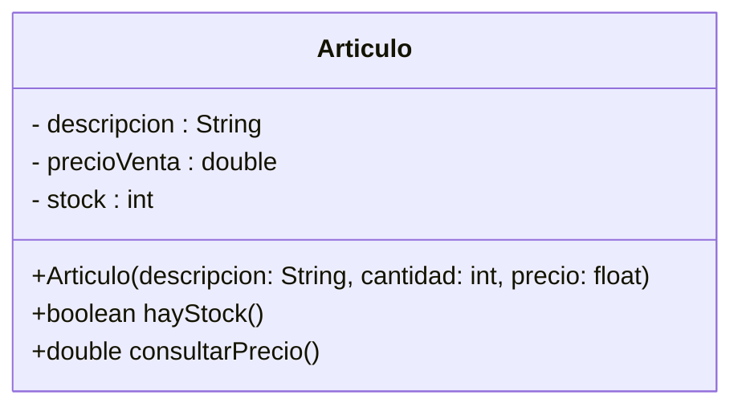
```mermaid
classDiagram
class Articulo{
    - descripcion : String
    - precioVenta : double
    - stock : int
    +Articulo(descripcion: String, cantidad: int, precio: float)

    +boolean hayStock()
    +double consultarPrecio()
}
```
En java:

```java
public class Articulo{

    private String descripcion;
    private double precioVenta;
    private int stock;

    //uso this para que no se confunda el atributo con el parametro
    public Articulo(String descripcion, int cantidad,double precio){
        this.descripcion = descripcion;
        //No es necesario con estos porque no están los mismos nombres en parametros
        precioVenta = precio;
        stock = cantidad;
    }
    //getters: extraigo info
    public String getDescripcion(){
        return descripcion;
    }
    public double getPrecioVenta(){
        return precioVenta;
    }
    public int getStock(){
        return stock;
    }
    //setters: seteo info, la envío por parametros, del mismo tipo del atributo
    public void setDescripcion(String descripcion){
        this.descripcion = descripcion;
    }
    public void setPrecioVenta(double precio){
        precioVenta = precio;
    }
    public void setStock(int stock){
        this.stock = stock;
    }
    //metodos de la clase Articulo
    public boolean hayStock(){
        return stock>0;
    }
    public double consultarPrecio(){
        return precioVenta;
    }
}
```
**Fin resumen**

## Variables y métodos de clase <a id='c5e'></a>

Ya podemos implementar nuestras clases y, a partir de ello, crear objetos o instancias de las mismas.

✅ Todos los objetos que creamos tienen los mismos atributos, pero cada uno tiene su propio estado, 

✅ Los atributos tienen distintos valores para cada objeto. 

Ahora veremos que hay una forma de tener **un único valor para todos los objetos**.

> #### 📑
> pdf: Variables y Métodos de Clase

**Resumen pdf**

### Las clases

Vimos que el enfoque de la programación orientada a objetos se basa en identificar objetos con sus atributos y responsabilidades. 

Entonces, encontramos que <r>hay grupos de objetos que aunque tienen diferentes estados —valores de los atributos—</r>, tienen en común cuáles son los atributos y cuáles son sus responsabilidades.

Entonces este **"molde"** es lo que llamamos clases.

### Los objetos


**¿Qué comparten los objetos?**

Todos los objetos de una clase tienen la misma estructura: los mismos atributos y el mismo comportamiento, es decir, pueden hacer lo mismo. 

> ### 💡
> Pero cada objeto tiene sus propios atributos, puede tener distintos valores en sus atributos, tiene un estado propio.

**Un valor común para todos los objetos**

¿Todos los objetos pueden tener un valor en común?


### Variable de clase <a id='c5e2'></a>

Vamos a llamar variables de clase a <r>aquellas variables —atributos— que guardan valores comunes a todos los objetos.</r> 

El combustible vale lo mismo para cualquier objeto Camion.


### Métodos de clase <a id='c5e3'></a>

Un método de clase se puede utilizar, sin necesidad de instanciar o crear un objeto, directamente con la clase.


> ### 💡
> Las clases y metodos de clase se debe subrayar en el diagrama de clases UML

### Ejemplos de uso: La clase Camión <a id='c5e4'></a>


```java
public class Camion {
    private String marca;
    private String patente;
    static private double valorCombustible;

    public Camion(String marca, String patente){
        this.marca = marca;
        this.patente = patente;
    }
    public double gastoCombustible(int litros){
        return litros * Camion.valorCombustible;
    }
    static public void cambiarPrecioCombustible(double precio){
        Camion.valorCombustible = precio;
    }
}
```

Definimos la variable como `static`, esto hace que no se pueda usar con un objeto.

```java
static private double valorCombustible;
```

Definimos el método como `static`, esto hace que no se pueda usar con un objeto.

```java
static public void cambiarPrecioCombustible(double precio){
}
```

Accedemos a la variable de clase y podemos cambiar su valor.

```java
Camion.valorCombustible = precio;
```


### El main

```java
public class Main {
    public static void main(String[] args) {

        Camion miCamion = new Camion("Ford",”AB XXX CD”);

        Camion.cambiarPrecioCombustible(98.50);

        System.out.println("Gasto " + miCamion.gastoCombustible(40));

    }
}
```

Creamos un objeto de la clase Camion.

```java
Camion miCamion = new Camion("Ford",”AB XXX CD”);
```

Utilizamos el método de clase a través de la clase y no del objeto

```java
Camion.cambiarPrecioCombustible(98.50);
```

## Live coding: Creación de clase y uso <a id='c5f'></a>

Te invitamos a ver el siguiente live coding donde mostramos un ejemplo de lo visto anteriormente.

> #### 🎬
> Video: Clases

**Transcripcion video**

Abrimos un nuevo proyecto, creamos el archivo donde vamos a trabajar; tiene que tener el mismo nombre de la clase que este creando:


definimos los atributos privados

```java
package com.company;

public class Articulo {
    //Atributos en privado
    private String descripcion;
    private double precioVenta;
    private int stock;

    //primero definimos los metodos que serán públicos

    //primero definimos el constructor, tiene como parametros los atributos los 3 valores que tengo que asignarles inicialmente a los atributos

    public Articulo(String descripcion, double precio, int stock){
        //En el caso que el parametro tenga el mismo nombre del atributo usamos this para diferenciarlo, si no, no hay necesidad.
        this.descripcion = descripcion;
        precioVenta = precio;
        this.stock = stock;
    }

    //Definimos los get y set(uno por cada atributo)
    //Con set asignamos un nuevo valor al atributo con el que estamos trabajando
    public void setDescripcion(String descripcion) {
        this.descripcion = descripcion;
    }

    //Definimos el get, con el tipo correspondiente al atributo
    public String getDescripcion() {
        return descripcion;
    }

    // metodos definidos para esta clase, consulta atributo stock
    public boolean hayStock(){
        return stock>0;
    }
    public double consultarPrecio(){
        return precioVenta;
    }
}
```
Finalizada la creación de la clase, vamos a ver como la utilizamos.\
Vamos a `Main`.

```java
package com.company;

public class Main {

    public static void main(String[] args) {
	    // definimos una instancia de la clase Articulo
        Articulo articulo;
        //Para comenzar a utilizar la instancia tenemos que crearla, tenia 3 parametros el constructor.
        articulo =  new Articulo("articulo1",1000,100);
        //creado el objeto podemos usar los metodos que le definimos.
        System.out.println("Precio "+articulo.consultarPrecio());
    }
}
```
Resultado en consola:


**Fin transcripción**

> ### [📌Actividad: UsuarioJuego > Puntajes > Nivel](./Actividades/act-usuariojuegopreparcial-.md)  <a id='c5s1'></a>


### Actividad PG <a id='c5e1'></a>

Ya creamos la clase Cuenta que contiene 
- un numero de cuenta y 
- un saldo

Crear un método llamado depósito que tenga como parámetros de entrada cantidad de dinero. 
Al ser un depósito la cantidad de dinero se incrementa al saldo.
Crear un método llamado extracción que tenga como parámetros de entrada cantidad de dinero. Al ser una extracción, la cantidad se resta del saldo

Solo permitir realizar la extracción si el saldo es suficiente

```java
public class Cuenta {

    private int numeroDeCuenta;
    private Double saldo;

    //crear la funcion depositar y retirar aca
    public void depositar(Double cantidadDeDinero){
    this.saldo += cantidadDeDinero;
    }
    public void retirar(Double cantidadDeDinero){
        if(saldo >= cantidadDeDinero){
            this.saldo -= cantidadDeDinero;
        }
    }

    //no tocar estas funciones
    public void setSaldo(Double saldo) {
        this.saldo = saldo;
    }

    public Double getSaldo() {
        return saldo;
    }
}
```
# C6 - Repaso <a id='c6'></a>

> #### 🎬
> Video: Clases 6 vivo

> ### [📌Actividad: Clase Perro > chip > adopción](./Actividades/act-perro-chippreparcial-.md) <a id='c6a'></a>

## Notas Clase 6 <a id='c6s'></a>

✅ Podemos crear varios constructores a una sola clase, creando un constructor nuevo, con diferentes parametros, no pueden ser idénticos porque no si no, no sabra cual usar.


No se pasa por parametros a un método que esta en la misma clase.

# C7 - Relaciones entre clases <a id='c7'></a>

Los objetos se comunican, se relacionan entre sí, enviándose mensajes. Cuando un objeto le envía un mensaje a otro, el objeto receptor responde con otro mensaje. 

En ese intercambio de mensajes se generan relaciones y en esta clase vamos a explorar cada una de ellas.

> #### 📑
> pdf: Relaciones entre clases

> #### 📑
> pdf: Relación de clases

> #### 🎬
> Video: Relaciones entre clases

## Introducción: Relaciones entre clases <a id='c7a'></a>

Como destacamos siempre, <r>todo va a depender del contexto</r> y como los problemas que debemos solucionar requieren de la creación de clases, las mismas no trabajan por separado.

A partir de lo dicho anteriormente, podemos llegar a la conclusión de que:

✅ Las clases interactúan y se relacionan entre ellas de diferentes formas y que 

✅ la relación que exista entre ellas, existirá en una comunicación específica respetando un contexto determinado.

> ### 💡
> Las clases no se encuentran solas ni trabajan individualmente.

### 📜 Ejemplo!

En una fábrica de gaseosas, los diferentes objetos que encontramos colaboran entre sí. Debemos representar esa realidad al momento de modelar las clases.

## Representacion en UML de relaciones <a id='c7b'></a>

### Navegación <a id='c7b1'></a>

Cuando una asociación lleva una flecha, indica una dirección de recorrido (de navegación). Implica que es posible para un objeto en un extremo acceder al objeto del otro extremo porque el primero contiene referencias específicas a este último (al que apunta la flecha), no siendo cierto en el sentido contrario

> ### 💡
> En este ejemplo diremos que es la Persona la que tiene un atributo (objeto) de la clase Trabajo.

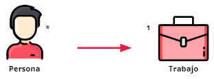

> ### 💡
> Recordá que siempre depende del contexto. Si lo que necesitamos es por cada trabajo saber `todas las personas que trabajan allí`, entonces, el sentido sería al revés


### Multiplicidad o cardinalidad <a id='c7b2'></a>

La multiplicidad también llamada cardinalidad 

✅ Especifica el número de instancias de una clase que puede estar relacionadas con una única instancia de una clase asociada. 

✅ La multiplicidad limita el número de objetos relacionados.

Para establecer las multiplicidades, primero, nos paramos en una de las clases, por ejemplo, la clase Persona y paso siguiente debemos hacernos la siguiente pregunta:

¿Para una instancia de esa clase, en este caso de la clase Persona, cuántas posibles instancias podría tener de la clase a la que está asociada, en este caso Trabajo?

Luego nos paramos en la otra clase, en nuestro caso la clase Trabajo y nos debemos hacer la misma pregunta

¿Para una instancia de esa clase, o sea, para un trabajo, cuántas posibles personas podrían tener ese trabajo?

<r>La multiplicidad depende de suposiciones y —como venimos nombrando— muchas veces, del contexto del problema.</r> 

Tener poca información del contexto suele hacer incierta la multiplicidad.


> Por ejemplo, la asociación que acabamos de ver entre Persona y Trabajo ¿es (1 a muchos) o (muchos a muchos)? Esto depende del contexto.

## 📜 Ejemplos! <a id='c7b3'></a>

#### Mucho a muchos

Una persona tiene muchas reuniones y en una misma reunión participan muchas personas. A diferencia del modelo relacional donde las relaciones muchos a muchos se transforman en una nueva entidad en el modelo orientado a objetos es posible tener relaciones mucho a muchos.

```
Persona *--->*Reunion
```
> ### 💡
> Es posible tener relaciones “mucho a muchos”

#### Uno a uno

Una persona tiene una sola partida de nacimiento y una partida de nacimiento es de una única persona

Persona 1 --> 1 PartidaNacimiento

> ### 💡
> Vale aclarar que cuando la multiplicidad es 1 no se suele escribir en el diagrama

Persona --> partidaNacimiento

#### Uno a muchos o muchos a uno

También podemos tener multiplicidades con cantidad de instancias limitadas en el ejemplo que vemos a continuación una persona puede tener 2 pulmones y cada pulmón es de una única persona y, como vimos en el ejemplo anterior, no hay que olvidar que si no escribimos nada en la multiplicidad se entiende que es 1

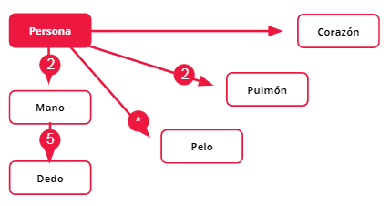

## Tipos de relaciones <a id='c7c'></a>

Existen numerosas relaciones entre las clases, a continuación un listado de los principales tipos de relaciones:

-   Asociación  -->
-   Agregación  o--
-   Composición  *--
-   Generalización 
-   Especialización
-   Dependencia / De uso ..>

En esta clase nos vamos a focalizar en <r>las 3 primeras a las que llamamos relaciones del tipo **“tiene un”**</r> y en la próxima clase nos vamos a dedicar a explorar la generalización y especialización a las que llamamos relaciones del tipo “es un”

## Relación de asociación <a id='c7c1'></a>

> #### 🎬
> Video: Asociación

✅ Relación estructural que describe una conexión entre clases

✅ Es unilateral

✅ Se identifica por palabras como: "tiene", "tiene un", "conoce" o que refiera conexión

✅ Se establece cuando un objeto de una clase colabora con uno o más objetos de otra clase

✅ Habla de un elemento que tiene a otro, como una colaboracion continua

✅ Se dibuja en el diagrama como una flecha completa

✅ Aparece la segunda clase como Atributo de la primera


### 📜 Ejemplo!

En este diagrama diremos que la clase Persona conoce a una instancia de la clase Mascota, de ahí que la dirección de la flecha es de la clase Persona hacia clase Mascota.

> ### 💡
> Esta relación representa que Persona tiene un atributo del tipo Mascota.


***

Un dueño tiene una mascota, se representa con una mascota de tipo mascota


***

Un dueño tiene muchas mascotas, se agrega la cardinalidad, mostrando que tiene **muchas**. Se representa por ahora con un `list<tipo de elemento>`


***

Una aplicación para el cálculo de impuestos podría permitir que una persona trabajase en múltiples trabajos. 

Por otra parte, un sindicato de trabajadores del gremio del automóvil que mantuviera registros de sus afiliados trabajadores podría considerar irrelevantes los segundos trabajos.

## Relación de uso / dependencia <a id='c7c2'></a>

✅ Es una relación del tipo **“usa un”**. 

✅ No tiene como atributo la clase, la usa en un método 

✅ Se emplea con flecha punteada 

✅ Una forma de reconocerla es cuando una clase en vez de ser atributo de otra, aparece como **parametro** en uno de sus metodos


✅ No hay una referencia de una clase a la otra, sino que en este caso, 

✅ La relación se da porque hay algún método que devuelve o recibe como parámetro una variable que <r>es del tipo de la otra clase</r>

✅ Colaboracion temporal

✅ Un método de la primera clase utiliza por un rato, un objeto de la segunda clase como parametro


### 📜 Ejemplo! <a id='c7b3'></a>

En el ejemplo a continuación la clase `Cuenta` tiene un método que devuelve un Extracto, pero no necesita tener una instancia Extracto dentro de la Cuenta.


## Relación de Agregación <a id='c7c3'></a>

> #### 📑
> pdf: Agregación

✅ Cuando una clase ademas de tiene o conoce **"es parte"**

✅ Ambas clases pueden existir independientemente

✅ En el diagrama se indica con un **rombo vacío** que parte de la clase que contiene a la otra

✅ Donde existe una relación entre los agregados y el todo, pero los componentes pueden existir aunque el todo fuese destruido. 

✅ Es una relación que indica que una clase forma parte de otra/s clase/s <r>con una relación débil, de tal forma que existe una independencia respecto a su existencia</r>. 

✅ Decimos también que una agregación es una relación de tipo **“es parte de”**.

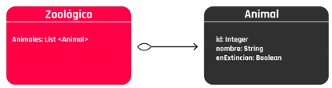

### 📜 Ejemplo!

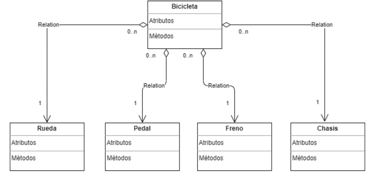

**Análisis del ejemplo**

Una bicicleta está formada por diversos otros elementos (objetos), como: 

- ruedas, 
- pedales, 
- frenos y 
- chasis. 

Mediante un proceso de ensamblaje, unimos los elementos y conformamos una bicicleta.

¿Qué pasa si efectuamos el proceso inverso? Si desarmamos la bicicleta. ¿Los otros elementos todavía siguen existiendo y cumplen su propósito? <r>La respuesta es sí</r>, ya que cada elemento puede ser utilizado en otra bicicleta o hasta en otro tipo de
transporte como un triciclo o monociclo.

Aquí es donde radica la cuestión. <r>Los objetos tienen una relación débil con la bicicleta y pueden continuar existiendo aun después de que desarmemos la bicicleta.</r>

> #### 📑
> pdf: Ejercitación Modelado Relaciones I

## Relación de Composicion <a id='c7c4'></a>

> #### 📑
> pdf: Composicion

✅ Cuando una clase esta compuesta por otra clase, es decir que una depende de la otra, no tienen sentido por su cuenta

✅ Lo representamos con un **rombo relleno**

✅ La composición es un tipo de agregación que es más fuerte, donde todas las partes (clases) solamente pueden pertenecer a un todo

✅ Es el caso en el que <r>una clase de objeto A **“es dueño de”** una
clase de objeto B, y B no tiene razón de existir sin A</r>.

✅ A diferencia de la agregación, en este caso, la parte no tiene sentido sin el todo.


### 📜 Ejemplo!


**Análisis del ejemplo**

Una empresa tiene empleados, estos por sí solos no tienen sentido, si existe un
empleado es porque tiene que existir una empresa donde ese empleado trabaje.

> #### 📑
> pdf: Ejercitación Modelado Relaciones II

<!-- HACER -->

***

## Implementación en Java <a id='c7d'></a>

> #### 🎬
> Video: Implementación en JAVA

<!-- inicio resumen -->

Las relaciones entre clases nos indican como se comunican los objetos de esas clases entre si y la manera en que sus mensajes se dirigen

### Relación de asociación: 

✅ Un auto tiene un motor

✅ Relación 1 a 1: Las relaciones se implementan como atributos

> ### 💡
> En el UML no se suele poner el atributo de la clase motor ya que se entiende a traves de la relación y seria redundante.


### Relación de asociación: 

✅ Un auto tiene mas de una rueda

✅ Relación 1 a muchos: En este caso se utiliza un array donde se guardan muchos objetos del mismo tipo.

> ### 💡
> Con un array o lista podemos resolver estas relaciones


### Relación de agregación: 

✅ Un objeto usa a otro para poder funcionar

✅ Tenemos una computadora que para funcionar necesita un mouse


<!-- fin resumen video -->

> ### 💡
> Las clases deben estar en el mismo paquete sino, tiene que hacerse un `import`

## Live coding <a id='c7f'></a>

> #### 🎬
> Video: Live coding

> ### [📌Actividad: Relaciones UML > Chofer > Auto](./Actividades/lc-relacionespreparcial-.md)
> El chofer tiene asignado un auto

> ### [📌Actividad: Relaciones UML > Chofer > Auto > Motor](./Actividades/lc-relaciones-iipreparcial-.md)
> El chofer tiene asignado un auto, el auto tiene un motor.

>### 👍
> Cuando tengo atributos que son objetos tengo que tenerlos instanciados, puedo crearlo en el constructor `<ej: motor>`

### Actividad PG <a id='c7e1'></a>

**Consigna**

Es momento de asociar nuestra clase Cliente con nuestra clase Cuenta.

En otro archivo ya tenemos una clase Cliente con sus atributos y responsabilidades , nuestra clase Cuenta debe tener un atributo titular de tipo Cliente.

Les pedimos que modifiquen la Clase Cuenta para que tenga un Cliente. El constructor de la clase Cuenta recibe además de los valores que ya tiene un Cliente.

```java
public class Cuenta {

    private int numeroDeCuenta;
    private Double saldo;
    private Cliente titular;

    //Modificar este constructor
    public Cuenta(int numeroDeCuenta, Double saldo, Cliente titular) {
        this.numeroDeCuenta = numeroDeCuenta;
        this.saldo = saldo;
        this.titular = titular;
    }

    //no tocar este código
    public Cliente getTitular(){
        return titular;
    }
}
```

 ## Notas clase 7 <a id='c7s'></a>

-   Clases sin responsabilidades se llaman POJOs
-   La revista va a tener como atributo una lista de ediciones
-   Cuando creamos la relación la revista tiene cmo atributo lista de ediciones. No es necesario escribirlas por la relación entre Revista y Edición `- ediciones : list<edición>`
-   Es raro en objetos que la relación sea de muchos a muchos, generalmente la relación es unilateral
-   la clase articulo va a tener un titulo, un tema y un autor

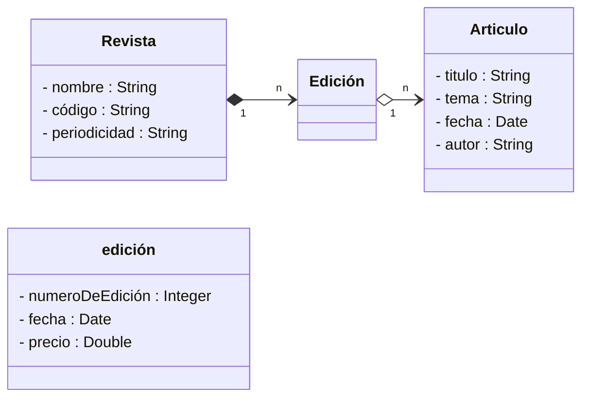
```mermaid
classDiagram
  direction LR
  class Revista {
    - nombre : String
    - código : String
    - periodicidad : String
  }
  class edición{
    - numeroDeEdición : Integer
    - fecha : Date
    - precio : Double
  }
  class Articulo{
    - titulo : String
    - tema : String
    - fecha : Date
    - autor : String
  }
  Revista "1" *--> "n" Edición
  Edición "1" o--> "n"Articulo
```

**Otro ejemplo**

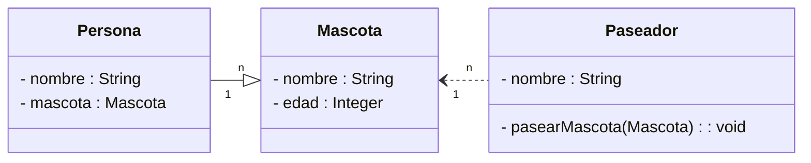
```mermaid
classDiagram
  direction LR
  class Persona {
    - nombre : String
    - mascota : Mascota
  }
  class Mascota{
    - nombre : String
    - edad : Integer
  }
  class Paseador {
    - nombre : String
    - pasearMascota(Mascota) : void
  }
  Persona "1" --|> "n" Mascota
  Mascota "1" <.. "n" Paseador

```

Si el método lo tiene el paseador, el paseador usa a la mascota y se muestra punteado 

## Actividad Mesa de trabajo:


## Notas clase 7 <a id='c7s'></a>

La relación de tiene como atributo a otra

La relación de usa, esa clase tiene como retorno o recibe como parametro algo de otra clase

# C8 - Herencia <a id='c8'></a>

## Proceso de abstracción <a id='c8a'></a>

Proceso para identificar los objetos, durante este proceso: 

✅ Identificamos las partes que integran nuestro “universo” o “dominio” según el contexto, 

✅ Interactúan esas partes a través de relaciones. 

Es así como llegamos a definir clases, con sus atributos y operaciones. Además, definimos qué debe hacer cada parte para contribuir a la solución del problema, es decir, establecimos las responsabilidades de las clases. 

En esta clase veremos la relación de herencia y sus beneficios.

> #### 🎬
> Video: Presentación de la herencia

> #### 📑
> pdf: Herencia

## Relación de Herencia <a id='c8b'></a>

✅ la herencia es un ordenamiento entre clases que define una relación “es un”

✅ conocida como una relación del tipo **"es un"**

✅ Favorece la reutilización de código

✅ Permite modelar clases que tengan todo lo que tiene su superclase, tanto en atributos como en metodos

> ### 💡
> Una clase que hereda de otra, suma a sus propios atributos y responsabilidades los de la clase a la cual hereda.

## Relación de herencia en UML

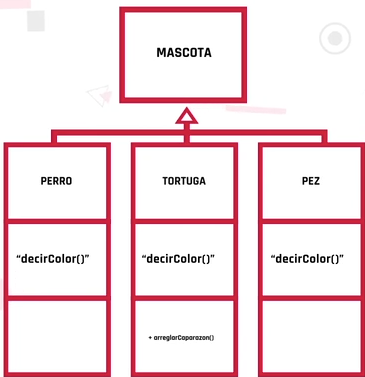

### 📜 Ejemplo #1

Teniendo en cuenta el siguiente diagrama que modela un sistema de una veterinaria:

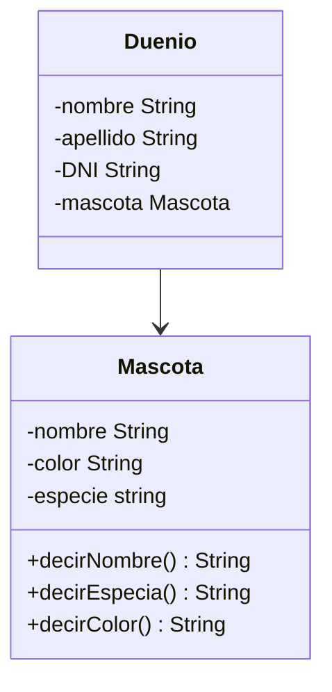
```mermaid
classDiagram

class Duenio{
    -nombre String
    -apellido String
    -DNI String
    -mascota Mascota
}
class Mascota{
    -nombre String
    -color String
    -especie string
    +decirNombre() String
    +decirEspecia() String
    +decirColor() String
}
Duenio --> Mascota
```
este sistema maneja el concepto de `Duenio` y `Mascota`

y entendemos por la relación de asociación que: Un duenio tiene una mascota.

Se necesita tener un control mas especifico sobre los animales que se atienden 

Necesitamos incorporar mas clases para ser mas especificos con cada tipo de mascota (perro, tortuga, pez...) y agregar atributos y responsabilidades propios de cada uno, ej: arreglarCaparazon de la tortuga.


Son todos el mismo concepto, con distintos atributos y comportamientos <r>pero su nucleo en su forma mas fundamental, son mascotas</r>

> ### 💡
> No hablamos de valores de los atributos, hablamos de atributos.

Las clases van a heredar nombre color especie y van a heredar sus responsabilidades, pero ademas van a agregar atributos y responsabilidades propios
que no se van a compartir con los otros componentes del sistema 

### 📜 Ejemplo #2

Todos los perros tiene un nombre, una edad y todos ladran y juegan. Cuando nos nombran estas características rápidamente reconocemos que se trata de un perro.

> Si analizamos un caniche, veremos como juega y ladra; si analizamos un Doberman, también veremos como juega y ladra, aunque lo hace muy distinto al caniche

Entonces, tanto el caniche como el Doberman juegan, ladran y ambos tienen nombre y edad: sería razonable asumir que si tienen y hacen todo lo que hace un perro, entonces, es un perro.

Por todo esto, podemos decir que un caniche es un Perro. De la misma manera que podríamos decir que Profesor es un Empleado, y más aún: un Empleado es una Persona, por lo tanto, un Profesor es una Persona.Nuevamente, al observar la realidad y pasar por el proceso de abstracción, obtuvimos una serie de entidades que se ordenan naturalmente, y la herencia responde a ello.


Podemos decir entonces que la herencia es un ordenamiento entre clases que define una relación “es un”. Entonces decimos que un caniche y un Doberman es un perro, porque tiene y hace todo lo que hace un perro.

**¿Para qué sirve la herencia?**

Esta es una pregunta interesante, ya que la herencia es uno de los pilares de la orientación a objetos. Si analizamos el esquema anterior, tanto Caniche como Doberman hacen lo mismo que hace el perro. ¿Si hacen lo mismo que el perro, para qué escribir el código de lo que hacen? ¿No sería más conveniente escribirlo una sola vez en la clase Perro y que Doberman, Caniche, “obtengan” este comportamiento desde Perro?

De hacer esto, decimos que Caniche y Doberman “heredan” el comportamiento de un perro, es decir, la clase Doberman hereda de la clase Perro, todos sus atributos y responsabilidades favoreciendo la reutilization


### 📜 Ejemplo #3

Jerarquía de empleados:

#### Gerente

Además de los atributos fechaAscenso y montoPresupuesto, tiene los atributos nombre, dirección y salario que hereda de Empleado como así también las responsabilidades ingresa() y egresa().

#### Gerente de proyecto

Además del atributo tipoProyecto y la responsabilidad de planificarProyecto() tiene todos los atributos y responsabilidades de Gerente y Empleado

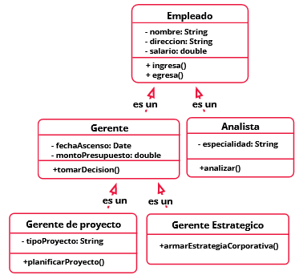

### 📜 Ejemplo #4

Jerarquía de personas

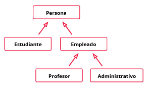

## Herencia múltiple <a id='c8d'></a>

✅ Se establece cuando una clase hereda de varias otras clases, en este caso, 
✅ La clase hija hereda atributos y responsabilidades de los diferentes padres


> ### 💡
> El uso de herencia múltiple requiere una consideración muy atenta para evitar la superposición funcional de atributos y responsabilidades.

> ### ❌
> En Java no está permitida la herencia múltiple y al no ser considerada una buena práctica de diseño no la utilizaremos en esta materia.


>### 👍
> Como el uso de la herencia lo tendremos prohibido, buscaremos la manera siempre de mantener una línea de herencia.

## Generalización y especialización <a id='c8e'></a>

[Generalización y especialización](https://view.genial.ly/60c153221f2fc20d9c415ed8)


### Generalización

Nos encontramos en el modelo que estamos realizando un conjunto de clases, por ejemplo, Caniche y Doberman. Nos damos cuenta que ambas tienen algunos atributos y/o responsabilidades comunes. En dicho caso:

✅ Creamos una clase de la cual ambas heredarán ambas y 

✅ Transportamos todos los atributos y/o responsabilidades que eran comunes a esta nueva clase que, en este ejemplo, llamaremos Perro. 

Este proceso mental de abstracción lo llamamos generalización.

### Especialización

Nos encontramos en el modelo que estamos realizando con que modelamos una clase Perro y, analizando mejor el contexto, nos dimos cuenta que hay perros como el Doberman que tienen además de los atributos y/o responsabilidades que describimos otros diferentes que no tienen todos los perros, como, por ejemplo, `cuidar()`, ya que los caniches no cuidan. En este caso:

✅ Creamos una clase y le colocamos estos atributos y/o responsabilidades que únicamente tiene ese tipo de perro, en este ejemplo, esas clases son Doberman y Caniche. 

Este proceso mental de abstracción lo llamamos especialización.

> #### 📑
> pdf: Ejercitación Modelado Herencia Inicial

## Alcance, protected <a id='c8f'></a>

## Encapsulamiento y la herencia

Ahora que ya aprendimos a modelar relaciones de herencia y tenemos en claro el concepto de encapsulamiento, analizaremos cómo se comporta la herencia frente al encapsulamiento.

Cuando una propiedad es pública significa que es accesible desde cualquier clase. Es decir, en el momento en que un objeto quiera acceder a un valor público puede obtenerlo y modificarlo sin ninguna operación de por medio. Esto sería el equivalente a no ocultar información y, por lo tanto, “romper” el encapsulamiento.

Por el contrario, si declaramos un atributo privado limitamos completamente el acceso al dato. Nadie que no sea la propia clase puede acceder a ese dato. Siempre que se quiera acceder o modificar el dato, se debe hacer una operación para tal fin, por ejemplo, a través de getters o setters.

## Modificador de visibilidad (#) <a id='c8g'></a>

> ### 💡
> Con la herencia <r>aparece un modificador de visibilidad nuevo llamado **protegido**</r>, que en los diagramas UML se especifica con el **“#”**, donde nos permite tener una visibilidad intermedia del atributo o método al que declaramos como tal. Es decir, es privado para otras clases, pero público para las clases hijas. 

El uso de este modificador de visibilidad “rompe” el encapsulamiento y evitaremos en lo posible su uso como buena práctica.

Veamos esto en el siguiente ejemplo gráfico:

[El modificador de visibilidad](https://view.genial.ly/60c13148ddae960d163e85a6)


`- nombre: String`: Este atributo es privado y solo puede ser accedido o modificado por otras clases o las clases hijas a través de un método get() o set().

`# edad: int`: Este atributo es protegido y no podrá ser accedido o modificado por otras clases, excepto por sus clases hijas.

`+ jugar()`: Este método es público y puede ser accedido por cualquier clase y, por consiguiente, por cualquier clase hija.

`# ladrar()`: Este método es protegido, con lo cual no podrá ser invocado por ninguna otra clase, excepto por las clases hijas.

## Firmas de un método <a id='c8h'></a>

✅ Una firma nos permite identificarnos y 

✅ Expresar nuestro consentimiento de un determinado documento. 

✅ En nuestro documento de identidad podemos encontrar muchos elementos, entre ellos está la firma o rubrica.

✅ La firma de un método en la programación orientada a objetos <r>es la definición completa de un método, es decir, su nombre, sus parámetros y sus tipos y el orden de aparición de dichos parámetros.</r>

No podrán en una misma clase existir dos métodos con la misma firma, es decir, con el mismo nombre y cantidad de parámetros con sus respectivos tipos en el mismo orden. 

Los siguientes métodos tienen diferentes firmas, son métodos diferentes porque, si bien se llaman igual, tienen diferente cantidad de parámetros o difiere alguno de sus tipos:

`+ sumar(numero1: double, numero2: double): double`

`+ sumar(numero1: double, numero2: double, numero3: double): double`

`+ sumar(numero1: int, numero2: int): int`

## Sobrecarga y Sobreescritura

> #### 📑
> pdf: Sobrecarga y Sobreescritura

### Sobrecarga de métodos <a id='c8i'></a>

La sobrecarga de métodos está relacionada con la firma de los mismos

✅ los métodos sobrecargados pueden devolver cosas diferentes o lo mismo.

✅ El nombre y cantidad, tipo y orden de parámetros forman parte de la firma de un método y deben ser diferentes para poder sobrecargarlo

✅ Lo que devuelve un método no forma parte de la firma

### 📜 Ejemplo!

el método `ladrar()` está sobrecargado, ambos métodos tienen diferente firma.

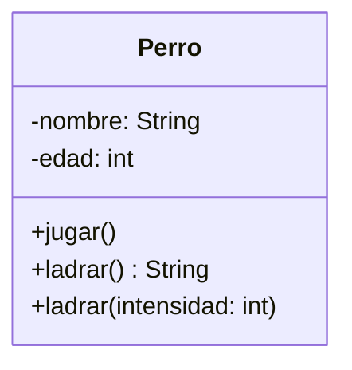
```mermaid
classDiagram

class Perro {
-nombre: String
-edad: int
+jugar()
+ladrar() String
+ladrar(intensidad: int)
}
```
> ### ❌
> El valor que devuelve un método y los modificadores de visibilidad no forman parte de la firma

## Sobreescritura de métodos <a id='c8j'></a>

✅ volver a escribir algo existente

✅ Para poder sobreescribir métodos necesitamos una relación de herencia, ya que:

✅ Lo que vamos a sobreescribir es un método de la superclase para que se comporte diferente en la subclase.

> ### 💡
> A diferencia de la sobrecarga donde los métodos tienen que tener diferente firma, en este caso, los métodos deben tener la misma firma

Al escribir en las subclases el método ladrar() estamos diciendo que dicho método está sobrescrito y, por ende, se comporta diferente

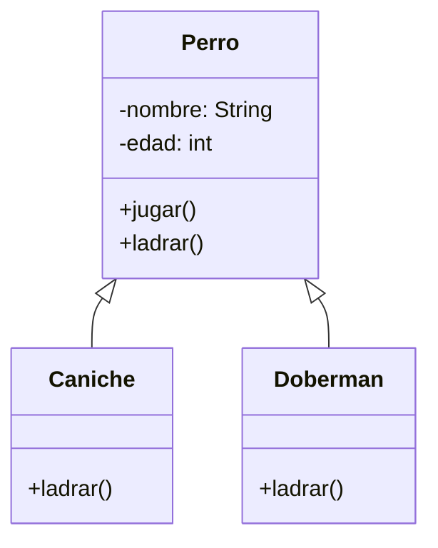
```mermaid
classDiagram
    class Perro{
    -nombre: String
    -edad: int
    +jugar()
    +ladrar()
    }
    class Caniche{
    +ladrar()
    }
    class Doberman{
    +ladrar()
    }

    Perro <|-- Caniche
    Perro <|-- Doberman
```

> Ver pdf: Ejercitación Modelado Herencia I.pdf
<!-- HACER -->

## Actividad en clase

**Ejercicio 1**

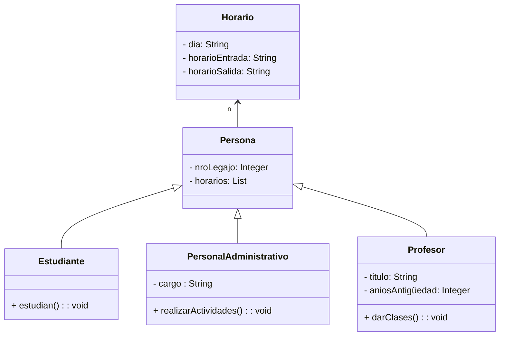
```mermaid
classDiagram
direction TB

class Horario {
    - dia: String
    - horarioEntrada: String
    - horarioSalida: String
}
class Persona {
    - nroLegajo: Integer
    - horarios: List<Horario>
}
class Estudiante {
    + estudian(): void
}
class PersonalAdministrativo {
    - cargo : String
    + realizarActividades(): void
}
class Profesor {
    - titulo: String
    - aniosAntigüedad: Integer
    + darClases(): void
}

Horario "n" <-- Persona
Persona <|-- Estudiante
Persona <|-- PersonalAdministrativo
Persona <|-- Profesor
```

**Ejercicio 2**

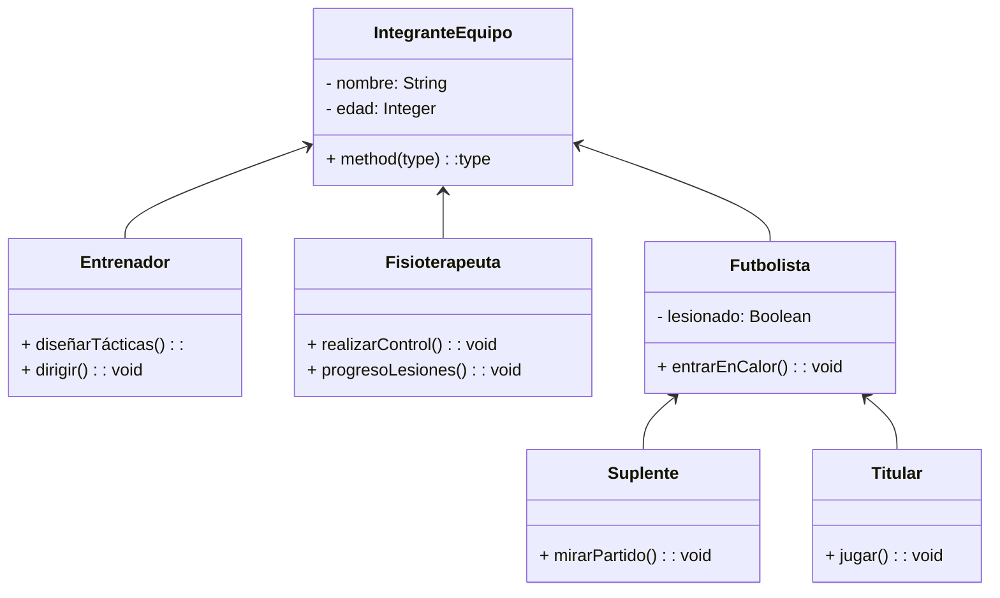
```mermaid
classDiagram
direction TB

class IntegranteEquipo {
    - nombre: String
    - edad: Integer
    + method(type):type
}
class Entrenador {
    + diseñarTácticas():
    + dirigir(): void
}
class Fisioterapeuta {
    + realizarControl(): void
    + progresoLesiones(): void
}
class Futbolista {
    - lesionado: Boolean
    + entrarEnCalor(): void
}
class Suplente {
    + mirarPartido(): void
}
class Titular {
    + jugar(): void
}

IntegranteEquipo <-- Entrenador
IntegranteEquipo <-- Fisioterapeuta
IntegranteEquipo <-- Futbolista
Futbolista <-- Suplente
Futbolista <-- Titular

```

## Notas clase 9

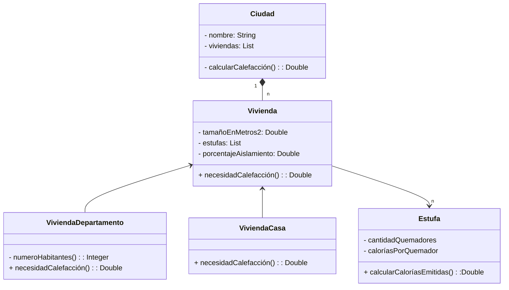
```mermaid
classDiagram
class Ciudad {
- nombre: String
- viviendas: List<Vivienda>
- calcularCalefacción(): Double
}
class Vivienda {
- tamañoEnMetros2: Double
- estufas: List<Estufa>
- porcentajeAislamiento: Double
+ necesidadCalefacción(): Double
}
class ViviendaCasa {
+ necesidadCalefacción(): Double
}
class ViviendaDepartamento {
- numeroHabitantes(): Integer
+ necesidadCalefacción(): Double
}
class Estufa {
    - cantidadQuemadores
    - caloríasPorQuemador
    + calcularCaloríasEmitidas():Double
}
Ciudad "1" *-- "n" Vivienda
Vivienda <-- ViviendaDepartamento
Vivienda <-- ViviendaCasa
Vivienda --> "n" Estufa
```

# C9 - Repaso <a id='c9'></a>

> #### 📑
> pdf: Integrador
<!-- HACER -->

# C10 - Herencia en Java <a id='c10'></a>

✅ Siembre lo que hacemos en el constructor de la subclase, es invocar el constructor de la superclase, respetando si tiene parametros o no.

✅ Usamos la palabra `super`

> #### 🎬
> Video: Herencia en Java.mp4

> #### 📑
> pdf: Sobrecarga y Sobreescritura

### 📜 Ejemplo #1

✅ Un empleado tiene características y responsabilidades

✅ Estas características, se agregan a las que ya tenían por ser persona, lo mismo sucede con las responsabilidades.

Es decir, el empleado hereda todo lo que tenia como persona.


En el codigo:

✅ Se indica la herencia mediante la palabra `extends`


✅ La superclase y la subclase tienen constructor, pero cada uno se debe encargar de sus atributos, entonces el constructor en Persona queda asi:


✅ Antes de empezar a trabajar con los atributos propios, se invoca al constructor de la superclase (Persona)

> ### 💡
> Siembre lo que hacemos en el constructor de la subclase, es invocar el constructor de la superclase, respetando si tiene parametros o no.
>
> usamos la palabra `super`

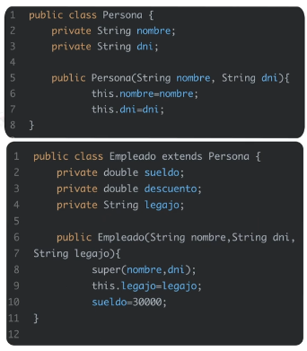

Un empleado es una persona, y hereda todas sus características y responsabilidades, por esto:

> ### 💡
> Es necesario antes de crear sus atributos de Empleado, se creen sus atributos de persona.
> Esto lo logramos con la superclase que como método, hace referencia a su constructor.

## Actividad PG: <a id='c10a'></a>

**Ejercicio Herencia**

Tenemos la clase cuenta bancaria que tiene como atributos numero y saldo. 

A partir de esta clase Cuenta, queremos extender en CuentaCorriente, que agrega un atributo descubierto.

El descubierto lo vamos a fijar inicialmente en $1000. Descubierto es un valor que se permite extraer aunque no haya saldo.

Te pedimos agregar los métodos setters y getters para la nueva clase.

### UML

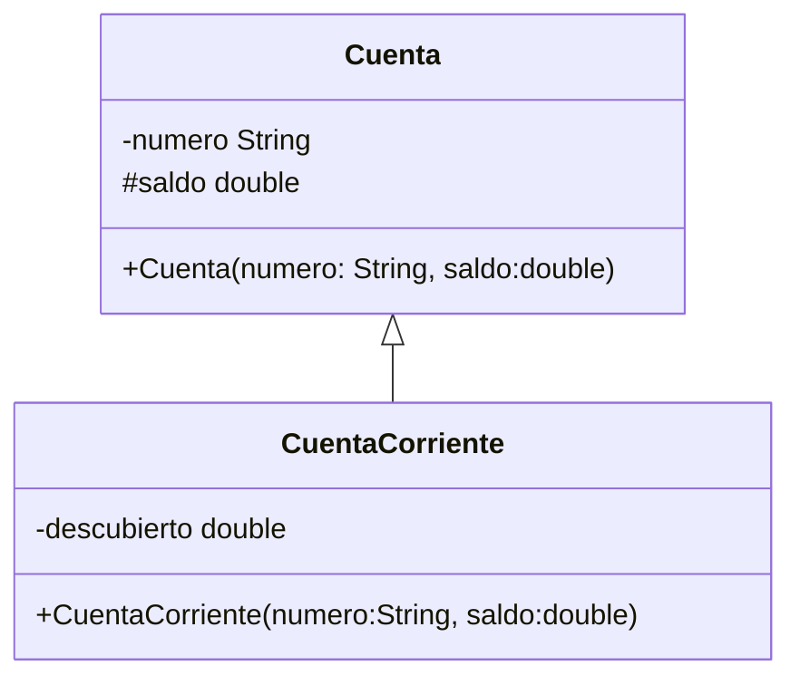
```mermaid
classDiagram

class Cuenta{
    -numero String
    #saldo double
    +Cuenta(numero: String, saldo:double)
}

class CuentaCorriente{
    -descubierto double
    +CuentaCorriente(numero:String, saldo:double)
}

Cuenta <|-- CuentaCorriente
```
En `Cuenta.java`

```java
package com.company;

public class Cuenta {
    private String number
    protected double saldo;

    public Cuenta(String numero, double saldo) {
        this.numero = numero;
        this.saldo = saldo;
    }
}
```

En `CuentaCorriente.java`

```java
package com.company;

public class CuentaCorriente extends Cuenta {
    private double descubierto;

    public CuentaCorriente(String numero, double saldo) {
        super(numero, saldo);
        descubierto = 1000;
    }

    public double getDescubierto() {
        return descubierto;
    }

    public void setDescubierto(double descubierto) {
        this.descubierto = descubierto;
    }
}
```

## Sobrecarga y sobreescritura en Java

## Sobrecarga en Java <a id='c10b'></a>

✅ Mismo nombre distinto comportamiento

✅ Solo podemos sobrecargar un método si varía su firma. 

✅ Cuando se utilizan los métodos, según los parámetros que se pasan, 
actuará el método cuya firma coincida con los parámetros utilizados.

### 📜 Ejemplo!

Un empleado tiene un legajo y un sueldo. Su sueldo se puede calcular simplemente restando los descuentos al sueldo básico. Ocasionalmente, recibe un premio, por lo que el cálculo del sueldo en ese caso varía, ya que habría que sumarle este premio. 
Por otro lado, hay vendedores, que también son empleados, en este caso, además de su sueldo básico, reciben una comisión por venta. 

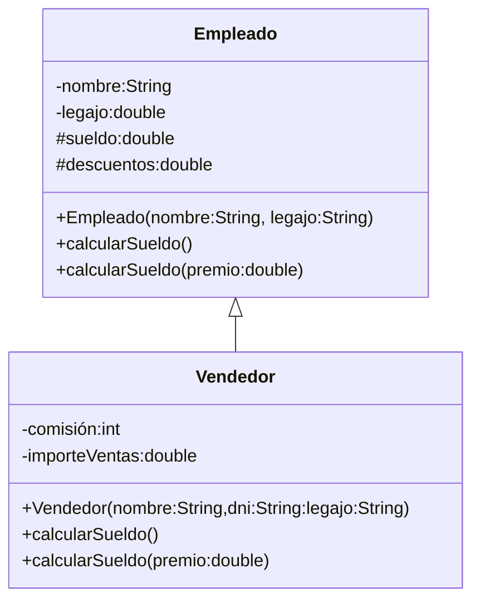
```mermaid
classDiagram

class Empleado{
    -nombre:String
    -legajo:double
    #sueldo:double
    #descuentos:double
    +Empleado(nombre:String, legajo:String)
    +calcularSueldo()
    +calcularSueldo(premio:double)
}
class Vendedor{
    -comisión:int
    -importeVentas:double
    +Vendedor(nombre:String,dni:String:legajo:String)
    +calcularSueldo()
    +calcularSueldo(premio:double)
}

Empleado <|-- Vendedor
```

En `Empleado.java`

```java
public class Empleado{
    private   String nombre;
    private   String legajo;
    protected double sueldo;
    protected double descuentos; 

    public double calcularSueldo(){
        return sueldo-descuentos;
    }
    public double calcularSueldo(double premio){
        return sueldo-descuentos + premio;
    }
}
```

Cuando lo usamos en `Main.java`

```java
public class Main {

    public static void main(String[] args) {
        
        Empleado miEmpleado = new Empleado("Juan", "1111");
        System.out.println("Sueldo a cobrar: " + miEmpleado.calcularSueldo());
        System.out.println("Sueldo a cobrar: " + miEmpleado.calcularSueldo(5000)); 
        
    }
}
```

## Sobreescritura en Java <a id='c10c'></a>

✅ Cuando necesitamos otro comportamiento para los metodos, los sobreescribimos.

✅ Lo indicamos con `@Override`

✅ `@Override` Nos indica que se anula el comportamiento anterior del método

✅ Lo sobreescribimos para darle una forma distinta de resolver.


### 📜 Ejemplo!

A la clase Vendedor, con los métodos sobreescritos, es necesario darles otro comportamiento para un Vendedor. Por eso, surge la necesidad de sobreescribirlos

En `Empleado.java`

```java
public class Vendedor extends Empleado{
    private int comision;
    private double importeVentas;

    @Override
    public double calcularSueldo(){
        return sueldo - descuentos + importeVentas/100* comision;
    }

    @Override
    public double calcularSueldo(double premio){
        return sueldo - descuentos + premio+ importeVentas/100* comision;
    }
}
```
> ### 💡
> Para los objetos Vendedor, el método a ejecutar es este que sobreescribe el anterior.

## Anotación @Override <a id='c10h'></a>

**Redefinición de método, ¿cómo evitar equivocarnos?**

Vimos que para redefinir un método de una superclase, debemos sobrescribir el mismo, es decir, tenemos que escribir el mismo método con la misma firma en la subclase.

Sin embargo, ¿qué sucede, si cuando intentamos sobrescribir este método en la subclase tipeamos mal el nombre o nos olvidamos alguno de sus parámetros? Lo que pasaría es que la firma de este método sería diferente a la de la clase padre que intentábamos sobrescribir y este error no sería descubierto durante la compilación, excepto que sea un método abstracto.

Pero no nos preocupemos...

En Java existe una anotación llamada @override que podemos escribir en el método que estamos sobrescribiendo. Con esta anotación el compilador validará que ese método que estamos sobrescribiendo tenga una firma igual a algún método de la superclase y nos ayudará a no tener estos errores.

```java
public class Perro {
    public String ladrar() {
        return “guau”;
    }
}            

```
```java
public class Doberman extends Perro{
    @Override
    public String ladrar() {  
        return “GUAU GUAU!!!”;
    }
}
```

La anotación `@Override` le pide al compilador que verifique que efectivamente estamos redefiniendo un método de la superclase. 

A continuación, te mostramos un ejemplo donde el compilador emitirá un error, al no encontrar en la superclase Perro, un método con la misma firma donde colocamos la anotación `@Override`. 

```java
public class Doberman extends Perro{
    @Override
    public String ladrar(int intensidad) {
        return “GUAU GUAU!!!”;
    }
}
```

> ### [📌Actividad: PG > @Override > Extends > descubierto](./Actividades/pg-overridepreparcial-.md) <a id='c10d'></a>
> Override > Cuenta > CuentaCorriente > descubierto

## La clase Object <a id='c10e'></a>

- Todas las clases que creamos en Java derivan de la clase Object, 
- Cuando creamos una clase nueva, tiene ciertos métodos que hereda. 
- si no los implementamos, los objetos que instanciamos tendrán este método

De estos métodos vamos a tomar algunos y para que funcionen correctamente, debemos **sobreescribirlos**. 

> ### 💡
> El comportamiento que tienen por defecto puede causar errores o no ser el más adecuado.

### Métodos heredados

✅ String `toString()`

✅ int `hashCode()`

✅ boolean `equals(Object o)`

> #### 📑
> pdf: Sobreescribir toString - hashCode
> pdf: Sobreescribir equals().pdf

#### Método .toString()

- El método .toString(), intenta representar con texto el objeto
- Al usar el método, no tendríamos un error, pero la información mostrada no sería algo comprensible

### 📜 Ejemplo!

```java
public static void main(String[] args) {
   Empleado nuevoEmpleado = new Empleado("Juan","1111");
   System.out.println(nuevoEmpleado.toString());
}
```
En consola tendriamos:

```
com.company.Empleado@540e19d
```

>### 👍
> La solución es sobreescribir el método mostrando solo la información que deseamos mostrar y dándole a la cadena de salida el formato más adecuado.

> ### 💡
> Recordemos que es importante no cambiar la firma del método, sino estaremos sobrecargando

### 📜 Ejemplo!

Agregamos el método toString() y devolvemos la cadena con la información del objeto que queremos devolver.

```java
public class Empleado{
    private String nombre;
    private String legajo;
    protected double sueldo;
    protected double descuentos; 
    
    @Override
    public String toString(){
        return "Nombre: " + nombre + "\n" + "Legajo: " + legajo;
    }
}
```
La salida que obtenemos es la que nosotros programamos, en este caso, el 
nombre y el legajo.

```java
public static void main(String[] args) {
    Empleado nuevoEmpleado = new Empleado("Juan","1111");
    System.out.println(nuevoEmpleado.toString());
}
```
En consola:
```
Nombre: Juan
Legajo: 1111
```

#### Método .hashCode()

Cuando se utiliza este método nos <r>devuelve un número único que identifica al objeto</r>, es decir, si tengo dos objetos de la misma clase, el hashCode() generaría un número distinto para 
cada uno y ese número me va a servir para identificarlo.

<r>Lo que tenemos que asegurarnos es que este código identificador sea único para cada objeto</r>

Lo sobreescribimos:

```java
public class Empleado{
    private String nombre;
    private String legajo;
    protected double sueldo;
    protected double descuentos; 

    @Override
    public int hashCode(){
        int hash=31;
        hash= hash* nombre.hashCode();
        hash= hash* legajo.hashCode();
        return hash;
    }
}
```

La clase Empleados con el .hashCode() sobrecargado. 
A continuación, veremos cómo se resuelve.

Para generar un número único:

✅ Se trabaja con números primos. Puede ser cualquier número primo, en este caso se usó el 31.

✅ Como nombre y legajo son strings, o sea, también son objetos, tienen su propio hashCode(). 

✅ Multiplicamos todos los números y obtenemos el hashCode del objeto. 

✅ En una string, el hashCode se genera a partir de los caracteres. 

Por ejemplo, el número de legajo es siempre distinto. 

Con la sobrecarga que hicimos, obtenemos el valor que se muestra:

```java
public static void main(String[] args) {
    Empleado nuevoEmpleado = new Empleado("Juan","1111");
    System.out.println(nuevoEmpleado.hashCode());
}
```

En consola:

```
-1480218112
```

#### Método .equals(Object o)

Cuando creamos un objeto o instancia, lo que tenemos es una referencia a la memoria (RAM), es decir, no se almacenan datos directamente en la variable de tipo objeto, solo la referencia al lugar donde están los valores de los atributos del objeto. Es por eso que no podemos utilizar el operador “==” para comparar la igualdad entre dos objetos porque estaríamos comparando referencias.

Para comparar correctamente debemos usar el método `equals()`, el cual lo heredamos de Object, pero no siempre funciona correctamente el equals que obtenemos por defecto, por eso, es necesario sobreescribirlo. 

> ### 💡
> El método equals() recibe como parámetro un objeto Object, esto nos dará una dificultad adicional a la hora de sobreescribirlo. 
>
>Recordemos que no podemos cambiar la firma del método si queremos sobreescribirlo.

✅ Cuando escribimos una clase, una de las cosas que debemos determinar es cómo vamos a comprobar la igualdad de dos instancias de esa clase.

### 📜 Ejemplo!

Antes de comenzar a trabajar con el equals, debemos pensar qué quiere decir que dos objetos son iguales. 

Por ejemplo: si comparamos dos empleados, podríamos definir que son iguales si sus legajos son iguales.

Como ejemplo vamos a trabajar con la clase empleado y, tal como mencionamos, dos empleados son iguales si sus legajos también lo son.

```java
public class Empleado{
    private String nombre;
    private String legajo;
    protected double sueldo;
    protected double descuentos; 
}
```

Vamos a sobreescribir el `.equals(Object o)`. 

Nuestro primer paso es recordar cómo es la firma de este método, <r>debemos respetar la firma del equals() heredado de Object</r>

```java
public class Empleado{
    private String nombre;
    private String legajo;
    private double sueldo;
    private double descuentos; 
    
    @Override
        public boolean equals(Object o){
    }
}
```

Para comenzar a escribir nuestro equals, debemos considerar que el parámetro que me está llegando es un Object, no dice que sea un Empleado, entonces, <r>lo primero a verificar es si realmente es un Empleado, si no lo fuera ya podemos decir que no son iguales.</r> 

Vamos a ver dos formas de comprobarlo:

✅ instanceof 

✅ getClass()

#### Operador instanceof <a id='c10f'></a>

Una forma de comparar dos instancias.

```java
@Override
public boolean equals(Object o){
    //Por ser un objeto podría tener valor null, es lo primero que comprobamos.
    if (o == null)
        return false;
    //instanceof es un operador que nos permite comprobar si es o no, una instancia de Empleado. En este caso, si no lo es devolvemos falso, los objetos no pueden ser iguales.
    if (!(o instanceof Empleado))
        return false;
    //Si es una instancia de Empleado, sigue la comprobación.
    else{
    }
} 

```

#### Método .getClass()

Con getClass() también podemos comparar la clase a la que pertenecen los objetos.

```java
@Override
public boolean equals(Object o){
    if (o==null)
        return false;
    //Comprobamos si la clase de la instancia es la misma clase del objeto recibido como parámetro.
    if (this.getClass() ==  o.getClass())
        return false;
    else{
    } 
}
```

### Casteo / Casting

Con el casting lo que logramos es transformar, para poder asignarlo a un objeto de tipo Empleado y de esta forma usar sus métodos.

Ahora nos restaría comprobar la igualdad (tener el mismo legajo). 
Para hacer esta comprobación, vamos a necesitar pedirle a "o", el legajo para compararlo con el de la instancia. Pero “o” es un Object, o sea, no “sabe” que tiene legajo.

Asi quedaria el método terminado, pero para mayor comodidad usamos un casteo. <r>Si bien no es necesario, crear un nuevo objeto, es más cómodo para una posterior lectura.</r>

con instansof:

```java
@Override
public boolean equals(Object o){
    if (o==null)
        return false;
    if (!(o instanceof Empleado))
        return false;
    else{
        //Casteamos/transformamos “o” y lo asignamos a un objeto de tipo Empleado y de esta forma usar sus métodos.
        Empleado empleadoAux = (Empleado)o;
        return 
        this.getLegajo().equals(empleadoAux.getLegajo());
    } 
}
```

con .getClass()

```java
@Override
public boolean equals(Object o){
    if (o==null)
        return false;
    if (this.getClass()==o.getClass())
        return false;
    else{
        //Casteamos/transformamos “o” y lo asignamos a un objeto de tipo Empleado y de esta forma usar sus métodos.
        Empleado empleadoAux = (Empleado)o;
        //Comprobamos que tiene el mismo legajo, lo hacemos con equals. Legajo es un atributo de tipo String, por eso, no podemos usar el operador "==".
        if(this.getLegajo().equals(empleadoAux.getLegajo()));
            return true;
        }   
        return false;
    } 
}
```

> ### [📌Actividad: PG > Herencia (Object) > hashCode() > equals() > instanceof > @Override](./Actividades/pg-herencia-objectpreparcial-.md) <a id='c10g'></a>
> Herencia (Object) > hashCode() > equals() > instanceof > @Override

> #### 🎬
> Video: live coding - herencia.mp4

> #### 📑
> pdf: Practica clase 10

# C11 - Clases abstractas <a id='c11'></a>

Las clases abstractas son aquellas que por sí mismas no se pueden identificar con algo “concreto” (no existen como tal en el mundo real).

Poseen determinadas características que son comunes en otras clases que heredarán de esta.

<r>Estas clases abstractas nos permite declarar métodos, pero que estos no estén implementados,</r> o sea, que no hacen nada en la clase abstracta, y estos métodos que también llamaremos abstractos obligarán a las subclases a sobreescribirlos para darles una implementación.

## Clases abstractas

> #### 🎬
> Video: Clases abstractas

✅ Una clase abstracta puede tener atributos y métodos que serán heredados por las subclases 

✅ También puede contener métodos abstractos que actúan como un contrato obligando a estas subclases a implementar dichos métodos. 

✅ Los metodos en la clase abstracta no hacen nada, en las clases que los heredan si.

✅ Las subclases heredan los metodos de la clase abstracta y los sobreescriben para implementarlos

✅ No creamos instancias de esa clase

✅ Sirve para agrupar clases

✅ Agrupa clases bajo un criterio especifico

✅ Permite compartir características y comportamientos en común


En el UML se indica asi:


> ### 💡
> Se utiliza en estrecha asociación a la idea de herencia
>
> No olvidemos que no podremos instanciar objetos de una clase abstracta
>
> Si bien una clase abstracta puede tener uno o varios métodos abstractos, no es obligatorio que los tenga.

> #### 📑
> pdf: Clases Abstractas en el Diseño

### Clase abstracta en UML <a id='c11a'></a>

Las representaremos ya sea indicando su nombre en forma cursiva o explicitando arriba de su nombre que es abstracta `<<abstract>>`

```mermaid
classDiagram

class Perro{
    <<abstract>>
    -nombre String
    -edad int
    +jugar()
    +ladrar()
}
```

### Clase abstracta en Java <a id='c11b'></a>

✅ Definimos a las clases abstractas y el comportamiento en abstracto con la palabra clave “abstract”. o el nombre en cursiva

✅ Cómo el comportamiento es abstracto (solo decimos qué hacer) 

✅ los métodos abstractos no tienen código asociado, no tienen “cuerpo”.  

Veamos un ejemplo:

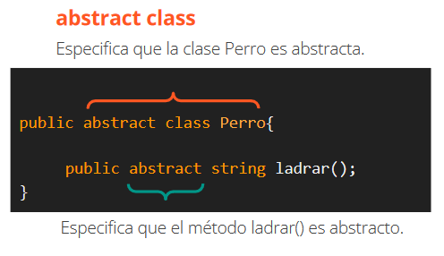


### 📜 Ejemplo!

Al contar la clase abstracta Perro con un método abstracto, obliga a la clase Caniche y Doberman a sobrescribir dicho método implementandolo.

```mermaid
classDiagram

class Perro{
<<abstract>>
-nombre: String
-edad: int
+jugar()
+ladrar()* String
}

class Caniche {
+ladrar()
}

class Doberman{
+ladrar()
}

Perro <|-- Caniche
Perro <|-- Doberman

```
> ### 💡
> Todo Perro debe ladrar(), pero solo cada Perro específico sabe “cómo” debe ladrar.

### 📜 Ejemplo: Empleado abstracto 

En el siguiente modelo UML, se muestra a una Compañía que tiene varios tipos de empleados y cuyo cálculo de sueldo es diferente en cada caso.


### 📜 Ejemplo: Rol abstracto

Los diferentes docentes en un instituto tienen diferentes roles y si bien todos los roles preparan la clase, reparten su tiempo de manera diferente según el rol.


>### 💡
> Martin Fowler describió a esta problemática de roles “Role Object” como un patrón de diseño para modelar roles, siendo una buena práctica a la hora de modelar esta problemática.


## Metodos abstractos <a id='c11c'></a>

✅ Las reglas para la implementación de los métodos abstractos son las de la sobreescritura

> #### 📑
> pdf: Metodos abstractos.pdf

### Los metodos abstractos en UML <a id='c11d'></a>

Al convertir en abstracto al método ladrar nos indica que el mismo no está implementado en la clase Perro y deberá implementarlo toda clase que herede de Perro.

```mermaid
classDiagram
class Perro{
    <<abstract>>
    -nombre: String
    -edad: int
    +jugar()
    +ladrar()* String
}
```

### Métodos abstractos en Java <a id='c11e'></a>

Si **Doberman quiere SER UN Perro**, entonces <r>debe respetar el contrato de los Perros: debe implementar un método que se llame ladrar, que devuelva un String y que no reciba parámetros</r>. 

En pocas palabras, <r>debe sobrescribir todos los métodos abstractos definidos en Perro.</r>

```java
public class Doberman extends Perro{
    public String ladrar() {
        return "ladro como un Doberman GUAU!!!";
    }
}
```

Es decir, si ***Perro*** dice qué todos los perros deben `ladrar()`, la hija **Doberman**, debe “explicar” cómo hacerlo. 
Llamaremos a esta operación “implementar” el método `ladrar()`.

```java
public class Doberman extends Perro{

}
```
> ### ❌
> En este caso, la clase Doberman arrojará un error de compilación, porque no respeta el contrato de la clase Perro.

### Sobreescribir metodos abstractos <a id='c11f'></a>


Si **Caniche quiere SER UN Perro**, también debe sobrescribir todos los métodos abstractos definidos en Perro.


```java
public class Caniche extends Perro{
    public string ladrar() {
        return "ladro como un caniche guau...";
    }
}
```

> ### 💡
> ✅ Cuando implementamos los métodos, estos dejan de ser abstractos, por eso, en Doberman y Caniche ya no usamos la palabra clave abstract. 
>
> ✅ Las reglas para la implementación de los métodos abstractos son las de la sobreescritura (de hecho, es lo que estamos haciendo, sobrescribiendo comportamiento abstracto) así que aplican las mismas reglas: respetar tipo, cantidad y orden de los parámetros

> ### ❌
> Si no lo hacemos, entonces no respetamos el contrato, si no respetamos el contrato, la clase arrojará un error de compilación.

## Atributos y métodos en clases abstractas <a id='c11g'></a>

Una clase abstracta es una clase como cualquier otra y, por tanto, puede tener atributos y puede tener métodos concretos. Aun así:

✅ Tengamos en cuenta que solo los abstractos serán los que definan el contrato

```java
public abstract class Perro{
    private String nombre;
    public void setNombre(String nombre){
        this.nombre = nombre;
    }
    public String getNombre(){
        return nombre;
    }
    public abstract string ladrar();
}
```

**¿Por qué tener métodos concretos en una clase que no se puede instanciar?** 

✅ Porque estos métodos son susceptibles de ser reutilizados. 

✅ Por otro lado, <r>que una clase abstracta no se pueda instanciar, no significa que no pueda tener constructores</r>, 

✅ El objetivo es el mismo: <r>podemos definir constructores para reutilizar código cuando heredamos de esa clase abstracta.</r>

### 📜 Ejemplo!

```java
public class Prueba{
    
    public static void main(String[] args){
    Doberman perro1 = new Doberman();
        perro1.ladrar();
    Caniche perro2 = new Caniche();
        perro2.ladrar();
    }
}
```

### 📜 Ejemplo! ❌

```java
public class Prueba{
    
    public static void main(String[] args){
    Perro perro1 = new Perro();
        perro1.ladrar();
    }
}
```
> ### ❌
> Esto dará error al compilar. Recordá que por definición una clase abstracta NO puede ser instanciada.

> #### 📑
> pdf: Ejercitación Modelado Clase y Método Abstracto

## Binding (Vinculación) <a id='c11h'></a>


## Vinculación dinámica (dynamic binding)

La vinculación dinámica de una referencia funciona igual que un enchufe. En un enchufe se puede conectar diferentes cosas: un TV, una heladera, una notebook.

> ### 💡
> Veremos que en una referencia podremos apuntar a diferentes tipos de objetos.

Aquí, tanto la referencia como el objeto referenciado son del mismo tipo: 
Doberman. Sin embargo, es posible que la referencia y el objeto referenciado sean de distinto tipo.


En los lenguajes que no son tipados la referencia y el objeto pueden ser de cualquier tipo,

✅ En los fuertemente tipados como Java el objeto debe ser de una clase que tenga una relación del tipo **“es un”** respecto de la referencia


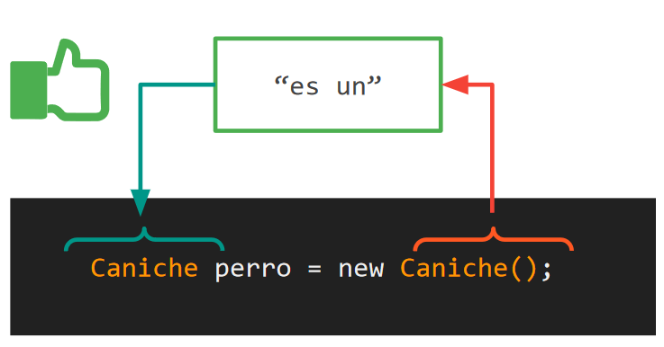

Vemos que en este caso la  referencia tiene un tipo diferente al objeto referenciado, pero cumple con la condición **“es un”**.


### ❌

Un perro no necesariamente siempre es un Doberman. Esto no está permitido.


Un Doberman puede tener cosas parecidas a un Caniche, pero no lo es.


En Java todas las clases por definición heredan de Object con lo cual un Doberman es un Object.


## Polimorfismo <a id='c11i'></a>

Es la capacidad de un mismo objeto de comportarse como otro. En otras palabras, es la capacidad de un objeto de funcionar de diversas formas.

Capacidad de un objeto de reaccionar de manera diferente a un mismo mensaje

> #### 📑
> pdf: Polimorfismo.pdf

Veamos con lo ejemplos anteriores:

```java
Perro p;
   p = new Doberman();
   p.ladrar();
   
   p = new Caniche();
   p.ladrar();
```

✅ La referencia p se puede comportar y ladrar como un Doberman. 

✅ Y la misma referencia p al vincularse dinámicamente (dynamic binding)  con un Caniche.

✅ Se comporta de forma diferente y ladra como un Caniche.

> ### 💡
> Si utilizamos polimorfismo, podemos estar seguros de que modificaciones futuras, que agreguen nuevas subclases, no deberían afectar el código ni su funcionamiento.

Si el código usa Perros (es decir, cualquier objeto que **“es un”** Perro) siempre que nuevas razas de perros introducidas al sistema hereden de Perro funcionaran correctamente. 

## Casting <a id='c11j'></a>
   
Supongamos que Doberman tiene un método llamado 
`morderComoDoberman()`, pero la referencia o sea la variable es del tipo Perro. Para forzar a un perro a que sea un Doberman utilizamos el casteo. De esta manera podremos invocar los métodos propios de Doberman.


Lo mismo sucede si nuestro objeto referencia es del tipo Object. En este caso como la clase Object no tiene tampoco el `métodoladrar()` debemos castearlo ya sea a Perro que tiene dicho método o a Doberman.


## Diferencias entre clases abstractas y clases concretas <a id='c11k'></a>


> #### 🎬
> Video: Te invitamos a ver el siguiente live coding donde mostramos un ejemplo de como crear una clase abstracta, métodos abstractos y el concepto de polimorfismo. 
> Video: Live coding: Clases abstractas

## Live coding: Clases abstractas <a id='c11l'></a>

#### Paso a paso del video:

A partir de un UML
1. Creamos la clase abstracta
2. Creamos los atributos de la clase abstracta
3. Construimos el constructor de la clase abstracta
4. Creamos el método abstracto: hacerRuido(), no lleva contenido, lo cerramos con `;`
5. Creamos las clases hijas: Perro y Gato

Clase Perro:
6. Usamos extends para indicar que la clase Perro es hija de la clase abstracta Animal
7. Creamos el constructor
8. Sobreescribimos la responsabilidad de hacerRuido que viene por contrato de Animal.
9. Escribimos el contenido de hacerRuido, que sera void ya que solo imprimirá por pantalla `guau`

Clase Gato:
10. Usamos extends para indicar que la clase Gato es hija de la clase abstracta Animal
11. Creamos el constructor
12. Sobreescribimos la responsabilidad de hacerRuido que viene por contrato de Animal.
13. Escribimos el contenido de hacerRuido, que sera void ya que solo imprimirá por pantalla `miau`

En el Main:
14. Creamos la variable animal de Tipo Animal
```java
Animal animal;
```
15. No se puede instanciar Animal porque es abstracta pero si instanciamos o Perro o Gato
```java
animal = new Perro('juano',5);
```
16. llamamos el método de animal:

```java
animal.hacerRuido();
//dirá en consola: guau
```
16. Igual con Gato
```java
Animal animal = new Gato('piero',7);
```
18. Por el polimorfismo, ahora hacerRuido:

```java
animal.hacerRuido();
//dirá en consola: miau
```

>### 📝 Quiz! <a id='c11m'></a>
> 
>**¿Qué relación entre objetos modela la herencia?**
>
> “Es un”
>
>**Una Clase Abstracta...**
>
> Puede no tener métodos abstractos
>
>**La sobreescritura...**
>
> Se dá dentro de un contexto de Herencia 
>
>**Dado el siguiente código donde la clase ImpresoraEmpson hereda de la clase Impresora:**
> ```java
> Impresora p = new ImpresoraEpson();
> p.imprimir();
> ```
>**¿Qué sucede en la primera línea y que sucede en la segunda línea?**
>
> Dynamic Binding, Polimorfismo
>
>**Polimorfismo**
>
> Sirve para alternar el comportamiento de los objetos durante la ejecución.

> #### 📑
> pdf: Practica clase 11

# C12 - Repaso <a id='c12'></a>

> #### 📑
>
> Practica clase 12
>
> zip: CuentasBanco
>
> resuelto-CuentasBanco.zip

# C13 - Interface <a id='c13'></a>

> #### 🎬
> Video: Que es una interface.mp4

> #### 📑
> pdf: Interfaces y la herencia.pdf

Interfaces son el concepto clave para agrupar clases a partir de comportamientos.

Cuando implementamos una interface solo obligamos a la clase que la implementa a sobreescribir, es decir, implementar, los métodos de la misma.

Tienen en común que son relaciones del tipo “es un”, con lo cual las interfaces también nos permite realizar vinculación dinámica y, por ende, polimorfismo

Lo que permiten las interfaces es independizarse de una jerarquía, <r>permiten agregar comportamiento a una clase que no se obtenga desde un nivel superior en la jerarquía, se “enchufa” lateralmente a la jerarquía.</r> 
Incluso podríamos hasta mezclar ambos mecanismos

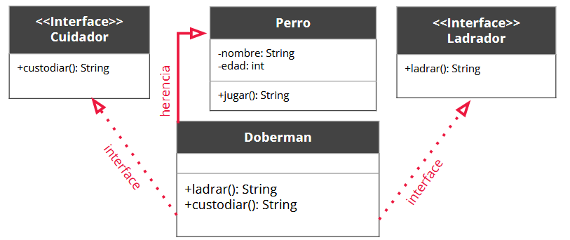


✅ Las interfaces son también relaciones del tipo “es un”,

✅ Una interface establece un contrato

✅ Se definen con la palabra clave `interface` en vez de class

✅ Las interfaces nos dan características compartidas por las clases; un contrato que deben cumplir, permite entenderlas de forma genérica, según su comportamiento.

✅ Todos sus metodos son abstractos, por eso no es necesario la palabra abstract, como estos, no definen cuerpo.

✅ En UML las interfaces no tienen atributos

✅ Se distinguen del resto de las clases poniendo el nombre entre simbolos dobles de mayor y menor 

✅ Se relacionan con una flecha como la herencia, pero punteada

✅ Cada clase que se le relacione debe implementar sus metodos.

✅ Las interfaces no nos permiten definir instancias.

✅ Una clase solo puede heredar de una sola clase, pero puede implementar múltiples interfaces. 

✅ Las interfaces son fáciles de identificar a traves de los sufijos: `...able` / `...ible` y representan los distintos comportamientos que van a tener las clases concretas.


### 📜 Ejemplo!

Modelando una impresora:

- Tendremos las clases `ArchivoPs` y `ArchivoDoc`
- Tendremos una clase impresosa que va a tener un método: `imprimir()` que va a recibir archivos por parametro.
- Una impresora imprime cosas que se puedan imprimir, sin importar que tipo de cosas son.
- Nos importan aquellos objetos que son de clases que se comportan de una forma particular, o sea, aquellos que **Son imprimibles** (imprimibles: Algo que se puede imprimir)
- Definimos el concepto de imprimibles con las interfaces.
- Agregamos una interface que se llama `<<imprimible>>` que define la responsabilidad `imprimir()`. No define como lo va a imprimir, solo indica que puede haber objetos que se comporten como imprimibles.
- Podemos decir que nuestras clases se comportan como imprimibles 
- Cada clase debe implementar su método `imprimir()`, porque debe cumplir con el contrato definido por la interface 


### 📜 Ejemplo! #2


>### 👍
> Como vemos, Doberman implementa 2 interfaces, ya que además de `ladrar()` también tendrá la responsabilidad de `custodiar()` por ser Cuidador.

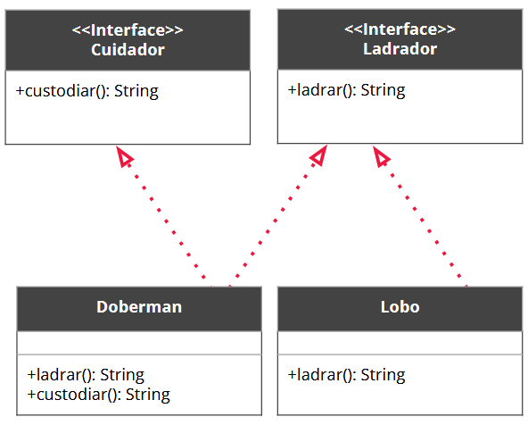

### Polimorfismo en Interfaces <a id='c13a'></a>

Tienen en común que son relaciones del tipo “es un”, 
con lo cual las interfaces también nos permite realizar vinculación dinámica y, por ende, polimorfismo.


> #### 📑
> pdf: Ejercicio Herencia, Clases Abstractas e Interfaces

## Interface e Implements <a id='c13b'></a>

### 📜 Ejemplo!
[Interface e Implements](https://view.genial.ly/60cfb7b0823a1b0d2d87b434)


`<<Interface>>`
`Cuidador`

```java
public interface Cuidador{

    public String custodiar();

}
```
`<<Interface>>`
`Ladrador`

```java
public interface Ladrador{

   public String ladrar();

}
```

`Class Doberman`

```java
public class Doberman implements Cuidador, Ladrador{

    public String custodiar(){

        return "estoy atento custodiando la casa";

    }

    public String ladrar(){

        return "Guau! Guau!";

    }

}
```

`Class Lobo`

```java
public class Lobo implements Ladrador{

    public String ladrar(){

        return "guau! los lobos también ladramos";

    }

}
```

`Class Main`

```java
/*Dada una referencia ladrador del tipo Ladrador (Ladrador ladrador)*/

ladrador = new Doberman(); //ladrador es ahora del tipo Doberman()
System.out.println(ladrador.ladrar()); //Polimorfismo

/*Dada una referencia ladrador del tipo Ladrador (Ladrador ladrador)*/

ladrador = new Lobo(); //ladrador es ahora del tipo Lobo()
System.out.println(ladrador.ladrar()); //Polimorfismo

```

> ### [📌Actividad PG: Interface](./Actividades/pg-interfacepreparcial-.md)


## Interface Comparable <a id='c13c'></a>

No necesitamos crear una interface para comparar objetos porque Java tiene la suya, es la interface **Comparable** y es necesaria utilizarla en otras circunstancias para comparar objetos, por ejemplo, para ordenarlos en las colecciones.

El método que obliga a implementar la interface Comparable de Java es el método `compareTo`.

> ### 💡
> Para utilizar la interface Comparable de Java debemos importar el paquete java.lang

> #### 📑
> pdf: Comparando Objetos

### 📜 Ejemplo!

A la hora de comparar tipos primitivos lo hacemos con los operadores 
“==”, “>”, “<”, “>=”, “<=”, “!”, “!=”, pero, ¿cómo hacemos si queremos 
comparar dos objetos? Por ejemplo, dos pimientos

```java
int i = 5;
    int j = 6;
If(i < j)
    System.out.println("i <  j");
else
    System.out.println("j >= i");
```

Para poder comparar dos objetos lo primero que tendremos que saber es por cuál o cuáles de sus atributos los vamos a comparar. Es decir, cómo responderíamos a la pregunta: ¿estos pimientos son iguales?


>### 👍
> La primer duda que nos surgirá es si debemos considerar el **color**, **tipo**, **peso** o el **tamaño** y sobreescribir el método `equals()`.

Pero qué sucede ahora si lo que queremos saber es 
¿cuál de los pimientos es **mayor** que el otro?

> ### ❌
> El método `equals()` solo nos sirve para comparar igualdad, pero **no** si es mayor o menor a otro objeto

### Método CompareTo() <a id='c13d'></a>

Una solución a la problemática planteada es: 

✅ Lograr que todos los objetos que necesite comparar tengan por ejemplo un método `compararTo()` 

✅ Que reciban como parámetro al otro objeto con el que se desea hacer la comparación y nos devuelva, 

Por ejemplo:  

**Cero**: si son iguales.

**Mayor a cero**: si el objeto que invoca el método es mayor al recibido como parámetro.

**Menor a cero**: si el objeto que invoca el método es menor al recibido como parámetro.


¿Cómo hacemos para obligar a todos los objetos que queremos comparar para que tengan un método `compareTo()`?  

>### 👍
> Con la **interfaces** podemos hacer que quien la implemente posea sí o sí un método `compareTo()` y pueda establecer su propia implementación.


### Implementación en Java de CompareTo()

> ### 💡
> El método `compareTo` debe devolver:
> Si son iguales: `0`.
> Si es mayor: un número mayor a cero. `1`
> Si es menor: un número menor a cero. `-1`

### 📜 Ejemplo!

`Class Pimiento`

```java
import java.lang.*;

public class Pimiento implements Comparable{
    private String tipo;
    private String color;
    private double tamano;
    private double peso;

    public Pimiento(){
    }

    public int compareTo(Object obj){

        Pimiento p2 = (Pimiento) obj;
        int respuesta = 0;

        if(this.getPeso() > p2.getPeso())
            respuesta = 1;
        if(this.getPeso() < p2.getPeso())
            respuesta = -1;

        return respuesta;
    }
    //Setters
    public void setTipo(String tipo){
        this.tipo = tipo;
    }
    public void setColor(String color){
        this.color = color;
    }
    public void setTamano(double tamano){
        this.tamano = tamano;
    }
    public void setPeso(double peso){
        this.peso = peso;
    }
    //Getters
    public String getTipo(){
        return tipo;
    }
    public String getColor(){
        return color;
    }
    public double getTamano(){
        return tamano;
    }
    public double getPeso(){
        return peso;
    }
}
```
`Class Prueba`

```java
public class Prueba{

    public void main(String args[]){

        Pimiento p1 = new Pimiento();
                    p1.setPeso(200);
                    p1.setColor(“amarillo”);
        Pimiento p2 = new Pimiento();
                    p2.setColor(“rojo”);
                    p2.setPeso(150);

        if(p1.compareTo(p2) > 0){
            System.out.println("Pimiento amarillo es mayor al rojo");
        }else if(p1.compareTo(p2) < 0){
            System.out.println("Pimiento rojo es mayor al amarillo");
        }else{
            System.out.println("Pimiento rojo es igual al amarillo");
        }
    }
}
```

>### 👍
> Finalmente, por nuestra implementación, podemos decir que el pimiento amarillo es mayor al rojo.

## Live coding - Interface <a id='c13e'></a>

> #### 🎬
> Video: Live coding - Interface

En `Persona.java`

```java
public class Persona implements Comparable{
    private int edad;

    public int getEdad(){
        return this.edad();
    }
    public void decirEdad(){
        System.out.println(this.edad);
    }

    @Override
    public int compareTo(Object o){
        //Casteo
        Persona p = (Persona) o;
        //Comparacion
        if(this.edad > p.getEdad()){
            return 1; //Mayor a cero
        }
        else if(this.edad < p.getEdad()){
            return -1; //Menor a cero
        }
        return 0;
    }
}
```
Podemos implementarlo de una manera mas sencilla si trabajamos con `int` 

```java
public class Persona implements Comparable{
    private int edad;

    public int getEdad(){
        return this.edad();
    }
    public void decirEdad(){
        System.out.println(this.edad);
    }

    @Override
    public int compareTo(Object o){
        return this.edad - ((Persona)o).getEdad();
    }
}
```
> #### 📑
> pdf: Ejercicio Batalla del Futuro.pdf

# C14 - Repaso <a id='c14'></a>

> #### 📑
> pdf: Ejercicio Tipo Parcial Alumnos

> ### [📌Practica # 1](./Actividades/preparcial-1.md)

> ### [📌Practica # 2](./Actividades/preparcial-2.md)

> ### [📌Practica # 3](./Actividades/preparcial-3.md)

> ### [📌Practica # 4](./Actividades/preparcial-4.md)

# C16 - Colecciones

Grupo de objetos conocidos como **Elementos**


En java se emplea la interfaz `collection` para ese proposito, gracias a esta interfaz podemos almacenar cualquier tipo de objeto y podemos usar metodos comunes.

Partiendo de la interfaz `collection` se extienden otras interfaces genericas:


Estas interfaces aportan funcionalidades sobre la interfaz anterior.

## Interfaz `Set`

Contiene los metodos heredados de collection, donde <
r>estan PROHIBIDOS los elementos duplicados</r>
Para verificar que no esten los elementos duplicados, es importante que esten bien implementados los metodos `equals()` y `hashCod`


## Interfaz `List`

Define la sucesion de elementos, 
si admite elementos duplicados.


## Interfaz `Map`

No extiende de `Collection`
Asocia claves a valores; es decir que podemos almacenar elementos y luego acceder a los mismos a traves de una clave.
Esta interfaz, no puede contener claves duplicadas.
Cada una de esas claves, solo puede contener un valor como maximo.
En el ejemplo del auto, El numero de serie actuaria como clave.


> #### 🎬
> Video: Coleccoines en Java.mp4

[Link: Tipos de colecciones](https://view.genial.ly/60dcb97f383df20cf39ec95c)

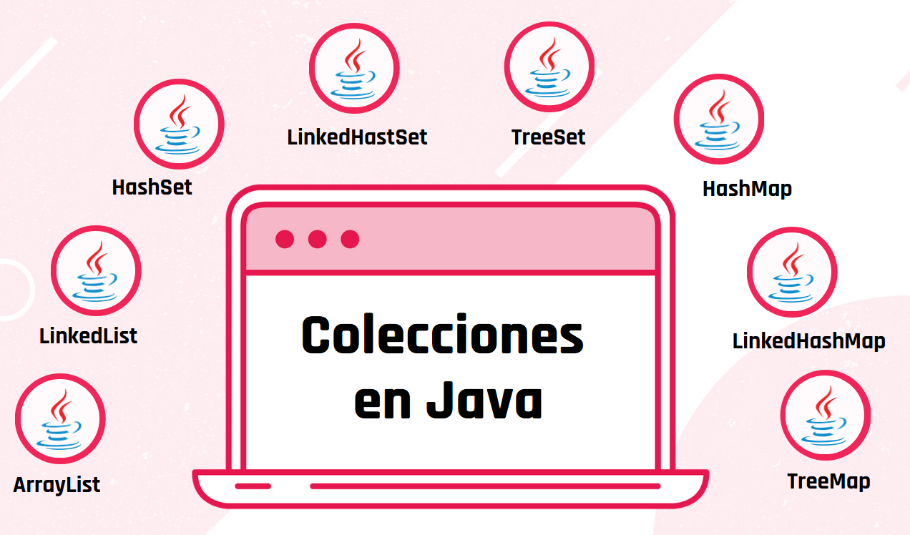

## Collection `ArrayList`

Implementa la interface List. Almacena los elementos en forma contigua y, por eso, tiene acceso secuencial a los elementos. 
Es muy eficiente cuando tenemos que almacenar y acceder a los elementos directamente a través de su posición (pos). 
Sus métodos más importantes son:


Metodo | Descripcion
------- | -------
`.add(Object o)` | Agrega un elemento.
`.add(Object o, int pos)` | Agrega un elemento en una posición determinada.
`.remove(Object o)` | Quita un elemento.
`.remove(int pos)` | Quita un elemento en una posición determinada.
`.get(int pos)` | Obtiene un elemento en una posición determinada.
`.size()` | Permite conocer la cantidad de elementos de la lista.

> ### 💡
> Por sus características, esta será la colección que más utilizaremos.

## Collection `LinkedList`

Implementa la interface List. Esta implementación es más performante cuando necesitamos hacer inserciones en lugares próximos a la mitad de la lista, es decir, cuando estamos manipulando sus elementos, pero es poco eficiente cuando solo necesitamos agregar o acceder a los elementos, ya que en estos casos el ArrayList es una mejor opción. Sus métodos más importantes son:

Metodo | Descripcion
------- | -------
`.add(Object o)` | Agrega un elemento.
`.add(Object o, int pos)` | Agrega un elemento en una posición determinada.
`.remove(Object o)` | Quita un elemento.
`.remove(int pos)` | Quita un elemento en una posición determinada.
`.get(int pos)` | Obtiene un elemento en una posición determinada.
`.size()` | Permite conocer la cantidad de elementos de la lista.

## Collection `HashSet`
-
Implementa la interface Set. A diferencia de ArrayList y LinkedList, las HashSet no pueden almacenar valores duplicados ni nulos. Es la implementación con mayor rendimiento de todas, pero no garantiza ningún orden a la hora de recorrerla. Es decir que al recorrerla los elementos no se encuentran en el orden en que los hemos insertado y por esto mismo no cuenta con un método get. Sus métodos más importantes:

Metodo | Descripcion
------- | -------
`.add(Object o)` | Agrega un elemento.
`.remove(Object o)` | Quita un elemento.
`.size()` | Permite conocer la cantidad de elementos de la lista.

## Collection `LinkedHastSet`
-
Implementa la interface Set. No puede almacenar valores duplicados ni nulos, pero los elementos son almacenados en el mismo orden de inserción. Con lo cual, al recorrerla, veremos que los elementos se encontrarán en el mismo orden en que fueron insertados. Es un poco menos performante que HashSet y no cuenta con un método get. Sus métodos más importantes son:


Metodo | Descripcion
------- | -------
`.add(Object o)` | Agrega un elemento.
`.remove(Object o)` | Quita un elemento.
`.size()` | Permite conocer la cantidad de elementos de la lista.

## Collection `TreeSet`

Implementa la interface Set, pero también hereda de una clase llamada SortedSet y esto Permite que TreeSet almacene sus elementos de acuerdo al valor de dichos elementos. Sus métodos más importantes son:

Metodo | Descripcion
------- | -------
`.add(Object o)` | Agrega un elemento.
`.remove(Object o)` | Quita un elemento.
`.size()` | Permite conocer la cantidad de elementos de la lista.

## Collection `HashMap`

Implementa la interface Map. Los mapas son conjunto de duplas (clave-valor). Es razonable pensar que las claves no se pueden repetir y cada clave corresponde solo a un valor. Tanto en las HashMap como en las HashSet los elementos no se almacenan en el mismo orden de inserción. 

Sus métodos más importantes son:

Metodo | Descripcion
------- | -------
`.put(Object key, Object value)` | Agrega un elemento.
`.get(Object key)` | Permite obtener un elemento según una clave determinada.
`.remove(Object key)` | Quita un elemento según una clave determinada.
`.size()` | Permite conocer la cantidad de elementos de la lista.


## Collection `LinkedHashMap`

Implementa la interface Map. A diferencia de HashMap los elementos se almacenan en función del orden de inserción. Sus métodos más importantes son:

Metodo | Descripcion
------- | -------
`.put(Object key, Object value)` | Agrega un elemento.
`.get(Object key)` | Permite obtener un elemento según una clave determinada.
`.remove(Object key)` | Quita un elemento según una clave determinada.
`.size()` | Permite conocer la cantidad de elementos de la lista.

## Collection `TreeMap`

Implementa la interface Map. Los elementos se almacenan ordenadamente según la clave. Es importante aclarar que se ordenan según la clave y no según el valor del objeto que almacenan.

Metodo | Descripcion
------- | -------
`.put(Object key, Object value)` | Agrega un elemento.
`.get(Object key)` | Permite obtener un elemento según una clave determinada.
`.remove(Object key)` | Quita un elemento según una clave determinada.
`.size()` | Permite conocer la cantidad de elementos de la lista.

> #### 📑
> pdf: Como Recorrer Colecciones

### 📜 Ejemplo Codigo:

Compartimos un ejemplo en Java, al descargarlo podrás tener el código con las diferentes maneras de recorrer una colección. Deberás descomprimir el archivo y luego abrir el proyecto en IntelliJ IDEA y hacer clic en Abrir -> Open, simplemente seleccionando la carpeta descomprimida.
[Acceso](https://drive.google.com/file/d/1Q6w5iduMOcE_b3CSdqR5PYfGkUjiPVQb/view)

## Recorrer Collections `for`

Una manera de recorrer una colección es a través de un ciclo for:


```java
for(int i = 0; i < nombres.size(); i++) {
    System.out.println(nombres.get(i));
}
```

**size**
Será igual a 5. Ya que tenemos 5 nombres almacenados en la colección.

**get**
Con get iremos obteniendo el valor de cada una de las posiciones.

## Recorrer Collections `while`

Otra manera muy similar es hacerlo con un ciclo while. Es muy útil cuando necesitamos cortar el ciclo antes de recorrer todos sus elementos.


```java
int i = 0;
while( i < nombres.size()){
    System.out.println(nombres.get(i));
    i++;
}
```

### 📜 Ejemplo!

En el siguiente ejemplo, necesitamos encontrar a “Carlos”, con lo cual, una vez hallado, podemos salir del bucle para no seguir recorriendo innecesariamente.


```java
int i = 0;
boolean encontrado = false;
while( i < nombres.size() && !encontrado)
{
if(nombres.get(i) == "Carlos")
    encontrado = true;
    System.out.println(nombres.get(i));
    i++;
}
```

Para poder recorrer una colección con un ciclo `for` o `while`, podemos observar que necesitamos de los métodos `size()` y `get()`

> ### 💡
> No todas las colecciones poseen estos métodos con lo cual no podremos utilizar estas opciones en algunas colecciones.

>### 👍
> Solo podemos utilizar estas opciones de recorrido con las List, es decir, con ArrayList y LinkedList.

## Recorrer Collections `iterator()`

## Interfaz `Iterable`

En Java las colecciones implementan la interface Iterable, lo que obliga a implementar el método `iterator()`.


> ### 💡
> `Iterator()` devolverá un objeto del tipo Iterator, donde mediante los métodos `hasNext()` y `next()` podremos recorrer la colección.

## Metodo `iterator()`

Utilizar el método `iterator()` es otra manera de recorrer las colecciones y podremos hacerlo en todos los tipos de colecciones.


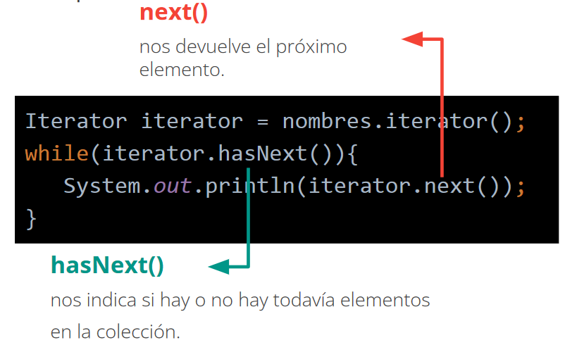

## Recorrer Collections `for each`

Muchos lenguajes poseen una manera simple y elegante de recorrer una colección a través de los ciclos for each. Desde la versión 1.5 de Java se incluyó esta sencilla forma de recorrer las colecciones.

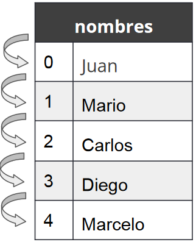

> ### 💡
> Por cada objeto en la colección nombres traerlo y colocarlo en el objeto nombre.

```java
for(Object nombre: nombres){
    System.out.println(nombre);
}
```

> #### 📑
> pdf: Operaciones sobre colecciones.pdf

### 📜 Ejemplo Codigo:

Compartimos un ejemplo en Java, al descargarlo podrás tener el código con las diferentes maneras de recorrer una colección. Deberás descomprimir el archivo y luego abrir el proyecto en IntelliJ IDEA y hacer clic en Abrir -> Open, simplemente seleccionando la carpeta descomprimida. 

> #### 📑
> zip: DH-Operaciones-Sobre-Colecciones

## Operaciones sobre `Collection`

### Crear una `Collection`

Las colecciones en Java están implementadas a través de esta familia de clases e interfaces. Conocerla nos permitirá crear las colecciones de la manera más genérica posible.

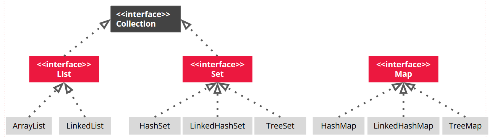

Al momento de crear una colección o cualquier tipo de objeto, es una buena práctica que el tipo de la referencia sea lo más genérico posible


Dado que `ArrayList`, y `LinkedList` implementan la interface `List`, trataremos a estas colecciones siempre como una List, ya que las operaciones que necesitamos hacer sobre estas colecciones se encuentran establecidas en esta interface.

```java
List nombres = new ArrayList();
```
```java
List nombres = new LinkedList();
```
Por el contrario, `HashSet`, `LinkedHashSet` y `TreeSet` implementan la interface `Set`, por ende, trataremos a estas colecciones siempre como una `Set`.

```java
Set nombres = new HashSet();
```
```java
Set nombres = new LinkedHashSet();
```
```java
Set nombres = new TreeSet();
```
`HashMap`, `LinkedHashMap` y `TreeMap` implementan la interface `Map`, por ende, trataremos a estas colecciones siempre como una Map.

```java
Map nombres = new HashMap();
```
```java
Map nombres = new LinkedHashMap();
```
```java
Map nombres = new TreeMap();
```

### Agregar elementos

Tanto la interface `List` como `Set` nos proporcionan el método `add` que recibe como parámetro un `Object` y, como toda clase hereda de Object, podemos almacenar cualquier tipo de objeto en ellas. 

Comencemos con `ArrayList`


```java
List nombres = new ArrayList();
nombres.add("Juan");
nombres.add("Mario");
nombres.add("Carlos");
nombres.add("Marcelo");
nombres.add("Marcelo");
```

En el caso de las `Set`, si bien tienen el mismo método `add`, se comportan muy diferente. No almacenan los valores repetidos ni nulos y, en el caso de las `HashSet` no respeta el orden de inserción


```java
Set nombres = new HashSet();
nombres.add("Juan");
nombres.add("Mario");
nombres.add("Carlos");
nombres.add("Marcelo");
nombres.add("Marcelo");
```
Las `LinkedHashSet`, como toda `Set`, no almacenan valores repetidos ni nulos, pero, a diferencia de la `HashSet`, sí respetan el orden de inserción


```java
Set nombres = new LinkedHashSet();
nombres.add("Juan");
nombres.add("Mario");
nombres.add("Carlos");
nombres.add("Marcelo");
nombres.add("Marcelo");
```
Las `TreeSet` como toda `Set` no almacenan valores repetidos ni nulos y los inserta ordenadamente. En el siguiente ejemplo, al ser elementos String los inserta alfabéticamente.

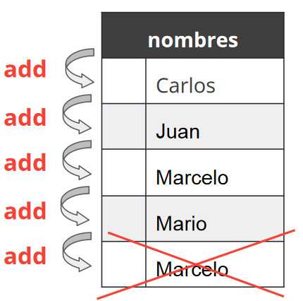

```java
Set nombres = new TreeSet();
nombres.add("Juan");
nombres.add("Mario");
nombres.add("Carlos");
nombres.add("Marcelo");
nombres.add("Marcelo");
```
Las `Map` no poseen un método `add`, en su lugar, poseen un método llamado `put` que recibe dos parámetros: **una key y un valor**. 
Permiten valores duplicados, pero **no keys duplicadas**. 
Las `HashMap`, además, no respetan el orden de inserción.

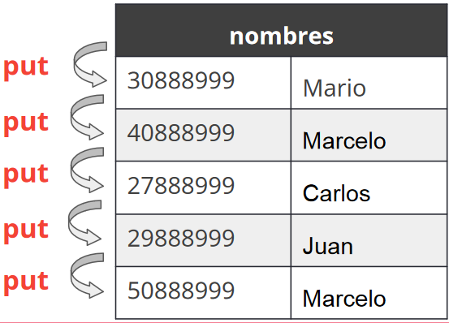

```java
Map nombres = new HashMap();
nombres.put(29888999,"Juan");
nombres.put(30888999,"Mario");
nombres.put(27888999,"Carlos");
nombres.put(40888999,"Marcelo");
nombres.put(50888999,"Marcelo");
```
Las `LinkedHashMap` tienen el mismo comportamiento que una `Map`, pero a diferencia de las `HashMap` respetan el orden de inserción.

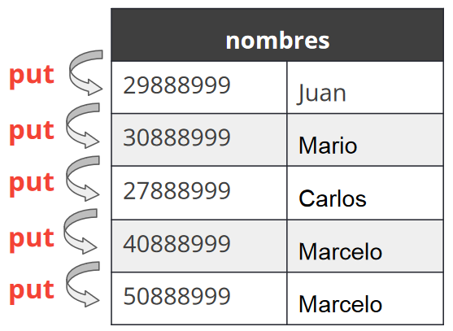

```java
Map nombres = new LinkedHashMap();
nombres.put(29888999,"Juan");
nombres.put(30888999,"Mario");
nombres.put(27888999,"Carlos");
nombres.put(40888999,"Marcelo");
nombres.put(50888999,"Marcelo");
```

Las `TreeMap` tienen el mismo comportamiento que una `Map`, pero a diferencia del resto los inserta ordenadamente según la key. En este caso, la Key es un entero, por lo tanto, los ordena de menor a mayor.

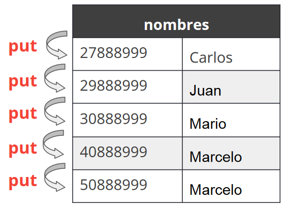

```java
Map nombres = new TreeMap();
nombres.put(29888999,"Juan");
nombres.put(30888999,"Mario");
nombres.put(27888999,"Carlos");
nombres.put(40888999,"Marcelo");
nombres.put(50888999,"Marcelo");
```

### Eliminar elementos

Todas las colecciones poseen un método `remove`. En el caso de las `List`, como ArrayList y LinkedList, se pueden eliminar por índice o por valor.

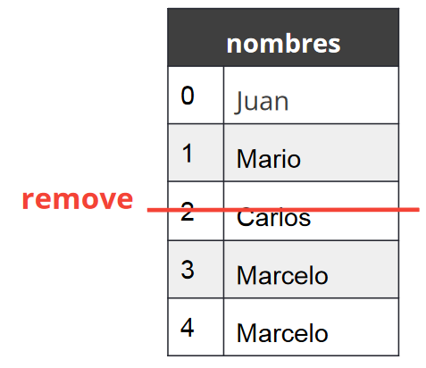

```java
nombres.remove("Carlos");
```
```java
nombres.remove(2);
```

En el caso de todas las implementaciones de `Set` solo se pueden eliminar elementos pasando como parámetro al método `remove` el valor almacenado.


```java
nombres.remove("Carlos");
```
En el caso de las Map, los elementos se eliminan por Key. Es decir, remove recibe como parámetro la Key del elemento que queremos eliminar.


```java
nombres.remove(27888999);
```
### Obtener o buscar elementos

En el caso de las `List`, como `ArrayList` y `LinkedList`, si queremos obtener un valor y conocemos el índice, podemos utilizar el método get que recibe como parámetro el índice de la posición.


```java
System.out.println(nombres.get(2));
```
En el caso de las `Set`, para obtener un elemento debemos buscarlo recorriendo la colección, ya que las Set no tienen índice.


```java
boolean encontrado = false;
String nombre = null;
Iterator it = nombres.iterator();

while(it.hasNext() && !encontrado) {
    nombre = (String) it.next();
    if(nombre == "Carlos")
        encontrado = true;
}

System.out.println("Encontramos a " + nombre);
```

En el caso de las `Map`, para obtener un elemento, podemos hacerlo a través de su Key con el método `get`.


```java
nombres.get(30888999);
```

## Generics

> #### 📑
> pdf: Generics.pdf

**Programación paramétrica**

La programación paramétrica no es exclusiva de Java. De hecho, el lenguaje tardó bastante en incorporarla. Ada, un lenguaje orientado a objetos, lo contempla desde los años ochenta. Hay otros lenguajes que incorporan esta característica, como C++ (a través de templates), D, Eiffel, Delphi, TypeScript, etc. Hay muchos otros lenguajes que utilizan los “tipos paramétricos de datos”. Algunos, lo llaman genericity dado que se establece un tipo de dato genérico para la estructura de dato o clase que se está definiendo, que se establecerá al momento de su uso. En Java, se lo denomina de manera similar: Generics.

En pocas palabras, Generics consiste en diferir la pregunta <r>"¿de qué tipo es este objeto?"</r>. Entonces, el “tipo” del objeto se deja como un parámetro que el programador establecerá al momento de trabajar con ese objeto.

**Sintaxis y uso**

En Java, para definir un tipo paramétrico de datos, usamos los “< >”. Supongamos un ejemplo sencillo: un balde. Este puede contener muchas cosas, tierra, arena, agua, combustible, etc.

### 📜 Ejemplo en codigo:

```java
public class Balde<T> {
    private T contenido;
    public Balde() {
    }
    public llenar(T contenido) {
    this.contenido = contenido;
    }
    public T obtenerContenido() {
    return contenido;
    }
}
```

Aquí, cuando definimos la clase balde, no establecimos el tipo de su contenido (el tipo de su atributo “contenido”), sino que “diferimos” esa decisión hasta el momento de usarlo. Es decir, dejamos el tipo como parámetro. Ese parámetro está definido por la letra T (puede ser cualquier letra del abecedario, menos Ñ, por supuesto). 
Normalmente se usa T por type. Esto también ocurre con las operaciones sobre el contenido: limitamos su uso de acuerdo con el tipo del atributo contenido. Ahora, suponiendo que tenemos las clases agua, arena, combustible, etc., podríamos hacer:

```java
Agua a = new Agua();
Combustible c = new Combustible();
Balde<Agua> b = new Balde<>();
b.setContenido(a);
// NO COMPILA! No puedo poner combustible en un balde de agua!
//b.setContenido(c);
// si el balde es de agua, siempre obtendré agua de él
System.out.println("Voy a tomar" + b.obtenerContenido());
```

Como podemos ver, no hubo casteos para operar con el contenido, y por tanto no hay peligros de errores al momento de la ejecución. Adicionalmente, no podemos poner algo que no corresponda dentro del balde. 
¿Por qué no hacemos, entonces, el tipo del contenido "Object"? 
Eso nos permitiría poner agua, combustible o arena en el balde...

```java
public class Balde {
    private Object contenido;
    public Balde() {
    }
    public llenar(Object contenido) {
    this.contenido = contenido;
    }
    public Object obtenerContenido() {
    return contenido;
    }
}
```

Es totalmente válido, pero no solo debemos castear, sino que podríamos mezclar el contenido del balde:

```java
Agua a = new Agua();
Combustible c = new Combustible();
Balde b = new Balde ();
b.setContenido(a);
b.setContenido(c);
//dudo que el contenido tenga un sabor agradable...
System.out.println("Voy a tomar" + b.obtenerContenido());
```

Es por esto por lo que el uso de tipos paramétricos, es decir, de Generics se vuelve interesante.

> #### 📑
> pdf: Colecciones paramétricas

## Colecciones parametricas

El uso de la programación paramétrica en colecciones. Para comenzar, recordemos que en todas las operaciones que podemos hacer sobre las colecciones, el tipo utilizado es **Object**.

● `add(Object o) : void`

● `get(int i) : Object`

● `iterator() : iterator`

● `hasNext() : boolean`

● `next() : Object`

> ### 💡
> Como en Java, todas nuestras clases heredan de Object, entonces, podemos mezclar objetos de diferentes tipos en la misma colección.

Para analizar en detalle el problema, asumamos que tenemos una serie de vehículos donde nuestra empresa debe administrar lo que transportan.


Podríamos hacer una lista con los vehículos de nuestra empresa.

```java
List vehiculos = new ArrayList();
Moto moto = new Moto();
Camion camion = new Camion();
vehiculos.add(moto);
vehiculos.add(camion);
```

Si en algún momento quisiéramos obtener algún vehículo de la lista, debemos castear.


Si quisiéramos recorrer la lista de vehículos y ver si están disponibles, podríamos hacer esto.

```java
for(Object o :vehiculos) {
System.out.println(((Vehiculo)o).estaDisponible());
}
```

Pero, si quisiéramos agregar carga al camión, es necesario castear solo a aquellos elementos de la lista que sean camiones. De otra manera, tendríamos un error de ejecución.

```java
for(Object o :vehiculos) {
    if( o instanceof Camion)
        ((Camion)o).cargar(“papas”);
}
```

## Solución con Generics

Para evitar mezclar objetos de diferente tipo en una colección, a partir de la versión 1.5 de Java todas las colecciones pueden recibir como parámetro el tipo, es decir, soportan Generics.

```java
List<Camion> vehiculos = new ArrayList<Camion>();
```

Si usamos las colecciones parametrizando su tipo, tendremos un control en tiempo de compilación sobre los tipos de los objetos que agregamos a la colección, de forma tal que, al momento de correr la colección, no hace falta chequear por el `instanceof` dado que no deberemos castear, porque no podríamos “mezclar” tipos de objetos.

```java
for(Camion o :vehiculos) {
    o.cargar(“papas”);
}
```

## Relacion 1 a muchos con `collections`


Un auto tiene mas de una rueda: o sea, muchos, guardamos esas ruedas en una coleccion

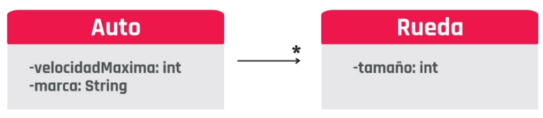

[Link: Relacion 1 a muchos con `collections`](https://view.genial.ly/60dc8a2918c4e80cec421c3d)


En `Empresa.java`

```java
import java.util.*;

public class Empresa {

    private String razonSocial;
    private List<Empleado> empleados = new ArrayList<>();

    public void incorporarEmpleado(Empleado empleado){
        empleados.add(empleado);
    }

    public int cantidadEmpleados(){
        return empleados.size();
    }

    public String getRazonSocial() {
        return razonSocial;
    }

    public void setRazonSocial(String razonSocial) {
        this.razonSocial = razonSocial;
    }
}
```

En `Empleado.java`

```java
import java.util.*;

public class Empleado {

    private String nombre;
    private Date fechaIncorporacion;

    public int calcularAntiguedad(){
        Date fechaActual = new Date();
        return fechaActual.getYear() - fechaIncorporacion.getYear();
    }

    public void setFechaIncorporacion(Date fechaIncorporacion) {
        this.fechaIncorporacion = fechaIncorporacion;
    }

    public String getNombre() {
        return nombre;
    }

    public void setNombre(String nombre) {
        this.nombre = nombre;
    }
}
```

> #### 📑
> pdf: Igualdad y ordenamiento en las colecciones

> #### 📑
> zip: DH-Relaciones1aMuchosOrdenados

> #### 📑
> pdf: Ejercicio Colecciones

> #### 📑
> pdf: Ejercitacion mesa

# C17 - Excepciones

En esta clase vamos a ver qué son y cómo hacer el manejo de excepciones. Al ejecutar un programa puede surgir algún problema que no ocurre en una situación normal, son fallas que generan que el programa se detenga o aborte su ejecución, “se rompa”. Lo que podemos lograr haciendo un manejo de excepciones es que nuestros programas sean tolerantes a esas fallas y si ocurren, que de alguna manera lo resuelvan.

Según el tipo de problema, el programa puede ignorarlo y continuar, o en el caso de que el problema sea algo grave y no pueda continuar, con esta herramienta, se puede lograr que dé un aviso al usuario y termine de forma más elegante y no que simplemente deje de funcionar.
Java también utiliza las excepciones para informarnos de errores que podemos corregir en el código, por ejemplo, `“IndexOutOfRangeException”`, cuando estamos usando un índice que está fuera del rango. 

> #### 📑
> pdf: Introducción a excepciones

> #### 📑
> zip: DH-Excepciones

## Cuándo usar excepciones

Cuando en nuestro código se produce un error por una situación excepcional, la forma de prevenirlo es usando excepciones. Para usar excepciones disponemos de los bloques `try` / `catch`. 

Lo que podemos hacer es literalmente lo que nos dicen:

● Intentar (lo que podría darnos problema)

● Atrapar (el problema)

```java
public static void main(String[] args) {
    Scanner scanner = new Scanner(System.in);
    int num1,num2, division;

    System.out.println("Primer número, debe ser un valor entero ");

    num1=scanner.nextInt();
    System.out.println(" Divisor, un valor entero ");

    num2=scanner.nextInt();
    division= num1/num2;
    System.out.println(division);
}
```
> ### 💡
> Si ejecutamos este código, aparentemente es correcto, pero si en el segundo número se ingresa 0, se generará una excepción

```
Exception in thread "main" java.lang.ArithmeticException: / by zero at com.company.Main.main(Main.java:16)
```

## Solución con excepciones

Para mostrar el error, utilizamos `System.err.println`, esto hará que el mensaje salga en otro color.

```java
public static void main(String[] args) {
    Scanner scanner = new Scanner(System.in);
    int num1,num2, division;

    System.out.println("Primer número, debe ser un valor entero ");
    num1=scanner.nextInt();
    System.out.println(" Divisor, un valor entero ");
    num2=scanner.nextInt();

    try{
        division= num1/num2;
        System.out.println(division);}
    catch(ArithmeticException excepcion){
        System.err.println("Se intentó dividir por cero");
}
```

En el bloque `try` están las instrucciones que podrían generar un problema, en este caso, la división (si el divisor es 0). 
El bloque `catch` "atrapa" la excepción, si se intenta dividir por cero, entonces, se captura esa excepción y, en este caso, se muestra el mensaje.
Si se efectúa una división que no tenga inconvenientes, entonces, el catch no actúa. 
`ArithmeticException` es el tipo de excepción que ocurrió, cuando ocurre, se crea un objeto en este caso `exception`.

> ### 💡
> Estamos protegiendo el código de la división por cero, pero aún puede haber errores inesperados. 

Estamos solicitando el ingreso de números enteros, pero podrían ingresar valores con decimales. 

Para proteger el código vamos a modificarlo.

```java
try{
    System.out.println("Primer número, debe ser un valor entero ");
    num1=scanner.nextInt();
    System.out.println(" Divisor, un valor entero ");
    num2=scanner.nextInt();
    division= num1/num2;
    System.out.println(division);
}
catch(ArithmeticException excepcion){
    System.err.println("Se intentó dividir por cero");
}
```
Ahora estamos protegiendo el código, pero no analizamos el error. Si se ingresa un número con decimales, nos saldrá otra excepción.

```
Exception in thread "main" java.util.InputMismatchException
```

## Diferentes excepciones

Los bloques try / catch nos permiten utilizar más de un catch. De esa forma podemos tratar excepciones específicas primero y luego las más generales.
En el ejemplo anterior se pueden generar

```
Exception in thread "main" java.lang.ArithmeticException: / by zero
```
```
Exception in thread "main" java.util.InputMismatchException
```

Entonces, vamos a adaptar el código para diferenciar la ocurrencia

## Diferenciando errores

```java
try{
    System.out.println("Primer número, debe ser un valor entero ");
    num1=scanner.nextInt();
    System.out.println(" Divisor, un valor entero ");
    num2=scanner.nextInt();
    division= num1/num2;
    System.out.println(division);
}
catch(InputMismatchExcption excepcion){
    System.err.println("Se ingresó un tipo de dato incorrecto");
}
catch(ArithmeticException excepcion){
    System.err.println("Se intentó dividir por cero");
}
```

El primer `catch` captura la excepción que ocurriría por un ingreso incorrecto y el segundo, la que ocurriría al intentar dividir por cero.

## El bloque `finally`

A los bloques `try` / `catch` se le puede agregar el bloque `finally`, que es opcional es decir, no es obligatorio utilizarlo. 

El `finally` se ejecuta siempre, si no ocurre una excepción y no entra al catch, si se ejecuta el `finally`. 
Si ocurriera una excepción y el `catch` la "atrapa", también se ejecuta el `finally`. 

Veamos cómo quedaría en el ejemplo de la siguiente página:

```java
try{
    System.out.println("Primer número, debe ser un valor entero ");
    num1=scanner.nextInt();
    System.out.println(" Divisor, un valor entero ");
    num2=scanner.nextInt();
    division= num1/num2;
    System.out.println(division);
}
catch(InputMismatchExcption excepcion){
    System.err.println("Se ingresó un tipo de dato incorrecto");
}
catch(ArithmeticException excepcion){
    System.err.println("Se intentó dividir por cero");
}
finally{
    System.out.println("Ha finalizado el ejemplo");
}
```

> ### 💡
> El finally siempre se ejecuta y es opcional.

> #### 📑
> zip: DH-Excepciones

> ### 💡
> Si hay un constructor vacio no necesito sobrecargar el constructor
> Permite construirlos sin ningun tipo de reglas
> 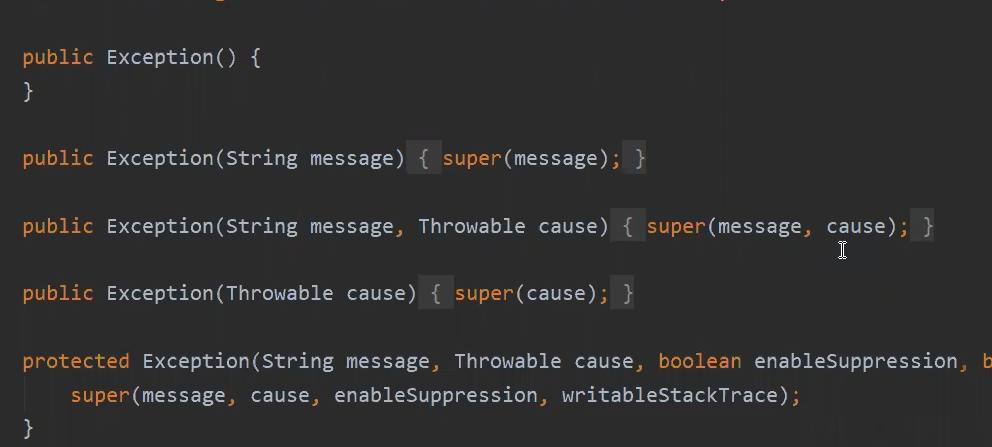


Como todos los elementos en Java, las excepciones son clases, y tienen cierta jerarquía, 


Todas las excepciones heredan de Exception, en el gráfico vemos solo algunas. 

Muchas de las `RuntimeException` son por errores cometidos al escribir el código. 

Las `IOException` son las que no dependen del código, por ejemplo, si en mi programa quiero abrir un archivo o guardar algo en un archivo y el archivo no está porque fue borrado o simplemente si está dañado y no se puede usar, ocurrirá este tipo de excepción, que no es responsabilidad directamente del programador, pero cuando programamos este tipo de acciones, debemos prever que pueden ocurrir. Para ello vamos a usar los bloques `try` / `catch` / `finally`. 

## Lanzar Excepciones

> #### 📑
> pdf: Lanzar Excepciones

### Proteger la integridad de una clase:

Cuando creamos una clase, estamos tratando de representar algo que tiene un cierto comportamiento. 
Los valores que se guardan en sus atributos pueden tener que respetar un rango de valores, en ese caso, tenemos que proteger la integridad de la clase, veamos un ejemplo.

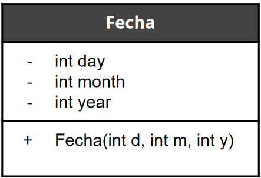

>### 👍
> Usamos los nombres de atributos en inglés para no tener que usar la “ñ”.

Una fecha es algo bien conocido por todos, pero si la clase representa algo no tan habitual, quien tiene que utilizar la clase no tiene por qué saber con qué rango de valores se debe trabajar. 
A fines prácticos, vamos a establecer que los días pueden estar entre 1 y 31 sin importar el mes y los meses entre 1 y 12

## Exception `RuntimeException`

Al usar la clase Fecha, para crear una nueva fecha, es necesario pasar 3 valores enteros. Esto se está cumpliendo en el ejemplo, pero quien usa una clase no necesariamente entiende el comportamiento de esa clase. 


En `Fecha.java`
```java
class Fecha{
    private int day;
    private int month;
    private int year;

    public Fecha(int d, int m, int y){
        day=d;
        month=m;
        year=y;
    }
}
```

En `Main.java`
```java
public static void main(String[] args) {
    Fecha fecha= new Fecha(100,-100,1000);
}
```
> ### 💡
> La clase se debe proteger a sí misma y evitar que le lleguen valores que no estén en el rango esperado.

Entonces:

En `Fecha.java` : Con `throw` lanzamos una excepción en ejecución, para hacerlo la creamos con el `new` la nueva excepción.

```java
class Fecha{
    private int day;
    private int month;
    private int year;

    public Fecha(int d, int m, int y){
        if (d<1||d>31||m<1||m>12)
            throw new RuntimeException("Los valores no son válidos");
        day=d;
        month=m;
        year=y;
    }
}
```
> ### 💡
> Ahora, si intentamos crear con valores inválidos, nos genera una excepción. Las excepciones de tipo `RuntimeException` no es obligatorio protegerlas con los bloques `try` / `catch`.

En `Main.java`
```java
public static void main(String[] args) {
    Fecha fecha= new Fecha(100,-100,1000);
}
```
```log
Exception in thread "main" java.lang.RuntimeException: Los valores no son válidos
```

## Lanzar una excepción por código

Veamos ahora otra forma de proteger este código. Ahora vamos a hacerlo de forma que quien utilice el método esté forzado a protegerlo con `try` / `catch`

En `Fecha.java`

```java
class Fecha{
private int day;
private int month;
private int year;

    public Fecha(int d, int m, int y) throws Exception{
        if (d<1||d>31||m<1||m>12)
            throw new Exception("Los valores no son válidos");
        day=d;
        month=m;
        year=y;
    }
}
```

De la misma forma que antes lanzamos la excepción con `throw`, pero en este caso es de tipo Exception, ya que no hay definida una excepción que diga fuera del rango esperado. 
Se agrega que debemos avisar que el método puede generar una excepción, agregamos, a continuación de la firma `throws Exception`. 
Es un método `throweable`.

> ### 💡
> Por ser un método throweable, nos obliga a protegerlo con `try` / `catch`.

En `Main.java`

```java
public static void main(String[] args) {
    try{
        Fecha fecha= new Fecha(100,-100,1000);
    catch (Exception e) {
        System.err.println(“No son valores válidos para una fecha”);
    }
}
```

> #### 📑
> zip: DH-LanzarExcepciones

> ### [📌Actividad: PG Exceptions](./Actividades/pg-excepcions.md)

## Excepciones personalizadas

Hasta ahora vimos cómo controlar las excepciones generadas por la ejecución normal del programa. Recordemos que son situaciones que solo se dan excepcionalmente.
Luego aprovechamos las excepciones existentes para proteger la integridad de nuestras clases.
Sería más conveniente lanzar las excepciones adecuadas, específicas a los problemas que ocurren. Esto podemos hacerlo aplicando herencia. 

> #### 📑
> pdf: Creando Excepciones.pdf

### La clase que queremos proteger

Vamos a tomar nuevamente la clase fecha, pero queremos diferenciar el tipo de error que ocurrió. 
Tenemos dos posibles errores:

✅ Que el día esté fuera de rango o

✅ Que el mes esté fuera de rango. 

Por fines prácticos tomamos días válidos de 1 a 31.


### Extender Exception

Extendemos `Exception` y creamos dos constructores: 

1. uno por defecto que no tiene parámetros y 
2. el otro con parámetros y sobreescribimos el `toString()`. 

En el constructor con parámetros puedo recibir un mensaje que es el que luego me va a mostrar el error en detalle.


```java
public class FechaException extends Exception{
    public FechaException(){
        super();
    }
    public FechaException(String mensaje){
        super(mensaje);
    }
    public String toString(){
        return "Se produjo la siguiente Excepción "+ this.getClass().getName() +"\n" + " Mensaje: " + this.getMessage() + "\n" ;
    }
}
```

> ### 💡
> En este ejemplo extendemos de Exception, pero se puede extender de cualquier Excepción definida en el API de Java. Siempre es conveniente utilizar la más relacionada con la condición que se quiere proteger.

>### 👍
> Para crear nuestras propias excepciones, tenemos que heredar de la excepción que esté más relacionada con la condición a proteger

## Excepciones propias

La clase fecha sin proteger la integridad de los datos.

En `Fecha.java`

```java
class Fecha{
    private int day;
    private int month;
    private int year;

    public Fecha(int d, int m, int y){
        day=d;
        month=m;
        year=y;
    }
}
```
En `Main.java`
```java
public static void main(String[] args) {
    Fecha fecha= new Fecha(100,-100,1000);
}
```
El método puede lanzar una excepción de tipo `FechaException`. 

✅ Si el día está fuera de rango, se lanza la excepción con el mensaje que informa error en el día. 

✅ Si el mes está fuera de rango, se lanza la excepción con el mensaje que informa error en el mes. 

Si se genera la excepción, el código no se sigue ejecutando

En `Fecha.java`

```java
class Fecha{
    private int day;
    private int month;
    private int year;

    public Fecha(int d, int m, int y) throws FechaException{
        if (d<1||d>31)
            throw new FechaException("Error en el día");
        day=d;
        if (m<1||m>12)
            throw new FechaException("Error en el mes");
        month=m;
        year=y;
    }
}
```

En `Main.java`

```java
public static void main(String[] args) {
    try{
        Fecha fecha= new Fecha(-1,10,2000);
    }
    catch(FechaException excepcion){
        System.err.println(exception.getMessage());
    }
}
```
Obtendremos el mensaje que programamos en nuestra clase, si cometemos error en el mes, el mensaje lo indicaría, ya que generamos la excepción indicando qué error ocurrió.

```log
Error en el día
```
> #### 📑
> zip: DH-ExcepcionesPropias

> ### [📌Actividad: PG Exceptions II](./Actividades/c17-exceptions-II.md)

> #### 📑
> pdf: Ejercitacion mesa

# C18 - Repaso

> ### [📌Actividad: Ejercicio mundial](./Actividades/c18-mundial-futbol.md)

# C19 - Introduccion Patrones de diseño

> #### 📑
> pdf: Patrones de Diseño

No es un código prefabricado, una versión final, sino <r>un modelo de cómo resolver un determinado problema.</r> 

Los patrones de diseño definen las relaciones e interacciones entre clases u objetos, sin especificar los detalles de los involucrados. 

Conceptualmente, un patrón de diseño debe definir: 

✅ Un nombre, 

✅ El problema, 

✅ La solución, 

✅ Cuándo aplicar esa solución y 

✅ Las consecuencias de hacerlo.

> #### 🎬
> Video: Introduccion Patrones de diseño

Son sugerencias de uso ante una eventual aplicacion:

Se divide en 3:

✅ Patrones de creacion

**Objetivos**:
- Abstraer el como los objetos son creados en una aplicacion; estos proporcionan interfaces para crear y copiar objetos y producir familias de objetos relacionados.
- Producen diferentes reresentaciones usando el mismo codigo

✅ Patrones estructurales

**Objetivos**:
- Lidian con la composicion de una clase y objeto
- Habilitan la colaboracion de los objetos con interfaces incopatibles, agregando nuevos comportamientos a objetos, esto nos permite dividir clases o un conjunto de clases en jerarquias separadas, abstraccion e implementacion que puedens er desarrolladas independientemente de la otra 
- Permite componer objetos en una estructura de arbol y luego trabajar con esas estructuras como si fueran objetos individuales.

✅ Patrones de comportamiento

**Objetivos**:

- Se encargan de las relaciones entre objetos y clases
- Distribuciones de las responsabilidades en una aplicacion.

> ### 💡
> Algunos patrones de comportamiento se basan en utilizar la **herencia** para distribuir el comportamiento entre las clases, mientras que otros se basan en utilizar la **composicion** para distribuir ese comportamiento


> #### 📑
> pdf: Composición y herencia

## Composición y herencia

De manera general, una definición para composición y herencia sería que son dos mecanismos para reutilizar la funcionalidad, es decir, no ser repetitivo ni escribir código innecesario.

## Herencia 

La herencia siempre se ha considerado una herramienta básica para extender y reutilizar la funcionalidad basada en los atributos y métodos de una clase. 

### 📜 Ejemplo!

```java
public class Animal{
}
public class Cachorro extends Animal{
}
public class Gato extends Animal{
}
```

### Ventajas y desventajas de la herencia

Ventajas | Desventajas
------- | -------
Captura lo común y lo aísla de lo diferente. La herencia se ve directamente en el código, incluso debido a su naturaleza estática. | Encapsulación débil y acoplamiento estrecho, donde el cambio de una superclase puede afectar a todas las subclases. 
Permite crear una estructura jerárquica de clases cada vez más especializada. Por lo tanto, no hay que empezar desde cero para especializar una clase existente. | A veces un objeto debe ser de una clase diferente en diferentes momentos, lo que no es posible con la herencia, ya que tiene una relación estática.

## Composición

En la composición, en lugar de codificar un comportamiento de forma estática, como se hace con la herencia, definimos pequeños comportamientos predeterminados y la usamos para declarar comportamientos más complejos.

### 📜 Ejemplo!

```java
public class Sistema {
    Persona persona = new Persona();
}
public class Persona{
}
```

Ventajas | Desventajas 
------- | -------
El comportamiento se puede elegir en tiempo de ejecución en lugar de estar vinculado en tiempo de compilación. | El software es muy dinámico y parametrizado y es más difícil de entender que el software más estático. 
Los objetos que fueron instanciados y que están contenidos en la clase que los instancia, se accede sólo a través de su interfaz, siguiendo así el principio de programación para una interfaz y no para una implementación. | | 

## ¿Cuándo usarlos?

En general, siempre se prefiere usar la composición sobre la herencia, sin embargo, podemos definir algunas reglas para identificar cuándo podemos usar la herencia para que no tengamos los problemas que conlleva.

1. La herencia se usa si una instancia de una clase Hija nunca necesitará convertirse en un objeto de otra clase. 
2. Si la jerarquía de herencia representa una relación "Es una" y no una relación "Tiene una".
3. Si desea o necesita realizar cambios globales en sus clases secundarias cambiando una clase principal.
4. Cuando la clase secundaria se extiende en lugar de reemplazar total o parcialmente las responsabilidades de la clase principal

## Patrón Singleton

[Link: Implementaciones](https://view.genial.ly/60dc56fe0ae5a70d2b722d2a)

> #### 📑
> pdf: Patrón Singleton

Singleton es un patrón de diseño de creación que garantiza que una clase tenga una sola instancia y define un punto de acceso global para ella.

● En el patrón Singleton, una clase administra su propia instancia y evita que cualquier otra clase cree una instancia de ella.

● Para crear la instancia usando el patrón Singleton, debe pasar obligatoriamente por la clase, ninguna otra clase puede instanciarla.

● El patrón Singleton también proporciona un punto de acceso global a su instancia.

● La clase en sí siempre ofrecerá su propia instancia y, si aún no tiene una, crea y devuelve esta instancia recién creada.

> ### 💡
> El patrón Singleton se usa cuando necesita un solo punto para crear una instancia de clase y cuando solo necesita una instancia de una clase.

### Crear una clase con el Patrón Singleton

Para crear una clase con el patrón Singleton es necesario realizar los siguientes pasos:

● Crear un **atributo estático** del mismo tipo que la clase con el nombre de instancia.

● Todos los constructores de la clase deben usar el modificador `private`.

● Crear un método `getInstance()` estático que devuelva el atributo de instancia.

### 📜 Ejemplo!

**UML**


En `SingletonEjemplo.java`

```java
public class SingletonEjemplo {
    //Atributo con mismo nombre de la clase
    private static SingletonEjemplo instance = new SingletonEjemplo();
    //Constructores privados
    private SingletonEjemplo(){
    }
    //Método getInstance() estático
    public static SingletonEjemplo getInstance(){
        return instance;
    }
}
```

> #### 📑
> pdf: Patrón Singleton - Ejemplo

### Patrón Singleton - Ejemplo

Normalmente, una clase que no necesita tener más de una instancia <r>es la clase que se usa para la conexión a la base de datos.</r> 
Conocemos los posibles problemas de tener más de una conexión a una base de datos en la misma ejecución de código al mismo tiempo. 

Para evitarlos, debemos bloquear la posibilidad de instanciar esta clase fuera de sí misma (incluso las subclases no pueden instanciarla) y también crear una forma de permitir que exista una sola instancia de ella.

En este contexto, la mejor solución es aplicar el patrón Singleton.

En clase `BaseDeDatos.java`

**Sin Singleton**

```java
public class BaseDeDatos {
    ...
    public BaseDeDatos (){
    ...
    }
}
```
En clase `BaseDeDatos.java`

**Con Singleton**

```java
public class BaseDeDatos{
    //Atributo con el mismo nombre de la clase
    private static BaseDeDatos instance = new
    BaseDeDatos();
    //Construtor privado
    private BaseDeDatos(){
    /*Inicializaciones*/
    }
    //Método getInstance() estático
    public static BaseDeDatos getInstance(){
        return instance;
    }
}
```


### Implementaciones Singleton


**Implementacion #1**

```java
public class Dios{

    private static Dios instancia;
    private Dios(){
    }
    /*Esta técnica se llama inicialización tardía hasta que no se invoque al método getInstancia no se crea ningún objeto en memoria.*/
    public static Dios getInstancia(){
        if(instancia == null)
            instancia = new Dios();
        return instancia;
    }
    public String pedir(String pedido){
        return "tu pedido fue escuchado: " + pedido;
    }
}
```

**Implementacion #2**

```java
public class Dios{

    private static Dios instancia = new Dios();
        private Dios(){
        }

        public static Dios getInstancia(){
            return instancia;
        }

        public String pedir(String pedido){
            return "tu pedido fue escuchado: " + pedido;
        }
    }
}
```
> ### 💡
> Usaremos SINGLETON para crear fabricas

## Patron Factory

> #### 📑
> pdf: Patron Factory

El patrón de diseño Factory es uno de los principales patrones de diseño y uno de los más utilizados en la mayoría de los lenguajes de programación en la actualidad.

El propósito del patrón Factory es crear objetos, por lo que se considera un patrón de creación. Básicamente, la lógica de creación está encapsulada dentro de la fábrica (FactoryMethod) y se proporciona un método que devuelve un objeto (Metodo Factory predeterminado) o la creación del objeto se delega a una subclase (método Abstract Factory predeterminado).

Tiene dos variaciones:

Factory Method | Abstract Factory 
------- | -------
Es un patrón que define una interfaz para crear un objeto, pero permite que las subclases decidan qué clase instanciar. | Es un patrón que proporciona una interfaz para crear familias de objetos dependientes o relacionados sin especificar sus clases concretas.

### ✅ `Factory Method`

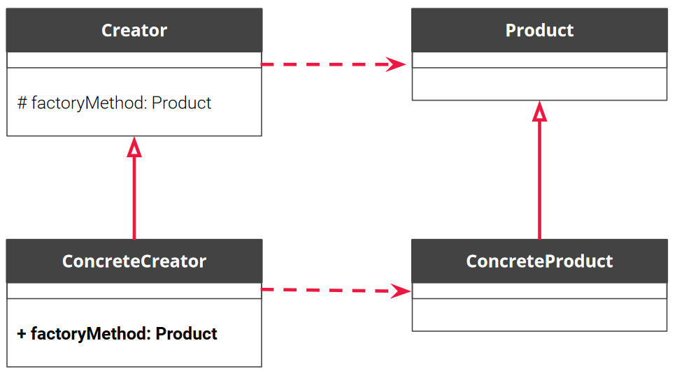

● `Creator` (Creador abstracto): 

Declara el `Factory Method` (método de fabricación) que retorna el método de la clase Producto. Este elemento también puede definir una implementación base que devuelve un objeto de la clase `ConcreteProduct`.

● `ConcreteCreator` (Creador concreto): 

Sobreescribe el método que fabrica el Product y nos permite instanciar el ConcreteProduct sin hacer referencia directa al mismo.

● `Product` (Produto abstracto): 

Define una interfaz para los objetos creados por el factory method.

● `ConcreteProduct` (Producto concreto): 

Representa una implementación para la interfaz del producto


### ✅ `Abstract Factory`

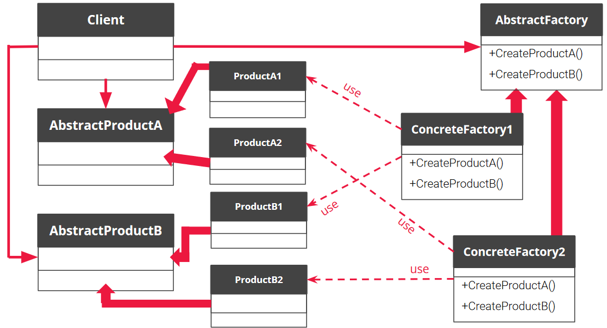

● `AbstractFactory`: 

Su propósito es declarar métodos de creación de tipo AbstractProduct, que son implementados por una clase de tipo ConcreteFactory, que hereda o implementa a AbstractFactory.

● `AbstractProduct`: 

Declara métodos implementados por clases de tipo ConcreteProduct. ConcreteFactory crea internamente un objeto de tipo ConcreteProduct, pero este objeto se devuelve como AbstractProduct.

● `ConcreteFactory`: 

Implementa los métodos declarados en AbstractFactory, creando un objeto de tipo ConcreteProduct y devolviéndolo como AbstractProduct.

● `ConcreteProduct`: 

Es la clase que especifica la instancia correcta a crear. Implementa los métodos declarados en AbstractProduct.

### 📜 Ejemplo!

> #### 📑
> pdf: Ejemplo de patrón factory method

En este ejemplo iremos a la implementación del factory method, utilizando un fabricador de gaseosas que construye diferentes tipos dependientes de la implementación de sus subclases.

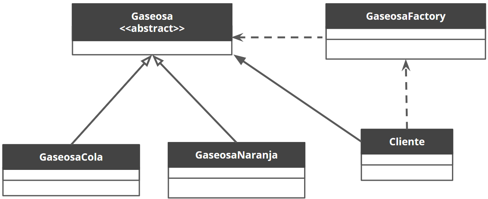

### Clase abstracta del producto

```java
public abstract class Gaseosa {
    private String nombre;

    public String getNombre(){
        return nombre;
    }
    public void abrir(){
        System.out.println("Abriste una refrescante gaseosa de " + getNombre());
    }
}
```

### Clases concretas de los productos

Cada producto concreto hereda de la clase abstracta principal.

En `GaseosaCola.java`

```java
public class GaseosaCola extends Gaseosa {
    String nombre = "Coca Cool";

    @Override
    public String getNombre() {
        return nombre;
    }

    @Override
    public void abrir() {
        super.abrir();
    }
}
```

En `GaseosaNaranja.java`

```java
public class GaseosaNaranja extends Gaseosa{
    String nombre = "Naranja dulce";

    @Override
    public String getNombre() {
        return nombre;
    }

    @Override
    public void abrir() {
        super.abrir();
    }
}
```
### Clase Fabricadora (GaseosaFactory)

En `Gaseosafactory.java`

```java
public class GaseosaFactory {
    public static Gaseosa construir(String tipo){

    switch (tipo){
        case "Coca":
            return new GaseosaCola();
        case "Naranja":
            return new GaseosaNaranja();
        default:
            System.out.println("Ups, no encontramos este objeto para construir");
            return null;
        }
    }
}
```

### Ejecucion:

Se crean tres instancias usando el método estático construir de la clase fabricadora GaseosaFactory, dos de los productos son existentes, sin embargo el tercero, “uva”, nunca fue creado.

En `Main.java`

```java
public static void main(String[] args) {
    Gaseosa gs1 = GaseosaFactory.construir("Coca");
    gs1.abrir();
    Gaseosa gs2 = GaseosaFactory.construir("Naranja");
    gs2.abrir();
    Gaseosa gs3 = GaseosaFactory.construir("Uva");
    gs3.abrir();
}
```

Al compilar vemos cómo con solo pasarle el parámetro correspondiente al fabricador, usa la subclase correspondiente sin que el cliente necesite especificarla.
También tenemos una excepción que podemos controlar con un try catch.

```log
Abriste una refrescante gaseosa de Coca Cool
Abriste una refrescante gaseosa de Naranja dulce
Ups, no encontramos este objeto para construir

Exception in thread "main" java.lang.NullPointerException: Cannot invoke
"Gaseosa.abrir()" because "gs3" is null
    at Cliente.main(Cliente.java:11)

```

Entonces en `Main.java`

```java
public static void main(String[] args) {
    try {
        Gaseosa gs1 = GaseosaFactory.construir("Coca");
        gs1.abrir();
        Gaseosa gs2 = GaseosaFactory.construir("Naranja");
        gs2.abrir();
        Gaseosa gs3 = GaseosaFactory.construir("Uva");
        gs3.abrir();
    }catch (Exception e){
        System.out.println("¡Exception encontrada!: " + e);
    }
}
```

```log
Abriste una refrescante gaseosa de Coca Cool
Abriste una refrescante gaseosa de Naranja dulce
Ups, no encontramos este objeto para construir
¡Exception encontrada!: java.lang.NullPointerException:
Cannot invoke "Gaseosa.abrir()" because "gs3" is null
```


> #### 📑
> zip: DH-Factory-Singleton

> #### 📑
> pdf: Ejercicio - Patrón Factory

> ### [📌Actividad: EmpleadosFactory](./Actividades/c19-empresas-factory.md)

# C20 - Patron State

> #### 🎬
> Video: Patron State

Todos tenemos ejemplos de objetos que actúan de diferente manera de acuerdo a la situación (su estado).
Una pareja que está enojada no recibe un regalo como cuando está alegre… o tal vez el regalo cambie su estado de ánimo.
Debemos hacer que nuestros objetos actúen diferentes en distintos estados y puedan pasar de un estado a otro en el tiempo.
Modelar esto en un programa a veces puede resultar confuso y difícil de manejar. 

Aquí viene en nuestra ayuda el …¡Patrón State!

> #### 📑
> pdf: Presentacion UML State.pdf

Cuando se requiere que un objeto tenga diferentes comportamientos según el estado en que se encuentra, resulta complicado poder manejar el cambio de comportamientos y los estados de dicho objeto.
El patrón State propone una buena solución a esta complicación, <r>creando básicamente un objeto por cada estado posible del objeto que lo invoca.</r>

**Solucion**

Se implementa una clase para cada estado diferente del objeto y cada clase implementará los métodos cuyo comportamiento varía según ese estado. Así, siempre se tendrá una referencia a un estado concreto y se comunicará con este para resolver sus responsabilidades.

## Ventajas y desventajas

### Ventajas:

Se localizan fácilmente las responsabilidades de los estados específicos ya que se encuentran en las clases que corresponden a cada estado. Esto brinda una mayor claridad en el desarrollo y el mantenimiento posterior.

● Hace los cambios de estado explícitos al estar representado cada estado en una clase.
● Facilita la ampliación de estados.
● Permite a un objeto cambiar de clase en tiempo de ejecución dado que al cambiar sus responsabilidades por las de otro objeto de otra clase, la herencia y responsabilidades del primero han cambiado por las del segundo.

### Desventaja:

● Se incrementa el número de subclases.

## Diagrama solución patrón State

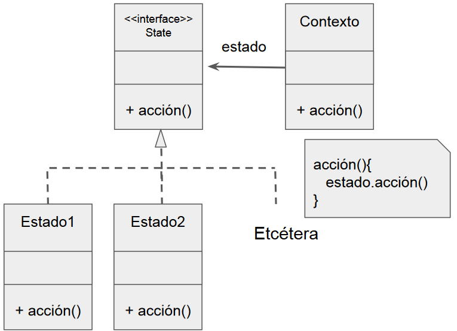

● Clase contexto: define la interfaz con el cliente. La instancia de contexto es la que define su estado actual.

● Interface State (estado): interface para el encapsulamiento de la responsabilidades asociadas con un estado particular de contexto. Define las responsabilidades de cada estado.

● Clase estado: cada una implementa el comportamiento o responsabilidad de contexto.


La clase contexto envía mensajes al objeto dentro de su código que contiene una instancia de estado para brindarle a estos la responsabilidad que debe cumplir el objeto contexto. Así, el objeto contexto va cambiando las responsabilidades según el estado en que se encuentre, puesto que también cambia instancia de estado al hacer un cambio de estado.

Dicho en pocas palabras:

Contexto le dice a la instancia de estado que haga la acción... Pero cuando cambia la instancia de la clase estado (Estado1, Estado2, etc) la acción se realiza de forma diferente según este.

**Conclusiones**

El patrón no indica exactamente dónde definir las transiciones de un estado a otro. 

Existen dos formas de solucionar esto:

1. Definiendo estas transiciones dentro de la clase contexto.
2. Definiendo estas transiciones en las subclases de State.

Es más conveniente utilizar la primera solución cuando el criterio a aplicar es fijo, es decir, no se modificará. En cambio, la segunda resulta conveniente cuando este criterio es dinámico.Este se presenta en la dependencia de código entre las subclases.
También hay que evaluar en la implementación cuándo crear instancias de estado concreto distintas o utilizar la misma instancia compartida. Esto dependerá si el cambio de estado es menos o más frecuente respectivamente.

> ### 💡
> Usamos este patron siempre que que tengamos que cambiar comportamientos de cualquier objeto segun su estado.

### Funcionamiento Patron State

[Link: Funcionamiento](https://view.genial.ly/60e5a6ac86a6a40d7f6505f6)


> ### [📌Ejemplo Patrón State: Modelo de Auto ](./Actividades/c20-auto-state.md)

> #### 📑
> zip: Tesla

### Ejercicio:

enemos un semáforo que, como todos, puede estar:

* **Verde**: pasa a amarillo.
* **Amarillo**: pasa a rojo.
* **Rojo**: pasa a verde.

¿ Te animas a dibujar un diagrama de clases y un programa en JAVA ?
Tips:

Cuando se crea el semáforo debe estar inicialmente en verde.

Usá el patrón State y debería tener dos acciones:

* **mostrarAviso**…una salida por consola que indique en qué estado está.
* **cambiarEstado**…cambia el estado del semáforo al estado que sigue.

> ### [📌Actividad: Tamagochi](./Actividades/c20-tamagochi.md)

> #### 📑
> pdf: Ejercitacion mesa

# C21 - Repaso

> ### [📌Actividad: Producto Factory](./Actividades/c21-producto-factory.md)

> ### [📌Actividad: Patron Observer](./Actividades/c21-patron-observer.md)

# C22 - Patron Composite

> #### 📑
> pdf: Patrón Composite.pdf

Composite es un patrón que se encuentra dentro de la categoría estructural.
Se enfoca en la forma en que los objetos se componen para formar estructuras compuestas mas complejas aun.

> ### 💡
> Su objetivo es componer objetos en estructuras de arbol para representar jerarquias

Permite tratar de manera uniforme objetos individuales y composiciones de objetos

Caracteristicas:

* Empleado en estructuras que pueden ser tratadas jerarquicamente, ej: la estructura de un arbol
* Tambien usado para estructuras complejas que pueden ser tratadas de manera uniforme, 
* prioriza la composicion sobre la herencia

## Se usa composite:

Cuando la estructura puede ser representada jerarquicamente
Cuando queremos que el codigo cliente trate los objetos compuestos y objetos simples de la misma manera

## Ventajas y desventajas

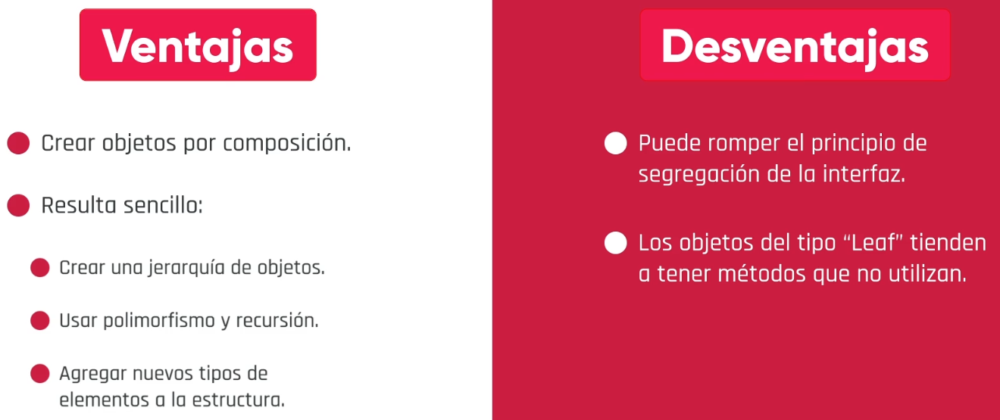

> #### 📑
> pdf: Ejemplo Patrón Composite

> ### [📌Actividad: Ejemplo Composite departamentos](./Actividades/c22-composite-departamentos.md)

Vamos entender la relación de composición entre clases a través de una analogía con el cuerpo humano:

- ¿Qué es el cuerpo humano?

Es un sistema

## Composición del cuerpo humano

Como si fuese un software, podemos interpretarlo compuesto por módulos, domínios, funcionalidades, requisitos funcionales, requisitos no funcionales y reglas de negocio.

Desde el punto de vista estructural, también como un software, podemos interpretarlo como un espacio de nombres o paquetes, compuesto de clases, clases compuestas por otras clases, todas con sus métodos, etc.

Una mano está compuesta por dedos. 
Podemos entender a la mano como una clase, parte del brazo, y la clase mano posee cinco composiciones de la clase dedo.
Una mano está compuesta por cinco dedos: pulgar, índice, medio, anular, meñique.

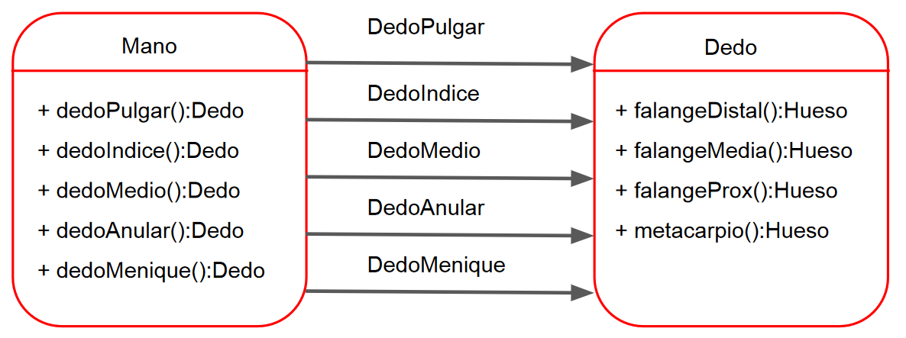

## Estructura de clases del patron Composite

[Link: Estructura](https://view.genial.ly/60e58ad4a46bc30d511de401)


### Cliente: 

El cliente trabaja con todos los elementos a través de la interfaz componente. Como resultado, el cliente puede trabajar de la misma forma con cualquiera de los elementos.

### Interfaz componente: 

la interfaz componente describe las operaciones comunes tanto para elementos simples como para elementos complejos del árbol.

### Hoja: 

La hoja es un elemento básico de un árbol que no tiene sub-elementos. Generalmente, los componentes hoja acaban haciendo buena parte del trabajo real, dado que no tienen a más nadie para delegarlo.

### Contenedor: 

El contenedor (o composite) es el elemento que contiene los subelementos hojas u otros contenedores. Un contenedor no sabe la clase concreta de sus hijos: trabaja con todos los subelementos a través de la interfaz componente. 

> #### 📑
> pdf: Composite

## Ejercicio

Imaginate que estás haciendo un sistema de administrador de archivos. Como sabés es posible crear archivos concretos (vídeos, textos, etc.) y archivos tipo carpeta, que almacenan otros archivos. Supongamos que solamente guardamos el nombre del Archivo y Carpeta. El administrador podrá agregar o eliminar, dado el nombre, elementos tipo Carpeta, Video o Texto a cada elemento de tipo Carpeta….
Cuidado!! eliminar una carpeta también eliminará los archivos en ella.
Basándose en este contexto, tenés que implementar una estructura de archivos y carpetas utilizando el patrón Composite.

Crear en un método main 5 archivos y agregá estos archivos a la carpeta y luego mostrar por consola el nombre de la carpeta con los nombres de los archivos que tiene.

> ### [📌Actividad: Patron Composite](./Actividades/c22-patron-composite.md)

### 📜 Ejemplo!

### Patrón Composite: trencito

Se trata de calcular el área de un trencito a partir de las figuras base que lo componen.

Las figuras simples serán rectángulos, círculos y triángulos los cuales se pueden combinar para formar elementos más complejos (compuestos) como locomotoras y vagones: 


* Rectángulos dados por alto y largo. (Area = alto * largo)
* Círculos por su radio. (Area = radio * radio * pi)
* Triángulos por base y altura. (Area = base * altura / 2)

Armar un modelo y programarlo de manera que por ejemplo permita ejecutar en el método main:

* Un vagón con un rectángulo de 5 x 4 y 3 circulos de 1 y calcular la superficie total.
* Una locomotora con un rectángulo de 6 x 4 x 3, dos círculos de 1, un triángulo de 2 x 2 y calcular la superficie total de la locomotora.

> #### 📑
> pdf: Ejercicio Hamburgueseria Patrón Composite

> ### [📌Actividad: Hamburgueseria](./Actividades/c22-hamburgueseria.md)


> ### 💡
> Las interfaces no pueden tener atributos, cuando tenga que tenerlos hacemos una clase abstracta con metodos abtsractos

> #### 🎬
> Video: Live coding - Patron composite


> ### 💡
> Pone el error en texto
> 

# C23 - Simulacro

> #### 📑
> pdf: Ejercicio Tipo Final

> ### [📌Actividad: Instituciones](./Actividades/c23-instituciones.md)

