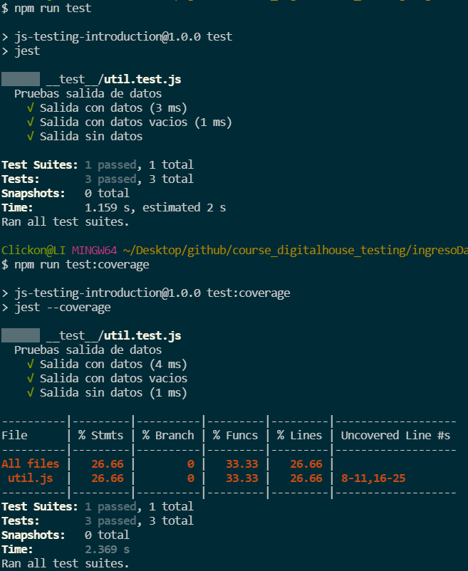
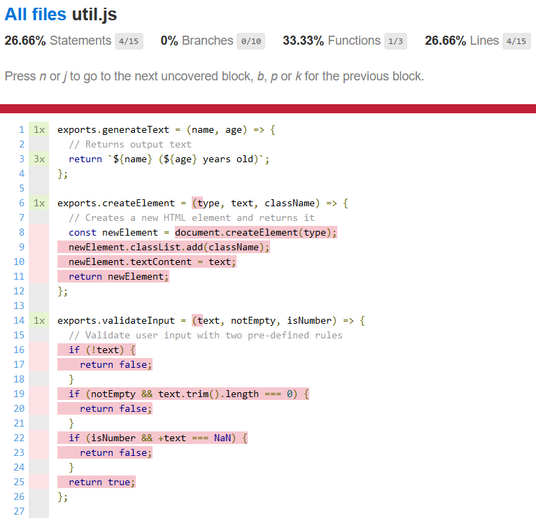

# Test: Ingreso de datos II

Este programa solicita el ingreso de `Nombre y Edad` y al presionar el botón `Agregar Usuario` arma una lista con los datos ingresados.


Modificaciones en `package.json` en `"scripts"` agregamos test coverage

```json
"scripts": {
    "start": "webpack app.js --mode development --watch",
    "test": "jest",
    "test:coverage": "jest --coverage"
},
```
En `util.js`

```js
exports.generateText = (name, age) => {
  // Returns output text
  return `${name} (${age} years old)`;
};

exports.createElement = (type, text, className) => {
  // Creates a new HTML element and returns it
  const newElement = document.createElement(type);
  newElement.classList.add(className);
  newElement.textContent = text;
  return newElement;
};

exports.validateInput = (text, notEmpty, isNumber) => {
  // Validate user input with two pre-defined rules
  if (!text) {
    return false;
  }
  if (notEmpty && text.trim().length === 0) {
    return false;
  }
  if (isNumber && +text === NaN) {
    return false;
  }
  return true;
};
```

En `util.js`
```js
exports.generateText = (name, age) => {
  // Returns output text
  return `${name} (${name} years old)`;
};

exports.createElement = (type, text, className) => {
  // Creates a new HTML element and returns it
  const newElement = document.createElement(type);
  newElement.classList.add(className);
  newElement.textContent = text;
  return newElement;
};

exports.validateInput = (text, notEmpty, isNumber) => {
  // Validate user input with two pre-defined rules
  if (!text) {
    return false;
  }
  if (notEmpty && text.trim().length === 0) {
    return false;
  }
  if (isNumber && +text === NaN) {
    return false;
  }
  return true;
};
```

En `util.test.js`

```js
const { describe } = require("@jest/globals");
const { generateText, validateInput, createElement } = require('../util.js');


describe('Pruebas salida de datos', ()=>{
    test('Salida con datos', () =>{
        const text = generateText('Daniel',30);
        expect(text).toBe('Daniel (30 years old)');
    });
      
    test('Salida con datos vacios', () =>{
        const text = generateText('',null);
        expect(text).toBe(' (null years old)');    
    });
    
    test('Salida sin datos', () =>{
        const text = generateText();
        expect(text).toBe('undefined (undefined years old)');    
    });

})
```
Aplicamos `test` y `test:coverage`

En terminal:



En `coverage//lcov-report/index.html`


En `coverage//lcov-report/index.html/util.js` 




## [⏪ Atrás](../README.md)