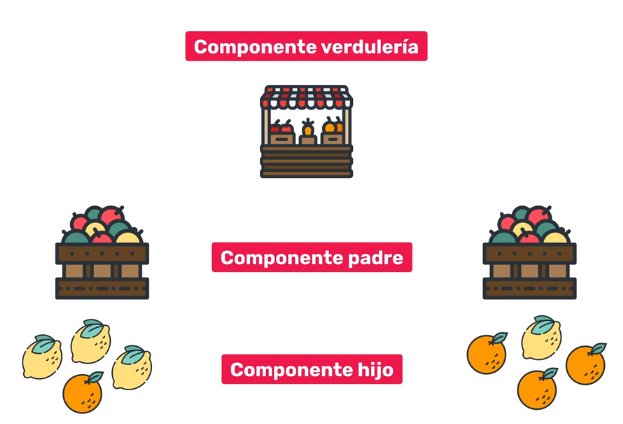
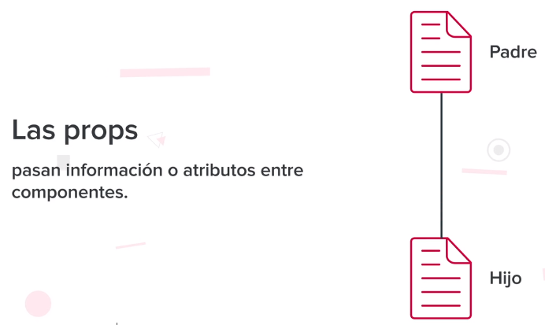
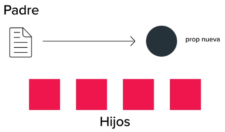
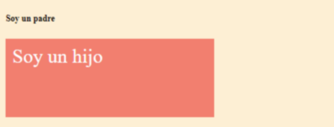
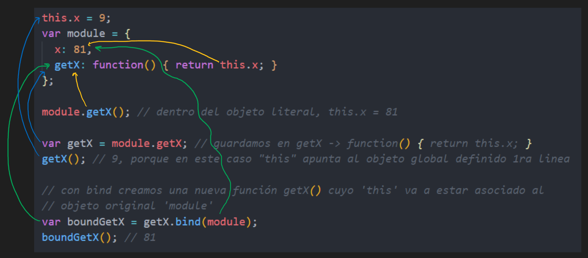
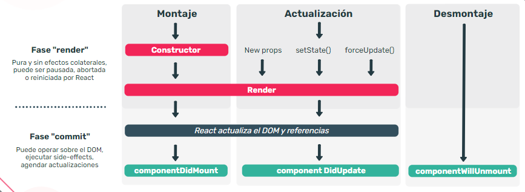
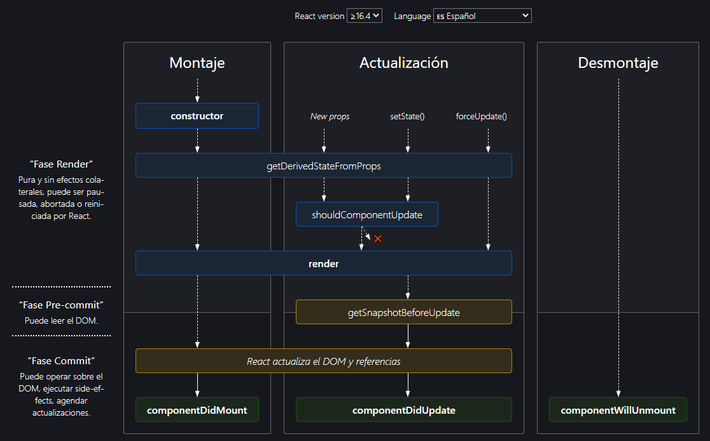

---

<t>Frontend III</t>

---
## Índice

1. Módulo 1 - Primeros pasos en react
- [Intro a React](#c1)
- [Sintaxis jsx](#c1a) 
- [Dom vs Virtual DOM](#c1b)
- [JSX](#c1c)
- [React vs JSX](#c1d)
- [Create React App](#c1e)
- [Herramientas instaldas con CRA](#c1f)
- [Estructura de carpetas](#c1g)

2. Módulo 2 - Componentes reutilizables
- [Componentes](#c2)
- [Componentes de clase vs funcionales](#c2a)
- [Funcionales](#c2a-1)
- [Props](#c2b)
- [Fragment](#c2c)
- [Children](#c2d)
- [Componentes dinámicos](#c2e)
- [CSS](#c2f)
- [Componentes con estado](#c2g)
    - [State y setState](#c2h)
    - [bind, call y apply](#c2g)
- [Ciclo de vida](#c2h)
- [Eventos y formularios](#c2i)
- [Componentes controlados vs no controlados](#c2j)
- [Formik y SweetAlert2](#c2k)

3. Módulo 3 - Apis y enrutamiento dinámico
- [APIs](#c3)
- [Fetch](#c3a)
- [Axios](#c3b)
- [Fetch vs Axios](#c3c)
- [Enrutamiento](#c3d)
- [SPA](#c3e)
- [Concordancia](#c3f)
- [Enrutamiento estático](#c3g)
- [Enrutamiento dinámico](#c3h)
- [Enrutamiento estático](#c3g)
- [Enrutamiento estático](#c3g)

4. Módulo 4 - Introducción a hooks

# C1 - Introducción <a id='c1'></a>
<!--  .png) -->
<!-- []() <a id='c1a'></a> -->
# Introducción a React <a id='c1'></a>

React es una librería de JavaScript para crear proyectos del lado del front end. Entre muchas de sus ventajas, su implementación permite que la carga de la aplicación sea más rápida y performante. ¿Cómo logra esto? React utiliza componentes, que no son otra cosa más que bloques de código que crearemos una única vez para luego reutilizar cuando lo necesitemos.

React nos permite utilizar un Virtual DOM (que se almacena en la memoria, una copia).  Luego cuando hay que actualizar el DOM, react lo que hace es comparar su DOM Virtual con el DOM real y enviarle los elementos que le hacen falta y no todo uno nuevo.

# Sintáxis jsx <a id='c1a'></a>

Anteriormente se utilizaba `React.createElement(type, [props], [...children])` que servía para crear elementos, componenetes y fragmentos. Actualmente desde react desarrollaron su propia sintáxis llamada JSX, que combina HTML y JS.

Un detalle que vale la pena mencionar es que el navegador no entiende JSX enctonces ¿cómo funciona? Básicamente React transpila el código JSX a JS, y se encarga de hacer las llamadas a `React.createElement`

## Antes (Vainilla JS)

```jsx
const p1 = React.createElement(
		"p",
		{ key: 1 },
		"Soy p1"
	);
const p2 = React.createElement(
		"p",
		{ key: 1 },
		"Soy p2"
	);
const div = React.createElement(
		"div",
		null,
		[p1, p2]
	);
ReactDOM.render(div, document.querySelector("#root"));
```

## Ahora (JSX)

```jsx
const Div = ({p1, p2}) => {
  return (<div>
 	    <p>{p1}</p>
 	    <p>{p1}</p>
  </div>)
}
ReactDOM.render(Div, document.getElementById('root'));
```

Algo importante que debemos aclarar es el uso de las llaves. En JSX vamos a utilizar las llaves para poder escribir dentro Vainilla JS, así que tenemos que prestar atención al escribir el código, que sea correcto.

# Dom vs Virtual DOM <a id='c1b'></a>

[DOM](https://view.genial.ly/6057d7fda6568b0d0359039d)

# JSX <a id='c1c'></a>

JSX no es un requisito para usar React, pero es muy conveniente usar esta sintaxis porque se puede escribir HTML directamente dentro de código JavaScript.

En el corazón de React está la idea de que en realidad la lógica de renderizado (o representación visual) está intrínsecamente acoplada con la lógica encargada de cómo manejar los eventos, cómo cambiar el estado de la interfaz con el tiempo y cómo preparar los datos para su visualización.

Por eso, React separa los aspectos (concerns) en unidades débilmente acopladas llamadas "componentes" que contienen tanto el marcado (HTML) como la lógica (Javascript), en lugar de separarlos artificialmente en archivos .js y .html.

## Algunos datos

1. JSX significa Javascript XML y no es una extensión estándar. También se conoce como JavaScript Syntax Extension, pero el nombre más aceptado es Javascript XML.
2. JSX permite crear estructuras tipo árbol compuestas por HTML o elementos de React como si fueran variables de JS
3. En realidad, JSX no es absolutamente necesario, pero es la forma actual favorecida por la comunidad porque es más cómoda (syntactic sugar) para crear elementos, mostrar errores y advertencias.
4. Tampoco es necesario usar React para poder usar JSX. Existen varios transpiladores como  [https://github.com/alexmingoia/jsx-transform](https://github.com/alexmingoia/jsx-transform) y [https://babeljs.io/](https://babeljs.io/)
5. La especificación JSX no intenta cumplir con ninguna especificación XML o HTML, sino que está diseñada como un agregado para ECMAScript, por lo que la similitud con XML es solo para que la sintaxis sea familiar. ([https://facebook.github.io/jsx/](https://facebook.github.io/jsx/)).

## Particularidades y restricciones

- Los componentes definidos por el usuario deben comenzar con mayúscula
- Las propiedades en JSX utilizan la nomenclatura de camelCase. Esto quiere decir que en vez de utilizar `classname`, deberíamos usar `className` (`class="..."` no funciona porque recordemos que no es HTML). Esto tambien aplica para los manejadores de eventos (usar `onClick` en vez de `onclick`)
- Todas las etiquetas tienen que ser de apertura y cierre `<> </>`, sino tienen hijes (como ``,  `<br>`,  `<input>` o  `<hr>`) se puede hacer `< />` (quedaría ``
- Solo se puede renderizar o almacenar UN elemento (html)
- Usar fragmentos. Estos son elementos invisibles que sirven para encapsular a mas de un elemento adyacente y que se puedan guardar.

```jsx
// Opción inválida, porque el nombre del componente no empieza con mayúscula
const saludo = () => {
 return (
   <div>
	    <h1> Hola!</h1>
	     
    </div>
  );
}
// Si luego quisieramos usarlo en otra funcion y hacer algo como:
const UsandoSaludo () => {
	// ...
	return <saludo/>
	// React va a pensar que saludo es una etiqueta HTML (porque no empieza con mayúscula)
}

// Opción inválida (no se puede renderizar/almacenar más de un elemento
 const Saludo = () => {
 	return (
    <h1> Hola!</h1>
 	   
  );
}

// Opción válida, porque está todo en un div
const Saludo = () => {
 return (
   <div>
	    <h1> Hola!</h1>
	     
    </div>
  );
}

// Opción válida usando fragmentos
const Saludo = () => {
	return (
    <>
      <h1> Hola!</h1>
		   
	  </>
  );
}
```

## Ejemplo

```html
<!DOCTYPE html>
<html lang="es">
  <head>
    <meta charset="UTF-8" />
    <meta name="viewport" content="width=device-width, initial-scale=1" />
    <title>Ejemplo React</title>
  </head>
  <body>
		<!-- react -->
		<script crossorigin 
						src="https://unpkg.com/react@17/umd/react.development.js">
		</script>
		<!-- react dom -->
    <script crossorigin 
						src="https://unpkg.com/react-dom@17/umd/react-dom.development.js">
		</script>
		<!-- jsx-->
    <script src="https://unpkg.com/babel-standalone@6/babel.min.js"></script>
    <div id="root"></div>
		<!-- mi script-->
		<script type="text/babel" src="script.js"></script>
  </body>
</html>
```

```jsx
function Cupcacke({color, sabor}) {
    return (
        <div className="cupcake">
            <h2>{color}</h2>
            <p>{`Sabor:  ${sabor}`}</p>
        </div>
    );
}
const root = document.querySelector("#root");
const cupcakeVainilla = Cupcake({color: "Rojo", sabor: "Vainilla"});
ReactDOM.render(cupcakeVainilla, root);
```

### React vs JSX <a id='c1d'></a>

React puro:

```jsx
function MyDiv(props) {
    return React.createElement("div", null, props.children);
}
const span = React.createElement("span", { style: { color: "blue" } }, "soy span");
const p = React.createElement("p", { style: { color: "red" } }, "soy p");
const myChildren = [
    p,
    span
];
ReactDOM.render(
    React.createElement(MyDiv, null, myChildren),
    document.querySelector("#root")
);
// <div>
//      <p style="color: red;">soy p</p>
//      <span style="color: blue;">soy span</span>
// </div>
```

React con JSX:

```jsx
function MyDiv(props) {
    return <div>{props.children}</div>;
}

function MyP(props) {
    return <p style={{color: props.color}}>{props.children}</p>
}

function MySpan(props) {
    return <span style={{ color: props.color }}>{props.children}</span>
}
ReactDOM.render(
    <MyDiv>
        <MyP color="red">soy p</MyP>
        <MySpan color="blue">soy span</MySpan>
    </MyDiv>,
    document.querySelector("#root")
);
// <div>
//      <p style="color: red;">soy p</p>
//      <span style="color: blue;">soy span</span>
// </div>
```

# Create React App <a id='c1e'></a>

Es un creador oficial de aplicaciones de React desarrollado por Facebook. **CRA configura,** mediante un solo comando**, un ambiente de desarrollo de forma que podamos usar las últimas características de Javascript**, permitiendo una gran y simple experiencia de desarrollo, y optimizando nuestra aplicación para producción. Asimismo, **genera proyectos con compilación y linting preestablecidos**. También **viene con un servidor de desarrollo y soporte de aplicación web progresiva (PWA) de primera clase.**

Linting es la detección de ciertos errores al momento de desarrollar las aplicaciones, entre estos podemos encontrar: 

- Errores de sintaxis
- Código poco intuitivo o difícil de mantener
- Uso de "malas prácticas"
- Estilos de código inconsistentes

## Beneficios

.png)

## Instalación

- Node → es un entorno que nos permite interpretar JS fuera del navegador
- npm → el node package manager vendría a ser una raspberry pi sobre la cual podemos agregar cositas para crear otras. Esas "nuevas cositas" serían módulos que podemos descargarnos desde [acá](https://www.npmjs.com/). Siempre nos va a pedir que instalemos algo antes de poder ejecutarlo.
- npx → es una versión efímera de npm, que a diferencia de este último, nos permite ejecutar un package sin instalarlo

### Una opción sería

1. `npm install -g create-react-app`
2. `cd [carpeta en la que queramos crear el proyecto]`
3. `npm init react-app proyecto`
4. `cd proyecto`
5. `npm start`
6. Ir a `localhost:3000` 

### Con CRA podríamos hacer

1. `npx create-react-app [nombre del proyecto]` (o si utilizamos yarn `yarn create react-app [nombre del proyecto]`).
    
    <aside>
    💡 Si estamos usando `Typescript` podemos agregar el flag `--template typescript`.
    
    </aside>
    
2. Luego debemos arrancar nuestro proyecto con `npm start` o `yarn start`
3. Ir a `localhost:3000` 

## Herramientas instaldas con CRA <a id='c1f'></a>

- Webpack → es un empaquetador de aplicaciones que convierte archivos y módulos en un estático distribuible. Es un bundle, un conglomerado de varios recursos que una página web necesita para funcionar.
    
    El bundle generalmente es un sólo archivo y algunos de sus beneficios son: solo requiere una solicitud a la  red y puede superponer otras optimizaciones como minificación y comprensión de código.
    
    Se encarga de empaquetar el código, transpilar TypeScript y trabajar con React y archivos .tsx.
    
    .png)
    
- Babel → es un transpilador que ademas de transformar compila cualquier código JS escrito en versiones superiores a ECMAScript 2015+ a versiones de JS que los distintos navegadores del mercado puedan leer.
    
    ECMAScript es un estándar publicado por Ecma International, y contiene la especificación para un lenguaje de scripting de propósito general. En otras palabras, sirve como guía o referencia para estandarizar los avances del código JS.
    
- ESLint → es una herramienta de linting. Realiza análisis de código estático para identificar patrones problemáticos encontrados en el código JavaScript.
- Jest → es un marco de prueba de JS mantenido por Facebook con un enfoque en la simplicidad y el soporte para grandes aplicaciones web.
- `@testing-library` →es una solución muy liviaa para probar componentes de React. Proporciona funciones de utilidad ligeras con el fin de fomentar mejores prácticas de testeo.

## Estructura de carpetas <a id='c1g'></a>

.png)

```bash
mi-proyecto/
  |-- node_modules/              --> almacena todos los paquetes npm del proyecto           
  |-- public/                    --> contiene el index.html con un div#root  
  |     |-- favicon.icon
  |     |-- index.html
  |     |-- manifest.json
	|-- src/                       --> todo lo que sea React se hace acá  
	|		|-- components/
	|		|   |-- Avatar/
	|		|   |   |-- Avatar.css
	|		|   |   |-- Avatar.jsx
	****|		****|   |   |-- Avatar.test.js
	|		|   |-- Button/
	|		|   |   |-- Button.css
	|		|   |   |-- Button.jsx
	|		|   |   |-- Button.test.js
	|		|   |-- TextField/
	|		|   |   |-- TextField.css
	|		|   |   |-- TextField.jsx
	|		|   |   |-- TextField.test.js
	|		|-- App.jsx
	|		|-- index.js
  |-- .gitignore
  |-- package-lock.json          --> le indica a npm como desglosar las versiones de paquetes de node, es como un historial de lo que hacemos con npm
  |-- package.json               --> es el manifiesto del proyecto que provee al gestor de paquetes (node y npm) la información necesaria sobre los módulos del proyecto
  |-- README.md
```

<!-- ############### Módulo 2 ############## -->
# Módulo 2 - Componentes <a id='c2'></a>

Bimestre: 3
Class: Frontend III
Temas: Componentes de clase, componentes funcionales, children, props, state, bind, ciclo de vida
Type: Apuntes

# Qué es un componente

Los componentes son piezas funcionales y fundamentales de la aplicación, ya que nos van a permitir separar las distintas partes que conforman la estructura de un sitio web en pequeñas piezas independientes y reutilizables. Estas están pensadas para trabajar de forma aislada, pero haciendo parte de un “todo”.

Técnicamente, un componente es una clase o función que devuelve HTML a través de sintaxis JSX. Una vez definido, este se inscribe dentro del árbol de componentes de la aplicación. 



## Para qué sirven

Nos permiten separar la interfaz de usuario en piezas independientes, reutilizables y pensar en cada pieza de forma aislada.

# Características

1. Anidación → un componente puede ser mostrado dentro de otro
2. Reusabilidad → un componente bien construido puede reutilizarse en cualquier aplicación
3. Configuración → permite la posibilidad de configurarse en su creación

# Componentes de clase vs funcionales <a id='c2a'></a>

A partir de la versión 16.8 de React los componentes funcionales implementaron el uso de Hooks. Esta novedad permitió a los componentes funcionales poder brindar la misma utilidad que los de clase con algunas ventajas relacionadas a su mayor simpleza y legibilidad y su menor peso, entre otras.


### Funcionales <a id='c2a-1'></a>

- Es una clase que extiende de `React.Component`
- Sintaxis menos breve y clara
- Usa this
- Usa constructor
- Tiene ciclo de vida a través de métodos
- Menos facilidad de reutilización

```jsx
import React from "react";
import ReactDOM from "react-dom";

class MiComponenteDeClase extends React.Component {
	render() {
		return <h1>Hola mundo de las clases</h1>;
	}
}

ReactDOM.render(
	<MiComponenteDeClase />,
	document.getElementById("root")
);
```

- Es una función
- Sintáxis más breve y clara
- No usa this
- No requiere constructor
- Usa hooks a partir de la versión 16.8
- Más reutilizables

```jsx
import React from "react";
import ReactDOM from "react-dom";

const MiComponenteFuncional = () => <h1>Hola mundo de las funciones</h1>;

ReactDOM.render(
	<MiComponenteFuncional />,
	document.getElementById("root")
);
```

# Props <a id='c2b'></a> 



Las props son los datos internos de un componente. Representan información que es enviada al momento en el que un componente es utilizado. Estas permitirán que la información interna del componente sea variable para que podamos tener estructuras HTML realmente dinámicas y 100% reutilizables.

1. Son inmutables → el componente hijo solo puede leerlas
2. Son recibidas → por los hijos
3. Facilitan la reutilización de componentes
4. Son pasadas al componente hije cuando se está creando



# Fragment <a id='c2c'></a>

Cuando se trabaja con componentes en React, es necesario retornarlos dentro de una etiqueta que los envuelva. Esto produce que en un HTML se creen etiquetas vacías innecesarias y lo resuelve Fragment. Una posible solución es agrupar todo en una <div>, pero generaría etiquetas extra una y otra vez. Para ello React nos da la posibilidad de usar Fragment y así utilizar un envoltorio que finalmente no generará un nodo extra en nuestro DOM.

## Ejemplo sin fragment

```jsx
import React from "react";
import ReactDOM from "react-dom";

const numeros = [1, 2, 3, 4, 5, 6, 7, 8, 9];
const listarNumeros = numeros.map(num => {
	<div>
		<span>Nro:</span>
		<p>{num}</p>
	</div>
});

ReactDOM.render(
	<div>{listarNumeros()}</div>,
	document.getElementById("root")
);
```

```html
<body>
	<div id="root">
		<div>
			<div>
				<span>Nro:</span>
				<p>1</p>
			</div>
			<div>
				<span>Nro:</span>
				<p>2</p>
			</div>
			<div>
				<span>Nro:</span>
				<p>3</p>
			</div>
			...
		</div>
	</div>
</body>
```

## Ejemplo con fragment

```jsx
import React from "react";
import ReactDOM from "react-dom";

const numeros = [1, 2, 3, 4, 5, 6, 7, 8, 9];
const listarNumeros = numeros.map(num => {
	<React.Fragment>
		<span>Nro:</span>
		<p>{num}</p>
	</React.Fragment>
});

ReactDOM.render(
	<React.Fragment>{listarNumeros()}</React.Fragment>,
	document.getElementById("root")
);
```

```html
<body>
	<div id="root">
		<span>Nro:</span>
		<p>1</p>
		<span>Nro:</span>
		<p>2</p>
		<span>Nro:</span>
		<p>3</p>
		<span>Nro:</span>
		<p>4</p>
		...	
		</div>
	</div>
</body>
```

<aside>
💡 Otra forma de usar los fragments es con `<></>`

</aside>

# Children <a id='c2d'></a>

Seguramente van a existir casos en los que tengamos un componente y queramos tan dinámico su uso que no va a ser suficiente con el simple uso de las props. Es aquí en donde cobran un particular protagonismo los children. A través de ellos vamos a tener la capacidad de enviar (como si fuera una prop) cualquier tipo de estructura HTML.

```jsx
import React from "react";
import ReactDOM from "react-dom";

const Padre = props => {
	return (
		<div
			style={{
				width:"75%",
				background: "#FFEFD5",
				height:"200px"
			}}
		>
			<h2>Soy un padre</h2>
			{props.children}
		</div>
	);
}

const Hijo = props => {
	return (
		<div
			style={{
				width:"50%",
				background: "#FA8072",
				height:"100px",
				padding: "10px",
				fontSize:"40px"
			}}
		>	
			{props.autor}
		</div>
	);
}

const App = () => {
	return (
		<Padre>
			<Hijo autor="Soy un hijo"/>
		</Padre>
	);
}

ReactDOM.render(<App/>, document.getElementById("root");
```



# Componentes dinámicos <a id='c2e'></a>

## Map y keys

La función `map` nos permite mapear, o transformar, los elementos de un array en otros elementos para un nuevo array.

```jsx
map((element) => { ... } )
map((element, index) => { ... } )
```

En React la palabra clave `key` es un artibuto especial de tipo `string` que se debe incluir al crear listas de elementos. React lo utiliza para identificar cuáles elementos han cambiado, se han agregado o eliminado.  Las `keys` deben ser dadas a los elementos dentro del mapeo del array para darles una identidad única y estable:

```jsx
function MiLista(props) {
	return (
		<ol>
			{props.items.map((item, i) => <li key={i+item}>{item}</li>)}
		</ol>
	);
}
```

Es muy importante asignar la propiedad key a los elementos dentro de una lista para que React pueda identificarlos con precisión. De no hacerlo, recibiremos una advertencia de que se debe proporcionar una clave para los elementos de la lista.

### Qué pasa si no asignamos un valor a la propiedad key

Lo que puede suceder es una de dos cosas: podríamos tener un muy bajo rendimiento de la aplicación al hacer cambios en la lista, o podríamos tener resultados inesperados (bugs) dependiendo del tipo de operaciones que realicemos sobre la lista. 

Esto ocurre porque cuando React aplica su algoritmo de diferenciación (diffing algorithm) sobre dos árboles del DOM, primero compara los dos elementos raíz, y el comportamiento es diferente dependiendo de los tipos de elementos raíz:

1. Siempre que los elementos raíz tengan diferentes tipos, React derribará el árbol actual y construirá el nuevo árbol desde cero.
2. Si los elementos raíz son del mismo tipo, React observará los atributos de ambos y mantendrá el mismo nodo DOM subyacente. Entonces, React solo actualizará los atributos modificados y enseguida recorrerá a los hijos de los elementos.

React recorre al nodo actual y al nodo nuevo al mismo tiempo y generará una mutación siempre que haya una diferencia entre los elementos. Es en este punto donde se puede hacer una diferencia, porque si el usuario agrega, elimina, o actualiza algunos elementos, no se necesita recrearlos a todos, pero si React no identifica a cada uno de los elementos, los cambiará a todos en lugar de darse cuenta de que puede mantener intactos algunos, incluso quizá la mayoría.

Es por esto que React soporta el atributo `key`. Cuando los elementos de un mismo tipo dentro de un subárbol tienen keys, React las usa para hacer coincidir los elementos en el árbol original con los elementos del nuevo árbol. Esto es lo que le permite ahorrar cambios innecesarios.

<aside>
💡 Los atributos key pueden ser una propiedad ID que agreguemos, o alguna composición hecha con algunas partes del contenido del elemento. La key solo tiene que ser única entre hermanos, no globalmente.

</aside>

## CSS <a id='c2f'></a>

- Módulos CSS
    - Escriben estilos en archivos `css`, `scss`, etc. (de manera nativa), consumidos como objetos JS
    - Automatizan nomenclaturas de clases y animaciones evitando la colisión de nombres
- Componentes Estilizados
    - Explotan las `tagged templates`
    - Eliminan el mapeo entre componentes y estilos

### Ejemplo con módulos


```jsx
import styles from "./encabezado.module.css"

const Encabezado = () => {
	return (
		<header>
			<h1 className={styles.title}>Encabezado</h1>
		</header>
	);
}
```

```jsx
import styles from "./footer.module.css"

const PieDePagina = () => {
	return (
		<footer>
			<h1 className={styles.title}>Pie de página</h1>
		</footer>
	);
}
```

```jsx
import styles from "./lista.module.css"

const Lista = props => {
	// código que prepara la lista
	return (
		<div className={styles.lista} role="main">
			<h1 className={styles.title}>Películas</h1>
			{lista}
		</div>
	);
}
```

# Componentes con estado <a id='c2g'></a>

Los componentes stateful, o con estado, son aquellos que poseen información interna que puede ser modificada propiamente por estos componentes. Este tipo de componente es sumamente funcional dado que nos permite dejar de depender de las props para trabajar con información dinámica.

Estos componentes ya no serán funciones nativas de JavaScript, sino que los trabajaremos como un nuevo tipo de dato: una clase:

```jsx
import React, { Component } from 'react';
	class NombreComponente extends Component {
		render () {
			 return (
				// código a renderizar ...
				);
		};
	}
export default NombreComponente;
```

## Cuándo usarlos

No debemos pensar que ahora todos nuestros componentes deberán ser stateful, ya que dicha decisión dependerá del contexto dentro del que se utilice dicho componente. En general solemos utilizar los componentes stateful **cuando esperamos cierta interacción del usuario** y, en base a eso, queremos que el interior de nuestro componente cambie. Los componentes stateful son reactivos y por ende el DOM se actualiza cuando es necesario.

## State y setState <a id='c2g'></a>

En su momento, dijimos que una de las razones por las cuales React nos beneficia es la actualización por componentes del DOM. También, indicamos que los componentes con estado eran reactivos a las interacciones con el usuario y que, en base a eso, se actualizaban o no. Ahora, llegó el momento de fusionar estas dos características de React y empezar a usarlas.

Para cambiar el valor de un estado debemos crear un metodo que permita modificarlo. Dentro del metodo creado vamos a utilizar el método `setState()` que recibe como parametro un nuevo estado y reemplaza completamente al estado anterior con el estado nuevo. Finalmente para poder modificar el estado debemos llamar a ese método que hemos creado, por ejemplo: que se ejecute al presionar un boton.

```jsx
import React, { Component } from 'react';
class Contador extends Component {

	// Sin props
	constructor() {
		super();
		this.state = { valor: 1, ... };
	}
	
  // Con props
	constructor(props) {
		super();
		this.state = { valor: props.value, ... };
	}

	incrementar() {
		this.setState({
			valor: this.state.valor + 1,
			...
		});
	}	

	render () {
		return (
			<button
				 onClick={this.incrementar}>
			</button>
		);
	};
}
export default NombreComponente;
```

# Explicación bind, call y apply  <a id='c2g'></a>

- Sin `call` ni `apply` ni `bind` haríamos:
    
    ```jsx
    var person1 = {firstName: 'Jon', lastName: 'Kuperman'};
    var person2 = {firstName: 'Kelly', lastName: 'King'};
    
    function say(person, greeting) {
        console.log(greeting + ' ' + person.firstName + ' ' + person.lastName);
    }
    
    say(person1, 'Hello'); // Hello Jon Kuperman
    say(person2, 'Hello'); // Hello Kelly King
    ```
    
- `Call` invoca la función y permite pasarle los argumentos de a uno.
    
    ```jsx
    var person1 = {firstName: 'Jon', lastName: 'Kuperman'};
    var person2 = {firstName: 'Kelly', lastName: 'King'};
    
    function say(greeting) {
        console.log(greeting + ' ' + this.firstName + ' ' + this.lastName);
    }
    
    say.call(person1, 'Hello'); // Hello Jon Kuperman
    say.call(person2, 'Hello'); // Hello Kelly King
    ```
    
- `Apply` invoca la función y permite pasarle los argumentos en un array.
    
    ```jsx
    var person1 = {firstName: 'Jon', lastName: 'Kuperman'};
    var person2 = {firstName: 'Kelly', lastName: 'King'};
    
    function say(greeting) {
        console.log(greeting + ' ' + this.firstName + ' ' + this.lastName);
    }
    
    say.apply(person1, ['Hello']); // Hello Jon Kuperman
    say.apply(person2, ['Hello']); // Hello Kelly King
    ```
    
- `Bind` devuelve una nueva función, permitiendones pasarle los argumentos.
    
    ```jsx
    var person1 = {firstName: 'Jon', lastName: 'Kuperman'};
    var person2 = {firstName: 'Kelly', lastName: 'King'};
    
    function say() {
        console.log('Hello ' + this.firstName + ' ' + this.lastName);
    }
    
    var sayHelloJon = say.bind(person1);
    var sayHelloKelly = say.bind(person2);
    
    sayHelloJon(); // Hello Jon Kuperman
    sayHelloKelly(); // Hello Kelly King
    ```
    

```jsx
this.x = 9;
var module = {
  x: 81,
  getX: function() { return this.x; }
};

module.getX(); // 81

var getX = module.getX;
getX(); // 9, porque en este caso, "this" apunta al objeto global

// Crear una nueva función con 'this' asociado al objeto original 'module'
var boundGetX = getX.bind(module);
boundGetX(); // 81
```




# Ciclo de vida <a id='c2h'></a>

1. Nacer → ser agregan al DOM
2. Crecer → se actualizan, cambian de estado
3. Morir → se sacan del DOM

Existen tres métodos que heredamos de la clase `Component` que nos permiten manipular la información antes y después del `render()`:

- Nacimiento → **Montaje**
    1. `constructor()` → es llamado antes del montaje en realidad, y si bien no es obligatorio, sí es necesario si queremos inicializar el estado y enlazar handlers a una instancia.
    2. `componentWillMount()` → se invoca solo una vez cuando el componente se monta en el DOM. podemos actualizar el estado
    3. `render()` → montaje
    4. `componentDidMount()` → se montó
- Crecer → **Actualización**
    1. `shouldComponentUpdate()` → si es true, llama al siguiente método, de lo contrario no.
    2. `componentWillUpdate()` → es llamado antes de la actualización
    3. `render()` → montaje
    4. `componentDidUpdate()` → es invocado con cada actualización de `state` o `props` que sucede luego del montaje, nos permite comparar valores previos con actuales para tomar decisiones
- Muerte → **Desmontaje**
    1. `componentWillUnMount()` → se llama cuando un componente está por desmontarse. Si bien es algo que React hace sólo, puede desconocer especificidades del componente y quizás no sabe cómo limpiar el componente removido, par eso nos sirve este método. La limpieza es útil, por ejemplo, si el componente realizó llamadas a APIs asincrónicamente y se desmontó antes de recibir la response. Si bien no pasaría nada grave, se registrará una advertencia sin establecerse el estado, y registrar las advertencias nos servirá para rastrear errores a futuro.



## Ejemplo


## Más métodos



- `static getDerivedStateFromProps(props, state)` → Este método es invocado justo antes de render(). Devolverá un objeto en el caso de tener que actualizar el estado, o null en caso contrario. Se usa en casos raros en los cuales se le permite a un componente actualizar su estado interno como resultado de cambios en las props. Es un método estático porque se espera que se comporte como una función pura y no tenga efectos secundarios.
- `shouldComponentUpdate(nextProps, nextState)` → Compara nuevos estados o props con los previos. Entonces, puede devolver false si no es necesario volver a renderizar el componente. Este método se utiliza para hacer que los componentes sean más eficientes.
- `getSnapshotBeforeUpdate(prevProps, prevState)` → Facilita hacer operaciones sobre los elementos del DOM antes de que el componente sea realmente comprometido con el DOM. Por ejemplo, la posición exacta del scroll en un momento determinado. La diferencia entre este método y render() es que getSnapshotBeforeUpdate() no es asincrónico. Con render(), puede pasar que la estructura DOM cambie entre el momento en que se llama y cuándo se realizan los cambios en el DOM. Cualquier valor que se devuelva en este método de ciclo de vida se pasará como parámetro a componentDidUpdate().

[https://projects.wojtekmaj.pl/react-lifecycle-methods-diagram/](https://projects.wojtekmaj.pl/react-lifecycle-methods-diagram/)

# Eventos y formularios <a id='c2i'></a>

## Manejar eventos

Con métodos y bind:

```jsx
class Eventos extends Component {
	constructor(props) {
		super(props);
		this.state = { color: "red" }
		this.handleChangeColor = this.handleChangeColor.bind(this);
	}

	handleChangeColor () {
		this.setState({ color: "blue"});
	}

	render() {
		return (
			// En este caso tenemos un botón con un evento onClick que llama al manejador handleChangeColor. 
			// En esta función se setea la pieza de estado de red a blue
			<button onClick={this.handleChangeColor}>{this.state.color}</button>
		);
	}
}
```

Con arrow functions:

```jsx
class Eventos extends Component {

	state = { color: "red" }
	
	handleChangeColor = () => {
		this.setState({ color: "blue"});
	}

	render() {
		return (
			<button onClick={this.handleChangeColor}>{this.state.color}</button>
		);
	}
}
```

Con funciones anónimas:

```jsx
class Eventos extends Component {
	state = { color: "red" }

	render() {
		return (
			<button onClick={() => this.setState({ color: "blue" })}>
				{this.state.color}
			</button>
		);
	}
}
```

## Componentes controlados vs no controlados <a id='c2j'></a>

Con controlar nos referimos a llevar un registro de lo que pasa en un `input`, tanto de sus valores como de sus actualizaciones. Controlamos los datos para asegurarnos desde el comienzo la integridad de los mismos, antes de persistirlos en la base de datos. React utiliza el `state` y las `props` para controlar los datos.

Los componentes no controlados en realidad sí están siendo controlados, sólo que no por React (por eso desde esta librería se los llama "no controlados"). Para estos componentes es el DOM quien se encarga del control.

## Ejemplo

```jsx
import React, { Component } from "react";
import Swal from 'sweetalert2';
import './styles.module.css';

const App = () => <MyLittleForm />;

class MyLittleForm extends Component {

	state = { name: "", error: false };

	// actualiza el name para que podamos ir viendo lo que escribimos en el input
	handleChange = (event) => {
		this.setState({
			name: event.target.value,
			error: false
		});
		console.log('Has cambiado el nombre');
	}

	// controla lo que ocurre cuando se dispara el evento onSubmit
	handleSubmit = (event) => {
		event.preventDefault();
		// validamos que el nombre no este vacio
		if(this.state.name === "") {
			this.setState({ error: true});
		}
		else {
			Swal.fire('Hello ' + this.state.name);
			this.setState({ name: ''});
		}
	}
	render() {
		return (
			<form onSubmit={this.handleSubmit}>
				
				<label>Name</label>
				<input
					type="text"
					value={this.state.name}
					onChange={this.handleChange}
				/>
				{this.state.error && <span>This field is required</span>}
				<button type="submit">Submit!</button>
			</form>
		);
	}
}
```


## Formik y SweetAlert2 <a id='c2k'></a>

[PPT para Alternativas en formularios y modales.pdf](/img/PPT_para_Alternativas_en_formularios_y_modales.pdf)

<!-- ############### Módulo 3 ############## -->

# Módulo 3 - APIs y enrutamiento dinámico

# Integración con APIs

## Efectos secundarios

Hasta ahora venimos implementando funciones puras (o algo aproximado) en nuestros componentes. Este tipo de funciones provienen del paradigma funcional y se definen como aquellas que:

- Siempre producen el mismo resultado cuando se le dan los mismos argumentos
- No producen efectos secundarios

Esas características las hacen predecibles, optimizables y reutilizables, cualidades que identifican a los componentes de React.

Un **efecto secundario** se trata de una consecuencia sobre algo que iniciamos, pero que no controlamos en su desarrollo. En React un efecto secundario sería una operación invocada dentro de un ámbito específico pero que transcurre fuera del mismo, por lo que su resultado podría ser dificil de manerjar afectando nuestra aplicación.

Un ejemplo sería hacer una petición a una API desde alguno de los métodos del ciclo de vida:

.png)


De acá se desprenden dos elementos:

1. Existe la posibilidad (o no) de errores en la respuesta de la API
2. La respuesta puede ser asíncrona

Los efectos secundarios, técnicamente hablando, violan el principio SRP que plantea que una clase o módulo debe tener una única razón para cambiar. React necesita predecir y controlar los efectos secundarios, y lo hace a través de los métodos del ciclo de vida.

React es compatible con cualquier biblioteca AJAX, desde bibliotecas con soporte nativo como `fetch` hasta third party como `axios`. Es importante recordar que las llamads a APIs en un componente de React se realizan durante el mismo cico de vida. Las opciones son en los métodos:

- `componentDidMount()`
- `componentDidUpdate()`
- `componentWillMount()` acá limpiaríamos los efectos de la petición si el componente se desmontó antes de obtener la response

## Fetch <a id='cc3a'></a>

Es una API nativa de JS para los navegadores que permite realizar peticiones HTTP asincrónicas por medio de promesas. 

```jsx
fetch(url)
 .then((res) => res.json())
 .then((res) => console.log(res));
```

```jsx
const options = {
	method: "POST",
	credentials: "include",
	headers: { "Content-Type": "application/json" },
	body: datos ? JSON.stringify(datos) : null,
}

fetch(url, options);
```
 .png)


## Axios <a id='c3b'></a>

Es una biblioteca third party que admite la API Promise y facilita la configuración y ejecución a través de un cliente HTTP basado en promesas para Node.js. Las principales ventajas de Axios son

- Interceptar requests y responses
- Cancelar solicitudes
- Protección contra XSRF
- Transformar datos de requests y responses
- Transformar automáticamente datos JSON

Para instalarlo debemos ejecutar el comando `npm install axios`.

[PDF para Axios.docx.pdf](./img/PDF_para_Axios.docx.pdf)

## Fetch vs Axios <a id='c3c'></a>

.png)

## Ejemplo


# Enrutamiento <a id='c3d'></a>

## Qué es

El enrutamiento es un mecanismo que interpreta y manipula las URLs y, como resultado, el navegador carga una vista con los recursos pedidos.

- URL
    - Es una indicación de cómo acceder a ciertos contenidos en un sitio web.
    - Una vista es lo que el usuario ve.
    - Las URLs pueden venir desde la barra de direcciones del navegador o desde eventos disparados desde la aplicación.
    - Una URL no es en realidad una ruta, es más bien una indicación de cómo se deben armar y conseguir los recursos. Esta indicación es interpretada por el enrutador de la aplicación.
- Recurso
    - Un recurso es cualquier cosa a la que se pueda acceder a través de la web. Por ejemplo: texto, imágenes, audio, video, scripts, correos electrónicos o páginas web.
    - Con un enrutador se logra el desacople de los recursos utilizados para generar una página web y la URL que se presenta al mundo.

## SPA <a id='c3e'></a>

.png)

Hoy en día, gracias a la potencia de los navegadores, a las bibliotecas y frameworks de front end (como React, Angular o Vue) y a tecnologías propias de JavaScript (como la API de Fetch y AJAX), podemos conectar el navegador con el back end sin necesidad de recargar la página. Esto dio paso a las single page applications (SPA).

Sin embargo, esta nueva forma de hacer las cosas trajo como consecuencia la pérdida de ciertos aspectos del comportamiento natural del navegador.

.png)

.png)

## Problemas

.png)

.png)

## Concordancia <a id='c3f'></a>

En general, necesitamos mantener la concordancia entre una SPA y las funciones tradicionales del navegador. Esto significa que:

- El usuario aún debe poder navegar con URLs usando la barra de direcciones.
- Hay que mantener un historial de cambios de las URLs.
- Hay que manejar los hashes (#) que llevan a partes específicas dentro de una misma página.
- Hay que manejar las transiciones entre estados, lo que antes era la recarga de la página.
- Hay que entretener e informar al usuario mientras se actualiza el estado.

Hay dos aspectos más de mucha importancia desde el punto de vista del negocio. Es importante que las URLs sean: SEO friendly y semánticas. Esto significa que queremos que las URLs sean fáciles de leer para el usuario y fáciles de ser indexadas correctamente por los web crawlers o spiders.

<aside>
💡 Un web crawler es un tipo de bot que normalmente es operado por los motores de búsqueda. Su propósito es indexar el contenido de los sitios web en Internet para que esos sitios web puedan aparecer en los resultados de los motores de búsqueda.

</aside>

## Enrutamiento estático <a id='c3g'></a>

.png)

Para solventar estas necesidades, los frameworks modernos reintrodujeron el concepto de enrutador, pero ahora en el lado del front end.

Tradicionalmente el enrutamiento es parte de la inicialización o configuración de la aplicación, y se hace antes de mostrar algún contenido. A este tipo de enrutamiento se le llama enrutamiento estático. En el enrutamiento estático se deben definir de antemano todas las rutas en una ubicación centralizada. Luego, estas rutas están disponibles en el nivel más externo de la aplicación, antes de que suceda cualquier renderizado.

<aside>
💡 En React Router versión 3, el enrutamiento se resuelve de forma estática, es decir, que las rutas se definen de antemano en una sola ubicación centralizada. Para usarlo tenemos que instalarlo con npm `install react-router-3`

</aside>

.png)

.png)


## Enrutamiento dinámico  <a id='c3h'></a>

Recordando lo visto en la clase anterior, decimos que un enrutamiento es estático cuando las rutas deben definirse antes de que la aplicación escuche peticiones, osea en la etapa de incialización, antes de renderizar los componentes. 

Lo que debemos hacer al enrutar estáticamente es agrupar todos nuestros paths en un archivo que luego orquestará el componente a renderizar.
.png)

.png)

El enrutamiento dinámico es el que sucede cuando la aplicación se está renderizando. En este caso no existe una lista de rutas a las que se podrá acceder, agrupadas por motivos de implementación, sino que cada componente tiene asociada una ruta siguiendo las reglas del negocio.

La idea más importante que debemos entender es que con el enrutamiento dinámico ya no necesitamos un archivo con rutas predeterminadas. Pero esto también significa una cosa más: ¡podemos usar componentes `Route` y `Link` según lo necesitemos en cualquier componente! Por supuesto, esto funciona siempre y cuando el componente esté dentro del árbol de `BrouserRouter` y ya sea parte de una ruta, pero ya no es necesario que esté todo en un solo componente o archivo centralizado. Esto es lo que pone el nombre dinámico a enrutamiento dinámico.

.png)

## Diferencias claves

.png)

<!-- ######### Módulo 4 ########## -->
