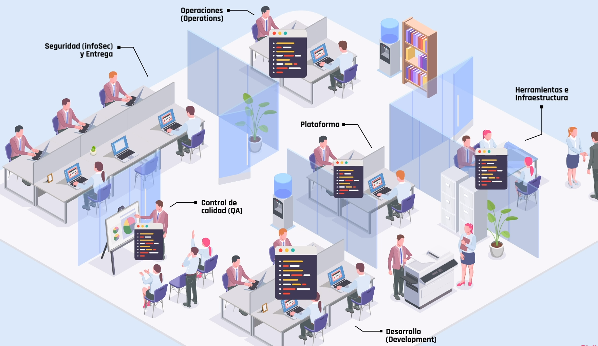

---

<t>Infraestructura II</t>

---
## Índice

1. Módulo 1 - Inmersión
- [C1 ](#c1) Infraestructura como código
- [C1a](#c1a) DevOps
2. Módulo 2 - Infraestructura como código
- [M2](#m2)  Qué es IaC
- [M2a](#m2a) Paradigma imperativo vs Paradigma declarativo
- [M2b](#m2b) Ecosistema de herramientas IaC 
- [M2c](#m2c)  AWS: CloudFormation
    - [M2d](#m2d) Cómo funciona
- [M2e](#m2e) Ansible
    - [M2f](#m2f) Cómo funciona
- [M2g](#m2g) Terraform
        - [M2h](#m2h) Cómo funciona
- [M2i](#m2i) Profundizando con Terraform
- [M2j](#m2j) Ansible vs Terraform vs CloudFormation


3. Módulo 3 - Pipelines
4. Módulo 4 - Monitoreo
5. Módulo 5 - Cierre 

    - # Ejes de la materia
## Infraestructura como código <a id='c1'></a>

Es la gestión de la infraestructura en un modelo descriptivo, utilizando las mismas herramientas de versionado que un equipo utiliza para su código fuente. De manera análoga a cómo el mismo código fuente genera el binario, un modelo de infraestructura como código debe generar el mismo entorno cada vez que se aplica.

La infraestructura como código en conjunto con los pipelines de despliegue continuo nos permiten automatizar los deploys de infraestructura, logrando que sean más rápidos y menos propensos a errores.

## Pipelines de CI/CD

La **integración continua** (CI) es una práctica de desarrollo que consiste en integrar el código a un repositorio compartido de manera frecuente. Cada integración es verificada por un proceso automatizado, permtiendo a los equipos detectar problemas rápidamente.

El **despliegue continuo** (CD) es la capacidad de poner en un ambiente productivo cualquier tipo de cambio (nuevas funcionalidades, soluciones de bugs, experimentos, etc) de manera segura y sostenible. Esto se logra al asegurarnos que el código se encuentra en un estaod desplegable incluso al hacer cambios constantes.

Ambas prácticas se llevan a cabo mediante **pipelines de CI o CD** que son procesos automatizados por los que pasa el código (fuente o binario) hasta llegar a su destino final (ya sea productivo o de testing).

## Monitoreo

- **Monitoreo de aplicaciones** → es el proceso de medir la performance, disponibilidad y experiencia de usuario de una aplicación. Estas métricas se utilizan para identificar y resolver problemas en la aplicación antes de que impacten en los usuarios.
- **Monitoreo de servidores** → es el proceso de ganar visibilidad respecto a la actividad de nuestros servidores (físicos o virtuales). Se puede enfocar en distintas métricas de los servidores, pero las principales son la disponibilidad y la carga.

# Conexión con otras materias

[conexión](https://view.genial.ly/60fb526757ce830d9ce57554)

# DevOps <a id='c1a'></a> 

Antes al desarrollar un producto cada departamento estaba aislado y separado uno de los otros, lo que implicaba que estuvieran incomunicados y pasandose el código a ciegas:




DevOps es la combinación de filosofías, prácticas y herramientas que incrementan la velocidad a la que una organización entrega aplicaciones y servicios, permitiendo mejorar los productos a un ritmo más rápido que las organizaciones que usen procesos de desarrollo e infraestructura tradicionales. Esta velocidad le permite a las organizaciones entregar más valor a sus clientes y ser más competitivas en el mercado.


## Herramientas

- Control de versiones → llevar un registro y gestionar los cambios realizados en el código fuente
    
   
    
- Contenedores → es una unidad estándar que empaqueta el código y sus dependencias para que la aplicación pueda funcionar de forma confiable en diversos entornos
    
    
    
- Orquestadores → se ocupa del despliegue, gestión, escalamiento, conectividad y disponibilidad de las aplicaciones basadas en contenedores
- Monitoreo de aplicación → es el proceso de medir la performance, la disponibilidad y experiencia de usuario de una aplicación. Nos permite resolver problemas antes de que impacte en nuestros usuarios
    
    
    
- Monitoreo de servidores → es el proceso de ganar visibilidad respecto a la actividad de los servidores (físicos o virtuales). Las principales métricas son disponibilidad y carga.
    
    
    
- Gestión de configuración → es un proceso que lleva un registro de las distintas configuraciones que un sistema adopta a lo largo de su ciclo de vida
    
    
    
- Integración continua → es una práctica de desarrollo que consiste en integrar el código a un repositorio compartido lo más frecuentemente posible, idealmente varias veces al día. Cada integración es verificada por un proceso automatizado.
    
    
    
- Despliegue continuo → es la habilidad de poner en producción cambios de cualquier tipo de manera segura y sostenida. Dichos cambios pueden ser nuevas funcionalidades, cambios de configuación, solución de errores, experimentos, etc.
- Automatización de pruebas → es un software que hace uso de herramientas de automatización para controlar la ejecución de las pruebas. Luego esos resultados se comparan con los esperados para determinar si tuvieron o no éxito.
    
    
    
- Infraestructura como código → es la gestión de infraestructura con un modelo descriptivo, usando las mismas herramientas de versionado que los desarrolladores.
    
    
    
- Computación en la nube → es el uso de servicios de cómputos a través de internet.
    
    
    

Perfiles


- Desarrolladores → Son quienes desarrollan la aplicación, los programadores front-end, back-end, mobile, full stack o especializados en una tecnología particular. En un entorno DevOps es importante que se comuniquen constantemente con los demás roles.
- QA → Son quienes verifican y validan la aplicación. En un entorno DevOps es importante que también se concentren en automatizar pruebas para hacerlas repetibles y confiables.
- Analistas de infraestructura → Son quienes implementan la infraestructura sobre la cual se ejecutarán las aplicaciones y las bases de datos. También se ocupan del mantenimiento y la evolución de esta infraestructura. Buena parte de las prácticas de DevOps recaen sobre ellos, en especial la comunicación con quienes desarrollan la aplicación.
- Analistas de redes → Se ocupan de la interconexión entre distintos sistemas, es decir, de las redes de computadoras (físicas o virtuales). Es poco frecuente que se necesite una persona dedicada de forma exclusiva a las redes, es más común que este rol sea ocupado por el analista de infraestructura.
- Analistas de seguridad → Son personas que trabajan en la seguridad de la aplicación y de la infraestructura. A veces no se dispone de un empleado por equipo dedicado de forma exclusiva a este rol. En esos casos es importante que todo el equipo reciba entrenamiento en seguridad.
- Analistas de CI/CD → Son quienes mantienen los pipelines de integración y despliegue continuos. En aplicaciones simples es común que esta persona sea la misma que ocupa el rol de analista de infraestructura, pero en aplicaciones más complejas es necesario diferenciar roles.
- Arquitectos de nube → Definen la arquitectura del entorno en la nube: la estructura que tendrán los servidores, cómo se interconectan y varios aspectos de seguridad relacionados. También definen quiénes tendrán acceso a los distintos entornos. En organizaciones pequeñas no hay una persona dedicada de forma exclusiva a esto y la función recae sobre el analista de infraestructura.
- SRE → Son los encargados de diseñar y monitorear el sistema para minimizar las suspensiones de servicio y el tiempo de recuperación de los servicios. Trabaja tanto de forma proactiva como reactiva, respondiendo a incidentes, pero también intentando que no ocurran o vuelvan a ocurrir.
- Gerentes de entregas → En algunos casos no es posible realizar despliegue continuo, por limitaciones del mercado o por la naturaleza del producto —por ejemplo, cada despliegue significa inevitablemente una suspensión temporal del servicio o cada cliente requiere una versión distinta del producto—. En estos casos, el gerente de entregas se ocupa de coordinar la entrega de nuevas versiones del producto a los clientes, llevar registro de qué cliente tiene qué versión del producto y orientar los esfuerzos del equipo hacia la satisfacción de los clientes.


<!--###############################################--  MÓDULO 2 --#####################################################################-->
# Qué es IaC <a id='m2'></a>

Empleamos el término Infraestructura como Código (IaC, por sus siglas en inglés) para referirnos a la gestión de la infraestructura a través de templates que tienen la capacidad de ser versionados. De esta forma vamos a poder automatizar los procesos manuales que se requieren para lograr el objetivo final que buscamos.

Así como cada vez que ejecutamos el código de nuestra aplicación obtenemos el mismo resultado, lo mismo ocurre con la infraestructura: vamos a obtener el mismo resultado de infraestructura desde nuestra IaC. Este concepto es muy importante para implementar la metodología DevOps en nuestra vida profesional, ya que nos permitirá crear un ambiente mucho más rápido y seguro para nuestras aplicaciones.

El proceso sería:

- Analizar qué infraestructura necesitamos según los requisitos de la aplicación
- Calcular cuántas réplicas debe haber de nuestra infraestructura
- Escribir nuestro template
- Ejecutar el template en nuestra herramienta IaC o se lo proveemos a otro equipo para que lo ejecute cuando necesite
- Recibimos el feedback de otro equipo o la herramienta nos avisa que terminó de ejecutarse correctamente

Si resumimos un poco lo anterior podemos decir que los pasos a seguir son:

1. Los devs definen y describen las especificaciones de la infraestructura
2. Los archivos se crean en un repositorio de código
3. La plataforma IaC toma las acciones necesarias para crear y configurar los recursos de infraestructura

## Archivos de configuración

Facilitan la edición y distribución de la infraestructura, y además nos garantizan que siempre se prepare el mismo entorno


## Control de versiones

Aplica tanto a los archivos de configuración como al código fuente


# Beneficios

<aside>
💡 La infraestructura como código irrumpe para aumentar la calidad y la eficiencia de los equipos de desarrollo.

</aside>

1. Reducción del error humano → minimizamos el riesgo de equivocarnos si seguimos una serie de pasos. Al implementar procedimientos claros y ordenados evitamos guardar una mala configuración o borrar algo que no debíamos. Esto va a aumentar la confianza que tengan en la infraestructura que brindemos
2. Repetibilidad y predictibilidad → cuando sabemos que el contexto de nuestra aplicación funciona, podemos repetir la cantidad de pasos necesarios y ser capaces de predecir el resultado (que siempre será el mismo). Esto nos da una infraestructura más testeable y estable
3. Tiempos y reducción de desperdicios → el encargado de ejecutar nuestra infraestructura va a poder hacerlo en minutos y sin instalar nada extra
4. Control de versiones → nuestra infraestructura se va a encontrar definida en archivos que vamos a poder versionar (al igual que el codigo fuente) en templates. Al tener estas plantillas podemos utilizar parámetros para escribir nuestro código de la manera mas genérica posible, teniendo la posibilidad de enviarle distintos datoss al ejecutarlo.
5. Reducción de costos → al automatizar procesos podemos enfocarnos en otras tareas y mejorar lo ya hecho
6. Testeos → la IaC permite que los equipos de infraestructura puedan realizar pruebas de las aplicaciones en cualquier entorno (incluso PROD) al principio del ciclo de desarrollo
7. Entornos estables y escalables → al evitar configuraciones manuales vamos a ofrecer entornos más estables y escalables
8. Estandarización de la configuración → estandarizar las configuraciones y despliegue de la infraestructura nos permite evitar cualquier problema de incompatibilidad con nuestra infraestructura y que las aplicaciones se ejecuten con el mejor rendimiento posible
9. Documentación → teniendo las automatizaciónes versionadas y documentadas podemos hacer rollbacks rápidamente si encontramos errores en los despliegues (al igual que el código fuente)
10. Más rapidez sin descuidar la seguridad → al momento de mejorar nuestra infraestructuar nunca hay que dejar de pensar en la seguridad que la compone. Cuando estandaizamos la ejecución de la infraestructura podemos estandarizar los grupos de seguridad con los permisos mínimos, pero necesarios, para que todos los equipos puedan trabajar y evitar tareas manuales por parte de los equipos de seguridad

# Paradigma imperativo vs Paradigma declarativo <a id='m2a'></a>

Existen dos paradigmas de programación aplicados a la Infraestructura como código. Al escribir nuestro IaC podemos optar por el paradigma imperativo, que nos posibilita controlar el flujo de trabajo de nuestro código, o bien enfocarnos en el resultado final y en el cambio de nuestra infraestructura, el paradigma declarativo. Es el "cómo" versus el "qué".


# Ecosistema de herramientas IaC <a id='m2b'></a>

Al automatizar nuestra infraestructura, es probable que utilicemos distintos proveedores o que usemos una parte cloud y otra parte on-premise (un datacenter propio). Existen herramientas que poseen su propia sintaxis (en general, JSON y YAML) para poder administrar la infraestructura en múltiples proveedores o en uno solo, pero de una manera más eficiente.

¿Por qué hacemos estas distinciones? ¡Porque podemos elegir para nuestra infraestructura la herramienta que nos brinda la mayor eficiencia posible! Vamos a explorar una selección de las tecnologías más populares. Contar con esta información nos ayudará a elegir la que mejor se adapte a nuestras necesidades.


- **Terraform** → es un software de código libre desarrollado por HashiCrop. Es una herramienta declarativa de aprovisionamiento y orquestación de infraestructura que permite automatizar el aprovisionamiento de todos los aspectos de la infraestructura, tanto para la nube como la infraestructura on-premise (en los mismos datacenter). Tiene algunas características interesantes, como comprobar el estado de la infraestructura antes de aplicar los cambios. Es la herramienta más popular porque es compatible con todos los proveedores de nube sin realizar modificaciones en nuestros templates.
- **AWS CloudFormation** → es la solución nativa de AWS para aprovisionar recursos en esta nube. En este caso se pueden definir templates en formato JSON o YAML. Se pueden utilizar para crear, actualizar y eliminar recursos las veces que sea necesario. Una ventaja de CloudFormation es que, al ser un servicio propio de Amazon, tiene una integración completa con los demás servicios de AWS, por lo que es nuestra mejor opción si solo utilizamos este proveedor de nube.
- **ARM** → Azure Resource Manager es la herramienta nativa en Azure para implementar infraestructura como código, Azure Resource Manager (ARM Templates). Estas plantillas llevan una sintaxis declarativa en formato JSON, que nos permiten definir los recursos y las propiedades que conforman la infraestructura.
- **Google Cloud Deployment Manager** → es la herramienta IaC para la plataforma Google Cloud —lo mismo que CloudFormation es para AWS—. Con esta herramienta los usuarios de Google pueden administrar fácilmente mediante archivos de configuración YAML.
- **Ansible** → es una herramienta de automatización de infraestructuras creada por Red Hat. Ansible modela nuestra infraestructura describiendo cómo se relacionan sus componentes y el sistema entre sí, en lugar de gestionar los sistemas de forma independiente.

# AWS: CloudFormation <a id='m2c'></a>


CloudFormation es una herramienta nativa de Amazon Web Services (más conocido como AWS). Pero… ¿por qué es una herramienta tan popular? Porque nos brinda la posibilidad de implementar prácticas de infraestructura como código (IaC) de forma nativa dentro de AWS.

CloudFormation crea y configura la infraestructura que definimos previamente en una plantilla (o template) de acuerdo a los requisitos que necesitamos. Esto nos ofrece algunas ventajas, como crear repositorios con nuestros templates para que sean accesibles o que se puedan realizar entregas rápidas de los recursos de infraestructura.

Algunos **conceptos importantes** que debemos tener claros son:

- **Templates** → es un archivo de texto con formato JSON (JavaScript Object Notation) que describe los recursos que queremos crear junto a sus propiedades.
- **Pilas** → es una unidad que genera CloudFormation para la creación ordenada de los recursos.
- **Cambios** → es un resumen de los cambios que se proponen para anticiparnos al resultado final.

## Cómo funciona <a id='m2d'></a>


```json
{
  "AWSTemplateFormatVersion" : "2010-09-09",

  "Description" : < acá ponemos una descripción del template >,

  "Parameters" : {
		< acá ponemos ids que se componen de un tipo lógico y tres componentes asociados, por ej  >
    "VpcId" : {
      "Type" : "AWS::EC2::VPC::Id",
      "Description" : "VpcId of your existing Virtual Private Cloud (VPC)",
      "ConstraintDescription" : "must be the VPC Id of an existing Virtual Private Cloud."
    },
		...
	},

  "Mappings" : {
		< acá mapeamos la creación de instancias con el tipo de AMI, por ej  >
    "AWSInstanceType2Arch" : {
      "t1.micro"    : { "Arch" : "HVM64"  },
      "t2.nano"     : { "Arch" : "HVM64"  },
      "t2.micro"    : { "Arch" : "HVM64"  },
      "t2.small"    : { "Arch" : "HVM64"  },
      "t2.medium"   : { "Arch" : "HVM64"  },
      "t2.large"    : { "Arch" : "HVM64"  },
			...
    },
		...
  },

  "Resources" : {
		< acá ponemos los recursos que necesitamos, por ej  >
    "ApplicationLoadBalancer" : {
      "Type" : "AWS::ElasticLoadBalancingV2::LoadBalancer",
      "Properties" : {
        "Subnets" : { "Ref" : "Subnets"}
      }
    },
		...
		< además vamos a poder crear grupos de seguridad para resguardar la app >
	},

  "Outputs" : {
		< acá vamos a poner el mensaje final que queremos que visualice quien ejecute el template  >
    "WebsiteURL" : {
      "Value" : { "Fn::Join" : ["", ["http://", { "Fn::GetAtt" : [ "ApplicationLoadBalancer", "DNSName" ]}, "/wordpress" ]]},
      "Description" : "WordPress Website"
    }
  }
}
```

[WordPress_Multi_AZ.template](https://s3.sa-east-1.amazonaws.com/cloudformation-templates-sa-east-1/WordPress_Multi_AZ.template)

### Ejemplo

```yaml
Resources:
	MyInstance:
		Type: AWS::EC2::Instance
		Properties: 
			AvailabilityZone: sa-east-1a
			ImageID: ami-05e809fbeee38dd5e
			InstanceType: t2.micro
```

## Quién la usa


## Ejercicio: crear servidor de WordPress con MySQL

[Crear un servidor de WordPress con MySQL.pdf](./img/M2/Crear_un_servidor_de_WordPress_con_MySQL.pdf)

### Ayuditas

- Soluciones de ejemplo de aws
    
    [Soluciones de ejemplo](https://docs.aws.amazon.com/es_es/AWSCloudFormation/latest/UserGuide/sample-templates-applications-us-west-1.html)
    
- Template de ejemplo aws
    
    [](https://s3.us-west-1.amazonaws.com/cloudformation-templates-us-west-1/WordPress_Single_Instance.template)
    

## Ejercicio: identificar errores de sintaxis 

[Template errores CloudFormation.pdf](./img/M2/Template_errores_CloudFormation.pdf)

```yaml
# -------------- ORIGINAL --------------
Parameters:
 # Parametros para el Security Group
 SGDescription:
   Description: Security Group Description
   Type: Int
 SGPort:
   Description: Simple Description with MinValue and MaxValue
   Type: Number
   MinValue: 22
	 MaxValue: 65535
 SGIngressCIDR:
   Description: The IP address range can be used to communicate to the EC2 instances
   Type: Int
   MinLength: '9'
   MaxLength: '18'
   Default: 0.0.0.0/0
   AllowedPattern: (\d{1,3})\.(\d{1,3})\.(\d{1,3})\.(\d{1,3})/(\d{1,2})
   ConstraintDescription: Use a valid IP CIDR range with format x.x.x.x/x. 
 # Parametros para la instancia ec2 
 InstanceType:
   Description: EC2 instance type
   Type: Int
   Default: t2.small.
   AllowedValues:
     - t1.micro
     - t2.nano
     - t2.micro
     - t2.small
     - m1.small
   ConstraintDescription: Use a valid EC2 instance type.
 KeyPairName:
	 Description: EC2 KeyPair to enable SSH access to the instances.
   Type: AWS::EC2::KeyPair::KeyName
   ConstraintDescription: Use the name of an existing EC2 KeyPair
 # Parametros para redes
 VPC:
   Description: VPC to operate in
   Type: AWS::EC2::VPC::Id
 SubnetIDs:
   Description: Subnet IDs that is a List of Subnet Id
   Type: List<AWS::EC2::Subnet::Id>
 DbSubnetIpBlocks:
   Description: "Comma delimited list of CIDR blocks"
   Type: CommaDelimitedList
   Default: "10.0.48.0/24, 10.0.112.0/24, 10.0.176.0/24"
 # Password para un db
 DBPasword:
   NoEcho: true
   Description: Account password for the database
   Type: Int
 
Reesources:
 # Creacion de una instancia EC2
 MyInstance:
	 Type: "AWS::::EC2::::Instance"
   Properties:
     InstanceType: !Ref InstanceType
     KeyName: !Ref KeyPairName
     ImageId: "ami-a4c7edb2"
 
 # Creacion de un security group
 MySecurityGroup:
   Type: "AWS::::EC2::::SecurityGroup"
   Properties:
     GroupDescription: !Ref SGDescription
     SecurityGroupIngress:
       - CidrIp: !Ref SGIngressCIDR
         FromPort: !Ref SGPort
         ToPort: !Ref SGPort
         IpProtocol: tcp
     VpcId: !Ref VPC
```

```yaml 
# -------------- CORREGIDO -------------- 
Parameters:
 # Parametros para el Security Group
 SGDescription:
   Description: Security Group Description
   Type: Int
 SGPort:
   Description: Simple Description with MinValue and MaxValue
   Type: Number
   MinValue: 22
   MaxValue: 65535
 SGIngressCIDR:
   Description: The IP address range can be used to communicate to the EC2 instances
   Type: Int
   MinLength: '9'
   MaxLength: '18'
   Default: 0.0.0.0/0
   AllowedPattern: (\d{1,3})\.(\d{1,3})\.(\d{1,3})\.(\d{1,3})/(\d{1,2})
   ConstraintDescription: Use a valid IP CIDR range with format x.x.x.x/x. 
 # Parametros para la instancia ec2 
 InstanceType:
   Description: EC2 instance type
   Type: Int
   Default: t2.small.
   AllowedValues:
     - t1.micro
     - t2.nano
     - t2.micro
     - t2.small
     - m1.small
   ConstraintDescription: Use a valid EC2 instance type.
 KeyPairName:
   Description: EC2 KeyPair to enable SSH access to the instances.
   Type: AWS::EC2::KeyPair::KeyName
   ConstraintDescription: Use the name of an existing EC2 KeyPair
 # Parametros para redes
 VPC:
   Description: VPC to operate in
   Type: AWS::EC2::VPC::Id
 SubnetIDs:
   Description: Subnet IDs that is a List of Subnet Id
   Type: List<AWS::EC2::Subnet::Id>
 DbSubnetIpBlocks:
   Description: Comma delimited list of CIDR blocks
   Type: CommaDelimitedList
   Default: 10.0.48.0/24, 10.0.112.0/24, 10.0.176.0/24
 # Password para un db
 DBPasword:
   NoEcho: true
   Description: Account password for the database
   Type: Int
 
Resources:
 # Creacion de una instancia EC2
 MyInstance:
   Type: AWS::EC2::Instance
   Properties:
     InstanceType: !Ref InstanceType
     KeyName: !Ref KeyPairName
     ImageId: ami-a4c7edb2
 
 # Creacion de un security group
 MySecurityGroup:
   Type: AWS::EC2::SecurityGroup
   Properties:
     GroupDescription: !Ref SGDescription
     SecurityGroupIngress:
       - CidrIp: !Ref SGIngressCIDR
         FromPort: !Ref SGPort
         ToPort: !Ref SGPort
         IpProtocol: tcp
     VpcId: !Ref VPC
```

# Ansible <a id='m2e'></a>


Ansible es un proyecto comunitario open source diseñado para ayudar a las organizaciones a automatizar el aprovisionamiento de infraestructura, la gestión de configuración y el despliegue de aplicaciones. Asimismo, es importante tener en cuenta que es fácil de aprender.

Con Ansible se crean archivos de configuración llamados playbooks, escritos en YAML, que se utilizan para especificar el estado requerido de la infraestructura. Al ejecutarlos, Ansible se ocupa de aprovisionar la infraestructura necesaria para alcanzar el estado descrito.

Esto quiere decir que se puede, por ejemplo, crear una máquina virtual en el proveedor de infraestructura -como una instancia EC2 dentro de AWS- aplicando metodologías de infraestructura como código.

Ansible es una herramienta que permite gestionar las configuraciones de tu infraestructura. Sus principales **ventajas** al momento de usarla son:

- No necesita instalación de agentes.
- Su configuración es de fácil lectura.
- Es muy flexible (usa APIs y ).
- Es fácil de usar por basarse en YAML.

## Cómo funciona <a id='m2f'></a>

Lo primero que tenemos que hacer es crear nuestro `playbook`. Un `playbook` es un archivo con extensión `yaml` donde vamos a declarar todo lo que necesitemos que haga ansible. Una vez que tenemos el archivo listo (y ansible instalado) basta con ejecutar el comando `ansible-playbook <ruta a nuestro archivo>/archivo.yaml`. Analicemos ahora las distintas partes que tiene un `playbook`.

```bash
---
- hosts: localhost ------------------> declaramos donde vamos a ejecutar el playbook
  tasks:  ---------------------------> declaramos que vamos a ejecutar tareas
    - name: ¿qué estamos haciendo? --> breve descripción sobre lo que realiza la siguiente tarea
      <nombre del modulo>: ----------> indicamos el módulo a utilizar, puede ser aws_s3, ec2, ec_ami...
        <parámetros> ----------------> acá declaramos todos los parámetros que deseemos configurar
    ...
---
```

La flexibilidad de Ansible permite ejecutar `playbooks` en diferentes espacios:

- En tu computadora.
- En un servidor que pueda ser usado para ejecutar Ansible.
- En el proyecto de código abierto AWX que podés instalar y usar para administrar tus playbooks.

Esta última opción te brinda una gran ventaja: podés administrar tus automatizaciones y delegar a áreas operativas sin conocimientos en Ansible para que puedan ejecutar tus playbooks según sea necesario. ¡Únicamente te va a preocupar seguir automatizando!

## Quién la usa


## Ejercicio: creación de un bucket S3

[Guía paso a paso - Ansible.pdf](./img/M2/Gua_paso_a_paso_-_Ansible.pdf)

## Ejercicio: identificar errores de sintaxis

[Template errores Ansible.pdf](./img/M2/Template_errores_Ansible.pdf)

# Terraform <a id='m2g'></a>


Terraform es una una herramienta de código abierto desarrollada por HashiCorp que nos permite definir y aprovisionar la infraestructura completa utilizando un lenguaje declarativo que podés ejecutar como infraestructura como código. Si bien es similar a herramientas como CloudFormation, Terraform puede utilizarse **con el casi cualquier proveedor de infraestructura cloud**. 

## Cómo funciona <a id='m2h'></a>

Utiliza HashiCrop Configuration Language (HCL) que es un lenguaje declarativo

### Ejemplo

1. Creamos un archivo con extensión `.tf`

```yaml
# Indicamos el proveedor que vamos a utilizar, en este caso AWS
provider "aws" {
	# Ubicación de nuestras credenciales
	shared_credentials_file = "~/.aws/credentials"

	# Región que queremos usar
	region = "us-west-1"
}

# Ejecutamos el módulo vpc que tiene la lógica para crear la red
# Por lo tanto sólo le indicamos las cosas puntuales de nuestra vpc
module "vpc" { 
	# Dirección del módulo
	source = "terraform-aws-modules-vpc-aws"
	# Nombre de la vpc
	name = "mi-vpc"

	# Qué direcciones IP va a usar
	cidr="10.0.0.0/16"

	# Agregamos zonas de disponibilidad
	azs = ["us-west-1b", "us-west-1c"]

	# Agregamos las IPs públicas y privadas que vamos a usar
	providers_subnets = ["10.0.1.0/24", "10.0.2.0/24"]
	public_subnets = ["10.0.101.0/24", "10.0.02.0/24"]

	# Habilitamos el servidor para que esté expuesto en internet
	enable_nat_gateway = true
}

module "ssh_security_group" {
	# Módulo a utilizar
	source = "terraform-aws-modules/security-group/aws/modules/ssh"
	# Versión del módulo, en este caso la mínima es 3.0
	version = "~>3.0"

	# Nombre 
	name = "ssh-server"
	# Descripcion, para documentar
	description = "Grupo de seguridad"

	# Hacemos referencia a la vpc del módulo vpc
	vpc_id = module.vpc.vpc_id

	# El rango de IPs que va a usar el servidor
	# Tiene que ser el mismo que configuramos en el vpc
	ingress_cidr_blocks = ["10.0.0.0/16"]
}

# Idem VPC
module "ec2" {
	# Módulo a utilizar
	source = "terraform-aws-modules/ec2-instance/aws"
	version = "~>2.0"

	# Nombre del servidor
	name = "digitalhouse"
	# Cantidad de servidores que queremos
	instance_count = 1

	# Nombre del par de claves
	key_name = "digitalhouse"
	# Asociadas con la IP pública
	associate_public_ip_address = true

	# Definimos el ami, que es un ID único para el EC2 que vamos a crear
	ami = "ami-0ed05376b59b90e46"

	# El tipo de instancia
	instance_type = "td.micro"

	# Hacemos referencia al grupo de seguridad creado en el modulo de seguridad
	vpc_security_group_ids = [module.ssh_security_group.this_security_group_id]
	# Hacemos referencia a las subnets creadas en el modulo vpc
	subnet_ids = module.vpc.private_subnets
}
```

1. Iniciamos terraform con `terraform init`, este comando nos descarga todos los módulos que pusimos en nuestro archivo
2. Podemos ver el plan de acción de terraform (que no es más que los cambios a realizar) con `terraform plan`
3. Para ejecutar ese plan y hacer efectivos los cambios usamos el comando `terraform apply`. En este momento podríamos entrar a AWS y ver la instancia EC2 incializandose
4. Si quisiéramos destruir la instancia creada, podemos usar el comando `terraform apply -destroy` o `terraform destroy` (que es equivalente)

## Quién la usa


## Ejercicio: crear un EC2 con VPC

[Template PDF Terraform.pdf](./img/M2/Template_PDF_Terraform.pdf)

## Ejercicio: identificar errores de sintaxis

[Template errores Terraform.pdf](./img/M2/Template_errores_Terraform.pdf)

```yaml
# -------------- ORIGINAL --------------
provider cloud "aws" {
alias : "us_east_1"
region : "us-east-1"
}
module mi sitio "mi_sitio" {
- source =
"https://raw.githubusercontent.com/cloudacademy/static-website-example/maste
r/index.html"
- dominio= "hello.example.com"
}
resource "aws_s3_bucket_object" "my_index" {
bucket = "${module.mi_sitio.bucket_name}"
key = "index.html"
content = "<pre>Hello World!</pre>"
content_type = "text/html; charset=utf-8"
}
output "bucket_name" {
description = "El nombre del bucket S3 es usado para alojar el contenido."
value = "${module.mi_sitio.bucket_name}"
}
```

```yaml
# -------------- CORREGIDO -------------- 
provider "aws" {
	alias = "us_east_1"
	region = "us-east-1"
}

module "mi_sitio" {
	source = "https://raw.githubusercontent.com/cloudacademy/static-website-example/master/index.html"
  dominio = "hello.example.com"
}

resource "aws_s3_bucket_object" "my_index" {
	bucket = module.mi_sitio.bucket_name
	key = "index.html"
	content = "<pre>Hello World!</pre>"
	content_type = "text/html; charset=utf-8"
}

output "bucket_name" {
	description = "El nombre del bucket S3 es usado para alojar el contenido."
	value = "${module.mi_sitio.bucket_name}"
}
```

# Profundizando con Terraform <a id='m2i'></a>

Si bien sabemos que la función principal de Terraform es la de crear, modificar y destruir recursos de infraestructura, nos falta entender cómo trabaja esta herramienta, cómo se comunica con nuestro proveedor de Cloud y cómo se configura.

## Arquitectura

El núcleo de Terraform está compuesto por varias partes móbiles que:

1. Nos proporcionan una capa de abstracción por encima de la API subyacente
2. Son responsables de interpretar las interacciones de la API y exponer recursos
3. Soportan múltiples instancias de proveedores cloud


**Plugins** → es una aplicación complementaria, generalmente pequeña, que sirve para agregar una funcionalidad extra o adicional (muy específica ) a algo ya existente. Los plugins que se utilizan están divididos en: Providers y Provisioners.

**Providers** → es un plugin “específico” permitirá que nuestro proveedor cloud pueda comprender el idioma en el cual le vamos a hablar. Por ejemplo, para decirle que queremos disponer de un servidor nuevo. El uso del término “específico” refiere a que existen varios providers, por ejemplo: un provider para AWS, otro para GCP, para Azure, Kubernetes, etc. [Aquí](https://registry.terraform.io/browse/providers) podemos ver la lista completa

## Cómo se comunica con la nube

Del lado de la nube, existe una API especialmente diseñada para saber interpretar los comandos provenientes desde nuestra computadora. Es decir, está a la escucha de nuestras peticiones.

 Si el “provider” no existiera, entonces no habría comunicación entre ambas partes. Al ejecutar, por ejemplo, el comando “terraform plan”, este binario va a buscar al “Provider” que le hemos definido en nuestro módulo de terraform:

```bash
# ==================================================================
# Declaramos el Cloud Provider con el que queremos trabajar
terraform {
		# Le decimos que queremos:
		# a. la versión del binario de terraform mayor o igual a 0.12
		required_version = ">=0.12"
		required_providers {
			aws = {
				# Especificamos desde donde queremos descargar el binario:
				source = "hashicorp/aws"
				# Le decimos que solo permitirá:
				# b. la versión del binario del provider 3.20.0 (con cierta restricción)
				version = "~> 3.20.0"
			}
		}
}
# ==================================================================
```

Aquí podemos ver que la sentencia `“required_provisioners”` está seteada a “aws”, es decir, no me interesa trabajar con Google o con Microsoft, sino, con AWS específicamente. 

Luego, mediante la sentencia `source = “hashicorp/aws”`, le decimos desde dónde vamos a descargar (algo que se produce de forma automática) este provisioner. Siguiendo con nuestra ilustración, el término “Upstream APIs” se refiere al método que usa el protocolo HTTP para “subir” o “bajar” datos hacia o desde la fuente de origen.

La API que AWS nos ofrece para contactarse con nuestros plugins utiliza las operaciones básicas CRUD (create, read, update, delete). Este modelo es tomado por las operaciones HTTP REST.

### Provisioner

Un provisioner es un método que se escribe en el código mismo de HCL de Terraform y sirve para saltar cualquier brecha o gap que no pueda ser cubierta por los métodos estándar que Terraform ofrece. Por ejemplo: ejecutar comandos remotos en un servidor. 

<aside>
⚠️ Hashicorp, empresa dueña del producto Terraform, recomienda el uso de provisioners solo en casos extremos.

</aside>

Para esta tarea, existen herramientas de “Configuration Management”, como por ejemplo Ansible o Puppet. Si por alguna razón no se pudiese hacer uso de estas herramientas, Terraform nos ofrece la posibilidad de utilizar este método en su código programable. Un ejemplo del uso de provisioner sería la siguiente pieza de código HCL:

```bash
resource "aws_instance" "web" {
# ...
	provisioner "remote-exec" {
		inline = [
			"puppet apply",
			"consul join ${aws_instance.web.private_ip}",
		]
	}
}
```

En esta pieza o “snippet”, podemos ver al método “remote-exec” usado para ejecutar comandos remotos.

## HCL


- `resource` → este bloque iniciará el diálogo con nuestro proveedor cloud. Específicamente estamos diciendo: todo lo que continúa y con lo que voy a trabajar es con un recurso.
- `"aws_vpc"` → acá estamos declarando el recurso específico de AWS a utilizar. En este caso, un VPC.
- `"mi_vpc"` → ¿cómo lo voy a llamar? ¿De qué forma voy a referenciar si quiero invocar este elemento desde otro módulo?
- `cidr_block` → un valor definido por HCL. Depende del recurso que declaramos. En este caso, de “aws_vpc”.
- `10.0.0.0/16` → tepresenta un valor asociado al identificador. Por ejemplo: `región = “us-east-1”`, donde `“us-east-1”` es el valor.

Por ejemplo:

```bash
resource "aws_vpc" "mi_vpc" { # Necesitamos un bloque de tipo resource, que ese resource va a ser aws_vpc y que lo vamos a llamar mi_vpc
	cidr_block = 10.0.0.0/16    # Vamos a tener un argumento cuya llave es cidr_block y la subnet base del VPC va a ser 10.0.0.0/16
}
```

Si analizamos la sintaxis podemos descubrir dos sublenguajes integrados:

- El lenguaje estructural, que define la estructura de configuración jerárquica general y es una serialización de cuerpos, bloques y atributos de HCL.
- El lenguaje de expresión, usado para expresar valores de atributo, ya sea como literales o como derivaciones de otros valores.

### Variables

Las variables de entrada sirven como parámetros para un módulo de TF. Se declaran de la siguiente manera:

```bash
variable "nombre_variable" {
	type = string
}
```

La palabra `variable` es un bloque que a continuación solo admite un `BLOCK_LABEL`, en nuestro caso `"nombre_variable"` que debe ser único entre todas las variables ya definidas.  

Un ejemplo un poco más práctico sería por ejemplo meter dentro de una variable el valor neto de nuestra subnet, para que no esté harcodeado. Teniendo eso en mente podríamos hacer lo siguiente:

```bash
variable "base_cidr_block" {
	default = 10.0.0.0/16
}
resource "aws_vpc" "mi_vpc" {
	cidr_block = var.base_cidr_block
}
```

También podríamos llevar esto un paso más allá, y crear un archivo `variables.tf`  donde declaramos todas nuestras variables. Algo importante si hacemos esto, es guardar dicho archivo en el mismo directorio que el módulo primario.

## Ejercicio: clase 10, levantando una infraestructura de la vida real

[¡Armamos un ambiente de la vida real!.pdf](./img/M2/Armamos_un_ambiente_de_la_vida_real!.pdf)


### variables.tf

```bash
# ==================================================================
# Proposito: declaramos todas las variables que vamos a usar
# Autor: DH
# Fecha: 30.07.21
# Version: 1.0
# ==================================================================

variable "aws_region_id" {
	description = "la region"
	type = string
	default = "us-east-1"
}

variable "main_vpc_cidr" {
	description = "Nuestro Security Group"
	type = string
	default = "10.0.0.0/24"
}

variable "public_subnets" {
	description = "subnet con acceso a internet"
	type = string
	default = "10.0.0.128/26"
}

variable "private_subnets" {
	description = "subnet sin acceso a internet"
	type = string
	default = "10.0.0.192/26"
}
# ==================================================================
```

### providers.tf

```bash
# ==================================================================
# Propósito: declaramos que proveedor cloud queremos usar
# Autor: DH
# Fecha: 30.07.21
# Versión: 1.0
# ==================================================================

# Declaramos el Cloud Provider con el que queremos trabajar
terraform {
# Le decimos que queremos:
# a. la versión del binario de terraform mayor o igual a 0.12
	required_version = ">=0.12"
	required_providers {
		aws = {
			# b. desde donde queremos descargar el binario:
			source = "hashicorp/aws"
			# c. que solo permitirá la versión del binario del provider 3.20.0 (con cierta restricción)
			version = "~> 3.20.0"
		}
	}
}

# Declaramos la región donde queremos levantar nuestra infra
provider "aws" {
	shared_credentials_file = "~/.aws/credentials"
	region = "us-east-1"
}
# ==================================================================
```

### main.tf

```bash
# ==================================================================
# Propósito: crear infraestructura AWS
# Autor: DH
# Fecha: 30.07.21
# Versión: 1.0
# ==================================================================

# Creamos nuestro VPC
resource "aws_vpc" "Main" { 
	# usamos el bloque "resource", el "provider element" y una "etiqueta"
	cidr_block = var.main_vpc_cidr # le pasamos por variable el CIDR block
	que quiero que use
	instance_tenancy = "default"
	tags = {
		Name = "My_VPC"
	}
}

# Creamos un Internet Gateway "Y" lo asociamos al VPC que se acaba de crear
resource "aws_internet_gateway" "IGW" { 
	# Internet Gateway
	vpc_id = aws_vpc.Main.id 
	# vamos a conocer el vpc_id solo cuando el VPC se haya creado
	tags = {
		Name = "IGW"
	}
}

# Creamos la subnet pública
resource "aws_subnet" "public_subnets" { 
	# creamos las subnets públicas
	vpc_id = aws_vpc.Main.id
	cidr_block = var.public_subnets  # CIDR block para mis public subnets
	tags = {
		Name = "Public Subnet"
	}
}

# Creamos la subnet privada # creamos nuestras private subnets
resource "aws_subnet" "private_subnets" {
	vpc_id = aws_vpc.Main.id
	cidr_block = var.private_subnets  # CIDR block para mis subnets privadas
	tags = {
		Name = "Private Subnet"
	}
}

# Tabla de ruteo para la subnet pública
resource "aws_route_table" "Public_RT" {
	# Creamos nuestro Route Table para la subnet pública
	vpc_id = aws_vpc.Main.id
	route {
		cidr_block = "0.0.0.0/0" # Declaramos el tráfico desde la subnet
		pública llega a Internet desde el Internet Gateway
		gateway_id = aws_internet_gateway.IGW.id
	}
	tags = {
		Name = "Tabla de Ruteo Pública"
	}
}

# Tabla de ruteo para la subnet privada
resource "aws_route_table" "Private_RT" { 
	vpc_id = aws_vpc.Main.id
	route {
		cidr_block = "0.0.0.0/0" # Tráfico proveniente desde la subnet
		privadas llegando a Internet vía NAT Gateway
		nat_gateway_id = aws_nat_gateway.NAT_GW.id
	}
	tags = {
		Name = "Tabla de Ruteo Privada"
	}
}

# Asociación de tabla de ruteo con la subnet pública
resource "aws_route_table_association" "Public_RT_Association" {
	subnet_id = aws_subnet.public_subnets.id
	route_table_id = aws_route_table.Public_RT.id
}

# Asociación de tabla de ruteo con la subnet privada
resource "aws_route_table_association" "Private_RT_Association" {
	subnet_id = aws_subnet.private_subnets.id
	route_table_id = aws_route_table.Private_RT.id
}
resource "aws_eip" "NAT_EIP" {
	vpc = true
	tags = {
		Name = "NAT con elastic IP"
	}
}

# Creación del NAT Gateway usando subnet_id y allocation_id
resource "aws_nat_gateway" "NAT_GW" {
	allocation_id = aws_eip.NAT_EIP.id
	subnet_id = aws_subnet.public_subnets.id
	tags = {
		Name = "NAT Gateway alocada a la subnet pública"
	}
}
```

# Ansible vs Terraform vs CloudFormation  <a id='m2j'></a>

[video](https://vod-progressive.akamaized.net/exp=1630380604~acl=%2Fvimeo-prod-skyfire-std-us%2F01%2F3446%2F23%2F592231931%2F2791050102.mp4~hmac=24cbc3afc6de852cefb665c55f7d4cb79743f83a0ac360611323f7182ef54def/vimeo-prod-skyfire-std-us/01/3446/23/592231931/2791050102.mp4)


<!-- []() <a id='c1a'></a> -->