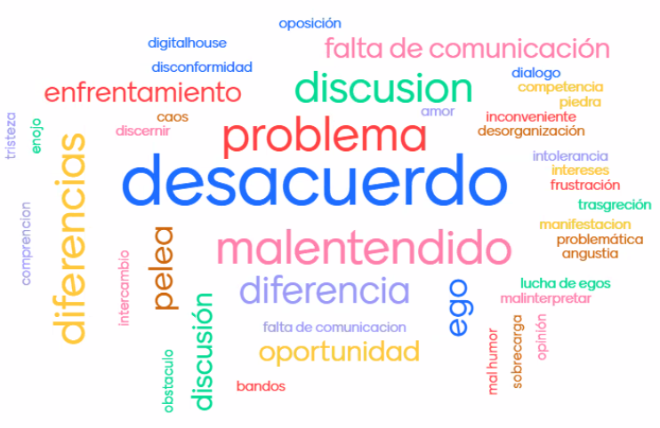
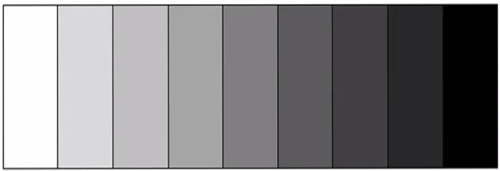
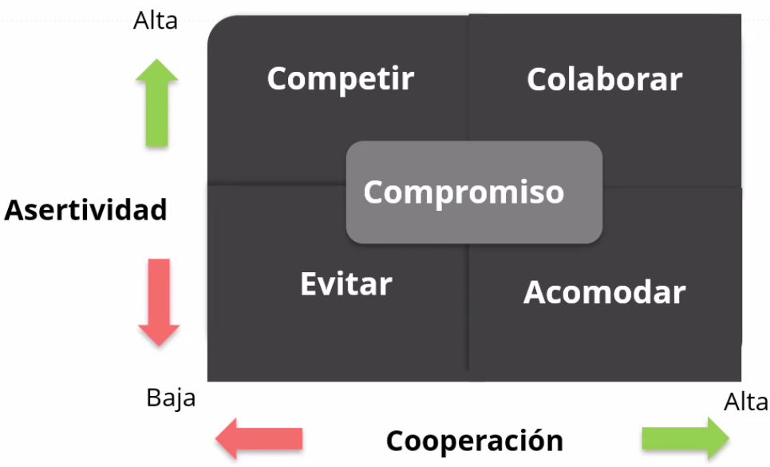
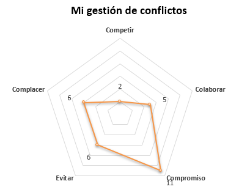

---

<t>TEAM WORK</t>

---

## Índice

1. Emociones
    - [ ¿Qué son las emociones](#1)
    - [ Tips para manejar emociones](#1a)
    - [ Impacto en nuestra vida diaria](#1b)
    - [ Inteligencia Emocional](#1c)
    - [ Modelo RENER](#1d)
    - [ Agilidad emocional](#1e)

2. Equipo de trabajo
    - [ ¿Qué es un equipo?](#2)
    - [ Factores fundamentales para la eficacia de los equipos](#2a)
    - [ Estructuras](#2)

3. El conflicto y las emociones
    - [ ¿Qué asociamos con conflicto?](#3)
    - [ ¿Qué vemos?](#3a)
    - [ Conflictos afectivos](#3b)
    - [ Conflictos cognitivos](#3c)
    - [ Percepción de los conflictos](#3d)
    - [ Tipos de conflictos](#3e)
        - [ Funcionales - Constructivos ](#3f)
        - [ Disfuncionales - Destructivos ](#3g)
    - [ Enfoque y gestión](#3i)
    - [ Fórmula SCI ](#3j)
    - [ Estrategia y diagnóstico](#3k)
    - [ Estilos de gestión](#3l)
    - [ Mi gestión](#3m)
    - [ Cómo orquestar el conflicto ](#3n)

<!--  -->
<!--   -->

-------------------------------------------------------

# 1

## Emociones 

Son respuestas fisiológicas a los estímulos del entorno. La etimología viene del Latín *emotio*, que deriva del verbo *emovere* (movimiento, motor). Es un impulso que induce a la acción, puede anticipar una acción determinada.

**La emoción siempre es reactiva.** Químicamente la reacción dura 90segs, pero la conversación interna es lo que la perpetúa.

Tips para manejar emociones: 

- Concentrarse en algo que te haga bien
- Hablar, no aguantarse las cosas
- No hacer de un pelo una peluca, analizar y saber separar las cosas
- Saber hacerse un espacio para uno
- Tomar distancia
- No tener expectativas tan altas
- Entender que el cambio viene de adentro

## Impacto en nuestra vida diaria 

> "No hay acción humana sin una emoción que la funde como tal y la haga posible como acto" - H. Maturana
> 

> "Creemos que las emociones y la mente son antagónicas cuando en realidad el único problema entre ellas se produce cuando se desconectan de su condición de socias y combaten entre sí" - N. Levy
> 

La cualidad emocional en la que nos encontremos:

- Nos predisponen a la acción
- Impacta en nuestro desempeño
- Ayuda a definir lo que es posible y lo que no
- Constitutiva del comportamiento humano
- Se contagia
- Se transforma
- Afecta y es afectada por las conversaciones

## Inteligencia Emocional 

> "La inteligencia emocional se refiere a la capacidad de reconocer nuestros propios sentimientos y los ajenos, de motivarnos y de manejar bien las emociones, en nosotros mismos y en nuestras relaciones" - D. Goleman
> 

Para poder conectar con la ventana del otro, tengo que ver primero mi ventana.

Las cinco claves para desarrollar la inteligencia emocional son:

1. Autoconciencia → ser consientes de lo que sentimos y como nos afecta
2. Autorregulación → capacidad de manejar las emociones propias
3. Automotivación → a través de la localización en nuestras metas y no en las dificultades
4. Empatía → saber ponernos en el lugar de las otras personas
5. Habilidad social

## Modelo RENER 

- Reconocer → la emoción en la que nos instalamos
- Entender → la emoción, saber cuál es el origen y cuáles son sus consecuencias
- Nombrar → darle un nombre a la emoción
- Expresar → encontrar un canal para verbalizar y compartir esa emoción
- Regular → hacer algo con eso

## Agilidad emocional 

> "La agilidad emocional tiene que ver con relajarse, calmarse y vivir con mayor intención. Se trata de elegir cómo responder al sistema de alerta emocional" - S. David
> 

Todas las emociones son como luces en un tablero de control que nos van diciendo cosas.

La agilidad emocional abre este espacio que hay entre cómo nos sentimos y lo que hacemos en relación a esos sentimientos:

- Aceptar sin juicio todas las emociones
- Estar receptivos a lo que nos están mostrando o avisando
- Ampliar la capacidad creativa y generativa
- Alejarse del mandato emocional e integrar todo el abanico

# 2

## ¿Qué es un equipo? 

> "Un pequeño número de personas con habilidades complementarias comprometidas con un propósito común, un conjunto de metas de desempeño y un enfoque por el que se sienten solidariamente responsables" - Jon Katzenbach
> 

## Factores fundamentales para la eficacia de los equipos 

- Normas del equipo → que haya un orden, qué se puede, qué no
- Liderazgo del equipo → es quien vela por el bienestar del grupo y de cada integrante, anima al equipo a cumplir con los objetivos
- Composición del equipo
- Estructura del equipo
- Cohesión e interdependencia del equipo
- Apoyo organizacional

## Estructuras

[Jerarquia vs Redarquía](./img/1.jpg)

# 3

## Objetivos

1. Reconocer el estilo propio para la resolución y gestión de conflictos
2. Detectar las oportunidades de intervención a través del diagnóstico, la estrategia y aplicación
3. Valorar la palabra y el carácter generativo de las conversaciones
4. Identificar los beneficios de los espacios conversacionales para la prevención y gestión de conflictos

## El conflicto y las emociones

### Qué asociamos con conflicto 

Todas estas palabras podríamos categorizarlas en base a su carga: positiva o negativa, y basándonos en eso podemos decir que la mayoría en este caso son negativas. Sin embargo hay teorías que logran inclinar la balanza hacia el otro lado al gestionar los conflictos.

¿Qué vemos en la imagen? 

Si vamos a lo concreto vemos a Hulk cociendo un pantalón, pero si lo analizamos un poco, podemos pensar que está solucionando un problema luego de no gestionar sus emociones correctamente. 

En general los conflictos siempre se disparan a raíz de algo emocional, y para resolverlo vamos a necesitar racionalizar la situación o las emociones.

## Conflictos afectivos 

- Las emociones toman el mando
- Para gestionarlas hace falta desarrollar ciertas habilidades (autoconocimiento, autocontrol)

## Conflictos cognitivos 

- Generan debates abiertos sobre los supuestos, la forma de trabajar, de pensar y de analizar
- De estos conflictos suelen surgir grandes ideas
- Son motores para la creatividad y la innovación

## Percepción de los conflictos 

En nuetro cerebro cuando vemos las cosas desde lo emocional son blancas o negras, mientras que desde el lado racional podemos ver los matices y toda la escala de grises. 

## Tipos de conflictos 

### Funcionales - Constructivos 

- Apoyan los objetivos
- Mejoran el rendmiento y la calidad de las decisiones
- Estimulan la creatividad y la innovación
- Medio para resolver problemas

### Disfuncionales - Destructivos 

- Generan caos, descontento, improductividad
- Alientan la violencia (verbal y/o física)
- Reducen el compromiso, la confianza y la cohesión
- Resienten las relaciones

## Enfoque y gestión 

El conflicto va a ser positivo o negativo dependiendo de nuestro enfoque. Si lo enfocamos desde lo colaborativo y lo gestionamos correctamente va a resultar un conflicto positivo. Cuando seamos incapaces de manejarlos van a surgir los aspectos negativos.

## Fórmula SCI  

La fórmula **SCI** = **S**ituación, **C**omportamiento e **I**mpacto nos sirve para determinar 3 variables y poder observar y analizar el conflicto. Con eso determinado podemos analizar el conflicto y eventualmente diseñar una estrategia para solucionarlo.

- Capturar la **situación** específica (hechos, lugar, personas)
- Describir el **comportamiento** propio y ajeno (qué hice/hizo, qué dejé/dejó de hacer, actitudes, gestos, dichos, etc.)
- Transmitir el **impacto**

## Estrategia y diagnóstico 

## Estilos de gestión 

### Mi gestión 

## Cómo orquestar el conflicto 

