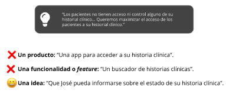

---

<t>UX/UI</t>

---
## Índice

1. Módulo 1 - Bienvenida e Introducción
    - [C1 - Bienvenida](#c1)
    - [C1A - UX vs UI](#c1a)
    - [C2A - Brief](#c2a)
2. Módulo 2 - Diseño de interacción
    - [C3 - Interfaces digitales](#c3)
    - [C3 - Content prototype](#c3a)
    - [C3 - User Flow](#c3a-1)
    - [C3 - Patrones de diseño](#c3a-2)
    - [C3 - Prototipado](#c3a-3)
    - [C3 - Usabilidad](#c3a-4)

# C1 - Bienvenida 

Diseño UX es una metodología de trabajo que reúne las mejores prácticas de distintas disciplinas proyectuales para crear experiencias realmente significativas a través de la creación de interfaces intuitivas. En conjunto con Design Thinking se convierte en un campo clave para aprender a desarrollar en un ámbito interdisciplinario y colaborativo.

Los objetivos del taller son:

- Aprender los pilares básicos del diseño centrado en las personas.
- Conocer la diferencia entre diseño UX, UI y cómo aplicarlos en el desarrollo de
productos.
- Utilizar los conocimientos adquiridos en Design Thinking para crear interfaces con foco
en los usuarios.
- Conocer las bases del diseño visual y de interacción.

[Dónde estamos](./img/c1.jpg)

# ¿Diseño UX, UI? 
La mayoría de las veces, se equipara Diseño UX a Diseño UI. Pero no es lo mismo

[El iceberg del UX/UI](./img/c1-1.jpg)

El Diseño UI o diseño de interfaz (user interface) es la combinación de alguno de los conceptos y herramientas que vas a aprender en este taller:

- Arquitectura de información.
- Patrones de diseño.
- Elementos o componentes visuales.
- Hace foco en lo que el usuario ve en la pantalla a la hora de utilizar nuestro producto digital.

[Sobre el taller](./img/c1-3.png)

Ahora bien, diseño de interfaces no es lo mismo que diseño gráfico. El diseño de la interfaz puede incluir o no diseño gráfico. Por ejemplo, cuando hacemos un wireframe (¡spoiler alert!) estamos diseñando una interfaz pero no aplicamos diseño gráfico, y cuando utilizamos reglas de estilo en una interfaz aplicamos diseño gráfico pero no diseñamos una interfaz.

# Definición de UI
Si el Diseño UX es el panorama completo de todo lo que implica la experiencia de usar un producto o servicio (digital o analógico), y el Diseño UI es la proyección de la capa visual de las interfaces, entonces el Diseño de Interacción es la disciplina que define la estructura y el comportamiento de los sistemas interactivos.

Como parte de un proceso integral, el diseñador de interacción crea la relación entre las personas y lo que deben hacer en el producto digital para que su camino sea el más feliz posible.

> Ver video: Diseño UX 

<!-- incio resumen video -->

El diseño UX (User Experience) lo podemos definir como un proceso de trabajo enfocado en proyectar soluciones para resolver problemas puntuales de las personas.

La experiencia es el conjunto de soluciones que suceden antes, durante y después que una persona toma contacto con un producto a través de una interfaz.

Los diseñadores UX diseñan productos e interfaces tomando en cuenta a las personas

## Caso de estudio: resonadores
[https://padlet.com/PedagogiaDH/9d1soneh4m50kbce](https://padlet.com/PedagogiaDH/3sv4e94n263mnmeo)

## MDT 1

## Brief 

> *"Un problema bien planteado constituye la mitad de la solución"* - Russel Ackoff
> 

El primer paso para resolver un problema es definirlo con claridad. Sin un problema bien definido, vas a poner un montón de esfuerzo en ideas y descripciones irrelevantes. Tu equipo va a perder energía, tiempo y recursos valiosos. Ni pensemos si tenés un deadline ajustado o inversores.

### Qué es un brief

El brief es la condensación de toda la investigación. Este documento corto (brief en inglés significa **breve** ) debería ser tan sintético como una hoja de papel que se le da a alguien que no estuvo en la etapa de research y que con eso pueda hacerse una idea de todo el panorama. Desde ya, sin detalles, para eso está la documentación de la investigación anterior.

En una estructura mediana o grande, el brief tiene que pasar del equipo de research al de ideación para ofrecerle un panorama claro y concreto para poder orientar sus esfuerzos: esa es la finalidad de este documento.

**¿Qué debería ofrecer ese documento?** Definiciones claras sobre:

- ¿Qué le está sucediendo a las personas?
- ¿Dónde están los conflictos y puntos de dolor a resolver?
- ¿Qué queremos lograr? ¿Dónde podemos mejorar?
- ¿Qué factores de contexto nos rodean? ¿Qué límites podemos y no podemos transgredir?

### Brief de 4 columnas

### Brief light (2 columnas)

https://youtu.be/Qyclqo_AV2M(./img/c2-doscol.png)

## Convergencia y divergencia: herramienta para idear

La ideación es un momento para exploración, inclusión y resultados cuyo objetivo es observar soluciones para un problema definido. No nos interesa cuál es la idea más loca, techie o creativa sino cuál es **la más relevante para un escenario particular**. 

Errores comunes en sesiones de ideación:

- Juzgamos ideas basados en la opinión de otres
- Dependemos de cuán creativos son algunos miembros de las sesiones (sin elles no hay buenas ideas)
- Fallamos en evaluar de qué modo nuestras ideas impactarán a nuestros clientes y usuarios
- Abordamos la sesión sin el contexto (briefing) adecuado

Idear es un **proceso individual**, que alcanza su máximo esplendor cuando se realiza en **forma colectiva**. Por eso, es importante que todo el equipo esté de acuerdo en cuál es el marco en el que se va a trabajar. Nosotros te proponemos el método de pensamiento **divergente y convergente**.

### Ejemplo: The Beatles
La dupla Lennon - McCartney creó una de las canciones más emblemáticas de la banda, y el modo de composición fue bastante particular. Por un lado McCartney tenía un gran estribillo, pero no se le ocurrían buenas estrofas. Lennon por su parte tenía una excelente estrofa pero ningún estribillo. Cuando se juntaron y combinaron ambas cosas crearon una canción que casi parece una conversación.

### Ideación colectiva

A veces la ideación colectiva puede convertirse en una lucha de egos. Por eso, es sumamente importante respetar los espacios de ideación individual antes de sentarnos a pensar en equipo.

- La **divergencia** nos ayuda a promover el pensamiento horizontal, individual y enfocado en los modelos mentales de cada uno.
- La **convergencia** nos ayuda a socializar la experiencia, empatizar con los demás y fusionar pensamientos simples para convertirlos en ideas complejas.

### Qué es una idea

Si googleás UX Design posiblemente te encuentres con un montón de fotos de personas felices “jugando” con post-its. Digamos que, al margen de esa imagen idílica, en una sesión de ideación cada participante anota sus ideas en distintos papelitos de colores de manera individual y luego deberá exponerle al equipo cada una de ellas para lograr así la convergencia de ideas. Las ideas que se parecen o se complementan convergen en una nueva y las que no son pertinentes porque, por ejemplo, cayeron fuera del brief se separan (nunca se tiran).

<aside>
💡 En una sesión de ideación es fundamental generar volumen, es decir, gran cantidad de ideas. Al momento de pensarlas de manera individual no hay que contenerse: dejar de lado el prejuicio y producir sin pensar si lo que acabás de escribir está correcto o incorrecto.
</aside>

Es importante aclarar que no todo lo que surge del proceso de ideación se puede considerar como una idea, o mejor dicho, una idea pertinente. Para abrir la puerta a la innovación, las ideas deben tener un “toque” de abstracción.

Es importante definir cuándo estamos ante una idea y cuando ante una funcionalidad o un producto porque necesitamos idas abiertas, desafiantes y que no nos cierren caminos dentro del marco que definimos con nuestro brief.

- Funcionalidad → es una cristalización de la idea, cuando surge una no puede ser otra cosa. Por ejemplo: alerta push
- Producto → es una idea que se complejiza con muchas otras decisiones. Por ejemplo: un ecommerce

## El doble diamante

La metodología de **divergencia y convergencia** está presente a lo largo de todo el proceso de diseño: hay momentos de mayor dispersión y momentos en donde esa apertura debe cerrarse para converger en un punto y tomar decisiones concretas.

La etapa de empatizar, el research abre el juego para entender a las personas y descubrir insights valiosos; luego, en la etapa de definir se converge en el **brief** para lograr consenso dentro del equipo y orientar el trabajo conjunto. ¿Te diste cuenta como sigue? Claro, nuevamente divergencia para generar ideas y convergencia para evaluar cuál o cuáles van a ser prototipadas.

<!-------------------------------  Módulo 2  --------------------------------------->
# Interfaces digitales 

<!---->

Una de las principales preocupaciones del diseño UX es determinar cómo se establece la relación humano-máquina para ofrecer una buena experiencia de uso.

> *"La interfaz es el espacio donde se articula la interacción entre el cuerpo humano, la herramienta o artefacto y el objeto de la acción"* - Gui Bonsiepe, Del objeto a la interfaz
> 

<aside>
💡 El objetivo del diseño de interacción es olvidarnos que estamos usando una interfaz. Si se ponen en juego la mayor cantidad de sentidos posibles y la experiencia se vuelve inmersi- va, lo estaremos haciendo bien.

</aside>

# Arquitectura de información

Este concepto se refiere a la manera en que se organizan las partes de un todo para hacerlo comprensible. Si tenemos una buena AI vamos a poder garantizar que nuestro sistema sea seguro, funcional y perdurable.

<!---->

## Modelos mentales

**Diseñar con las personas en el centro** requiere conocer qué quieren esas personas. Las mentes de las personas usuarias (y las nuestras también, desde ya) están constantemente buscando patrones que les permitan procesar grandes cantidades de información. 

En diseño UX buscamos crear buenas estructuras de organización adaptadas a los modelos mentales de las personas con el propósito de **reducir la carga cognitiva**.

Los modelos mentales son representaciones internas de una realidad externa. Son concepciones generales que dirigen nuestros actos y que somos capaces de construir a partir de la experiencia.

- Pueden variar mucho entre una persona y otra.
- No son precisos, son basados en lo que la persona piensa que es real.
- Son creados a base de experiencias previas.
- Están en constante evolución

### Ejemplo: empanadas

<!---->

# Content prototype 

**Content prototype** es una metodología que nos permitirá mapear el contenido de “la historia” de nuestro producto. Partiendo de la premisa de content first —en castellano “el contenido se hace primero”—, vamos a empezar **escribiendo una conversación entre nuestro servicio y nuestros usuarios** para entender cómo es la interacción entre ambos.

Si queremos lograr una buena interacción humano-máquina, primero tenemos que entender como es el vínculo humano-humano.

El objetivo es anticiparnos a los momentos clave que va a atravesar la persona para marcar:

- Tipo de interacciones
- Puntos de dolor
- Oportunidades de deleitar

Para esto, es fundamental haber entendido quiénes son los usuarios, cuál es su contexto, qué es lo que necesitan, cuándo usan nuestro servicio y quiénes somos nosotros para ellos.

También es importante aclarar que la historia que escribimos siempre tiene dos caras:

- Las necesidades de los usuarios
- Los objetivos del negocio

En el punto justo donde estos dos ejes se encuentran, está la posibilidad de diseñar una experiencia funcional, motivante e inspiradora. No es necesario pensar en cambios gigantes o proyectos pretenciosos para mejorar una experiencia. A veces, entender esto es la llave para mejorar un producto día a día.

## Ejemplo: MELI

- Proyecto: facilitar el alta de direcciones
- Objetivo del usuario: actualizar la dirección de envío
- Objetivo del negocio: conseguir el CP del usuario
- Plus: al completar primero el CP, el usuario se ahorra la carga de otros datos

<!---->

### Conversación original

-Quiero actualizar mi dirección

*-Ok, decime tu CP*

-Uh, no conozco mi CP, quiero poner la dirección

*-Buscá tu CP completando provincia y ciudad*

1er painpoint: desinterés 😔

-¡No entiendo por qué querés que busque mi CP! ¿No te puedo dar mi dirección directamente? Uf... Córdoba, ciudad de Laboulaye

*-6120 es el CP de Laboulaye, Córdoba ¿lo confirmás?*

2do painpoint: frustración 😤

-No sé... Supongo... Ya te dije que no sé mi CP, la ciudad y provincia están bien

*-¿Calle y altura?*

-Mitre 2134

*-¡Listo! Ya actualicé tu dirección. Quedó: Mitre 2134, CP 6120, Laboulaye, Córdoba.*

-Ok... Gracias (con sarcasmo y desinterés)

### Conversación nueva

-Quiero actualizar mi dirección

*-Bien, para hacer más rápido decime tu CP*

-Uh, no conozco mi CP, quiero poner la dirección

*-Ok, no te preocupes, decime tu provincia y ciudad directamente*

Alerta + comprensión 😄

-Dale, vivo en Córdoba, ciudad de Laboulaye

Cooperación 🤝

*-Perfecto. Solo para confirmar: Laboulaye y Córdoba ¿los escribí bien? Si es así, el CP de Laboulaye, Córdoba es 6120*

-Si, si, perfecto

Confianza 😎

-Buenísimo, ¿en qué calle y altura?

-Mitre 2134

-¡Listo! Ya actualicé tu dirección. Quedó: Mitre 2134, CP 6120, Laboulaye, Córdoba.

-¡Gracias!

<!---->

# User Flow 

El user flow o flujo de usuario es la representación gráfica del **diálogo entre la persona y el sistema**. Normalmente se utiliza en los primeros momentos de la etapa de prototipado, para definir el recorrido, el camino que debe hacer nuestro usuario en su interacción con el producto.

Los user flows se basan en entender los objetivos que generan una experiencia de uso positiva, para obtener un mejor resultado tanto para los usuarios como para el negocio.

<aside>
📌 Como hay muchos tipos de usuarios (Personas), con distintos conocimientos sobre el producto y diferentes objetivos, se deben enfocar los flujos para que impacten a la ma- yor cantidad de usuarios posibles.

</aside>

## Ejemplo: cómo compramos ropa

<!---->

## Construyendo un flow

Si la interfaz es el espacio donde el usuario interactúa con un sistema, el flow es el esquema que intenta bajar a tierra este espacio. Volviendo a la idea de diálogo humano-máquina, el flow no representa solo lo que dice el humano o solo lo que le responde el sistema, sino el diálogo completo, incluidas aquellas acciones que no son palabras.

El user flow se dibuja utilizando tres tipos de componentes:

- **Proceso** representa una acción que permite al usuario avanzar en el cumplimiento de su tarea. Puede ser un paso que realiza el usuario o un proceso que dispara el sistema. Por ejemplo: una búsqueda, elegir una opción, mostrar un resultado o editar.
- **Input** es un momento del diálogo en el que el usuario debe ingresar datos o información específica, y que es necesaria para que pueda cumplir con su objetivo. Por ejemplo: ingresar un número de tarjeta de crédito, completar un formulario, indicar un nombre o una palabra clave.
- **Decisión** representa una pregunta cuya respuesta siempre es binaria (sí/no). La respuesta a esta pregunta determina un cambio en el camino del diálogo. Por ejemplo: ¿Es la primera vez que ingresa? ¿Tiene tarjeta de crédito? ¿Existen resultados de búsqueda?

<!---->

# Patrones de diseño 

Los patrones de diseño son soluciones probadas a problemas comunes. Tienen como objetivo:

- Evitar la búsqueda de soluciones a problemas que ya se resolvieron.
- Brindar un catálogo de elementos reutilizables.
- Estandarizar el modo en que se diseña una interfaz.
- Facilitar el aprendizaje a las nuevas generaciones de diseñadores.
- Estipular un vocabulario común entre diseñadores.

Sabiendo qué es un patrón de diseño y cuáles son sus objetivos, podemos empezar a entender qué es la navegación y cómo funciona. En esta instancia también hay **patrones de navegación** que se pueden dividir en dos tipos:

- Vertical (jerárquica) → está formada por niveles consecutivos del contenido con diferente profundidad
    
    <!---->

- Horizontal (plana) → a diferencia de la vertical, siempre vamos a tener opciones visibles para meternos en cualquier categoría
    
   <!---->

# Prototipado 

Nos permiten explorar, comunicar y validar ideas. Hay tres ítems importantes que tenemos que definir antes de empezar un prototipo:

- Materialidad → los materiales a usar dependen del tiempo disponible y la complejidad de actualizar el prototipo
- Alcance → depende de la cantidad de pantallas que debamos prototipar
- Fidelidad → se dividen en 3 grandes grupos
    
   <!---->

    - Baja → en papel, tiene que ser rápido y nos permite ver la estructura y ubicación de los componentes. No tiene que tener detalles
    - Media → también se conocen como wireframes y se hacen con herramientas digitales
    - Alta → se define la paleta de colores, tipografía y animaciones

<!---->

## Ejemplo Palm Pilot

<!---->

## Wireframes

El prototipo de media fidelidad contiene muchos más detalles que prototipo en baja. La mayoría del contenido real, o cercano al contenido real, se coloca en las pantallas digitalizadas. Este proto incluye todos o la mayoría de los estados de la experiencia, como antes de que el usuario haga clic y después del clic, o todas las pantallas en un proceso de varios pasos (por ejemplo, un proceso de pago).

<!---->

Los wireframes son una versión digitalmente estructurada de los prototipos en baja. Deben ser semifuncionales, pero no deben incluir ninguna decisión estética: nada de imágenes o colores. Todo eso puede sacar de foco lo que realmente queremos probar.

No se definen tipografías, márgenes ni estilos al 100 %. Hay que comenzar por la navegación y demás elementos estructurales. 

En este punto ya validaste los flows más importantes de tu solución y hay que replicarlos. También tenés el feedback de los tests que han hecho de los prototipos en baja y es hora de iterar en base a ellos.

### Tips

● Tener en cuenta el flow.
● Hacerlo en blanco y negro (escala de grises).
● Evitar uso de imágenes.
● Usar una tipografía “básica” (Arial, Helvetica).
● Medidas aproximadas/estandarizadas por cada componente.
● Empezar por elementos estructurales.
● Luego, seguir por el contenido (cards, listas, textos).
● No olvidar las interacciones (dropdowns, desplegables, hover states importantes).

## Moodboard

La transición de un prototipo en baja a media fidelidad no parece involucrar demasiadas complejidades: nos centramos es las interacciones, todo blanco, negro y gris ¿no? Pero ¿qué pasa cuando hay que sumar el componente estético? ¿Cómo empezar?

Sabemos que al momento de plantear la estética de un producto de diseño suele aparecer un gran obstáculo: la subjetividad. Esto trae aparejado dos problemas:

1. Poner en primer plano **el gusto personal** olvidando que el producto no es para vos — ¿te acordás?)—, sino para las personas usuarias.
    
    vos no sos todos los demás
    
2. Imposibilidad de **lograr consenso** dentro del equipo de trabajo sobre la identidad visual del producto o servicio.

El primer punto se resuelve a través de research: deberás poner en valor a tu user persona y traerla al centro de la escena al momento de tomar decisiones. Para afrontar el segundo punto te ofrecemos una nueva herramienta: el moodboard.

Un moodboard es una colección de elementos y materiales con la intención de comunicar el estilo, tono, carácter y dirección visual de un proyecto particular. Vamos a poner paletas de color, tipografías y texturas entre otros.

 
<!---->

## Handoff

Hagamos un salto en el tiempo: tu prototipo nació en papel (baja fidelidad), se convirtió en wireframes (media fidelidad) y finalmente, luego de definir cuestiones estéticas y funcionales, se convirtió en la versión más cercana al producto final (alta fidelidad).

El paso siguiente es el handoff, es decir, entregar el prototipo en alta ya testeado al equipo de desarrollo para que empiece la programación. Si bien lo ideal es trabajar codo a codo con el equipo de desarrollo durante el proceso de diseño, en equipos de UX/UI podemos tener en cuenta muchas cuestiones clave para que el traspaso sea lo más fluido posible en caso de que no haya existido contacto entre las áreas.

<!---->

# Usabilidad 

> "*La usabilidad es un atributo de calidad que evalúa la facilidad de uso de las interfaces de usuario. La palabra “usabilidad” también se refiere a métodos para mejorar la facilidad de uso durante el proceso de diseño" NN Group - 2012*
> 

¿Qué le pedimos al usuario cuando navega una interfaz visual? Le solicitamos que procese una determinada cantidad de información de la interfaz. El usuario:

1. Interpreta palabras = **Usabilidad verbal**
2. Comprende componentes de interacción = **Affordances**
3. Interpreta imágenes = **Comunicación visual**

## Forma vs Función
<!---->

## Usabilidad verbal

Es la propiedad del lenguaje verbal de evidenciar la compresión del uso del componente.

<!---->
## Affordances

Es la propiedad de un elemento de evidenciar visualmente la comprensión de su uso.
<!---->

### Ley de Fitts

1. La relación entre el tamaño que tiene un elemento y el tiempo que demanda la acción
    <!---->
    
2. El concepto de ancho es relativo
    
<!---->
    
3. Atención al desplazamiento natural
    
<!---->

### Comunicación visual: Branding vs Usabilidad

La aplicación de atributos de imagen son imprescindibles para transmitir los valores de la marca o producto. Pero un abuso de imagen y contenido no funcional puede perjudicar la usabilidad e la interfaz.

<!---->

## Pruebas de usabilidad
<!---->