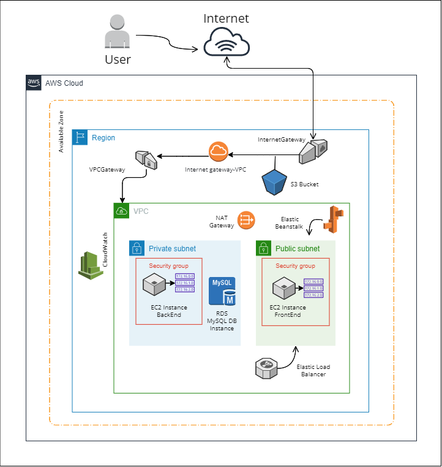

# Infraestructura - Proyecto Integrador

## SPRINT 1
**Issue # 14: Diseño de la red**
> Presentar un diseño de la infraestructura necesaria para hacer funcionar el proyecto en AWS.

> Mostrar un boceto de la red y sus componentes. Ej: Servidores, almacenamiento, red interna y base de datos.

---

- Gráfico
- Diseño de la red
- Documentación
- Equipo

## Gráfico

## Diseño de la red
Se establece como entorno de trabajo el servicio AWS. Así mismo, se encapsulan todos los recursos dentro de una **zona de diponibilidad**; y a su vez, de una **región** donde serán instalados.
Teniendo en cuenta el objetivo de la aplicación, se agregan los siguientes recursos:
Una **VPC** que va a contener dos subnets, una pública y una privada. Las subnet serán las encargadas de asignar las direcciones IP en la VPC que se va a asociar con los demás recursos. La conexión a la VPC será a través de un **Internet Gateway**, que es el que va a permitir a los usuarios a través de Internet conectarse a nuestra aplicación.
La **subnet privada** contara con su respectivo **grupo de seguridad** y contendrá los recursos relacionados al Back End y Base de Datos, en este caso, una **instancia EC2**, con su respectivo par de llaves, así como también una **instancia RDS** que se encargará de manejar la base de datos, la cual será en MySQL. Además, se usa un **NAT Gateway**, en caso que se requiera conectar con servicios fuera de nuestra VPC (servicios externos que no pueden tener conexión con las instancias privadas).
La **subnet pública** también tendrá su propio **grupo de seguridad** y contendrá los recursos relacionados al Front End, es decir, una **instancia EC2**.
Ambos grupos de seguridad (privado y público) actuán como firewall virtual y controlan el tráfico entrante y saliente de las instancias.
Así mismo, ambas subnet contienen **tablas de enrutamiento**, ya que son estás las que especifican cómo dirigir el tráfico de red desde dentro de la subnet.

Por otra parte, en lo que concierne al Front End, se asocia el PaaS **Elastic Beanstalk**, ya que le daría soporte a nuestra aplicación. Es decir, manejaría los detalles de aprivisionamiento de capacidad, escalamiento, supervisión del estado de la aplicación y _load balancing_.

Referente al Monitoreo, se implementaría **CloudWatch**, el cual arrojará alarmas de acuerdo a las métricas que deseemos analizar.
Finalmente, se agrega un **S3 Bucket**, el cual almacenaría el código fuente, logs entre otros artefactos. 

## Documentación
- [Regiones y Availability zones](https://docs.aws.amazon.com/AWSEC2/latest/UserGuide/using-regions-availability-zones.html)
- [VPC](https://aws.amazon.com/es/vpc/faqs/)
- [Internet gateway](https://docs.aws.amazon.com/vpc/latest/userguide/VPC_Internet_Gateway.html)
- [Security groups en AWS](https://docs.aws.amazon.com/vpc/latest/userguide/VPC_SecurityGroups.html)
- [NAT](https://docs.aws.amazon.com/es_es/vpc/latest/userguide/vpc-nat-gateway.html)
- [S3](https://aws.amazon.com/es/s3/?nc1=h_ls)
- [CloudWatch](https://aws.amazon.com/es/cloudwatch/)

### Equipo
- Alejandra Marín
- Indira Valentina Réquiz

---

## SPRINT 2

#### Región AWS: ***us-east-2***

### **Issue #40: Crear infraestructura en AWS**

> Crear EC2 en AWS para el servicio web Back End

Se creó la instancia EC2 llamada ***Wesped-BackEnd*** con su respectiva llave para poder realizar la conexión SSH a través del puerto 22, así mismo se creó un grupo de seguridad, donde se editaron la reglas de entrada y salida para configurar los puertos necesarios, por ahora son el 22, 80, 8080 y 3306.
Dicha instancia se creó en la VPC predeterminada de la región, y la subnet fue sin preferencia.
Ya conectada a la instancia se instaló el servicio web *Apache*, además de otros paquetes, tales como:
*mariadb (mysql)* y *java*.

> Crear S3 Bucket para almacenar el Front End (contenido estático)

El bucket creado tiene como nombre ***wesped-frontend***, en dicho bucket se configuraron sus propiedades y permisos (política), con el fin de que sea público y aloje sitios web estáticos. Puntualmente, aquí estarían los recursos correspondientes al build de Front.

> Conectar mediante string de conexión a una base de datos MySQL existente

A través de MySQL Workbench se crea conexión con la base de datos RDS, y a través del script .sql de Base de Datos, se crean las tablas y relaciones en la base de datos existente.
Finalmente, desde la instancia EC2 previamente creada, realizamos conexión con la RDS a través del comando:  `mysql -h db.ctd.academy -u PI_GRUPO9 -p -D PI_GRUPO9`, donde efectivamente verificamos que la base de datos cuenta con las tablas correspondientes a nuestro proyecto.

> Crear S3 Bucket para almacenar las imágenes de los productos

Para almacenar las imágenes, se creó el bucket cuyo nombre es ***wesped-images***, y así mismo se configuró para que fuera un recurso público.
Se subieron las imágenes correspondientes, y finalmente se añadieron las URL de cada imagen a nuestra base de datos.

---

### **Issue #45: Crear Pipeline para CI CD**

> Crear pipeline del proyecto donde se ejecute la integración continúa (CI) del código de frontend y de backend.

Se crea archivo `.gitlab-ci.yml` donde se establece la configuración (imagenes e instalaciones de paquetes necesarios) para la integración continua de nuestra aplicación.
En este caso, se establecieron dos stages (**build y deploy**), cada stage a su vez cuenta con **dos jobs**: uno para Front y otro para Back. Y en cuanto al deploy, se indica que Front lo debe hacer en el Bucket previamente creado; y Back a través de la instancia EC2 también previamente creada.
Por otra parte, se definieron **variables** en la configuración CI/CD de nuestro repositorio, para que la pipeline se pueda ejecutar correctamente.

> - Issues realizadas por Alejandra Marin.

---