<t>Gestión de Productos Digitales I <t>

----------------------

## Índice

1. Módulo 1 - 

- [Introducción a la gestión de productos](#m1)
- [La start-up](#c1) 
- [Scrum](#c1a) 
- [Proyecto a desarrollar](#mdt1) 
- [El producto digital hoy](#c2) 
- [El ciclo de vida de un producto digital ](#c2a) 
- [ Las mejores prácticas para el desarrollo de productos digitales  ](#c2a)
- [Fases de un producto digital](#c2b) 


2. Módulo 2 -
- [Product discovery](#m2) 
 - [Agile inception](m2-1) 
    - [Técnicas](#m2-2)
     - T. Enfocadas en el PORQUÉ
     - T. Enfocadas en el CÓMO
 - [Impact mapping](m2-3) 
 - [Lean startup](m2-4) 
    - [Origen](#m2-4-1)
 - [MVP](#m2-5)
 - [El Lean model canvas](#m2-5)


3. Módulo 3 -  
- [Product delivery](#m3)  
- [Roadmap](#m3-1)
- [Release](#m3-2)
- [Burndown chart](#m3-3)

4. Módulo 4 -  
- [Aprendizajes](#m4) 

------------------

# Mapa de la materia 

En este taller continuarás una experiencia inmersiva en el marco de trabajo Scrum, desarrollaremos habilidades blandas para la definición de productos digitales. ¿Qué vamos a ver? Desde el reconocimiento de un problema u oportunidad hasta lo necesario para iniciar el desarrollo de un producto que responda a esa necesidad. Todo aplicándolo a casos prácticos grupales.

### ¿Cuáles son los objetivos del taller? 

- Conocer de qué manera se crea, produce y gestiona un producto digital con una perspectiva del desarrollo de software.
- Utilizar los conocimientos adquiridos en los talleres de Metodologías del Trabajo, 
Design Thinking y UX/UI para concebir un producto digital desde la ideación hasta su lanzamiento.
- Tener contacto con storytellings que remitan a casos reales para aplicarlos en situaciones de trabajo del campo profesional.


<!--###############################################--  MÓDULO 1--#####################################################################-->
##  Introducción a la gestión de productos <a id='m1'></a>

El objetivo de este primer módulo es recordar lo visto en los talleres anteriores e introducir el de Gestión de Productos Digitales, marcando la importancia de la correcta definición de una visión de producto, las responsabilidades del product owner (PO) y el papel del equipo de desarrollo en estas etapas iniciales.

### La startup <a id='c1'></a>


Click up es una startup que surgió a finales del 2020 para brindar soluciones IT a pequeñas y medianas empresas en Latinoamérica, sus integrantes son profesionales de diferentes países (Argentina, Brasil y Colombia). El CEO de la empresa es Nicolás Arroyo, un programador que dejó su empleo para crear un emprendimiento. Paula Sosa es la Agile Coach y socia de la empresa. Cuando se publicó en Forbes sobre este negocio y su metodología de trabajo, la empresa ha recibido muchas solicitudes de nuevos clientes.

#### Bienvenido al equipo!


### Scrum   <a id='c1a'></a>

La metodología de trabajo a implementar


[Link a presentación en genia.ly ](https://view.genial.ly/62014e4b549f780012248f96)


## Proyecto a desarrollar  <a id='mdt1'></a>

El trabajo práctico integrador es un proyecto que se realiza de manera grupal y es uno de los requisitos para la aprobación del taller Gestión de Producto Digitales I.  

Con esta instancia buscamos que:
- Apliquen los conceptos y herramientas aprendidas en clase en un caso de estudio.
- Experimenten de inicio a fin la resolución de problemas a través de la definición de productos digitales. 
- Fortalezcan la dinámica de trabajo colaborativo y capacidades aprendidas en los talleres anteriores.

El TPI consiste en la definición de un producto digital a través de las dinámicas y herramientas aprendidas durante el taller para resolver una problemática propuesta por el equipo docente. Es un trabajo que empieza en la segunda clase con la formación del equipo y presentación del caso práctico, y termina en la octava semana con la presentación final. 

#### Entrega final

Se presentará el producto digital resultante de las propuestas planteadas clase a clase en la semana 8 del Taller. El producto digital integrará la entrega realizada durante la clase 5 y deberá incluir las siguientes instancias: 
Lean model canvas: lienzo del producto digital y análisis de la propuesta de valor.
Product roadmap: documento que muestre las funcionalidades del producto y sus primeros lanzamientos. 
Product backlog inicial: pila de historias de usuario refinadas y priorizadas, necesarias para el primer lanzamiento. 
Todas las instancias conformarán el portafolios del producto digital realizado. Cada participante del equipo debe subir el trabajo práctico integrador en formato PDF en Google Forms, donde además tendrá que adjuntar su bitácora de trabajo individual, la cual irán desarrollando a lo largo de los módulos. 

---------------

## El producto digital hoy <a id='c2'></a>

Definimos así a un producto o servicio que existe a través de un software y ofrece algún tipo de utilidad.
El punto de contacto digital a través del cual una persona interactúa puede ubicarse en muchos tipos de plataformas y dispositivos. Estos pueden incluir la web, el móvil, wearables (como un reloj, lentes o ropa), realidad virtual y muchas más.
Puede incluir una gran variedad de funciones, donde se producen series de procesos cuyo nivel de interactividad se complejiza gradualmente. Por lo que la calidad del software se convierte en un factor fundamental. Para esto hay que poner especial atención a las entregas de valor periódicas a las cuales estará sujeto su proceso de desarrollo.

La complejidad que asume el desarrollo de productos digitales implica a múltiples actores involucrados en las entregas del trabajo, juntos lograrán que el producto cobre vida. Por este motivo, se debe procurar que el proceso de desarrollo sea lo más integral posible, para conducir al producto de manera eficiente hacia el mercado.


## El ciclo de vida de un producto digital <a id='c2a'></a>

¿Es correcto implementar un mismo proceso de desarrollo para productos digitales o no digitales?

### Etapas clásicas
Cuando se piensa en desarrollo de producto, las etapas clásicas son las que nos llevan desde su ideación a su comercialización:
- Introducción
- Crecimiento
- Madurez
- Declive


### Vida y etapas de un producto digital
Al hablar de un producto digital nos planteamos la existencia de un proceso previo a la creación del producto, y consideramos que un producto no debería morir pues siempre tendría que tener la oportunidad de crecer e implementar mejoras de manera iterativa.

### Las etapas de un producto digital
Serían:
- Estrategia
- Diseño
- Desarrollo 
- Crecimiento


### Trabajo de los equipos de productos digitales

Las necesidades y espectativas de los clientes son cada vez más sofisticadas, por lo que un equipo de desarrollo debe implementar nuevas formas de adarptarse.

## Mejores prácticas para el desarrollo de productos digitales <a id='c2a'></a>
Las mejores prácticas implican iterar continuamente, trabajar en hipótesis, pruebas y validaciones; para cometer errores lo antes posible y así, tomar decisiones rápidas.


## Fases de un producto digital  <a id='c2b'></a>


- La estrategia de producto
 Son escenarios disparadores de ideas de producto
- El diseño de producto
ya identificamos en mercado, la visión del producto y quién será el usuario
- Desarrollo de producto
Acá ya tenemos una buena idea de cómo debería verse y qué queremos cómo MVP
- El crecimiento
Inicia con el lanzamiento del producto y continua a través de la implementación de mejoras.


<!--###############################################--  MÓDULO 2 --#####################################################################-->
## Product discovery <a id='m2'></a>

Nos enfocaremos en diferentes técnicas de alineación de visión de producto y objetivos globales. Conoceremos las características que tienen, cómo se preparan y cuáles son los pasos para ejecutarlas. Además, retomaremos el concepto de MVP (Producto mínimo viable) y los detalles que hay que tener en cuenta a la hora de definirlos.

### Agile Inception <a id='m2-1'></a>
Cuando se está por comenzar un nuevo proyecto, es muy recomendado enfocarlo para que genere el impacto esperado y, para lograrlo, es importante que todos los involucrados tengan una misma visión. Agile Inception es el conjunto de técnicas que nos ayudan a lograrlo.

#### ¿Qué beneficios obtenemos al aplicar estas técnicas?

- Reducimos la incertidumbre.
- Unificamos las expectativas de los stakeholders.
- Identificamos riesgos.
- Mejoramos la comunicación.
- Eliminamos la ambigüedad.

Además, el resultado de Agile inception es el primer paso para identificar funcionalidades de alto nivel.

#### Características de Agile inception:
Duración: la aplicación de las técnicas puede durar tan solo unos pocos días, hasta dos semanas en completarse.

Participantes: se debe invitar a todas las personas interesadas en el desarrollo del producto, desde desarrolladores hasta patrocinadores. Es facilitado por una persona, comúnmente un Scrum master o un Agile coach.


[Genialy](https://view.genial.ly/620fa6a26ad65900195e586a)

#### Técnicas <a id='m2-2'></a>
 #### Enfocadas en el Porqué
 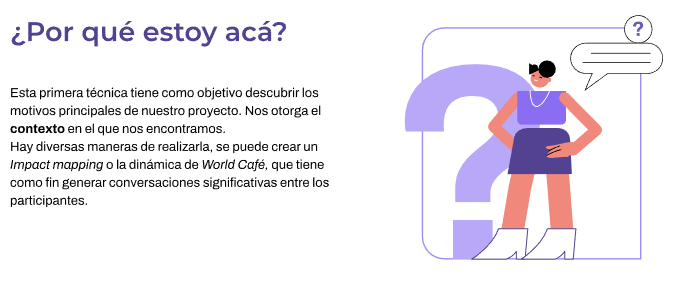
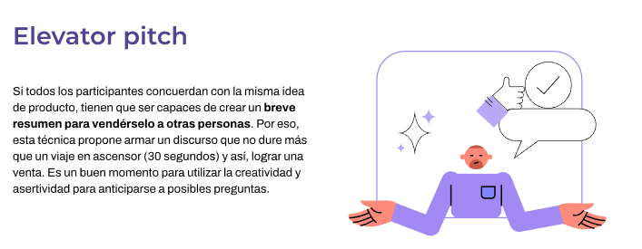
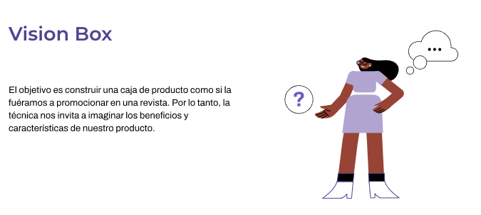
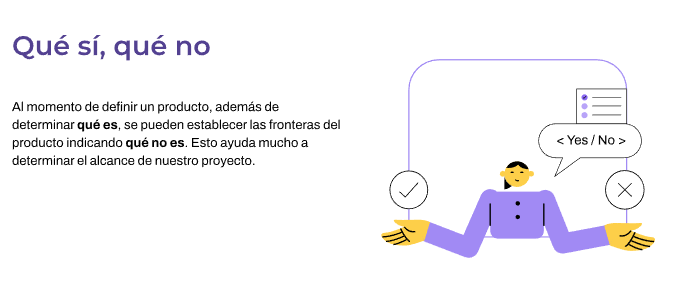
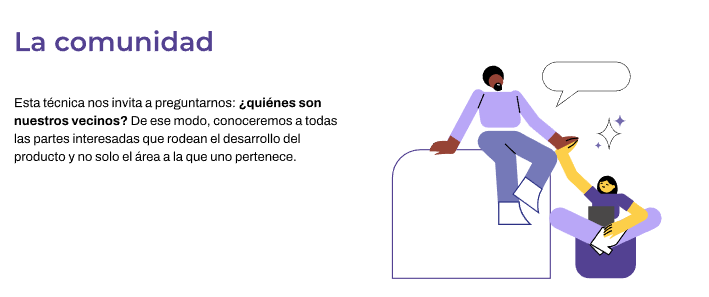

 #### Enfocadas en el Cómo
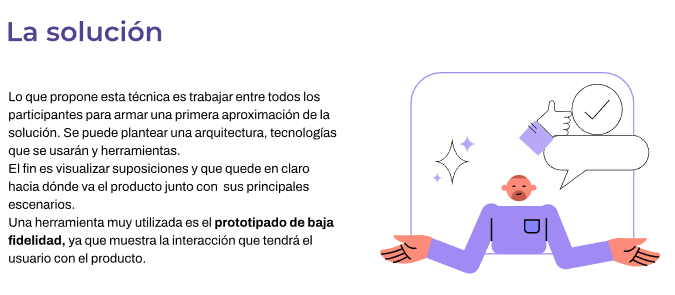
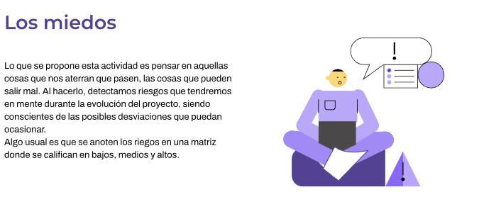
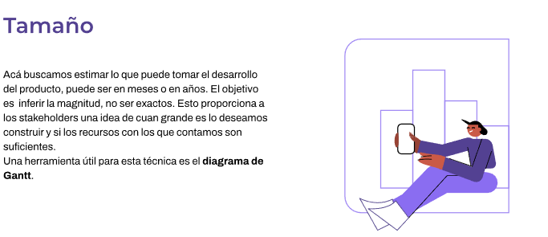
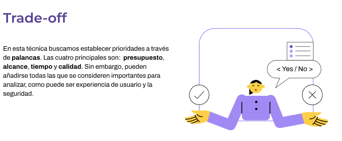
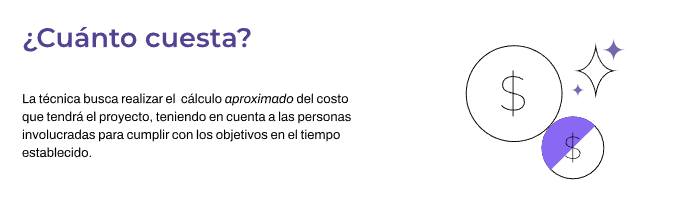

Más en guías de Técnicas clase 4

#### Impact mapping <a id='m2-3'></a>
El mapa de impacto es una estrategia de planificación
Guía de implementación clase 4.

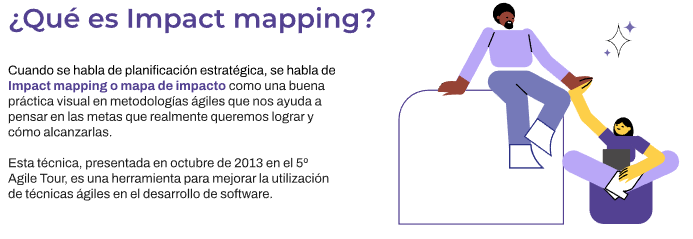

[Guía IM](./clases/clase%204%20-%208%20de%20noviembre%20de%202022/A4A_PPT_Impact%20Mapping.pdf)

#### Lean startup <a id='m2-4'></a>
Veamos el método Lean startup para entender con qué herramientas contamos para poder hacerlo.

#### ¿Qué entendemos por Lean startup?
El método Lean startup es un sistema utilizado para hacer foco en las necesidades del cliente, contando con su retroalimentación para modificar el desarrollo de un producto hasta su versión final.

```
Esta metodología apunta a acortar los ciclos de desarrollo de productos adoptando una combinación de experimentación impulsada por hipótesis para medir el progreso, lanzamientos de producto iterativos para ganar valiosa retroalimentación de los clientes y aprendizaje validado para medir cuánto se ha aprendido.
La idea de este sistema es adaptar el producto a lo que el mercado demanda y no a nuestra propia visión, siendo lo más acertado a la hora de lanzar algo nuevo.
```

#### El origen del método <a id='m2-4-1'></a>
El concepto originario viene de Steve Blank, emprendedor y mentor de Silicon Valley, cuando comenzó a desarrollar una metodología de validación de productos basado en el desarrollo de cliente (Customer Development), que consiste en saber si nuestro producto puede cubrir sus necesidades o deseos. Eric Ries, alumno de Steve Blank, toma esta corriente y le suma la influencia de la metodología Lean manufacturing, popularizada en su libro El método Lean startup, un nuevo sistema para desarrollar proyectos.

#### ¿En qué consiste el método Lean startup?
```
El método Lean startup está basado en el “aprendizaje validado”, es decir, verifica poco a poco las ideas antes de tener el producto final y escala en el negocio.
Además de definir, esto acorta los ciclos de desarrollo, lanza distintas propuestas por un periodo de tiempo y obtiene un feedback muy valioso de nuestros potenciales clientes o usuarios. De esta forma logra mejorar la siguiente versión final del producto.
```
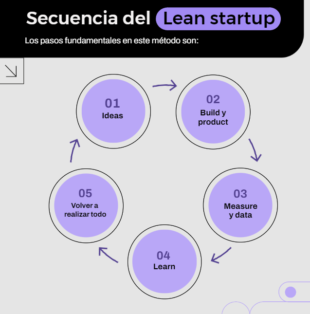

[Secuencia genially](https://view.genial.ly/6217a4830771e900126157ec)

#### MVP <a id='m2-5'></a>

Los conceptos de MVP o “mínimo producto viable”. Y MMP, que significa “producto mínimo comercializable”. Sí, ya sabemos lo que están observando: las siglas no siguen el orden de su traducción al castellano, ya que sus nombres originales serían:

- MVP = minimum viable product
- MMP = minimum marketable product

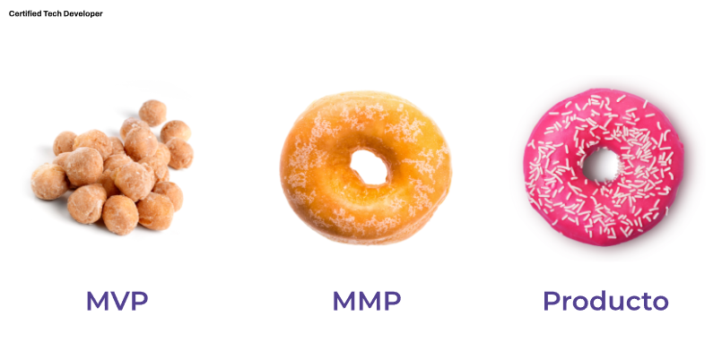


#### El Lean model canvas <a id='m2-6'></a>
Ahora vamos a conocer una herramienta organizacional muy utilizada, el Lean model canvas. Esta es una herramienta estratégica que permite analizar de manera visual nuestro modelo de negocio para aumentar sus probabilidades de éxito. A través de ella, se irán recorriendo distintos bloques o cuadrantes de información clave que el equipo de trabajo analizará y completará para avanzar en la propuesta del producto.

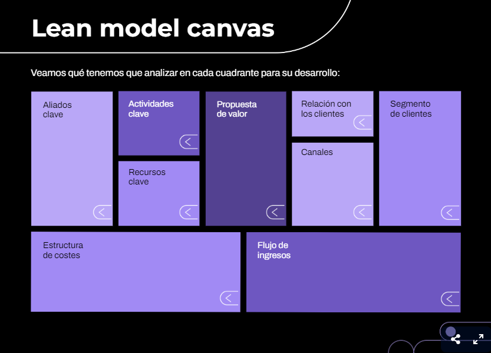

[Canvas genially](https://view.genial.ly/6218d853e67ac2001266ca41)

#### Ejemplo de aplicación
Luego de explorar cada cuadrante del Lean model canvas, les proponemos relacionar la información de cada bloque. Tengan en cuenta el caso de aplicación que venimos trabajando desde las clases anteriores. En la última, abordamos el impact mapping de una app que permite reproducir series y películas online.

Ahora, veamos un ejemplo de Lean model canvas desarrollado en el contexto de este proyecto.


Repasemos algunos conceptos importantes
- Lean startup es una filosofía simple que se puede amoldar sin problemas y de forma efectiva a cualquier cultura de trabajo.
- El centro de la filosofía parte de la concepción de un MVP (mínimo producto viable). Este tiene la capacidad de desarrollar el mayor impacto de aprendizaje a través del menor esfuerzo posible, y así poder probar una hipótesis y generar valor.
- La definición de métricas es imprescindible para guiar nuestro camino: ¿qué es lo que se necesita medir para comprobar la hipótesis que se tiene dentro de la etapa de ideación?
- A través de las métricas surgirá el aprendizaje validado. Los KPI (indicadores clave) serán como una brújula para mover el negocio. En este punto vamos a poder definir si se itera el proyecto o se persevera en la idea.


<!--###############################################--  MÓDULO 3 --#####################################################################-->
## Product delivery <a id='m3'></a>

Llega el momento de entregar el producto.
Nuestro objetivo será poder elaborar un plan de entregas que nos permita trabajar de forma eficaz, creando valor a cada paso. A su vez, tendremos que comunicar a los interesados, de forma clara y precisa, en qué se trabajará a futuro para darle vida a nuestro producto.

A partir de un plan de lanzamiento veremos cómo organizamos las entregas a nuestros clientes, y ya con una clara definición de producto, cómo organizar el trabajo a realizar, la confección de historias de usuario y su priorización.

#### Roadmap <a id='m3-1'></a>
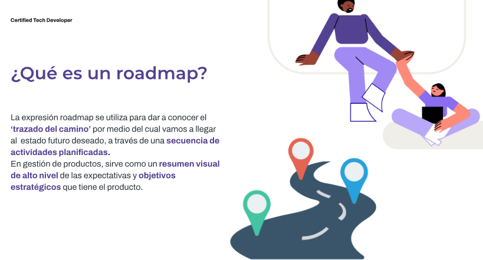

#### Ejemplo de aplicación
Continuamos con nuestro caso modelo de las clases anteriores. En la última, trabajamos el Lean model canvas de la app que reproduce series y películas on line.

Ahora veamos un ejemplo de un roadmap a tres meses, orientado por objetivos y desarrollado para presentar a los stakeholders.


#### Release <a id='m3-2'></a>
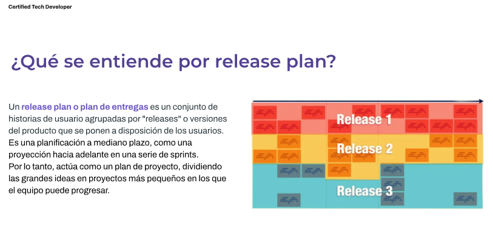

#### Burndown chart <a id='m3-3'></a>
Esta herramienta nos permite medir la estimación y ejecución de tareas en un equipo.


<!--###############################################--  MÓDULO 4 --#####################################################################-->

##  Cierre y aprendizajes <a id='m4'></a>

En este último módulo los estudiantes harán la exposición de sus trabajos en grupos y obtendrán un feedback de los docentes y compañeros. Sacaremos conclusiones de los temas vistos durante la cursada y presentaremos los objetivos de los próximos talleres.