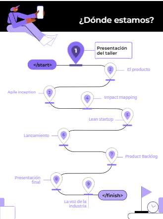
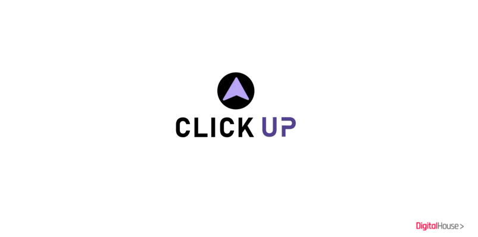
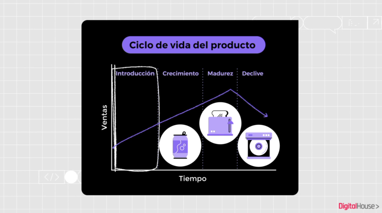
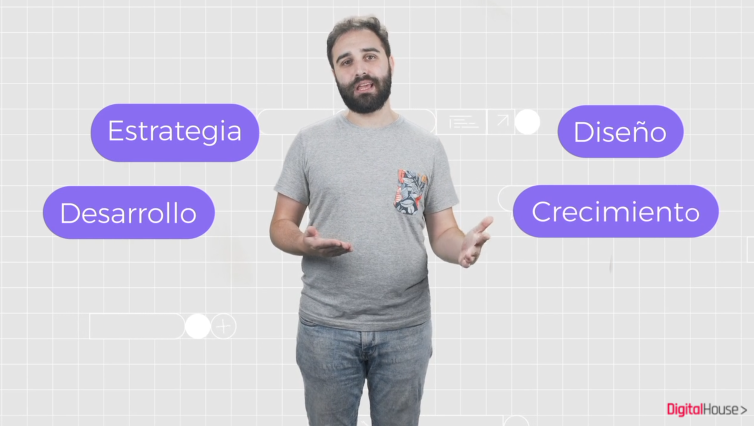
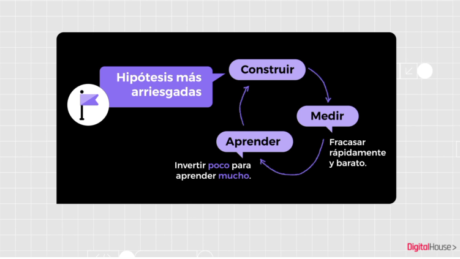
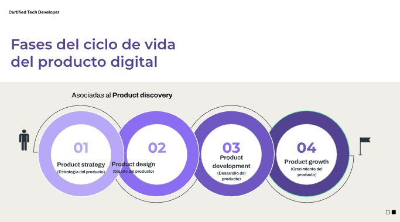
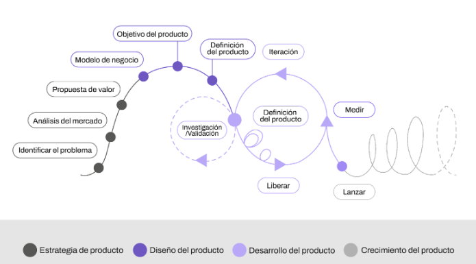

<t>Gestión de Productos Digitales I <t>

----------------------

## Índice

1. Módulo 1 - 

- [m1 ](#m1) Introducción a la gestión de productos
- [C1](#c1) La start-up
- [C1a](#c1a) Scrum
- [mdt1](#mdt1) Proyecto a desarrollar
- [C2](#c2) El producto digital hoy
- [C2a](#c2a) El ciclo de vida de un producto digital 
- [C2a](#c2a) Las mejores prácticas para el desarrollo de productos digitales 
- [C2b](#c2b) Fases de un producto digital

2. Módulo 2 -
- [m2](#m2)   Product discovery

3. Módulo 3 -  
- [m3](#m3)  Product delivery

4. Módulo 4 -  
- [m4](#m4)  Aprendizajes

[fasf](https://view.genial.ly/62014e4b549f780012248f96)

 

------------------

# Mapa de la materia 

En este taller continuarás una experiencia inmersiva en el marco de trabajo Scrum, desarrollaremos habilidades blandas para la definición de productos digitales. ¿Qué vamos a ver? Desde el reconocimiento de un problema u oportunidad hasta lo necesario para iniciar el desarrollo de un producto que responda a esa necesidad. Todo aplicándolo a casos prácticos grupales.

### ¿Cuáles son los objetivos del taller? 

- Conocer de qué manera se crea, produce y gestiona un producto digital con una perspectiva del desarrollo de software.
- Utilizar los conocimientos adquiridos en los talleres de Metodologías del Trabajo, 
Design Thinking y UX/UI para concebir un producto digital desde la ideación hasta su lanzamiento.
- Tener contacto con storytellings que remitan a casos reales para aplicarlos en situaciones de trabajo del campo profesional.

<!--###############################################--  MÓDULO 1--#####################################################################-->
##  Introducción a la gestión de productos 

El objetivo de este primer módulo es recordar lo visto en los talleres anteriores e introducir el de Gestión de Productos Digitales, marcando la importancia de la correcta definición de una visión de producto, las responsabilidades del product owner (PO) y el papel del equipo de desarrollo en estas etapas iniciales.

### La startup 

Click up es una startup que surgió a finales del 2020 para brindar soluciones IT a pequeñas y medianas empresas en Latinoamérica, sus integrantes son profesionales de diferentes países (Argentina, Brasil y Colombia). El CEO de la empresa es Nicolás Arroyo, un programador que dejó su empleo para crear un emprendimiento. Paula Sosa es la Agile Coach y socia de la empresa. Cuando se publicó en Forbes sobre este negocio y su metodología de trabajo, la empresa ha recibido muchas solicitudes de nuevos clientes.

#### Bienvenido al equipo!

### Scrum   

La metodología de trabajo a implementar

[scrum](https://view.genial.ly/62014e4b549f780012248f96)

## Proyecto a desarrollar  

El trabajo práctico integrador es un proyecto que se realiza de manera grupal y es uno de los requisitos para la aprobación del taller Gestión de Producto Digitales I.  

Con esta instancia buscamos que:
- Apliquen los conceptos y herramientas aprendidas en clase en un caso de estudio.
- Experimenten de inicio a fin la resolución de problemas a través de la definición de productos digitales. 
- Fortalezcan la dinámica de trabajo colaborativo y capacidades aprendidas en los talleres anteriores.

El TPI consiste en la definición de un producto digital a través de las dinámicas y herramientas aprendidas durante el taller para resolver una problemática propuesta por el equipo docente. Es un trabajo que empieza en la segunda clase con la formación del equipo y presentación del caso práctico, y termina en la octava semana con la presentación final. 

#### Entrega final

Se presentará el producto digital resultante de las propuestas planteadas clase a clase en la semana 8 del Taller. El producto digital integrará la entrega realizada durante la clase 5 y deberá incluir las siguientes instancias: 
Lean model canvas: lienzo del producto digital y análisis de la propuesta de valor.
Product roadmap: documento que muestre las funcionalidades del producto y sus primeros lanzamientos. 
Product backlog inicial: pila de historias de usuario refinadas y priorizadas, necesarias para el primer lanzamiento. 
Todas las instancias conformarán el portafolios del producto digital realizado. Cada participante del equipo debe subir el trabajo práctico integrador en formato PDF en Google Forms, donde además tendrá que adjuntar su bitácora de trabajo individual, la cual irán desarrollando a lo largo de los módulos. 

---------------

## El producto digital hoy 

Definimos así a un producto o servicio que existe a través de un software y ofrece algún tipo de utilidad.
El punto de contacto digital a través del cual una persona interactúa puede ubicarse en muchos tipos de plataformas y dispositivos. Estos pueden incluir la web, el móvil, wearables (como un reloj, lentes o ropa), realidad virtual y muchas más.
Puede incluir una gran variedad de funciones, donde se producen series de procesos cuyo nivel de interactividad se complejiza gradualmente. Por lo que la calidad del software se convierte en un factor fundamental. Para esto hay que poner especial atención a las entregas de valor periódicas a las cuales estará sujeto su proceso de desarrollo.

La complejidad que asume el desarrollo de productos digitales implica a múltiples actores involucrados en las entregas del trabajo, juntos lograrán que el producto cobre vida. Por este motivo, se debe procurar que el proceso de desarrollo sea lo más integral posible, para conducir al producto de manera eficiente hacia el mercado.

## El ciclo de vida de un producto digital 

¿Es correcto implementar un mismo proceso de desarrollo para productos digitales o no digitales?

### Etapas clásicas
Cuando se piensa en desarrollo de producto, las etapas clásicas son las que nos llevan desde su ideación a su comercialización:
- Introducción
- Crecimiento
- Madurez
- Declive

### Vida y etapas de un producto digital
Al hablar de un producto digital nos planteamos la existencia de un proceso previo a la creación del producto, y consideramos que un producto no debería morir pues siempre tendría que tener la oportunidad de crecer e implementar mejoras de manera iterativa.

### Las etapas de un producto digital
Serían:
- Estrategia
- Diseño
- Desarrollo 
- Crecimiento

### Trabajo de los equipos de productos digitales

Las necesidades y espectativas de los clientes son cada vez más sofisticadas, por lo que un equipo de desarrollo debe implementar nuevas formas de adarptarse.

## Mejores prácticas para el desarrollo de productos digitales 
Las mejores prácticas implican iterar continuamente, trabajar en hipótesis, pruebas y validaciones; para cometer errores lo antes posible y así, tomar decisiones rápidas.

## Fases de un producto digital  

- La estrategia de producto
 Son escenarios disparadores de ideas de producto
- El diseño de producto
ya identificamos en mercado, la visión del producto y quién será el usuario
- Desarrollo de producto
Acá ya tenemos una buena idea de cómo debería verse y qué queremos cómo MVP
- El crecimiento
Inicia con el lanzamiento del producto y continua a través de la implementación de mejoras.

<!--###############################################--  MÓDULO 2 --#####################################################################-->
## Product discovery 

Nos enfocaremos en diferentes técnicas de alineación de visión de producto y objetivos globales. Conoceremos las características que tienen, cómo se preparan y cuáles son los pasos para ejecutarlas. Además, retomaremos el concepto de MVP (Producto mínimo viable) y los detalles que hay que tener en cuenta a la hora de definirlos.

<!--###############################################--  MÓDULO 3 --#####################################################################-->
## Product delivery 

A partir de un plan de lanzamiento veremos cómo organizamos las entregas a nuestros clientes, y ya con una clara definición de producto, cómo organizar el trabajo a realizar, la confección de historias de usuario y su priorización.

<!--###############################################--  MÓDULO 4 --#####################################################################-->

##  Cierre y aprendizajes 

En este último módulo los estudiantes harán la exposición de sus trabajos en grupos y obtendrán un feedback de los docentes y compañeros. Sacaremos conclusiones de los temas vistos durante la cursada y presentaremos los objetivos de los próximos talleres.