<t>Backend II<t>

**¿Cuál es nuestro objetivo?**
En este curso, vamos a conocer cómo las grandes compañías abordan este tema y cómo resuelven la problemática de la seguridad de una manera más eficiente y menos costosa, delegando este problema a componentes externos que se encargarán de proteger nuestros microservicios, pero también aplicaciones como las SPA o móviles.

**¿Qué vamos a lograr?**

**Objetivos:**

- Adquirir los conocimientos teóricos y prácticos de los marcos de autenticación y autorización más seguros de la industria.

- Diseñar e implementar una arquitectura de seguridad de microservicios a través de un Identity and Access Management.

- Integrar la herramienta de Identity and Access Management en una solución basada en Spring Cloud.

**¿Dónde estamos?**

[presentación genialy](https://view.genial.ly/631a50616dbedd0010f4350a)

[Programa](./INTERNO%20Programa%20de%20Especializaci%C3%B3n%20Back%20End%20II%20-%20Seguridad%20en%20Microservicios-%20V2.html)

----------------------

## Índice

1. Módulo 1 -  

- [IAM](#m1) 

- [Keycloak](#c1)
 - [Características](#c1a)
 - [Instalación](#c1b)
 - [Panel de administración](#c1c)
 - [Creación de reinos](#c1d)
 - [Configuraciones](#c1e)

- [Estándares y autenticación](#c2)
- [Patrones de seguridad](#c2a)
 - [OAuth 2.0](#c2b)
 - [OpenID Connect (OIDC)](#c2c)
 - [Json Web Token (JWT)](#c2d)
 - [OIDC Discovery](#c2e)
 - [Autenticación de un usuario](#c2f)
    - [Recrear flujo de autenticación de OpenID Connect](#c2f1)
    - [Análisis de un ID token](#c2ef2)
    - [Refresh token](#c2g)
    - [Modificación del perfil de usuario](#c2h)
    - [Agregar roles al ID token](#c2i)
    - [Logout](#c2j)

- [Autenticación avanzada](#c4)
    - [RBAC (role-based access control)](#c4a)
    - [ABAC (attribute-based access control)](#c4b)
    - [Roles dentro de Keycloak](#c4c)
    - [OAuth 2.0 scopes](#c4d)
    - [GBAC (group-based access control)](#c4e)
- [Repaso](#c4f)

- [Tokens y sesiones](#c5)
    - [Gestión de sesiones](#c5a)
    - [Tiempo de vida de una sesión](#c5b)
    - [Forzar expiración de una sesión](#c5c)
    - [Gestionando tokens](#c5d)

- [Integración de Keycload con Spring boot](#c7)
    - [Integración Keycloak con back end](#c7a)
    - [Integración de Keycloak con Spring Cloud](#c7b)
- 
- 
- 

2. Módulo 2 -  

- [Repaso](#m2) 
 - 
 - 
 - 
 - 
- mdts

3. Módulo 3 -  

- [Repaso](#m3) 
 - 
 - 
 - 
 - 
- mdts

4. Módulo 4 -  

- [Repaso](#m4) 
 - 
 - 
 - 
 - 
- mdts

-----------------------------
## Trabajo integrador
Consigna: Usar un middleware de IAM, que centralice la gestión y lógica de seguridad de usuarios para extraer esta responsabilidad de las API. Adicionalmente, plantean la necesidad de centralizar las llamadas a todas las API actuales y futuras API, mediante un proxy intermediario, es decir, mediante un API Gateway.

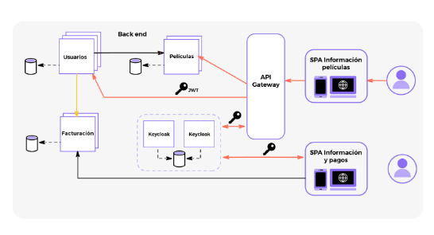

[PDF](./Trabajo%20Integrador%20-%20Contexto%20.html)

---------------------------------
<!--###############################################--  MÓDULO 1--#####################################################################-->
##  Identity and Access Management
 

Identity and Access Management (administración de identidad y acceso o IAM) es todo lo que sucede detrás de un login. La administración de identidad y acceso permite que las personas puedan acceder (validando su identidad) a los recursos que les corresponden según sea su rol.

Entonces, un Identity and Access Management es un sistema que permite a las personas verificadas acceder a los recursos permitidos en el momento que sea solicitado. IAM viene a resolver la necesidad de garantizar el acceso adecuado a los recursos en entornos tecnológicos cada vez más heterogéneos, cumpliendo con rigurosos requisitos.

[presentación genialy](https://view.genial.ly/6262fdfe093fbb0018e01897)

Los sistemas IAM, como base, proporcionan:

- Gestión de los usuarios: el sistema puede gestionar un repositorio propio de usuarios para crear, modificar y eliminarlos, o puede integrarse con otros repositorios y sincronizarse con ellos. Los usuarios también pueden representar a entidades no humanas, como software, dispositivos IoT o robótica.

- Roles: IAM permite agrupar usuarios según un rol para luego determinar su nivel de acceso. Por ejemplo, administradores, editores, etc.
Autenticación: IAM autentica a un usuario al confirmar que es quien dice ser. Generalmente, se utiliza la autenticación multifactor. Esta consiste en proveer más credenciales generadas de manera distinta a fin de fortalecer la autenticación.

- Autorización: la gestión de accesos garantiza que a un usuario se le otorga el nivel exacto y el tipo de acceso al que tiene derecho.
Reportes: podemos generar reportes sobre las acciones realizadas en la plataforma, como la hora de inicio de sesión, los sistemas a los que se accede y el tipo de autenticación.

- Single sign-on (SSO): permite a los usuarios autenticarse utilizando las credenciales “federadas” en un único portal (por ejemplo: Google o Facebook). De esta manera, no es necesario que el usuario se registre nuevamente con un usuario y contraseña.

- Autenticación de múltiples factores (MFA): en una era en la que las contraseñas a menudo son robadas, el requisito de una prueba de identidad adicional es el nuevo estándar. La autenticación a través de huellas dactilares y las contraseñas de un solo uso son ejemplos de métodos de autenticación comunes.

### Keycloak 

Keycloak es una herramienta de gestión de identidad y acceso de código abierto que se centra en aplicaciones modernas, como SPA (single page application), aplicaciones móviles o API REST. Se utiliza en producción para escenarios que van desde pequeños sitios web con solo un puñado de usuarios hasta grandes empresas con millones de usuarios.

#### Características de Keycloak: 
- páginas de inicio de sesión totalmente personalizables
- puedes delegar los mecanismos de autenticación
- Permite a los usuarios acceder a múltiples aplicaciones autenticándose una única vez
- Tiene su propia base de datos de usuarios
- Es altamente escalable y proporciona alta disponibilidad. 

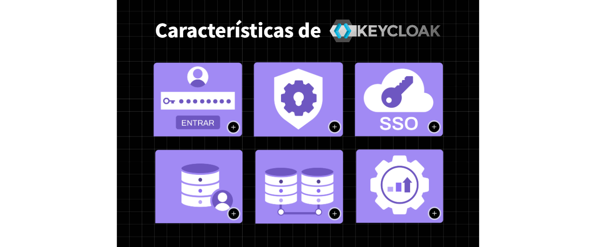

[presentación genialy](https://view.genial.ly/631f5a89afcd430018b725b2)

[Clientes en Keycloak](./clase%201%20-%2013%20de%20feb%20de%202023/6.%20Clientes%20de%20reinos%20de%20keycloak.pdf)

### Instalación y ejecución de Keycloak 
Keycloak proporciona varias opciones de instalación. Algunas de ellas son:

Ejecutándolo como un contenedor de Docker.
Instalándolo y ejecutándolo localmente utilizando Java.
Ejecutándolo con Kubernetes.
Nosotros vamos a utilizar Docker para ejecutarlo, ya que consideramos que es la opción más simple.

#### Ejecutando Keycloak con Docker

1- Levantar docker 
2- Ejecutar el código siguiente:
<code docker>
docker run -p 8080:8080 -e KEYCLOAK_ADMIN=admin -e KEYCLOAK_ADMIN_PASSWORD=admin quay.io/keycloak/keycloak:18.0.0 start-dev
</code docker>    

El comando de arriba nos permite ejecutar keycloak en un contenedor, en donde además indicamos que queremos exponer el puerto 8080, y configuramos las credenciales para el usuario administrador.

Listo, ahora podemos acceder a http://localhost:8080 para verificar su ejecución.

### Panel de administración 
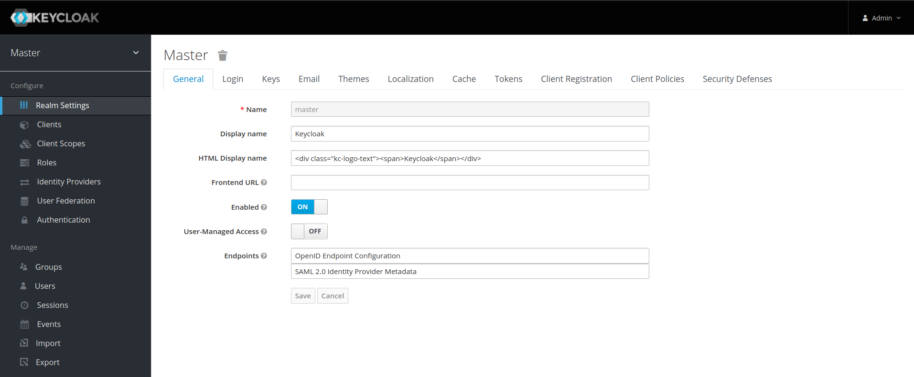

### Creación de reinos en Keycloak 
Son las entidades que pueden solicitar a Keycloak  la autenticación de un usuario. Generalmente, son aplicaciones y/o servicios que necesitan  autenticar vía single sign-on.
También pueden ser entidades que requieren información del usuario autenticado previamente o un token relacionado con ellos para poder 
invocar a otros servicios de la solución que también usen KeyCloak.

[Crear un reino en Keycloak](./clase%201%20-%2013%20de%20feb%20de%202023/2.%20%C2%BFC%C3%B3mo%20creamos%20un%20reino_.pdf)

### Configuraciones de Keycloak 

Al trabajar de forma local con Keycloak puede ocurrir que necesitemos guardar la configuración de nuestro reino para poder utilizarla en otra computadora o, también, en el caso de que nuestra configuración se pierda y debamos realizarla desde cero. Keycloak nos permite importar y exportar nuestras configuraciones en archivos JSON.

[PASO A PASO - Exportar e importar configuracione de reinos en Keycloak](./clase%201%20-%2013%20de%20feb%20de%202023/2.%20Pasos%20para%20exportar_%20importar%20configuraciones%20en%20Keycloak.pdf)

----------------------

### Estándares y autenticación 
#### Seguridad:
Los protocolos de autenticación estandarizados han sido examinados públicamente por expertos y son de confianza. Debido a esto, muchas organizaciones confiarán en determinadas soluciones solo si se utilizan protocolos estandarizados como OAuth, OIDC o SAML. Cuando utilizamos un protocolo estandarizado, tenemos la tranquilidad de saber que nuestro sistema de autenticación sigue los pasos de los expertos de la industria y las mejores prácticas.

#### Aprendizaje transferible
¿Qué pasaría si cada vez que construimos el sistema de autenticación de un nuevo sistema, tenemos que crearlo desde cero? Tendríamos que aprender los detalles esenciales de la autenticación una y otra vez. Esto conduciría a un escenario en el que no podríamos aprovechar el conocimiento ganado con tanto esfuerzo entre proyectos y empleadores. Si, en cambio, utilizamos un protocolo ubicuo (como OAuth) puede haber diferencias sutiles, pero comprenderemos la arquitectura de autenticación general. Si sabemos cómo funcionan los protocolos estandarizados y qué casos de uso resuelven, podemos llevar ese conocimiento a otros proyectos y empresas. Lo mismo se aplica al enseñar e incorporar nuevos desarrolladores al equipo. Si utilizamos un protocolo de autenticación estandarizado, es probable que los nuevos miembros del equipo ya los conozcan. Por lo que será mucho más fácil hacer que estos nuevos miembros del equipo se pongan en marcha y contribuyan a estas áreas relevantes del sistema.

#### Soporte de librerías
La mayoría de los lenguajes de programación modernos tienen bibliotecas de códigos que se integran con los protocolos de autenticación estándar, lo que acelera nuestro trabajo de desarrollo. Mediante el uso de un protocolo de autenticación estandarizado, nuestros clientes y consumidores de API pueden reutilizar bibliotecas de códigos comunes para el lenguaje de programación elegido.

#### Interoperabilidad entre sistemas
El uso de un protocolo de autenticación como OAuth hace que nuestro sistema sea más interoperable con otros, es decir, se comunique de manera más sencilla con otros sistemas. Si trabajamos con una organización empresarial más grande, nuestro sistema necesitará integrarse con otros sistemas todo el tiempo. El uso de una forma estandarizada ahorra tiempo, sobrecarga mental y costos generales. Lo mismo se aplica a los sistemas externos. Si hemos creado una API compatible con OAuth, por ejemplo, nuestros clientes comprenderán cómo integrar sus soluciones y sistemas con los nuestros mucho más rápido y con muchos menos dolores de cabeza.

#### Manejo de casos límite
Los estándares han sido utilizados por muchas organizaciones y sistemas de muchas maneras diferentes. A menudo, los casos límite se manejan o se descartan explícitamente. Al aprovechar un estándar, obtendremos los beneficios de todo ese conocimiento y experiencia.

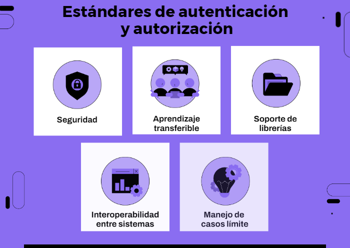

[Presentación genially](https://view.genial.ly/63208ba3a8e4f10018934e35)

### Patrones de seguridad  
Los patrones de seguridad son soluciones reutilizables a los problemas de seguridad, que pueden adaptarse según sea necesario. En esta clase, aprenderemos sobre algunos patrones como:

- OAuth 2.0
- Open ID Connect (OIDC)
- Jason Web Token (JWT)
- OIDC Discovery

### OAuth 2.0 
Cuando necesitamos darle acceso a la información de nuestra cuenta de Google (o a cualquier servicio) a un sitio web o aplicación, OAuth puede ayudarnos a garantizar ese acceso de forma segura. OAuth es, probablemente, el protocolo de autenticación más popular de la industria. ¿De autenticación? Bueno, de hecho, no es un protocolo de autenticación en sí mismo, como estamos a punto de ver.

Específicamente, OAuth permite que una aplicación obtenga de forma segura un token de acceso (un poco más adelante vamos a adentrarnos en el mundo de los tokens), que puede ser usado para realizar solicitudes adicionales a API de terceros o servicios web.

Podríamos decir, básicamente, que OAuth es un estándar que define la coreografía entre clientes y servicios para garantizar la forma en que se obtiene un token para acceder a los diferentes recursos de la aplicación o sitio web.

Por supuesto, en esta coreografía hay actores que tendrán diferentes roles y jugarán papeles muy importantes en el transcurso del proceso o flujo de solicitudes y recuperación de la información.

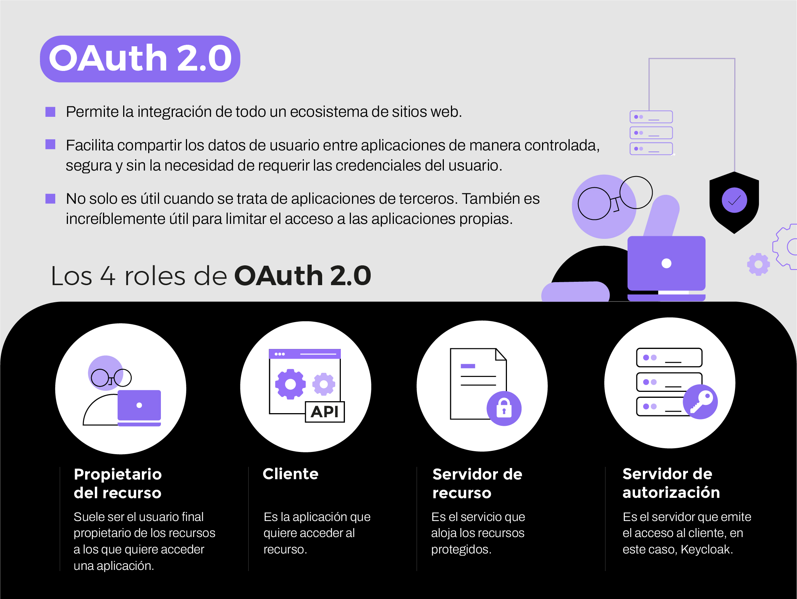

#### Funcionamiento de OAuth 2.0
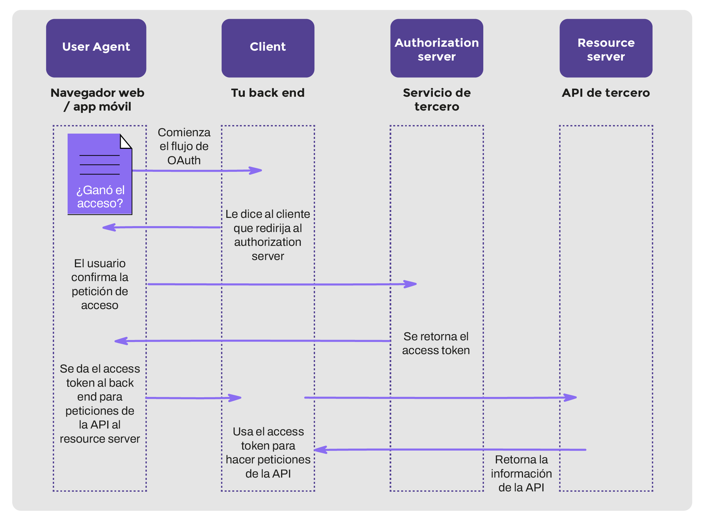

En esencia, en el flujo de protocolo OAuth, el cliente (la aplicación) solicita al servidor de autorización (el servicio) el acceso a un recurso en nombre del propietario (el usuario). El servidor de autorización emite un acceso limitado al recurso en forma de token de acceso. Tras recibir el token de acceso, el cliente puede acceder al recurso en el servidor de recursos (aquí aparece Keycloak, gestionando el proceso), incluyendo el token de acceso en la solicitud.

Ya tenemos, entonces, una comprensión un tanto básica de cómo funciona tras bambalinas el estándar de OAuth… ¿Pero no necesitamos introducirnos más a fondo hasta desenterrar todo el complicado proceso y código que esto conlleva? Bueno, no necesariamente. Lo que siempre vamos a priorizar es usar una biblioteca que oculte su complejidad y nos ayude a aplicarlo de la manera correcta… y, por supuesto, nos ahorre trabajo.

Pero después de repasar el funcionamiento, habrás notado algo raro… OAuth se dedica a conceder acceso a los recursos (para continuar usando la terminología correcta: “autorizar”), pero no hace nada respecto a la “autenticación” de los usuarios. Para cubrir este aspecto aparece OpenID Connect (OIDC)

### OpenID Connect (OIDC) 

Decíamos que OpenID Connect es una extensión de OAuth, es decir, una capa simple de identidad (es también un protocolo estándar como OAuth) que se coloca por encima y hace que la tarea de verificar la identidad de un usuario (autenticarlo) sea más sencilla. Además, obtiene información básica del perfil desde el proveedor de identidad y permite que aplicaciones de terceros puedan verificar dicha identidad del usuario final.

Digamos que, una de las características más importantes (y parte de su propósito) es proponer un solo login para múltiples sitios o aplicaciones cada vez que vayamos a loguearnos en un sitio web que use OIDC, seremos redirigidos a un sitio de OpenID donde nos loguearemos y, posteriormente, seremos llevados de vuelta al sitio web principal.

<comments>
Por ejemplo, si ingresamos a un sitio y decidimos hacer login usando una cuenta de Google, entonces habremos usado OIDC. Una vez que somos autenticados exitosamente y autorizamos al sitio web o aplicación a la que estabamos tratando de ingresar para que pueda acceder a nuestra información, Google envía información al sitio web/aplicación sobre el usuario y sobre la autenticación realizada.

Esta información vuelve bajo la forma de un JWT (recibiremos un token de acceso -access token- y, probablemente, un token de identificación -ID token). Ya conocemos algo de JWT, pero vamos a ver qué papel juega exactamente en este proceso de autenticación/autorización.
</comments>

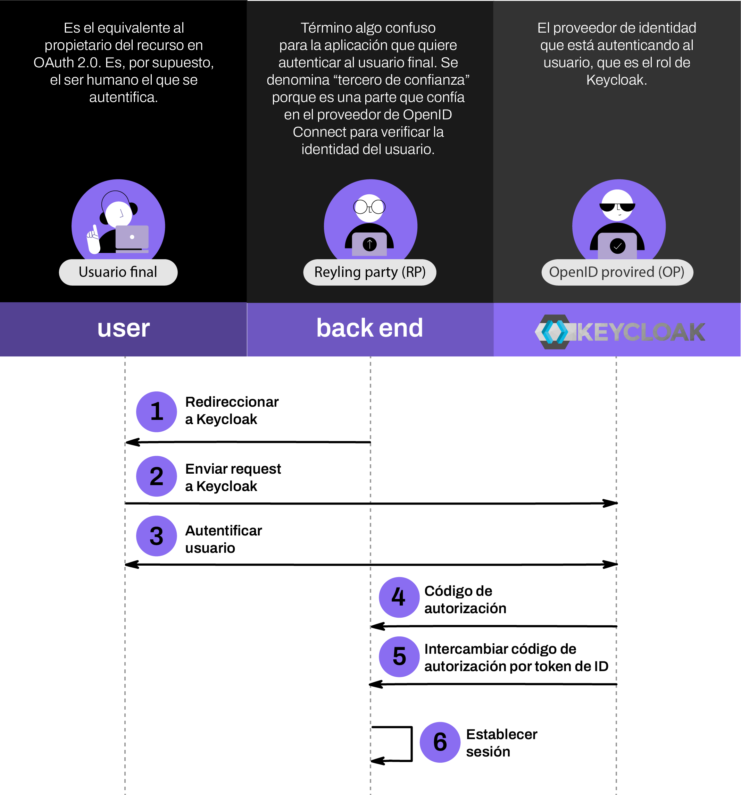

### Json Web Token (JWT) 

Los JSON web tokens (JWT) son una forma estandarizada, compacta y autocontenida de transmitir de manera segura información entre partes. Sabemos que la J refiere a JSON y es que esa información se transmite como objetos de tipo JSON. Los JWT pueden ser verificados y confiados, ya que son firmados digitalmente (junto con la posibilidad de ser encriptados) y contienen toda la información requerida sobre una entidad, evitando tener que hacer consultas a una base de datos más de una vez. Además, quien recibe ese JWT tampoco necesita llamar a un servidor para validarlo. Pero vale la pena recalcar que, como dijimos que son un estándar, esto significa que todos los JWT son tokens, pero no todos los token son JWT.

#### Beneficios de JWT
 - Más compacto: 
 Los objetos de tipo JSON son menos verbosos que otros objetos (como XML). Por eso, cuando se codifican, son más pequeños que otros tokens, siendo posible enviarlos por una URL, un parámetro de una llamada POST o dentro de un header HTTP, con un poder de transmisión verdaderamente rápido
 - Más seguro:
 JWT puede usar pares de claves públicas o privadas bajo la forma de certificados de firma. Esto le otorga el poder de ser firmados de forma simétrica y compartidos entre partes que conocen un “secreto” usando algoritmos (por ejemplo, HMAC). Otros tokens, como los de SAML, también pueden usar pares de claves públicas/privadas, pero el proceso para firmar usando XML es mucho más complicado y no tan seguro como el proceso de firma de un JWT.
 - Más fácil de procesar:
 JWT se usa a escala de la Internet, esto significa que es más fácil de procesar en dispositivos, especialmente en los dispositivos móviles
 - autenticación:
 Cuando un usuario se registra exitosamente usando sus credenciales, se devuelve un token de identificación (ID token)
 - autorización:
 Una vez que el usuario fue autenticado, la aplicación puede solicitar acceso a diferentes recursos, servicios o rutas en nombre del usuario. Para tal fin, en cada solicitud (o request) se debe pasar un token de acceso (access token), el cual muy probablemente vaya en la forma de un JWT. Single sign-on (SSO) usa prácticamente siempre un JWT por los motivos que ya vimos (tamaño y facilidad de comunicación).
 - Intercambio de información:
 Los JWT son una manera segura de transmitir información entre partes debido a su capacidad de ser “firmados”, lo que significa que podemos estar seguros de que el remitente es quien dice ser y la información es fidedigna (y no fue manipulada en medio del proceso de comunicación)
 - seguridad:
 Por último, merece la pena repetir que los JWT son objetos verificables gracias a su firma y muy seguros, ya que además pueden ser encriptados, aumentando su capacidad de ser secretos. Estos son dos procesos posibles para asegurar la seguridad de los JWT: pueden ser firmados usando un secreto (usando un algoritmo, como HMAC) o un par de claves públicas/secretas con RSA o ECDSA (¡otros algoritmos sobre los que pueden investigar si tienen curiosidad!).
 
Entonces, es muy importante que, antes de usar un JWT, este sea validado de forma apropiada usando su firma. Podemos notar que un token validado con éxito asegura que la información no fue manipulada, pero no significa que no haya sido vista; por ello es muy importante nunca transmitir información sensible vía JWT y utilizar mecanismos para que no sea interceptado (por ejemplo, enviarlos por medio de HTTPS).

### OIDC Discovery 

Ya vimos los conceptos principales de OAuth 2.0 y OpenID Connect, ahora vamos a profundizar en el funcionamiento de OpenID Connect en conjunto con Keycloak. Para entender cómo funciona el flujo de autenticación, vamos a utilizar solamente Postman. En un caso real, Spring Security será el encargado de implementar el estándar OpenID de acuerdo a sus especificaciones, pero de esa forma no podríamos entender qué es lo que sucede por detrás.

OpenID es una especificación, o sea, podemos verla como una serie de reglas a seguir para garantizar la seguridad en nuestras aplicaciones. Una de esas reglas es OpenID Connect Discovery. Avancemos para conocer más sobre ella.

[OpenID Connect Discovery](./clase%202%20-%2015%20de%20feb%20de%202023/4.%20OpenID%20Connect%20Discovery.pdf)

#### Autenticación de un usuario 
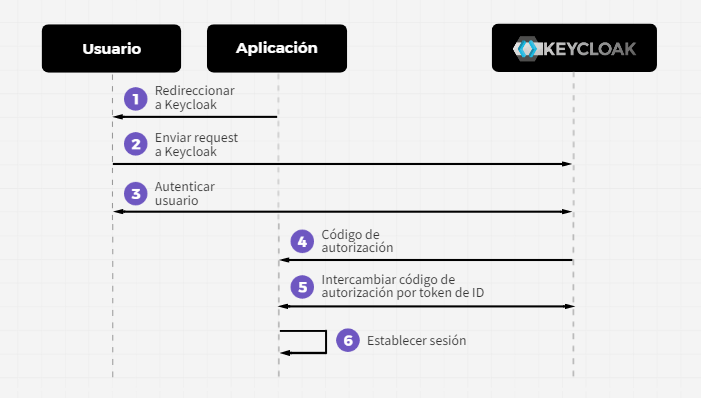

[Presentación genially](https://view.genial.ly/6269ead65b9e510018039fd0)

<a id='c2f1'>[Recrear flujo de autenticación de OpenID Connect](./clase%202%20-%2015%20de%20feb%20de%202023/4.%20Recrear%20flujo%20de%20autenticaci%C3%B3n%20de%20%20OpenID%20Connect%20.html) </a>

### Análisis de un ID token 

En la consulta anterior obtuvimos —en la respuesta— un campo llamado id_token, cuyo valor es un JWT que contiene la información del usuario autenticado. Si copiamos el id_token y lo pegamos en https://jwt.io/ para decodificarlo y ver su información, nos muestra algo como lo siguiente:

- exp: Fecha de expiración del token
- iat : Fecha de creación del token.
- auth_time: Fecha de la última autenticación del usuario.
- jti: ID del token.
- aud: ID del cliente.
- sub: ID del usuario. Es recomendado utilizar este ID en las bases de datos en lugar de username o email, ya que estos pueden cambiar.

[Presentación genially](https://view.genial.ly/634ea644e1cd4e0012cc39c7)

<coments>
Las fechas en los JWT están representadas en segundos desde el 1 de enero de 1970. Si queremos averiguar la fecha de algún campo, podemos utilizar la página www.epochconverter.com.
</coments>

### Refresh token 
Generalmente, el ID token tiene una corta duración. Luego de unos pocos minutos, vence. Para obtener un nuevo token tenemos que enviar el refresh_token al mismo endpoint que enviamos el code autenticamos un usuario.

Ejemplo de request:
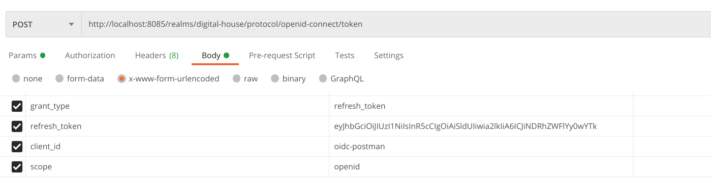

Ahora, en lugar de pasar el valor “code” para la key grant_type, le pasamos “refresh_token”. La respuesta nos envía el nuevo id_token y un nuevo refresh_token, ya que solamente lo podemos usar una única vez.

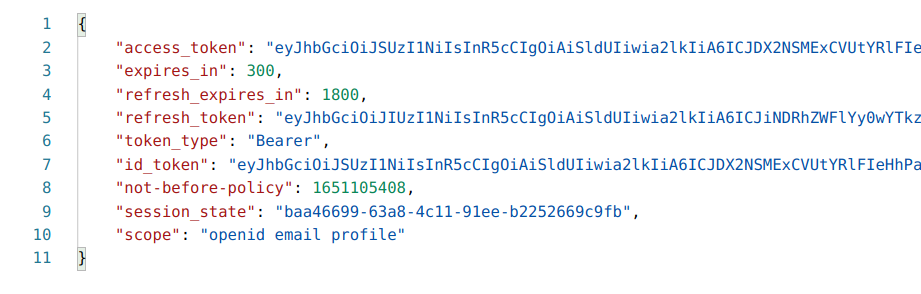
### Modificación del perfil de usuario 
Podemos agregar atributos a los usuarios y luego agregar estos nuevos atributos al JWT para que sean utilizados por cualquier aplicación que consuma el token, por ejemplo, los microservicios del back end.

### Agregar roles al ID token 
Por defecto, los roles no se agregan al ID token. Si queremos agregarlos para hacer validaciones o simplemente leer la información, podemos hacerlo fácilmente de la siguiente forma:

1. Debemos hacer clic en Client Scopes en el menú de la izquierda y luego ingresar a Roles
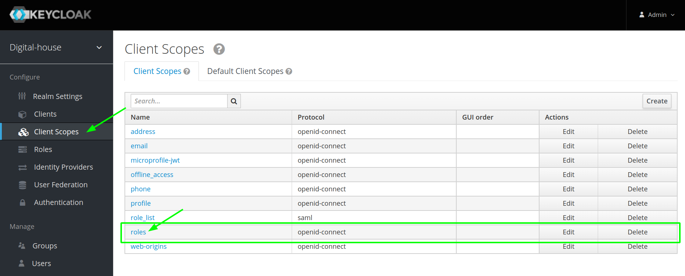

2. Establecer en ON la opción Include in Token Scope
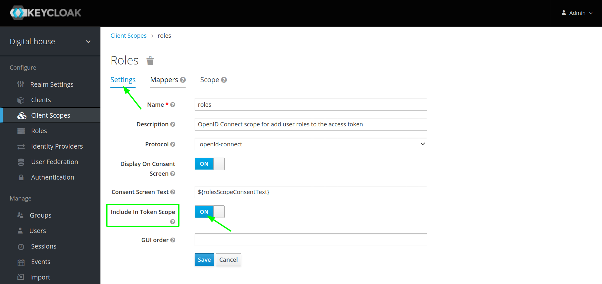

3. De esta manera, podremos ver el rol del usuario desde el ID token (por ejemplo, copiando el access token y decodificándolo como ya vimos previamente con la herramienta www.jwt.io)
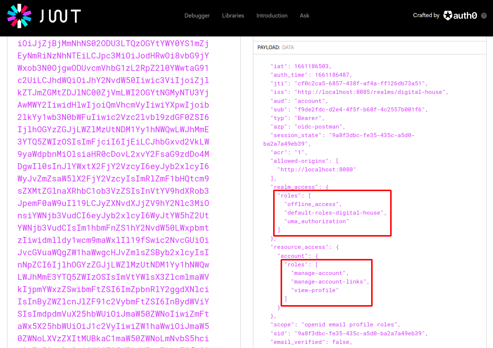

### Logout 

El proceso de cerrar una sesión consiste, simplemente, en invalidar todos los tokens de un usuario. Para hacer esto:

1. La aplicación (es decir, nosotros que estamos probando) enviará una petición al endpoint end_session_endpoint (podemos ver la URL en el JSON de resultado donde se listan todos los endpoints, el endpoint del Discovery)
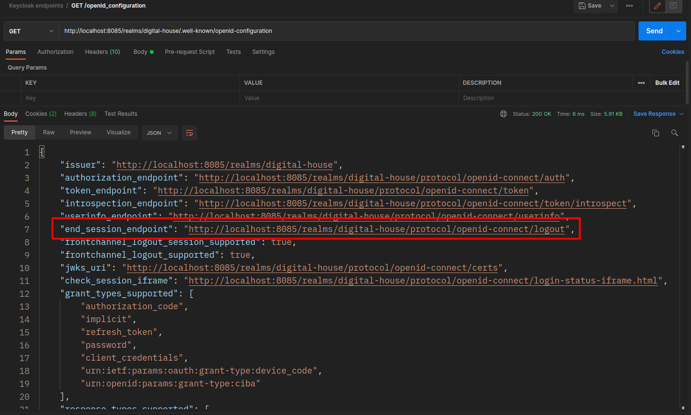

2. Además, debemos agregar como query param el id_token del usuario autenticado (el id_token podemos encontrarlo en el resultado del endpoint openid-connect/token)
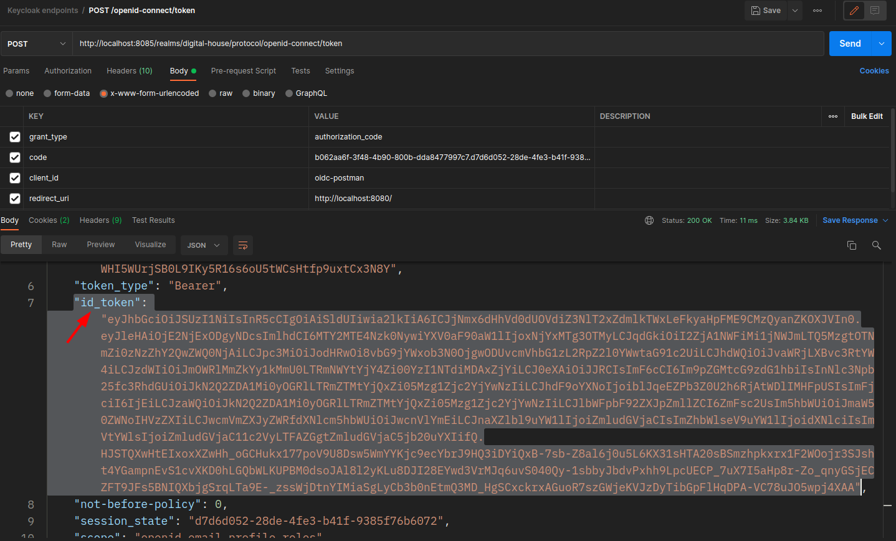

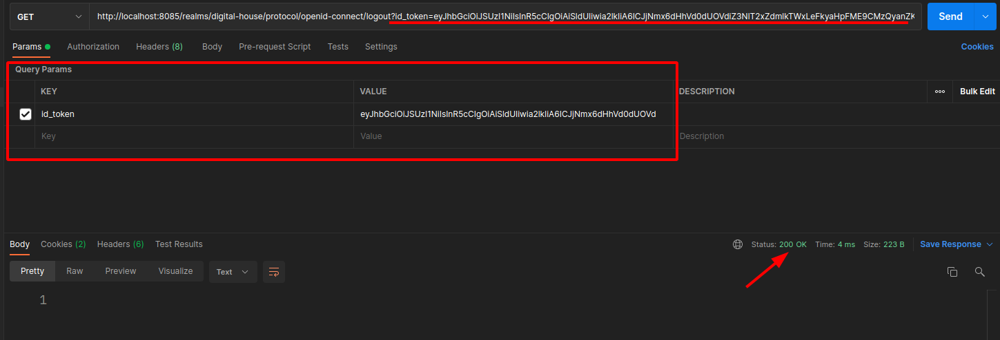

3. Keycloak recibirá la petición, avisará a los otros clientes con los que el usuario podría intentar conectarse y luego invalidará la sesión, es decir, no permitirá renovar nunca más el ID token utilizando el refresh token.

----------------------------------------

### Autenticación avanzada 
Los mecanismos de control de acceso se pueden definir como un componente lógico que sirve para capturar una solicitud de acceso (de un usuario/cliente), tomar una decisión y verificar que esa decisión de acceso se cumpla.

Existen diversas estrategias (cada una con sus puntos fuertes y débiles), pero no se puede decir que una sea superadora por sobre otra, sino que son distintos enfoques que —muy a menudo— se usan en forma conjunta para enfrentar escenarios complejos.

Conocer y comprender estos métodos y sus características es un buen punto de partida para aplicarlos en distintos casos de uso de forma eficaz y costo-eficiente.

Las estrategias de control de acceso sobre las cuales estaremos aprendiendo son:

1. RBAC (role-based access control)
2. ABAC (attribute-based access control)
3. Scopes de OAuth 2.0
4. GBAC (group-based access control)

### RBAC (role-based access control) 
Tradicionalmente, para garantizar la seguridad, el control de acceso se gestionaba de forma individual mediante listas de control de acceso (ACL o access control list). El problema de este tipo de mecanismo es que tanto el costo de mantenimiento como el número de errores de gestión aumentan a medida que crece el número de usuarios a gestionar.

El control de acceso basado en roles (de ahora en adelante, RBAC, y también conocido como seguridad basada en roles) es un mecanismo de control de acceso que define los roles y asigna permisos a los usuarios finales para determinar si se le debe dar acceso a un recurso.

El aprovisionamiento u otorgamiento de acceso de usuarios se basa en las necesidades de un grupo dentro de la compañía u organización y en función de responsabilidades y necesidades comunes. Esto significa que los roles se definen en función de características propias de la organización, como la ubicación, el departamento, la antigüedad o las funciones del usuario. Por otro lado, los permisos se asignan según el acceso (lo que el usuario puede ver), las operaciones (lo que el usuario puede hacer) y las sesiones (cuánto tiempo puede hacerlo el usuario).

Vamos a ver 3 reglas fundamentales por las cuales se rige el RBAC:

- Asignación de roles: un usuario solo puede ejercer privilegios si se le ha asignado un rol.
- Autorización basada en roles: dicho rol del usuario debe estar autorizado, lo que garantiza que los usuarios solo puedan asumir roles para los que están autorizados.
- Autorización de privilegios: un usuario puede ejercer ciertos privilegios si, por supuesto, está autorizado para hacerlo.

 
A diferencia de RBAC, en un sistema de control de acceso basado en atributos (ABAC), cualquier tipo de atributo —como los atributos de usuario y los atributos de recursos— se utilizan para determinar el acceso. Estos atributos se comparan con valores estáticos definidos o incluso con otros atributos, lo que lo convierte en un control de acceso basado en relaciones. Los atributos vienen en pares clave-valor (como "Rol = Supervisor"), que se pueden usar para limitar el acceso a una determinada característica de un sistema. Es decir, que este tipo de control utiliza los atributos que contiene el token e información sobre el contexto de autorización para conceder acceso a los recursos. Es probablemente el mecanismo de control más flexible y soporta de forma natural la autorización de accesos de granularidad fina.
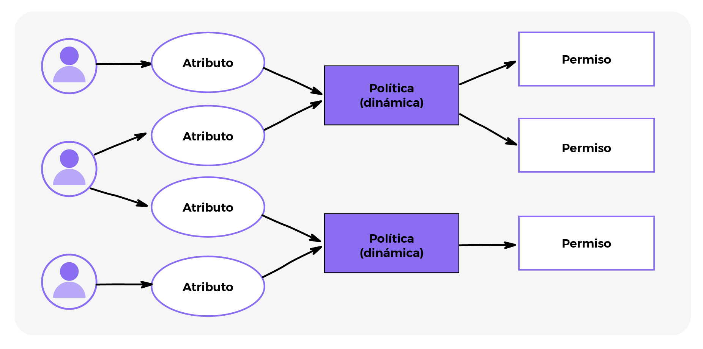

Como ya vimos, la autorización a partir de tokens se basa en realizar una introspección de los mismos y utilizar la información que contienen para así permitir el acceso a los recursos. Esta información se representa como un set de atributos, o claims, y son sus valores los que verificaremos para conceder el acceso.

### Roles dentro de Keycloak 
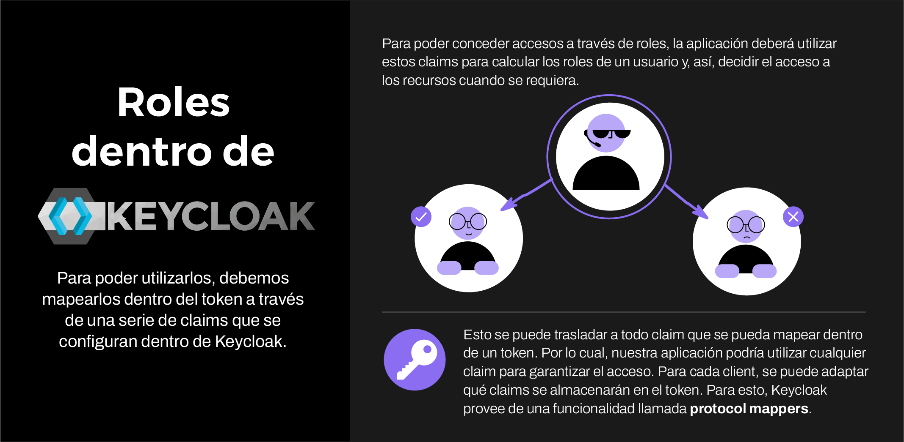

### OAuth 2.0 scopes 
Keycloak es, fundamentalmente, un servidor de autorización basado en OAuth 2.0. A OAuth 2.0 ya lo conocemos y lo revisamos a fondo en clases pasadas, pero repasemos un aspecto importante. En OAuth hay dos tipos de aplicaciones: clientes y servidores de recursos. Vimos también que los tokens se generan para que los clientes puedan actuar en nombre de un usuario y están limitados al alcance (scope) al que el usuario otorgue su consentimiento. Por otro lado, los servidores de recursos son los que, basándose en ese token, deciden si un cliente puede acceder a un recurso protegido.

¿Pero qué es el scope? Es el alcance de la autorización y se usa para restringir el acceso a los recursos. Cuando se solicita un access token del servidor de autorizaciones, la aplicación cliente incluirá un scope como parámetro de la petición, especificando una lista de scopes (alcances) o determinados accesos a los recursos del usuario, que el token generado debe tener.

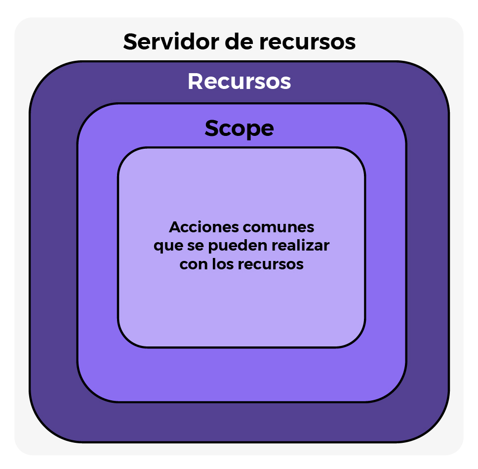

Por defecto, los clientes en Keycloak no están configurados para pedir consentimiento del usuario. Esto sucede porque usualmente se emplea dentro de un ámbito empresarial, donde los clientes se encuentran dentro de los límites de la organización y los recursos a los cuales se puede acceder no requieren del consentimiento del usuario. En su lugar, requieren de un permiso de acceso que se define de acuerdo a roles, atributos específicos de un usuario o incluso grupos de usuarios (como veremos más adelante).

La autorización mediante los scopes de OAuth 2.0 se basa solamente en el consentimiento del usuario. Es una mejor estrategia a la hora de integrar servicios de terceros en nuestra aplicación y, en este caso, el usuario tendrá la decisión a la hora de autorizar a una aplicación de terceros a acceder a sus recursos. Para implementar esta estrategia se deberá poner énfasis en proteger la información de los usuarios. Debemos entender que esta estrategia de autorización se enfoca en proteger a los recursos de otros clientes (aplicaciones o servicios). Esto difiere de las estrategias que vimos anteriormente, como RBAC, en la cual se protege a los recursos de los usuarios.

### GBAC (group-based access control) 
Keycloak nos permite administrar grupos (groups) dentro de nuestro reino. Los usuarios pueden formar parte de un group ya sea para representar su función dentro de una unidad de negocio de la organización o para agruparlos de acuerdo a los roles que cumplen dentro del contexto de nuestra aplicación —como podría ser, por ejemplo, un grupo de usuarios administradores—. Aquí entra en juego GBAC, asignando roles a los groups. De esta manera, Keycloak hace mucho más fácil la tarea de administrar roles comunes para múltiples usuarios sin obligarnos a otorgar o revocar roles a cada usuario de forma individual dentro del reino.

Los groups dentro de Keycloak son jerárquicos y, cuando se emiten los tokens, se puede atravesar esta jerarquía observando el path del group. Supongamos un ejemplo: tenemos un group de recursos humanos llamado “human resource”. Como hijo de este group, tenemos un grupo de administradores llamado “manager”. Cuando Keycloak almacena información sobre groups dentro de los tokens, la información debería llegar en el siguiente formato: /human resource/manager. Esta información estará disponible para cada token emitido por el servidor, donde el sujeto (usuario) sea miembro del group.

A diferencia de los roles, la información sobre el group no se incluye de forma automática dentro de los tokens, sino que debemos asociar un protocolo de mapeo al client (o un client scope con el mismo mapeo).

[Mapear membresías](./clase%203%20y%204%20-%2022%20de%20feb%20de%202023/2.%20Mapear%20membres%C3%ADas%20de%20groups%20dentro%20del%20token.pdf)

### Repaso 
1. ¿Qué mecanismo conviene utilizar a la hora de autorizar aplicaciones de terceros? 
* [ ] ABAC
* [ ] RBAC
* [ ] GBAC
* [X] OAuth 2.0 scopes

2. Los tokens emitidos por Keycloak no pueden guardar información sobre grupos. 
* [ ]  Verdadero
* [X]  Falso

3. No se puede implementar más de un mecanismo de control en una aplicación. 
* [ ]  Verdadero
* [X]  Falso

4.  ¿Qué mecanismos pueden aprovechar los roles de Keycloak para autorizar accesos? 
* [X] ABAC
* [X] RBAC
* [X] GBAC
* [ ] OAuth 2.0 scopes

5. Por más que tengamos un servicio de autorización centralizado, podemos aplicar autorizaciones específicas a nivel de aplicación. 
* [X] Verdadero
* [ ] Falso

6. Se recomienda crear una gran cantidad de roles para autorizar los accesos a nuestros recursos. 
* [ ]  Verdadero
* [X]  Falso

7. Keycloak nos permite encadenar varios roles en uno solo.
* [X] Verdadero
* [ ] Falso

8. Sobre los grupos de Keycloak: 
* [X] Pueden tener roles.
* [ ] Por defecto, son incluidos dentro del token.
* [ ] Un usuario no puede pertenecer a más de un grupo.
* [ ] Pueden tener grupos hijos o padres.

9. Sobre Keycloak como servidor centralizado: 
* [ ] Acopla la lógica de autorización a las aplicaciones.
* [ ] No permite el uso de ABAC.
* [X] Aprovecha el uso de los protocol mappers.

---------------------

### Tokens y sesiones 
Keycloak es —en esencia— un sistema de gestión de tokens y sesiones.

Como parte del proceso de autenticación, Keycloak puede crear sesiones del lado del servidor y correlacionarse con tokens. Con las sesiones, Keycloak puede mantener el estado del contexto de autenticación donde se originaron las sesiones, rastrear la actividad de los usuarios y clientes, verificar la validez de los tokens y decir cuándo los usuarios y clientes deben volver a autenticarse.

### Gestión de sesiones 
La gestión de sesiones tiene un impacto directo en algunos aspectos clave, como la experiencia del usuario, la seguridad y el rendimiento. Veamos cada caso.

- Experiencia del usuario
Keycloak se basa en las sesiones para determinar si los usuarios y clientes están autenticados, durante cuánto tiempo deben estar autenticados y cuándo es el momento de volver a autenticarse. Esta característica de las sesiones es básicamente lo que brinda a los usuarios la experiencia de inicio de sesión único (single sign-on), ya que —al autenticarse— la sesión será válida para todos los clientes dentro del mismo reino.

- Seguridad
Las sesiones brindan una capa de seguridad para rastrear y controlar la actividad del usuario y para asegurarse de que los tokens emitidos a los clientes sigan siendo válidos. También son importantes para limitar y controlar el tiempo que los usuarios podrán permanecer conectados a un reino.

- Rendimiento
Las sesiones se guardan en la memoria y tienen un impacto directo en el rendimiento general de Keycloak. Este almacena sesiones en cachés, donde la cantidad de sesiones activas y el tiempo que se mantienen vivas son factores clave que deben equilibrarse para optimizar la memoria y los recursos.

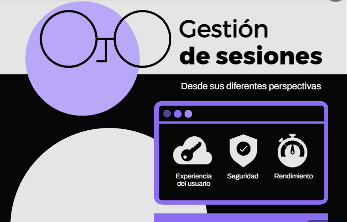

[Presentación genially](https://view.genial.ly/62b495c9933c580011b7dd38)

### Tiempo de vida de una sesión 
La duración de la sesión determina cuándo las sesiones deben caducar y destruirse. Una vez que expira, los usuarios y clientes asociados con estas sesiones ya no se encuentran autenticados y se ven obligados a volver a autenticarse para establecer una nueva sesión.

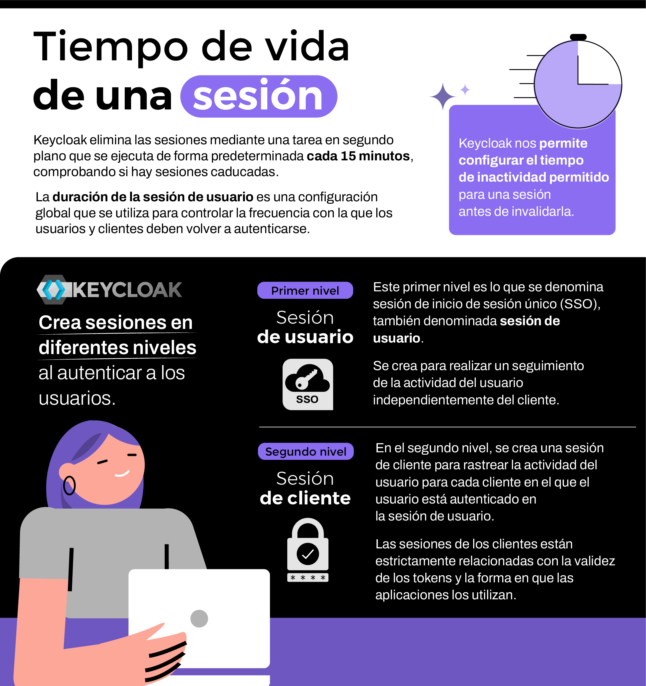
[Ejercicio Práctico](./clase%205%20y%206/3.%20Configurando%20el%20tiempo%20de%20expiraci%C3%B3n%20y%20de%20inactividad.pdf)

### Forzar expiración de una sesión 
Podemos administrar las sesiones a través de tres niveles:
* Por reino
* Por cliente
* Por usuario

A nivel de reino podemos ver las sesiones activas agrupadas por cliente. Para visualizar esto debemos ir a “Sessions” y luego a la pestaña “Realm Sessions”.
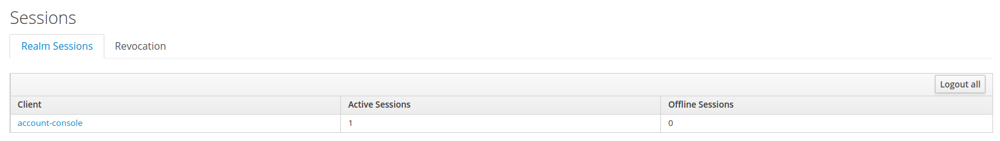

Tenemos la opción de realizar un logout de todas las sesiones haciendo clic en el botón “Logout all”.

A nivel de cliente, podemos ver qué usuarios tienen una sesión activa. Tan solo debemos ir al cliente que queremos analizar y luego a la pestaña “Sessions”. Ahí podemos ver el listado de usuarios.
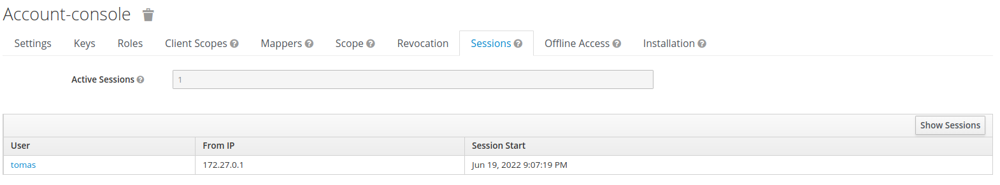

Para cerrar la sesión de un usuario en particular debemos hacer clic en el usuario y, luego, en la pestaña “Sessions” podemos cerrar todas las sesiones o alguna en particular.
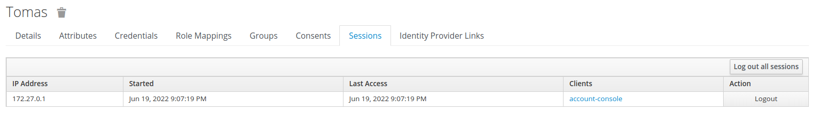

### Gestionando tokens 
Los tokens tienen su propia vida útil y su duración depende en cómo son validados. Configurando JSON Web Token (JWT) como formato de tokens, Keycloak habilita a las aplicaciones a validar e inspeccionar los tokens localmente, sin una llamada adicional al servidor. Obviamente, la consecuencia de este proceso es que la sesión asociada al token puede haber sido invalidada o expirada.

¿Cómo evitar esta vulnerabilidad?
Debemos considerar siempre una estrategia clara de expiración de tokens y establecer cuándo las aplicaciones deben obtener los tokens, utilizando:

* ID token
* Access token
* Refresh token

Cada uno de estos tokens tiene una vida útil. Para el caso de ID token y access token es la misma vida útil, generalmente corta, ya que son utilizados por clientes públicos como una aplicación de única página —o SPA—, donde el guardado de tokens no es seguro. Cabe destacar que el access token se envía en cada petición para identificar al token de la sesión del momento. Por último, tenemos el refresh token, que debe tener una vida útil mayor a los otros dos dada su naturaleza de recrear el access token para mantener el acceso seguro a la aplicación.
------------------------------------

### Integración de Keycload con Spring boot 
Keycloak —si bien tiene una plataforma que nos permite realizar todas las configuraciones y poder ver y gestionar permisos, grupos, ambientes, dominios, etc.— es un proveedor… y, como proveedor, ofrece esos servicios a una aplicación que estará funcionando como “consumidor” de los servicios de Keycloak.

¿Qué significa esto? Significa que habrá un back end en donde se alojará la configuración de seguridad que provee Keycloak. En nuestro caso, Keycloak, como ya vimos, va a generar un token en forma de JSON donde se almacenarán los datos propios del usuario, así como información de contexto que permita al IAM realizar sucesivas validaciones, como el día y fecha exacta de login, entre otras.

En esta clase, vamos a ver que podemos limitar el acceso a nuestras API (back end) utilizando diferentes datos del usuario —como los roles, el scope o la audiencia—. Esto podemos hacerlo en un solo proyecto aislado o en una serie de proyectos, por ejemplo, en una arquitectura de microservicios (servicios cloud), en donde veremos dos posibilidades de configuración.

[Configuración](./clase%207%20-%20feb%2027%20de%202023/2.%20Configuraci%C3%B3n%20de%20Seguridad%20en%20Key%20Cloack.pdf)

### Integración Keycloak con back end 

En una primera instancia, configuramos Keycloak para que tenga un realm (el ambiente o dominio de la aplicación), un cliente (que es quién va a estar solicitando la autenticación del usuario) y un usuario de ejemplo (quien va a estar tratando de autenticarse). Pero todo esto lo hicimos desde la misma plataforma. En la vida real, habrá una aplicación que consuma los endpoints que pone a disposición el IAM, nuestro querido Keycloak. Ese servicio puede ser un back end, el cual tiene la posibilidad de ser de diversos tipos.

Nosotros vamos a crear uno básico, con una arquitectura familiar y un framework ya conocido por nosotros: una API REST con Spring Boot. Esta aplicación será la elegida para solicitar la autenticación del usuario, elegir el IAM que provee los mecanismos de seguridad (mediante URL, como venimos observando con Keycloak) y requerir las credenciales adecuadas para ese usuario.

[Configuración](./clase%207%20-%20feb%2027%20de%202023/2.%20Crear%20una%20aplicaci%C3%B3n%20en%20Springboot.pdf)

### Integración de Keycloak con Spring Cloud 
Pensando en una arquitectura cloud, vamos a ver dos opciones posibles para agregar el proveedor de seguridad: en el gateway (pensando que todas las peticiones pasan por ese microservicio) o por medio de un componente externo que se encargará de validar la autenticación del usuario.

Estos dos tipos de arquitecturas de integración son:

1.  Integración embebida en nuestra aplicación.
2.  Integración mediante el uso de un proxy inverso.

1. Integrar de forma embebida Keycloak con Spring Cloud:
[Configuración integración embebida](./clase%207%20-%20feb%2027%20de%202023/4.%20Integraci%C3%B3n%20embebida%20utilizando%20Spring%20Cloud%20Gateway%20.html)

2. Implementar e integrar Keycloak con una integración por medio de proxy.
[Configuración integración proxy](./clase%207%20-%20feb%2027%20de%202023/6.%20Instalaci%C3%B3n%20de%20Oauth2%20Proxy%20.pdf)
